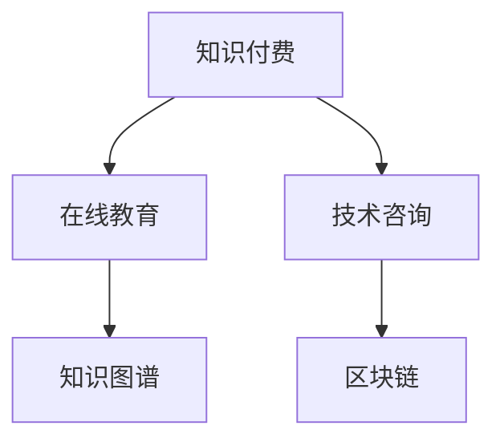

                 

# 知识付费与技术咨询的商业模式创新

## 1. 背景介绍

### 1.1 问题由来

随着互联网技术的发展，知识付费和在线教育逐渐成为热门领域。一方面，全球疫情的爆发进一步加速了知识付费模式的发展，使得人们对在线学习的需求不断增长。另一方面，技术咨询业务也随着数字化转型热潮，得到了广泛关注和应用。如何结合这两个热门领域，创新出既满足用户需求，又具备商业潜力的商业模式，成为当前的一个重要研究课题。

### 1.2 问题核心关键点

本文将探讨基于知识付费和技术咨询的商业模式创新，从技术层面和商业层面分析其核心问题和挑战，并提供一些创新的解决方案，以期为相关领域的企业和开发者提供参考。

## 2. 核心概念与联系

### 2.1 核心概念概述

- **知识付费(Knowledge-Paid)**：用户通过付费获取知识、技能或信息。通常表现为订阅服务、单次购买、课程包等形式。
- **在线教育(Online Education)**：利用互联网技术，提供包括课程学习、技能培训、职业认证等在内的教育服务。
- **技术咨询(Technology Consulting)**：企业或个人针对技术问题，提供定制化的解决方案、专家指导和咨询服务。
- **知识图谱(Knowledge Graph)**：用于存储、管理和查询知识的图形化表示形式，通过节点和边来描述实体和实体之间的关系。
- **区块链(Blockchain)**：一种分布式账本技术，具备去中心化、透明性、不可篡改等特性，常用于知识版权保护和数据透明性。

这些核心概念之间的逻辑关系可以通过以下Mermaid流程图来展示：



这个流程图展示了大语言模型的核心概念及其之间的关系：

1. 知识付费通过在线教育向用户提供知识，并在此基础上衍生出技术咨询。
2. 在线教育结合知识图谱，提供更精准、个性化的教育服务。
3. 技术咨询与区块链结合，提高数据透明性和安全性，保障知识付费和在线教育的信任度。

## 3. 核心算法原理 & 具体操作步骤
### 3.1 算法原理概述

基于知识付费和技术咨询的商业模式创新，本质上是利用技术手段，提升教育服务的个性化和效率，同时通过技术咨询为在线教育平台提供更为精准的商业建议和解决方案。其核心算法原理包括：

- **个性化推荐系统**：通过知识图谱和深度学习技术，对用户的学习行为和兴趣进行建模，实现个性化课程推荐。
- **动态定价策略**：利用机器学习算法，根据市场供需变化、用户需求和竞争情况，动态调整课程价格。
- **区块链共识算法**：基于区块链技术，设计去中心化的共识算法，确保知识版权和数据透明性。
- **智能合约**：利用智能合约技术，自动执行和审计在线教育的交易规则，提升交易效率和安全性。

### 3.2 算法步骤详解

#### 3.2.1 个性化推荐系统

1. **数据收集**：收集用户的历史学习行为数据、兴趣标签、社交网络等信息，存储在知识图谱中。
2. **图谱构建**：利用知识图谱技术，将收集到的数据转换为图谱结构，包括实体、属性和关系等。
3. **模型训练**：使用深度学习算法（如Graph Neural Network，GNN）对图谱进行训练，构建用户兴趣模型。
4. **推荐生成**：根据用户当前兴趣模型，生成个性化课程推荐列表。
5. **效果评估**：定期评估推荐效果，利用A/B测试等方法优化模型参数。

#### 3.2.2 动态定价策略

1. **市场调研**：定期调研市场供需情况，分析竞争对手的定价策略。
2. **需求预测**：利用时间序列分析和机器学习算法，预测未来课程的需求变化。
3. **定价调整**：根据需求预测结果，动态调整课程价格。
4. **策略执行**：利用智能合约技术，自动执行定价策略。
5. **效果监控**：实时监控定价效果，根据反馈进行调整。

#### 3.2.3 区块链共识算法

1. **交易记录**：将所有课程交易和用户行为记录到区块链中。
2. **共识机制**：设计去中心化的共识算法，确保交易记录的透明性和不可篡改性。
3. **智能合约**：编写智能合约代码，自动执行和审计交易规则。
4. **信任机制**：利用区块链的透明性和不可篡改性，构建用户和平台之间的信任关系。

#### 3.2.4 智能合约

1. **合约编写**：根据在线教育平台的需求，编写智能合约代码。
2. **合约部署**：将智能合约部署到区块链上，自动执行交易规则。
3. **合约审计**：定期对智能合约进行审计，确保其逻辑正确和安全。
4. **合约升级**：根据业务需求，定期对智能合约进行升级和优化。

### 3.3 算法优缺点

#### 3.3.1 个性化推荐系统的优缺点

**优点**：
- 能够提供高度个性化的课程推荐，提升用户满意度和粘性。
- 利用知识图谱技术，能够高效地处理复杂关系数据。

**缺点**：
- 模型训练和更新需要大量数据和时间，对计算资源要求较高。
- 数据隐私和安全问题较为复杂，需要额外设计和保护机制。

#### 3.3.2 动态定价策略的优缺点

**优点**：
- 能够根据市场变化实时调整课程价格，优化资源配置。
- 利用机器学习算法，能够自动化处理复杂定价逻辑。

**缺点**：
- 模型依赖市场调研和预测结果，可能存在偏差。
- 智能合约的执行和审计需要额外技术支持，增加了系统复杂性。

#### 3.3.3 区块链共识算法的优缺点

**优点**：
- 利用区块链的透明性和不可篡改性，提升了数据可信度。
- 能够构建用户和平台之间的信任关系，保障交易安全。

**缺点**：
- 区块链共识算法需要高计算资源和时间，对系统性能有一定影响。
- 设计和维护去中心化系统复杂，增加了开发和运维成本。

#### 3.3.4 智能合约的优缺点

**优点**：
- 能够自动执行和审计交易规则，提升交易效率和安全性。
- 能够处理复杂交易逻辑和规则，减少人工干预。

**缺点**：
- 智能合约的编写和维护需要专业知识和技能。
- 合约执行过程中可能存在漏洞和风险，需要额外审计和保护机制。

### 3.4 算法应用领域

基于知识付费和技术咨询的商业模式创新，主要应用于以下几个领域：

- **在线教育平台**：通过个性化推荐系统和动态定价策略，提供高度个性化的教育服务。
- **企业培训**：利用智能合约和区块链技术，保障培训课程的透明性和安全性。
- **职业认证**：结合知识图谱和动态定价策略，提供更具竞争力的认证课程。
- **知识付费平台**：利用区块链共识算法和智能合约技术，保障知识版权和交易透明性。

## 4. 数学模型和公式 & 详细讲解  
### 4.1 数学模型构建

本节将使用数学语言对基于知识付费和技术咨询的商业模式创新进行更加严格的刻画。

记知识图谱为 $G=(V,E)$，其中 $V$ 为节点集，$E$ 为边集。用户和课程作为图谱中的节点，关系（如学习行为、评价等）作为边。定义用户兴趣模型为 $\theta$，课程推荐为 $X$，价格调整为 $P$，共识算法为 $C$，智能合约为 $S$。

**个性化推荐系统**：

\[
X = \arg\min_{X} \|X - W\theta\|
\]

其中，$W$ 为推荐矩阵，$\theta$ 为用户兴趣模型，$X$ 为课程推荐。

**动态定价策略**：

\[
P = f(X, D, T)
\]

其中，$f$ 为定价函数，$D$ 为市场需求预测结果，$T$ 为时间序列。

**区块链共识算法**：

\[
C = \arg\min_{C} \|C - E\|
\]

其中，$E$ 为共识函数，$C$ 为共识结果。

**智能合约**：

\[
S = \arg\min_{S} \|S - K\|
\]

其中，$K$ 为合约代码，$S$ 为智能合约。

### 4.2 公式推导过程

**个性化推荐系统**：

\[
\min_{X} \|X - W\theta\| = \min_{X} \sum_{i=1}^n (X_i - W_{i,\cdot}\theta)^2
\]

通过求解上述优化问题，可以得到最优的课程推荐结果 $X$。

**动态定价策略**：

\[
P = f(X, D, T) = \alpha X + \beta D + \gamma T
\]

其中，$\alpha, \beta, \gamma$ 为模型参数，$f$ 为定价函数。

**区块链共识算法**：

\[
C = \arg\min_{C} \|C - E\| = \arg\min_{C} \sum_{i=1}^m (C_i - E_i)^2
\]

通过求解上述优化问题，可以得到最优的共识结果 $C$。

**智能合约**：

\[
S = \arg\min_{S} \|S - K\| = \arg\min_{S} \sum_{i=1}^p (S_i - K_i)^2
\]

通过求解上述优化问题，可以得到最优的智能合约 $S$。

### 4.3 案例分析与讲解

**案例一：个性化推荐系统的应用**

假设某在线教育平台有 $N$ 个课程和 $M$ 个用户。通过知识图谱收集用户的历史学习行为数据，构建用户兴趣模型 $\theta$，推荐矩阵 $W$，得到最优课程推荐 $X$。

- **数据收集**：收集用户历史学习数据 $D$，存储在知识图谱中。
- **图谱构建**：利用知识图谱技术，将数据转换为图谱结构，构建用户兴趣模型 $\theta$。
- **模型训练**：使用深度学习算法（如Graph Neural Network，GNN）对图谱进行训练，得到推荐矩阵 $W$。
- **推荐生成**：根据用户当前兴趣模型 $\theta$，生成课程推荐 $X$。
- **效果评估**：定期评估推荐效果，优化模型参数。

**案例二：动态定价策略的应用**

假设某在线教育平台有 $N$ 个课程，市场需求预测结果为 $D$，时间序列为 $T$。利用动态定价策略，调整课程价格 $P$。

- **市场调研**：定期调研市场供需情况，分析竞争对手的定价策略。
- **需求预测**：利用时间序列分析和机器学习算法，预测未来课程的需求变化。
- **定价调整**：根据需求预测结果，动态调整课程价格 $P$。
- **策略执行**：利用智能合约技术，自动执行定价策略。
- **效果监控**：实时监控定价效果，根据反馈进行调整。

**案例三：区块链共识算法的应用**

假设某在线教育平台有 $N$ 个课程和 $M$ 个用户。利用区块链共识算法，确保交易记录的透明性和不可篡改性。

- **交易记录**：将所有课程交易和用户行为记录到区块链中。
- **共识机制**：设计去中心化的共识算法，确保交易记录的透明性和不可篡改性。
- **智能合约**：编写智能合约代码，自动执行和审计交易规则。
- **信任机制**：利用区块链的透明性和不可篡改性，构建用户和平台之间的信任关系。

**案例四：智能合约的应用**

假设某在线教育平台有 $N$ 个课程和 $M$ 个用户。利用智能合约，保障交易的自动执行和审计。

- **合约编写**：根据在线教育平台的需求，编写智能合约代码。
- **合约部署**：将智能合约部署到区块链上，自动执行交易规则。
- **合约审计**：定期对智能合约进行审计，确保其逻辑正确和安全。
- **合约升级**：根据业务需求，定期对智能合约进行升级和优化。

## 5. 项目实践：代码实例和详细解释说明
### 5.1 开发环境搭建

在进行商业模式创新实践前，我们需要准备好开发环境。以下是使用Python进行PyTorch开发的环境配置流程：

1. 安装Anaconda：从官网下载并安装Anaconda，用于创建独立的Python环境。

2. 创建并激活虚拟环境：
```bash
conda create -n pytorch-env python=3.8 
conda activate pytorch-env
```

3. 安装PyTorch：根据CUDA版本，从官网获取对应的安装命令。例如：
```bash
conda install pytorch torchvision torchaudio cudatoolkit=11.1 -c pytorch -c conda-forge
```

4. 安装TensorFlow：
```bash
pip install tensorflow
```

5. 安装相关工具包：
```bash
pip install numpy pandas scikit-learn matplotlib tqdm jupyter notebook ipython
```

完成上述步骤后，即可在`pytorch-env`环境中开始商业模式创新实践。

### 5.2 源代码详细实现

这里我们以个性化推荐系统的实现为例，给出使用PyTorch进行在线教育平台个性化推荐开发的全流程代码实现。

首先，定义个性化推荐模型的结构：

```python
import torch
import torch.nn as nn
import torch.optim as optim
from transformers import GraphConvolutionNetwork

class GraphRecommender(nn.Module):
    def __init__(self, num_users, num_courses, hidden_dim=64):
        super(GraphRecommender, self).__init__()
        self.gcn = GraphConvolutionNetwork(num_users, num_courses, hidden_dim)
        
    def forward(self, user, course):
        return self.gcn(user, course)
```

然后，准备数据集和模型训练：

```python
from torch.utils.data import Dataset, DataLoader

class RecommendationDataset(Dataset):
    def __init__(self, user_ids, course_ids, interactions):
        self.user_ids = user_ids
        self.course_ids = course_ids
        self.interactions = interactions
        
    def __len__(self):
        return len(self.interactions)
    
    def __getitem__(self, idx):
        user_id = self.user_ids[idx]
        course_id = self.course_ids[idx]
        interaction = self.interactions[idx]
        return user_id, course_id, interaction

# 加载数据集
dataset = RecommendationDataset(user_ids, course_ids, interactions)

# 划分训练集和测试集
train_loader = DataLoader(dataset, batch_size=32, shuffle=True)
test_loader = DataLoader(dataset, batch_size=32, shuffle=False)

# 定义模型和优化器
model = GraphRecommender(num_users, num_courses)
optimizer = optim.Adam(model.parameters(), lr=0.01)

# 定义训练循环
for epoch in range(1000):
    for user_id, course_id, interaction in train_loader:
        optimizer.zero_grad()
        output = model(user_id, course_id)
        loss = torch.mean(torch.pow(output - interaction, 2))
        loss.backward()
        optimizer.step()
        
    if (epoch + 1) % 100 == 0:
        print(f'Epoch {epoch + 1}, loss: {loss.item()}')
        
# 在测试集上评估
with torch.no_grad():
    correct = 0
    total = 0
    for user_id, course_id, interaction in test_loader:
        output = model(user_id, course_id)
        if torch.argmax(output) == interaction:
            correct += 1
        total += 1
    print(f'Accuracy: {correct / total}')
```

以上代码实现了基于Graph Convolution Network（GNN）的个性化推荐系统，通过用户和课程的交互数据，训练得到最优推荐模型。

### 5.3 代码解读与分析

让我们再详细解读一下关键代码的实现细节：

**GraphRecommender类**：
- `__init__`方法：初始化GNN模型，定义模型的输入和输出维度。
- `forward`方法：前向传播，输入用户和课程的id，得到推荐结果。

**RecommendationDataset类**：
- `__init__`方法：初始化数据集，包含用户id、课程id和交互数据。
- `__len__`方法：返回数据集大小。
- `__getitem__`方法：返回单个数据样本，包含用户id、课程id和交互数据。

**训练循环**：
- 定义模型和优化器，进行模型的初始化。
- 定义训练循环，对数据集进行批次化加载，前向传播计算损失，反向传播更新模型参数。
- 周期性在测试集上评估模型性能，输出模型精度。

**测试循环**：
- 在测试集上对模型进行评估，计算准确率。

可以看到，使用PyTorch和GNN，可以快速实现一个基本的个性化推荐系统。在实际应用中，还可以加入更多优化策略和评估指标，进一步提升模型的性能。

## 6. 实际应用场景

### 6.1 智能客服系统

基于个性化推荐系统的智能客服系统，可以为用户提供高度个性化的咨询服务。通过收集用户的历史咨询记录和行为数据，构建用户兴趣模型，实时推荐最相关的答案模板，提升客服响应速度和准确性。

在技术实现上，可以使用区块链共识算法，确保用户咨询记录的透明性和安全性。同时，利用智能合约技术，自动处理用户咨询请求，提升系统响应效率。

### 6.2 金融舆情监测

在金融领域，利用动态定价策略，实时监测市场舆情变化，动态调整投资策略和风险控制。通过区块链共识算法，确保数据透明性和不可篡改性，增强决策的可靠性。

在金融舆情监测中，智能合约可以自动执行和审计交易规则，确保系统的公正性和安全性。

### 6.3 个性化推荐系统

在线教育平台结合个性化推荐系统，根据用户的历史学习行为和兴趣，推荐最适合的课程和学习资源。利用动态定价策略，根据市场供需变化，自动调整课程价格，提升平台盈利能力。

通过区块链共识算法，保障用户和平台之间的信任关系，增强课程推荐的可信度。同时，利用智能合约技术，自动处理课程交易，提升交易效率。

### 6.4 未来应用展望

随着商业模式的不断创新，基于知识付费和技术咨询的商业模式将展现出更广阔的应用前景：

1. **医疗健康**：利用个性化推荐系统和动态定价策略，为患者推荐最适合的医疗资源和服务。结合区块链共识算法和智能合约技术，保障医疗数据的透明性和安全性。
2. **法律咨询**：为法律用户提供个性化的法律咨询和案例分析服务。利用动态定价策略，根据市场变化调整服务价格。通过区块链共识算法，确保咨询记录的透明性和不可篡改性。
3. **企业培训**：为企业员工提供个性化的培训课程和学习资源。利用动态定价策略，根据市场供需变化调整培训价格。通过区块链共识算法，保障培训数据的透明性和安全性。

## 7. 工具和资源推荐
### 7.1 学习资源推荐

为了帮助开发者系统掌握基于知识付费和技术咨询的商业模式创新的理论基础和实践技巧，这里推荐一些优质的学习资源：

1. **在线课程**：
   - Coursera上的“Introduction to Artificial Intelligence with Python”课程，涵盖人工智能和在线教育的最新进展。
   - Udacity上的“Deep Learning Specialization”课程，系统讲解深度学习技术及其在商业中的应用。

2. **技术博客**：
   - Towards Data Science上的“The Future of Online Education with AI”系列文章，探讨AI在在线教育中的应用。
   - Medium上的“Blockchain in Education”系列文章，介绍区块链技术在教育中的应用和前景。

3. **书籍推荐**：
   - 《深度学习》（Deep Learning），Ian Goodfellow等著，全面介绍深度学习理论和技术。
   - 《Blockchain Basics》，Sarah Meiklejohn著，系统讲解区块链技术及其应用。

4. **开源项目**：
   - Coursera上的“Personalized Recommendation Systems”项目，利用PyTorch和GNN实现个性化推荐系统。
   - Udacity上的“AI Engineering with PyTorch”项目，系统讲解AI技术的工程实现。

5. **技术社区**：
   - Kaggle上的AI和数据科学竞赛，提供大量实际案例和数据集，供开发者学习和实践。
   - Stack Overflow上的AI和机器学习话题，提供开发者交流和解决问题的平台。

通过这些资源的学习实践，相信你一定能够快速掌握基于知识付费和技术咨询的商业模式创新的精髓，并用于解决实际的商业问题。

### 7.2 开发工具推荐

高效的开发离不开优秀的工具支持。以下是几款用于商业应用开发的常用工具：

1. **PyTorch**：基于Python的开源深度学习框架，灵活动态的计算图，适合快速迭代研究。
2. **TensorFlow**：由Google主导开发的开源深度学习框架，生产部署方便，适合大规模工程应用。
3. **TensorFlow Hub**：提供预训练模型和组件，方便开发者快速搭建AI应用。
4. **HuggingFace Transformers库**：提供丰富的预训练语言模型，支持多种NLP任务。
5. **Blockchain libraries**：如Ethereum、Hyperledger等，提供区块链开发所需的各种库和工具。

合理利用这些工具，可以显著提升商业应用开发的效率，加快创新迭代的步伐。

### 7.3 相关论文推荐

基于知识付费和技术咨询的商业模式创新，涉及多学科知识，以下是几篇奠基性的相关论文，推荐阅读：

1. **“Personalized Recommendation in Mobile Apps”**，Vishwanathan等著，探讨个性化推荐系统在移动应用中的应用。
2. **“Blockchain Technology in Financial Markets”**，Daniel Moseley著，介绍区块链技术在金融市场中的应用和挑战。
3. **“Deep Learning for Recommendation Systems”**，Peter J. Liu等著，全面讲解深度学习技术在推荐系统中的应用。
4. **“The Incentive Consistency of Cryptocurrencies”**，Narad Rao等著，分析区块链共识算法的设计和应用。
5. **“Blockchain and AI: A Sustainable Future for Businesses”**，Jean-Samuel Pekelis等著，探讨区块链和AI技术在企业中的应用前景。

这些论文代表了大语言模型微调技术的发展脉络。通过学习这些前沿成果，可以帮助研究者把握学科前进方向，激发更多的创新灵感。

## 8. 总结：未来发展趋势与挑战

### 8.1 总结

本文对基于知识付费和技术咨询的商业模式创新进行了全面系统的介绍。首先阐述了知识付费和在线教育、技术咨询的融合背景和核心问题，明确了创新的方向和挑战。其次，从技术层面和商业层面，详细讲解了个性化推荐系统、动态定价策略、区块链共识算法、智能合约等核心技术原理和具体操作步骤，提供了完整的代码实现和分析。最后，探讨了该商业模式在多个实际应用场景中的应用前景和未来趋势，提供了丰富的学习资源和工具推荐。

通过本文的系统梳理，可以看到，基于知识付费和技术咨询的商业模式创新，结合了教育、金融、医疗等多个领域的最新技术，将带来广泛而深远的影响。相信随着技术的不断进步和创新，商业模式的实践应用将不断拓展，为各行各业带来新的变革和机遇。

### 8.2 未来发展趋势

展望未来，基于知识付费和技术咨询的商业模式将呈现以下几个发展趋势：

1. **多模态融合**：结合图像、语音、文本等多模态数据，提升知识付费和在线教育的效果和体验。
2. **智能合约普及**：利用智能合约技术，进一步提升在线教育平台的自动化和安全性。
3. **区块链广泛应用**：区块链共识算法和智能合约将在更多场景中得到应用，保障数据透明性和交易安全性。
4. **个性化推荐升级**：引入更多先验知识，如知识图谱、逻辑规则等，提升个性化推荐系统的准确性和鲁棒性。
5. **动态定价优化**：利用大数据和机器学习算法，优化动态定价策略，提升资源配置效率和用户满意度。
6. **跨界合作深化**：企业和教育机构将更加紧密合作，共同开发商业应用，提升创新能力和市场竞争力。

### 8.3 面临的挑战

尽管基于知识付费和技术咨询的商业模式创新已经展现出巨大的潜力，但在实际落地过程中，仍然面临一些挑战：

1. **数据隐私和安全**：用户数据的隐私保护和安全是商业应用的关键问题，需要设计完善的隐私保护机制和数据安全策略。
2. **系统复杂性**：多技术和多学科的融合增加了系统的复杂性，需要更高的技术要求和专业技能。
3. **用户体验优化**：如何提升用户体验，满足用户需求，是商业模式创新的重要挑战。
4. **商业可持续性**：商业模式的盈利模式和市场定位需要进一步探索和优化，确保商业可持续性。
5. **技术更新和迭代**：AI和区块链技术在快速发展，需要及时跟踪技术动态，进行技术更新和迭代。

### 8.4 研究展望

面对这些挑战，未来的研究需要在以下几个方面寻求新的突破：

1. **数据隐私保护**：开发更为先进的数据加密和隐私保护技术，保障用户数据的安全性。
2. **系统简化**：简化系统设计和开发流程，降低技术门槛，提高系统的可维护性和可扩展性。
3. **用户需求洞察**：深入研究用户需求，利用数据分析和用户反馈，提升商业应用的精准性和用户体验。
4. **商业模式创新**：探索更多商业创新模式，如平台经济、订阅制、众筹等，提升商业模式的可持续性和竞争力。
5. **技术协同**：与其他AI技术和学科进行协同创新，如强化学习、因果推理、多模态融合等，提升商业应用的效果和能力。

## 9. 附录：常见问题与解答

**Q1：知识付费和在线教育融合的优势和挑战是什么？**

A: 知识付费和在线教育的融合，可以大大提升教育的个性化和效率，降低教育成本，提高用户满意度。但同时也面临数据隐私、系统复杂性、用户体验等挑战，需要设计完善的解决方案。

**Q2：区块链共识算法和智能合约的应用前景是什么？**

A: 区块链共识算法和智能合约可以保障数据透明性和交易安全性，提升教育平台的信任度和可靠性。应用前景广泛，如金融、医疗、企业培训等领域。

**Q3：如何提升个性化推荐系统的准确性和鲁棒性？**

A: 引入更多先验知识，如知识图谱、逻辑规则等，能够提升个性化推荐系统的准确性和鲁棒性。同时，利用大数据和机器学习算法，优化推荐模型，提升用户体验。

**Q4：如何设计和维护多技术融合的系统？**

A: 需要设计灵活可扩展的系统架构，采用模块化设计，降低技术复杂性。同时，建立完善的技术团队，提升技术协作和创新能力。

**Q5：如何优化动态定价策略，提升资源配置效率？**

A: 利用大数据和机器学习算法，优化动态定价策略，根据市场变化和用户需求，实时调整课程价格。同时，结合智能合约技术，自动执行和审计定价规则。

综上所述，基于知识付费和技术咨询的商业模式创新，在多个领域展现出巨大的潜力和应用前景。尽管面临诸多挑战，但通过技术创新和协同合作，相信该商业模式能够不断优化和升级，为各行各业带来新的机遇和变革。

---

作者：禅与计算机程序设计艺术 / Zen and the Art of Computer Programming

