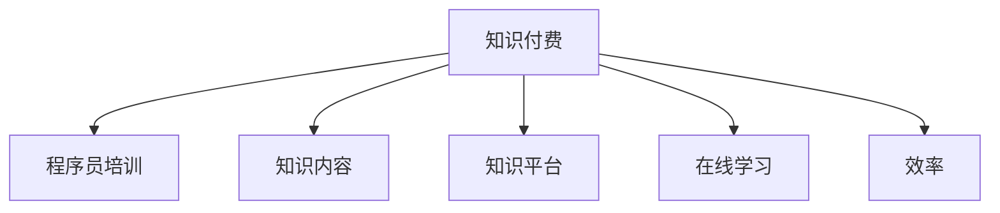

                 

# 知识付费与程序员工作效率的提升

## 1. 背景介绍

在信息技术迅速发展的时代，程序员成为了不可或缺的技术人才。面对海量的代码库和不断更新的编程语言，如何高效、系统地获取知识，提升工作效率，成为每个程序员所关心的问题。而知识付费，作为一种新兴的学习方式，逐渐走入程序员的视野，为程序员提供了快速获取知识、提高编程技能的机会。

### 1.1 问题由来
在互联网初期，程序员通过开源社区、技术论坛等免费渠道获取知识。但随着技术栈的深度和广度不断增加，单一的自学模式变得难以满足需求。同时，程序员面临着更复杂的问题场景、更大的项目压力，急需高效、系统化的知识获取途径。

### 1.2 问题核心关键点
知识付费，即通过付费的方式获取高质量的学习内容，主要依赖于高质量的教育资源和高效的课程设计。这种付费模式对于程序员而言，意味着可以获得更专业、更深入的技术指导，快速提升自身技能，同时也避免了时间和精力的浪费。

### 1.3 问题研究意义
研究知识付费模式对程序员工作效率的提升，对于提升程序员技术水平、推动技术创新和产业升级具有重要意义。通过分析知识付费的效率、效果和成本，可以为教育内容提供商、企业和程序员本身提供参考，帮助他们更好地利用付费知识，加速技术学习和应用。

## 2. 核心概念与联系

### 2.1 核心概念概述

为了更好地理解知识付费对程序员工作效率的影响，本节将介绍几个密切相关的核心概念：

- **知识付费(Knowledge-as-a-Service, KaaS)**：指通过订阅、购买等方式获取高质量教育资源，以提升个人或组织的技术水平和竞争力的商业模式。
- **程序员培训(Programmer Training)**：专注于提升程序员编程技能、技术应用、问题解决能力等专业技能的教育模式。
- **知识内容(Knowledge Content)**：包括课程视频、技术文档、开源代码等，是知识付费的核心资源。
- **知识平台(Knowledge Platform)**：提供课程服务、在线学习、交流讨论等功能的平台，如Udemy、Coursera等。
- **在线学习(Online Learning)**：通过网络获取学习资源，打破了时间和空间的限制，更加灵活、便捷。
- **效率(Efficiency)**：在单位时间内完成的工作量，通常用于衡量个人和组织的工作能力。

这些概念之间的关系可以通过以下Mermaid流程图来展示：



这个流程图展示了知识付费与其他相关概念的联系：

1. 知识付费是提供高质量教育资源的一种商业模式，直接关联到程序员培训和在线学习。
2. 知识内容是知识付费的核心，包括课程视频、技术文档等，为在线学习提供了资源支持。
3. 知识平台为知识付费提供了技术和服务的支撑，使知识内容的获取更加便捷。
4. 效率是知识付费的最终目标，旨在通过高质量的知识资源提升程序员的工作效率。

## 3. 核心算法原理 & 具体操作步骤

### 3.1 算法原理概述

知识付费模式通过提供高质量的教育资源，帮助程序员快速获取知识和技能，从而提升其工作效率。其核心算法原理主要包括以下几个方面：

- **资源推荐算法(Recommendation Algorithm)**：根据用户的学习行为和偏好，推荐合适的课程内容，提高学习效率。
- **个性化学习算法(Personalized Learning Algorithm)**：根据用户的知识背景、技能水平和学习进度，定制个性化的学习计划，提升学习效果。
- **知识图谱(Knowledge Graph)**：构建知识节点之间的关联，帮助用户快速找到所需信息，提高学习效率。
- **智能导师系统(Adaptive Learning System)**：通过智能算法，实时监控和反馈学习情况，优化学习路径，提升学习效率。

### 3.2 算法步骤详解

基于知识付费模式提升程序员工作效率的具体操作流程如下：

1. **需求分析**：了解程序员的技能水平、学习目标和项目需求，确定适合的知识付费内容。
2. **选择平台**：根据需求选择适合的知识付费平台，如Udemy、Coursera、edX等。
3. **选择课程**：在选定的平台上，根据推荐算法和知识图谱，选择适合的课程内容。
4. **个性化学习**：根据个性化学习算法，定制个性化的学习计划，合理安排学习时间和内容。
5. **在线学习**：通过知识平台进行在线学习，获取知识内容，实践技能。
6. **反馈与调整**：利用智能导师系统实时监控学习效果，根据反馈调整学习计划。
7. **项目应用**：将学到的知识和技能应用于实际项目中，提升工作效率。

### 3.3 算法优缺点

知识付费模式在提升程序员工作效率方面具有以下优点：

- **针对性高**：根据程序员的具体需求和项目需求，选择适合的课程内容，提升学习效率。
- **效率高**：利用在线学习模式，打破时间和空间限制，灵活安排学习时间和地点。
- **师资力量强**：通过付费方式获取高质量的教育资源，利用优质师资力量提升学习效果。
- **便于检索**：通过知识图谱和推荐算法，快速找到所需知识，减少搜索时间。

同时，该模式也存在以下局限性：

- **成本高**：付费模式增加了学习成本，对于部分经济困难的程序员可能难以承受。
- **缺乏灵活性**：部分课程可能不灵活，难以适应复杂、多变的实际项目需求。
- **过度依赖平台**：过度依赖知识付费平台，可能限制知识获取的多样性。
- **课程质量参差不齐**：部分课程质量不高，难以满足专业需求。

尽管存在这些局限性，但知识付费模式已经成为程序员获取知识、提升技能的重要途径。通过不断优化平台和服务，相信知识付费将为程序员提供更高效、便捷的知识获取方式。

### 3.4 算法应用领域

知识付费模式已经广泛应用于程序员培训领域，特别是在以下方面：

- **编程语言学习**：如Python、Java、C++等主流编程语言的高级课程。
- **技术框架学习**：如Spring Boot、Django、Vue等流行框架的深度解析。
- **数据科学与机器学习**：如TensorFlow、PyTorch、Keras等机器学习框架的实战应用。
- **软件开发与设计**：如UML、Agile、DevOps等软件开发方法论的讲解。
- **大数据与云计算**：如Hadoop、Spark、AWS、Google Cloud等大数据和云服务平台的课程。
- **人工智能与深度学习**：如深度学习框架、自然语言处理、计算机视觉等领域的课程。

## 4. 数学模型和公式 & 详细讲解  
### 4.1 数学模型构建

知识付费模式中，我们主要关注用户的学习效率，可以通过以下数学模型来衡量：

设用户从知识付费平台获取的知识为 $K$，其质量为 $Q$，用户学习时间为 $T$，学习效果为 $E$。则用户的学习效率 $E$ 可以通过以下公式计算：

$$
E = \frac{Q \cdot T}{E} = \frac{K}{\frac{T}{E}}
$$

其中，$E$ 表示每单位时间内的学习效果，$T$ 表示学习时间，$K$ 表示知识量，$E$ 表示学习效率。

### 4.2 公式推导过程

根据上述公式，可以推导出学习效率的计算方法。假设用户的学习效果 $E$ 为单位时间内的知识吸收率，学习时间为 $T$，知识量为 $K$，则：

$$
E = \frac{K}{T}
$$

这表明，学习效率与知识量和学习时间成正比，与学习效果成反比。在知识付费模式下，用户可以通过支付费用获取高质量的知识资源，提高学习效果，从而提升学习效率。

### 4.3 案例分析与讲解

以Coursera平台为例，分析知识付费模式对程序员学习效率的提升。Coursera提供了丰富的计算机科学课程，包括数据科学、机器学习、编程语言等。用户通过订阅付费，可以获取高质量的课程内容、视频讲座、编程作业等资源。通过智能推荐算法，用户可以更快地找到适合的课程内容，利用个性化学习算法，定制个性化的学习计划。此外，Coursera还提供了实时反馈和智能导师系统，帮助用户及时调整学习路径，提升学习效率。

## 5. 项目实践：代码实例和详细解释说明
### 5.1 开发环境搭建

为了进行知识付费平台的开发，我们需要搭建开发环境。以下是使用Python进行开发的环境配置流程：

1. 安装Anaconda：从官网下载并安装Anaconda，用于创建独立的Python环境。

2. 创建并激活虚拟环境：
```bash
conda create -n pytorch-env python=3.8 
conda activate pytorch-env
```

3. 安装PyTorch：根据CUDA版本，从官网获取对应的安装命令。例如：
```bash
conda install pytorch torchvision torchaudio cudatoolkit=11.1 -c pytorch -c conda-forge
```

4. 安装Flask：用于搭建知识付费平台的前端API。
```bash
pip install flask
```

5. 安装SQLite：用于数据库存储用户数据。
```bash
pip install pysqlite3
```

完成上述步骤后，即可在`pytorch-env`环境中开始开发实践。

### 5.2 源代码详细实现

下面我们以知识付费平台的用户学习记录记录为例，给出使用Flask进行知识付费平台开发的PyTorch代码实现。

首先，定义数据库模型：

```python
from flask_sqlalchemy import SQLAlchemy

db = SQLAlchemy()

class User(db.Model):
    id = db.Column(db.Integer, primary_key=True)
    name = db.Column(db.String(50), nullable=False)
    courses = db.relationship('Course', backref='users', lazy=True)

class Course(db.Model):
    id = db.Column(db.Integer, primary_key=True)
    name = db.Column(db.String(50), nullable=False)
    completed = db.Column(db.Boolean, default=False)
    user_id = db.Column(db.Integer, db.ForeignKey('user.id'))

    def __repr__(self):
        return f"<Course {self.name}>"
```

然后，定义API接口：

```python
from flask import Flask, request, jsonify

app = Flask(__name__)

@app.route('/users', methods=['GET'])
def get_users():
    users = User.query.all()
    return jsonify([{'id': user.id, 'name': user.name} for user in users])

@app.route('/courses', methods=['GET'])
def get_courses():
    courses = Course.query.all()
    return jsonify([{'id': course.id, 'name': course.name, 'completed': course.completed} for course in courses])

@app.route('/users', methods=['POST'])
def add_user():
    data = request.json
    user = User(name=data['name'])
    db.session.add(user)
    db.session.commit()
    return jsonify({'id': user.id, 'name': user.name}), 201

@app.route('/courses', methods=['POST'])
def add_course():
    data = request.json
    course = Course(name=data['name'])
    db.session.add(course)
    db.session.commit()
    return jsonify({'id': course.id, 'name': course.name}), 201

@app.route('/courses/<int:id>', methods=['PATCH'])
def update_course(id):
    data = request.json
    course = Course.query.get(id)
    course.completed = data['completed']
    db.session.commit()
    return jsonify({'id': course.id, 'name': course.name, 'completed': course.completed}), 200

@app.route('/users/<int:id>/courses', methods=['DELETE'])
def delete_course(id):
    user = User.query.get(id)
    courses = user.courses
    for course in courses:
        db.session.delete(course)
    db.session.commit()
    return jsonify({'id': user.id, 'courses': [course.name for course in courses]}), 200
```

最后，启动Flask服务器：

```python
if __name__ == '__main__':
    app.run(debug=True)
```

以上就是使用Flask进行知识付费平台开发的完整代码实现。可以看到，Flask框架提供了简单易用的API接口，可以方便地管理用户和课程，满足知识付费平台的基本需求。

### 5.3 代码解读与分析

让我们再详细解读一下关键代码的实现细节：

**User类和Course类**：
- `__init__`方法：初始化用户和课程的基本信息。
- `__repr__`方法：返回课程的字符串表示。

**get_users, get_courses, add_user, add_course, update_course, delete_course方法**：
- `request.json`：获取从客户端传递的JSON数据。
- `request.method`：获取请求方法，判断是GET、POST、PATCH还是DELETE请求。
- `request.json`：将客户端传递的数据转换为Python对象。
- `db.session.add`：将新的用户或课程添加到数据库。
- `db.session.commit`：提交数据库事务，保存数据到数据库。
- `jsonify`：将Python对象转换为JSON格式，响应客户端。

这些方法实现了知识付费平台的基本功能，包括用户管理、课程管理、用户与课程关系管理等。通过Flask框架，开发者可以快速搭建起知识付费平台，满足业务需求。

## 6. 实际应用场景

### 6.1 公司内部培训

许多公司为了提升员工的技术水平，采用知识付费模式，通过企业账号统一购买知识付费平台的课程。这种模式可以避免员工私自订阅付费课程，同时保证课程内容的高质量，避免无效的课程浪费公司资源。

**实现方式**：
- 公司通过企业账号订阅知识付费平台的会员，购买合适的课程。
- 员工通过企业账号登录知识付费平台，选择适合的课程进行学习。
- 公司管理层通过知识付费平台的管理功能，监控员工的学习进度和课程完成情况，优化培训计划。

**优势**：
- 统一管理，保证课程质量。
- 集中采购，降低培训成本。
- 实时监控，优化培训效果。

### 6.2 技术交流平台

知识付费平台还可以成为技术交流社区的重要组成部分，吸引更多的技术爱好者和专家参与。平台可以提供丰富的学习资源，如代码分享、技术讨论、编程挑战等，促进技术知识的传播和交流。

**实现方式**：
- 知识付费平台提供公开免费的课程和资源，吸引用户参与。
- 用户通过订阅付费课程，获取高质量的高级课程和技术文档。
- 用户可以通过讨论区、问答区等形式，与专家和同伴进行交流，分享技术心得。

**优势**：
- 促进技术交流，提升技术水平。
- 汇聚技术专家，解决技术难题。
- 丰富技术资源，加速技术传播。

### 6.3 在线学习平台

在线学习平台通过知识付费模式，提供个性化的学习路径和课程推荐，帮助用户快速提升技术技能。平台可以根据用户的学习历史、兴趣偏好，智能推荐适合的课程内容，提升学习效率。

**实现方式**：
- 用户通过在线学习平台注册账号，进行学习行为记录。
- 平台通过数据分析，智能推荐适合的课程和内容。
- 用户通过在线学习平台，进行视频观看、编程实践、作业提交等操作。

**优势**：
- 个性化推荐，提高学习效率。
- 灵活学习，打破时间和空间限制。
- 实时反馈，优化学习路径。

## 7. 工具和资源推荐
### 7.1 学习资源推荐

为了帮助开发者系统掌握知识付费模式，这里推荐一些优质的学习资源：

1. Coursera课程《Python for Data Science and Machine Learning Bootcamp》：由Coursera提供的Python数据科学和机器学习课程，涵盖Python基础、数据分析、机器学习等。

2. Udemy课程《The Complete Web Developer in 2021》：由Udemy提供的全栈Web开发课程，涵盖HTML、CSS、JavaScript、React等。

3. edX课程《Data Science MicroMasters Program》：由edX提供的微专业课程，涵盖数据科学、机器学习、大数据等。

4. Flask官方文档：Flask框架的官方文档，提供了丰富的API开发教程和示例，帮助开发者快速上手Flask应用开发。

5. SQLAlchemy官方文档：SQLAlchemy的官方文档，提供了详细的SQLAlchemy数据库API，帮助开发者实现数据库操作。

6. Coursera、Udemy、edX等知识付费平台的官方文档和社区资源，提供了丰富的课程推荐、学习心得、技术交流等，帮助开发者系统掌握知识付费模式。

通过对这些资源的学习实践，相信你一定能够快速掌握知识付费模式，并将其应用到实际开发中。

### 7.2 开发工具推荐

高效的开发离不开优秀的工具支持。以下是几款用于知识付费平台开发的常用工具：

1. Flask：基于Python的轻量级Web应用框架，易于上手，适合快速开发API。

2. SQLite：轻量级的关系型数据库，适用于小规模应用，易于部署和维护。

3. PyTorch：基于Python的深度学习框架，提供强大的计算图和自动微分功能。

4. TensorBoard：TensorFlow配套的可视化工具，可实时监测模型训练状态，提供丰富的图表呈现方式，帮助开发者调试模型。

5. Weights & Biases：模型训练的实验跟踪工具，可以记录和可视化模型训练过程中的各项指标，方便对比和调优。

6. Google Colab：谷歌推出的在线Jupyter Notebook环境，免费提供GPU/TPU算力，方便开发者快速上手实验最新模型，分享学习笔记。

合理利用这些工具，可以显著提升知识付费平台的开发效率，加快创新迭代的步伐。

### 7.3 相关论文推荐

知识付费模式的发展源于学界的持续研究。以下是几篇奠基性的相关论文，推荐阅读：

1. "A Framework for Programming Language Learning in Online Courses"：探讨了在线课程中编程语言学习的效果和影响因素，提出了一些提高学习效果的策略。

2. "Online Learning Platforms: A Review and Future Directions"：综述了在线学习平台的发展现状和未来方向，分析了知识付费模式的优势和局限性。

3. "The Effectiveness of Knowledge-as-a-Service in Education"：研究了知识付费模式在教育中的应用效果，分析了其对学习效率的影响。

4. "Learning Platforms for Software Developers: A Comparative Study"：比较了不同知识付费平台的效果和用户满意度，提供了一些平台选择的建议。

这些论文代表了大语言模型微调技术的发展脉络。通过学习这些前沿成果，可以帮助研究者把握学科前进方向，激发更多的创新灵感。

## 8. 总结：未来发展趋势与挑战

### 8.1 总结

本文对知识付费模式对程序员工作效率的提升进行了全面系统的介绍。首先阐述了知识付费模式的研究背景和意义，明确了知识付费在提升程序员技术水平、推动技术创新和产业升级方面的独特价值。其次，从原理到实践，详细讲解了知识付费的数学模型和核心算法，给出了知识付费平台开发的完整代码实例。同时，本文还广泛探讨了知识付费模式在多个行业领域的应用前景，展示了知识付费模式的巨大潜力。

通过本文的系统梳理，可以看到，知识付费模式已经成为程序员获取知识、提升技能的重要途径。未来，伴随知识付费平台的不断优化和普及，相信知识付费将为程序员提供更高效、便捷的知识获取方式。

### 8.2 未来发展趋势

展望未来，知识付费模式将呈现以下几个发展趋势：

1. **普及度提升**：知识付费平台的覆盖范围将不断扩大，更多公司和个人将采用知识付费模式进行技能提升。
2. **多样化内容**：知识付费内容将更加丰富多样，包括编程语言、技术框架、大数据、人工智能等多个领域。
3. **个性化学习**：基于AI技术的个性化学习算法将不断优化，用户的学习路径将更加符合个人需求和进度。
4. **跨平台集成**：知识付费平台将与更多技术工具和平台进行集成，实现一站式学习体验。
5. **移动学习**：知识付费平台将更加注重移动端体验，提升用户的学习便利性和效率。

这些趋势将进一步提升知识付费模式的学习效果和用户体验，加速知识传播和技能提升。

### 8.3 面临的挑战

尽管知识付费模式已经取得了瞩目成就，但在迈向更加智能化、普适化应用的过程中，它仍面临着诸多挑战：

1. **内容质量参差不齐**：部分知识付费课程质量不高，难以满足专业需求。
2. **学习资源有限**：知识付费平台的课程资源有限，难以满足用户的多样化需求。
3. **用户学习动机**：部分用户可能存在学习动机不足的问题，难以坚持完成课程。
4. **市场竞争激烈**：知识付费市场竞争激烈，平台需要不断创新和优化，才能保持竞争力。

尽管存在这些挑战，但知识付费模式的发展前景依然广阔，相信通过平台、教师、用户等多方共同努力，知识付费模式将不断优化，更好地服务于程序员和技术从业者。

### 8.4 研究展望

面对知识付费模式所面临的挑战，未来的研究需要在以下几个方面寻求新的突破：

1. **课程质量控制**：建立课程质量评估机制，筛选优质课程内容，提高课程质量和用户满意度。
2. **内容多样化**：引入更多行业专家和开发者，提供更加丰富多样的知识内容，满足用户的多样化需求。
3. **学习激励机制**：通过积分奖励、社区互动等方式，激励用户积极参与学习，提高学习效果。
4. **平台智能化**：利用AI技术，实现学习路径的智能推荐和调整，提升学习效率。
5. **跨平台集成**：与更多技术工具和平台进行集成，实现知识付费的一站式体验。
6. **移动端优化**：优化移动端用户体验，提升学习便利性和效率。

这些研究方向的探索，必将引领知识付费模式迈向更高的台阶，为程序员和技术从业者提供更高效、便捷的知识获取方式。面向未来，知识付费模式还需要与其他技术手段进行更深入的融合，共同推动知识传播和技能提升。只有勇于创新、敢于突破，才能不断拓展知识付费模式的边界，让知识付费模式更好地服务于程序员和技术从业者。

## 9. 附录：常见问题与解答

**Q1：知识付费模式是否适用于所有程序员？**

A: 知识付费模式适用于大部分程序员，特别是那些希望通过快速学习提升技能、拓展知识面的开发者。但一些经济困难的程序员可能难以承受付费学习的成本。

**Q2：如何选择合适的知识付费平台？**

A: 选择知识付费平台时，应考虑其课程内容质量、平台稳定性、学习体验、用户评价等因素。可以通过平台推荐、课程评价、用户反馈等途径，选择适合自己的平台。

**Q3：知识付费模式是否能够提升程序员的长期学习效果？**

A: 知识付费模式可以提升程序员的短期学习效果，帮助其快速掌握新知识和技能。但长期学习效果还需依赖于持续学习和实践，知识付费模式只是一种辅助手段。

**Q4：知识付费模式是否能够替代传统学习方式？**

A: 知识付费模式可以补充传统学习方式，特别是在时间紧张、学习需求紧急的情况下。但传统的学习方式如面授课程、读书、实践等依然具有不可替代的地位，应结合多种学习方式进行系统学习。

**Q5：如何利用知识付费模式提升个人品牌价值？**

A: 可以通过学习高难度的课程，获取专业认证和证书，提升个人技术水平和知名度。同时，积极参与技术交流和社区活动，展示自己的学习成果和技术能力，建立个人品牌。

通过本文的系统梳理，可以看到，知识付费模式已经成为程序员获取知识、提升技能的重要途径。未来，伴随知识付费平台的不断优化和普及，相信知识付费将为程序员提供更高效、便捷的知识获取方式。面向未来，知识付费模式还需要与其他技术手段进行更深入的融合，共同推动知识传播和技能提升。只有勇于创新、敢于突破，才能不断拓展知识付费模式的边界，让知识付费模式更好地服务于程序员和技术从业者。

---

作者：禅与计算机程序设计艺术 / Zen and the Art of Computer Programming

