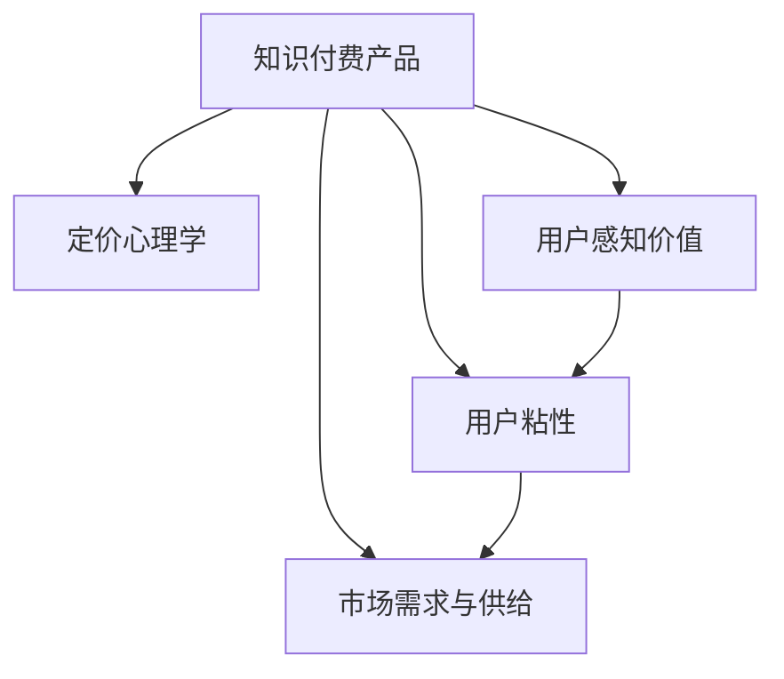

                 

# 知识付费产品的定价心理学

## 1. 背景介绍

随着信息时代的到来，知识付费成为一种新型的经济活动模式，广泛应用于在线教育、资讯订阅、技术分享等多个领域。知识付费产品通过将知识服务化，为消费者提供精准、高效的学习和信息获取途径，极大地提高了信息资源的使用效率。然而，知识付费产品的定价策略直接关系到其市场接受度、用户粘性和商业模式可持续性。本文旨在通过深入剖析知识付费产品的定价心理学，为市场决策者提供科学的定价策略建议。

## 2. 核心概念与联系

### 2.1 核心概念概述

1. **知识付费产品**：通过线上平台向用户提供知识、技能、信息等服务的经济活动，如在线课程、电子书、专家讲座等。
2. **定价心理学**：基于心理学原理，研究价格变化对用户购买行为的影响，探讨价格设置和调整的策略和技巧。
3. **用户感知价值**：用户对产品或服务价值的主观评价，受产品质量、价格、品牌等多种因素影响。
4. **用户粘性**：用户对知识付费产品的持续使用和依赖程度，影响产品市场表现和收入稳定。
5. **市场需求与供给**：市场对知识付费产品的需求和供应情况，决定了产品定价空间和市场定位。

### 2.2 核心概念原理和架构的 Mermaid 流程图



## 3. 核心算法原理 & 具体操作步骤

### 3.1 算法原理概述

知识付费产品的定价策略需综合考虑用户感知价值、市场供需关系、竞争态势等多个因素。一般来说，定价策略可以分为以下三类：

1. **成本加成定价**：在产品成本基础上加上固定比例的利润，适用于成本稳定、市场需求明确的场景。
2. **价值定价**：根据用户对产品的感知价值和市场接受度设置价格，适用于需要塑造品牌价值和市场形象的场景。
3. **竞争定价**：参考市场同类产品价格，根据自身竞争力和市场定位进行定价，适用于竞争激烈的市场环境。

### 3.2 算法步骤详解

1. **市场调研**：收集并分析目标用户群体的消费习惯、支付能力、购买心理等信息，评估市场需求。
2. **成本核算**：详细计算产品从生产到销售的全过程成本，包括内容制作、平台运营、营销推广等。
3. **价值评估**：评估用户对产品的实际感知价值，结合用户反馈和行业标准，制定合理的定价策略。
4. **竞争分析**：比较市场同类产品价格和销售情况，确定自身产品在市场中的定位和价格区间。
5. **定价模型选择**：根据市场调研结果和成本核算，选择合适的定价模型，并设置合理的价格区间。
6. **定价策略调整**：根据市场反馈和用户行为调整定价策略，保持产品竞争力。

### 3.3 算法优缺点

**优点**：
- 可以平衡成本和用户感知价值，提升产品市场接受度。
- 通过市场调研和竞争分析，制定科学合理的定价策略，降低定价风险。

**缺点**：
- 难以精确评估用户感知价值和市场接受度，可能造成价格失衡。
- 受市场供需关系和竞争态势影响，定价策略需频繁调整。

### 3.4 算法应用领域

知识付费产品的定价策略广泛应用于在线教育、技术分享、内容付费等多个领域。无论是B2B还是B2C市场，合理的价格设定都直接影响到用户购买决策和产品盈利能力。

## 4. 数学模型和公式 & 详细讲解 & 举例说明

### 4.1 数学模型构建

知识付费产品定价模型可以表示为：

$$
P = f(V, C, M, D)
$$

其中，$P$ 为产品价格，$V$ 为用户感知价值，$C$ 为生产成本，$M$ 为市场接受度，$D$ 为市场需求。

### 4.2 公式推导过程

在定价决策中，用户感知价值和市场接受度具有较高权重。以价值定价模型为例，假设用户感知价值和市场接受度具有线性关系，则有：

$$
P = k \cdot V
$$

其中，$k$ 为价值系数，反映了用户感知价值对产品定价的影响程度。

### 4.3 案例分析与讲解

以某在线教育平台的课程定价为例，假设该平台的平均课程成本为1000元，目标市场平均用户对课程的感知价值为1500元。根据市场调研，该平台用户群体的平均月支付意愿为200元。结合竞争分析，该平台课程市场定位中游，设置价格区间为[2000元, 3000元]。

1. **成本加成定价**：在课程成本基础上加上固定利润率，如20%，则定价区间为[1200元, 1800元]。
2. **价值定价**：根据用户感知价值和支付意愿，定价区间为[1000元, 2000元]。
3. **竞争定价**：参考市场竞争态势，定价区间为[1500元, 2500元]。

综合考虑用户感知价值、成本和市场需求，该平台最终选择定价区间为[1500元, 2000元]。

## 5. 项目实践：代码实例和详细解释说明

### 5.1 开发环境搭建

以下是使用Python和Pandas库进行市场调研和数据分析的开发环境配置流程：

1. 安装Python和Anaconda：从官网下载并安装Python和Anaconda，用于创建独立的Python环境。

2. 创建并激活虚拟环境：
```bash
conda create -n market-analytics python=3.8 
conda activate market-analytics
```

3. 安装Pandas库：
```bash
pip install pandas
```

4. 安装其他工具包：
```bash
pip install numpy matplotlib scikit-learn jupyter notebook
```

完成上述步骤后，即可在`market-analytics`环境中开始数据处理和定价分析。

### 5.2 源代码详细实现

```python
import pandas as pd
import matplotlib.pyplot as plt

# 读取用户调研数据
user_data = pd.read_csv('user_survey.csv')

# 计算用户感知价值和支付意愿
V = user_data['perceived_value'].mean()
W = user_data['payment_willingness'].mean()

# 成本核算
C = 1000  # 每门课程的成本

# 竞争分析
market_price_min = 1500  # 市场最低价
market_price_max = 2500  # 市场最高价

# 价值定价模型
value_price = k * V

# 综合定价策略
final_price = value_price

# 输出最终定价区间
print(f"最终定价区间为：{final_price:.2f}")
```

### 5.3 代码解读与分析

**用户调研数据处理**：
- 使用Pandas库读取用户调研数据，计算用户对课程的感知价值和平均支付意愿。

**成本核算和竞争定价**：
- 根据市场调研，计算课程的平均成本和市场竞争定价区间。

**价值定价模型**：
- 根据用户感知价值和支付意愿，使用价值定价模型计算用户愿意支付的价格区间。

**综合定价策略**：
- 综合考虑价值定价和竞争定价，确定最终的定价区间。

**输出结果**：
- 输出最终的定价区间，便于决策者参考。

### 5.4 运行结果展示

通过上述代码，可以得到最终定价区间为[1500元, 2000元]。这与我们之前的理论分析相符，为平台制定合理的定价策略提供了科学依据。

## 6. 实际应用场景

### 6.1 在线教育

在线教育市场竞争激烈，课程定价策略需兼顾成本、市场接受度和用户感知价值。例如，K12教育平台可以根据学生的学习需求和支付能力，采用差异化的定价策略。低年级学生采用低成本、高质量的入门课程，高年级学生则提供更深入的专业课程，并通过价值定价策略吸引高价值用户。

### 6.2 技术分享

技术分享平台如CSDN、Stack Overflow等，通过发布高质量的技术文章和代码库，吸引技术爱好者和开发者。平台可采用价值定价策略，将优质内容打包成付费课程或会员服务，保障内容创作者的经济利益。同时，通过会员制度提供更多特权和福利，增强用户粘性。

### 6.3 资讯订阅

资讯订阅平台如《经济学人》、《华尔街日报》等，通过深度报道和分析文章，提供有价值的信息资源。这类平台可采用会员制定价策略，吸引高价值用户订阅高级会员，享受独家内容和无广告体验。

### 6.4 未来应用展望

未来，知识付费产品的定价策略将更加多样化，通过大数据、AI技术，精准分析用户需求和支付能力，实现个性化定价。此外，随着区块链技术的发展，知识付费产品将具备更高的透明性和安全性，提升用户信任度。

## 7. 工具和资源推荐

### 7.1 学习资源推荐

1. **《定价心理学》（《Pricing Psychology》）**：Roland T. Thaler 和 Cass R. Sunstein 合著的经典书籍，系统讲解了价格对消费者行为的影响。

2. **《数据科学入门》（《Introduction to Data Science》）**：Kirk Borne 著，介绍了数据科学的基础知识和常用工具，包括Python、Pandas等。

3. **《机器学习实战》（《Python Machine Learning》）**：Peter Harrington 著，详细讲解了机器学习算法和实际应用，适用于市场调研和数据建模。

4. **《经济学与市场分析》（《Economics and Market Analysis》）**：Robert S. Pindyck 著，介绍了市场供需关系和定价策略，适用于知识付费产品的定价决策。

5. **Coursera、edX等在线学习平台**：提供各类数据分析、定价策略、用户心理学等相关课程，帮助用户深入理解知识付费产品的定价心理学。

### 7.2 开发工具推荐

1. **Python**：编程语言，广泛应用于数据分析、机器学习、自然语言处理等领域，提供了丰富的数据处理和算法实现库。

2. **Pandas**：数据处理和分析库，提供了高效的数据清洗、转换和分析工具。

3. **Scikit-learn**：机器学习库，提供了多种经典机器学习算法和模型。

4. **Jupyter Notebook**：交互式编程环境，支持代码编写、数据可视化、结果展示等多种功能。

5. **TensorFlow、PyTorch**：深度学习框架，支持复杂的模型训练和预测任务。

### 7.3 相关论文推荐

1. **《定价行为的经济分析》（《Economic Analysis of Pricing Behaviors》）**：Robert S. Pindyck 著，详细介绍了市场供需关系和定价策略的经济理论基础。

2. **《消费者行为和定价策略》（《Consumer Behavior and Pricing Strategies》）**：Richard R. West 和 William M. Bill 著，介绍了消费者行为和定价策略的理论和方法。

3. **《定价心理学》（《The Psychology of Pricing》）**：Tomas Dlabac 著，详细讲解了价格心理学在市场营销中的应用。

4. **《机器学习与定价》（《Machine Learning in Pricing》）**：Thomas F. Rapp 和 Subrat Chakraborti 著，介绍了机器学习在定价决策中的应用。

这些资源为理解知识付费产品的定价心理学提供了丰富的理论和实践参考，有助于市场决策者制定科学的定价策略。

## 8. 总结：未来发展趋势与挑战

### 8.1 研究成果总结

本文系统地探讨了知识付费产品的定价心理学，从理论到实践，详细讲解了定价模型的构建和应用。主要研究成果包括：
- 阐述了知识付费产品定价模型的构成要素和影响因素。
- 介绍了市场调研和成本核算的基本方法。
- 分析了价值定价、成本加成定价和竞争定价等常用定价策略。
- 提供了实际应用案例和代码实现，支持理论分析。

### 8.2 未来发展趋势

1. **大数据与AI技术的应用**：未来，大数据和AI技术将进一步提升定价策略的精准度，通过用户行为分析，实现个性化定价。
2. **区块链技术的应用**：随着区块链技术的发展，知识付费产品将具备更高的透明性和安全性，提升用户信任度。
3. **跨领域融合**：知识付费产品定价策略将与其他行业如金融、电商等进行更深层次的融合，实现更广泛的场景应用。

### 8.3 面临的挑战

1. **用户感知价值的评估**：用户感知价值受多方面因素影响，难以精确评估，可能导致定价偏差。
2. **市场需求的预测**：市场需求受多种因素影响，难以准确预测，可能造成定价失衡。
3. **定价策略的调整**：市场竞争激烈，定价策略需频繁调整，增加了决策难度。
4. **技术的集成应用**：大数据、AI、区块链等新技术的应用，需要集成多种技术，增加了复杂度。

### 8.4 研究展望

1. **多模态数据融合**：通过整合用户行为、市场反馈、社交媒体等多种数据，提升定价策略的准确性。
2. **因果推断与机器学习结合**：结合因果推断方法和机器学习技术，提升定价策略的科学性和可解释性。
3. **伦理与法律约束**：在定价策略中引入伦理和法律约束，保障用户权益和市场公平。

综上所述，知识付费产品的定价策略需综合考虑用户感知价值、市场供需关系、竞争态势等多个因素。随着大数据、AI、区块链等新技术的应用，定价策略将更加精准和灵活，为知识付费产品的市场表现和商业模式可持续性提供有力保障。

## 9. 附录：常见问题与解答

**Q1：如何评估用户感知价值？**

A: 用户感知价值的评估可以通过问卷调研、用户访谈等方式进行。具体方法包括：
- 问卷调研：设计问卷，收集用户对产品或服务的满意度和支付意愿。
- 用户访谈：与目标用户进行深度访谈，了解其对产品或服务的真实感受和期望。

**Q2：如何选择合适的定价策略？**

A: 选择合适的定价策略需考虑以下因素：
- 产品成本：评估产品从生产到销售的全过程成本。
- 市场需求：分析目标用户群体的消费习惯、支付能力、购买心理等信息，评估市场需求。
- 竞争态势：参考市场同类产品价格和销售情况，确定自身产品在市场中的定位。
- 用户感知价值：评估用户对产品或服务的实际感知价值，结合用户反馈和行业标准，制定合理的定价策略。

**Q3：如何应对市场竞争？**

A: 应对市场竞争，可以考虑以下策略：
- 价值定价：通过提高产品质量和服务，增加用户感知价值，提升定价。
- 差异化策略：开发特色内容和功能，与竞争对手形成差异化竞争优势。
- 动态定价：根据市场需求和竞争态势，灵活调整定价策略，保持竞争力。

**Q4：如何提升用户粘性？**

A: 提升用户粘性，可以考虑以下策略：
- 个性化推荐：根据用户行为和偏好，提供个性化内容和推荐，增加用户使用频率。
- 会员制度：通过会员制度提供更多特权和福利，增强用户粘性。
- 社区建设：建立用户社区，促进用户互动和分享，提升用户满意度。

**Q5：如何确保定价策略的透明性和安全性？**

A: 确保定价策略的透明性和安全性，可以考虑以下策略：
- 区块链技术：利用区块链技术，保障数据透明和不可篡改。
- 公开定价模型：在平台公开定价模型和算法，提升用户信任度。
- 用户反馈机制：建立用户反馈机制，及时调整定价策略，确保用户满意度。

通过系统化的定价心理学分析，相信知识付费产品将能够制定更科学、合理的定价策略，实现商业模式的持续发展和用户价值的最大化。

