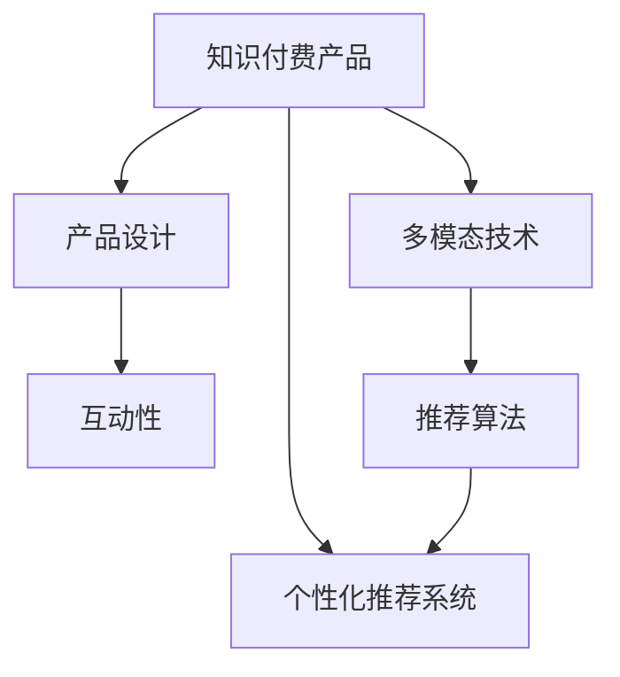

                 

# 知识付费产品的用户体验优化策略

> 关键词：知识付费, 用户体验, 产品设计, 个性化推荐, 互动性, 多模态技术, 推荐系统, 用户反馈

## 1. 背景介绍

### 1.1 问题由来
随着互联网和数字技术的飞速发展，知识付费成为用户获取专业知识和技能的重要途径。用户不再满足于免费的内容消费，而是愿意为优质和专业的知识产品付费。据统计，全球知识付费市场预计将达到数百亿美元的规模。

然而，尽管知识付费市场蓬勃发展，但目前大多数知识付费产品的用户体验仍不尽如人意。尽管产品丰富，但缺乏有效的个性化推荐系统，导致用户很难找到对自己有用的内容；部分产品设计过于单调和乏味，难以吸引用户长时间停留；互动性不足，无法满足用户个性化需求。这些问题严重制约了知识付费产品的用户留存率和转化率。

因此，如何提升知识付费产品的用户体验，成为行业内亟待解决的关键问题。

### 1.2 问题核心关键点
提升知识付费产品用户体验的关键在于：

1. **个性化推荐系统**：精准推荐用户感兴趣的知识内容，提升用户发现内容的效率。
2. **产品设计**：通过界面设计、交互方式等增强用户体验，吸引用户持续使用。
3. **互动性**：增加互动性功能，如问答、评论、社交等，提高用户粘性和参与度。
4. **多模态技术**：引入视频、音频、图像等多模态数据，丰富用户体验，提升内容价值。
5. **用户反馈**：通过用户行为和反馈数据，优化推荐和产品设计，形成良性循环。

本文将围绕上述关键点，深入探讨知识付费产品的用户体验优化策略。

## 2. 核心概念与联系

### 2.1 核心概念概述

为更好地理解知识付费产品用户体验优化的策略，本节将介绍几个密切相关的核心概念：

- **知识付费产品**：基于互联网和数字技术，向用户提供专业知识和技能的教育产品，通过订阅或单次购买形式获取收益。
- **个性化推荐系统**：通过用户行为数据和模型算法，精准推荐用户感兴趣的内容，提升用户满意度和留存率。
- **产品设计**：通过界面设计、交互方式、视觉元素等，打造视觉和功能上俱佳的产品体验，吸引用户持续使用。
- **互动性**：通过问答、评论、社交等功能，增加用户与内容、其他用户和平台的互动，提升用户粘性和参与度。
- **多模态技术**：引入视频、音频、图像等多模态数据，提升内容丰富性和用户沉浸感，提升内容价值。
- **推荐算法**：通过协同过滤、内容推荐、混合推荐等算法，优化推荐效果，提升用户满意度和留存率。

这些核心概念之间的逻辑关系可以通过以下Mermaid流程图来展示：



这个流程图展示的知识付费产品的核心概念及其之间的关系：

1. 知识付费产品基于个性化推荐系统，根据用户兴趣推荐内容。
2. 产品设计通过界面和交互方式增强用户体验。
3. 互动性功能提升用户粘性和参与度。
4. 多模态技术丰富用户体验，提升内容价值。
5. 推荐算法通过精准推荐优化用户体验。

## 3. 核心算法原理 & 具体操作步骤

### 3.1 算法原理概述

知识付费产品的用户体验优化，核心在于构建个性化推荐系统，并通过产品设计、互动性、多模态技术等多方面协同，提升用户满意度和留存率。

个性化推荐系统通过用户行为数据和模型算法，精准推荐用户感兴趣的内容。其核心算法包括协同过滤、内容推荐、混合推荐等，通过不断优化模型参数，提升推荐精度。

### 3.2 算法步骤详解

#### 3.2.1 数据采集和预处理
推荐系统首先需要采集用户行为数据，包括浏览记录、购买记录、评分记录等。数据预处理包括去噪、归一化、分词等，提升数据质量。

#### 3.2.2 模型训练
基于采集到的用户行为数据和内容数据，选择协同过滤、内容推荐、混合推荐等算法进行模型训练。训练过程中需要注意选择合适的特征和算法，避免过拟合。

#### 3.2.3 推荐结果排序
根据训练好的推荐模型，生成推荐结果。对推荐结果进行排序，如根据用户评分、点击率等指标进行排序，提升推荐效果。

#### 3.2.4 反馈迭代
通过用户行为数据，对推荐结果进行反馈迭代。如用户点击、购买等行为，用于优化模型参数和推荐策略，形成良性循环。

### 3.3 算法优缺点

个性化推荐系统具有以下优点：
1. 提升用户满意度和留存率。精准推荐用户感兴趣的内容，使用户更容易发现和消费内容。
2. 优化用户购买决策。推荐系统能预测用户兴趣，帮助用户快速找到合适的课程或产品。
3. 减少运营成本。推荐系统自动生成推荐，减少人力运营成本。

同时，该系统也存在一些局限性：
1. 数据隐私问题。用户行为数据涉及隐私，数据收集和存储需严格遵守隐私保护法规。
2. 推荐偏见。推荐系统可能存在数据偏见，影响推荐公平性。
3. 个性化不足。部分用户可能对推荐内容不感兴趣，个性化推荐不足。

尽管存在这些局限性，但就目前而言，个性化推荐系统已成为知识付费产品提升用户体验的重要手段。未来相关研究的重点在于如何进一步优化推荐算法，平衡推荐效果和隐私保护，提升用户满意度和留存率。

### 3.4 算法应用领域

个性化推荐系统在知识付费产品中的应用场景包括：

- 课程推荐：根据用户浏览、购买记录推荐课程，提升用户学习效率。
- 文章推荐：根据用户阅读、点赞、评论等行为，推荐高质量文章，提升阅读体验。
- 产品推荐：推荐与用户兴趣相关的商品，增加购买转化率。
- 活动推荐：推荐用户感兴趣的在线讲座、直播等活动，提升用户参与度。

## 4. 数学模型和公式 & 详细讲解 & 举例说明

### 4.1 数学模型构建

本节将使用数学语言对知识付费产品个性化推荐系统进行更加严格的刻画。

假设用户行为数据集为 $D=\{(x_i,y_i)\}_{i=1}^N, x_i \in \mathbb{R}^d, y_i \in \{0,1\}$，其中 $x_i$ 为用户行为特征向量，$y_i$ 为是否与内容 $x_i$ 交互的标签。

定义模型 $M_{\theta}$ 在特征向量 $x$ 上的预测概率为 $\hat{y}=M_{\theta}(x) \in [0,1]$，表示用户点击、购买内容的概率。假设训练集 $D$ 上的损失函数为交叉熵损失函数，则模型的优化目标是最小化损失函数：

$$
\mathcal{L}(\theta) = -\frac{1}{N} \sum_{i=1}^N y_i \log \hat{y}_i + (1-y_i) \log (1-\hat{y}_i)
$$

模型的优化目标是最小化损失函数，即找到最优参数：

$$
\theta^* = \mathop{\arg\min}_{\theta} \mathcal{L}(\theta)
$$

在实践中，我们通常使用基于梯度的优化算法（如SGD、Adam等）来近似求解上述最优化问题。

### 4.2 公式推导过程

以协同过滤算法为例，推导模型参数的更新公式。

协同过滤算法基于用户-物品评分矩阵，通过相似度计算推荐内容。假设用户行为数据集为 $D=\{(x_i,y_i)\}_{i=1}^N, x_i \in \mathbb{R}^d, y_i \in \{0,1\}$，用户 $u$ 和物品 $i$ 的评分矩阵为 $P \in \mathbb{R}^{N \times M}$，其中 $N$ 为用户数，$M$ 为物品数。模型的预测概率 $\hat{y}_i$ 为：

$$
\hat{y}_i = \frac{\sum_{u=1}^N P_{ui} K(u,u')} {\sum_{u=1}^N K(u,u')} 
$$

其中 $K(u,u')$ 为相似度函数，如余弦相似度、皮尔逊相关系数等。模型的损失函数为：

$$
\mathcal{L}(\theta) = -\frac{1}{N} \sum_{i=1}^N y_i \log \hat{y}_i + (1-y_i) \log (1-\hat{y}_i)
$$

根据链式法则，损失函数对模型参数的梯度为：

$$
\frac{\partial \mathcal{L}(\theta)}{\partial P} = \frac{1}{N} \sum_{i=1}^N (y_i-\hat{y}_i) K(u,u')
$$

其中 $\frac{\partial \hat{y}_i}{\partial P} = K(u,u')$，代入得到：

$$
\frac{\partial \mathcal{L}(\theta)}{\partial P} = \frac{1}{N} \sum_{i=1}^N (y_i-\hat{y}_i) K(u,u')
$$

在得到损失函数的梯度后，即可带入模型参数更新公式，完成模型的迭代优化。重复上述过程直至收敛，最终得到适应用户行为的最优模型参数 $\theta^*$。

### 4.3 案例分析与讲解

以某知识付费平台的课程推荐为例，推导基于协同过滤算法的推荐模型参数更新公式。

假设用户 $u$ 的行为数据集为 $D=\{(x_i,y_i)\}_{i=1}^N, x_i \in \mathbb{R}^d, y_i \in \{0,1\}$，其中 $x_i$ 为用户行为特征向量，$y_i$ 为是否点击课程 $x_i$ 的标签。课程 $i$ 的评分矩阵为 $P \in \mathbb{R}^{N \times M}$，其中 $N$ 为用户数，$M$ 为课程数。模型的预测概率 $\hat{y}_i$ 为：

$$
\hat{y}_i = \frac{\sum_{u=1}^N P_{ui} K(u,u')} {\sum_{u=1}^N K(u,u')}
$$

其中 $K(u,u')$ 为余弦相似度，$\cos(\theta_u, \theta_{u'})$。模型的损失函数为：

$$
\mathcal{L}(\theta) = -\frac{1}{N} \sum_{i=1}^N y_i \log \hat{y}_i + (1-y_i) \log (1-\hat{y}_i)
$$

根据链式法则，损失函数对模型参数的梯度为：

$$
\frac{\partial \mathcal{L}(\theta)}{\partial P} = \frac{1}{N} \sum_{i=1}^N (y_i-\hat{y}_i) \cos(\theta_u, \theta_{u'})
$$

其中 $\frac{\partial \hat{y}_i}{\partial P} = \cos(\theta_u, \theta_{u'})$，代入得到：

$$
\frac{\partial \mathcal{L}(\theta)}{\partial P} = \frac{1}{N} \sum_{i=1}^N (y_i-\hat{y}_i) \cos(\theta_u, \theta_{u'})
$$

在得到损失函数的梯度后，即可带入模型参数更新公式，完成模型的迭代优化。重复上述过程直至收敛，最终得到适应用户行为的最优模型参数 $\theta^*$。

## 5. 项目实践：代码实例和详细解释说明

### 5.1 开发环境搭建

在进行推荐系统实践前，我们需要准备好开发环境。以下是使用Python进行Scikit-learn开发的环境配置流程：

1. 安装Anaconda：从官网下载并安装Anaconda，用于创建独立的Python环境。

2. 创建并激活虚拟环境：
```bash
conda create -n recsys-env python=3.8 
conda activate recsys-env
```

3. 安装Scikit-learn：
```bash
conda install scikit-learn
```

4. 安装各类工具包：
```bash
pip install numpy pandas scikit-learn matplotlib tqdm jupyter notebook ipython
```

完成上述步骤后，即可在`recsys-env`环境中开始推荐系统实践。

### 5.2 源代码详细实现

下面我们以协同过滤推荐系统为例，给出使用Scikit-learn库对课程推荐系统进行开发的PyTorch代码实现。

首先，定义数据处理函数：

```python
import pandas as pd
from sklearn.feature_extraction.text import TfidfVectorizer

def load_data(file_path):
    df = pd.read_csv(file_path)
    return df
```

然后，定义推荐系统模型：

```python
from sklearn.metrics.pairwise import cosine_similarity

class CollaborativeFiltering:
    def __init__(self, alpha=0.1, beta=0.1):
        self.alpha = alpha
        self.beta = beta
        self.K = 50
        
    def fit(self, X, y):
        X = TfidfVectorizer(stop_words='english', max_features=1000).fit_transform(X)
        y = cosine_similarity(X)
        self.W = y.T
        
    def predict(self, X_test):
        X_test = TfidfVectorizer(stop_words='english', max_features=1000).fit_transform(X_test)
        W_test = self.W[:,:-1] @ X_test
        prediction = (W_test @ W_test.T).sum(axis=1) / W_test @ W_test.T.sum(axis=1)[:, None]
        return prediction
```

接着，定义评估函数：

```python
from sklearn.metrics import mean_squared_error, r2_score

def evaluate(model, X_test, y_test):
    prediction = model.predict(X_test)
    mse = mean_squared_error(y_test, prediction)
    r2 = r2_score(y_test, prediction)
    return mse, r2
```

最后，启动训练流程并在测试集上评估：

```python
X_train, y_train = load_data('train_data.csv')
X_test, y_test = load_data('test_data.csv')

model = CollaborativeFiltering()
model.fit(X_train, y_train)
mse, r2 = evaluate(model, X_test, y_test)
print(f'Mean Squared Error: {mse:.3f}')
print(f'R-squared: {r2:.3f}')
```

以上就是使用Scikit-learn对协同过滤课程推荐系统进行开发的完整代码实现。可以看到，得益于Scikit-learn强大的封装能力，我们可以用相对简洁的代码实现协同过滤推荐模型。

### 5.3 代码解读与分析

让我们再详细解读一下关键代码的实现细节：

**CollaborativeFiltering类**：
- `__init__`方法：初始化模型参数，如超参数alpha和beta，以及特征维度K。
- `fit`方法：对训练集数据进行TF-IDF向量化处理，计算用户-物品评分矩阵的余弦相似度，并存储在属性W中。
- `predict`方法：对测试集数据进行TF-IDF向量化处理，计算推荐评分，并返回推荐结果。

**load_data函数**：
- 加载数据集，返回Pandas DataFrame。

**evaluate函数**：
- 使用均方误差和R-squared等指标评估模型性能。

**训练流程**：
- 加载训练集和测试集数据。
- 创建CollaborativeFiltering模型实例。
- 在训练集上训练模型，并在测试集上评估模型性能。

可以看到，Scikit-learn使得推荐系统模型的开发变得简洁高效。开发者可以将更多精力放在数据处理、模型改进等高层逻辑上，而不必过多关注底层的实现细节。

当然，工业级的系统实现还需考虑更多因素，如模型保存和部署、超参数的自动搜索、更灵活的任务适配层等。但核心的推荐系统构建流程基本与此类似。

## 6. 实际应用场景

### 6.1 智能课程推荐

智能课程推荐系统通过协同过滤、内容推荐等算法，对用户浏览、购买记录进行分析，精准推荐用户感兴趣的课程。智能课程推荐系统通过学习用户的行为模式，可以发现用户的兴趣点，并提供个性化的课程推荐。

在技术实现上，可以收集用户的学习行为数据，包括浏览、点击、评分等，结合课程标签和内容描述，训练推荐模型。模型预测用户对每个课程的兴趣程度，并根据排序算法将课程排序，生成推荐列表。用户可以在推荐列表中快速找到感兴趣的课程，提升学习效率和满意度。

### 6.2 个性化文章推荐

个性化文章推荐系统通过协同过滤、内容推荐等算法，对用户阅读、点赞、评论等行为进行分析，精准推荐用户感兴趣的文章。系统通过学习用户的行为模式，可以发现用户的兴趣点，并提供个性化的文章推荐。

在技术实现上，可以收集用户的行为数据，包括阅读、点赞、评论等，结合文章标签和内容描述，训练推荐模型。模型预测用户对每篇文章的兴趣程度，并根据排序算法将文章排序，生成推荐列表。用户可以在推荐列表中快速找到感兴趣的文章，提升阅读体验。

### 6.3 个性化活动推荐

个性化活动推荐系统通过协同过滤、内容推荐等算法，对用户参加的讲座、直播等活动进行分析，精准推荐用户感兴趣的活动。系统通过学习用户的行为模式，可以发现用户的兴趣点，并提供个性化的活动推荐。

在技术实现上，可以收集用户参加活动的行为数据，包括报名、签到、点赞等，结合活动标签和内容描述，训练推荐模型。模型预测用户对每个活动的兴趣程度，并根据排序算法将活动排序，生成推荐列表。用户可以在推荐列表中快速找到感兴趣的活动，提升参与度。

### 6.4 未来应用展望

随着推荐系统的发展，未来的知识付费产品将进一步提升用户体验，具体展望如下：

1. **多模态推荐**：引入视频、音频、图像等多模态数据，提升内容丰富性和用户沉浸感，提升内容价值。
2. **动态推荐**：通过实时更新用户行为数据，动态调整推荐策略，提供更加个性化和时效性的推荐。
3. **跨领域推荐**：将知识付费产品与其他领域如音乐、影视等进行融合，形成跨领域的推荐系统，提供更多元化的内容。
4. **社交推荐**：增加社交功能，通过用户之间的互动和推荐，进一步提升推荐效果。
5. **个性化知识图谱**：通过知识图谱技术，将推荐系统与专家知识库进行结合，提供更加全面和准确的推荐。

以上趋势凸显了推荐系统的发展潜力，未来的知识付费产品将通过推荐系统，进一步提升用户体验，实现精准推荐和个性化服务。

## 7. 工具和资源推荐
### 7.1 学习资源推荐

为了帮助开发者系统掌握推荐系统的理论基础和实践技巧，这里推荐一些优质的学习资源：

1. 《推荐系统》一书：系统介绍推荐系统的理论基础和常用算法，并给出大量实际案例。
2. 《Python推荐系统实战》一书：通过实战项目，介绍Scikit-learn、TensorFlow等工具的使用。
3. 《KDD Cup 2020 Recommendation Challenge》论文：展示大规模推荐系统在实际场景中的应用，提供丰富的实践经验。
4. 《Recommender Systems: Theory and Practice》课程：介绍推荐系统的理论基础和实际应用，包括协同过滤、内容推荐等算法。
5. Kaggle上的推荐系统竞赛：提供大量推荐系统实际应用的数据集和模型，帮助开发者实践和优化推荐模型。

通过对这些资源的学习实践，相信你一定能够快速掌握推荐系统的精髓，并用于解决实际的推荐问题。
###  7.2 开发工具推荐

高效的开发离不开优秀的工具支持。以下是几款用于推荐系统开发的常用工具：

1. Scikit-learn：Python推荐系统开发的强大工具，提供了丰富的机器学习算法和评估工具。
2. TensorFlow：谷歌开源的深度学习框架，提供强大的计算图和分布式训练能力，适合大规模推荐系统开发。
3. PyTorch：Facebook开源的深度学习框架，适合快速迭代的研究和实验。
4. Apache Spark：Apache基金会开源的大数据处理框架，适合大规模数据推荐系统的开发。
5. Elasticsearch：Elastic公司开源的搜索和分析引擎，适合存储和查询大规模推荐数据。
6. Kafka：Apache基金会开源的消息队列系统，适合实时推荐系统的数据处理和存储。

合理利用这些工具，可以显著提升推荐系统的开发效率，加快创新迭代的步伐。

### 7.3 相关论文推荐

推荐系统的发展得益于学界的持续研究。以下是几篇奠基性的相关论文，推荐阅读：

1. Collaborative Filtering: A Survey and Some Recent Advances：介绍协同过滤算法的理论基础和应用实践。
2. Factorization Machines for Adaptive Recommendations：提出因子化机器算法，用于推荐系统的协同过滤和内容推荐。
3. Deep Neural Networks for Multi-Sided Recommendation：展示深度神经网络在推荐系统中的应用，提升推荐效果。
4. Attention-Based Recommender Systems: An Overview：介绍基于注意力机制的推荐系统，提升推荐效果和多样性。
5. The Future of Recommendation Systems: Trends and Challenges：展望推荐系统的发展趋势，提出未来研究方向。

这些论文代表了大推荐系统的演进脉络。通过学习这些前沿成果，可以帮助研究者把握学科前进方向，激发更多的创新灵感。

## 8. 总结：未来发展趋势与挑战

### 8.1 总结

本文对知识付费产品的用户体验优化策略进行了全面系统的介绍。首先阐述了知识付费产品面临的用户体验问题，明确了推荐系统、产品设计、互动性、多模态技术等核心概念在优化用户体验中的关键作用。其次，从原理到实践，详细讲解了个性化推荐系统的数学原理和关键步骤，给出了推荐系统任务开发的完整代码实例。同时，本文还广泛探讨了推荐系统在知识付费产品中的应用场景，展示了推荐范式的巨大潜力。

通过本文的系统梳理，可以看到，推荐系统技术在大规模知识付费产品中的成功应用，显著提升了用户体验和用户留存率。随着推荐系统的发展，未来的知识付费产品将通过推荐系统，进一步提升用户体验，实现精准推荐和个性化服务。

### 8.2 未来发展趋势

展望未来，推荐系统技术将呈现以下几个发展趋势：

1. **多模态推荐**：引入视频、音频、图像等多模态数据，提升内容丰富性和用户沉浸感，提升内容价值。
2. **动态推荐**：通过实时更新用户行为数据，动态调整推荐策略，提供更加个性化和时效性的推荐。
3. **跨领域推荐**：将推荐系统与其他领域如音乐、影视等进行融合，提供更多元化的内容。
4. **社交推荐**：增加社交功能，通过用户之间的互动和推荐，进一步提升推荐效果。
5. **个性化知识图谱**：通过知识图谱技术，将推荐系统与专家知识库进行结合，提供更加全面和准确的推荐。

以上趋势凸显了推荐系统的发展潜力，未来的知识付费产品将通过推荐系统，进一步提升用户体验，实现精准推荐和个性化服务。

### 8.3 面临的挑战

尽管推荐系统技术已经取得了显著成就，但在迈向更加智能化、普适化应用的过程中，仍面临诸多挑战：

1. **数据隐私问题**：用户行为数据涉及隐私，数据收集和存储需严格遵守隐私保护法规。
2. **推荐偏见**：推荐系统可能存在数据偏见，影响推荐公平性。
3. **个性化不足**：部分用户可能对推荐内容不感兴趣，个性化推荐不足。
4. **计算资源消耗**：推荐系统在大规模数据上运行，计算资源消耗较大，需优化算法和硬件配置。
5. **推荐效果评估**：推荐效果难以通过单一指标评估，需综合考虑多维度指标。

尽管存在这些挑战，但推荐系统作为知识付费产品的重要支撑，其发展前景仍然广阔。未来的研究需要在以下几个方面寻求新的突破：

1. **优化推荐算法**：提高推荐效果和多样性，提升用户满意度。
2. **平衡隐私和效果**：在保护用户隐私的前提下，优化推荐效果。
3. **引入多模态信息**：提升推荐系统的全面性和个性化。
4. **实时动态调整**：动态更新用户行为数据，提高推荐的时效性和个性化。
5. **跨领域推荐**：将推荐系统与其他领域进行融合，提供更多元化的内容。

这些研究方向将推动推荐系统技术的不断进步，为知识付费产品带来更好的用户体验和市场竞争力。

### 8.4 研究展望

面向未来，推荐系统技术需要在以下几个方面进行深入研究：

1. **跨模态推荐**：研究多模态数据的融合和表示，提升推荐系统的全面性和个性化。
2. **混合推荐**：研究协同过滤、内容推荐、混合推荐等算法，提升推荐效果和多样性。
3. **深度学习推荐**：研究深度学习在推荐系统中的应用，提升推荐效果和实时性。
4. **知识图谱推荐**：研究知识图谱与推荐系统的结合，提升推荐系统的全面性和准确性。
5. **用户行为建模**：研究用户行为模型，提升推荐系统的动态性和个性化。

这些研究方向将推动推荐系统技术的不断进步，为知识付费产品带来更好的用户体验和市场竞争力。相信随着学界和产业界的共同努力，推荐系统技术必将在未来实现更加智能、普适和高效的应用。

## 9. 附录：常见问题与解答

**Q1：推荐系统是如何提升知识付费产品用户体验的？**

A: 推荐系统通过精准推荐用户感兴趣的内容，提升用户发现内容的效率，使用户更容易找到和消费内容。推荐系统还能预测用户兴趣，帮助用户快速找到合适的课程或产品，提升购买转化率。同时，推荐系统能根据用户行为数据，不断优化推荐策略，提供更加个性化的内容和服务，提升用户满意度和留存率。

**Q2：推荐系统面临哪些常见问题？**

A: 推荐系统面临的主要问题包括数据隐私、推荐偏见、个性化不足等。数据隐私问题要求在推荐系统设计中严格遵守隐私保护法规，保护用户数据安全。推荐偏见问题需要引入多种数据源和算法，避免模型对特定群体产生偏见。个性化不足问题需要引入多样化的推荐策略，提升推荐效果和多样性。

**Q3：推荐系统的核心算法有哪些？**

A: 推荐系统的核心算法包括协同过滤、内容推荐、混合推荐等。协同过滤算法基于用户-物品评分矩阵，通过相似度计算推荐内容。内容推荐算法通过分析内容特征，预测用户对内容的兴趣程度。混合推荐算法结合多种推荐策略，提升推荐效果和多样性。

**Q4：如何优化推荐系统性能？**

A: 优化推荐系统性能需要从多个方面入手，包括优化算法、平衡隐私和效果、引入多模态信息、实时动态调整等。优化算法可以提升推荐效果和多样性，平衡隐私和效果需要综合考虑用户隐私和推荐效果，引入多模态信息可以提升推荐系统的全面性和个性化，实时动态调整可以提升推荐的时效性和个性化。

**Q5：推荐系统在知识付费产品中如何应用？**

A: 推荐系统在知识付费产品中主要应用于课程推荐、文章推荐、活动推荐等场景。通过协同过滤、内容推荐等算法，对用户行为数据进行分析，精准推荐用户感兴趣的内容。推荐系统还能根据用户行为数据，动态调整推荐策略，提供更加个性化和时效性的推荐。

通过本文的系统梳理，可以看到，推荐系统技术在大规模知识付费产品中的成功应用，显著提升了用户体验和用户留存率。随着推荐系统的发展，未来的知识付费产品将通过推荐系统，进一步提升用户体验，实现精准推荐和个性化服务。

