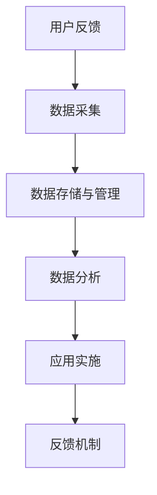

                 

# 知识付费产品的用户反馈闭环管理

## 1. 背景介绍

在知识付费领域，用户反馈的收集和处理是提升产品质量和用户体验的关键。与传统产品不同，知识付费产品注重的是内容深度和知识传递的准确性，因此用户反馈的及时性和有效性显得尤为重要。如何高效、系统地管理用户反馈，并据此不断优化产品内容，提升用户满意度，已成为知识付费平台的重要课题。

### 1.1 问题由来
知识付费产品以提供深度知识内容为主，用户在使用过程中会产生大量有价值的反馈信息，这些反馈不仅包括对内容的评价，还涵盖了对用户体验、课程设计、技术实现等多个维度。然而，面对海量的用户反馈数据，如何自动化处理这些数据，并转化为产品改进的有效依据，是一个亟待解决的挑战。

### 1.2 问题核心关键点
基于用户反馈的闭环管理，旨在构建一个覆盖数据收集、分析、应用、反馈的闭环系统，确保用户反馈能够被有效处理和及时响应，同时形成可量化的改进措施，推动产品迭代和优化。

### 1.3 问题研究意义
1. **提升用户体验**：通过用户反馈闭环管理，可以及时调整产品功能和内容，提升用户体验，增加用户粘性。
2. **优化内容质量**：利用用户反馈指导内容创作和优化，提高知识内容的准确性和实用性。
3. **降低运营成本**：自动化反馈处理流程，减少人工干预，提高运营效率，降低成本。
4. **增强市场竞争力**：快速响应市场和用户需求变化，保持产品领先优势。

## 2. 核心概念与联系

### 2.1 核心概念概述

为更好地理解基于用户反馈的闭环管理方法，本节将介绍几个关键概念：

- **用户反馈**：用户在产品使用过程中产生的评价、意见、建议等反馈信息。
- **数据采集**：通过API接口、用户调查问卷、行为分析等方式，收集用户反馈数据。
- **数据存储与管理**：将收集到的用户反馈数据进行结构化存储和管理，便于后续分析。
- **数据分析**：对用户反馈数据进行挖掘和分析，提取有价值的信息。
- **应用实施**：根据数据分析结果，制定产品优化策略，并实施相应的改进措施。
- **反馈机制**：建立闭环反馈机制，确保用户对改进措施的反应，形成良性循环。

这些概念之间的逻辑关系可以通过以下Mermaid流程图来展示：



这个流程图展示了大规模知识付费产品用户反馈闭环管理的主要流程：

1. 用户反馈的收集与存储。
2. 数据分析和用户需求挖掘。
3. 实施产品优化措施。
4. 对优化措施的反馈和评估。

## 3. 核心算法原理 & 具体操作步骤
### 3.1 算法原理概述

基于用户反馈的闭环管理方法，本质上是一个数据驱动的产品优化流程。其核心思想是：通过用户反馈数据的收集、分析和应用，不断迭代优化产品功能和内容，形成用户满意度的提升和产品性能的增强。

形式化地，假设知识付费产品 $P$ 具有 $N$ 个用户 $U=\{u_1,u_2,\ldots,u_N\}$，每个用户 $u_i$ 在某个时间段内提供 $M$ 条反馈数据 $D=\{d_{i1},d_{i2},\ldots,d_{iM}\}$。基于用户反馈的闭环管理的目标是：

$$
\max_{F} \sum_{i=1}^N \sum_{j=1}^M f(d_{ij},F)
$$

其中 $F$ 为产品优化措施，$f(d_{ij},F)$ 为反馈 $d_{ij}$ 对应的满意度提升，可以表示为改进后的用户满意度与原满意度的差值。

### 3.2 算法步骤详解

基于用户反馈的闭环管理一般包括以下几个关键步骤：

**Step 1: 数据采集与预处理**
- 通过API接口、用户调查问卷、行为分析等方式，收集用户反馈数据，涵盖文本评价、行为数据、用户画像等多个维度。
- 对收集到的数据进行清洗和预处理，去除无关信息、异常值和噪声数据。

**Step 2: 数据存储与管理**
- 将预处理后的数据存储在数据仓库或数据库中，建立合适的数据模型，支持后续的数据查询和分析。
- 引入数据治理机制，如数据质量监控、数据更新策略等，确保数据的完整性和一致性。

**Step 3: 数据分析与挖掘**
- 对用户反馈数据进行文本分析、情感分析、行为分析等，提取用户对产品的评价、需求、痛点等关键信息。
- 利用机器学习模型，如NLP模型、分类器、聚类算法等，对反馈数据进行分类和聚类，形成用户需求矩阵。

**Step 4: 应用实施与改进**
- 根据用户需求矩阵，制定产品优化策略，包括内容更新、功能增强、用户体验优化等。
- 实施优化措施，更新产品版本，并进行A/B测试，验证改进效果。

**Step 5: 反馈机制与评估**
- 通过反馈表、调查问卷等方式，收集用户对优化措施的评价和建议。
- 根据用户反馈，调整优化策略，形成新的产品改进方案，进入下一轮闭环管理。

### 3.3 算法优缺点

基于用户反馈的闭环管理方法具有以下优点：
1. 数据驱动：利用用户反馈数据指导产品优化，提升改进措施的有效性和针对性。
2. 系统化：通过系统化的闭环流程，确保每个环节都有明确的责任和目标。
3. 及时响应：自动化反馈处理流程，快速响应用户需求，提高用户体验。
4. 持续改进：不断迭代优化产品，提升产品质量和市场竞争力。

同时，该方法也存在一定的局限性：
1. 数据质量依赖：闭环管理的成效依赖于数据采集和处理的准确性，数据质量差可能导致误导性决策。
2. 反馈效果不一：用户反馈的反馈效果可能存在较大差异，对某些用户的反馈效果不佳。
3. 成本较高：系统建设和运维成本较高，对中小型知识付费平台可能不适用。

尽管存在这些局限性，但就目前而言，基于用户反馈的闭环管理方法仍是知识付费产品优化的一个重要范式。未来相关研究的重点在于如何进一步降低数据处理的复杂性，提高闭环管理的自动化和智能化水平，同时兼顾可解释性和数据隐私保护等因素。

### 3.4 算法应用领域

基于用户反馈的闭环管理方法，已经在知识付费产品的多个领域得到广泛应用，包括但不限于：

- 课程内容优化：通过分析用户反馈，优化课程内容，增加深度和实用性，提升用户学习体验。
- 功能改进：根据用户需求，增加或改进产品功能，如搜索、推荐、互动等，提高用户使用效率。
- 用户体验优化：收集用户反馈，调整界面设计、交互方式等，提升用户粘性和满意度。
- 市场反应监测：通过用户反馈，监测市场趋势和用户需求变化，指导产品方向调整。

此外，在教育培训、在线阅读、企业培训等诸多领域，用户反馈闭环管理也被广泛应用于产品的迭代和优化，为知识传播和知识服务的提升提供了有力支持。

## 4. 数学模型和公式 & 详细讲解  
### 4.1 数学模型构建

本节将使用数学语言对基于用户反馈的闭环管理过程进行更加严格的刻画。

假设知识付费平台收集到 $N$ 个用户的 $M$ 条反馈数据，每条反馈数据 $d_{ij}$ 可以表示为文本 $t_{ij}$ 和情感评分 $s_{ij}$，其中 $t_{ij}$ 为文本内容，$s_{ij}$ 为情感评分（如0-5分）。定义用户对产品 $P$ 的满意度为 $S(u)$，则满意度提升可以表示为：

$$
\Delta S(u) = S(u)^* - S(u) = \sum_{j=1}^M f(d_{ij},F)
$$

其中 $S(u)^*$ 为改进后的满意度，$f(d_{ij},F)$ 为反馈 $d_{ij}$ 对应的满意度提升函数。

### 4.2 公式推导过程

以下我们以用户满意度的提升为例，推导基于用户反馈的闭环管理公式。

假设用户 $u_i$ 提供了 $M$ 条反馈数据 $D=\{d_{i1},d_{i2},\ldots,d_{iM}\}$，每条反馈数据 $d_{ij}$ 包含文本 $t_{ij}$ 和情感评分 $s_{ij}$。定义用户对产品 $P$ 的满意度为 $S(u)$，则满意度提升可以表示为：

$$
\Delta S(u) = \sum_{j=1}^M s_{ij} \times \Delta f(d_{ij},F)
$$

其中 $\Delta f(d_{ij},F)$ 为反馈 $d_{ij}$ 对应的满意度提升函数。

通过引入满意度提升函数，我们可以将用户反馈对满意度的影响转化为具体的数值，从而对改进措施的效果进行量化评估。

### 4.3 案例分析与讲解

**案例一：课程内容优化**

假设平台收集到用户 $u_i$ 的 $M$ 条反馈数据，每条反馈数据 $d_{ij}$ 包含对课程内容的评价 $t_{ij}$ 和情感评分 $s_{ij}$。通过文本分析，将评价 $t_{ij}$ 转化为课程内容的改进需求，并根据情感评分 $s_{ij}$ 确定需求的重要性和优先级。定义课程改进后的用户满意度为 $S(u)^*$，则满意度提升可以表示为：

$$
\Delta S(u) = \sum_{j=1}^M s_{ij} \times \left(\frac{N_{d_{ij}^+}}{N_{d_{ij}^-}} - 1\right)
$$

其中 $N_{d_{ij}^+}$ 和 $N_{d_{ij}^-}$ 分别表示评价 $d_{ij}$ 中对课程内容持正面和负面评价的用户数量。

通过上述公式，可以计算出课程内容改进对用户满意度的提升，指导课程优化策略的制定和实施。

**案例二：功能改进**

假设平台收集到用户 $u_i$ 的 $M$ 条反馈数据，每条反馈数据 $d_{ij}$ 包含对产品功能的评价 $t_{ij}$ 和情感评分 $s_{ij}$。通过文本分析，将评价 $t_{ij}$ 转化为功能的改进需求，并根据情感评分 $s_{ij}$ 确定需求的重要性和优先级。定义功能改进后的用户满意度为 $S(u)^*$，则满意度提升可以表示为：

$$
\Delta S(u) = \sum_{j=1}^M s_{ij} \times \left(1 - \frac{T_{d_{ij}}}{T_{\text{total}}}\right)
$$

其中 $T_{d_{ij}}$ 表示评价 $d_{ij}$ 中提到的新功能在产品中的使用频率，$T_{\text{total}}$ 表示所有用户的功能使用频率总和。

通过上述公式，可以计算出功能改进对用户满意度的提升，指导功能改进策略的制定和实施。

## 5. 项目实践：代码实例和详细解释说明
### 5.1 开发环境搭建

在进行闭环管理实践前，我们需要准备好开发环境。以下是使用Python进行Flask框架开发的环境配置流程：

1. 安装Python：从官网下载并安装Python，用于构建web应用。
2. 安装Flask：通过pip安装Flask框架。
3. 安装相关库：安装Flask相关的扩展库，如Flask-RESTful、Flask-SQLAlchemy、Flask-WTF等。
4. 创建虚拟环境：使用virtualenv创建虚拟环境，确保项目依赖隔离。

完成上述步骤后，即可在虚拟环境中开始闭环管理实践。

### 5.2 源代码详细实现

下面以Flask框架为例，给出用户反馈闭环管理的代码实现。

首先，定义数据模型：

```python
from flask_sqlalchemy import SQLAlchemy

db = SQLAlchemy(app)

class Feedback(db.Model):
    id = db.Column(db.Integer, primary_key=True)
    user_id = db.Column(db.Integer)
    timestamp = db.Column(db.DateTime)
    content = db.Column(db.Text)
    rating = db.Column(db.Integer)

class User(db.Model):
    id = db.Column(db.Integer, primary_key=True)
    username = db.Column(db.String(50))
    email = db.Column(db.String(50))
```

然后，定义API接口：

```python
from flask_restful import Resource, Api

api = Api(app)

class FeedbackResource(Resource):
    def get(self):
        feedbacks = Feedback.query.all()
        return {'feedbacks': [dict(feedback) for feedback in feedbacks]}

    def post(self):
        feedback = Feedback(user_id=request.json['user_id'], timestamp=datetime.datetime.now(), content=request.json['content'], rating=request.json['rating'])
        db.session.add(feedback)
        db.session.commit()
        return {'message': 'Feedback added'}, 201
```

最后，启动Flask应用：

```python
if __name__ == '__main__':
    app.run(debug=True)
```

以上就是使用Flask框架对用户反馈进行存储和管理的完整代码实现。可以看到，Flask框架配合SQLAlchemy库使得数据存储和管理变得简洁高效。开发者可以将更多精力放在API接口的设计和业务逻辑的实现上，而不必过多关注底层的实现细节。

### 5.3 代码解读与分析

让我们再详细解读一下关键代码的实现细节：

**Feedback模型**：
- 定义了反馈数据的表格结构，包含用户ID、时间戳、内容和评分。
- 使用SQLAlchemy进行数据库操作，方便数据的查询、插入、更新和删除。

**FeedbackResource类**：
- 实现了Flask的RESTful API，支持GET和POST请求。
- GET请求用于获取所有反馈数据，POST请求用于添加新的反馈数据。

**app.run()**：
- 启动Flask应用，并设置debug模式，方便调试和开发。

以上代码实现了用户反馈数据的简单存储和管理，通过Flask框架和SQLAlchemy库，可以轻松扩展和优化API接口，支持更丰富的数据操作和业务逻辑。

## 6. 实际应用场景
### 6.1 智能推荐系统

用户反馈闭环管理可以广泛应用于智能推荐系统的优化中。推荐系统通常依赖用户的历史行为数据进行物品推荐，而用户反馈数据可以进一步优化推荐效果，提供更个性化和精准的推荐结果。

在实践中，可以收集用户对推荐结果的评价和建议，通过文本分析和情感分析，提取用户对推荐物品的喜好和偏好。根据用户反馈，调整推荐算法和推荐策略，进一步提升推荐系统的准确性和满意度。

### 6.2 内容创作平台

内容创作平台如知乎、知乎专栏、维基百科等，用户反馈对于内容创作和质量提升具有重要意义。通过用户反馈，可以获取用户对内容的评价和需求，指导内容创作的方向和深度，提高内容的吸引力和传播力。

在实践中，可以收集用户对文章的评价、点赞、分享等数据，利用情感分析和文本挖掘技术，提取用户对文章内容的满意度和改进建议。根据用户反馈，调整内容创作策略，鼓励优质内容的创作和传播，提升平台的用户体验和内容质量。

### 6.3 在线教育平台

在线教育平台如Coursera、Udemy等，用户反馈对于课程内容和教学质量的优化具有重要价值。通过用户反馈，可以获取用户对课程的评价和需求，指导课程内容的调整和优化，提升课程质量和用户体验。

在实践中，可以收集用户对课程的评价、提问、讨论等数据，利用文本分析和情感分析，提取用户对课程内容的满意度和改进建议。根据用户反馈，调整课程内容和教学方法，提高课程的实用性和吸引力，提升用户的学习效果和满意度。

### 6.4 未来应用展望

随着用户反馈闭环管理技术的不断发展，其在更多领域得到应用，为相关领域带来了新的创新和突破。

在智慧医疗领域，用户反馈可以用于医疗服务的改进和优化，提升患者的治疗体验和满意度。通过收集用户对医疗服务的评价和建议，优化诊疗流程和医疗服务，提高医疗服务的质量和治疗效果。

在智能客服领域，用户反馈可以用于客服系统的改进和优化，提升客户体验和满意度。通过收集用户对客服服务的评价和建议，优化客服系统，提高客服的响应速度和准确性，提升客户的问题解决率和满意度。

在智能家居领域，用户反馈可以用于智能家居设备的改进和优化，提升用户的居住体验和满意度。通过收集用户对智能家居设备的评价和建议，优化智能家居设备的控制方式和功能，提高智能家居设备的实用性和用户体验。

此外，在更多领域，如智能交通、智能制造、智能农业等，用户反馈闭环管理也被广泛应用于系统的优化和改进，为各行各业带来新的变革和创新。相信随着技术的不断进步，用户反馈闭环管理必将在更多领域发挥更大的作用，推动社会各领域的数字化转型和智能化升级。

## 7. 工具和资源推荐
### 7.1 学习资源推荐

为了帮助开发者系统掌握用户反馈闭环管理的技术基础和实践技巧，这里推荐一些优质的学习资源：

1. **《机器学习实战》**：这是一本介绍机器学习基础和应用实践的经典书籍，涵盖了数据分析、模型训练、评估等多个方面，适合初学者和进阶开发者。
2. **《Python数据科学手册》**：这是一本介绍Python在数据科学领域应用的书籍，涵盖了数据清洗、数据分析、机器学习等多个方面，适合有一定编程基础的读者。
3. **《数据驱动的产品开发》**：这是一本介绍数据驱动产品开发的书籍，涵盖了产品设计、数据分析、用户体验等多个方面，适合产品设计和运营开发者。
4. **Kaggle**：这是一个数据科学竞赛平台，提供了丰富的数据集和竞赛任务，适合数据科学和机器学习爱好者。
5. **Coursera**：这是一个在线学习平台，提供大量的数据科学和机器学习课程，适合系统学习数据科学知识。

通过对这些资源的学习实践，相信你一定能够快速掌握用户反馈闭环管理的精髓，并用于解决实际的业务问题。

### 7.2 开发工具推荐

高效的开发离不开优秀的工具支持。以下是几款用于用户反馈闭环管理的常用工具：

1. **Flask**：这是一个轻量级的Python Web框架，适合快速开发Web应用。
2. **SQLAlchemy**：这是一个Python ORM库，支持多种数据库操作，适合数据存储和管理。
3. **Pandas**：这是一个Python数据分析库，适合数据清洗和处理。
4. **NLTK**：这是一个Python自然语言处理库，适合文本分析和情感分析。
5. **Scikit-learn**：这是一个Python机器学习库，适合构建和训练机器学习模型。

合理利用这些工具，可以显著提升用户反馈闭环管理的开发效率，加快创新迭代的步伐。

### 7.3 相关论文推荐

用户反馈闭环管理技术的发展源于学界的持续研究。以下是几篇奠基性的相关论文，推荐阅读：

1. **《用户反馈分析与优化》**：这篇论文探讨了用户反馈分析的方法和技术，介绍了文本分析、情感分析、行为分析等多个方面的内容，适合了解用户反馈分析的理论与实践。
2. **《基于用户反馈的推荐系统优化》**：这篇论文探讨了基于用户反馈的推荐系统优化方法，介绍了推荐系统的工作原理和优化策略，适合了解推荐系统的优化技术。
3. **《数据驱动的产品设计》**：这篇论文探讨了数据驱动产品设计的方法和技术，介绍了用户体验设计、数据分析、AB测试等多个方面的内容，适合了解数据驱动产品设计的理论与实践。

这些论文代表了大规模知识付费产品用户反馈闭环管理的发展脉络。通过学习这些前沿成果，可以帮助研究者把握学科前进方向，激发更多的创新灵感。

## 8. 总结：未来发展趋势与挑战
### 8.1 总结

本文对基于用户反馈的闭环管理方法进行了全面系统的介绍。首先阐述了知识付费产品的用户反馈闭环管理的重要性和核心关键点，明确了闭环管理在提升用户体验、优化内容质量、降低运营成本等方面的价值。其次，从原理到实践，详细讲解了闭环管理的数学模型和操作步骤，给出了闭环任务开发的完整代码实例。同时，本文还广泛探讨了闭环管理方法在智能推荐系统、内容创作平台、在线教育平台等多个领域的应用前景，展示了闭环管理范式的巨大潜力。此外，本文精选了闭环管理的各类学习资源，力求为读者提供全方位的技术指引。

通过本文的系统梳理，可以看到，基于用户反馈的闭环管理方法正在成为知识付费产品优化的一个重要范式，极大地提升了产品性能和用户体验，推动了知识付费平台的发展和创新。未来，伴随用户反馈技术的持续演进，闭环管理将不断优化，进一步提升知识付费产品的影响力和市场竞争力。

### 8.2 未来发展趋势

展望未来，用户反馈闭环管理技术将呈现以下几个发展趋势：

1. **自动化程度提高**：随着AI技术的发展，自动化分析工具将更加智能，能够自动提取用户反馈中的关键信息和改进建议，形成闭环管理自动化流程。
2. **多模态数据融合**：未来闭环管理将引入更多维度的数据，如视频、音频、图像等，通过多模态数据的融合，提升产品性能和用户体验。
3. **实时响应机制**：构建实时响应机制，能够快速响应用户反馈，及时调整产品策略，提高用户体验。
4. **个性化推荐**：通过用户反馈，构建更加个性化的推荐系统，提升推荐效果和用户满意度。
5. **跨平台协同**：实现不同平台之间的数据互通和协同，提升整体用户体验和系统效率。
6. **智能决策支持**：利用机器学习和数据挖掘技术，提供智能决策支持，指导产品优化策略的制定和实施。

以上趋势凸显了大规模知识付费产品用户反馈闭环管理的广阔前景。这些方向的探索发展，必将进一步提升知识付费产品的性能和用户体验，推动知识付费平台的持续创新和优化。

### 8.3 面临的挑战

尽管用户反馈闭环管理技术已经取得了瞩目成就，但在迈向更加智能化、普适化应用的过程中，它仍面临着诸多挑战：

1. **数据质量问题**：闭环管理的成效依赖于数据的质量，数据缺失、噪音和异常值等问题可能导致误导性决策。
2. **用户反馈的复杂性**：用户反馈的信息量和复杂度较大，需要高效的文本分析和情感分析算法，才能提取出有价值的信息。
3. **反馈机制的响应速度**：快速响应用户反馈，及时调整产品策略，是提升用户体验的关键。然而，自动化响应机制的设计和实现需要较高的技术门槛。
4. **系统整合难度**：用户反馈闭环管理涉及多个系统模块的整合，包括数据采集、存储、分析、应用等，系统整合难度较大。
5. **隐私和安全问题**：用户反馈数据的收集和处理需要遵守数据隐私和安全规定，确保用户信息的安全。

尽管存在这些挑战，但通过不断的技术创新和优化，用户反馈闭环管理必将成为知识付费产品优化的重要手段，推动产品向更高的智能化水平发展。

### 8.4 研究展望

面对用户反馈闭环管理所面临的挑战，未来的研究需要在以下几个方面寻求新的突破：

1. **自动化数据分析**：开发更加高效的自动化分析工具，能够自动提取用户反馈中的关键信息和改进建议，形成闭环管理自动化流程。
2. **多模态数据融合**：引入更多维度的数据，如视频、音频、图像等，通过多模态数据的融合，提升产品性能和用户体验。
3. **实时响应机制**：构建实时响应机制，能够快速响应用户反馈，及时调整产品策略，提高用户体验。
4. **个性化推荐**：通过用户反馈，构建更加个性化的推荐系统，提升推荐效果和用户满意度。
5. **跨平台协同**：实现不同平台之间的数据互通和协同，提升整体用户体验和系统效率。
6. **智能决策支持**：利用机器学习和数据挖掘技术，提供智能决策支持，指导产品优化策略的制定和实施。

这些研究方向的研究进展，将不断推动用户反馈闭环管理技术的成熟和应用，提升知识付费产品的性能和用户体验，为知识传播和知识服务的优化提供有力支持。面向未来，用户反馈闭环管理需要与其他人工智能技术进行更深入的融合，如自然语言处理、知识图谱、强化学习等，多路径协同发力，共同推动知识付费产品的进步。只有勇于创新、敢于突破，才能不断拓展知识付费产品的边界，让智能技术更好地造福人类社会。

## 9. 附录：常见问题与解答

**Q1：如何选择合适的数据采集方式？**

A: 数据采集是用户反馈闭环管理的第一步，选择合适的数据采集方式至关重要。根据不同的产品特点和用户群体，可以选择API接口、用户调查问卷、行为分析等不同的采集方式。例如，对于在线教育平台，可以采用行为分析方式，收集用户在学习过程中的互动数据；对于内容创作平台，可以采用用户调查问卷方式，获取用户对内容的评价和建议。

**Q2：如何进行用户反馈数据的预处理？**

A: 数据预处理是用户反馈闭环管理的重要环节，通过预处理，可以去除无关信息、异常值和噪声数据，确保数据的准确性和可靠性。常见的预处理方式包括数据清洗、缺失值处理、文本规范化等。例如，对于文本数据，可以进行文本分词、去停用词、去除噪声等处理，确保文本数据的清洁和一致性。

**Q3：如何进行用户反馈数据的存储与管理？**

A: 数据存储与管理是用户反馈闭环管理的基础，通过合理的存储和管理，可以保证数据的安全性和可访问性。常见的存储方式包括关系型数据库、NoSQL数据库、云存储等。例如，可以使用SQLAlchemy进行数据库操作，使用Redis进行缓存，使用AWS S3进行数据备份等。

**Q4：如何进行用户反馈数据的分析与挖掘？**

A: 数据分析与挖掘是用户反馈闭环管理的核心，通过分析与挖掘，可以提取用户反馈中的关键信息和改进建议，指导产品的优化和改进。常见的分析方式包括文本分析、情感分析、行为分析等。例如，可以使用NLTK、Scikit-learn等工具进行文本分析和情感分析，使用K-means、聚类分析等算法进行行为分析。

**Q5：如何进行产品优化和改进？**

A: 根据用户反馈的数据分析结果，制定产品优化和改进策略，实施相应的改进措施，并评估改进效果。常见的优化方式包括内容更新、功能增强、用户体验优化等。例如，对于课程内容优化，可以根据用户反馈调整课程内容和设计；对于功能改进，可以根据用户反馈增加或改进产品功能；对于用户体验优化，可以根据用户反馈调整界面设计和交互方式。

**Q6：如何进行闭环管理的自动化和智能化？**

A: 自动化和智能化是用户反馈闭环管理的未来方向，通过自动化和智能化，可以进一步提升闭环管理的效率和准确性。常见的自动化和智能化方式包括自动化数据采集、自动化数据分析、自动化反馈处理等。例如，可以使用机器学习模型进行自动化数据分析，使用API接口实现自动化反馈处理，使用智能决策系统进行自动化优化和改进。

这些问题的解答，可以为开发者提供用户反馈闭环管理的具体实现步骤和优化建议，帮助开发者更好地理解并应用用户反馈闭环管理技术，提升产品性能和用户体验。

---

作者：禅与计算机程序设计艺术 / Zen and the Art of Computer Programming

