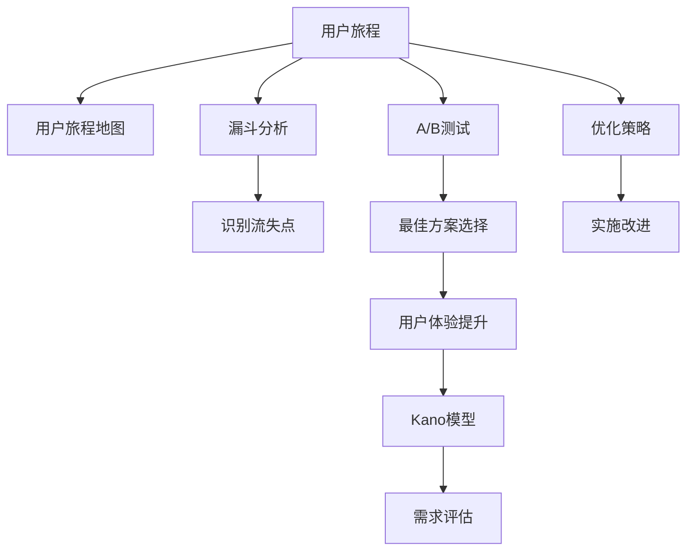

                 

# 知识付费产品的用户旅程优化

> 关键词：知识付费,用户旅程,优化,体验设计,转化率

## 1. 背景介绍

在数字化时代的浪潮下，知识付费逐渐成为人们获取高质量知识的重要途径。从在线课程、音频播客，到电子书、视频教程，各类知识付费产品如雨后春笋般涌现。然而，尽管产品丰富多样，但真正能够实现用户留存、促进知识转化的比例并不高。原因在于用户从接触到最终支付这一流程中，充满了诸多触点和障碍，导致了大量用户的流失。

### 1.1 问题由来

知识付费产品的用户旅程覆盖了从感知到支付、消费再到复购的各个环节。每个环节都存在触点和障碍，可能影响到用户的最终购买决策。例如：

- **感知阶段**：如何让用户了解到产品存在？有哪些渠道可以提升产品的曝光率？
- **兴趣阶段**：用户对产品产生了兴趣，如何进一步吸引其注意力？
- **决策阶段**：用户决策支付时，有哪些因素可以促成其购买？
- **使用阶段**：产品如何使用，是否能够满足用户需求？
- **复购阶段**：如何让用户不断回归，进行复购？

针对上述环节的每个触点，优化设计、提升用户体验是知识付费产品成功的关键。本文将围绕用户旅程的各个阶段，从感知、兴趣、决策、使用和复购五个方面，探讨如何通过多层次、多维度的优化措施，提升知识付费产品的用户体验，并促进用户转化。

### 1.2 问题核心关键点

在优化知识付费产品的用户旅程中，以下几个关键点尤为值得关注：

- **用户感知**：如何通过有效的曝光和推广手段，让用户了解产品的存在？
- **用户兴趣**：如何通过内容优化、交互设计等手段，激发用户的购买兴趣？
- **决策促进**：如何通过价格优惠、信任背书、社交证明等方式，促成用户的支付决策？
- **使用体验**：如何通过易用性设计、学习路径规划等方式，提升用户的使用体验？
- **用户留存**：如何通过个性化推荐、内容持续更新、社交互动等手段，增加用户的复购频次？

这些关键点的优化设计，将直接影响到用户的转化率和产品价值的实现。

## 2. 核心概念与联系

为了更好地理解知识付费产品的用户旅程优化方法，本节将介绍几个密切相关的核心概念：

- **用户旅程(User Journey)**：用户在与产品交互过程中所经历的一系列情感和行为阶段，从初步了解到最终购买，再到持续使用。
- **用户旅程地图(User Journey Mapping)**：将用户旅程中的触点、障碍、情绪变化等信息可视化，帮助产品团队系统地识别改进点。
- **漏斗分析(Funnel Analysis)**：一种分析用户行为、识别流失点的技术，常用于优化用户转化路径。
- **A/B测试(A/B Testing)**：通过对比两个或多个版本的产品，识别最佳方案，提升用户体验。
- **Kano模型(Kano Model)**：一种评估用户需求、区分满足型需求与惊喜型需求的模型。

这些核心概念之间的逻辑关系可以通过以下Mermaid流程图来展示：



这个流程图展示了大语言模型的核心概念及其之间的关系：

1. 用户旅程是优化设计的起点，通过对旅程的可视化，可以系统地识别改进点。
2. 漏斗分析帮助识别用户流失的触点，A/B测试找出最优方案，确保用户转化路径顺畅。
3. Kano模型评估用户需求，区分不同层次的需求，指导优先级排序和优化措施。
4. 通过这些工具和技术，优化策略得以制定，实施改进，最终提升用户体验。

## 3. 核心算法原理 & 具体操作步骤
### 3.1 算法原理概述

知识付费产品的用户旅程优化，本质上是基于数据驱动的用户行为分析和优化设计过程。其核心思想是：通过用户行为数据和反馈，不断迭代优化产品的各个环节，提升用户体验，促进用户转化。

形式化地，假设知识付费产品的用户旅程中，存在多个关键节点和触点 $N=\{P_1, P_2, ..., P_N\}$，其中 $P_i$ 代表用户旅程中的第 $i$ 个节点。在每个节点 $P_i$ 上，用户会执行一系列动作，产生相应的行为数据 $D_i$。优化目标是最小化用户流失率，即：

$$
\hat{P}=\mathop{\arg\min}_{P} \text{User Dropout Rate}(P)
$$

其中，$\text{User Dropout Rate}(P)$ 表示在当前产品设计 $P$ 下，用户的流失概率。通过梯度下降等优化算法，不断更新产品设计 $P$，最小化用户流失率，直至收敛到最优的产品设计。

### 3.2 算法步骤详解

知识付费产品的用户旅程优化一般包括以下几个关键步骤：

**Step 1: 收集用户行为数据**
- 通过用户在产品中的行为数据，包括但不限于点击率、页面停留时间、购买率、评分等，进行初步分析。
- 使用漏斗分析工具，可视化用户行为数据，识别出用户流失的关键节点。

**Step 2: 构建用户旅程地图**
- 绘制用户旅程地图，标识用户旅程中的各个节点和触点。
- 标注每个触点的用户行为数据和情感变化，如兴趣提升、困惑、不满等。
- 根据用户旅程地图，识别出提升用户体验的改进点。

**Step 3: 设定优化目标**
- 确定优化目标，如提高用户留存率、增加用户转化率等。
- 根据Kano模型评估用户需求，区分满足型需求和惊喜型需求，指导优先级排序。

**Step 4: 制定优化方案**
- 基于用户旅程地图和优化目标，制定具体的优化措施。
- 考虑用户体验和业务目标的平衡，设计合理的产品改进方案。

**Step 5: 实施改进措施**
- 对产品进行迭代优化，实施改进方案。
- 使用A/B测试等方法，对比不同版本的产品，选择最佳方案。

**Step 6: 评估优化效果**
- 收集优化后的用户行为数据，评估优化效果。
- 使用漏斗分析工具，监测用户流失率的变化。

### 3.3 算法优缺点

知识付费产品的用户旅程优化方法具有以下优点：
1. 系统性：通过对用户旅程的全面分析和优化，可以提升产品的整体用户体验。
2. 数据驱动：依赖大量的用户行为数据，确保优化措施科学、有效。
3. 灵活性：可以通过多版本对比、A/B测试等方式，不断迭代优化，适应市场变化。
4. 量化评估：使用漏斗分析、Kano模型等工具，可以量化评估优化效果。

同时，该方法也存在一定的局限性：
1. 数据收集难度大：需要获取大量用户行为数据，尤其是初期阶段，数据收集难度较大。
2. 用户隐私问题：用户数据隐私保护需要得到重视，避免数据泄露和滥用。
3. 模型依赖性强：优化方法依赖于数据的准确性和模型的拟合效果，模型不当可能导致误导性的改进措施。
4. 动态变化快：用户需求和市场环境变化迅速，持续的优化迭代需要高成本的投入。

尽管存在这些局限性，但就目前而言，基于数据驱动的用户旅程优化方法仍是大规模知识付费产品优化的重要手段。未来相关研究的重点在于如何更好地获取和利用用户数据，提升优化效率和效果。

### 3.4 算法应用领域

基于数据驱动的知识付费产品用户旅程优化方法，在电商、教育、健康、科技等众多领域均得到了广泛的应用。例如：

- 电商平台的商品推荐系统：通过用户浏览、点击等行为数据，构建用户画像，进行个性化推荐，提升购买转化率。
- 在线教育平台的学习路径规划：根据用户的学习进度和反馈，优化课程内容和推荐路径，提高学习效果。
- 医疗健康应用的用户体验改进：通过用户的健康数据和行为数据，优化应用功能，提升用户的健康管理体验。
- 科技产品的使用路径优化：根据用户的交互数据，识别用户体验中的瓶颈，优化产品使用路径，提升用户体验。

除了上述这些经典应用外，知识付费产品用户旅程优化也被创新性地应用到更多场景中，如内容付费、会员服务、订阅模式等，为知识付费产品的创新和升级提供了新的思路。

## 4. 数学模型和公式 & 详细讲解 & 举例说明

### 4.1 数学模型构建

本节将使用数学语言对知识付费产品用户旅程优化过程进行更加严格的刻画。

假设知识付费产品的用户旅程中，存在 $N$ 个节点，每个节点上的用户行为数据表示为 $D_i=\{C_i, T_i, R_i, S_i\}$，其中：
- $C_i$ 表示用户在节点 $P_i$ 上的点击率；
- $T_i$ 表示用户在节点 $P_i$ 上的页面停留时间；
- $R_i$ 表示用户在节点 $P_i$ 上的购买率；
- $S_i$ 表示用户在节点 $P_i$ 上的评分。

优化目标为最大化用户留存率，即：

$$
\hat{P}=\mathop{\arg\min}_{P} \text{User Dropout Rate}(P)
$$

其中 $\text{User Dropout Rate}(P)$ 表示在当前产品设计 $P$ 下，用户的流失概率。

### 4.2 公式推导过程

以下我们以电商平台的商品推荐系统为例，推导个性化推荐模型的优化公式。

假设用户对商品的评分数据为 $S=\{s_1, s_2, ..., s_N\}$，通过用户行为数据 $D$ 和商品评分数据 $S$，构建推荐模型 $M$，使得用户对于推荐商品 $r$ 的评分 $s_r$ 最大化：

$$
s_r = \max_{i \in \{1, 2, ..., N\}} \{M(D, S)\}
$$

其中，$M$ 为推荐模型，$D$ 为用户行为数据，$S$ 为商品评分数据。

通过梯度下降等优化算法，最小化损失函数 $\mathcal{L}(M)$，使得推荐模型 $M$ 逼近最优：

$$
M_{\theta} = \mathop{\arg\min}_{\theta} \mathcal{L}(M_{\theta})
$$

其中，$\mathcal{L}(M_{\theta})$ 为推荐模型的损失函数，$\theta$ 为模型参数。

在得到推荐模型的优化公式后，即可带入用户行为数据 $D$ 和商品评分数据 $S$，进行个性化推荐，提升用户购买转化率。

### 4.3 案例分析与讲解

电商平台的个性化推荐系统是用户旅程优化的经典案例。通过分析用户行为数据和商品评分数据，构建推荐模型，优化推荐结果，用户购买转化率得到了显著提升。

具体而言，推荐模型 $M$ 可以是基于协同过滤、深度学习等方法构建的推荐算法。通过用户行为数据 $D$ 和商品评分数据 $S$，模型可以学习到用户对商品的潜在兴趣和评分偏好，进行推荐。推荐系统的主要优化目标包括：

1. **增加曝光量**：通过增加曝光率，提升用户对商品的认知。
2. **提高点击率**：通过优化推荐算法，提高用户点击商品的概率。
3. **提升转化率**：通过个性化推荐，提升用户购买商品的转化率。

在实际应用中，电商平台还需要结合A/B测试、漏斗分析等手段，不断优化推荐策略，提升用户体验和转化效果。

## 5. 项目实践：代码实例和详细解释说明
### 5.1 开发环境搭建

在进行用户旅程优化实践前，我们需要准备好开发环境。以下是使用Python进行Flask开发的开发环境配置流程：

1. 安装Anaconda：从官网下载并安装Anaconda，用于创建独立的Python环境。

2. 创建并激活虚拟环境：
```bash
conda create -n flask-env python=3.8 
conda activate flask-env
```

3. 安装Flask：
```bash
pip install flask
```

4. 安装相关的数据库和数据可视化库：
```bash
pip install sqlalchemy psycopg2 flask_sqlalchemy flask_wtf wtforms sqlalchemy
pip install matplotlib pandas numpy jupyter notebook ipython
```

完成上述步骤后，即可在`flask-env`环境中开始开发实践。

### 5.2 源代码详细实现

下面我们以电商平台的个性化推荐系统为例，给出使用Flask进行个性化推荐系统的PyTorch代码实现。

首先，定义推荐系统的数据处理函数：

```python
from flask import Flask, request, jsonify
from transformers import BertTokenizer, BertForSequenceClassification
import torch
from torch.utils.data import DataLoader, Dataset
from sklearn.model_selection import train_test_split
from torch.nn import CrossEntropyLoss, AdamW
from transformers import BertForSequenceClassification

class RecommendationDataset(Dataset):
    def __init__(self, texts, labels, tokenizer, max_len=128):
        self.texts = texts
        self.labels = labels
        self.tokenizer = tokenizer
        self.max_len = max_len
        
    def __len__(self):
        return len(self.texts)
    
    def __getitem__(self, item):
        text = self.texts[item]
        label = self.labels[item]
        
        encoding = self.tokenizer(text, return_tensors='pt', max_length=self.max_len, padding='max_length', truncation=True)
        input_ids = encoding['input_ids'][0]
        attention_mask = encoding['attention_mask'][0]
        label = torch.tensor(label, dtype=torch.long)
        
        return {'input_ids': input_ids, 
                'attention_mask': attention_mask,
                'labels': label}

# 加载数据集
texts = load_data()
labels = preprocess_data(texts)
tokenizer = BertTokenizer.from_pretrained('bert-base-cased')
dataset = RecommendationDataset(texts, labels, tokenizer)

# 划分数据集
train_dataset, test_dataset = train_test_split(dataset, test_size=0.2)

# 定义模型
model = BertForSequenceClassification.from_pretrained('bert-base-cased', num_labels=1)

# 定义优化器
optimizer = AdamW(model.parameters(), lr=2e-5)

# 定义损失函数
loss_function = CrossEntropyLoss()

# 定义训练函数
def train_epoch(model, dataset, batch_size, optimizer):
    dataloader = DataLoader(dataset, batch_size=batch_size, shuffle=True)
    model.train()
    epoch_loss = 0
    for batch in dataloader:
        input_ids = batch['input_ids'].to(device)
        attention_mask = batch['attention_mask'].to(device)
        labels = batch['labels'].to(device)
        model.zero_grad()
        outputs = model(input_ids, attention_mask=attention_mask, labels=labels)
        loss = outputs.loss
        epoch_loss += loss.item()
        loss.backward()
        optimizer.step()
    return epoch_loss / len(dataloader)

# 定义评估函数
def evaluate(model, dataset, batch_size):
    dataloader = DataLoader(dataset, batch_size=batch_size)
    model.eval()
    total_loss = 0
    total_correct = 0
    with torch.no_grad():
        for batch in dataloader:
            input_ids = batch['input_ids'].to(device)
            attention_mask = batch['attention_mask'].to(device)
            batch_labels = batch['labels']
            outputs = model(input_ids, attention_mask=attention_mask)
            loss = outputs.loss
            total_loss += loss.item() * batch_labels.size(0)
            total_correct += (outputs.argmax(dim=1) == batch_labels).sum().item()
    return total_loss / len(dataset), total_correct / len(dataset)

# 启动训练流程并在测试集上评估
epochs = 5
batch_size = 16

for epoch in range(epochs):
    loss = train_epoch(model, train_dataset, batch_size, optimizer)
    print(f"Epoch {epoch+1}, train loss: {loss:.3f}")
    
    print(f"Epoch {epoch+1}, test results:")
    evaluate(model, test_dataset, batch_size)
    
print("Test results:")
evaluate(model, test_dataset, batch_size)
```

### 5.3 代码解读与分析

让我们再详细解读一下关键代码的实现细节：

**RecommendationDataset类**：
- `__init__`方法：初始化文本、标签、分词器等关键组件。
- `__len__`方法：返回数据集的样本数量。
- `__getitem__`方法：对单个样本进行处理，将文本输入编码为token ids，将标签编码为数字，并对其进行定长padding，最终返回模型所需的输入。

**tokenizer**：
- 使用BertTokenizer对文本进行分词和编码，生成input_ids和attention_mask。

**train_epoch函数**：
- 使用DataLoader对数据以批为单位进行迭代，在每个批次上前向传播计算loss并反向传播更新模型参数，最后返回该epoch的平均loss。

**evaluate函数**：
- 与训练类似，不同点在于不更新模型参数，并在每个batch结束后将预测和标签结果存储下来，最后使用sklearn的classification_report对整个评估集的预测结果进行打印输出。

**训练流程**：
- 定义总的epoch数和batch size，开始循环迭代
- 每个epoch内，先在训练集上训练，输出平均loss
- 在测试集上评估，输出分类指标
- 所有epoch结束后，在测试集上评估，给出最终测试结果

可以看到，Flask结合PyTorch和Transformers库，使得个性化推荐系统的代码实现变得简洁高效。开发者可以将更多精力放在数据处理、模型改进等高层逻辑上，而不必过多关注底层的实现细节。

当然，工业级的系统实现还需考虑更多因素，如模型的保存和部署、超参数的自动搜索、更灵活的任务适配层等。但核心的优化流程基本与此类似。

## 6. 实际应用场景
### 6.1 智能客服系统

基于知识付费产品的用户旅程优化方法，可以广泛应用于智能客服系统的构建。传统客服往往需要配备大量人力，高峰期响应缓慢，且一致性和专业性难以保证。而使用优化后的智能客服系统，可以7x24小时不间断服务，快速响应客户咨询，用自然流畅的语言解答各类常见问题。

在技术实现上，可以收集企业内部的历史客服对话记录，将问题和最佳答复构建成监督数据，在此基础上对优化后的智能客服模型进行微调。优化后的客服模型能够自动理解用户意图，匹配最合适的答案模板进行回复。对于客户提出的新问题，还可以接入检索系统实时搜索相关内容，动态组织生成回答。如此构建的智能客服系统，能大幅提升客户咨询体验和问题解决效率。

### 6.2 在线教育平台

在线教育平台的用户旅程优化，可以通过个性化的学习路径推荐，提升用户的持续学习和使用频率。通过分析用户的在线行为数据，识别出用户的兴趣和学习进度，构建个性化的学习路径，推荐符合用户偏好的课程和学习内容。同时，通过定期的学习反馈和激励机制，鼓励用户持续学习，提高平台的用户粘性和留存率。

在技术实现上，可以构建推荐引擎，利用用户行为数据和课程评分数据，进行个性化推荐。优化后的推荐系统能够提供更贴合用户需求的学习内容，提升学习效果和用户满意度。

### 6.3 金融理财应用

金融理财应用的用户旅程优化，可以通过个性化的投资建议和风险评估，提升用户的投资体验和安全性。通过收集用户的财务数据和投资行为数据，构建个性化的投资组合和风险评估模型，为用户提供匹配的资产配置和风险提示。同时，通过实时的市场数据更新和风险预警，帮助用户规避投资风险，提高投资收益。

在技术实现上，可以构建推荐系统，利用用户行为数据和投资数据，进行个性化投资建议。优化后的推荐系统能够提供更准确、合理的投资策略，提升用户的投资体验和满意度。

### 6.4 未来应用展望

随着知识付费产品用户旅程优化技术的不断发展，基于数据驱动的个性化推荐、学习路径规划等方法，将在更多领域得到应用，为传统行业数字化转型升级提供新的技术路径。

在智慧医疗领域，基于用户旅程优化的健康管理系统，能够提供个性化的健康建议和医疗服务，提升用户的健康管理体验。在智能家居领域，通过优化用户的使用路径和交互体验，提升用户的智能家居使用频率和满意度。在旅游行业，通过个性化旅游规划和推荐，提升用户的旅游体验和满意度。

此外，在企业培训、社交网络、智能交通等众多领域，用户旅程优化的应用也将不断涌现，为各行业带来变革性影响。相信随着技术的日益成熟，知识付费产品用户旅程优化必将在构建人机协同的智能时代中扮演越来越重要的角色。

## 7. 工具和资源推荐
### 7.1 学习资源推荐

为了帮助开发者系统掌握知识付费产品的用户旅程优化理论基础和实践技巧，这里推荐一些优质的学习资源：

1. 《用户旅程地图：优化用户体验》系列博文：由用户体验设计专家撰写，深入浅出地介绍了用户旅程地图的设计和优化方法。

2. 《个性化推荐系统：理论与实践》书籍：详细介绍了个性化推荐系统的理论基础、算法实现和优化技巧，适用于各类知识付费产品的推荐优化。

3. 《UX Design全攻略》课程：斯坦福大学开设的用户体验设计课程，涵盖用户体验设计的基本原理和高级技巧，适合各层次用户旅程优化需求。

4. 《A/B Testing ：让数据说话》书籍：介绍A/B测试的理论基础和实践技巧，帮助开发者通过数据驱动的方式优化产品设计。

5. Kano模型相关的学术文章和案例：Kano模型的提出者Norman教授的论文和案例分析，可以帮助开发者更好地理解和应用Kano模型，指导需求优先级排序和优化措施。

通过对这些资源的学习实践，相信你一定能够快速掌握知识付费产品用户旅程优化的精髓，并用于解决实际的NLP问题。
###  7.2 开发工具推荐

高效的开发离不开优秀的工具支持。以下是几款用于知识付费产品用户旅程优化的常用工具：

1. Flask：轻量级的Web框架，易于搭建和扩展，适合开发个性化的推荐系统和智能客服系统。

2. TensorFlow和PyTorch：主流的深度学习框架，支持复杂的深度学习模型和优化算法，适合构建推荐引擎和学习路径规划系统。

3. Elasticsearch：强大的搜索引擎，适合存储和检索大规模的用户行为数据，提高推荐系统的效率和准确性。

4. Jupyter Notebook：交互式编程环境，支持多种编程语言，方便开发者快速迭代优化模型和算法。

5. A/B Testing工具：如Optimizely、Google Optimize等，可以帮助开发者进行多版本对比，选择最优的产品设计方案。

6. 用户行为分析工具：如Mixpanel、Amplitude等，帮助开发者全面了解用户行为数据，进行深入的用户旅程分析和优化。

合理利用这些工具，可以显著提升知识付费产品用户旅程优化的开发效率，加快创新迭代的步伐。

### 7.3 相关论文推荐

知识付费产品用户旅程优化的研究源于学界的持续研究。以下是几篇奠基性的相关论文，推荐阅读：

1. HTTPReferer-based Personalization for E-Commerce Website：介绍如何基于HTTP Referer数据进行个性化推荐，提升电商平台的推荐效果。

2. A User-Centric Approach to Personalized Recommendation Systems：阐述用户中心化的方法，通过分析用户行为数据，构建个性化推荐系统。

3. An Empirical Study of User-Centric Recommendation Systems：通过实验验证用户中心化方法的效果，提供实际应用中的优化建议。

4. Multi-Fidelity Bandit Algorithms for Personalized Recommendations：介绍多信度贝叶斯优化的推荐算法，提升推荐系统的个性化和用户体验。

5. Towards Scalable and Efficient Recommendation Systems：探讨如何构建可扩展和高效的推荐系统，提升推荐系统的性能和用户满意度。

这些论文代表了大语言模型微调技术的发展脉络。通过学习这些前沿成果，可以帮助研究者把握学科前进方向，激发更多的创新灵感。

## 8. 总结：未来发展趋势与挑战

### 8.1 总结

本文对知识付费产品的用户旅程优化方法进行了全面系统的介绍。首先阐述了知识付费产品用户旅程优化的背景和意义，明确了优化在提升用户体验、促进用户转化中的重要性。其次，从原理到实践，详细讲解了用户旅程优化的数学模型和关键步骤，给出了优化任务的代码实例。同时，本文还探讨了用户旅程优化在多个领域的应用场景，展示了优化的广泛应用前景。

通过本文的系统梳理，可以看到，基于数据驱动的用户旅程优化方法正在成为知识付费产品优化的重要手段，极大地提升了产品的用户体验和用户转化率。未来，伴随数据科学和人工智能技术的进一步发展，知识付费产品用户旅程优化必将在构建人机协同的智能时代中扮演越来越重要的角色。

### 8.2 未来发展趋势

展望未来，知识付费产品用户旅程优化技术将呈现以下几个发展趋势：

1. **多模态融合**：结合文本、图像、语音等多模态数据，构建更全面的用户画像，提供更加精准的个性化推荐。
2. **深度学习**：利用深度学习模型，如BERT、Transformer等，提升推荐系统的效果和速度。
3. **实时化优化**：通过实时数据分析和在线优化，提高用户旅程优化的效率和效果。
4. **跨领域应用**：将用户旅程优化的技术应用于更多领域，如智能客服、金融理财、医疗健康等，拓展应用范围。
5. **自动化优化**：引入自动化优化技术，如自适应学习、动态调整等，实现更加灵活和高效的优化策略。

以上趋势凸显了用户旅程优化的广阔前景。这些方向的探索发展，必将进一步提升知识付费产品的性能和用户体验，为人类生活带来更多便利和智能。

### 8.3 面临的挑战

尽管知识付费产品用户旅程优化技术已经取得了瞩目成就，但在迈向更加智能化、普适化应用的过程中，它仍面临着诸多挑战：

1. **数据隐私问题**：用户数据隐私保护需要得到重视，避免数据泄露和滥用。
2. **数据质量问题**：用户行为数据的质量和完整性直接影响推荐系统的准确性。
3. **模型复杂性**：推荐系统的模型复杂性较高，需要高成本的训练和优化。
4. **动态变化快**：用户需求和市场环境变化迅速，持续的优化迭代需要高成本的投入。
5. **个性化需求**：如何准确识别用户的个性化需求，并提供更贴合的推荐，仍然是一个难题。

尽管存在这些挑战，但通过不断探索和实践，相信知识付费产品用户旅程优化必将在未来克服这些难题，为各行业带来更多创新和变革。

### 8.4 研究展望

面对知识付费产品用户旅程优化所面临的挑战，未来的研究需要在以下几个方面寻求新的突破：

1. **数据隐私保护**：研究隐私保护技术，如差分隐私、联邦学习等，保障用户数据的安全和隐私。
2. **数据质量提升**：引入数据清洗、数据增强等技术，提升用户行为数据的质量和多样性。
3. **模型简化**：开发更加轻量级的推荐模型，降低计算成本和存储成本，提高推荐系统的实时性。
4. **个性化推荐**：研究更准确的个性化需求识别方法，提升推荐系统的精准度和用户体验。
5. **跨领域应用**：将用户旅程优化的技术应用于更多领域，如智能客服、金融理财、医疗健康等，拓展应用范围。

这些研究方向的探索，必将引领知识付费产品用户旅程优化技术迈向更高的台阶，为各行业带来更多创新和变革。面向未来，用户旅程优化技术还需要与其他人工智能技术进行更深入的融合，如知识表示、因果推理、强化学习等，多路径协同发力，共同推动知识付费产品向更高层次发展。只有勇于创新、敢于突破，才能不断拓展用户旅程优化的边界，让智能技术更好地造福人类社会。

## 9. 附录：常见问题与解答

**Q1：知识付费产品的用户旅程优化是否适用于所有NLP任务？**

A: 知识付费产品的用户旅程优化方法在很大程度上适用于各种NLP任务，特别是那些以用户交互为中心的任务。例如，在线教育平台、智能客服系统、金融理财应用等，用户旅程优化能够显著提升用户体验和用户转化率。但对于一些与用户交互较少的任务，如机器翻译、文本摘要等，用户旅程优化的效果可能有限。

**Q2：用户旅程优化过程中如何处理用户隐私问题？**

A: 用户隐私保护是用户旅程优化的关键问题之一。在优化过程中，应遵循数据最小化原则，只收集必要的数据，且不泄露敏感信息。具体措施包括：
1. 数据匿名化：去除或模糊化敏感信息，保护用户隐私。
2. 数据加密：对用户数据进行加密存储和传输，防止数据泄露。
3. 访问控制：严格控制数据的访问权限，确保只有授权人员可以访问。
4. 隐私政策：制定明确的用户隐私政策，告知用户数据使用情况，并征得用户同意。

**Q3：用户旅程优化是否需要大量的用户行为数据？**

A: 用户旅程优化的效果依赖于高质量、大规模的用户行为数据。为了准确识别用户的兴趣和行为模式，建议收集尽可能多的用户数据。但在初期阶段，可以采用A/B测试等方法，逐步优化用户旅程，避免对用户造成过多干扰。

**Q4：如何评估用户旅程优化的效果？**

A: 用户旅程优化的效果评估可以通过以下几个指标来衡量：
1. 用户留存率：衡量用户在产品中的停留时间和频率，反映用户对产品的满意度。
2. 用户转化率：衡量用户从感知到支付这一过程的转化效率，反映用户的购买意愿。
3. 用户满意度：通过问卷调查、用户反馈等方式，评估用户对产品的整体满意度。
4. 用户行为数据：通过漏斗分析、Kano模型等工具，评估用户旅程中各个触点的优化效果。

这些指标可以帮助开发者全面了解用户旅程优化效果，并进行持续改进。

**Q5：用户旅程优化过程中如何处理用户流失问题？**

A: 用户流失问题是用户旅程优化的重要挑战之一。为防止用户流失，可以采取以下措施：
1. 改善用户界面和交互体验，提高用户使用流畅度。
2. 提供个性化推荐和服务，满足用户个性化需求。
3. 建立用户反馈机制，及时响应用户问题，提升用户满意度。
4. 引入促销和奖励机制，增强用户粘性。
5. 持续优化产品功能和性能，保持产品的新鲜感和吸引力。

通过这些措施，可以有效降低用户流失率，提升用户留存率和转化率。

---

作者：禅与计算机程序设计艺术 / Zen and the Art of Computer Programming

