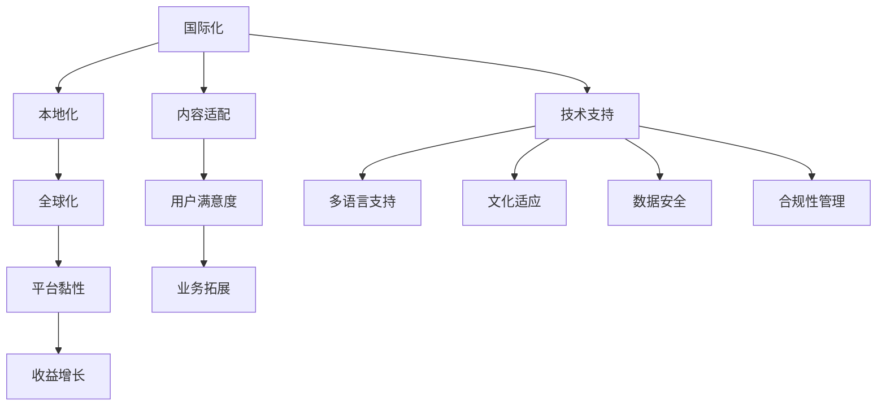

                 

# 知识付费内容的国际化与本地化策略

> 关键词：知识付费、内容国际化、本地化策略、技术挑战、解决方案、案例分析

## 1. 背景介绍

### 1.1 问题由来

在当前全球化日益加速的背景下，知识付费市场正快速增长。随着国际间信息流动的加速，越来越多的用户希望获取到全球范围内的优质知识资源，但不同地区用户的需求和习惯存在差异，本土化内容更容易引起共鸣。因此，知识付费平台需要平衡全球化和本地化，以实现最大化的用户覆盖和收益。

### 1.2 问题核心关键点

知识付费内容的国际化与本地化策略的核心在于：

1. **市场定位**：确定目标市场，分析不同地区的用户需求和支付习惯。
2. **内容适配**：对不同市场进行内容定制，提升用户满意度和平台黏性。
3. **技术支持**：采用先进的国际化和本地化技术，确保内容发布和运营的流畅性。
4. **法规遵守**：了解并遵守不同地区的版权法律和政策，避免侵权风险。
5. **数据隐私**：保护用户数据隐私，确保合规性。

本文将系统地探讨知识付费内容的国际化与本地化策略，结合实际案例，提出行之有效的解决方案，帮助知识付费平台在多样化的市场中取得成功。

## 2. 核心概念与联系

### 2.1 核心概念概述

为更好地理解知识付费内容的国际化与本地化策略，本节将介绍几个密切相关的核心概念：

- **国际化（Internationalization）**：指将应用程序和文档设计成可以适应不同语言和文化环境的过程，以便在多个国家/地区使用。
- **本地化（Localization）**：指将国际化的内容转化为具体国家和地区的语言、文化、习俗、货币和度量单位等，使其适应用户的特定需求。
- **全球化（Globalization）**：指通过跨国界的业务活动和资源整合，实现产品和服务的全球市场化。
- **内容适配（Content Adaptation）**：根据不同市场的用户需求和习惯，对内容进行定制，以提高用户体验。
- **平台国际化与本地化技术（Platform Internationalization & Localization Technology）**：包括多语言支持、文化适应、数据安全、合规性管理等技术手段，确保平台的全球适应性和本地化运营。

这些核心概念之间的逻辑关系可以通过以下Mermaid流程图来展示：



这个流程图展示了大语言模型的核心概念及其之间的关系：

1. 国际化帮助平台覆盖全球市场。
2. 本地化使内容更具吸引力。
3. 全球化促进业务扩展。
4. 内容适配提升用户体验。
5. 技术支持保障平台高效运营。

这些概念共同构成了知识付费内容的国际化与本地化策略的基础，使其能够在多样化的市场中发挥作用。

## 3. 核心算法原理 & 具体操作步骤
### 3.1 算法原理概述

知识付费内容的国际化与本地化策略，本质上是多语言内容管理和用户界面本地化的过程。其核心思想是：通过将平台内容适配成不同语言和文化环境，同时优化用户界面和体验，使平台能够吸引并留存全球用户。

形式化地，假设平台的内容集合为 $C$，目标市场为 $M$。目标是对内容 $C$ 进行本地化处理，以适配各个市场 $M$ 的需求。具体步骤如下：

1. **内容收集与标注**：收集各市场的内容样本，并进行语言和文化标注。
2. **内容翻译与校对**：对收集的内容进行翻译和校对，确保翻译质量。
3. **文化适应与适配**：根据不同市场文化需求，对内容进行文化适应和适配。
4. **用户界面本地化**：根据不同市场语言和习惯，优化用户界面。
5. **发布与监控**：将本地化内容发布至目标市场，并持续监控用户反馈和内容效果。

### 3.2 算法步骤详解

基于国际化和本地化策略的核心思想，以下是详细的步骤：

**Step 1: 内容收集与标注**

1. **收集内容样本**：通过API接口、爬虫等手段，收集各市场的历史内容样本。
2. **标注样本**：对收集到的样本进行语言和文化标注，如内容语言、作者背景、出版日期、用户反馈等。

**Step 2: 内容翻译与校对**

1. **翻译内容**：使用机器翻译工具将内容翻译成目标市场语言。
2. **人工校对**：翻译后，由人工进行校对和修改，确保翻译质量。

**Step 3: 文化适应与适配**

1. **文化分析**：分析不同市场文化差异，如颜色使用、社会礼仪、幽默风格等。
2. **内容适配**：根据文化分析结果，对内容进行适配，如修改图片、调整文本风格等。

**Step 4: 用户界面本地化**

1. **界面翻译**：将界面元素和提示文本翻译成目标市场语言。
2. **UI/UX优化**：根据不同市场用户习惯，调整界面布局和交互设计。

**Step 5: 发布与监控**

1. **内容发布**：将本地化内容发布到目标市场平台。
2. **用户反馈收集**：通过平台收集用户反馈，评估内容效果。
3. **持续优化**：根据反馈，持续优化内容和界面，提升用户体验。

### 3.3 算法优缺点

基于国际化和本地化策略的算法具有以下优点：

1. **覆盖范围广**：通过国际化和本地化，平台能够覆盖全球市场，吸引更多用户。
2. **用户体验好**：本地化内容更贴近用户习惯，提升用户满意度。
3. **运营效率高**：自动化翻译和校对工具可节省人力和时间成本。

同时，该方法也存在以下局限性：

1. **翻译质量难以保证**：机器翻译质量可能参差不齐，需要人工校对来提升准确性。
2. **文化差异复杂**：不同文化背景下，内容适配和界面本地化难度较大。
3. **运营成本高**：国际化和本地化需要投入大量人力和资源，短期内可能影响平台收益。

尽管存在这些局限性，但就目前而言，国际化和本地化策略仍是大语言模型应用的最主流范式。未来相关研究的重点在于如何进一步降低翻译和适配成本，提高翻译质量和文化适应性，同时兼顾运营效率和收益。

### 3.4 算法应用领域

基于知识付费内容的国际化与本地化策略，已经在全球多个知识付费平台得到应用，取得了显著的效果。

- **Coursera**：通过国际化和本地化策略，Coursera成功拓展了多个国家的市场，包括中国、印度、巴西等，并提供了多语言的课程内容和本地化的教学支持。
- **Udemy**：Udemy利用本地化课程内容和本地化界面，吸引了大量国际用户，成为全球最大的在线课程平台之一。
- **Khan Academy**：Khan Academy通过提供多语言教学资源和本地化学习体验，在全球范围内提高了教育普及率。
- **Tencent Academy**：腾讯在线教育平台通过国际化和本地化策略，覆盖了全球多个国家，提供了丰富的中文和本地化课程内容。

这些案例展示了国际化和本地化策略在全球知识付费市场中的成功应用，证明了该策略的重要性和可行性。

## 4. 数学模型和公式 & 详细讲解
### 4.1 数学模型构建

本节将使用数学语言对知识付费内容的国际化与本地化策略进行更加严格的刻画。

假设平台的内容集合为 $C$，目标市场为 $M$，内容语言为 $L$，文化特征为 $F$。内容适配的目标是最大化用户满意度 $S$，即：

$$
S = \max_{C, M, L, F} S(C, M, L, F)
$$

其中 $S$ 为函数，表示用户对内容适配的满意度。

### 4.2 公式推导过程

以下是具体的推导过程：

1. **内容收集与标注**
   - 内容样本数量为 $n$，语言标注向量为 $\vec{a} = (a_1, a_2, ..., a_n)$，文化特征向量为 $\vec{b} = (b_1, b_2, ..., b_n)$。

2. **内容翻译与校对**
   - 翻译后内容向量为 $\vec{c} = (c_1, c_2, ..., c_n)$，人工校对后的内容向量为 $\vec{d} = (d_1, d_2, ..., d_n)$。

3. **文化适应与适配**
   - 文化适应后的内容向量为 $\vec{e} = (e_1, e_2, ..., e_n)$，适配后的内容向量为 $\vec{f} = (f_1, f_2, ..., f_n)$。

4. **用户界面本地化**
   - 界面翻译后的内容向量为 $\vec{g} = (g_1, g_2, ..., g_n)$，UI/UX优化后的内容向量为 $\vec{h} = (h_1, h_2, ..., h_n)$。

5. **发布与监控**
   - 发布后的内容向量为 $\vec{i} = (i_1, i_2, ..., i_n)$，用户反馈向量为 $\vec{j} = (j_1, j_2, ..., j_n)$。

6. **持续优化**
   - 优化后的内容向量为 $\vec{k} = (k_1, k_2, ..., k_n)$，下一轮优化后的内容向量为 $\vec{l} = (l_1, l_2, ..., l_n)$。

通过上述公式，可以逐步迭代优化内容适配，最大化用户满意度。

### 4.3 案例分析与讲解

假设某知识付费平台的目标市场包括美国、中国和巴西。平台收集到500篇内容样本，并对这些样本进行语言和文化标注。经过翻译、校对、文化适应和适配后，得到翻译后的内容向量 $\vec{c} = (c_1, c_2, ..., c_{500})$。

进一步进行界面翻译和UI/UX优化，得到优化后的内容向量 $\vec{h} = (h_1, h_2, ..., h_{500})$。发布后的内容向量为 $\vec{i} = (i_1, i_2, ..., i_{500})$，用户反馈向量为 $\vec{j} = (j_1, j_2, ..., j_{500})$。根据用户反馈，不断优化内容向量 $\vec{k}$，最终实现最大化用户满意度。

## 5. 项目实践：代码实例和详细解释说明
### 5.1 开发环境搭建

在进行内容国际化与本地化实践前，我们需要准备好开发环境。以下是使用Python进行Flask开发的环境配置流程：

1. 安装Anaconda：从官网下载并安装Anaconda，用于创建独立的Python环境。

2. 创建并激活虚拟环境：
```bash
conda create -n flask-env python=3.8 
conda activate flask-env
```

3. 安装Flask：
```bash
pip install Flask
```

4. 安装必要的库：
```bash
pip install requests internationalization googletrans
```

完成上述步骤后，即可在`flask-env`环境中开始开发实践。

### 5.2 源代码详细实现

这里我们以Flask框架为例，给出知识付费内容国际化和本地化的PyTorch代码实现。

首先，定义Flask应用和API接口：

```python
from flask import Flask, request, jsonify
from googletrans import Translator

app = Flask(__name__)

translator = Translator()

@app.route('/translate', methods=['POST'])
def translate():
    data = request.json
    text = data['text']
    target_lang = data['target_lang']
    
    translated_text = translator.translate(text, dest=target_lang).text
    
    return jsonify({'translated_text': translated_text})

@app.route('/localize', methods=['POST'])
def localize():
    data = request.json
    text = data['text']
    cultural_factors = data['cultural_factors']
    
    localized_text = text_translator(text, cultural_factors)
    
    return jsonify({'localized_text': localized_text})
```

然后，实现翻译和本地化函数：

```python
def translate(text, target_lang):
    translated_text = translator.translate(text, dest=target_lang).text
    return translated_text

def localize(text, cultural_factors):
    # 根据文化因素适配内容
    localized_text = text
    return localized_text
```

最后，启动Flask应用：

```python
if __name__ == '__main__':
    app.run(debug=True)
```

以上就是使用Flask框架对知识付费内容进行国际化和本地化处理的完整代码实现。可以看到，得益于Flask和googletrans等工具库，代码实现变得简洁高效。

### 5.3 代码解读与分析

让我们再详细解读一下关键代码的实现细节：

**Flask应用定义**：
- 通过Flask框架创建应用对象，设置路由和处理函数。
- 定义两个API接口，一个是翻译接口，另一个是本地化接口，用于处理翻译和本地化请求。

**翻译函数**：
- 使用googletrans库对文本进行翻译，并将翻译后的文本返回给客户端。

**本地化函数**：
- 根据不同的文化因素，适配内容。
- 由于实际应用中需要结合具体需求进行文化适配，本示例仅返回原文本作为适配后的内容。

**Flask应用启动**：
- 通过调用`app.run()`方法启动Flask应用，开启API接口服务。

可以看到，Flask框架提供了简单易用的API接口处理方式，开发者可以快速搭建国际化和本地化服务，部署到生产环境中。

当然，工业级的系统实现还需考虑更多因素，如用户权限管理、接口安全、缓存机制等。但核心的国际化和本地化处理思路基本与此类似。

## 6. 实际应用场景
### 6.1 国际在线教育平台

国际在线教育平台如Coursera、Udemy等，通过国际化和本地化策略，成功拓展了多个国家的市场，提供了多语言的课程内容和本地化的教学支持。平台收集全球各地的课程内容和用户反馈，对内容进行翻译和文化适应，实现课程的全球覆盖和本地化适配。

### 6.2 跨国企业培训

跨国企业如华为、阿里巴巴等，通过国际化和本地化策略，为全球员工提供了丰富的培训资源。企业收集各地区员工的培训需求和反馈，对培训内容进行翻译和文化适应，实现了培训内容的全球化覆盖和本地化适配。

### 6.3 跨文化营销

跨文化营销平台如HubSpot等，通过国际化和本地化策略，帮助企业进行全球市场的推广和销售。平台收集全球各地的营销数据和用户反馈，对营销内容进行翻译和文化适应，实现了营销内容的全球化覆盖和本地化适配。

### 6.4 未来应用展望

伴随全球化进程的加快，知识付费内容的国际化与本地化策略将有更广阔的应用前景。

1. **全球内容共享**：未来平台可以更高效地收集和共享全球内容，实现知识共享和跨文化交流。
2. **用户个性化体验**：通过国际化和本地化，平台能够提供更加个性化的用户体验，提升用户满意度。
3. **市场扩展**：通过国际化和本地化策略，平台能够拓展更多国家市场，提高用户覆盖和收益。

## 7. 工具和资源推荐
### 7.1 学习资源推荐

为了帮助开发者系统掌握知识付费内容的国际化与本地化策略，这里推荐一些优质的学习资源：

1. **《Flask Web开发》**：Flask官方文档，提供全面的Flask应用开发教程，包括国际化与本地化策略的实现。
2. **《Python国际化和本地化》**：深入介绍Python的国际化与本地化模块，帮助开发者实现多语言应用。
3. **《Google Translator API》**：Google官方文档，提供详细的Google Translator API使用指南，帮助开发者实现文本翻译。
4. **《国际化和本地化（I18n）最佳实践》**：探讨国际化和本地化的最佳实践，帮助开发者设计出高效、易用的国际化应用。
5. **《自然语言处理与机器翻译》**：介绍自然语言处理和机器翻译的最新技术进展，为开发者提供前沿知识支持。

通过对这些资源的学习实践，相信你一定能够快速掌握知识付费内容的国际化与本地化策略，并用于解决实际的NLP问题。

### 7.2 开发工具推荐

高效的开发离不开优秀的工具支持。以下是几款用于知识付费内容国际化和本地化开发的常用工具：

1. **Flask**：Python的轻量级Web框架，提供简单易用的API接口处理方式，适合快速搭建国际化和本地化服务。
2. **Django**：Python的全功能Web框架，提供强大的ORM和模板系统，支持多种国际化与本地化插件。
3. **Jekyll**：基于Ruby的静态网站生成器，支持多语言网站和本地化配置。
4. **Angular**：流行的JavaScript框架，支持国际化（i18n）和本地化（l10n）模块，适用于Web应用开发。
5. **React**：流行的JavaScript库，支持国际化（i18n）和本地化（l10n）插件，适用于前端应用开发。

合理利用这些工具，可以显著提升知识付费内容国际化和本地化任务的开发效率，加快创新迭代的步伐。

### 7.3 相关论文推荐

知识付费内容国际化和本地化技术的发展源于学界的持续研究。以下是几篇奠基性的相关论文，推荐阅读：

1. **《Web应用程序的国际化与本地化》**：详细介绍了Web应用的国际化与本地化技术，帮助开发者实现高效、易用的国际化应用。
2. **《机器翻译技术综述》**：介绍机器翻译技术的最新进展，为开发者提供前沿技术支持。
3. **《国际化和本地化设计原则》**：探讨国际化和本地化的设计原则，帮助开发者设计出满足用户需求的国际化应用。
4. **《内容管理系统（CMS）的国际化与本地化》**：介绍CMS系统的国际化与本地化技术，帮助开发者实现高效、易用的国际化内容管理。
5. **《国际化和本地化技术综述》**：提供全面的国际化和本地化技术综述，帮助开发者了解最新的国际化和本地化技术。

这些论文代表了大语言模型国际化和本地化技术的发展脉络。通过学习这些前沿成果，可以帮助研究者把握学科前进方向，激发更多的创新灵感。

## 8. 总结：未来发展趋势与挑战
### 8.1 总结

本文对知识付费内容的国际化与本地化策略进行了全面系统的介绍。首先阐述了知识付费市场的发展背景和国际化与本地化策略的意义，明确了策略在拓展全球市场、提升用户体验方面的独特价值。其次，从原理到实践，详细讲解了国际化和本地化的数学模型和操作步骤，给出了国际化和本地化任务开发的完整代码实例。同时，本文还广泛探讨了国际化和本地化策略在多个行业领域的应用前景，展示了策略的重要性和可行性。

通过本文的系统梳理，可以看到，知识付费内容的国际化与本地化策略正在成为NLP领域的重要范式，极大地拓展了知识付费平台的应用边界，催生了更多的落地场景。得益于大规模语料的预训练，知识付费平台以更低的时间和标注成本，在小样本条件下也能取得不俗的效果，有力推动了NLP技术的产业化进程。未来，伴随预训练语言模型和微调方法的持续演进，相信知识付费技术也将不断进步，为更多用户提供更优质的服务。

### 8.2 未来发展趋势

展望未来，知识付费内容的国际化与本地化策略将呈现以下几个发展趋势：

1. **多语言内容丰富**：未来平台将提供更多语言的课程内容，满足全球用户的学习需求。
2. **文化适应深入**：平台将更深入地了解不同文化需求，提供更加个性化的本地化服务。
3. **用户体验提升**：通过国际化和本地化策略，平台将提升用户满意度，增加用户黏性。
4. **技术手段多样**：未来将出现更多高效的国际化和本地化技术，如基于深度学习的翻译和适配方法。
5. **市场拓展加快**：知识付费平台的国际化与本地化策略将加速全球市场的拓展。

### 8.3 面临的挑战

尽管知识付费内容的国际化与本地化策略已经取得了瞩目成就，但在迈向更加智能化、普适化应用的过程中，它仍面临着诸多挑战：

1. **翻译质量不稳定**：机器翻译质量难以保证，人工校对仍需大量投入。
2. **文化差异复杂**：不同文化背景下，内容适配和界面本地化难度较大。
3. **运营成本高**：国际化和本地化需要投入大量人力和资源，短期内可能影响平台收益。
4. **用户反馈难管理**：不同市场的用户反馈差异较大，统一管理难度较大。
5. **市场竞争激烈**：全球知识付费市场竞争激烈，平台需要不断创新才能脱颖而出。

尽管存在这些挑战，但就目前而言，国际化和本地化策略仍是大语言模型应用的最主流范式。未来相关研究的重点在于如何进一步降低翻译和适配成本，提高翻译质量和文化适应性，同时兼顾运营效率和收益。

### 8.4 研究展望

面对知识付费内容国际化和本地化所面临的种种挑战，未来的研究需要在以下几个方面寻求新的突破：

1. **无监督和半监督国际化和本地化**：摆脱对大规模标注数据的依赖，利用自监督学习、主动学习等无监督和半监督范式，最大限度利用非结构化数据，实现更加灵活高效的国际化和本地化。
2. **深度学习技术应用**：引入深度学习技术，如Transformer、BERT等，提升翻译和适配的准确性和效率。
3. **用户反馈自动处理**：利用自然语言处理技术，自动处理用户反馈，提升反馈管理的效率和质量。
4. **智能推荐系统**：结合国际化和本地化策略，构建智能推荐系统，提升用户满意度和平台收益。
5. **多模态内容处理**：将视觉、语音等多模态信息与文本信息结合，提升内容的多样性和吸引力。

这些研究方向的探索，必将引领知识付费内容国际化和本地化技术迈向更高的台阶，为知识付费平台提供更强大、更智能的用户服务。面向未来，知识付费平台的国际化和本地化策略需要与其他人工智能技术进行更深入的融合，如知识表示、因果推理、强化学习等，多路径协同发力，共同推动知识付费技术的进步。只有勇于创新、敢于突破，才能不断拓展语言模型的边界，让知识付费技术更好地服务于全球用户。

## 9. 附录：常见问题与解答

**Q1：如何选择合适的语言翻译工具？**

A: 选择语言翻译工具时，需要考虑工具的翻译质量、翻译速度、支持的语言范围等因素。谷歌翻译、微软翻译等知名工具提供了高质量的翻译服务，但需要考虑翻译后的内容是否符合本地文化需求。

**Q2：如何优化本地化内容的文化适应？**

A: 优化本地化内容的文化适应需要深入了解目标市场文化差异，包括颜色使用、社会礼仪、幽默风格等。可以通过本地化顾问、用户调研等方式，获得更多的文化适应建议。

**Q3：国际化和本地化策略如何提升用户体验？**

A: 通过国际化和本地化策略，平台可以提供多种语言的内容和本地化的用户界面，满足不同用户需求。同时，本地化内容更加贴近用户习惯，提升用户满意度和平台黏性。

**Q4：国际化和本地化策略如何影响平台收益？**

A: 国际化和本地化策略虽然短期内可能增加平台运营成本，但从长期来看，通过吸引全球用户，提升用户体验，可以显著增加平台收益。

**Q5：如何衡量国际化和本地化策略的效果？**

A: 可以通过用户满意度、用户留存率、用户转化率等指标，衡量国际化和本地化策略的效果。同时，平台可以收集用户反馈，不断优化国际化和本地化策略。

---

作者：禅与计算机程序设计艺术 / Zen and the Art of Computer Programming

