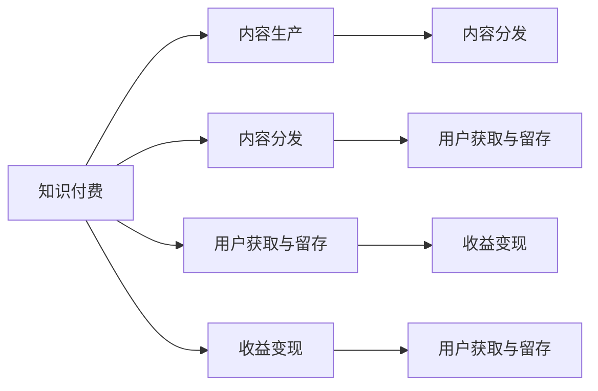

                 

# 知识付费创业中的内容价值提升

## 1. 背景介绍

在知识付费大潮中，内容价值的提升是创业成功的关键。随着互联网和移动设备的普及，用户对知识内容的需求日益增加，优质、精准、高效的内容已成为吸引用户和增加收益的核心要素。本文将从核心概念与联系、核心算法原理与具体操作步骤、数学模型与公式、项目实践、实际应用场景、工具和资源推荐、总结与发展趋势等角度，全面解析知识付费创业中内容价值的提升。

## 2. 核心概念与联系

### 2.1 核心概念概述

在知识付费创业中，内容价值的提升涉及以下核心概念：

- **知识付费**：通过互联网平台提供专业知识和信息服务，用户需支付一定费用以获取深度、高质量内容的商业模式。
- **内容生产**：指通过写文、录制视频、制作音频等形式创造有价值、有吸引力的知识产品。
- **内容分发**：将生产的内容通过平台、社交媒体等渠道传递给目标用户。
- **用户获取与留存**：吸引并维持用户持续消费知识产品，建立稳定的用户基础。
- **收益变现**：通过广告、会员订阅、内容付费等方式实现商业化，转化为实际收入。

这些概念相互关联，共同构成了知识付费创业的生态系统。内容价值的提升，是这些概念交互作用的结果，需要通过优化每一个环节，才能实现良好的商业循环。

### 2.2 核心概念原理和架构的 Mermaid 流程图



## 3. 核心算法原理 & 具体操作步骤

### 3.1 算法原理概述

内容价值的提升，可以通过以下几个核心算法原理实现：

- **推荐系统**：通过分析用户行为数据，推荐个性化的内容，提升用户满意度和留存率。
- **用户画像构建**：利用用户画像模型，理解用户需求和偏好，提供更加精准的内容。
- **搜索优化**：提升内容的搜索排序算法，使得用户能够快速找到所需信息。
- **广告投放**：通过精准的定向广告投放，提高流量和用户转化率。
- **内容版权保护**：采用技术手段保护内容版权，防止侵权和盗版。

### 3.2 算法步骤详解

1. **数据收集与处理**：收集用户行为数据、搜索记录、内容互动数据等，进行清洗和预处理，生成用户画像和内容画像。

2. **推荐模型训练**：利用协同过滤、内容过滤、深度学习等算法训练推荐模型，提升推荐的个性化和准确性。

3. **广告投放策略制定**：通过用户画像和行为数据，制定精准的广告投放策略，提高广告的点击率和转化率。

4. **搜索优化算法优化**：通过优化搜索结果排序算法，提升搜索效率和用户体验。

5. **内容版权保护措施实施**：采用加密、水印、防复制等技术手段，保护内容版权，防止盗版和侵权。

### 3.3 算法优缺点

#### 优点：

- **提升用户满意度和留存率**：通过个性化推荐和精准广告，满足用户需求，提高用户满意度和留存率。
- **精准营销**：通过用户画像和行为数据，实现精准营销，提高广告效率和收益。
- **内容价值最大化**：通过优化搜索和广告算法，提升内容的曝光度和互动性，实现内容价值的最大化。

#### 缺点：

- **数据隐私和安全问题**：用户画像和行为数据的收集和使用可能涉及用户隐私，需要严格遵守法律法规。
- **广告效果不确定性**：广告投放的精准度可能受限于用户数据的质量和覆盖范围。
- **技术门槛高**：推荐和搜索算法的优化需要较强的技术和数据处理能力。

### 3.4 算法应用领域

- **内容平台**：如得到、喜马拉雅、知乎等，通过推荐系统和广告投放提升内容价值。
- **企业内训**：通过定制化内容推荐和企业内部知识库的搭建，提升员工的学习效率和技能水平。
- **在线教育**：如Coursera、Udacity等，通过个性化推荐和搜索优化，提升课程的参与度和完成率。

## 4. 数学模型和公式 & 详细讲解

### 4.1 数学模型构建

本节将从推荐系统、用户画像和搜索优化三个方面，介绍内容价值提升的数学模型构建。

- **推荐系统**：协同过滤、内容过滤、深度学习推荐模型等。
- **用户画像**：聚类算法、特征提取和降维等。
- **搜索优化**：倒排索引、TF-IDF、BM25等。

### 4.2 公式推导过程

#### 推荐系统

- **协同过滤**：用户-物品共现矩阵 $U \times I$，计算用户 $u$ 对物品 $i$ 的兴趣 $R(u,i)$，公式为：
$$ R(u,i) = \frac{1}{1 + \text{dist}(U_u, U_i)} $$

- **内容过滤**：物品-内容特征矩阵 $I \times F$，计算物品 $i$ 对用户 $u$ 的相关度 $C(i,u)$，公式为：
$$ C(i,u) = \text{dot}(I_i, F_u) / (\sqrt{\sum F_{u,j}^2} \sqrt{\sum I_{i,k}^2}) $$

- **深度学习推荐模型**：使用如BERT、LSTM等模型，训练推荐网络 $H_{\theta}$，公式为：
$$ \hat{R}(u,i) = H_{\theta}(U_u, I_i) $$

#### 用户画像

- **聚类算法**：K-means算法，将用户分为 $k$ 个簇，公式为：
$$ \text{argmin}_{\theta} \sum (\text{dist}(u_i, \mu_k)^2 + \lambda ||\theta - \text{argmin}_{\theta} \text{dist}(u_i, \mu_k)||^2) $$

- **特征提取和降维**：PCA算法，通过降维算法将高维数据 $X$ 映射到低维空间 $Z$，公式为：
$$ Z = \text{argmin}_{U,V} ||UX - V||_F^2 $$

#### 搜索优化

- **倒排索引**：将文本 $T$ 转换为倒排索引 $I$，公式为：
$$ I = \{ (t_1, \{d_1, ..., d_n\}), ..., (t_m, \{d_m, ..., d_{m+n}\}) \} $$

- **TF-IDF**：计算文本 $t$ 的重要性 $IDF(t)$，公式为：
$$ IDF(t) = \log \frac{N}{df(t)} $$

- **BM25算法**：计算文本 $t$ 的相关性 $BM25(t,q)$，公式为：
$$ BM25(t,q) = \frac{TF(t) \cdot IDF(t) \cdot (N-K+1)}{K_1 + K_2 \cdot \frac{IDF(t) \cdot (N-K+1)}{df(t)}} $$

### 4.3 案例分析与讲解

以在线教育平台Coursera为例，分析推荐系统、用户画像和搜索优化如何提升平台的内容价值：

- **推荐系统**：Coursera通过协同过滤和深度学习推荐模型，为用户推荐感兴趣的课程。推荐算法会根据用户历史行为和课程特征进行综合分析，提升课程的曝光率和点击率。
- **用户画像**：Coursera利用用户行为数据和课程互动数据，构建用户画像模型，将用户分为不同兴趣群组，提供个性化推荐。通过用户画像，Coursera能够更精准地推送课程，提高用户满意度和留存率。
- **搜索优化**：Coursera使用倒排索引和BM25算法，优化课程搜索排序，使用户能够快速找到所需的课程。通过搜索优化，Coursera提升了课程的参与度和完成率，实现了内容价值的最大化。

## 5. 项目实践：代码实例和详细解释说明

### 5.1 开发环境搭建

开发环境搭建主要涉及以下步骤：

1. **选择编程语言和框架**：Python和TensorFlow/PyTorch是最常用的语言和框架。
2. **安装依赖库**：安装推荐系统、用户画像、搜索优化等相关的库和工具。
3. **数据准备**：收集用户行为数据、搜索记录、内容互动数据等，进行预处理和清洗。

### 5.2 源代码详细实现

以下是一个简单的推荐系统代码实现，包括协同过滤和深度学习模型的实现：

```python
from scipy.sparse import coo_matrix
import tensorflow as tf
import numpy as np

# 协同过滤
def collaborative_filtering(X):
    N, M = X.shape
    R = coo_matrix(np.dot(X.T, X).power(-1))
    R.data = np.log(1 + R.data)
    return R.tocsr()

# 深度学习推荐模型
class RecommendationModel(tf.keras.Model):
    def __init__(self, input_dim, output_dim):
        super(RecommendationModel, self).__init__()
        self.emb1 = tf.keras.layers.Embedding(input_dim, 128)
        self.emb2 = tf.keras.layers.Embedding(output_dim, 128)
        self.fc1 = tf.keras.layers.Dense(64, activation='relu')
        self.fc2 = tf.keras.layers.Dense(1, activation='sigmoid')
    
    def call(self, user_input, item_input):
        user_embs = self.emb1(user_input)
        item_embs = self.emb2(item_input)
        x = tf.concat([user_embs, item_embs], axis=1)
        x = self.fc1(x)
        x = self.fc2(x)
        return x

# 训练推荐模型
model = RecommendationModel(input_dim, output_dim)
optimizer = tf.keras.optimizers.Adam(learning_rate=0.001)
loss_fn = tf.keras.losses.BinaryCrossentropy()

# 训练过程
@tf.function
def train_step(user_input, item_input, label):
    with tf.GradientTape() as tape:
        logits = model(user_input, item_input)
        loss = loss_fn(logits, label)
    grads = tape.gradient(loss, model.trainable_variables)
    optimizer.apply_gradients(zip(grads, model.trainable_variables))

# 调用训练过程
train_step(user_input, item_input, label)
```

### 5.3 代码解读与分析

代码实现中，首先定义了协同过滤函数和深度学习推荐模型类。协同过滤函数通过计算用户-物品共现矩阵的倒排索引，得到推荐权重矩阵。深度学习推荐模型使用嵌入层、全连接层和sigmoid激活函数，实现用户-物品的相关度预测。

在训练过程中，使用Adam优化器和二分类交叉熵损失函数，通过反向传播更新模型参数。通过调用`train_step`函数，可以完成推荐模型的训练。

### 5.4 运行结果展示

通过训练，推荐模型可以预测用户对物品的兴趣，实现个性化推荐。训练过程中，需要记录损失值和准确率等指标，以评估模型性能。

## 6. 实际应用场景

### 6.1 内容平台

在内容平台中，推荐系统和广告投放是提升内容价值的关键。以得到为例，通过推荐系统个性化推荐文章和课程，提升用户留存率和参与度。通过广告投放，实现精准营销，提高平台收益。

### 6.2 企业内训

企业内训通过内容推荐和用户画像，提升员工的学习效率和技能水平。利用推荐系统个性化推送培训课程和资料，结合用户画像提供定制化学习计划，帮助员工快速掌握新技能。

### 6.3 在线教育

在线教育平台如Coursera、Udacity等，通过推荐系统和搜索优化，提升课程参与度和完成率。通过用户画像和行为分析，实现精准广告投放，提高平台流量和用户转化率。

## 7. 工具和资源推荐

### 7.1 学习资源推荐

- **在线课程**：Coursera、edX、Udacity等平台提供大量推荐系统、用户画像和搜索优化的课程。
- **书籍**：《推荐系统实践》、《深度学习》、《Python数据科学手册》等书籍深入讲解相关理论和技术。
- **博客和论文**：Kaggle、arXiv等平台发布的论文和博客，提供最新研究进展和实践经验。

### 7.2 开发工具推荐

- **编程语言**：Python和R是最常用的编程语言，具有丰富的库和框架支持。
- **深度学习框架**：TensorFlow和PyTorch是深度学习领域的主流框架，提供强大的计算图和自动微分功能。
- **数据分析工具**：Pandas和NumPy是常用的数据分析和处理工具，支持高效的数据处理和分析。
- **可视化工具**：Matplotlib和Seaborn支持数据可视化，帮助开发者更好地理解数据和模型。

### 7.3 相关论文推荐

- **推荐系统**：《推荐系统基础》、《隐式反馈下的协同过滤推荐算法》等论文，介绍了推荐系统的主要算法和应用。
- **用户画像**：《用户画像构建方法综述》、《基于社交网络的用户画像模型》等论文，提供了用户画像构建的最新进展。
- **搜索优化**：《信息检索：原理与技术》、《BM25算法综述》等书籍和论文，深入讲解了搜索优化的理论和实现。

## 8. 总结：未来发展趋势与挑战

### 8.1 总结

本文从推荐系统、用户画像、搜索优化等多个角度，全面分析了知识付费创业中内容价值提升的核心方法和步骤。通过数学模型和代码实例，展示了推荐系统、用户画像和搜索优化的具体实现。同时，通过实际应用场景，展示了这些技术在内容平台、企业内训和在线教育等场景中的应用效果。

## 8.2 未来发展趋势

### 8.3 面临的挑战

- **数据隐私和安全**：用户数据的收集和使用可能涉及隐私和安全问题，需要严格遵守法律法规。
- **技术门槛高**：推荐和搜索算法的优化需要较强的技术和数据处理能力。
- **广告效果不确定性**：广告投放的精准度可能受限于用户数据的质量和覆盖范围。

### 8.4 研究展望

未来，知识付费创业中内容价值提升的研究将更加深入，主要方向包括：

- **跨领域推荐**：将推荐系统应用于不同领域，提升内容的多样性和个性化。
- **深度学习模型优化**：优化深度学习模型的架构和训练策略，提升推荐模型的效果。
- **实时推荐系统**：开发实时推荐系统，提升推荐的时效性和用户体验。
- **内容生成模型**：结合生成对抗网络（GAN）等技术，开发内容生成模型，提升内容的丰富性和吸引力。

通过这些研究方向和技术突破，相信知识付费创业中的内容价值提升将进一步提升，为用户带来更好的体验，为平台带来更高的收益。

## 9. 附录：常见问题与解答

**Q1：推荐系统如何选择特征和算法？**

A: 推荐系统的特征选择和算法选择，需要根据具体业务场景和数据特点进行评估和选择。常用的特征包括用户行为、物品属性、时间戳等，常用的算法包括协同过滤、内容过滤、深度学习推荐模型等。

**Q2：用户画像构建需要哪些步骤？**

A: 用户画像构建主要分为数据收集、数据清洗、特征提取和聚类等步骤。数据收集包括用户行为数据、搜索记录、评分数据等，数据清洗包括去除噪声和缺失值，特征提取包括文本特征、时间特征等，聚类算法包括K-means、LDA等。

**Q3：搜索优化有哪些技术手段？**

A: 搜索优化主要分为倒排索引、TF-IDF、BM25等技术手段。倒排索引将文本转换为索引，TF-IDF计算文本的重要性，BM25算法计算文本的相关性。

**Q4：如何保护内容版权？**

A: 内容版权保护主要通过加密、水印、防复制等技术手段实现。加密技术包括AES、RSA等，水印技术包括可见水印和隐写水印等，防复制技术包括数字指纹、DRM等。

**Q5：推荐系统的性能评估指标有哪些？**

A: 推荐系统的性能评估指标包括准确率、召回率、F1-score、覆盖率、多样性等。准确率和召回率用于评估推荐结果的准确性，F1-score用于综合评估准确率和召回率，覆盖率用于评估推荐结果的多样性，多样性用于评估推荐结果的多样性。

本文从核心概念、算法原理、数学模型、项目实践、应用场景等多个角度，全面解析了知识付费创业中内容价值提升的各个环节。通过系统的分析和实践，希望能为知识付费创业者提供有价值的参考和指导。

---

作者：禅与计算机程序设计艺术 / Zen and the Art of Computer Programming

