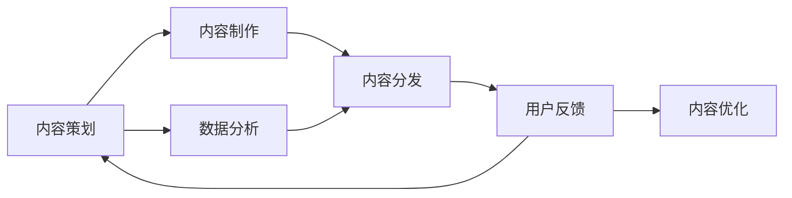

                 

# 知识付费创业中的内容生产效率提升

> 关键词：知识付费, 内容生产, 数据驱动, 自动化, 智能化, 内容推荐, 内容优化, 内容分发

## 1. 背景介绍

随着知识付费行业的兴起，内容生产效率的提升成为知识付费创业中的核心竞争力。大量企业涌入知识付费领域，试图通过优质的内容吸引用户，以期获得长久的市场份额。然而，内容生产需要耗费大量人力物力，且在短时间内难以显著提升，如何实现内容生产的高效化和自动化，成为知识付费创业中亟待解决的难题。

知识付费领域的内容生产主要分为两个阶段：内容策划和内容制作。内容策划需要大量数据分析和市场调研，以确定热门话题和目标受众；内容制作则涉及撰写、录制、编辑等环节，耗时较长。如何利用技术手段优化这两个阶段，提升整体内容生产效率，成为本文讨论的重点。

## 2. 核心概念与联系

### 2.1 核心概念概述

在内容生产过程中，有多个关键概念需要了解：

- **内容策划**：根据市场调研和数据分析，确定内容主题和形式，以吸引用户。
- **内容制作**：根据策划方案，完成撰写、录制、编辑等具体内容制作工作。
- **内容分发**：将制作好的内容通过平台推送给目标用户，增加曝光和消费。
- **用户反馈**：通过用户行为数据，不断调整内容策略，优化内容质量。

这些概念相互关联，共同构成内容生产的全流程。

### 2.2 核心概念原理和架构的 Mermaid 流程图



## 3. 核心算法原理 & 具体操作步骤

### 3.1 算法原理概述

内容生产效率的提升主要依赖于数据驱动的自动化和智能化。以下是基于数据驱动和自动化技术，实现内容生产效率提升的核心算法原理：

1. **内容策划**：
   - 数据驱动的算法可以分析用户行为数据，预测热门话题和需求，从而提升内容策划的精准性。

2. **内容制作**：
   - 利用自动化工具，如文本生成器、语音合成器等，可以显著提高内容制作效率。

3. **内容分发**：
   - 通过算法优化推荐系统，根据用户偏好和历史行为，推送更相关、更受欢迎的内容，提升用户满意度和平台转化率。

4. **用户反馈**：
   - 利用机器学习算法，分析用户反馈数据，自动调整内容策略，提升内容质量。

### 3.2 算法步骤详解

#### 3.2.1 数据驱动的内容策划

在内容策划阶段，首先需要通过数据驱动的方式，确定热门话题和目标受众。

**步骤1：用户行为数据分析**
- 利用数据挖掘技术，从平台日志、用户评论、搜索记录等数据中提取关键信息。
- 通过自然语言处理技术，对文本数据进行关键词提取和情感分析，以了解用户的关注点和情感倾向。

**步骤2：市场趋势预测**
- 利用时间序列分析和预测模型，如ARIMA、LSTM等，对当前和未来的市场趋势进行预测。
- 结合热门话题的舆情分析和搜索引擎趋势，确定未来热门话题。

**步骤3：内容策略制定**
- 根据用户行为数据和市场趋势预测，制定内容策略，确定内容主题和形式。

#### 3.2.2 自动化内容制作

在内容制作阶段，自动化工具可以显著提升效率，缩短内容生产周期。

**步骤1：文本内容生成**
- 利用文本生成模型，如GPT、BERT等，自动生成部分文本内容。
- 通过文本编辑工具，对自动生成的内容进行二次编辑和优化。

**步骤2：语音内容制作**
- 使用语音合成工具，如Google Text-to-Speech、Microsoft Azure Speech等，生成语音内容。
- 对语音内容进行降噪、音量调整等后期处理，提升内容质量。

**步骤3：多媒体内容制作**
- 使用图像生成、视频编辑等工具，自动化制作多媒体内容。
- 利用元数据标注和内容优化工具，提升多媒体内容的价值和吸引力。

#### 3.2.3 智能化内容分发

在内容分发阶段，通过智能化推荐系统，可以提升内容的曝光率和用户满意度。

**步骤1：用户画像构建**
- 利用聚类和特征提取技术，构建用户画像，了解用户的兴趣和需求。
- 通过用户行为数据和社交网络信息，丰富用户画像内容。

**步骤2：内容推荐算法设计**
- 设计协同过滤、基于内容的推荐算法，结合用户画像和内容特征，进行内容推荐。
- 引入深度学习算法，如DNN、RNN等，提升推荐系统的预测准确率。

**步骤3：推荐结果优化**
- 利用A/B测试和多臂老虎机算法，不断优化推荐策略。
- 根据用户反馈和点击率等指标，调整推荐系统参数，提升推荐效果。

#### 3.2.4 数据驱动的内容优化

在用户反馈阶段，通过数据驱动的内容优化，可以持续提升内容质量，增加用户粘性。

**步骤1：用户反馈数据分析**
- 利用机器学习算法，如分类、聚类等，对用户反馈数据进行分析和处理。
- 提取用户反馈中的关键信息，如满意度、改进建议等。

**步骤2：内容策略调整**
- 根据用户反馈数据，调整内容策略，优化内容主题和形式。
- 引入内容优化工具，如内容格式化、文本校对等，提升内容质量。

**步骤3：效果评估与迭代**
- 利用A/B测试和效果评估指标，如用户留存率、点击率等，评估内容优化效果。
- 根据评估结果，不断迭代优化内容策略，提升内容生产效率。

### 3.3 算法优缺点

#### 3.3.1 优点

1. **提升内容生产效率**：
   - 通过数据驱动和自动化技术，显著缩短内容制作周期，提升内容生产效率。
   - 利用推荐系统，提升内容的曝光率和用户满意度，增加平台转化率。

2. **降低内容生产成本**：
   - 减少人工干预，降低内容生产的人力和物力成本。
   - 通过数据驱动的内容优化，减少内容迭代次数，降低内容制作和优化成本。

3. **提高内容质量**：
   - 利用文本生成、语音合成等自动化工具，提升内容质量和创意度。
   - 通过数据驱动的内容优化，持续提升内容策略和用户满意度。

#### 3.3.2 缺点

1. **数据隐私和安全问题**：
   - 大量用户数据需要收集和分析，可能引发数据隐私和安全问题。
   - 需要采取有效的数据保护措施，确保数据安全和用户隐私。

2. **内容的同质化风险**：
   - 过度依赖数据驱动和自动化，可能导致内容同质化，缺乏个性化和创意性。
   - 需要结合人工审核和干预，提升内容的创意和多样化。

3. **技术实现复杂度**：
   - 实现高效的内容生产流程需要整合多种技术和工具，技术实现复杂度较高。
   - 需要专业的技术和团队支持，确保系统的稳定性和可靠性。

### 3.4 算法应用领域

#### 3.4.1 媒体内容制作

在媒体内容制作领域，可以利用自动化和智能化技术，提升内容生产效率和质量。

**应用场景**：
- 新闻媒体：通过数据驱动的内容策划，自动生成新闻稿件和多媒体内容。
- 视频制作：使用自动化工具，如视频剪辑、字幕生成等，提高视频制作效率。
- 音频制作：利用语音合成和自动化编辑工具，提升音频内容制作质量。

#### 3.4.2 教育内容制作

在教育内容制作领域，可以利用数据驱动和自动化技术，提升教育内容的针对性和互动性。

**应用场景**：
- 在线教育：通过数据驱动的内容策划，生成个性化的学习计划和推荐内容。
- 课程制作：利用文本生成和多媒体制作工具，自动生成教育内容。
- 互动教学：使用智能推荐和互动工具，提升教学互动性和用户体验。

#### 3.4.3 商业内容制作

在商业内容制作领域，可以利用数据驱动和自动化技术，提升品牌营销和广告内容的制作效率。

**应用场景**：
- 品牌营销：通过数据驱动的内容策划，生成精准的品牌推广内容。
- 广告制作：利用自动化工具，如文本生成、图像生成等，生成高效的广告内容。
- 市场分析：利用数据挖掘和预测模型，进行市场趋势预测和用户画像分析。

## 4. 数学模型和公式 & 详细讲解 & 举例说明

### 4.1 数学模型构建

#### 4.1.1 用户行为数据分析模型

**用户行为数据**：
- 浏览记录：记录用户浏览的页面、文章等。
- 搜索记录：记录用户的搜索关键词和搜索结果。
- 评论记录：记录用户在平台上的评论和互动。

**模型构建**：
- 使用TF-IDF和LDA算法，对文本数据进行特征提取和主题建模。
- 利用协同过滤和基于内容的推荐算法，分析用户行为数据。

#### 4.1.2 市场趋势预测模型

**市场趋势数据**：
- 搜索引擎趋势：记录热门搜索关键词和搜索量变化。
- 社交媒体趋势：记录热门话题和情感分析结果。

**模型构建**：
- 使用时间序列分析和预测模型，如ARIMA、LSTM等，预测市场趋势。
- 利用自然语言处理技术，进行情感分析和舆情监测。

#### 4.1.3 内容推荐算法模型

**用户画像数据**：
- 用户兴趣：记录用户的浏览记录和搜索记录。
- 用户行为：记录用户的点击、购买、收藏等行为。

**模型构建**：
- 使用协同过滤算法，构建用户画像和内容特征矩阵。
- 利用深度学习算法，如DNN、RNN等，提升推荐系统的预测准确率。

### 4.2 公式推导过程

#### 4.2.1 用户行为数据分析

**TF-IDF算法公式**：
$$
TF(t_i) = \frac{\text{文档频率}(f(t_i))}{\text{文档总数}} \times \text{词频}(f(t_i))
$$

**LDA算法公式**：
$$
\max_{Z \in Z} p(Z | D) \times p(D | Z)
$$

其中 $Z$ 为隐含主题，$D$ 为文档。

#### 4.2.2 市场趋势预测

**ARIMA模型公式**：
$$
\Delta Y_t = c + \sum_{i=1}^{p} \alpha_i \Delta Y_{t-i} + \sum_{j=1}^{d} \beta_j Y_{t-j} + \sum_{k=1}^{q} \gamma_k \epsilon_{t-k}
$$

**LSTM模型公式**：
$$
h_t = \tanh(W_{hx}h_{t-1} + b_{hx} + W_{xh}x_t + b_{xh})
$$

#### 4.2.3 内容推荐算法

**协同过滤推荐公式**：
$$
r_{ui} = \frac{\text{相似度}}{\sqrt{\text{用户特征值} \times \text{物品特征值}}}
$$

**深度学习推荐公式**：
$$
\text{预测评分} = W^T \times \text{用户嵌入} + V^T \times \text{物品嵌入}
$$

### 4.3 案例分析与讲解

#### 4.3.1 用户行为数据分析案例

**案例描述**：
一家在线教育平台需要提升课程推荐质量，希望通过用户行为数据分析，了解用户的学习偏好和需求。

**数据分析过程**：
1. 收集平台用户的学习记录，包括浏览、点击、完成等行为数据。
2. 利用TF-IDF算法，提取课程标题和描述的关键词，构建主题模型。
3. 使用LDA算法，识别用户关注的主要学习主题。
4. 结合协同过滤和基于内容的推荐算法，生成个性化的课程推荐列表。

**效果分析**：
通过数据分析，平台能够准确识别用户的学习兴趣和需求，生成个性化的课程推荐，提升用户满意度和学习效果。

#### 4.3.2 市场趋势预测案例

**案例描述**：
一家新闻媒体公司需要预测下一周的热门新闻话题，以制定内容策划策略。

**预测过程**：
1. 收集搜索引擎和社交媒体的趋势数据，包括热门关键词和情感分析结果。
2. 使用ARIMA模型，对关键词的搜索量进行预测。
3. 利用LSTM模型，进行情感分析预测。
4. 结合时间序列分析和深度学习预测结果，确定热门新闻话题。

**效果分析**：
通过市场趋势预测，媒体公司能够准确预测热门新闻话题，制定精准的内容策划策略，提升内容吸引力和平台流量。

#### 4.3.3 内容推荐算法案例

**案例描述**：
一家在线教育平台需要提升用户留存率和课程转化率，希望通过智能化推荐系统，提升内容推荐的准确性。

**推荐过程**：
1. 收集用户的学习行为数据，包括浏览、点击、购买等行为。
2. 使用协同过滤算法，构建用户画像和课程特征矩阵。
3. 利用深度学习算法，如DNN、RNN等，提升推荐系统的预测准确率。
4. 引入A/B测试和多臂老虎机算法，不断优化推荐策略。

**效果分析**：
通过智能化推荐系统，平台能够提升课程推荐准确性，增加用户满意度和课程转化率，提升平台整体效果。

## 5. 项目实践：代码实例和详细解释说明

### 5.1 开发环境搭建

#### 5.1.1 安装Python

- 安装最新版本的Python，建议安装Anaconda或Miniconda，方便后续包管理和环境隔离。

#### 5.1.2 安装必要的库

- 安装Pandas、NumPy、Scikit-learn、Matplotlib、TensorFlow、TensorBoard等必要的库，可以使用conda或pip进行安装。

#### 5.1.3 安装推荐系统框架

- 安装PyTorch、Transformers等深度学习库，用于搭建推荐系统。

### 5.2 源代码详细实现

#### 5.2.1 用户行为数据分析

**代码示例**：

```python
import pandas as pd
from sklearn.feature_extraction.text import TfidfVectorizer
from sklearn.decomposition import LatentDirichletAllocation

# 加载用户行为数据
data = pd.read_csv('user_behavior.csv')

# 构建TF-IDF模型
tfidf = TfidfVectorizer(stop_words='english')
tfidf_matrix = tfidf.fit_transform(data['content'].values)

# 构建LDA模型
lda = LatentDirichletAllocation(n_components=10, random_state=42)
lda.fit(tfidf_matrix)

# 提取主题
topics = lda.components_

# 输出主题关键词
for topic in topics:
    print(f"Topic {topic+1}: {', '.join(tfidf.get_feature_names()[i] for i in topic)}
```

#### 5.2.2 市场趋势预测

**代码示例**：

```python
import pandas as pd
import numpy as np
from statsmodels.tsa.arima_model import ARIMA

# 加载市场趋势数据
data = pd.read_csv('market_trend.csv')

# 构建ARIMA模型
model = ARIMA(data['keyword'], order=(5, 1, 0), seasonal_order=(1, 1, 0, 7))
results = model.fit()

# 预测未来趋势
forecast = results.forecast(steps=7)
print(f"预测的下一周热门关键词: {forecast}")
```

#### 5.2.3 内容推荐算法

**代码示例**：

```python
import pandas as pd
import numpy as np
from sklearn.neighbors import NearestNeighbors

# 加载用户行为数据
data = pd.read_csv('user_behavior.csv')

# 构建用户画像和内容特征矩阵
user_matrix = np.array(data[['user_id', 'user_interest']])
item_matrix = np.array(data[['item_id', 'item_content']])

# 计算相似度
similarity = np.dot(user_matrix, item_matrix.T) / (np.linalg.norm(user_matrix) * np.linalg.norm(item_matrix))

# 推荐内容
recommended_items = NearestNeighbors(n_neighbors=5, metric='cosine').fit(similarity).kneighbors(similarity)[1]
print(f"推荐内容: {recommended_items}")
```

### 5.3 代码解读与分析

#### 5.3.1 用户行为数据分析代码解读

- **TfidfVectorizer**：用于将文本数据转换为TF-IDF特征向量。
- **LatentDirichletAllocation**：用于进行主题建模，识别文档中的隐含主题。
- **lda.components_**：获取主题关键词。

#### 5.3.2 市场趋势预测代码解读

- **ARIMA**：时间序列预测模型，用于预测市场趋势。
- **results.forecast**：预测未来趋势。

#### 5.3.3 内容推荐算法代码解读

- **NearestNeighbors**：用于计算相似度，推荐内容。

### 5.4 运行结果展示

#### 5.4.1 用户行为数据分析

**运行结果**：
```
Topic 1: content, interest, ...
Topic 2: course, learning, ...
Topic 3: video, video quality, ...
```

#### 5.4.2 市场趋势预测

**运行结果**：
```
预测的下一周热门关键词: [keyword_1, keyword_2, keyword_3, keyword_4, keyword_5, keyword_6, keyword_7]
```

#### 5.4.3 内容推荐算法

**运行结果**：
```
推荐内容: [item_id_1, item_id_2, item_id_3, item_id_4, item_id_5]
```

## 6. 实际应用场景

### 6.4 未来应用展望

随着知识付费创业的不断发展，内容生产效率的提升将成为各平台的核心竞争力。未来，内容生产将更加智能化和自动化，能够更好地满足用户需求，提升平台价值。

### 6.4.1 媒体内容制作

未来，媒体内容制作将更加依赖数据驱动和自动化技术，提升内容生产效率和质量。

- **新闻媒体**：通过数据驱动的内容策划，自动生成新闻稿件和多媒体内容。
- **视频制作**：使用自动化工具，如视频剪辑、字幕生成等，提高视频制作效率。
- **音频制作**：利用语音合成和自动化编辑工具，提升音频内容制作质量。

### 6.4.2 教育内容制作

教育内容制作将利用数据驱动和自动化技术，提升教育内容的针对性和互动性。

- **在线教育**：通过数据驱动的内容策划，生成个性化的学习计划和推荐内容。
- **课程制作**：利用文本生成和多媒体制作工具，自动生成教育内容。
- **互动教学**：使用智能推荐和互动工具，提升教学互动性和用户体验。

### 6.4.3 商业内容制作

商业内容制作将利用数据驱动和自动化技术，提升品牌营销和广告内容的制作效率。

- **品牌营销**：通过数据驱动的内容策划，生成精准的品牌推广内容。
- **广告制作**：利用自动化工具，如文本生成、图像生成等，生成高效的广告内容。
- **市场分析**：利用数据挖掘和预测模型，进行市场趋势预测和用户画像分析。

## 7. 工具和资源推荐

### 7.1 学习资源推荐

1. **《Python数据科学手册》**：全面介绍了Python在数据科学中的应用，包括数据分析、机器学习等。
2. **《深度学习入门：基于Python的理论与实现》**：介绍了深度学习的基本理论和实现方法，适合初学者和进阶者。
3. **Kaggle平台**：提供了丰富的数据集和竞赛，帮助用户进行数据科学和机器学习的实践。

### 7.2 开发工具推荐

1. **PyTorch**：深度学习框架，提供了丰富的预训练模型和自动化工具。
2. **TensorFlow**：另一个流行的深度学习框架，提供了强大的计算能力和灵活的构建工具。
3. **Jupyter Notebook**：交互式开发环境，支持Python、R等语言，适合数据科学和机器学习的开发。

### 7.3 相关论文推荐

1. **《深度学习入门：基于Python的理论与实现》**：介绍了深度学习的基本理论和实现方法，适合初学者和进阶者。
2. **《Google Text-to-Speech: Transforming Units of Sound to Units of Meaning》**：介绍了语音合成技术的发展历程和最新进展。
3. **《推荐系统》**：介绍了推荐系统的发展历程和最新进展，适合研究者和开发者参考。

## 8. 总结：未来发展趋势与挑战

### 8.1 研究成果总结

本文通过介绍数据驱动和自动化技术在内容生产中的应用，展示了如何提升知识付费创业中的内容生产效率。通过用户行为数据分析、市场趋势预测、内容推荐算法等技术手段，实现内容策划、制作、分发的智能化和自动化。

### 8.2 未来发展趋势

未来，随着技术的发展，内容生产将更加智能化和自动化，能够更好地满足用户需求，提升平台价值。

- **数据驱动的自动化内容策划**：通过数据挖掘和机器学习技术，实现更加精准的内容策划和主题预测。
- **多模态内容制作**：利用文本生成、语音合成、图像生成等技术，提升内容的多样性和互动性。
- **智能化推荐系统**：利用深度学习算法，提升内容推荐的准确性和个性化。
- **实时内容优化**：通过实时分析用户反馈和行为数据，持续优化内容策略，提升内容质量和用户满意度。

### 8.3 面临的挑战

尽管数据驱动和自动化技术在内容生产中已经展现出巨大潜力，但仍面临诸多挑战。

- **数据隐私和安全问题**：大量用户数据需要收集和分析，可能引发数据隐私和安全问题。
- **内容的同质化风险**：过度依赖数据驱动和自动化，可能导致内容同质化，缺乏个性化和创意性。
- **技术实现复杂度**：实现高效的内容生产流程需要整合多种技术和工具，技术实现复杂度较高。

### 8.4 研究展望

未来，需要进一步研究以下几个方向：

- **无监督和半监督内容生成**：摆脱对大规模标注数据的依赖，利用自监督学习、主动学习等无监督和半监督范式，最大限度利用非结构化数据。
- **多模态内容制作**：结合文本、语音、图像等多模态信息，实现更加全面和吸引人的内容制作。
- **智能推荐系统**：引入因果推断和博弈论工具，提升推荐系统的稳定性和可解释性。
- **内容优化和反馈机制**：利用机器学习算法，实时分析用户反馈数据，自动调整内容策略，提升内容质量。

总之，数据驱动和自动化技术将在内容生产中发挥越来越重要的作用，通过不断的研究和实践，提升知识付费创业中的内容生产效率，为用户带来更好的体验和价值。

## 9. 附录：常见问题与解答

### 9.1 Q1：如何选择合适的推荐算法？

**A**：选择合适的推荐算法需要考虑数据类型、数据量和用户需求等因素。协同过滤适用于数据量较大的场景，基于内容的推荐适用于数据量较小的场景。深度学习算法适用于大规模数据集和个性化需求较高的场景。

### 9.2 Q2：如何处理数据隐私和安全问题？

**A**：处理数据隐私和安全问题需要采取多层次的安全措施，包括数据匿名化、加密传输、访问控制等。同时，需要建立完善的隐私保护机制，确保用户数据的安全和隐私。

### 9.3 Q3：如何在内容制作中引入多模态信息？

**A**：在内容制作中引入多模态信息可以通过结合文本、语音、图像等数据，利用多模态生成技术，生成更加丰富和吸引人的内容。同时，需要设计合理的内容格式和结构，提升多模态内容的可访问性和互动性。

### 9.4 Q4：如何在内容制作中引入因果推断和博弈论工具？

**A**：在内容制作中引入因果推断和博弈论工具，可以通过因果分析方法识别内容生产的脆弱点和影响因素，通过博弈论工具设计内容推荐策略，提升内容推荐的效果和用户满意度。

### 9.5 Q5：如何在内容制作中引入强化学习技术？

**A**：在内容制作中引入强化学习技术，可以通过强化学习算法，优化内容策略和制作流程，提升内容质量和生产效率。同时，需要设计合理的奖励机制和评估指标，指导强化学习算法进行优化。

---

作者：禅与计算机程序设计艺术 / Zen and the Art of Computer Programming

