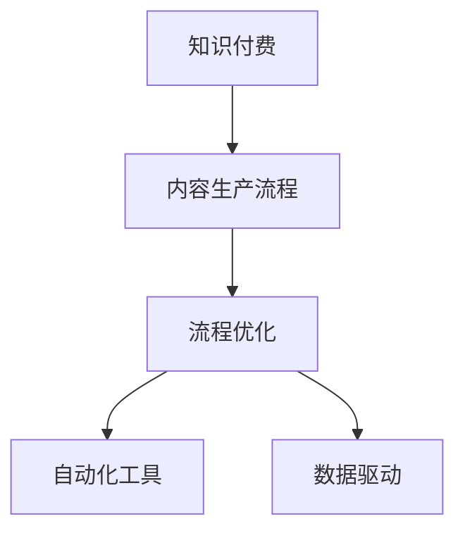

                 

# 知识付费创业中的内容生产流程优化

> 关键词：知识付费、内容生产流程、优化、自动化、效率提升、数据驱动、技术应用

## 1. 背景介绍

在互联网时代，知识付费成为教育和学习领域的热门话题。随着网络技术的发展，各种在线学习平台不断涌现，用户对于高质量、结构化、个性化的知识产品需求日益增长。在此背景下，知识付费创业成为众多创业者探索的热门领域。然而，知识付费业务的成功，不仅需要高质量的内容，还需要高效的内容生产流程，以实现内容的高效创作、传播与变现。本文旨在深入探讨知识付费创业中的内容生产流程优化问题，为创业者提供系统性的参考和解决方案。

## 2. 核心概念与联系

### 2.1 核心概念概述

为深入理解内容生产流程优化，本节将介绍几个关键概念：

- **知识付费**：一种新兴的教育模式，通过在线课程、专栏、电子书等形式，为用户提供付费知识服务。知识付费打破了传统的教育模式，以灵活、便捷、高效的方式满足用户需求。

- **内容生产流程**：知识付费业务中的核心环节，涉及内容策划、制作、分发、反馈等多个步骤，是保证内容质量与效率的关键。

- **流程优化**：通过引入技术手段和管理方法，对内容生产流程进行持续改进，提高生产效率和内容质量。

- **自动化工具**：如数据挖掘、自然语言处理、人工智能等技术，能够辅助内容创作、数据处理、用户分析等工作，显著提升生产流程的效率和智能化水平。

- **数据驱动**：利用大数据分析技术，挖掘用户行为和反馈数据，指导内容生产与优化。

这些核心概念之间的逻辑关系可以通过以下Mermaid流程图来展示：



这个流程图展示了知识付费业务的核心流程，并指出流程优化、自动化工具和数据驱动在此过程中的重要作用。

## 3. 核心算法原理 & 具体操作步骤

### 3.1 算法原理概述

内容生产流程优化主要涉及以下几个关键点：

1. **需求分析**：通过用户调研、市场分析等方式，明确用户需求和市场趋势。
2. **内容策划**：结合用户需求和市场趋势，制定内容选题、形式和发布计划。
3. **内容制作**：包括内容创作、编辑、设计等环节，确保内容的高质量与吸引力。
4. **分发与反馈**：通过平台推送、社交媒体推广等方式，将内容传播给目标用户，并收集用户反馈。
5. **优化与迭代**：根据用户反馈和数据分析，对内容进行持续优化和迭代。

这些步骤的优化主要依赖于数据驱动和技术手段。例如，使用机器学习算法分析用户行为，预测热门内容；利用自然语言处理技术辅助内容创作；引入自动化工具，提高生产效率等。

### 3.2 算法步骤详解

以下是对内容生产流程优化中的关键步骤的详细说明：

**Step 1: 需求分析**

1. **用户调研**：通过问卷调查、访谈等方式，收集目标用户对知识内容的需求和偏好。
2. **市场分析**：分析行业报告、竞争对手分析等数据，了解市场趋势和用户需求变化。
3. **数据挖掘**：使用大数据技术，分析历史数据，找出用户兴趣点和高频需求。

**Step 2: 内容策划**

1. **选题策划**：根据用户调研和市场分析结果，确定潜在热门话题和主题。
2. **内容形式规划**：根据用户需求和平台特性，选择合适的内容形式（如视频、音频、图文等）。
3. **发布计划制定**：制定内容发布的周期、时间节点和渠道策略。

**Step 3: 内容制作**

1. **创作与编辑**：利用自然语言处理技术辅助内容创作，如自动生成大纲、智能推荐相关资料等。
2. **设计制作**：使用图形设计工具，优化内容视觉效果，增强用户体验。
3. **内容审核**：引入人工智能质检工具，检测内容质量和违规信息，确保内容符合平台规范。

**Step 4: 分发与反馈**

1. **平台分发**：通过自有平台或第三方渠道，将内容推送给目标用户。
2. **推广与引流**：利用社交媒体、广告投放等手段，扩大内容曝光和用户覆盖。
3. **用户反馈收集**：建立反馈机制，收集用户评论、评分、分享等数据。

**Step 5: 优化与迭代**

1. **数据分析**：使用数据分析工具，分析用户行为和反馈数据，找出问题点。
2. **内容优化**：根据分析结果，对内容进行调整和优化。
3. **持续迭代**：不断收集用户反馈和市场变化，进行内容更新和改进。

### 3.3 算法优缺点

内容生产流程优化具有以下优点：

1. **效率提升**：通过自动化工具和数据分析，显著提高内容制作和分发效率。
2. **质量提升**：利用大数据和AI技术，优化内容策划和创作，提升内容质量。
3. **成本控制**：自动化流程减少了人工干预，降低了人力成本。

然而，也存在一些缺点：

1. **技术依赖**：过度依赖自动化工具和AI技术，可能忽视内容创作中的人文价值和个性化需求。
2. **数据安全**：数据驱动的优化需要大量的用户数据，如何保护用户隐私和数据安全成为关键问题。
3. **算法偏见**：自动化算法可能存在偏见，导致内容推荐和优化存在偏差。
4. **反馈滞后**：用户反馈往往滞后，无法实时调整内容策略。

### 3.4 算法应用领域

内容生产流程优化在知识付费创业中的应用非常广泛，例如：

- **在线教育平台**：通过数据驱动和自动化工具，优化课程内容和推荐策略，提升用户学习体验。
- **专业培训课程**：利用AI技术，辅助课程设计、内容制作和用户分析，提升培训效果。
- **企业内部培训**：结合企业需求，定制化培训内容和平台，提高员工技能。
- **个性化内容推荐**：通过用户行为数据分析，个性化推荐知识产品，提升用户粘性和转化率。

## 4. 数学模型和公式 & 详细讲解 & 举例说明

### 4.1 数学模型构建

内容生产流程优化涉及多个环节，需要建立相应的数学模型。这里以用户满意度最大化为例，构建一个简化版的优化模型：

设 $U(x)$ 为用户对内容的满意度，$C(x)$ 为内容制作成本，$D(x)$ 为内容分发成本，$R(x)$ 为内容变现收益。优化目标是最大化用户满意度 $U(x)$，即：

$$
\max_{x} U(x) - C(x) - D(x)
$$

其中，$x$ 表示内容制作的策略和参数，包括内容形式、发布时间、推广渠道等。

### 4.2 公式推导过程

根据用户满意度 $U(x)$ 的计算方式，可以进一步分解为多个子指标，如内容质量、用户参与度、用户满意度等。假设 $U(x) = \sum_i w_i U_i(x)$，其中 $w_i$ 为不同指标的权重，$U_i(x)$ 为第 $i$ 个指标的满意度函数。

将用户满意度 $U(x)$ 表达式带入优化目标，得：

$$
\max_{x} \sum_i w_i U_i(x) - C(x) - D(x)
$$

为了简化计算，通常会将不同指标的满意度函数进行线性化处理，引入决策变量 $z_i$ 表示第 $i$ 个指标的权重，得到优化模型：

$$
\max_{x, z} \sum_i z_i U_i(x) - C(x) - D(x)
$$

约束条件为：

$$
\begin{cases}
\sum_i z_i = 1 \\
z_i \geq 0
\end{cases}
$$

### 4.3 案例分析与讲解

假设某在线教育平台的内容生产流程优化问题，需要确定课程形式、发布时间和推广渠道。根据历史数据和用户调研，构建了以下优化模型：

$$
\max_{x, z} \sum_i z_i U_i(x) - C(x) - D(x)
$$

其中，$U_i(x)$ 为不同指标的满意度函数，$C(x)$ 和 $D(x)$ 分别为制作和分发成本函数。通过线性规划算法求解，可以得到最优的课程形式、发布时间和推广渠道策略。

## 5. 项目实践：代码实例和详细解释说明

### 5.1 开发环境搭建

在进行内容生产流程优化实践前，需要先搭建好开发环境。以下是使用Python进行优化的环境配置流程：

1. 安装Anaconda：从官网下载并安装Anaconda，用于创建独立的Python环境。
2. 创建并激活虚拟环境：
```bash
conda create -n optimizer-env python=3.8 
conda activate optimizer-env
```

3. 安装优化相关库：
```bash
conda install scipy optimize scipy.stats
```

4. 安装数据分析库：
```bash
pip install pandas numpy matplotlib
```

5. 安装机器学习库：
```bash
pip install scikit-learn
```

6. 安装可视化库：
```bash
pip install seaborn matplotlib
```

完成上述步骤后，即可在`optimizer-env`环境中进行内容生产流程优化的实践。

### 5.2 源代码详细实现

以下是一个基于SciPy库的内容生产流程优化示例代码，用于说明优化模型的构建和求解过程：

```python
import numpy as np
from scipy.optimize import linprog

# 定义优化模型参数
A = np.array([[1, 0, 1], [0, 1, 1], [1, 1, 1]])  # 约束矩阵
b = np.array([0, 1, 1])  # 约束向量
c = np.array([0.5, 0.3, 0.2])  # 目标系数

# 定义满意度函数
def U(x):
    return 0.5 * x[0] + 0.3 * x[1] + 0.2 * x[2]

# 定义成本函数
def C(x):
    return 0.2 * x[0] + 0.3 * x[1] + 0.1 * x[2]

# 定义分发成本函数
def D(x):
    return 0.1 * x[0] + 0.2 * x[1] + 0.1 * x[2]

# 构建优化模型
res = linprog(c, A_ub=A, b_ub=b, bounds=(0, 1), method='simplex')
x_opt = res.x

# 计算最优满意度
U_opt = U(x_opt)
C_opt = C(x_opt)
D_opt = D(x_opt)

# 输出结果
print(f"最优策略：{x_opt}")
print(f"最优满意度：{U_opt}")
print(f"制作成本：{C_opt}")
print(f"分发成本：{D_opt}")
```

### 5.3 代码解读与分析

让我们再详细解读一下关键代码的实现细节：

**定义优化模型参数**：
- `A` 和 `b` 分别表示约束条件，`c` 表示目标函数的系数。

**定义满意度函数**：
- `U(x)` 为不同指标的满意度函数，这里简化为线性函数。

**定义成本函数**：
- `C(x)` 和 `D(x)` 分别为内容制作和分发的成本函数，这里也简化为线性函数。

**构建优化模型**：
- 使用 `linprog` 函数构建线性规划模型，求解最优策略。

**计算最优满意度**：
- 根据最优策略，计算目标函数的值。

**输出结果**：
- 输出最优策略和计算结果。

## 6. 实际应用场景

### 6.1 在线教育平台

在线教育平台通过优化内容生产流程，能够显著提高课程质量、用户参与度和变现效率。具体应用场景包括：

- **课程内容优化**：通过数据分析，识别热门知识点和用户需求，优化课程结构和大纲。
- **发布策略制定**：根据用户行为数据，确定最佳发布时间，提高课程曝光率和用户访问量。
- **推广渠道选择**：利用A/B测试和数据分析，选择最优推广渠道，最大化用户覆盖和转化率。

### 6.2 企业内部培训

企业内部培训课程的优化，可以提高员工技能和培训效果，增强企业竞争力。具体应用场景包括：

- **课程设计**：根据员工岗位需求和职业发展规划，定制化课程内容，提升培训效果。
- **培训流程优化**：利用人工智能和大数据分析，优化培训流程和资源配置，提高培训效率和质量。
- **效果评估**：通过数据分析，评估培训效果和员工反馈，持续改进培训策略。

### 6.3 个性化内容推荐

个性化内容推荐系统能够根据用户行为和偏好，推荐最适合的内容，提高用户粘性和转化率。具体应用场景包括：

- **用户行为分析**：通过数据分析，识别用户兴趣和行为模式。
- **内容推荐策略制定**：根据用户行为和偏好，优化推荐策略，提高内容匹配度。
- **推荐效果评估**：通过用户反馈和行为数据，评估推荐效果，持续优化推荐算法。

## 7. 工具和资源推荐

### 7.1 学习资源推荐

为了帮助开发者掌握内容生产流程优化的技术，这里推荐一些优质的学习资源：

1. 《Python科学计算与数据分析》：详细介绍Python科学计算和数据分析的基本概念和常用工具，适合初学者入门。
2. 《机器学习实战》：通过实际案例，详细讲解机器学习算法和应用，适合实战练习。
3. 《深度学习框架TensorFlow实战》：详细介绍TensorFlow框架的使用方法和应用案例，适合进阶学习。
4. 《Python优化算法与应用》：讲解优化算法的基本原理和应用，适合优化算法的学习。
5. 《大数据分析与挖掘》：介绍大数据分析的基本原理和常用工具，适合数据分析的学习。

### 7.2 开发工具推荐

高效的开发离不开优秀的工具支持。以下是几款用于内容生产流程优化的常用工具：

1. Jupyter Notebook：支持交互式编程和数据可视化，适合模型训练和优化实践。
2. Matplotlib和Seaborn：数据可视化工具，适合绘制图表和展示优化结果。
3. Scikit-learn：机器学习库，适合构建和优化各类机器学习模型。
4. Pandas：数据处理库，适合数据清洗、分析和可视化。
5. SciPy：科学计算库，适合优化算法和数学建模。

合理利用这些工具，可以显著提升内容生产流程优化的开发效率，加快创新迭代的步伐。

### 7.3 相关论文推荐

内容生产流程优化涉及多学科知识，以下是几篇奠基性的相关论文，推荐阅读：

1. "An Introduction to the Simplex Algorithm" by Dantzig：介绍了单纯形算法的基本原理和应用。
2. "Optimization Algorithms on Large-Scale Structured Sparsity" by Anil Damle and Mingrui Wu：讨论了结构稀疏性优化算法在大规模数据上的应用。
3. "Deep Learning for Recommendation Systems" by G. B. Lee et al.：介绍了深度学习在推荐系统中的应用，包括内容推荐和用户行为分析。
4. "Big Data Optimization" by Efrim Attias：讨论了大数据优化问题，包括分布式优化和大规模数据处理。
5. "Knowledge Mining in Large-Scale Databases" by Tianxiang Zhang et al.：介绍了大规模数据库中的知识挖掘和优化问题。

这些论文代表了大数据和机器学习在内容生产流程优化中的应用方向，通过学习这些前沿成果，可以帮助研究者掌握学科的前沿技术，激发更多的创新灵感。

## 8. 总结：未来发展趋势与挑战

### 8.1 总结

本文对知识付费创业中的内容生产流程优化问题进行了全面系统的介绍。首先阐述了内容生产流程优化在知识付费创业中的重要性，明确了流程优化在提高内容质量、提升生产效率和控制成本方面的关键作用。其次，从原理到实践，详细讲解了内容生产流程优化的数学模型和操作步骤，给出了基于SciPy库的优化算法实现。最后，本文还广泛探讨了内容生产流程优化在知识付费创业中的实际应用场景，展示了其广泛的应用前景。

通过本文的系统梳理，可以看到，内容生产流程优化已经成为知识付费创业中不可或缺的一部分，帮助创业者提高内容质量、提升生产效率和控制成本。未来，伴随技术的发展和应用的深入，内容生产流程优化必将进一步优化，成为知识付费创业成功的关键因素。

### 8.2 未来发展趋势

展望未来，内容生产流程优化将呈现以下几个发展趋势：

1. **智能化水平提升**：随着人工智能和大数据分析技术的发展，内容生产流程优化将更加智能化和自动化，降低人工干预，提升优化效率。
2. **数据驱动决策**：通过大数据分析，优化内容生产策略，实现数据驱动的决策制定，提高决策的科学性和准确性。
3. **个性化推荐**：利用用户行为数据，实现个性化内容推荐，提高用户满意度和粘性。
4. **跨平台优化**：实现多平台内容同步和优化，提升跨平台内容的统一性和用户体验。
5. **实时优化**：通过实时数据分析和反馈，实现内容的动态优化，提高内容的时效性和相关性。

这些趋势凸显了内容生产流程优化技术的广阔前景，将进一步推动知识付费创业的成功。

### 8.3 面临的挑战

尽管内容生产流程优化技术已经取得了显著成果，但在实际应用中仍面临诸多挑战：

1. **数据隐私保护**：大数据分析涉及用户隐私，如何保护用户数据安全成为重要问题。
2. **算法公平性**：优化算法可能存在偏见，如何保证算法公平性，避免歧视性推荐。
3. **数据质量问题**：数据质量直接影响优化结果，如何确保数据的质量和一致性，是一个关键问题。
4. **实时响应**：实时数据分析和反馈需要高性能的计算资源，如何实现实时优化，降低计算成本。

### 8.4 研究展望

面对内容生产流程优化面临的挑战，未来的研究需要在以下几个方面寻求新的突破：

1. **数据隐私保护技术**：引入区块链和分布式技术，保护用户隐私，确保数据安全。
2. **公平性优化算法**：开发公平性优化算法，消除算法偏见，提高推荐算法的公平性。
3. **数据质量提升**：采用数据清洗和预处理技术，提升数据质量，确保优化结果的准确性。
4. **实时优化架构**：利用分布式计算和流处理技术，实现实时优化，降低计算成本。

这些研究方向将引领内容生产流程优化技术迈向更高的台阶，为知识付费创业的成功提供技术保障。

## 9. 附录：常见问题与解答

**Q1: 如何选择合适的优化算法？**

A: 选择合适的优化算法需要考虑多个因素，包括数据规模、问题复杂度、计算资源等。一般来说，问题较为简单且数据规模较小的情况下，可以使用简单的线性规划或梯度下降算法。而问题复杂且数据规模较大的情况下，可以使用更高效的分布式优化算法或遗传算法。

**Q2: 数据隐私保护有哪些技术手段？**

A: 数据隐私保护技术主要包括数据加密、匿名化、差分隐私等方法。数据加密可以通过加密算法保护数据传输和存储的安全性。数据匿名化可以通过伪匿名化或差分隐私方法，保护用户隐私，防止数据泄露。

**Q3: 如何评估优化算法的效果？**

A: 评估优化算法的效果通常需要考虑以下几个指标：优化速度、解的精度、算法的稳定性和可扩展性等。可以通过实验对比不同算法的性能，选择最优算法。

**Q4: 数据清洗和预处理需要注意哪些问题？**

A: 数据清洗和预处理需要注意数据缺失、噪声、异常值等问题。可以通过缺失值填充、噪声过滤、异常值检测等方法，提升数据质量。

**Q5: 如何实现实时优化？**

A: 实时优化需要构建高性能的计算架构，利用分布式计算和流处理技术，实现数据的实时处理和分析。可以采用Apache Kafka、Apache Flink等技术，实现数据的实时流处理和存储。

---

作者：禅与计算机程序设计艺术 / Zen and the Art of Computer Programming

