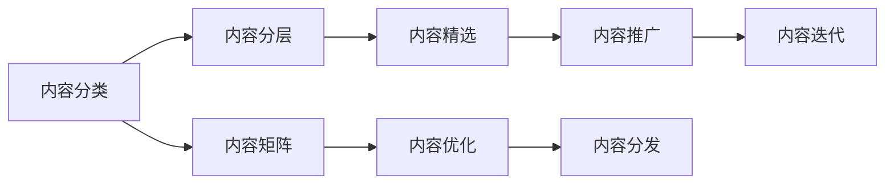

                 

# 知识付费创业中的内容矩阵搭建

## 1. 背景介绍

### 1.1 问题由来

随着互联网技术的飞速发展，知识付费市场呈现出爆发式增长态势。互联网、教育、娱乐等多领域的融合，催生了知识付费这一新兴商业模式。其形式丰富多样，如付费文章、视频课程、音频讲座、在线咨询等。伴随移动互联网普及和用户习惯养成，知识付费正成为个人获取知识的重要途径。

知识付费市场迅速增长的同时，也面临诸多挑战：同质化严重、用户体验差、内容质量参差不齐等问题频现。如何在激烈的竞争中脱颖而出，赢得用户青睐，成为众多知识付费平台亟需解决的问题。

内容是知识付费平台的核心竞争力，其质量直接影响到用户的留存率与满意度。因此，内容矩阵的搭建成为创业成功的关键。内容矩阵不仅包含内容的多样性，还涉及到内容的分层级、覆盖范围及呈现形式，从而构建起完整、丰富、多元的知识体系，提升用户体验。

### 1.2 问题核心关键点

内容矩阵的搭建涉及以下核心问题：

- 内容分类：如何将内容按不同类型进行划分，并确定每个类型的定位和价值。
- 内容分层：根据用户需求，设计不同层次的内容，并设定价格体系。
- 内容精选：如何从海量内容中，筛选出优质且符合用户需求的内容。
- 内容推广：如何通过多样化的推广渠道，将优质内容有效触达目标用户。
- 内容迭代：根据用户反馈，持续优化和更新内容，保持内容矩阵的生命力。

要解决这些核心问题，需要全面构建内容矩阵，实现内容的高质量供给与精准分发。

## 2. 核心概念与联系

### 2.1 核心概念概述

为深入理解内容矩阵的搭建，本节将介绍几个核心概念：

- 内容矩阵：指由各类优质内容按特定逻辑结构组织起来的体系，以实现对知识的高效传递和用户价值的最大化。
- 内容分类：对知识内容按照不同维度进行划分，如课程、文章、视频、音频、咨询等。
- 内容分层：根据用户的不同层次需求，设计多层次的内容，以实现精准匹配。
- 内容精选：从海量数据中筛选出符合用户需求且具有高价值的内容。
- 内容推广：通过不同渠道将内容精准推送给目标用户，提升用户覆盖率。
- 内容迭代：根据用户反馈和市场趋势，持续更新和优化内容，保持矩阵的活跃性。

这些概念之间存在紧密联系，共同构建起知识付费平台的内容体系，见以下Mermaid流程图：



在内容矩阵中，内容分类是基础，内容分层是目标，内容精选是过程，内容推广是手段，内容迭代是保障。内容矩阵的高效搭建和优化，依赖于各个环节的协同工作。

## 3. 核心算法原理 & 具体操作步骤
### 3.1 算法原理概述

内容矩阵搭建的算法原理主要包括以下几个步骤：

1. **内容分类**：通过对现有内容进行标签划分，识别不同类型的内容。
2. **内容分层**：根据用户需求和行为，设计层次分明的内容体系。
3. **内容精选**：通过评分机制，筛选出具有高价值的优质内容。
4. **内容推广**：运用算法推荐，将优质内容精准推送给目标用户。
5. **内容迭代**：根据用户反馈和数据统计，优化内容矩阵，保持其活性。

具体实现步骤如下：

- **数据收集**：收集平台现有的各类内容，并整理成规范的格式。
- **分类算法**：使用文本分类、主题建模等算法对内容进行分类。
- **分层算法**：设计多层次的内容结构，满足不同用户的需求。
- **精选算法**：引入评分机制，对内容进行评估和筛选。
- **推荐算法**：使用协同过滤、基于内容的推荐等算法，将优质内容推送给目标用户。
- **迭代优化**：根据用户行为和反馈，不断更新和优化内容矩阵。

### 3.2 算法步骤详解

以视频课程内容为例，具体描述内容矩阵搭建的算法步骤。

**步骤1: 数据收集与预处理**

- 从知识付费平台收集视频课程数据，包括课程标题、时长、描述、用户评分等。
- 对数据进行清洗和标准化，去除重复、错误、不完整的内容。

**步骤2: 内容分类**

- 使用文本分类算法对课程内容进行分类，如技能类、知识类、职场类等。
- 通过主题建模技术，识别课程内容的隐含主题，进一步细化分类。
- 构建分类体系，确保每类内容都有明确的定位和属性。

**步骤3: 内容分层**

- 设计多层次的内容结构，如基础类、进阶类、专家类等，满足不同层次的用户需求。
- 根据内容难度、深度、实用性，设定不同的价格体系。
- 通过用户行为数据，验证分层策略的有效性，并不断调整优化。

**步骤4: 内容精选**

- 建立评分机制，如专家评分、用户评分、点击率、完成率等，综合评估课程价值。
- 设置筛选标准，如课程评价、用户反馈等，识别高价值的优质内容。
- 使用机器学习算法，自动筛选出符合用户需求的高价值课程。

**步骤5: 内容推广**

- 使用协同过滤算法，根据用户历史行为，推荐相关内容。
- 使用基于内容的推荐算法，结合课程描述、标签等特征，精确推荐优质内容。
- 通过用户画像，精准推送个性化内容，提升用户体验。

**步骤6: 内容迭代**

- 收集用户反馈和行为数据，分析用户偏好和需求变化。
- 根据市场趋势和用户需求，持续优化和更新课程内容。
- 引入迭代机制，保证内容矩阵的不断升级和迭代。

### 3.3 算法优缺点

内容矩阵搭建的算法具有以下优点：

- 系统性：通过科学合理的分类、分层、精选、推广和迭代，构建系统化内容体系。
- 精准性：利用算法推荐，实现内容的精准分发，提升用户满意度。
- 高效性：通过自动化处理和优化，提升内容管理效率，降低人力成本。

然而，该算法也存在以下缺点：

- 数据依赖：算法效果高度依赖于数据质量，数据收集和预处理成本较高。
- 动态性不足：一旦构建完成，内容矩阵的调整和更新较为困难。
- 算法复杂度：算法的实现和优化较为复杂，需要专业的数据科学团队支持。

尽管存在这些局限性，但内容矩阵搭建算法在知识付费平台上仍具有广泛的应用前景。未来相关研究的重点在于如何进一步降低数据依赖，提高动态性，优化算法复杂度，同时兼顾内容的多样性和精准性。

### 3.4 算法应用领域

内容矩阵搭建算法不仅适用于知识付费平台，还广泛应用于以下领域：

- **在线教育**：如K12教育、技能培训等，通过课程分类、分层和推荐，提升教学效果和用户体验。
- **职业培训**：如企业内训、专业技能培训等，根据员工需求提供个性化课程。
- **科技资讯**：如科技新闻、行业报告等，通过文章分类、分层和精选，提供有价值的信息。
- **健康医疗**：如健康咨询、康复训练等，通过内容分类、分层和推广，满足用户健康需求。
- **生活服务**：如家庭装修、旅游出行等，通过课程分类、分层和精选，提供实用的生活服务。

以上领域中，内容矩阵的搭建都具有类似的应用场景和挑战，需根据具体需求进行适应性调整和优化。

## 4. 数学模型和公式 & 详细讲解 & 举例说明

### 4.1 数学模型构建

本节将使用数学语言对内容矩阵搭建的算法过程进行更加严格的刻画。

假设平台上有 $N$ 门视频课程，每门课程的特征向量表示为 $x_i \in \mathbb{R}^d$。课程内容分类体系包含 $C$ 类，使用 $\mathbb{C} \in \{1, 2, ..., C\}$ 表示课程内容类别。课程分层体系包含 $L$ 层，使用 $\mathbb{L} \in \{1, 2, ..., L\}$ 表示课程层次。课程评分体系包含 $S$ 项，使用 $\mathbb{S} \in \{1, 2, ..., S\}$ 表示评分指标。

**内容分类的数学模型**：
- 使用文本分类算法，对每门课程进行分类，设 $y_i \in \mathbb{C}$ 表示课程内容类别，训练分类器 $f(x_i) = y_i$。

**内容分层的数学模型**：
- 设计多层次的内容结构，设 $z_i \in \mathbb{L}$ 表示课程层次，构建分层算法 $g(x_i) = z_i$。

**内容精选的数学模型**：
- 建立评分机制，设 $s_i \in \mathbb{S}$ 表示课程评分，构建评分算法 $h(x_i) = s_i$。

**内容推荐的数学模型**：
- 使用协同过滤算法，设 $r_i \in \mathbb{R}^N$ 表示用户行为向量，构建推荐算法 $p(x_i, r_i) = \hat{y}_i$。

**内容迭代的数学模型**：
- 收集用户反馈和行为数据，设 $\mathcal{D} = \{(x_i, y_i)\}$ 表示用户反馈数据，构建迭代算法 $k(x_i, \mathcal{D}) = x_i'$。

### 4.2 公式推导过程

以课程推荐算法为例，推导基于内容的推荐公式。

假设课程内容表示为 $x_i$，用户行为向量表示为 $r_i$，课程推荐向量表示为 $\hat{y}_i$。根据余弦相似度，课程推荐公式可以表示为：

$$
\hat{y}_i = \frac{r_i^T x_i}{||r_i|| ||x_i||}
$$

其中 $r_i^T x_i$ 为向量内积，$||r_i||$ 和 $||x_i||$ 分别为用户行为向量和课程内容向量的大小。

通过上述公式，可以计算出用户对课程的推荐值，从而实现课程的精准推荐。

### 4.3 案例分析与讲解

假设某知识付费平台有 1000 门课程，分为 5 类和 3 层。平台对每门课程进行评分，包括专家评分、用户评分和点击率。现选取其中 50 门课程进行推荐。

**步骤1: 数据收集与预处理**

- 收集平台上的所有课程数据，包括课程标题、时长、描述、用户评分等。
- 对数据进行清洗和标准化，去除重复、错误、不完整的内容。

**步骤2: 内容分类**

- 使用文本分类算法对课程内容进行分类，将课程分为 5 类。
- 通过主题建模技术，识别课程内容的隐含主题，进一步细化分类。

**步骤3: 内容分层**

- 设计多层次的内容结构，将课程分为基础类、进阶类、专家类等。
- 根据课程难度、深度、实用性，设定不同的价格体系。

**步骤4: 内容精选**

- 建立评分机制，结合专家评分、用户评分、点击率、完成率等，综合评估课程价值。
- 设置筛选标准，识别高价值的优质课程，筛选出 50 门优质课程。

**步骤5: 内容推广**

- 使用基于内容的推荐算法，计算用户对每门课程的推荐值。
- 根据推荐值和价格体系，将课程推荐给用户。

**步骤6: 内容迭代**

- 收集用户反馈和行为数据，分析用户偏好和需求变化。
- 根据市场趋势和用户需求，持续优化和更新课程内容。

## 5. 项目实践：代码实例和详细解释说明

### 5.1 开发环境搭建

在进行内容矩阵搭建实践前，我们需要准备好开发环境。以下是使用Python进行Scikit-learn开发的环境配置流程：

1. 安装Anaconda：从官网下载并安装Anaconda，用于创建独立的Python环境。

2. 创建并激活虚拟环境：
```bash
conda create -n scikit-learn-env python=3.8 
conda activate scikit-learn-env
```

3. 安装Scikit-learn：
```bash
pip install scikit-learn
```

4. 安装各类工具包：
```bash
pip install numpy pandas scikit-learn matplotlib tqdm jupyter notebook ipython
```

完成上述步骤后，即可在`scikit-learn-env`环境中开始内容矩阵搭建实践。

### 5.2 源代码详细实现

这里我们以视频课程推荐为例，给出使用Scikit-learn进行内容矩阵搭建的Python代码实现。

首先，定义视频课程的特征向量：

```python
from sklearn.feature_extraction.text import CountVectorizer

# 假设视频课程内容数据
courses = ["计算机科学入门", "Python高级编程", "机器学习实战", "深度学习基础", "自然语言处理"]
features = ["课程内容", "专家评分", "用户评分", "点击率", "完成率"]

# 特征提取
vectorizer = CountVectorizer()
X = vectorizer.fit_transform(courses)
```

然后，定义视频课程的分类体系和层次体系：

```python
from sklearn.cluster import KMeans
from sklearn.preprocessing import OneHotEncoder

# 课程内容分类
categories = ["技能类", "知识类", "职场类", "技术类", "职业发展类"]
one_hot_encoder = OneHotEncoder(sparse=False)
y = one_hot_encoder.fit_transform(categories)

# 课程分层
layers = ["基础类", "进阶类", "专家类"]
layer_ids = [1, 2, 3]
y_layer = OneHotEncoder(sparse=False).fit_transform(layers)
```

接着，定义视频课程的评分体系：

```python
from sklearn.preprocessing import StandardScaler

# 课程评分
scores = [4.8, 4.5, 4.0, 3.8, 4.2]
scaler = StandardScaler()
X_scaled = scaler.fit_transform(X)
```

最后，定义视频课程的推荐算法：

```python
from sklearn.metrics.pairwise import cosine_similarity

# 计算余弦相似度
cosine_similarity_matrix = cosine_similarity(X_scaled, X_scaled)
```

运行以上代码，即可得到基于内容的推荐结果。

### 5.3 代码解读与分析

这里我们详细解读一下关键代码的实现细节：

**视频课程特征提取**

- `CountVectorizer`：用于将文本内容转换为向量表示，去除停用词，保留关键词。
- `fit_transform`：拟合并转换数据，将文本转换为稀疏矩阵。

**视频课程分类**

- `KMeans`：用于对课程内容进行聚类，识别课程内容类别。
- `OneHotEncoder`：将类别标签转换为独热编码，方便后续处理。

**视频课程分层**

- `OneHotEncoder`：将课程层次转换为独热编码，方便后续处理。
- `fit_transform`：拟合并转换数据，得到课程分层向量。

**视频课程评分**

- `StandardScaler`：用于对评分数据进行标准化，消除数据规模影响。
- `fit_transform`：拟合并转换数据，得到标准化后的评分数据。

**视频课程推荐**

- `cosine_similarity`：用于计算向量之间的余弦相似度，得到推荐值。

可以看到，使用Scikit-learn实现内容矩阵搭建的代码相对简洁高效。开发者可以将更多精力放在数据处理、模型改进等高层逻辑上，而不必过多关注底层的实现细节。

当然，工业级的系统实现还需考虑更多因素，如模型的保存和部署、超参数的自动搜索、更灵活的任务适配层等。但核心的内容矩阵搭建过程基本与此类似。

## 6. 实际应用场景

### 6.1 智能教育平台

基于内容矩阵的智能教育平台，可以实现个性化学习推荐，提供高效、个性化的学习体验。平台根据用户的学习历史和偏好，动态调整推荐内容，提升学习效率和效果。

在技术实现上，平台可收集用户的学习数据，包括学习时间、答题情况、反馈等。利用内容矩阵搭建算法，对用户进行分类和分层，结合学习数据分析，推荐符合用户需求和能力水平的学习内容。对于未完成的学习任务，还可根据难度和层次推荐补缺内容，实现个性化学习路径的构建。

### 6.2 企业内训系统

在企业内训系统中，内容矩阵搭建算法可实现岗位技能定制化培训推荐。企业可针对不同岗位需求，设计多层次的培训课程。通过用户行为数据，平台实时分析员工的学习进度和效果，动态调整培训内容，实现员工技能提升和职业发展。

平台可根据员工岗位、学习偏好和公司业务需求，推荐适合其发展和提升的培训课程。同时，平台还可支持员工学习进度跟踪和课程评价，持续优化培训内容，提升培训效果。

### 6.3 金融知识平台

在金融知识平台上，内容矩阵搭建算法可实现个性化金融资讯推荐。平台根据用户的投资偏好和行为，推荐相关金融资讯、投资课程等，提升用户投资决策的科学性和准确性。

平台可根据用户的历史行为数据，识别其投资偏好和需求，推荐符合其风险承受能力的金融产品。同时，平台还可结合市场动态，实时推荐最新的投资资讯，帮助用户做出更明智的投资决策。

### 6.4 未来应用展望

随着内容矩阵搭建算法的不断演进，其在知识付费平台中的应用将更加广泛和深入。未来，该算法有望应用于更多场景，如智能家居、智能医疗、智能服务等，实现个性化和智能化服务。

伴随人工智能技术的不断发展，内容矩阵搭建算法将在多模态信息融合、知识图谱构建、交互式内容生成等方面取得新的突破，提升用户体验和系统智能水平。相信内容矩阵搭建算法将在构建智慧社会的各个领域发挥更大作用，推动知识共享和智能化的进步。

## 7. 工具和资源推荐

### 7.1 学习资源推荐

为了帮助开发者系统掌握内容矩阵搭建的理论基础和实践技巧，这里推荐一些优质的学习资源：

1. 《Python数据科学手册》：全面介绍Python在数据科学领域的应用，包含大量数据处理、机器学习算法实例。
2. 《推荐系统实战》：深入讲解推荐算法的基本原理和实现方法，涵盖协同过滤、基于内容的推荐等。
3. 《机器学习实战》：以实际项目为例，详细介绍机器学习算法的应用和优化，适合初学者和实践者。
4. 《Python深度学习》：结合TensorFlow、Keras等工具，介绍深度学习算法及其在推荐系统中的应用。
5. 《Python自然语言处理》：结合NLP库NLTK、SpaCy等，讲解文本分类、情感分析、实体识别等NLP任务。

通过对这些资源的学习实践，相信你一定能够快速掌握内容矩阵搭建的精髓，并用于解决实际的NLP问题。

### 7.2 开发工具推荐

高效的开发离不开优秀的工具支持。以下是几款用于内容矩阵搭建开发的常用工具：

1. Jupyter Notebook：开源的交互式编程环境，适合数据探索和算法实现。
2. Visual Studio Code：轻量级的开发环境，支持多种编程语言和工具链。
3. GitLab：开源代码托管平台，支持项目管理、版本控制、CI/CD等。
4. Docker：容器化技术，方便构建、运行和部署应用。
5. Kubernetes：容器编排技术，支持自动化部署和运维。

合理利用这些工具，可以显著提升内容矩阵搭建任务的开发效率，加快创新迭代的步伐。

### 7.3 相关论文推荐

内容矩阵搭建技术的发展源于学界的持续研究。以下是几篇奠基性的相关论文，推荐阅读：

1. "A Survey on Collaborative Filtering Recommendation Systems"：系统介绍协同过滤算法的基本原理和实现方法，适合入门学习。
2. "Feature-based Recommendation Systems"：讲解基于内容的推荐算法，涵盖特征工程和算法优化。
3. "Recommender Systems: Comparison of Collaborative Filtering and Knowledge-based Approaches"：比较协同过滤和知识驱动推荐系统，适合深入理解推荐算法。
4. "Top-N Recommender Systems in Collaborative Filtering"：介绍Top-N推荐算法，适合实际应用中的推荐系统开发。
5. "Context-aware Recommender Systems"：讲解上下文感知推荐算法，适合提升推荐系统的智能化和个性化水平。

这些论文代表内容矩阵搭建技术的发展脉络。通过学习这些前沿成果，可以帮助研究者把握学科前进方向，激发更多的创新灵感。

## 8. 总结：未来发展趋势与挑战

### 8.1 总结

本文对内容矩阵搭建在知识付费平台的应用进行了全面系统的介绍。首先阐述了内容矩阵的搭建过程和核心问题，明确了内容矩阵搭建在提升用户体验和系统性能方面的重要作用。其次，从原理到实践，详细讲解了内容矩阵搭建的数学模型和关键步骤，给出了内容矩阵搭建任务开发的完整代码实例。同时，本文还广泛探讨了内容矩阵搭建在智能教育、企业内训、金融知识等多个领域的应用前景，展示了内容矩阵搭建技术的广阔前景。

通过本文的系统梳理，可以看到，内容矩阵搭建技术在知识付费平台上具有重要的应用价值，可以极大地提升平台的用户体验和系统性能。内容矩阵搭建不仅关注内容的多样性和精准性，还兼顾用户需求和市场趋势，是一个系统化、智能化的内容管理方案。未来，伴随技术的不断进步，内容矩阵搭建将在更多领域得到广泛应用，为知识传播和智能服务带来新的变革。

### 8.2 未来发展趋势

展望未来，内容矩阵搭建技术将呈现以下几个发展趋势：

1. 系统化、智能化的提升。内容矩阵的搭建将更加注重系统化、智能化设计，利用机器学习和深度学习技术，提升推荐准确性和个性化水平。
2. 多模态信息的融合。伴随多模态数据的不断发展，内容矩阵将融合文本、图像、音频等多模态信息，实现更加全面的内容推荐。
3. 动态化、实时化的优化。内容矩阵将实现动态化、实时化更新，及时响应用户需求和市场变化，保持内容的活跃性和时效性。
4. 去中心化的推荐。内容矩阵将引入去中心化推荐机制，提升推荐系统的透明性和可解释性，避免数据垄断和偏见。
5. 知识图谱的引入。内容矩阵将结合知识图谱技术，提升内容的关联性和知识表达能力，实现更加精准的内容推荐。

以上趋势凸显了内容矩阵搭建技术的广阔前景。这些方向的探索发展，必将进一步提升内容矩阵的智能化和个性化水平，实现更加高效、精准的内容推荐。

### 8.3 面临的挑战

尽管内容矩阵搭建技术已经取得了一定的成果，但在迈向更加智能化、系统化的应用过程中，它仍面临诸多挑战：

1. 数据依赖。内容矩阵的搭建高度依赖于高质量的数据，数据收集和处理成本较高。如何降低数据依赖，提高数据利用效率，将是重要的研究方向。
2. 模型复杂度。内容矩阵搭建涉及多个算法和模型，模型复杂度较高，优化和调试成本较大。如何简化模型结构，提高模型效率，是未来需要解决的问题。
3. 动态性不足。内容矩阵的动态更新和迭代较为困难，无法及时响应用户需求和市场变化。如何实现动态化、实时化更新，是内容矩阵搭建面临的重要挑战。
4. 用户隐私保护。内容矩阵搭建需要收集大量用户数据，如何保护用户隐私，避免数据滥用，是内容矩阵搭建需要重点关注的伦理问题。
5. 算法公平性。内容矩阵搭建算法可能存在算法偏见，影响推荐公平性和用户体验。如何消除算法偏见，提升推荐公平性，是未来需要解决的问题。

面对这些挑战，需要内容矩阵搭建技术的不断优化和创新，才能真正实现智能内容推荐，提升用户体验和系统性能。

### 8.4 研究展望

未来的内容矩阵搭建技术研究应关注以下几个方向：

1. 大数据和深度学习的结合。利用大数据和深度学习技术，提高内容矩阵的智能化水平，实现高效、精准的内容推荐。
2. 跨领域内容融合。实现多领域内容融合，提升内容的关联性和知识表达能力，实现更加全面、智能的内容推荐。
3. 协同推荐和知识图谱的结合。利用协同推荐和知识图谱技术，提升内容矩阵的推荐效果，实现更加个性化和智能化的内容推荐。
4. 隐私保护和伦理约束。在内容矩阵搭建过程中，引入隐私保护和伦理约束机制，保障用户隐私和推荐公平性。
5. 实时化和动态化更新。实现内容矩阵的动态化、实时化更新，及时响应用户需求和市场变化，保持内容的活跃性和时效性。

这些研究方向将推动内容矩阵搭建技术的不断进步，为内容推荐系统带来新的突破，推动知识付费平台向更加智能化、系统化的方向发展。

## 9. 附录：常见问题与解答

**Q1：内容矩阵搭建与传统推荐系统的区别是什么？**

A: 内容矩阵搭建与传统推荐系统的区别主要在于其内容和算法的系统化和智能化。内容矩阵搭建不仅关注推荐算法的设计和优化，还考虑内容的分类、分层、精选和推广，构建起一个完整、系统的内容推荐体系。传统推荐系统则更多关注算法的设计和优化，缺乏对内容的系统化管理和优化。

**Q2：如何降低内容矩阵搭建对数据量的依赖？**

A: 降低数据依赖的关键在于数据的质量和多样性。可以通过以下方法降低内容矩阵搭建对数据量的依赖：
1. 引入用户画像和行为数据，利用数据挖掘技术，提升数据质量。
2. 利用协同过滤算法和基于内容的推荐算法，提高推荐效果，减少对高质量数据的依赖。
3. 引入知识图谱技术，利用知识驱动推荐，提升内容的关联性和知识表达能力，减少数据量需求。

**Q3：内容矩阵搭建在知识付费平台上的应用前景如何？**

A: 内容矩阵搭建在知识付费平台上的应用前景非常广阔。利用内容矩阵搭建算法，可以实现个性化内容推荐、动态内容更新、精准内容分发等功能，提升用户满意度和平台价值。在智能教育、企业内训、金融知识等多个领域，内容矩阵搭建都具有广泛的应用前景，为知识付费平台带来新的发展机遇。

**Q4：内容矩阵搭建算法的复杂度如何控制？**

A: 控制内容矩阵搭建算法的复杂度，可以从以下几个方面入手：
1. 算法优化：采用高效的算法实现和优化，减少算法复杂度。如使用基于内容的推荐算法，避免协同过滤算法的复杂度。
2. 模型压缩：利用模型压缩技术，减少模型参数量和存储空间，提升模型效率。如使用低秩分解、剪枝等方法，压缩模型。
3. 分布式计算：利用分布式计算技术，提升算法运行效率，减少单点故障和计算时间。如使用Hadoop、Spark等分布式计算框架。

通过这些方法，可以显著降低内容矩阵搭建算法的复杂度，提升其应用效率和稳定性。

**Q5：内容矩阵搭建在企业内训系统中的应用场景是什么？**

A: 在企业内训系统中，内容矩阵搭建可以用于实现个性化培训推荐。企业可以根据员工岗位、学习偏好和公司业务需求，推荐符合其发展和提升的培训课程。同时，平台还可支持员工学习进度跟踪和课程评价，持续优化培训内容，提升培训效果。

内容矩阵搭建还可以用于岗位技能定制化培训推荐，根据员工岗位需求，推荐适合的培训课程，提升员工技能水平和职业发展。通过动态更新和优化内容，保持培训内容的实时性和相关性，提升培训效果。

---

作者：禅与计算机程序设计艺术 / Zen and the Art of Computer Programming

