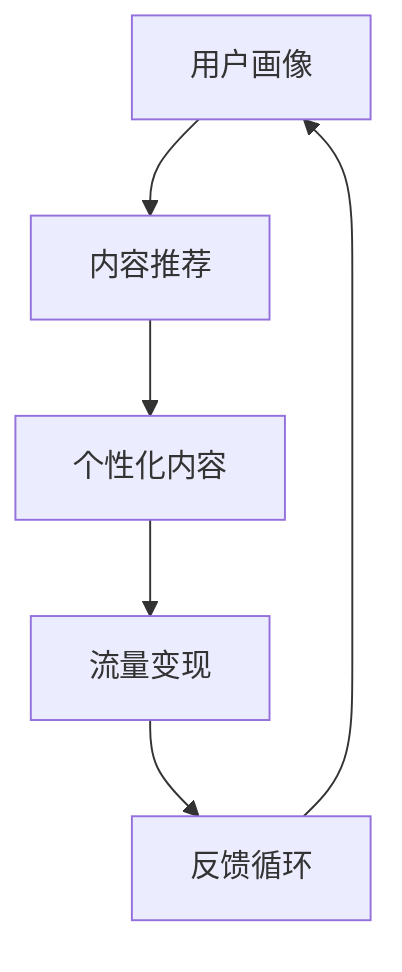

                 

# 知识付费创业中的内容矩阵搭建

> 关键词：知识付费,内容矩阵,用户画像,算法推荐,流量变现,课程策划,流量获取

## 1. 背景介绍

### 1.1 问题由来
随着互联网的迅猛发展和数字经济的崛起，知识付费市场正逐步走向成熟。企业通过优质内容吸引用户付费订阅，获得稳定的收入流。但同时，内容同质化现象严重，竞争异常激烈，如何构建一套有效的流量变现模式成为知识付费创业成功的关键。

为了应对市场竞争，企业纷纷上线各种课程、讲座、直播等形式的内容，希望通过丰富的内容来满足用户不同层次的需求。然而，如此繁杂的内容体系，反而容易陷入用户体验差、留存率低的困境。因此，构建一套科学合理的内容矩阵，精准引导用户行为，成为知识付费创业中的重要课题。

### 1.2 问题核心关键点
内容矩阵搭建旨在通过系统化地安排和分发优质内容，最大化地吸引用户、增强粘性、促成转化。该过程核心在于：

- 精准的用户画像：通过数据分析理解目标用户的兴趣和需求，进行内容定制。
- 多样化的内容形式：涵盖文字、视频、音频、直播等，满足不同用户的需求。
- 完善的算法推荐：根据用户行为和偏好，智能推送个性化的内容。
- 高效的流量变现：通过精准的内容分发，提升课程销售、广告收入等流量变现效率。

在知识付费创业中，内容矩阵的搭建不仅关系到企业的流量获取和转化，更是品牌建设、差异化竞争的关键。通过对内容矩阵的合理布局和科学管理，企业能够更好地实现用户和内容的精准匹配，显著提升用户体验和留存率，从而构建起持续健康发展的知识付费生态。

## 2. 核心概念与联系

### 2.1 核心概念概述

为更好地理解内容矩阵搭建方法，本节将介绍几个核心概念：

- **知识付费**：指用户为获取知识或技能，通过付费方式订阅内容的过程。典型的知识付费产品包括在线课程、电子书、音频讲座等。
- **内容矩阵**：指通过内容组合和布局，构建的层次分明、有机连接的内容体系。内容矩阵构建的核心在于科学规划，并通过推荐算法进行精准分发。
- **用户画像**：指通过数据分析构建的目标用户特征模型，包括兴趣、需求、行为特征等。
- **算法推荐**：指利用机器学习技术，根据用户行为和偏好，智能推送个性化的内容，提升用户体验和转化率。
- **流量变现**：指通过内容分发，实现课程销售、广告收入、会员付费等多种流量变现手段。

这些核心概念之间相互关联，共同构成知识付费创业的内容矩阵搭建框架。用户画像和算法推荐是内容矩阵搭建的关键技术，而流量变现则是最终目标。通过科学合理的内容矩阵，知识付费企业能够更好地实现用户获取和内容分发的精准匹配，提升用户体验和留存率，进而实现业务的可持续发展。

### 2.2 核心概念原理和架构的 Mermaid 流程图



这个流程图展示了核心概念之间的逻辑关系：用户画像驱动内容推荐，内容推荐进而产生个性化内容，个性化内容通过流量变现产生收入，最后反馈到用户画像构建中，形成一个闭环的反馈循环，持续优化内容和用户匹配。

## 3. 核心算法原理 & 具体操作步骤

### 3.1 算法原理概述

内容矩阵搭建的核心在于利用算法推荐技术，实现对用户行为的精准理解和个性化内容的智能分发。这其中，用户画像和推荐算法是两大关键。

- **用户画像**：通过对用户行为数据的分析，构建用户兴趣、需求、行为特征等特征模型，作为内容分发的依据。
- **推荐算法**：利用机器学习算法，根据用户画像和行为数据，智能生成推荐结果，帮助用户发现感兴趣的内容。

推荐的本质是解决用户与内容匹配的问题。理想的内容推荐系统，能够根据用户的历史行为、兴趣、反馈等信息，动态调整推荐结果，最大化地满足用户需求，提升用户粘性和转化率。

### 3.2 算法步骤详解

以下是基于用户画像的推荐算法的主要步骤：

**Step 1: 数据准备与预处理**
- 收集用户行为数据，包括浏览记录、购买记录、评分反馈等。
- 对数据进行清洗、去重、归一化等预处理，生成用户画像和内容标签。

**Step 2: 用户画像构建**
- 利用文本挖掘、情感分析等技术，提取用户行为数据中的关键特征。
- 使用协同过滤、聚类等算法，将用户分为不同的兴趣群体。
- 为每个用户生成多维度的特征向量，包括兴趣偏好、行为习惯、历史评分等。

**Step 3: 内容特征提取**
- 对内容进行分词、标注、情感分析等预处理，生成内容特征向量。
- 根据内容属性，如作者、标签、评论等，进一步丰富内容特征。

**Step 4: 相似度计算**
- 计算用户画像与内容特征之间的相似度，可以使用余弦相似度、皮尔逊相关系数等。
- 根据相似度结果，排序并推荐与用户画像相似度高的内容。

**Step 5: 模型训练与调优**
- 利用监督学习算法，如GBDT、XGBoost等，训练推荐模型。
- 使用交叉验证、超参数调优等技术，优化推荐模型效果。

**Step 6: 实时推荐**
- 将训练好的推荐模型部署到线上，实时计算并推荐与用户画像相似度高的内容。
- 不断收集用户反馈数据，持续优化推荐模型。

### 3.3 算法优缺点

基于用户画像的推荐算法具有以下优点：
- 个性化精准：能够根据用户历史行为和偏好，提供高度定制化的内容推荐。
- 用户粘性强：通过个性化推荐，满足用户多样化需求，提升用户粘性。
- 流量转化高：推荐的精准性有助于提升课程销售、广告收入等流量变现效率。

同时，该算法也存在一些缺点：
- 数据依赖度高：需要收集大量用户行为数据，对数据质量要求高。
- 推荐效果受限于用户画像：如果用户画像不准确，推荐效果可能不佳。
- 计算成本高：需要处理大量数据，进行复杂的特征提取和相似度计算，计算资源消耗大。

### 3.4 算法应用领域

基于用户画像的推荐算法在知识付费领域有广泛的应用，例如：

- 在线课程推荐：根据用户浏览记录、评分反馈等行为数据，推荐相关课程。
- 讲座和直播推荐：利用用户兴趣标签，推荐感兴趣的主题和讲师。
- 个性化电子书推荐：根据用户阅读习惯和评分记录，推荐相关电子书。
- 会员增值服务：通过内容推荐和定制化服务，提升会员订阅体验和续费率。

除了知识付费领域，该算法还广泛应用于电商、社交、新闻推荐等多个领域，帮助企业实现个性化推荐和流量变现。随着推荐算法的不断优化和用户数据的持续积累，推荐系统将成为各行业用户增长和内容运营的重要工具。

## 4. 数学模型和公式 & 详细讲解 & 举例说明

### 4.1 数学模型构建

假设用户画像表示为向量 $u$，内容特征表示为向量 $v$。推荐模型 $P$ 将用户画像 $u$ 与内容特征 $v$ 的相似度表示为：

$$
P(u, v) = \text{similarity}(u, v)
$$

常见的相似度计算方法包括余弦相似度、皮尔逊相关系数等。其中，余弦相似度计算公式为：

$$
\text{similarity}(u, v) = \frac{u \cdot v}{\|u\| \cdot \|v\|}
$$

其中，$u \cdot v$ 表示向量 $u$ 和 $v$ 的点积，$\|u\|$ 和 $\|v\|$ 表示向量的范数。

### 4.2 公式推导过程

以余弦相似度为例，推导其具体计算过程：

设 $u$ 和 $v$ 为两个用户画像和内容特征向量，其向量长度分别为 $\|u\|$ 和 $\|v\|$。向量点积计算公式为：

$$
u \cdot v = \sum_{i=1}^n u_i \cdot v_i
$$

其中，$n$ 表示向量的维度，$u_i$ 和 $v_i$ 分别表示向量 $u$ 和 $v$ 的第 $i$ 个元素。

根据点积结果，计算相似度公式：

$$
P(u, v) = \frac{u \cdot v}{\|u\| \cdot \|v\|} = \frac{\sum_{i=1}^n u_i \cdot v_i}{\sqrt{\sum_{i=1}^n u_i^2} \cdot \sqrt{\sum_{i=1}^n v_i^2}}
$$

在实际应用中，可以通过归一化方法，将用户画像和内容特征向量均归一化至单位向量，简化计算过程。

### 4.3 案例分析与讲解

假设一个在线课程平台，用户画像 $u$ 和课程内容特征 $v$ 均为向量形式。我们选取以下用户画像和课程特征进行相似度计算：

**用户画像 $u_1$**：
- 用户ID: 1001
- 浏览课程: [算法基础, 机器学习, 数据结构]

**课程内容特征 $v_1$**：
- 课程ID: 10001
- 课程名: 算法基础
- 讲师ID: 101
- 课程标签: 算法, 基础, 大学, 入门

根据余弦相似度公式，计算用户画像 $u_1$ 与课程内容特征 $v_1$ 的相似度：

$$
P(u_1, v_1) = \frac{\sum_{i=1}^n u_{1i} \cdot v_{1i}}{\sqrt{\sum_{i=1}^n u_{1i}^2} \cdot \sqrt{\sum_{i=1}^n v_{1i}^2}}
$$

代入具体数值：

$$
u_{1i} = \begin{cases}
1, & i = 1 \\
0, & i = 2, 3, 4
\end{cases}
$$

$$
v_{1i} = \begin{cases}
1, & i = 1, 3, 4 \\
0, & i = 2
\end{cases}
$$

计算点积 $u_1 \cdot v_1 = 1$，计算范数 $\|u_1\| = \sqrt{1} = 1$，$\|v_1\| = \sqrt{3} = 1.732$。

最终计算得到相似度：

$$
P(u_1, v_1) = \frac{1}{1 \cdot 1.732} = 0.575
$$

根据相似度排序，推荐与用户画像相似度高的课程内容，如算法基础、机器学习等。

## 5. 项目实践：代码实例和详细解释说明

### 5.1 开发环境搭建

在进行内容矩阵搭建实践前，我们需要准备好开发环境。以下是使用Python进行推荐系统开发的环境配置流程：

1. 安装Anaconda：从官网下载并安装Anaconda，用于创建独立的Python环境。

2. 创建并激活虚拟环境：
```bash
conda create -n recommendation-env python=3.8 
conda activate recommendation-env
```

3. 安装Python相关库：
```bash
pip install numpy pandas scikit-learn joblib scipy beautifulsoup4 requests
```

4. 安装推荐系统相关库：
```bash
pip install recsys
```

5. 安装Web框架相关库：
```bash
pip install flask
```

完成上述步骤后，即可在`recommendation-env`环境中开始推荐系统开发。

### 5.2 源代码详细实现

这里我们以推荐系统的Web应用为例，给出推荐系统的完整代码实现。

首先，定义推荐模型的基本框架：

```python
from flask import Flask, request, jsonify
from recsys.models import collaborative_filters
from recsys.utils.data import read_csv, prepare_data

app = Flask(__name__)

# 加载数据
train_data, test_data = read_csv('train.csv', 'test.csv')
train_data, test_data = prepare_data(train_data, test_data)

# 定义推荐模型
model = collaborative_filters.CF(train_data)
model.train()
```

然后，实现推荐API接口：

```python
@app.route('/recommend', methods=['POST'])
def recommend():
    user_id = request.json['user_id']
    test_data = request.json['test_data']
    predictions = model.predict(user_id, test_data)
    return jsonify(predictions)
```

最后，运行推荐系统：

```python
if __name__ == '__main__':
    app.run(debug=True)
```

在实际应用中，我们还需要构建用户画像、计算相似度、部署模型等更多功能。完整的推荐系统开发可以参见推荐系统开源项目如PyRecSys。

### 5.3 代码解读与分析

让我们再详细解读一下关键代码的实现细节：

**read_csv函数**：
- 定义了读取CSV格式训练数据和测试数据的方法，返回DataFrame格式的数据。

**prepare_data函数**：
- 定义了数据预处理的方法，包括归一化、特征编码、构建训练集等。

**collaborative_filters模块**：
- 推荐系统核心模块，提供了基于协同过滤的推荐算法，包括用户-项目评分矩阵、用户画像等。

**CF类**：
- 协同过滤推荐模型，接收训练数据，训练模型，并支持用户ID和测试数据预测。

**Flask框架**：
- 用于封装API接口，实现推荐系统的调用。

**recommend函数**：
- 接收用户ID和测试数据，调用推荐模型进行预测，并返回JSON格式的结果。

**if __name__ == '__main__'代码块**：
- 启动Flask应用，运行推荐系统服务。

可以看到，代码简洁明了，封装了推荐系统核心模块和Flask框架，实现了推荐API的快速搭建和调用。

## 6. 实际应用场景

### 6.1 电商推荐

电商领域中的推荐系统广泛应用在商品推荐、个性化广告等方面。通过收集用户浏览、点击、购买等行为数据，构建用户画像，利用推荐算法进行个性化推荐，可以显著提升用户转化率和购物体验。

例如，用户浏览某电商平台的服装产品后，系统会分析用户兴趣标签和购买记录，推荐相关商品和个性化优惠券。通过精准推荐，用户能够快速找到心仪的商品，提升购物满意度，同时增加平台销售额。

### 6.2 社交媒体推荐

社交媒体平台，如微博、抖音等，通过推荐系统为用户提供个性化内容，提升用户粘性和活跃度。用户点赞、评论、转发等行为数据，是推荐系统的主要依据。

例如，微博平台会根据用户历史互动数据，推荐相关话题和视频内容。用户通过观看推荐内容，参与话题讨论，形成活跃的社交圈，平台也能够获得更多的用户互动数据，形成良性循环。

### 6.3 在线教育推荐

在线教育平台通过推荐系统，为用户推荐相关课程、讲师和直播，提升学习效率和用户体验。用户的学习记录、评分反馈等行为数据，是推荐系统的输入。

例如，用户在某在线教育平台上学习数学课程后，系统会分析用户的学习行为，推荐相关数学课程和在线讲座。通过个性化的学习内容推荐，用户能够更快掌握知识，提升学习效率，同时平台也能获得更多的学习数据，用于改进课程质量。

### 6.4 未来应用展望

随着推荐算法的不断优化和用户数据的持续积累，推荐系统将在更多领域得到应用，为各行业带来新的增长点。

在智慧城市治理中，推荐系统可以用于智能交通、公共服务等方面，优化城市资源配置，提升市民生活体验。

在医疗健康领域，推荐系统可以用于疾病诊断、康复方案推荐等方面，提供个性化的医疗服务。

在金融科技领域，推荐系统可以用于风险评估、金融产品推荐等方面，提升金融服务的精准性和效率。

未来，推荐系统将成为各行各业用户增长和内容运营的重要工具，带来更多的商业价值和用户福利。

## 7. 工具和资源推荐

### 7.1 学习资源推荐

为了帮助开发者系统掌握推荐系统的内容矩阵搭建理论基础和实践技巧，这里推荐一些优质的学习资源：

1. 《推荐系统实战》系列书籍：由推荐系统专家撰写，涵盖推荐系统的基本概念、算法原理和工程实践。

2. KDD Cup竞赛数据集：通过参加推荐系统相关的KDD Cup竞赛，获取丰富的推荐系统数据和案例分析，提升实战能力。

3. UCI机器学习竞赛数据集：包含各类推荐系统数据集，可以用于构建自己的推荐系统，进行模型训练和优化。

4. TensorFlow官方文档：TensorFlow提供详细的推荐系统API和教程，帮助开发者快速上手推荐系统开发。

5. RecSys年度会议论文：推荐系统领域顶级会议的论文，涵盖最新推荐系统算法和应用案例，是理论学习和技术交流的重要来源。

通过对这些资源的学习实践，相信你一定能够快速掌握推荐系统的核心思想和实现方法，构建出有效的内容矩阵。

### 7.2 开发工具推荐

高效的开发离不开优秀的工具支持。以下是几款用于推荐系统开发的常用工具：

1. PyTorch：基于Python的开源深度学习框架，灵活动态的计算图，适合快速迭代研究。大多数推荐系统算法都有PyTorch版本的实现。

2. TensorFlow：由Google主导开发的开源深度学习框架，生产部署方便，适合大规模工程应用。同样有丰富的推荐系统资源。

3. Scikit-learn：用于机器学习算法实现的Python库，包含协同过滤、PCA等推荐系统算法，便于快速搭建推荐系统。

4. Spark MLlib：Apache Spark中的机器学习库，支持分布式训练和预测，适合大数据环境下的推荐系统开发。

5. Flask：用于封装API接口的轻量级Web框架，便于快速构建推荐系统API服务。

合理利用这些工具，可以显著提升推荐系统开发效率，加快创新迭代的步伐。

### 7.3 相关论文推荐

推荐系统的发展源于学界的持续研究。以下是几篇奠基性的推荐系统相关论文，推荐阅读：

1. "Collaborative Filtering for Implicit Feedback Datasets"（Bellkacem等，2007）：提出协同过滤算法，为推荐系统奠定了基础。

2. "Factorization Meets the Neighborhood: A Multifaceted Collaborative Filtering Model"（Cantor等，2009）：提出基于矩阵分解的推荐算法，显著提升了推荐系统精度。

3. "Implicit Feature Recommendation with Matrix Factorization"（Zhou等，2010）：提出基于矩阵分解的隐式推荐算法，优化了推荐效果。

4. "Learning to Rank with Generic Base Models"（Gao等，2013）：提出基于排序学习的推荐算法，提升了推荐系统的多样化能力。

5. "Deep Interest Network for Recommendation"（Liu等，2018）：提出基于深度学习的推荐系统，提升了推荐系统的深度挖掘能力。

这些论文代表推荐系统的发展脉络。通过学习这些前沿成果，可以帮助研究者把握学科前进方向，激发更多的创新灵感。

## 8. 总结：未来发展趋势与挑战

### 8.1 总结

本文对知识付费创业中的内容矩阵搭建方法进行了全面系统的介绍。首先阐述了推荐系统的核心概念和应用背景，明确了内容矩阵搭建在知识付费创业中的重要意义。其次，从原理到实践，详细讲解了推荐算法的数学模型和关键步骤，给出了推荐系统开发的完整代码实例。同时，本文还广泛探讨了推荐系统在电商、社交、教育等多个行业领域的应用前景，展示了推荐范式的巨大潜力。此外，本文精选了推荐系统的各类学习资源，力求为读者提供全方位的技术指引。

通过本文的系统梳理，可以看到，基于用户画像的推荐系统已经逐步成为知识付费创业中的重要工具，极大地提升了企业的内容分发效率和用户体验。未来，随着推荐算法的不断演进和用户数据的持续积累，推荐系统将在更多领域得到应用，为各行业带来更多的商业价值和用户福利。

### 8.2 未来发展趋势

展望未来，推荐系统将呈现以下几个发展趋势：

1. 多模态推荐：推荐系统不再局限于文本数据，将引入图像、音频、视频等多模态信息，提升推荐系统的全面性和精准性。

2. 实时推荐：推荐系统将实现实时计算和推荐，根据用户实时行为和状态，提供最新的个性化内容。

3. 跨域推荐：推荐系统将跨平台、跨服务进行协同推荐，提升推荐内容的覆盖面和多样性。

4. 混合推荐：推荐系统将综合使用协同过滤、内容推荐、基于知识的推荐等多种方法，提升推荐效果。

5. 协同训练：推荐系统将引入其他领域的知识，通过知识融合提升推荐系统的效果。

以上趋势凸显了推荐系统的广阔前景。这些方向的探索发展，必将进一步提升推荐系统的性能和应用范围，为各行业带来新的增长点。

### 8.3 面临的挑战

尽管推荐系统已经取得了瞩目成就，但在迈向更加智能化、普适化应用的过程中，它仍面临诸多挑战：

1. 数据质量问题：推荐系统依赖大量高质量的数据，数据质量和完备性直接影响推荐效果。如何在数据稀疏、不完整的情况下，仍能保证推荐系统的效果，还需要进一步研究。

2. 计算资源限制：推荐系统涉及大量数据计算和特征工程，对计算资源和存储空间要求较高。如何在资源有限的情况下，仍能保证推荐系统的速度和精度，是一个重要课题。

3. 隐私和安全问题：用户行为数据包含大量个人隐私信息，如何在数据使用中保障用户隐私和安全，是推荐系统需要解决的问题。

4. 模型复杂度问题：推荐算法复杂度较高，模型训练和调优难度大。如何在简化模型结构的同时，提升推荐效果，需要更多研究和探索。

5. 冷启动问题：新用户的兴趣和行为数据不足，推荐系统难以给出合适的推荐结果。如何克服冷启动问题，是推荐系统面临的重大挑战。

6. 多样性和公平性问题：推荐系统容易陷入推荐同质化，导致内容多样性下降。如何在推荐过程中兼顾多样性和公平性，是推荐系统需要进一步优化的方向。

这些挑战需要技术界和产业界共同努力，不断优化推荐系统的算法和技术实现，才能真正实现推荐系统的理想效果。

### 8.4 研究展望

面向未来，推荐系统需要在以下几个方向进行进一步研究：

1. 探索更加高效的数据处理和特征提取方法，提升推荐系统对数据稀疏、不完整情况的应对能力。

2. 结合深度学习和知识图谱，提升推荐系统的多样性和准确性。

3. 引入个性化增强的推荐算法，提升推荐系统的公平性和多样性。

4. 开发可解释的推荐系统模型，增强推荐系统的透明性和可信度。

5. 引入用户反馈机制，实时调整推荐算法，优化推荐效果。

6. 在隐私保护技术上，加强对用户隐私数据的保护，提升推荐系统的安全性。

通过这些研究方向的探索，推荐系统必将不断提升性能，拓展应用场景，为各行业带来更多商业价值和用户福利。未来，随着推荐系统的不断优化和应用，它将成为各行各业内容分发和用户增长的重要工具，带来更多的商业机会和用户福利。

## 9. 附录：常见问题与解答

**Q1：推荐系统在知识付费领域的应用效果如何？**

A: 推荐系统在知识付费领域应用广泛，能够显著提升用户转化率和留存率。通过精准推荐相关课程和内容，满足用户个性化需求，提升用户体验和满意度。例如，某在线教育平台通过推荐系统，将用户浏览过的课程推荐给新用户，显著提高了新用户订阅率和课程销售量。

**Q2：推荐系统的核心是用户画像还是算法推荐？**

A: 推荐系统的核心是用户画像和算法推荐的有机结合。用户画像提供了推荐算法的输入，是推荐算法精准化的关键。而算法推荐则根据用户画像，动态调整推荐内容，提升用户体验和推荐效果。两者相辅相成，缺一不可。

**Q3：推荐系统的计算成本如何优化？**

A: 推荐系统的计算成本可以通过以下几个方法进行优化：
1. 使用分布式计算框架，如Spark，提升计算效率。
2. 优化特征提取和相似度计算算法，减少计算量。
3. 采用增量学习算法，动态更新模型，减少重新训练的开销。
4. 采用近邻搜索算法，提升推荐速度。

**Q4：推荐系统如何应对冷启动问题？**

A: 推荐系统应对冷启动问题，可以从以下几个方面入手：
1. 利用用户行为数据，通过协同过滤算法推荐类似用户的喜好。
2. 引入用户兴趣调查问卷，收集用户兴趣信息，进行个性化推荐。
3. 结合基于内容的推荐方法，根据课程内容进行推荐。
4. 提供个性化推荐模板，引导用户填写兴趣信息，丰富用户画像。

**Q5：推荐系统的数据质量如何保障？**

A: 推荐系统的数据质量可以通过以下几个方法保障：
1. 建立数据清洗和预处理流程，去除数据中的噪声和异常值。
2. 引入数据标注和验证机制，确保数据准确性和完整性。
3. 进行数据采样和划分，避免过拟合和欠拟合问题。
4. 定期更新数据集，确保数据的实时性和相关性。

**Q6：推荐系统如何实现多模态推荐？**

A: 实现多模态推荐，可以采用以下方法：
1. 引入多种数据源，如文本、图像、音频等。
2. 利用深度学习技术，提取多模态数据的特征。
3. 融合多种推荐算法，如协同过滤、内容推荐等，提升推荐效果。
4. 构建多模态知识图谱，整合不同模态的数据，提升推荐系统的全面性和精准性。

通过这些问题和解答，可以看到推荐系统在知识付费创业中的关键作用和面临的挑战。只有在不断优化推荐算法和技术实现的基础上，才能真正实现推荐系统的理想效果，推动知识付费行业的健康发展。

