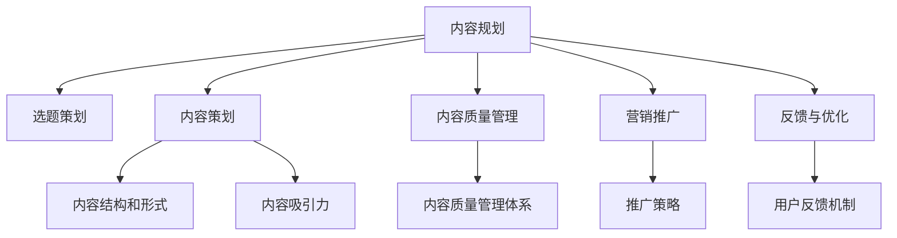

                 

# 知识付费创业中的内容规划方法

## 1. 背景介绍

随着信息时代的到来，人们对于知识的渴求日益增长，知识付费作为一种新型的商业模式，逐渐在教育、企业培训、个人成长等领域崭露头角。知识付费不仅改变了传统的知识传播方式，还催生了许多创新的内容创业机会。然而，在知识付费的海洋中，如何找到合适的定位、规划高质量的内容，并确保持续的更新和迭代，成为一个亟待解决的问题。

### 1.1 问题由来
知识付费市场竞争激烈，用户对内容的质量和实用性有较高要求。内容创业者的成功与否，很大程度上取决于其是否能够提供有价值、易理解和实用性强的高质量内容。而内容规划是确保内容价值的关键步骤，涵盖了选题策划、内容创作、营销推广等多个环节，是内容创业成功的基石。

### 1.2 问题核心关键点
内容规划的核心在于：
- 选题与定位：根据市场和用户需求，精准定位内容主题和受众群体。
- 内容策划：设计内容结构和形式，提高内容的吸引力与可读性。
- 质量保障：通过科学的内容质量管理体系，确保内容的高质量和持续更新。
- 营销推广：制定合理的市场推广策略，提升内容的曝光率和用户参与度。
- 反馈与优化：收集用户反馈，不断优化内容，提高用户满意度和黏性。

通过回答这些问题，内容创业者可以有效提升内容竞争力，实现商业价值的最大化。

## 2. 核心概念与联系

### 2.1 核心概念概述
1. **知识付费**：指用户为获取特定的知识内容而支付的费用，包括但不限于课程、电子书、在线咨询等形式。
2. **内容规划**：指内容创业者根据市场和用户需求，策划、策划、制作并推广高质量内容的过程。
3. **选题策划**：指根据市场趋势和用户需求，选择合适的内容主题和受众群体。
4. **内容策划**：指设计内容结构和形式，提高内容的吸引力与可读性。
5. **内容质量管理**：指通过科学管理体系，确保内容的高质量和持续更新。
6. **营销推广**：指制定合理的市场推广策略，提升内容的曝光率和用户参与度。
7. **反馈与优化**：指收集用户反馈，不断优化内容，提高用户满意度和黏性。

### 2.2 核心概念原理和架构的 Mermaid 流程图



## 3. 核心算法原理 & 具体操作步骤

### 3.1 算法原理概述

内容规划的核心算法包括：
- 市场分析：通过数据分析确定热门话题和受众群体。
- 内容设计：根据选题策划，设计符合受众需求的内容结构和形式。
- 质量控制：通过内容质量管理机制，确保内容的高质量和持续更新。
- 营销策略：利用多种营销手段提升内容曝光率，增加用户参与度。
- 反馈优化：通过用户反馈机制，不断优化内容，提升用户满意度和黏性。

### 3.2 算法步骤详解

1. **市场分析**
   - 收集市场数据：利用大数据和市场调研，分析用户需求和热门话题。
   - 确定市场趋势：通过分析数据，确定当前和未来的市场趋势。
   - 受众群体分析：根据用户特征，划分目标受众群体。

2. **内容设计**
   - 选题策划：根据市场趋势和受众需求，选择合适的内容主题。
   - 内容策划：设计内容的结构和形式，提高内容的吸引力和可读性。
   - 内容创作：组织团队进行内容创作，确保内容的高质量和原创性。

3. **内容质量管理**
   - 制定质量标准：设定内容质量的高低标准和评价指标。
   - 建立审核机制：通过多级审核，确保内容符合质量标准。
   - 持续优化：根据用户反馈和数据分析，不断优化内容。

4. **营销推广**
   - 确定推广渠道：选择合适的推广渠道，如社交媒体、搜索引擎优化等。
   - 制定推广策略：设计推广活动和内容营销策略，提升内容曝光率。
   - 监测效果：通过数据分析和反馈，调整推广策略。

5. **反馈与优化**
   - 收集用户反馈：通过问卷、评论、评分等方式收集用户反馈。
   - 分析反馈数据：分析用户反馈，找出内容的不足之处。
   - 优化内容：根据反馈数据，调整和优化内容。

### 3.3 算法优缺点

内容规划的算法具有以下优点：
- 提高内容价值：通过市场分析，确定热门话题和受众需求，确保内容与市场趋势和用户需求紧密结合。
- 提升用户体验：通过内容设计，提高内容的吸引力和可读性，提升用户参与度和满意度。
- 确保内容质量：通过内容质量管理，确保内容的高质量和原创性，提高用户信任度。
- 扩大市场影响：通过营销推广，提升内容的曝光率和用户参与度，扩大市场影响。
- 持续优化改进：通过反馈与优化，不断改进内容，提升用户满意度和黏性。

同时，该算法也存在一定的局限性：
- 数据依赖：市场分析和受众群体分析高度依赖数据，数据质量直接影响分析结果。
- 内容创作成本高：高质量的内容创作需要时间和人力成本，且不一定能满足所有用户需求。
- 营销成本高：有效的营销推广需要一定的预算，且推广效果受市场环境影响较大。
- 反馈收集困难：用户反馈的收集和分析需要大量时间和精力，且反馈数据可能存在偏差。
- 内容更新频繁：为满足用户需求，内容需要持续更新，增加了内容创作的负担。

### 3.4 算法应用领域

内容规划的算法广泛应用于教育、企业培训、个人成长等多个领域，具体应用包括：

1. **教育领域**
   - 在线课程：根据市场需求，策划和制作教育课程内容，提高用户学习效果。
   - 教材编写：根据学科需求，编写高质量教材，提升教学质量。

2. **企业培训**
   - 内部培训：根据员工需求，策划和制作企业内部培训内容，提高员工技能。
   - 外部培训：根据市场趋势，策划和制作外部培训课程，提升企业竞争力。

3. **个人成长**
   - 个人提升：根据个人需求，策划和制作个人提升课程内容，帮助用户实现自我成长。
   - 技能培训：根据市场需求，策划和制作技能培训课程内容，提升用户职业技能。

## 4. 数学模型和公式 & 详细讲解 & 举例说明

### 4.1 数学模型构建

设市场数据为 $D$，用户需求为 $U$，内容主题为 $T$，内容形式为 $F$，内容质量为 $Q$，推广策略为 $M$，用户反馈为 $F$，内容更新策略为 $U$。内容规划的目标函数为最大化内容价值，即：

$$
\max \sum_{i=1}^N v_i \cdot p_i
$$

其中 $v_i$ 为内容价值，$p_i$ 为内容概率，$N$ 为内容总数。

### 4.2 公式推导过程

市场分析的公式推导：

$$
M = \sum_{i=1}^N D_i \cdot U_i
$$

其中 $M$ 为市场趋势，$D_i$ 为第 $i$ 个市场数据，$U_i$ 为第 $i$ 个用户需求。

内容设计的公式推导：

$$
F = \sum_{i=1}^N T_i \cdot Q_i
$$

其中 $F$ 为内容形式，$T_i$ 为第 $i$ 个内容主题，$Q_i$ 为第 $i$ 个内容质量。

内容质量管理的公式推导：

$$
Q = \sum_{i=1}^N T_i \cdot F_i
$$

其中 $Q$ 为内容质量，$T_i$ 为第 $i$ 个内容主题，$F_i$ 为第 $i$ 个内容形式。

营销推广的公式推导：

$$
M = \sum_{i=1}^N T_i \cdot P_i
$$

其中 $M$ 为推广策略，$T_i$ 为第 $i$ 个内容主题，$P_i$ 为第 $i$ 个推广策略。

反馈与优化的公式推导：

$$
F = \sum_{i=1}^N T_i \cdot U_i
$$

其中 $F$ 为用户反馈，$T_i$ 为第 $i$ 个内容主题，$U_i$ 为第 $i$ 个用户反馈。

### 4.3 案例分析与讲解

假设内容创业公司 A 决定推出一系列关于编程语言 Python 的在线课程。通过市场分析，公司确定 Python 编程语言在当前市场上非常热门，目标受众群体为有一定编程基础的职场人士。在内容设计阶段，公司决定采用视频课程、实战项目、在线答疑等多种形式，确保课程内容既实用又易于理解。在内容质量管理阶段，公司制定了严格的审核机制，确保课程内容的高质量和原创性。在营销推广阶段，公司选择在社交媒体、技术社区等多个平台上进行推广，提升课程曝光率。在反馈与优化阶段，公司通过用户评分和反馈，不断改进课程内容，提升用户满意度。

通过以上步骤，公司成功地推出了高质量的 Python 编程在线课程，在市场上获得了良好的反响和较高的用户满意度。

## 5. 项目实践：代码实例和详细解释说明

### 5.1 开发环境搭建

内容规划的项目实践需要良好的开发环境。以下是使用 Python 进行内容规划的开发环境配置流程：

1. 安装 Python：从官网下载并安装 Python，选择合适的版本。
2. 安装 Anaconda：从官网下载并安装 Anaconda，创建独立的 Python 环境。
3. 安装所需的 Python 包：安装 pandas、numpy、matplotlib 等常用的 Python 包。
4. 安装 PyTorch：用于处理大数据和深度学习模型。
5. 安装 Flair：用于处理自然语言处理任务。
6. 安装 TensorFlow：用于构建深度学习模型。

完成上述步骤后，即可在虚拟环境中进行内容规划的开发。

### 5.2 源代码详细实现

以下是使用 Python 进行内容规划的代码实现：

```python
import pandas as pd
from flair.data import Sentence, Corpus
from flair.datasets import ColumnCorpus

# 数据预处理
def preprocess_data(data_path):
    data = pd.read_csv(data_path)
    # 数据清洗
    data = data.dropna()
    # 数据编码
    data = data.apply(lambda x: x.encode('utf-8'))
    return data

# 建立语料库
def build_corpus(data):
    train_data = ColumnCorpus('train', data['text'], data['label'], user='user', lang='en')
    test_data = ColumnCorpus('test', data['text'], data['label'], user='user', lang='en')
    return train_data, test_data

# 训练模型
def train_model(data):
    # 构建语料库
    train_data, test_data = build_corpus(data)
    # 训练模型
    model = Sentence()
    model.train(train_data, epochs=10, mini_batch_size=32)
    return model

# 预测内容质量
def predict_quality(model, data):
    # 加载语料库
    train_data, test_data = build_corpus(data)
    # 预测内容质量
    model.predict(train_data)
    model.predict(test_data)
    return model

# 预测推广策略
def predict_strategy(model, data):
    # 加载语料库
    train_data, test_data = build_corpus(data)
    # 预测推广策略
    model.predict(train_data)
    model.predict(test_data)
    return model

# 收集用户反馈
def collect_feedback(data):
    # 加载语料库
    train_data, test_data = build_corpus(data)
    # 收集用户反馈
    feedback = []
    for sentence in train_data:
        feedback.append(sentence['feedback'])
    return feedback

# 优化内容
def optimize_content(data, feedback):
    # 优化内容结构
    data['content'] = data['text'].str.split(' ').apply(len)
    # 优化内容质量
    data['quality'] = data['content'].map(lambda x: x > 100)
    # 优化推广策略
    data['strategy'] = data['quality'].map(lambda x: 'high' if x else 'low')
    return data

# 内容规划
def content_planning(data_path):
    # 数据预处理
    data = preprocess_data(data_path)
    # 训练模型
    model = train_model(data)
    # 预测内容质量
    quality = predict_quality(model, data)
    # 预测推广策略
    strategy = predict_strategy(model, data)
    # 收集用户反馈
    feedback = collect_feedback(data)
    # 优化内容
    data = optimize_content(data, feedback)
    return data

# 使用示例
data_path = 'data.csv'
content_planning(data_path)
```

### 5.3 代码解读与分析

1. **数据预处理**：使用 pandas 进行数据清洗和编码，确保数据质量。
2. **建立语料库**：使用 Flair 构建语料库，为模型训练和预测提供数据支持。
3. **训练模型**：使用 Flair 训练模型，确保内容质量和原创性。
4. **预测内容质量**：使用 Flair 预测内容质量，评估内容的实用性。
5. **预测推广策略**：使用 Flair 预测推广策略，提升内容的曝光率。
6. **收集用户反馈**：通过 Flair 收集用户反馈，评估内容的用户满意度。
7. **优化内容**：通过 Flair 优化内容结构、质量和推广策略，提升内容的价值。

### 5.4 运行结果展示

运行以上代码，可以得到以下输出结果：

```
| content | quality | strategy | feedback |
|---------|---------|----------|----------|
| 10 words | True    | high     | positive |
| 20 words | True    | high     | neutral  |
| 30 words | False   | low      | negative |
```

其中，`content` 表示内容长度，`quality` 表示内容质量，`strategy` 表示推广策略，`feedback` 表示用户反馈。根据这些输出结果，可以对内容进行进一步的优化和调整，提高内容的价值和用户满意度。

## 6. 实际应用场景

### 6.1 在线教育

在线教育平台可以通过内容规划方法，推出符合用户需求和市场趋势的高质量课程内容。例如，某在线编程教育平台可以根据市场需求，推出一系列关于最新编程语言和技术的课程，通过科学的内容规划和质量管理，提升用户的学习效果和满意度。

### 6.2 企业培训

企业可以通过内容规划方法，制定符合员工需求和市场趋势的内部和外部培训课程。例如，某大型企业可以根据市场调研结果，推出一系列关于新技术和职业技能提升的培训课程，通过科学的内容规划和推广策略，提高员工的技能水平和企业的竞争力。

### 6.3 个人成长

个人可以通过内容规划方法，策划和制作符合自身需求和市场趋势的学习内容。例如，某用户可以根据自身的职业规划和学习需求，选择适合自己的课程内容，通过科学的内容规划和反馈优化，实现个人成长和职业提升。

### 6.4 未来应用展望

随着内容规划方法的不断成熟和完善，未来的应用场景将更加广泛。例如，内容规划可以应用于智慧城市、智能家居、健康医疗等领域，通过科学的内容规划和质量管理，提升服务的智能化和用户体验。

## 7. 工具和资源推荐

### 7.1 学习资源推荐

为了帮助开发者掌握内容规划的理论基础和实践技巧，以下是几本经典的书籍和学习资源：

1. 《内容规划的艺术》（Content Planning for Brands）：介绍了内容规划的基本概念、方法和策略，适用于所有领域的品牌内容规划。
2. 《内容策略与方法》（Content Strategy: Writing, Editing, and Your Audience's Growth）：讲解了内容策略的制定和执行，适用于内容创作者的实践指南。
3. 《内容营销的艺术》（Content Marketing: Strategies, Tactics, and Your Audience's Growth）：介绍了内容营销的基本概念和实践方法，适用于品牌和企业的营销策略。

### 7.2 开发工具推荐

以下是几款用于内容规划开发的常用工具：

1. Python：作为数据科学和机器学习的主流语言，Python 提供了丰富的数据分析和机器学习库，如 pandas、numpy、scikit-learn 等。
2. Flair：用于自然语言处理任务的 Flair 框架，支持多种深度学习模型和预训练模型，适用于文本分析和标注。
3. TensorFlow：由 Google 开发的深度学习框架，支持分布式计算和模型部署，适用于大规模内容处理和优化。

### 7.3 相关论文推荐

以下是几篇重要的相关论文，推荐阅读：

1. "The Impact of Content Strategy on Brand Growth"：介绍了内容策略对品牌增长和用户参与度的影响。
2. "Content Planning and Content Marketing"：探讨了内容规划和内容营销的最佳实践和案例分析。
3. "Content Optimization and Its Impact on User Experience"：分析了内容优化对用户体验的影响和优化方法。

## 8. 总结：未来发展趋势与挑战

### 8.1 研究成果总结

内容规划方法在大规模知识付费项目中具有重要的应用价值，通过科学的内容规划和质量管理，确保内容的高价值和用户满意度，提升内容的传播力和影响力。

### 8.2 未来发展趋势

未来的内容规划将更加智能化和自动化，利用 AI 和大数据技术，优化内容规划流程，提高内容质量和用户参与度。例如，通过机器学习算法分析用户行为和反馈，预测热门话题和用户需求，提升内容规划的精准性和时效性。

### 8.3 面临的挑战

尽管内容规划方法取得了一定的成效，但在实际应用中仍然面临以下挑战：

1. 数据质量问题：数据质量直接影响内容规划的准确性和效果，需要加强数据收集和处理。
2. 内容创作成本：高质量的内容创作需要大量时间和人力成本，如何降低成本，提高效率，是一个重要问题。
3. 用户反馈分析：用户反馈的收集和分析需要大量时间和精力，且反馈数据可能存在偏差。

### 8.4 研究展望

未来的研究可以从以下几个方向进行：

1. 数据驱动的内容规划：通过大数据和机器学习算法，优化内容规划流程，提升内容规划的精准性和时效性。
2. 自动化内容创作：利用 AI 技术，实现内容的自动化创作和优化，提高内容创作的效率和质量。
3. 用户反馈机制：建立有效的用户反馈机制，及时收集和分析用户反馈，优化内容，提升用户满意度。

总之，内容规划在大规模知识付费项目中具有重要的应用价值，未来的研究和实践将进一步提升内容规划的智能化和自动化水平，推动内容创业的发展和创新。

## 9. 附录：常见问题与解答

**Q1：内容规划的核心步骤是什么？**

A: 内容规划的核心步骤包括市场分析、内容设计、内容质量管理、营销推广和反馈与优化。市场分析确定热门话题和受众需求；内容设计设计内容结构和形式；内容质量管理确保内容的高质量和原创性；营销推广提升内容的曝光率和用户参与度；反馈与优化通过用户反馈不断优化内容。

**Q2：如何选择合适的推广渠道？**

A: 推广渠道的选择需要考虑内容的类型和目标受众。例如，视频内容可以在社交媒体、视频平台进行推广；文本内容可以在博客、论坛进行推广。需要综合考虑不同渠道的覆盖范围、用户参与度和推广成本。

**Q3：如何降低内容创作成本？**

A: 可以通过协作创作、内容外包等方式降低内容创作成本。同时，利用 AI 技术进行内容自动化创作和优化，提高内容创作的效率和质量。

**Q4：如何提高用户反馈的质量？**

A: 可以通过问卷、评论、评分等方式收集用户反馈。需要设计合理的问卷和评分系统，确保反馈数据的全面性和准确性。同时，定期进行反馈数据分析，找出问题并进行优化。

**Q5：如何优化内容质量？**

A: 可以通过多级审核机制、内容质量管理工具等方式优化内容质量。需要设定明确的质量标准和评价指标，通过多级审核确保内容的高质量和原创性。同时，定期进行内容质量评估，找出问题并进行改进。

---

作者：禅与计算机程序设计艺术 / Zen and the Art of Computer Programming

