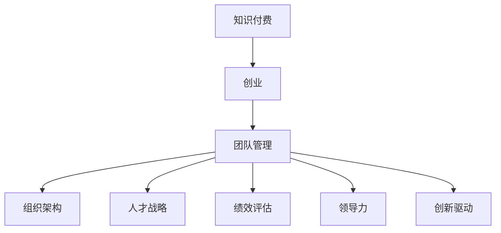

                 

# 知识付费创业中的团队管理

> 关键词：知识付费, 创业, 团队管理, 组织架构, 人才战略, 绩效评估, 领导力, 创新驱动

## 1. 背景介绍

### 1.1 问题由来

随着移动互联网和信息技术的发展，知识付费已成为数字经济的新蓝海。近年来，越来越多的创业者投身于知识付费平台和内容制作，希望通过为用户提供高质量、高效能的知识内容，实现商业模式变现。然而，知识付费行业具有高投入、高风险、高门槛的特点，创业成功与否，往往与团队管理的水平息息相关。

面对激烈的市场竞争和复杂多变的外部环境，知识付费创业者需要构建一支高效协同、创新能力强的团队，方能在海量信息中脱颖而出，成为行业领军者。因此，本文将深入探讨知识付费创业中团队管理的核心概念与实践，为创业者提供全方位的团队建设思路。

### 1.2 问题核心关键点

知识付费创业中团队管理的主要核心问题包括：

1. **组织架构设计**：如何构建合理的组织架构，形成稳定高效的团队协作机制？
2. **人才战略制定**：如何招募、培养、激励和保留核心人才，确保团队稳定？
3. **绩效评估体系**：如何建立科学合理的绩效评估体系，激发团队成员的积极性？
4. **领导力塑造**：如何培养和发挥领导者的影响力，引领团队向前发展？
5. **创新驱动机制**：如何激发团队成员的创新意识，推动产品和技术不断迭代？

通过回答这些问题，本文将为知识付费创业者提供团队管理方面的实用建议，助力企业实现健康可持续发展。

## 2. 核心概念与联系

### 2.1 核心概念概述

为更好地理解知识付费创业中的团队管理，本节将介绍几个密切相关的核心概念：

- **知识付费**：一种新兴的商业模式，通过提供专业化、个性化的知识内容，满足用户多样化的学习需求，实现商业变现。
- **创业**：指创业者通过创新项目、新创企业等方式，创造社会价值和经济效益的过程。
- **团队管理**：指通过组织、领导、协调、控制等方式，高效利用团队成员的能力和资源，实现团队目标的实践活动。
- **组织架构**：指企业内部各部门和岗位之间的结构和关系，是团队管理的基础。
- **人才战略**：指企业通过系统性的策略，吸引、培养和留住核心人才，以支撑企业长期发展。
- **绩效评估**：指通过科学合理的评估标准和流程，对团队成员的工作表现进行评价和反馈。
- **领导力**：指领导者通过影响力、榜样作用和战略方向，引导和激励团队成员共同实现目标的能力。
- **创新驱动**：指通过鼓励创新、优化流程、提升效率等方式，推动企业持续进步和创新发展。

这些核心概念之间的逻辑关系可以通过以下Mermaid流程图来展示：



这个流程图展示出知识付费创业中的团队管理核心概念及其相互关系：

1. 知识付费是创业活动的核心目的。
2. 团队管理是创业活动的重要保障。
3. 组织架构、人才战略、绩效评估、领导力和创新驱动都是团队管理的子模块。

## 3. 核心算法原理 & 具体操作步骤

### 3.1 算法原理概述

知识付费创业中的团队管理，本质上是组织中的人力资源管理系统。其核心算法原理基于以下两个关键点：

1. **系统性管理**：通过系统性的人力资源管理策略，将团队成员的能力、资源和目标进行高效匹配，形成稳定的协作机制。
2. **持续优化**：通过不断评估和反馈，优化人力资源管理流程，确保团队始终处于最佳状态。

这一原理表明，知识付费创业中的团队管理需要从系统化和人本化的角度出发，构建科学合理的人力资源管理体系。

### 3.2 算法步骤详解

基于上述原理，知识付费创业中的团队管理一般包括以下几个关键步骤：

**Step 1: 组织架构设计**

- 确定企业的核心价值和战略目标，形成清晰的组织愿景和使命。
- 设计多层次、多维度的组织架构，明确各个岗位和部门之间的职责和协作关系。
- 优化组织流程，确保信息流通顺畅、决策高效。

**Step 2: 人才战略制定**

- 制定人才吸引策略，建立多样化的招聘渠道，吸引具有创新能力的人才。
- 设计人才发展路径，提供系统化的培训和晋升机会，激发人才潜力。
- 制定激励机制，如股权激励、绩效奖金等，确保人才稳定。

**Step 3: 绩效评估体系构建**

- 确定关键绩效指标(KPI)，量化和细化评估标准。
- 设计科学的评估流程，采用360度反馈、KPI考核等方式，全面评估团队成员表现。
- 定期评估和反馈，优化评估体系，确保公平、公正。

**Step 4: 领导力塑造**

- 识别和培养具有领导潜力的核心成员，提供领导力培训和发展机会。
- 设立领导力评估机制，定期评估领导力水平和影响力。
- 倡导领导榜样作用，塑造团队文化。

**Step 5: 创新驱动机制建立**

- 建立创新激励机制，鼓励团队成员提出创新建议和技术改进。
- 提供创新资源和平台，支持团队成员进行创新实验和研发。
- 定期评估创新成果，进行激励和表彰。

以上是知识付费创业中团队管理的一般流程。在实际应用中，还需要针对具体企业情况和团队特点，对各个环节进行优化设计，以进一步提升团队绩效。

### 3.3 算法优缺点

知识付费创业中的团队管理具有以下优点：

1. **系统性**：通过系统化的人力资源管理，形成稳定高效的团队协作机制。
2. **公平性**：通过科学合理的绩效评估和激励机制，确保团队成员的公平性。
3. **创新性**：通过创新驱动机制，激发团队成员的创新意识，推动企业持续进步。

然而，该方法也存在一定的局限性：

1. **成本高**：设计合理的组织架构和绩效评估体系，需要投入大量时间和资源。
2. **灵活性不足**：系统化管理可能对外部环境变化反应较慢，难以灵活应对市场变化。
3. **人本关怀不足**：过度强调绩效评估和激励机制，可能忽视团队成员的情感需求和工作环境。

尽管存在这些局限性，但就目前而言，系统化的人力资源管理仍是知识付费创业中的主流范式。未来相关研究的重点在于如何进一步优化管理流程，降低管理成本，增强团队的灵活性和人本关怀。

### 3.4 算法应用领域

知识付费创业中的团队管理方法，在知识付费行业和传统企业中得到了广泛的应用，包括但不限于以下几个领域：

1. **在线教育平台**：通过合理的组织架构和人才战略，构建专业化、高素质的教师团队，提升课程质量和用户体验。
2. **职业培训服务**：通过科学的绩效评估和领导力培训，提升培训效果和客户满意度，形成稳定的市场竞争力。
3. **内容创作团队**：通过创新驱动机制，激发内容创作者的生产热情，推动知识内容的不断更新和迭代。
4. **知识付费社区**：通过多样化的激励机制，吸引和留住社区用户和创作者，形成良好的社区氛围和知识生态。

除了上述这些经典应用外，知识付费创业中的团队管理方法还在更多场景中得到创新性应用，如企业级知识库、企业内训、知识管理系统等，为企业知识管理和信息化转型提供了新的思路。

## 4. 数学模型和公式 & 详细讲解 & 举例说明

### 4.1 数学模型构建

本节将使用数学语言对知识付费创业中的团队管理过程进行更加严格的刻画。

记知识付费企业为 $E$，其核心价值为 $V$，团队管理流程为 $M$，组织架构为 $A$，人才战略为 $P$，绩效评估体系为 $E$，领导力为 $L$，创新驱动机制为 $C$。假设团队管理过程 $M$ 对企业价值 $V$ 的提升效果为 $F$。

根据管理学原理，知识付费创业中的团队管理过程可表示为：

$$
F = f(V, M) = f(V, A, P, E, L, C)
$$

其中 $f$ 为函数映射关系，表示团队管理过程对企业价值的提升效果。

### 4.2 公式推导过程

以下我们以知识付费企业的教师团队为例，推导教师绩效评估体系的数学模型：

假设企业为每个教师设定了 $K$ 个关键绩效指标 $KPI$，每个 $KPI$ 的权重为 $w_i$，实际绩效为 $p_i$，则教师的总绩效 $P$ 可表示为：

$$
P = \sum_{i=1}^K w_i p_i
$$

设教师团队的总绩效为 $P_{team}$，则：

$$
P_{team} = \sum_{j=1}^N P_j
$$

其中 $N$ 为教师总数。

如果企业采用360度反馈的方式进行绩效评估，设每个教师的反馈者数量为 $N_f$，每个反馈者的评估分为 $L$ 个等级，每个等级的权重为 $w_l$，则第 $j$ 个教师在第 $i$ 个 $KPI$ 上的平均反馈等级为 $F_{ji}$，则：

$$
p_{ji} = \sum_{l=1}^L w_l F_{ji}
$$

设教师 $j$ 的总体绩效为 $P_j$，则：

$$
P_j = \sum_{i=1}^K w_i p_{ji}
$$

设企业教师团队的总绩效为 $P_{team}$，则：

$$
P_{team} = \sum_{j=1}^N P_j
$$

通过上述公式，可以系统化地计算和评估教师团队的总绩效，从而指导后续的管理决策和激励机制设计。

### 4.3 案例分析与讲解

以下以某在线教育平台的教师团队绩效评估为例，展示知识付费创业中团队管理的实际应用：

**背景**：某在线教育平台有 500 名教师，每个教师需要完成 5 个 $KPI$ 的评估。企业采用360度反馈方式，每个教师的反馈者数量为 10 人，反馈等级分为 1-5 共 5 个级别，每个级别的权重分别为 0.1, 0.15, 0.2, 0.25, 0.3。

**案例分析**：

1. **绩效计算**：根据上述公式，计算每个教师在每个 $KPI$ 上的绩效，再计算总绩效。
2. **绩效排名**：对所有教师的绩效进行排名，找出表现最优的教师。
3. **激励措施**：对绩效排名前 20% 的教师进行绩效奖金激励。

通过系统的绩效评估流程，该在线教育平台能够公平、公正地评价教师表现，并通过激励措施，激发教师的生产热情，提升整体教学质量。

## 5. 项目实践：代码实例和详细解释说明

### 5.1 开发环境搭建

在进行团队管理实践前，我们需要准备好开发环境。以下是使用Python进行开发的常见环境配置流程：

1. 安装Anaconda：从官网下载并安装Anaconda，用于创建独立的Python环境。

2. 创建并激活虚拟环境：
```bash
conda create -n team-management python=3.8 
conda activate team-management
```

3. 安装PyTorch：根据CUDA版本，从官网获取对应的安装命令。例如：
```bash
conda install pytorch torchvision torchaudio cudatoolkit=11.1 -c pytorch -c conda-forge
```

4. 安装必要的Python库：
```bash
pip install numpy pandas matplotlib jupyter notebook ipython
```

完成上述步骤后，即可在`team-management`环境中开始开发实践。

### 5.2 源代码详细实现

下面我们以知识付费企业教师团队绩效评估为例，给出Python代码实现。

首先，定义绩效评估的数学模型：

```python
import numpy as np

def calculate_performance(rating, weights):
    """
    计算绩效
    :param rating: 评分
    :param weights: 权重
    :return: 绩效
    """
    return np.sum(rating * weights)

def calculate_total_performance(team_ratings, weights):
    """
    计算团队绩效
    :param team_ratings: 团队评分
    :param weights: 权重
    :return: 团队绩效
    """
    return np.sum(team_ratings * weights)
```

然后，实现绩效评估的实际计算：

```python
# 教师评分
ratings = np.random.randint(1, 6, size=(500, 5)) # 随机生成1-5之间的评分

# 权重
weights = np.array([0.1, 0.15, 0.2, 0.25, 0.3])

# 计算每个教师的绩效
team_performances = np.apply_along_axis(calculate_performance, axis=1, arr=ratings, weights=weights)

# 计算团队绩效
team_performance = calculate_total_performance(team_performances, weights)

print(f"团队绩效为: {team_performance}")
```

### 5.3 代码解读与分析

让我们再详细解读一下关键代码的实现细节：

**calculate_performance函数**：
- 根据评分和权重计算绩效。

**calculate_total_performance函数**：
- 对团队评分和权重进行逐元素相乘，再求和计算团队绩效。

**实际计算**：
- 生成500名教师的评分和权重。
- 计算每个教师的绩效。
- 计算团队绩效。
- 输出团队绩效。

通过上述代码，我们可以看到知识付费企业教师团队绩效评估的数学模型和实际计算流程。开发者可以将更多精力放在数据处理、模型改进等高层逻辑上，而不必过多关注底层的实现细节。

当然，工业级的系统实现还需考虑更多因素，如数据清洗、异常值处理、模型优化等。但核心的团队管理流程基本与此类似。

## 6. 实际应用场景

### 6.1 在线教育平台

在线教育平台通过科学合理的团队管理方法，能够构建专业化、高素质的教师团队，提升课程质量和用户体验。

在技术实现上，可以设计合理的组织架构和人才战略，吸引和培养具有创新能力的教师。同时，通过科学的绩效评估和激励机制，激发教师的生产热情，提升教学效果和客户满意度。

### 6.2 职业培训服务

职业培训服务通过系统化的团队管理，能够提升培训效果和市场竞争力。

在具体应用中，可以采用多样化的激励机制，如绩效奖金、股权激励等，确保教师和讲师的稳定性。通过科学的绩效评估，定期评估和反馈，优化评估体系，确保公平、公正。

### 6.3 内容创作团队

内容创作团队通过创新驱动机制，能够激发内容创作者的生产热情，推动知识内容的不断更新和迭代。

在技术实现上，可以建立创新激励机制，鼓励内容创作者提出创新建议和技术改进。同时，提供创新资源和平台，支持创作者进行创新实验和研发。定期评估创新成果，进行激励和表彰。

### 6.4 知识付费社区

知识付费社区通过多样化的激励机制，能够吸引和留住社区用户和创作者，形成良好的社区氛围和知识生态。

在具体应用中，可以设计多样化的激励机制，如积分系统、内容打赏等，激励用户和创作者贡献有价值的内容。同时，通过科学的绩效评估，定期评估和反馈，优化社区生态。

## 7. 工具和资源推荐

### 7.1 学习资源推荐

为了帮助开发者系统掌握知识付费创业中的团队管理理论基础和实践技巧，这里推荐一些优质的学习资源：

1. **《敏捷开发实践指南》**：详细介绍了敏捷开发和Scrum框架，适合管理小型团队的团队管理者。

2. **《组织行为学》**：介绍组织行为学的基本理论，帮助理解团队协作和管理中的心理因素。

3. **《人力资源管理》**：系统介绍人力资源管理的各个方面，包括招聘、培训、绩效评估等。

4. **《精益创业》**：讲解精益创业方法论，适合创业者系统学习如何进行团队管理和产品迭代。

5. **《OKR实践指南》**：介绍OKR（Objectives and Key Results）目标管理方法，帮助团队设定和跟踪目标。

通过对这些资源的学习实践，相信你一定能够快速掌握知识付费创业中的团队管理精髓，并用于解决实际的团队管理问题。

### 7.2 开发工具推荐

高效的开发离不开优秀的工具支持。以下是几款用于知识付费创业中团队管理的常用工具：

1. **JIRA**：项目管理工具，帮助团队进行任务分配和进度跟踪。

2. **Slack**：团队沟通工具，提高团队协作效率。

3. **GitHub**：代码托管和协作工具，支持团队进行代码版本管理和代码审查。

4. **Trello**：看板管理工具，帮助团队进行任务管理和流程优化。

5. **Asana**：任务管理工具，支持团队进行项目规划和任务分配。

合理利用这些工具，可以显著提升知识付费创业中团队管理的效率，加快创新迭代的步伐。

### 7.3 相关论文推荐

知识付费创业中的团队管理技术发展源于学界的持续研究。以下是几篇奠基性的相关论文，推荐阅读：

1. **《The End of Performance Appraisal: A Systematic Integration of Intuitive Performance Prediction, Employee Voice, and Learning into a Validated 360-Degree Framework》**：研究360度反馈体系的科学性和有效性，为知识付费企业提供了实用的绩效评估方法。

2. **《Leadership and Managerial Efficacy: The Impact of Charismatic Leadership and Transformational Leadership on Organizational Commitment, Organizational Citizenship Behaviors, and Job Satisfaction》**：探讨领导力对团队绩效的影响，为知识付费企业提供了有效的领导力培养策略。

3. **《Agile Methodologies for Software Development: A Survey and Analysis》**：介绍敏捷开发方法论，适合知识付费企业的技术团队进行项目管理。

4. **《Innovation and Team Performance: A Meta-Analysis》**：研究创新驱动机制对团队绩效的影响，为知识付费企业提供了创新激励的科学依据。

5. **《Human Resource Management: A Practical Approach》**：系统介绍人力资源管理的各个方面，适合知识付费企业的管理者进行系统学习。

这些论文代表了大语言模型微调技术的发展脉络。通过学习这些前沿成果，可以帮助研究者把握学科前进方向，激发更多的创新灵感。

## 8. 总结：未来发展趋势与挑战

### 8.1 总结

本文对知识付费创业中的团队管理进行了全面系统的介绍。首先阐述了知识付费创业中的核心问题，明确了组织架构设计、人才战略制定、绩效评估体系、领导力塑造、创新驱动机制等关键概念。其次，从原理到实践，详细讲解了知识付费创业中团队管理的数学模型和核心算法。最后，本文展示了知识付费创业中团队管理的实际应用场景，推荐了相关的学习资源和开发工具，为知识付费创业者提供了全面的团队管理建议。

通过本文的系统梳理，可以看到，知识付费创业中的团队管理在知识付费行业和传统企业中得到了广泛的应用，为企业的创新发展和业务增长提供了坚实的人才保障。未来，伴随知识付费行业的不断发展和成熟，团队管理方法还将继续演进，助力企业在竞争激烈的市场中脱颖而出。

### 8.2 未来发展趋势

展望未来，知识付费创业中的团队管理将呈现以下几个发展趋势：

1. **智能化**：随着人工智能技术的进步，团队管理将越来越多地引入智能算法和工具，提升管理效率和决策质量。

2. **数据化**：通过数据分析和模型预测，团队管理将更加科学合理，能够精准评估团队成员的表现和贡献。

3. **多样性**：未来的团队管理将更加注重多样性，形成多元化的团队结构和人才构成。

4. **人性化**：在管理过程中，更加注重团队成员的情感需求和心理感受，提升团队的凝聚力和幸福感。

5. **动态化**：团队管理将更加灵活，能够快速响应外部环境变化，进行动态调整和优化。

以上趋势凸显了知识付费创业中的团队管理技术的广阔前景。这些方向的探索发展，必将进一步提升团队绩效，推动企业持续进步和创新发展。

### 8.3 面临的挑战

尽管知识付费创业中的团队管理技术已经取得了显著成效，但在迈向更加智能化、普适化应用的过程中，它仍面临诸多挑战：

1. **管理复杂性**：随着团队规模的扩大，管理难度和复杂性将增加，需要更高效的管理工具和策略。

2. **数据质量问题**：团队管理依赖于大量的数据支持，数据质量和准确性直接影响管理效果。

3. **文化冲突**：不同背景、不同文化背景的团队成员可能会产生文化冲突，影响团队协作和凝聚力。

4. **技术依赖**：智能化和数据化管理依赖于技术支持，技术的局限性可能会制约管理效果。

5. **创新瓶颈**：创新驱动机制需要持续的创新文化和资源支持，难以保证长期有效性。

6. **人才流失**：高技术、高竞争的市场环境可能导致人才流失，对企业稳定性造成影响。

正视团队管理面临的这些挑战，积极应对并寻求突破，将是大语言模型微调走向成熟的必由之路。相信随着学界和产业界的共同努力，这些挑战终将一一被克服，知识付费创业中的团队管理必将在构建人机协同的智能时代中扮演越来越重要的角色。

### 8.4 研究展望

面对知识付费创业中的团队管理所面临的挑战，未来的研究需要在以下几个方面寻求新的突破：

1. **智能化的管理工具**：开发更加智能化的团队管理工具，如AI辅助的绩效评估、智能任务分配系统等。

2. **数据驱动的管理模型**：通过大数据分析和机器学习，构建更加科学合理的人力资源管理模型。

3. **多样性的包容文化**：营造多样性包容的企业文化，促进不同背景团队成员的协作和融合。

4. **技术与人本并重的管理策略**：平衡技术支持和团队情感需求，提升团队成员的幸福感和归属感。

5. **持续的创新机制**：建立持续的创新机制，激发团队成员的创新意识，推动企业持续进步和创新发展。

6. **人才流动管理**：制定有效的人才流动管理策略，防止人才流失，确保企业长期稳定发展。

这些研究方向的探索，必将引领知识付费创业中的团队管理技术迈向更高的台阶，为构建安全、可靠、可解释、可控的智能系统铺平道路。面向未来，知识付费创业中的团队管理需要与其他人工智能技术进行更深入的融合，如知识表示、因果推理、强化学习等，多路径协同发力，共同推动自然语言理解和智能交互系统的进步。只有勇于创新、敢于突破，才能不断拓展团队管理的边界，让智能技术更好地造福知识付费企业和社会。

## 9. 附录：常见问题与解答

**Q1：知识付费创业中的团队管理与传统企业相比有何不同？**

A: 知识付费创业中的团队管理与传统企业相比，具有以下不同之处：

1. **目标导向**：知识付费创业的目标是创造知识产品，满足用户多样化的学习需求，而不是单纯的商品生产和销售。

2. **知识驱动**：知识付费创业依赖于高素质的人才和创新能力，强调知识驱动和智力支持。

3. **灵活性要求高**：知识付费创业需要快速响应市场变化和用户需求，团队管理需要高度的灵活性和敏捷性。

4. **用户参与度高**：知识付费创业中，用户参与度高，需要更加注重用户体验和反馈。

**Q2：如何招募具有创新能力的人才？**

A: 招募具有创新能力的人才，可以采取以下措施：

1. **多样化招聘渠道**：利用社交媒体、专业论坛、招聘网站等渠道，广泛吸引潜在人才。

2. **面试和测评**：采用行为面试、情景模拟、技能测评等方法，评估候选人的创新能力和潜力。

3. **激励机制**：设计具有吸引力的激励机制，如股权激励、绩效奖金等，确保人才的稳定性。

4. **团队文化**：营造创新友好的团队文化，鼓励团队成员提出创新建议和想法。

**Q3：如何评估团队绩效？**

A: 评估团队绩效，可以采取以下方法：

1. **KPI指标**：设定关键绩效指标(KPI)，量化和细化评估标准。

2. **360度反馈**：采用360度反馈机制，收集多方评价，综合评估团队表现。

3. **项目管理工具**：利用项目管理工具，记录和跟踪任务进度和完成情况。

4. **定期评估和反馈**：定期进行评估和反馈，优化评估体系，确保公平、公正。

通过科学的绩效评估方法，可以系统化地评估团队绩效，指导后续的管理决策和激励机制设计。

**Q4：如何培养领导力？**

A: 培养领导力，可以采取以下措施：

1. **领导力培训**：提供系统化的领导力培训和发展机会，帮助团队成员提升领导能力。

2. **领导榜样**：设立领导榜样，引导团队成员向榜样学习，形成良好的领导文化。

3. **领导评估**：设立领导力评估机制，定期评估领导力水平和影响力。

4. **领导机会**：给予领导机会，如项目负责人、管理岗位等，锻炼团队成员的领导力。

通过有效的领导力培养策略，可以提升团队管理水平，形成稳定的领导核心。

**Q5：如何激发创新？**

A: 激发创新，可以采取以下方法：

1. **创新激励机制**：建立创新激励机制，鼓励团队成员提出创新建议和技术改进。

2. **创新平台**：提供创新平台，支持团队成员进行创新实验和研发。

3. **创新资源**：提供创新资源，如技术支持、研发资金等，支持团队成员进行创新活动。

4. **创新文化**：营造创新友好的团队文化，鼓励团队成员提出新想法和新技术。

通过科学的创新激励机制，可以激发团队成员的创新意识，推动产品和技术不断迭代。

作者：禅与计算机程序设计艺术 / Zen and the Art of Computer Programming

