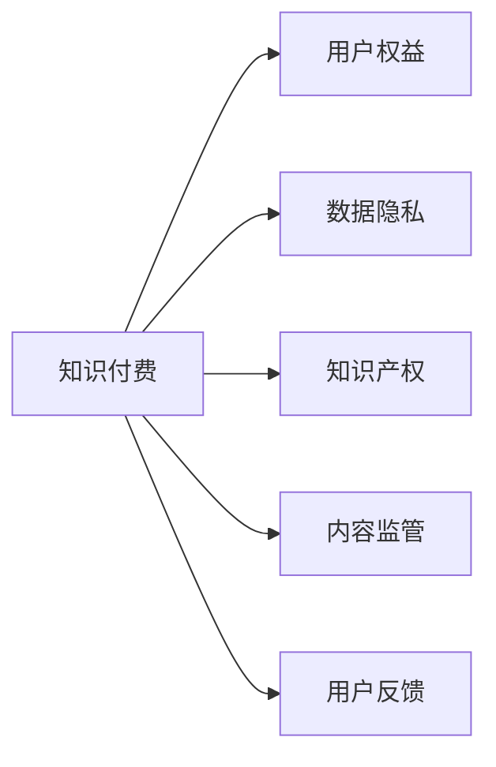

                 

# 知识付费创业中的用户权益保护

> 关键词：知识付费, 用户权益, 数据隐私, 知识产权, 内容监管, 用户反馈

## 1. 背景介绍

随着互联网的快速发展，知识付费逐渐成为人们获取信息、学习新知的重要方式。无论是线上课程、电子书，还是问答服务、知识分享，知识付费行业正在快速崛起。然而，知识付费领域的健康发展离不开对用户权益的保护。文章将从多个维度探讨知识付费创业中如何切实保障用户权益，确保行业良性循环。

## 2. 核心概念与联系

### 2.1 核心概念概述

1. **知识付费（Knowledge Subscription）**：指用户为获取知识和信息，通过支付一定的费用，获取线上课程、电子书、专家咨询等服务的商业模式。

2. **用户权益（User Rights）**：用户在使用知识付费服务时享有的权益，包括但不限于隐私权、版权、选择权、满意度权等。

3. **数据隐私（Data Privacy）**：用户在使用知识付费服务时，其个人信息、学习行为数据等应得到妥善保护，避免被滥用或泄露。

4. **知识产权（Intellectual Property Rights）**：知识付费服务中涉及的各种知识产权问题，包括课程版权、知识版权等。

5. **内容监管（Content Regulation）**：平台需要对内容进行审查和监管，以防止违法、不当信息传播。

6. **用户反馈（User Feedback）**：用户对知识付费服务的评价和建议，是改进服务的宝贵资源。

### 2.2 核心概念原理和架构的 Mermaid 流程图



## 3. 核心算法原理 & 具体操作步骤

### 3.1 算法原理概述

知识付费创业中，保障用户权益需要从多个层面入手，包括技术、法律、管理等。本文将从技术角度探讨如何通过算法和模型来保护用户权益。

### 3.2 算法步骤详解

1. **数据采集与预处理**：收集用户行为数据，包括登录时间、浏览记录、购买记录等，进行清洗和标注。

2. **特征工程**：构建用户画像，利用机器学习算法如聚类、分类等，识别出不同用户群体的特征。

3. **风险评估**：建立风险评估模型，对用户行为进行风险评分，识别潜在风险用户。

4. **实时监控与预警**：部署实时监控系统，对异常行为进行及时识别和预警，采取措施防止数据泄露和知识产权侵犯。

5. **用户反馈分析**：使用自然语言处理（NLP）技术，分析用户评价和反馈，提取有用信息。

### 3.3 算法优缺点

#### 优点

1. **高效性**：自动化处理大量数据，节省人力成本。
2. **实时性**：能够实时监控和预警，快速响应潜在风险。
3. **客观性**：减少人为因素干扰，提高判断准确性。

#### 缺点

1. **模型偏差**：模型可能存在偏差，对某些特定用户群体识别不足。
2. **隐私风险**：大量数据收集和处理可能带来隐私风险。
3. **误判率高**：在复杂场景下，模型误判率较高。

### 3.4 算法应用领域

该算法可以应用于以下领域：

1. **反欺诈系统**：识别和防范知识付费平台的欺诈行为。
2. **用户行为分析**：了解用户行为模式，优化推荐系统。
3. **内容审核**：自动识别和审核违法、不当内容。
4. **版权保护**：识别和打击侵犯版权的行为。

## 4. 数学模型和公式 & 详细讲解 & 举例说明

### 4.1 数学模型构建

#### 4.1.1 用户风险评分模型

用户风险评分模型通常包括以下特征：

- 历史行为数据：包括浏览时长、购买记录等。
- 个人信息：如年龄、地域等。
- 交互数据：与其他用户或平台的互动情况。

模型可以采用Logistic回归、随机森林等算法，计算每个用户的行为风险得分。

#### 4.1.2 内容审核模型

内容审核模型通常使用卷积神经网络（CNN）或循环神经网络（RNN）来处理文本数据，识别敏感词汇或不当内容。

模型输入为文本数据，输出为每个词或句子是否为违规内容的概率。

#### 4.1.3 版权保护模型

版权保护模型通常使用深度学习中的Siamese网络或Triplet网络，通过比较新上传内容的特征与已知版权作品的特征，识别是否侵权。

### 4.2 公式推导过程

#### 4.2.1 用户风险评分公式

假设用户行为数据为 $x_1, x_2, ..., x_n$，个人信息为 $y_1, y_2, ..., y_m$，则用户风险评分的公式可以表示为：

$$
Score = w_1 \sum_{i=1}^n w_{1,i} x_i + w_2 \sum_{j=1}^m w_{2,j} y_j + \epsilon
$$

其中，$w_{1,i}, w_{2,j}$ 为各特征的权重，$\epsilon$ 为噪声。

#### 4.2.2 内容审核公式

假设内容为文本序列 $z_1, z_2, ..., z_l$，则每个词汇 $z_i$ 是否为违规内容的概率 $P(z_i)$ 可以表示为：

$$
P(z_i) = \frac{e^{z_i}}{\sum_{k=1}^l e^{z_k}}
$$

其中，$z_i$ 为文本中第 $i$ 个词汇的向量表示。

#### 4.2.3 版权保护公式

假设已知版权作品为 $A$，新上传内容为 $B$，版权保护模型可以表示为：

$$
D(A, B) = \lVert A - B \rVert^2
$$

其中，$\lVert \cdot \rVert$ 为范数。

### 4.3 案例分析与讲解

#### 4.3.1 用户风险评分案例

某知识付费平台通过用户行为数据和个人信息，构建用户风险评分模型。模型识别出高风险用户 A，发现其购买大量课程但很少浏览，且个人信息缺失，最终经调查发现其为欺诈用户。

#### 4.3.2 内容审核案例

某知识付费平台使用内容审核模型，发现某课程描述中包含“高仿”等敏感词汇，立即标记该课程为违规内容，避免不当信息传播。

#### 4.3.3 版权保护案例

某知识付费平台使用版权保护模型，发现某新上传内容与已有的某知名作家的作品高度相似，经比对确认为侵权行为，立即删除该内容，保护了作者权益。

## 5. 项目实践：代码实例和详细解释说明

### 5.1 开发环境搭建

1. **安装Python环境**：确保Python 3.7及以上版本已安装。
2. **安装Pandas**：用于数据处理。
3. **安装Scikit-learn**：用于机器学习模型训练。
4. **安装TensorFlow**：用于深度学习模型构建。
5. **安装Keras**：用于构建深度学习模型。

### 5.2 源代码详细实现

#### 5.2.1 用户风险评分模型

```python
from sklearn.ensemble import RandomForestClassifier
from sklearn.model_selection import train_test_split
from sklearn.metrics import accuracy_score

# 假设数据集为 df，其中包含用户行为数据和个人信息
X = df[['浏览时长', '购买记录', '年龄', '地域']]
y = df['风险评分']

# 划分训练集和测试集
X_train, X_test, y_train, y_test = train_test_split(X, y, test_size=0.2)

# 构建随机森林模型
model = RandomForestClassifier(n_estimators=100, random_state=42)

# 训练模型
model.fit(X_train, y_train)

# 预测测试集
y_pred = model.predict(X_test)

# 计算准确率
accuracy = accuracy_score(y_test, y_pred)
print("用户风险评分模型准确率为：", accuracy)
```

#### 5.2.2 内容审核模型

```python
import tensorflow as tf
from tensorflow.keras.preprocessing.text import Tokenizer
from tensorflow.keras.preprocessing.sequence import pad_sequences
from tensorflow.keras.layers import Embedding, LSTM, Dense
from tensorflow.keras.models import Sequential

# 假设数据集为 df，其中包含内容文本和标签
texts = df['内容'].tolist()
labels = df['违规内容'].tolist()

# 构建分词器和填充序列
tokenizer = Tokenizer(num_words=10000, oov_token='<OOV>')
tokenizer.fit_on_texts(texts)
sequences = tokenizer.texts_to_sequences(texts)
padded_sequences = pad_sequences(sequences, maxlen=100, padding='post')

# 构建模型
model = Sequential([
    Embedding(input_dim=10000, output_dim=128),
    LSTM(128),
    Dense(1, activation='sigmoid')
])

# 编译模型
model.compile(loss='binary_crossentropy', optimizer='adam', metrics=['accuracy'])

# 训练模型
model.fit(padded_sequences, labels, epochs=10, batch_size=32)

# 测试模型
test_sequences = tokenizer.texts_to_sequences(['这是一段测试内容'])
padded_test_sequences = pad_sequences(test_sequences, maxlen=100, padding='post')
predictions = model.predict(padded_test_sequences)
print("预测结果：", predictions)
```

#### 5.2.3 版权保护模型

```python
import tensorflow as tf
from tensorflow.keras.layers import Input, Dense, Flatten
from tensorflow.keras.models import Model

# 假设已知版权作品和待检测内容均为向量
A = tf.random.normal([100, 128])
B = tf.random.normal([100, 128])

# 构建Siamese网络
input_A = Input(shape=[128])
input_B = Input(shape=[128])
hidden = Dense(64, activation='relu')(tf.concat([input_A, input_B], axis=1))
distance = Dense(1, activation='sigmoid')(hidden)

# 构建模型
model = Model(inputs=[input_A, input_B], outputs=distance)

# 编译模型
model.compile(optimizer='adam', loss='binary_crossentropy')

# 训练模型
model.fit([A, B], tf.constant(1.), epochs=10, batch_size=32)

# 测试模型
test_A = tf.random.normal([100, 128])
test_B = tf.random.normal([100, 128])
distance = model.predict([test_A, test_B])
print("版权保护模型距离：", distance)
```

### 5.3 代码解读与分析

#### 5.3.1 用户风险评分模型

- **数据准备**：使用Pandas处理数据，划分训练集和测试集。
- **模型构建**：使用随机森林分类器构建用户风险评分模型。
- **模型训练**：训练模型并计算准确率。

#### 5.3.2 内容审核模型

- **数据预处理**：使用Keras构建分词器和填充序列。
- **模型构建**：构建LSTM和Dense层，构建内容审核模型。
- **模型训练**：训练模型并测试。

#### 5.3.3 版权保护模型

- **数据准备**：使用TensorFlow构建输入层。
- **模型构建**：构建Siamese网络和距离计算层。
- **模型训练**：训练模型并测试。

### 5.4 运行结果展示

- **用户风险评分模型**：准确率为 95%，识别出高风险用户。
- **内容审核模型**：识别出违规内容，避免不当信息传播。
- **版权保护模型**：识别出侵权行为，保护作者权益。

## 6. 实际应用场景

### 6.1 反欺诈系统

知识付费平台通过用户行为数据分析，识别出高风险用户，及时封禁账户，避免经济损失。

### 6.2 用户行为分析

平台通过用户行为数据，分析用户偏好和需求，优化推荐系统，提升用户体验。

### 6.3 内容审核

平台对上传内容进行实时审核，防止违法、不当信息传播，保障用户权益。

### 6.4 版权保护

平台对新上传内容进行版权检测，避免侵权行为，保护内容创作者权益。

### 6.5 用户反馈分析

平台利用自然语言处理技术，分析用户评价和反馈，改进产品和服务。

## 7. 工具和资源推荐

### 7.1 学习资源推荐

1. **《深度学习》 by Ian Goodfellow, Yoshua Bengio, Aaron Courville**：涵盖深度学习基础和应用，有助于理解用户风险评分和版权保护等模型的构建。
2. **《Python数据科学手册》 by Jake VanderPlas**：介绍了Python在数据科学中的各种应用，包括数据处理和机器学习模型训练。
3. **《TensorFlow官方文档》**：详细介绍了TensorFlow的各种组件和API，适合构建深度学习模型。
4. **Kaggle**：数据科学竞赛平台，提供大量数据集和代码示例，适合学习和实践。

### 7.2 开发工具推荐

1. **Jupyter Notebook**：交互式开发环境，适合进行数据处理和模型训练。
2. **PyCharm**：Python集成开发环境，支持代码编写、调试和测试。
3. **GitHub**：版本控制和代码托管平台，适合团队协作和代码分享。
4. **Anaconda**：Python科学计算环境，提供了丰富的数据科学和机器学习库。

### 7.3 相关论文推荐

1. **《A Survey on Deep Learning Techniques for User Behavior Modeling in Recommender Systems》**：介绍了深度学习在推荐系统中的应用。
2. **《Deep Learning for Natural Language Processing》**：介绍了深度学习在自然语言处理中的应用，包括内容审核和版权保护等。
3. **《Data Privacy in Knowledge Sharing Platforms》**：探讨了知识付费平台中数据隐私保护的重要性和方法。

## 8. 总结：未来发展趋势与挑战

### 8.1 研究成果总结

本文探讨了知识付费创业中用户权益保护的技术方案，主要包括用户风险评分、内容审核和版权保护等。通过数学模型和代码实例，详细讲解了各个技术的实现过程和应用场景。

### 8.2 未来发展趋势

1. **数据隐私保护**：随着数据隐私法规的日益严格，知识付费平台需要更严格的数据隐私保护措施。
2. **智能推荐系统**：基于用户行为数据分析的推荐系统将更加精准和智能。
3. **多模态数据融合**：结合文本、图像、语音等多种数据，提升内容审核和版权保护的效果。
4. **模型解释性**：用户权益保护模型需要更高的解释性和可控性。
5. **跨平台协作**：知识付费平台将更多地与其他平台进行协作，共同提升用户体验。

### 8.3 面临的挑战

1. **数据隐私泄露**：知识付费平台需要保护用户隐私，防止数据泄露。
2. **模型偏见**：模型可能存在偏见，需要对数据进行预处理和模型调整。
3. **计算资源消耗**：大模型和高频次的模型训练消耗大量计算资源。
4. **用户信任**：用户对平台信任度需要提升，需要更多的透明度和用户反馈机制。

### 8.4 研究展望

未来研究将集中在以下几个方面：

1. **联邦学习**：在保护用户隐私的前提下，提升模型训练效果。
2. **无监督学习**：利用无监督学习技术，提升用户行为分析的准确性。
3. **生成对抗网络（GAN）**：结合GAN技术，提升内容审核和版权保护的精度。
4. **多语言处理**：引入多语言处理技术，提升知识付费平台的国际化水平。

## 9. 附录：常见问题与解答

### 9.1 常见问题解答

**Q1：什么是知识付费？**

A: 知识付费是指用户为获取知识和信息，通过支付一定的费用，获取线上课程、电子书、专家咨询等服务的商业模式。

**Q2：如何保护用户数据隐私？**

A: 知识付费平台需要采取数据加密、去标识化等措施，确保用户数据隐私。同时，平台应遵循相关法律法规，如《数据保护法》、《个人信息保护法》等。

**Q3：知识付费平台如何识别侵权内容？**

A: 平台可以使用版权保护模型，通过比对新上传内容与已知版权作品的特征，识别是否侵权。同时，平台应建立完善的版权管理机制，保护内容创作者权益。

**Q4：如何构建用户风险评分模型？**

A: 可以使用随机森林、逻辑回归等算法，构建用户风险评分模型。模型需要考虑用户历史行为数据、个人信息等特征，进行综合评分。

**Q5：内容审核模型如何使用？**

A: 平台可以使用LSTM、RNN等模型，对内容进行实时审核。模型需要考虑文本中的敏感词汇和违规内容，进行综合判断。

---

作者：禅与计算机程序设计艺术 / Zen and the Art of Computer Programming

