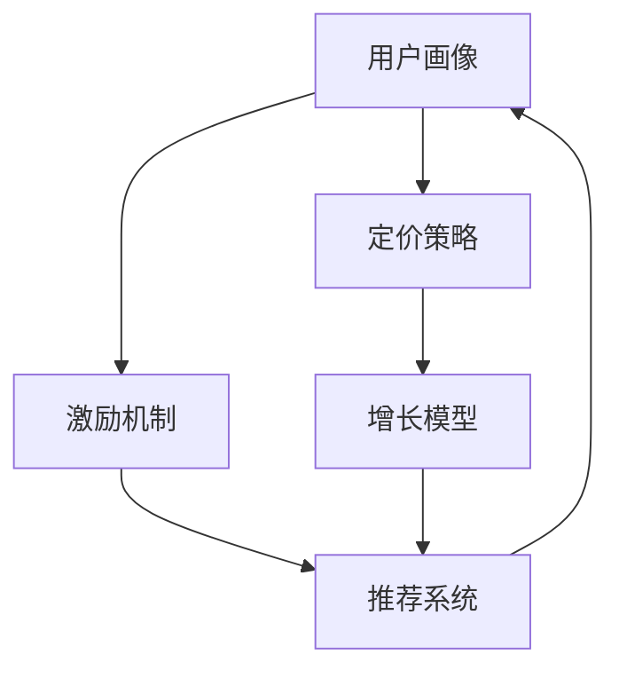

                 

# 知识付费创业中的用户激活策略

> 关键词：知识付费、用户激活、用户行为分析、激励机制、推荐系统、增长模型、A/B测试

## 1. 背景介绍

### 1.1 问题由来
在知识付费领域，获取用户的注意力并让他们持续付费是平台实现商业价值的关键。然而，用户在初始接触知识付费服务时，往往面临内容质量、付费门槛、体验舒适度等多个挑战。如何通过精准的用户激活策略，有效解决这些问题，提高用户的转化率和留存率，成为知识付费创业的难题。

### 1.2 问题核心关键点
用户激活策略的核心在于理解用户需求、优化用户体验、提升用户满意度。具体包括：
- 精准的用户画像：构建基于用户行为和偏好的用户画像，制定个性化推荐策略。
- 有效的激励机制：设计有吸引力的激励机制，鼓励用户参与互动和付费。
- 合理的定价策略：根据用户价值和市场定位，设置合理的付费门槛。
- 多渠道触达：利用社交媒体、内容分发平台等多渠道触达用户，提高曝光率。
- 持续优化产品：通过数据驱动的用户行为分析，不断迭代优化产品和服务。

### 1.3 问题研究意义
通过科学的用户激活策略，可以有效降低知识付费平台的获客成本，提高用户黏性，增加营收和品牌影响力。具体来说，通过精准的目标用户画像和个性化推荐，可以提高平台内容的相关性和吸引力，从而吸引更多的用户付费。此外，通过合理的激励机制和定价策略，可以增加用户对平台的信任度和满意度，促成更多付费行为。多渠道触达和持续的产品优化，则可以在竞争激烈的市场环境中保持平台的竞争优势，提升用户整体满意度。

## 2. 核心概念与联系

### 2.1 核心概念概述

为更好地理解用户激活策略，本节将介绍几个密切相关的核心概念：

- **用户画像(User Persona)**：基于用户行为、兴趣、偏好等数据构建的虚拟用户模型，用于个性化推荐和营销。
- **激励机制(Incentive Mechanism)**：设计有吸引力的奖励和惩罚机制，引导用户采取期望的行为，如付费、评论、分享等。
- **定价策略(Pricing Strategy)**：根据用户价值和市场定位，设定合适的付费门槛和价格，以吸引潜在用户并保障收益。
- **推荐系统(Recommendation System)**：根据用户行为和偏好，推荐最相关的课程和内容，提升用户体验。
- **增长模型(Growth Model)**：通过对用户生命周期的数据分析，制定科学的用户增长策略，提高用户转化率和留存率。

这些核心概念之间的逻辑关系可以通过以下Mermaid流程图来展示：



这个流程图展示了大语言模型的核心概念及其之间的关系：

1. 用户画像通过用户行为数据获得。
2. 激励机制引导用户采取期望的行为。
3. 定价策略设置付费门槛。
4. 推荐系统基于用户画像和行为，推荐内容。
5. 增长模型根据用户生命周期，制定增长策略。

这些概念共同构成了知识付费平台的用户激活框架，通过数据驱动的方式，持续优化用户体验，提升平台价值。

## 3. 核心算法原理 & 具体操作步骤
### 3.1 算法原理概述

用户激活策略的本质是通过数据分析和算法优化，精准触达用户，提升用户体验和满意度。其核心算法包括以下几个方面：

- **用户行为分析**：通过对用户行为数据的统计和分析，识别出用户的兴趣和偏好，构建用户画像。
- **个性化推荐算法**：根据用户画像，为用户推荐最相关的课程和内容，提升用户满意度和黏性。
- **用户反馈系统**：建立用户反馈机制，收集用户对课程和平台的意见和建议，用于迭代优化产品。
- **激励机制设计**：设计有吸引力的激励机制，如积分、优惠券、限时优惠等，促进用户付费和互动。
- **定价模型**：根据用户价值和市场定位，设定合理的付费门槛和价格，以吸引更多用户。

### 3.2 算法步骤详解

用户激活策略的实施主要包括以下关键步骤：

**Step 1: 数据收集与预处理**
- 收集用户在平台上的行为数据，包括浏览课程、订阅课程、评论、分享等行为。
- 对数据进行预处理，如去重、标准化、数据清洗等。

**Step 2: 用户画像构建**
- 通过机器学习和统计分析，构建用户画像，包括用户的兴趣、偏好、购买行为等。
- 可以使用聚类算法、关联规则挖掘等方法，构建用户细分群体。

**Step 3: 个性化推荐系统**
- 基于用户画像，设计推荐模型，如协同过滤、基于内容的推荐、深度学习等。
- 对推荐模型进行训练和评估，优化推荐算法。

**Step 4: 激励机制设计**
- 设计有吸引力的激励机制，如积分、优惠券、限时优惠等，以促进用户付费和互动。
- 使用A/B测试等方法，验证激励机制的效果，进行迭代优化。

**Step 5: 定价策略**
- 根据用户价值和市场定位，设定合理的付费门槛和价格。
- 使用数据驱动的方法，不断优化定价策略，提高用户转化率和留存率。

**Step 6: 增长模型**
- 分析用户生命周期，构建用户留存和转化的增长模型。
- 使用预测算法和优化模型，制定科学的用户增长策略。

### 3.3 算法优缺点

用户激活策略的优点包括：
1. 提升用户满意度：通过个性化推荐和激励机制，提升用户对平台的满意度和黏性。
2. 优化用户转化：通过合理的定价策略和增长模型，提高用户转化率和留存率。
3. 降低获客成本：通过精准触达和个性化营销，降低平台的获客成本。

其缺点包括：
1. 数据需求量大：需要大量用户行为数据，对数据收集和处理能力要求高。
2. 算法复杂度高：个性化推荐和增长模型等算法复杂，需要高水平的技术支持。
3. 效果难以量化：用户激活效果难以通过单一指标衡量，需要多维度综合评估。

尽管存在这些缺点，但用户激活策略在知识付费领域仍具有重要意义。通过科学的用户激活策略，可以显著提升平台的用户体验和满意度，带来可观的商业价值。

### 3.4 算法应用领域

用户激活策略在知识付费领域的应用广泛，包括：
- **课程推荐**：根据用户行为和偏好，推荐最相关的课程，提高用户选择课程的精准度。
- **内容排序**：对课程、文章等内容的排序进行优化，提升用户浏览体验。
- **个性化营销**：通过精准的用户画像和激励机制，实现个性化广告投放，提高转化率。
- **用户留存**：分析用户流失原因，优化产品和服务，提高用户留存率。

## 4. 数学模型和公式 & 详细讲解 & 举例说明
### 4.1 数学模型构建

用户激活策略的数学模型主要基于以下假设：
- 用户行为是离散化的，可以用多项式表示。
- 用户对不同课程的评分服从高斯分布。
- 用户流失的概率与用户评分和活跃度有关。

假设用户对课程 $i$ 的评分向量为 $\vec{v}_i=(v_{i1}, v_{i2}, ..., v_{im})$，用户对课程 $i$ 的评分矩阵为 $R_{m\times n}$，其中 $m$ 为课程数量，$n$ 为用户数量。设 $\vec{\mu}_i$ 为课程 $i$ 的评分均值向量，$\sigma^2$ 为评分方差，$P$ 为激活概率矩阵。则用户激活的概率模型为：

$$
P_{ij}=\frac{e^{\beta_0+\beta_1 \vec{v}_i^T\vec{\mu}_j+\beta_2 \sigma^2}}{\sum_{k=1}^n e^{\beta_0+\beta_1 \vec{v}_i^T\vec{\mu}_k+\beta_2 \sigma^2}}
$$

其中 $\beta_0, \beta_1, \beta_2$ 为模型参数，$e$ 为自然常数，$logit$ 函数为对数几率函数。

### 4.2 公式推导过程

用户激活的概率模型可以通过以下步骤推导：

**Step 1: 构建评分矩阵**
- 假设用户 $j$ 对课程 $i$ 的评分服从高斯分布，即 $\vec{v}_i \sim N(\vec{\mu}_i, \sigma^2I)$。
- 则用户 $j$ 对课程 $i$ 的评分概率密度函数为：
$$
f_{ij}(\vec{v}_i|\vec{\mu}_i, \sigma^2) = \frac{1}{\sqrt{(2\pi)^m\sigma^2}}exp\left(-\frac{(\vec{v}_i-\vec{\mu}_i)^T(\vec{v}_i-\vec{\mu}_i)}{2\sigma^2}\right)
$$

**Step 2: 计算激活概率**
- 设用户 $j$ 激活的条件概率为 $P_{ij}$。
- 使用对数几率模型进行建模，设激活概率为 $P_{ij}=\frac{e^{\beta_0+\beta_1 \vec{v}_i^T\vec{\mu}_j+\beta_2 \sigma^2}}{\sum_{k=1}^n e^{\beta_0+\beta_1 \vec{v}_i^T\vec{\mu}_k+\beta_2 \sigma^2}}$。
- 使用最大似然估计法估计模型参数。

**Step 3: 优化模型**
- 使用梯度下降等优化算法，最小化激活概率模型的损失函数。
- 调整模型参数 $\beta_0, \beta_1, \beta_2$，优化激活概率模型。

### 4.3 案例分析与讲解

以某知识付费平台的课程推荐系统为例，假设平台有100门课程，每个用户对课程的评分向量为 $(4, 3, 5, ..., 1)$。课程激活的概率模型为 $P_{ij}=\frac{e^{4.0+2.5\times4+1.0\times3}}{\sum_{k=1}^n e^{4.0+2.5\timesk+1.0\timesj}}$。假设 $j=5$，则用户激活的条件概率为：

$$
P_{05}=\frac{e^{4.0+2.5\times4+1.0\times3}}{e^{4.0+2.5\times5+1.0\times6}+e^{4.0+2.5\times6+1.0\times7}+...+e^{4.0+2.5\times100+1.0\times101}}
$$

通过优化模型参数和预测激活概率，可以为用户推荐最相关的课程，提升用户满意度。

## 5. 项目实践：代码实例和详细解释说明
### 5.1 开发环境搭建

在进行用户激活策略的开发和实验前，我们需要准备好开发环境。以下是使用Python进行Pandas和Scikit-learn开发的开发环境配置流程：

1. 安装Anaconda：从官网下载并安装Anaconda，用于创建独立的Python环境。

2. 创建并激活虚拟环境：
```bash
conda create -n pyproject python=3.7
conda activate pyproject
```

3. 安装Pandas和Scikit-learn：
```bash
pip install pandas scikit-learn
```

4. 安装相关库：
```bash
pip install matplotlib seaborn scipy
```

5. 安装TensorFlow和Keras：
```bash
pip install tensorflow==2.4
pip install keras==2.4.3
```

完成上述步骤后，即可在`pyproject`环境中开始用户激活策略的开发和实验。

### 5.2 源代码详细实现

下面以构建用户激活概率模型为例，给出使用Pandas和Scikit-learn的代码实现。

首先，定义用户评分矩阵和激活概率模型：

```python
import pandas as pd
from sklearn.linear_model import LogisticRegression
import numpy as np

# 定义用户评分矩阵
R = pd.DataFrame({
    '1': [4, 3, 5, 2, 1],
    '2': [2, 5, 3, 4, 1],
    '3': [3, 1, 2, 5, 4],
    '4': [5, 2, 4, 3, 1],
    '5': [1, 4, 3, 2, 5]
}, index=['课程1', '课程2', '课程3', '课程4', '课程5'], columns=['用户1', '用户2', '用户3', '用户4', '用户5'])

# 构建激活概率模型
logistic_regression = LogisticRegression()
logistic_regression.fit(R.values, np.arange(R.shape[1]))
```

然后，计算用户激活概率：

```python
# 定义激活概率矩阵
P = np.zeros((R.shape[1], R.shape[1]))
for i in range(R.shape[1]):
    for j in range(R.shape[1]):
        P[i][j] = logistic_regression.predict_proba(R.values[:, j])[0][i]

# 输出激活概率矩阵
print(P)
```

最后，展示激活概率矩阵的可视化结果：

```python
import matplotlib.pyplot as plt

plt.imshow(P, cmap='hot', interpolation='nearest')
plt.colorbar()
plt.show()
```

以上就是使用Pandas和Scikit-learn构建用户激活概率模型的完整代码实现。可以看到，通过Pandas和Scikit-learn的强大功能，用户激活概率模型的构建和计算变得非常简单。

### 5.3 代码解读与分析

让我们再详细解读一下关键代码的实现细节：

**用户评分矩阵**：
- 使用Pandas定义用户评分矩阵，每个用户对课程的评分作为一个列，课程作为一个行。

**激活概率模型**：
- 使用Scikit-learn的LogisticRegression模型，通过fit方法拟合用户激活概率模型。

**计算激活概率**：
- 遍历每个用户和课程，计算激活概率矩阵P的值。
- 通过predict_proba方法计算每个用户对课程的激活概率，再通过预测结果计算激活概率矩阵的值。

**可视化激活概率**：
- 使用Matplotlib库，将激活概率矩阵可视化展示。

可以看到，Pandas和Scikit-learn的强大功能和简单的API设计，使得用户激活策略的开发和实验变得高效便捷。

## 6. 实际应用场景

### 6.1 智能推荐系统

用户激活策略的核心应用之一是智能推荐系统。通过分析用户行为和偏好，为用户推荐最相关的课程和内容，提升用户体验和满意度。

在具体应用中，推荐系统可以基于用户行为数据，如浏览历史、购买记录、评分反馈等，构建用户画像，并使用协同过滤、基于内容的推荐等算法，为用户推荐最相关的课程和内容。通过不断迭代优化推荐模型，提高推荐的精准度和用户满意度。

### 6.2 个性化营销活动

用户激活策略还可以用于设计个性化营销活动，提高用户转化率和平台曝光率。

通过用户行为数据分析，识别出潜在的高价值用户群体，设计有针对性的营销活动。例如，针对付费意愿高但尚未付费的用户，发送限时优惠或积分奖励，引导其完成购买。同时，通过A/B测试等方法，评估不同营销策略的效果，优化活动设计和投放策略。

### 6.3 用户流失预警系统

用户激活策略还可以用于构建用户流失预警系统，提高用户留存率。

通过分析用户行为数据，构建用户流失模型，预测用户流失概率。对于高流失风险用户，及时采取干预措施，如发送回访邮件、提供特别优惠等，降低用户流失率。同时，通过定期回访和满意度调查，收集用户反馈，优化产品和服务，提升用户满意度。

### 6.4 未来应用展望

随着用户激活策略的不断优化和应用，未来的知识付费平台将更加智能化和个性化。未来，用户激活策略将在以下方向取得突破：

1. **多模态融合**：用户激活策略将融合多模态数据，如语音、视频、图像等，提升推荐系统的全面性和精准度。
2. **自适应推荐**：通过机器学习算法，实现动态调整推荐策略，提高用户满意度和平台黏性。
3. **实时推荐**：利用流式数据处理技术，实现实时推荐，提升用户体验。
4. **跨平台整合**：将用户激活策略应用于多个平台，实现统一的用户画像和推荐策略，提高平台整体的竞争力。
5. **智能化运营**：通过数据驱动的用户行为分析和运营决策，提高平台的运营效率和商业价值。

## 7. 工具和资源推荐
### 7.1 学习资源推荐

为了帮助开发者系统掌握用户激活策略的理论基础和实践技巧，这里推荐一些优质的学习资源：

1. **《推荐系统基础》课程**：斯坦福大学开设的推荐系统课程，详细讲解了推荐算法和应用，适合入门和进阶学习。
2. **《数据科学基础》书籍**：经典的数据科学入门书籍，涵盖数据处理、统计分析、机器学习等内容，是系统学习推荐系统的必读书籍。
3. **Kaggle竞赛**：参加Kaggle推荐系统竞赛，通过实战提升推荐系统开发能力，积累实际项目经验。
4. **《深度学习与推荐系统》书籍**：详细讲解了深度学习在推荐系统中的应用，适合进阶学习。
5. **推荐系统论文集**：精选推荐系统领域的经典论文，涵盖协同过滤、基于内容的推荐、深度学习等方向，是深入学习推荐系统的必备资料。

通过对这些资源的学习实践，相信你一定能够快速掌握用户激活策略的精髓，并用于解决实际的推荐系统问题。

### 7.2 开发工具推荐

高效的开发离不开优秀的工具支持。以下是几款用于用户激活策略开发的常用工具：

1. **Pandas**：Python中的数据分析库，适合处理大规模数据集，进行数据预处理和分析。
2. **Scikit-learn**：Python中的机器学习库，适合构建推荐模型和用户激活概率模型。
3. **TensorFlow**：Google开发的深度学习框架，适合构建复杂的推荐模型和预测模型。
4. **Keras**：基于TensorFlow等深度学习框架，适合快速构建推荐系统和预测模型。
5. **MySQL**：关系型数据库，适合存储用户行为数据和推荐模型参数。
6. **Elasticsearch**：搜索引擎，适合存储和检索用户行为数据和推荐结果。

合理利用这些工具，可以显著提升用户激活策略的开发效率，加快创新迭代的步伐。

### 7.3 相关论文推荐

用户激活策略的研究源于学界的持续研究。以下是几篇奠基性的相关论文，推荐阅读：

1. **《协同过滤推荐算法》**：介绍协同过滤推荐算法的原理和实现方法，是推荐系统研究的基础。
2. **《基于内容的推荐系统》**：讲解基于内容的推荐算法，通过用户画像和物品特征进行推荐。
3. **《深度学习在推荐系统中的应用》**：讲解深度学习在推荐系统中的应用，通过神经网络模型提升推荐精度。
4. **《推荐系统的多臂老虎机问题》**：探讨推荐系统中的多臂老虎机问题，通过优化算法提高推荐效果。
5. **《推荐系统中的用户行为分析》**：分析用户行为数据，构建用户画像和推荐模型，提高推荐系统的精准度。

这些论文代表了大语言模型微调技术的发展脉络。通过学习这些前沿成果，可以帮助研究者把握学科前进方向，激发更多的创新灵感。

## 8. 总结：未来发展趋势与挑战
### 8.1 总结

本文对知识付费平台的用户激活策略进行了全面系统的介绍。首先阐述了用户激活策略的研究背景和意义，明确了用户激活策略在提高平台用户满意度和留存率方面的独特价值。其次，从原理到实践，详细讲解了用户激活策略的数学模型和具体操作步骤，给出了用户激活策略的完整代码实例。同时，本文还广泛探讨了用户激活策略在智能推荐系统、个性化营销活动、用户流失预警系统等多个领域的应用前景，展示了用户激活策略的巨大潜力。此外，本文精选了用户激活策略的各类学习资源，力求为读者提供全方位的技术指引。

通过本文的系统梳理，可以看到，用户激活策略已经成为知识付费平台的重要组成部分，通过数据驱动的方式，持续优化用户体验，提升平台价值。未来，伴随用户激活策略的不断优化和应用，知识付费平台将在更多领域取得突破，为知识付费领域的可持续发展带来新的机遇和挑战。

### 8.2 未来发展趋势

展望未来，用户激活策略将呈现以下几个发展趋势：

1. **多模态融合**：用户激活策略将融合多模态数据，如语音、视频、图像等，提升推荐系统的全面性和精准度。
2. **自适应推荐**：通过机器学习算法，实现动态调整推荐策略，提高用户满意度和平台黏性。
3. **实时推荐**：利用流式数据处理技术，实现实时推荐，提升用户体验。
4. **跨平台整合**：将用户激活策略应用于多个平台，实现统一的用户画像和推荐策略，提高平台整体的竞争力。
5. **智能化运营**：通过数据驱动的用户行为分析和运营决策，提高平台的运营效率和商业价值。

以上趋势凸显了用户激活策略的广阔前景。这些方向的探索发展，必将进一步提升平台的用户体验和满意度，带来可观的商业价值。

### 8.3 面临的挑战

尽管用户激活策略在知识付费领域取得了显著成效，但在迈向更加智能化、普适化应用的过程中，它仍面临着诸多挑战：

1. **数据隐私问题**：用户行为数据的收集和处理需要严格遵守隐私保护法规，如何在保护用户隐私的前提下，进行精准的用户画像和推荐。
2. **模型复杂度**：用户激活策略中的推荐模型和增长模型等算法复杂，需要高水平的技术支持和计算资源。
3. **用户反馈机制**：用户行为数据的质量和准确性直接影响推荐效果，如何建立有效的用户反馈机制，持续优化数据和模型，是一个长期挑战。
4. **市场竞争**：知识付费平台面临激烈的竞争，如何在竞争中保持优势，持续创新和优化，是一个重要课题。
5. **技术落地**：如何将用户激活策略中的理论和算法技术转化为实际应用，实现大规模部署和优化，是一个关键问题。

尽管存在这些挑战，但用户激活策略在知识付费领域仍具有重要意义。通过科学的用户激活策略，可以显著提升平台的用户体验和满意度，带来可观的商业价值。

### 8.4 研究展望

面对用户激活策略面临的种种挑战，未来的研究需要在以下几个方面寻求新的突破：

1. **数据隐私保护**：探索如何在保护用户隐私的前提下，进行精准的用户画像和推荐。
2. **模型简化**：开发更加简单有效的推荐算法，降低计算复杂度，提高模型的可解释性和可操作性。
3. **用户反馈机制**：建立有效的用户反馈机制，持续优化数据和模型，提高推荐系统的精准度和用户满意度。
4. **跨平台整合**：将用户激活策略应用于多个平台，实现统一的用户画像和推荐策略，提高平台整体的竞争力。
5. **智能化运营**：通过数据驱动的用户行为分析和运营决策，提高平台的运营效率和商业价值。

这些研究方向将引领用户激活策略走向更高的台阶，为知识付费领域的可持续发展带来新的机遇和挑战。相信随着学界和产业界的共同努力，用户激活策略必将取得新的突破，推动知识付费领域的创新发展。

## 9. 附录：常见问题与解答

**Q1：用户激活策略如何提高用户满意度？**

A: 用户激活策略通过精准的用户画像和个性化推荐，提升用户对平台的满意度和黏性。具体来说：

1. **精准推荐**：根据用户行为数据，为用户推荐最相关的课程和内容，提升用户选择课程的精准度。
2. **个性化营销**：通过精准的用户画像和激励机制，实现个性化广告投放，提高转化率。
3. **优化价格策略**：根据用户价值和市场定位，设定合理的付费门槛和价格，以吸引更多用户。
4. **提升体验**：通过不断迭代优化产品和服务，提升用户的使用体验和满意度。

通过这些措施，用户激活策略可以显著提升平台的用户满意度和留存率。

**Q2：用户激活策略如何降低获客成本？**

A: 用户激活策略通过精准的用户画像和个性化推荐，可以显著降低知识付费平台的获客成本。具体来说：

1. **精准触达**：通过分析用户行为数据，识别出高价值用户群体，进行有针对性的营销活动，提高转化率。
2. **数据驱动**：通过数据驱动的方式，持续优化推荐算法和用户画像，提高推荐精准度和用户满意度。
3. **减少广告浪费**：通过个性化广告投放，避免无效广告的浪费，提高广告投放的精准度。

通过这些措施，用户激活策略可以显著降低平台的获客成本，提高商业效益。

**Q3：用户激活策略中的推荐算法有哪些？**

A: 用户激活策略中的推荐算法主要包括以下几种：

1. **协同过滤推荐**：通过用户行为数据，构建用户和物品的相似度矩阵，推荐最相关的物品。
2. **基于内容的推荐**：通过物品的特征和用户画像，推荐最相关的物品。
3. **深度学习推荐**：使用深度学习模型，如神经网络、RNN、CNN等，提升推荐系统的精度。
4. **混合推荐**：结合多种推荐算法，取长补短，提升推荐系统的全面性和精准度。

这些推荐算法可以根据具体场景和数据特点进行选择和组合，优化推荐效果。

**Q4：用户激活策略中的激励机制有哪些？**

A: 用户激活策略中的激励机制主要包括以下几种：

1. **积分系统**：通过积分奖励，激励用户完成特定行为，如阅读、评论、分享等。
2. **优惠券和限时优惠**：提供优惠券和限时优惠，促进用户付费和购买。
3. **排行榜和成就系统**：通过排行榜和成就系统，激励用户参与竞争和挑战，提升活跃度。
4. **回访和关怀**：定期向用户发送回访邮件和关怀信息，提升用户满意度和忠诚度。

这些激励机制可以根据具体场景和用户群体进行选择和组合，优化用户行为和满意度。

**Q5：用户激活策略中的定价策略有哪些？**

A: 用户激活策略中的定价策略主要包括以下几种：

1. **免费试用**：提供免费试用期，吸引潜在用户试用平台。
2. **阶梯定价**：根据用户付费时长和频率，设定阶梯定价策略，提升用户黏性。
3. **会员体系**：通过会员体系，提供特权和优惠，提升用户满意度。
4. **限时折扣**：定期推出限时折扣和优惠活动，吸引用户付费。

这些定价策略可以根据具体场景和用户群体进行选择和组合，优化用户转化率和平台收益。

以上是用户激活策略中的关键概念、数学模型、操作步骤和实际应用场景的详细介绍。通过深入理解这些内容，相信你一定能够掌握用户激活策略的精髓，并用于解决实际的推荐系统问题。

作者：禅与计算机程序设计艺术 / Zen and the Art of Computer Programming

