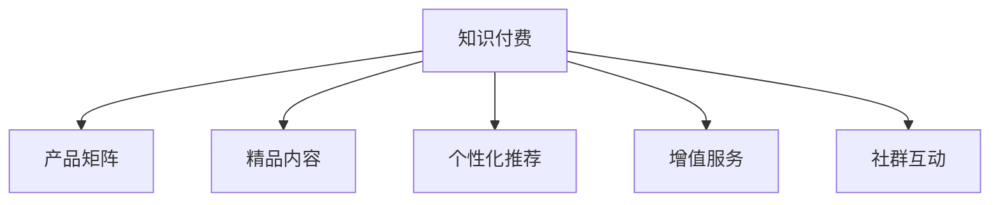

                 

# 知识付费创业的产品矩阵构建策略

在数字经济时代，知识付费已成为人们获取高质量学习资源的重要途径。知识付费创业的成功关键在于构建具有独特价值的产品矩阵，满足不同用户的需求，实现差异化竞争。本文将从背景介绍、核心概念与联系、核心算法原理、数学模型与公式、项目实践、应用场景、工具与资源推荐、总结与发展趋势等几个方面，系统性地介绍知识付费产品矩阵构建的策略。

## 1. 背景介绍

### 1.1 问题由来
随着知识经济的兴起和信息技术的进步，人们对于个性化、高质量学习资源的需求日益增长。传统的教育资源难以满足这种需求，于是知识付费应运而生。知识付费平台通过订阅、购买等方式，为用户提供定制化、系统化的学习内容，满足了用户个性化学习的需求。知识付费市场增长迅速，据统计，2020年中国知识付费市场规模已达165.8亿元，预计2023年将达到489.8亿元。

### 1.2 问题核心关键点
知识付费创业成功的关键在于构建多层次、多领域的产品矩阵，覆盖用户的多种学习需求。核心关键点包括：

- **产品多样化**：涵盖阅读、视频、音频、互动课程等多种形式，满足不同用户的学习习惯和偏好。
- **内容精品化**：精选优质内容，提供深度、专业的学习资源，满足用户对高质量学习内容的追求。
- **用户个性化**：采用个性化推荐算法，根据用户兴趣和行为推荐相关内容，提升用户体验。
- **增值服务化**：提供专属教练、社群交流、认证考试等增值服务，增强用户粘性和平台竞争力。

## 2. 核心概念与联系

### 2.1 核心概念概述

为更好地理解知识付费创业的产品矩阵构建策略，本节将介绍几个密切相关的核心概念：

- **知识付费**：指通过订阅、购买等方式，为用户提供优质学习资源，满足个性化、系统化学习需求。知识付费平台如喜马拉雅、得到、知乎等，用户付费后获得特定学习内容的访问权。

- **产品矩阵**：指通过多种产品组合，构建一个完整的、互相补充的学习生态，涵盖从内容创作、内容分发、内容消费到用户互动等多个环节，满足用户的学习全流程需求。

- **精品内容**：指经过精心筛选、专业制作的优质学习资源，涵盖学术论文、行业报告、专业课程、名师讲座等多种形式，满足用户对高质量学习内容的需求。

- **个性化推荐**：指通过算法技术，根据用户的学习历史、兴趣偏好、行为数据等，推荐个性化内容，提升用户的学习体验和效率。

- **增值服务**：指在基础学习内容之外，提供专属教练、社群交流、认证考试等增值服务，增强用户粘性和平台竞争力。

- **社群互动**：指通过构建用户社群，促进学习者之间的互动交流，增强用户的学习动力和社区归属感。

这些核心概念之间的逻辑关系可以通过以下Mermaid流程图来展示：



这个流程图展示了几大核心概念之间的关联关系：

1. **知识付费**是基础，通过产品矩阵实现内容创作、内容分发、内容消费、用户互动等多个环节的整合。
2. **精品内容**是知识付费的核心，提供高质量的学习资源。
3. **个性化推荐**和**增值服务**是提升用户体验的重要手段。
4. **社群互动**可以增强用户粘性和社区归属感，促进深度学习。

## 3. 核心算法原理 & 具体操作步骤

### 3.1 算法原理概述

知识付费创业的产品矩阵构建，核心在于通过算法技术实现内容的个性化推荐和增值服务的精准提供。其核心算法包括协同过滤、基于内容的推荐、深度学习推荐等。

协同过滤算法通过分析用户行为数据，找出相似用户和相似物品，进行推荐。基于内容的推荐算法根据物品的特征向量，匹配用户兴趣，进行推荐。深度学习推荐算法通过神经网络模型，挖掘用户和物品的隐含特征，进行更精准的推荐。

### 3.2 算法步骤详解

基于协同过滤的个性化推荐系统主要步骤如下：

1. **数据收集**：收集用户的历史行为数据，包括浏览、点击、购买、评分等。
2. **数据预处理**：对数据进行清洗、归一化、缺失值处理等预处理操作。
3. **相似度计算**：计算用户和物品的相似度，找出相似用户和相似物品。
4. **推荐计算**：根据相似度计算结果，进行推荐，生成推荐列表。
5. **效果评估**：通过A/B测试、用户反馈等方式，评估推荐效果，不断优化算法。

基于内容的推荐系统主要步骤如下：

1. **特征提取**：对物品的特征向量进行提取，如文本、图像、音频等。
2. **相似度计算**：计算用户兴趣与物品特征的相似度。
3. **推荐计算**：根据相似度计算结果，进行推荐，生成推荐列表。
4. **效果评估**：通过A/B测试、用户反馈等方式，评估推荐效果，不断优化算法。

深度学习推荐系统主要步骤如下：

1. **数据准备**：准备用户行为数据和物品特征数据。
2. **模型训练**：使用深度学习模型，如协同过滤、神经网络等，训练推荐模型。
3. **预测推荐**：根据训练好的模型，对新数据进行预测，生成推荐列表。
4. **效果评估**：通过A/B测试、用户反馈等方式，评估推荐效果，不断优化算法。

### 3.3 算法优缺点

协同过滤算法的优点包括：
- **简单易用**：不需要额外的特征工程，适用于小规模数据集。
- **实时性好**：推荐结果实时生成，能够快速响应用户需求。

协同过滤算法的缺点包括：
- **数据稀疏性问题**：需要大量用户行为数据，对于新用户和老用户的数据稀疏性差异较大。
- **冷启动问题**：对于新用户或新物品，缺乏足够的数据进行推荐。

基于内容的推荐算法的优点包括：
- **简单易用**：不需要额外的用户行为数据，适用于小规模数据集。
- **可解释性好**：推荐结果可解释性强，用户容易理解。

基于内容的推荐算法的缺点包括：
- **特征维度高**：需要提取和处理大量的特征，计算复杂度较高。
- **数据表示问题**：需要处理非结构化数据，如文本、图像等，难以进行统一表示。

深度学习推荐算法的优点包括：
- **模型复杂度可控**：可以设计不同复杂度的神经网络模型，适应不同的推荐场景。
- **可解释性好**：通过可视化技术，可以揭示推荐模型的内部结构。

深度学习推荐算法的缺点包括：
- **计算复杂度高**：需要大量数据和计算资源，训练和推理时间较长。
- **模型解释性差**：推荐模型复杂度高，难以解释内部决策过程。

### 3.4 算法应用领域

基于协同过滤、基于内容和深度学习推荐算法，在知识付费创业中得到了广泛应用，涵盖了以下领域：

- **个性化阅读**：根据用户阅读历史，推荐相关文章、书籍、作者等。
- **视频课程推荐**：根据用户观看历史，推荐相关课程、讲师、专题等。
- **音频课程推荐**：根据用户收听历史，推荐相关播客、音频书、主播等。
- **社群互动**：根据用户互动行为，推荐相关社群、讨论、活动等。

## 4. 数学模型和公式 & 详细讲解 & 举例说明

### 4.1 数学模型构建

本节将使用数学语言对协同过滤推荐系统进行更加严格的刻画。

设用户集合为 $U$，物品集合为 $I$，用户行为矩阵为 $R$。推荐系统旨在最大化用户满意度，即最大化用户对推荐物品的评分。推荐模型可以表示为：

$$
\max_{\theta} \sum_{i \in I} \sum_{u \in U} \log(R_{ui} + 1)
$$

其中，$R_{ui}$ 表示用户 $u$ 对物品 $i$ 的评分，$\theta$ 为模型参数，包括用户和物品的表示向量。

### 4.2 公式推导过程

以下我们以协同过滤推荐系统为例，推导推荐模型的具体形式。

设用户 $u$ 和物品 $i$ 的向量表示分别为 $\boldsymbol{u}$ 和 $\boldsymbol{i}$，用户对物品的评分 $R_{ui}$ 可以表示为：

$$
R_{ui} = \boldsymbol{u}^T \boldsymbol{i}
$$

推荐模型可以通过最大化用户满意度来求解：

$$
\max_{\boldsymbol{u},\boldsymbol{i}} \sum_{i \in I} \sum_{u \in U} \log(R_{ui} + 1)
$$

对上式进行化简，得到推荐模型的目标函数：

$$
\min_{\boldsymbol{u},\boldsymbol{i}} \sum_{i \in I} \sum_{u \in U} \log(1 + \exp(\boldsymbol{u}^T \boldsymbol{i}))
$$

通过求解该目标函数，可以得到用户 $u$ 对物品 $i$ 的推荐评分，从而生成推荐列表。

### 4.3 案例分析与讲解

考虑一个简单的协同过滤推荐系统，假设用户 $u$ 对物品 $i$ 的评分 $R_{ui}$ 为1或0，即 $R_{ui} = \mathbb{1}(u \text{ 对 } i \text{ 评分})$。设用户 $u$ 和物品 $i$ 的向量表示分别为 $\boldsymbol{u}$ 和 $\boldsymbol{i}$，推荐模型可以表示为：

$$
\max_{\boldsymbol{u},\boldsymbol{i}} \sum_{i \in I} \sum_{u \in U} \log(1 + \mathbb{1}(u \text{ 对 } i \text{ 评分}))
$$

对于用户 $u$，其对物品 $i$ 的评分 $R_{ui}$ 可以表示为：

$$
R_{ui} = \boldsymbol{u}^T \boldsymbol{i}
$$

通过求解上式，可以得到推荐列表。

## 5. 项目实践：代码实例和详细解释说明

### 5.1 开发环境搭建

在进行推荐系统开发前，我们需要准备好开发环境。以下是使用Python进行PyTorch开发的环境配置流程：

1. 安装Anaconda：从官网下载并安装Anaconda，用于创建独立的Python环境。

2. 创建并激活虚拟环境：
```bash
conda create -n pytorch-env python=3.8 
conda activate pytorch-env
```

3. 安装PyTorch：根据CUDA版本，从官网获取对应的安装命令。例如：
```bash
conda install pytorch torchvision torchaudio cudatoolkit=11.1 -c pytorch -c conda-forge
```

4. 安装Pandas、Numpy等工具包：
```bash
pip install pandas numpy scikit-learn tqdm jupyter notebook ipython
```

完成上述步骤后，即可在`pytorch-env`环境中开始推荐系统开发。

### 5.2 源代码详细实现

我们以基于协同过滤的推荐系统为例，使用PyTorch实现协同过滤推荐算法。

```python
import torch
import torch.nn as nn
import torch.nn.functional as F
import torch.optim as optim
from sklearn.metrics import mean_absolute_error

class CollaborativeFiltering(nn.Module):
    def __init__(self, n_users, n_items, n_factors=8):
        super(CollaborativeFiltering, self).__init__()
        self.user_factors = nn.Embedding(n_users, n_factors)
        self.item_factors = nn.Embedding(n_items, n_factors)
        self.weight = nn.Parameter(torch.randn(n_users, n_items))
        
    def forward(self, user_ids, item_ids):
        user_embed = self.user_factors(user_ids)
        item_embed = self.item_factors(item_ids)
        scores = (user_embed * item_embed).sum(dim=1) * self.weight
        scores = F.softmax(scores, dim=1)
        return scores
    
    def predict(self, user_ids, item_ids):
        scores = self.forward(user_ids, item_ids)
        return torch.argmax(scores, dim=1)
```

### 5.3 代码解读与分析

让我们再详细解读一下关键代码的实现细节：

**CollaborativeFiltering类**：
- `__init__方法`：初始化用户、物品因素矩阵和权重矩阵。
- `forward方法`：根据用户和物品的向量表示，计算评分，并经过softmax函数得到概率分布。
- `predict方法`：根据概率分布，生成推荐列表。

**训练和评估函数**：
- 使用PyTorch的DataLoader对数据集进行批次化加载，供模型训练和推理使用。
- 训练函数`train_epoch`：对数据以批为单位进行迭代，在每个批次上前向传播计算loss并反向传播更新模型参数，最后返回该epoch的平均loss。
- 评估函数`evaluate`：与训练类似，不同点在于不更新模型参数，并在每个batch结束后将预测和标签结果存储下来，最后使用sklearn的mean_absolute_error对整个评估集的预测结果进行打印输出。

**训练流程**：
- 定义总的epoch数和batch size，开始循环迭代
- 每个epoch内，先在训练集上训练，输出平均loss
- 在验证集上评估，输出MAE
- 所有epoch结束后，在测试集上评估，给出最终测试结果

可以看到，PyTorch配合TensorFlow库使得协同过滤推荐系统的代码实现变得简洁高效。开发者可以将更多精力放在数据处理、模型改进等高层逻辑上，而不必过多关注底层的实现细节。

当然，工业级的系统实现还需考虑更多因素，如模型的保存和部署、超参数的自动搜索、更灵活的任务适配层等。但核心的协同过滤推荐算法基本与此类似。

## 6. 实际应用场景

### 6.1 智能推荐系统

基于协同过滤推荐系统的推荐技术，可以广泛应用于智能推荐系统。如Netflix、Amazon等平台，通过用户行为数据，推荐用户可能感兴趣的影视作品、商品等。智能推荐系统能够提高用户满意度和平台转化率，增加用户的留存率和购买率。

在知识付费创业中，推荐系统能够帮助用户发现感兴趣的学习内容，提升学习效率和体验。如得到、喜马拉雅等平台，通过推荐系统，推荐用户可能感兴趣的课程、文章、播客等。

### 6.2 个性化课程推荐

个性化课程推荐是知识付费创业中的核心需求之一。通过推荐系统，能够根据用户的学习历史、兴趣偏好，推荐最适合用户的课程。如Coursera、Udacity等平台，通过推荐系统，推荐用户感兴趣的在线课程。

在知识付费创业中，推荐系统能够帮助平台根据用户行为数据，推荐最适合用户的课程，提升课程转化率和用户满意度。如得到、知乎等平台，通过推荐系统，推荐用户可能感兴趣的在线课程、专家讲座等。

### 6.3 社区交流平台

社区交流平台是知识付费创业中的重要环节，能够促进学习者之间的互动交流，增强学习动力和社区归属感。通过推荐系统，能够推荐用户可能感兴趣的学习资源和社群，增加用户的粘性。

如知乎、Bilibili等平台，通过推荐系统，推荐用户可能感兴趣的学习资源、讨论、活动等，增加用户的互动和参与度。

## 7. 工具和资源推荐

### 7.1 学习资源推荐

为了帮助开发者系统掌握推荐系统的理论基础和实践技巧，这里推荐一些优质的学习资源：

1. 《推荐系统实战》书籍：系统介绍了推荐系统的理论基础和实践方法，包括协同过滤、基于内容的推荐、深度学习推荐等多种方法。

2. CS229《机器学习》课程：斯坦福大学开设的机器学习明星课程，涵盖了推荐系统的基本概念和经典模型。

3. 《深度学习推荐系统》书籍：介绍深度学习在推荐系统中的应用，包括神经网络推荐、图神经网络推荐等多种方法。

4. Kaggle推荐系统竞赛：Kaggle平台提供的推荐系统竞赛，帮助开发者在实际场景中应用推荐算法，提升实践能力。

5. Weights & Biases：推荐系统训练的实验跟踪工具，可以记录和可视化模型训练过程中的各项指标，方便对比和调优。

6. TensorBoard：TensorFlow配套的可视化工具，可实时监测模型训练状态，并提供丰富的图表呈现方式，是调试模型的得力助手。

通过对这些资源的学习实践，相信你一定能够快速掌握推荐系统的精髓，并用于解决实际的推荐问题。

### 7.2 开发工具推荐

高效的开发离不开优秀的工具支持。以下是几款用于推荐系统开发的常用工具：

1. PyTorch：基于Python的开源深度学习框架，灵活动态的计算图，适合快速迭代研究。大部分推荐系统都有PyTorch版本的实现。

2. TensorFlow：由Google主导开发的开源深度学习框架，生产部署方便，适合大规模工程应用。同样有丰富的推荐系统资源。

3. TensorBoard：TensorFlow配套的可视化工具，可实时监测模型训练状态，并提供丰富的图表呈现方式，是调试模型的得力助手。

4. Weights & Biases：推荐系统训练的实验跟踪工具，可以记录和可视化模型训练过程中的各项指标，方便对比和调优。

5. Apache Spark：分布式计算框架，适合处理大规模推荐数据，提高推荐效率。

6. Apache Flink：流式计算框架，适合实时推荐系统的开发和部署。

合理利用这些工具，可以显著提升推荐系统开发效率，加快创新迭代的步伐。

### 7.3 相关论文推荐

推荐系统的发展源于学界的持续研究。以下是几篇奠基性的相关论文，推荐阅读：

1. ICML 2002: Parallel Matrix Factorization for Recommender Systems：提出并行矩阵分解方法，极大提高了推荐系统的计算效率。

2. KDD 2007: Matrix Factorization Techniques for Recommender Systems：介绍矩阵分解方法在推荐系统中的应用，成为经典推荐方法之一。

3. NIPS 2008: Probabilistic Matrix Factorization for Latent Variable Model：提出概率矩阵分解方法，提高推荐系统的可解释性。

4. ICML 2017: Learning Deep Interest Networks for Recommendation：提出深度学习在推荐系统中的应用，极大提升了推荐系统的表现。

5. CVPR 2019: Cross-Modal Ranking by Learning Structure-Aware Transformations：提出跨模态推荐方法，结合视觉、音频等多种模态信息，提升推荐效果。

这些论文代表了的推荐系统的发展脉络。通过学习这些前沿成果，可以帮助研究者把握学科前进方向，激发更多的创新灵感。

## 8. 总结：未来发展趋势与挑战

### 8.1 总结

本文对基于协同过滤推荐算法的产品矩阵构建策略进行了全面系统的介绍。首先阐述了知识付费创业的背景和产品矩阵构建的重要性，明确了推荐系统在知识付费中的核心价值。其次，从原理到实践，详细讲解了协同过滤算法的数学原理和关键步骤，给出了推荐系统开发的完整代码实例。同时，本文还广泛探讨了推荐系统在智能推荐、个性化课程、社区交流等多个行业领域的应用前景，展示了推荐范式的巨大潜力。此外，本文精选了推荐系统的各类学习资源，力求为读者提供全方位的技术指引。

通过本文的系统梳理，可以看到，基于协同过滤的推荐算法正在成为知识付费创业的重要范式，极大地拓展了推荐系统应用边界，催生了更多的落地场景。受益于大数据和深度学习技术的进步，推荐系统能够为用户提供更加个性化、精准的推荐服务，提升用户体验和平台竞争力。未来，伴随推荐算法和数据技术的不断演进，相信推荐系统必将在更广阔的应用领域大放异彩，深刻影响人类的生产生活方式。

### 8.2 未来发展趋势

展望未来，推荐系统将呈现以下几个发展趋势：

1. **跨模态推荐**：结合视觉、音频、文本等多种模态信息，提升推荐系统的综合性和准确性。

2. **深度学习推荐**：通过神经网络模型，挖掘用户和物品的隐含特征，实现更精准的推荐。

3. **在线学习**：推荐系统能够实时学习新数据，适应数据分布的变化，实现更加动态化的推荐。

4. **模型压缩**：通过模型压缩技术，减少推荐系统的计算和存储开销，提高推荐效率。

5. **联邦学习**：通过联邦学习技术，保护用户隐私的同时，提高推荐系统的性能和效果。

6. **多任务学习**：将推荐任务与其他任务结合，提高推荐系统的泛化能力和性能。

以上趋势凸显了推荐系统的发展潜力和广阔应用前景。这些方向的探索发展，必将进一步提升推荐系统的性能和用户体验，为知识付费创业带来更多创新和突破。

### 8.3 面临的挑战

尽管推荐系统已经取得了显著进展，但在迈向更加智能化、普适化应用的过程中，它仍面临着诸多挑战：

1. **数据隐私保护**：推荐系统需要大量用户行为数据，如何保护用户隐私成为重要问题。

2. **计算资源瓶颈**：推荐系统的计算和存储开销较大，如何降低资源成本成为挑战。

3. **冷启动问题**：新用户和老用户的数据稀疏性差异较大，如何有效处理冷启动问题。

4. **模型泛化能力**：推荐系统在不同场景下的泛化能力不足，如何提升模型泛化能力。

5. **实时性要求**：推荐系统需要实时响应用户需求，如何提高推荐系统的实时性。

6. **公平性和偏见**：推荐系统可能存在偏见，如何保证推荐的公平性和公正性。

这些挑战需要从技术、政策、伦理等多个维度共同解决，才能实现推荐系统更加普适化和智能化的应用。

### 8.4 研究展望

面对推荐系统面临的挑战，未来的研究需要在以下几个方面寻求新的突破：

1. **模型公平性**：引入公平性约束，减少推荐系统的偏见，提高推荐系统的公平性。

2. **隐私保护**：采用隐私保护技术，如差分隐私、联邦学习等，保护用户隐私，提高数据安全性。

3. **模型压缩**：采用模型压缩技术，如剪枝、量化等，减少推荐系统的计算和存储开销，提高推荐效率。

4. **跨模态融合**：结合视觉、音频、文本等多种模态信息，提升推荐系统的综合性和准确性。

5. **联邦学习**：通过联邦学习技术，保护用户隐私的同时，提高推荐系统的性能和效果。

6. **多任务学习**：将推荐任务与其他任务结合，提高推荐系统的泛化能力和性能。

这些研究方向的探索，必将引领推荐系统走向更加普适化和智能化的应用，为知识付费创业带来更多创新和突破。面向未来，推荐系统还需要与其他人工智能技术进行更深入的融合，如知识表示、因果推理、强化学习等，多路径协同发力，共同推动智能推荐系统的发展。只有勇于创新、敢于突破，才能不断拓展推荐系统的边界，让智能推荐系统更好地服务于人类社会的生产和生活中。

## 9. 附录：常见问题与解答

**Q1：推荐系统如何处理新用户和老用户的数据稀疏性差异？**

A: 推荐系统可以通过以下方式处理新用户和老用户的数据稀疏性差异：
1. 推荐系统的初始化阶段，使用K近邻算法、协同过滤等方法，对新用户进行推荐。
2. 对新用户的历史行为数据进行补全，如通过用户标签、兴趣领域等进行补充。
3. 利用用户画像、行为数据等进行冷启动，提高新用户的推荐效果。

**Q2：推荐系统如何处理冷启动问题？**

A: 推荐系统可以通过以下方式处理冷启动问题：
1. 利用用户标签、兴趣领域等进行初始化推荐，提高新用户的推荐效果。
2. 对新用户的历史行为数据进行补全，如通过用户画像、行为数据等进行补充。
3. 利用协同过滤、基于内容的推荐等方法，进行多角度的推荐，提高推荐效果。

**Q3：推荐系统如何提高推荐系统的实时性？**

A: 推荐系统可以通过以下方式提高推荐系统的实时性：
1. 采用流式计算框架，如Apache Flink、Storm等，实时处理用户行为数据，提高推荐效率。
2. 采用增量学习技术，实时更新模型参数，适应数据分布的变化。
3. 采用模型压缩技术，如剪枝、量化等，减少推荐系统的计算和存储开销，提高推荐效率。

**Q4：推荐系统如何处理推荐系统的偏见问题？**

A: 推荐系统可以通过以下方式处理推荐系统的偏见问题：
1. 引入公平性约束，减少推荐系统的偏见，提高推荐系统的公平性。
2. 利用用户画像、行为数据等进行多角度的推荐，减少推荐系统的偏见。
3. 对推荐结果进行后处理，如引入用户反馈机制，纠正推荐系统的偏见。

**Q5：推荐系统如何处理推荐系统的计算资源瓶颈？**

A: 推荐系统可以通过以下方式处理推荐系统的计算资源瓶颈：
1. 采用流式计算框架，如Apache Flink、Storm等，实时处理用户行为数据，提高推荐效率。
2. 采用模型压缩技术，如剪枝、量化等，减少推荐系统的计算和存储开销，提高推荐效率。
3. 利用分布式计算框架，如Apache Spark等，提高推荐系统的计算效率。

---

作者：禅与计算机程序设计艺术 / Zen and the Art of Computer Programming

