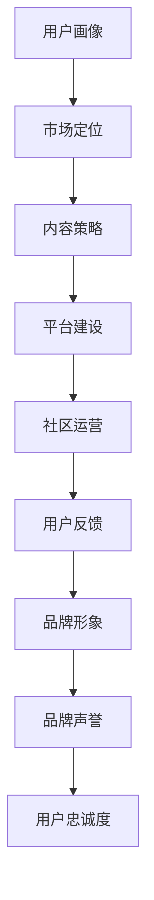

                 

# 知识付费创业的品牌塑造策略

> 关键词：知识付费,品牌塑造,用户画像,市场定位,内容营销,社区运营

## 1. 背景介绍

### 1.1 问题由来
随着知识付费的兴起，越来越多的企业和个人开始关注如何将知识内容转化为有价值的商业产品。如何塑造一个有竞争力的知识付费品牌，成为所有知识付费创业者都需要思考的问题。品牌不仅是一个企业或者平台的标识，更是用户对其认知和信任的基础。一个成功的知识付费品牌，能够吸引并留住大量付费用户，提供稳定且高质量的内容，实现持续增长。

### 1.2 问题核心关键点
知识付费品牌的塑造涉及到多方面的因素，包括但不限于：用户画像、市场定位、内容策略、平台建设、社区运营等。如何系统地分析和优化这些关键因素，是知识付费创业成功的关键。

### 1.3 问题研究意义
成功的知识付费品牌可以显著提高用户转化率，增加用户粘性，提升用户价值。通过深入研究品牌塑造的策略，可以为企业和个人提供具体的行动指南，帮助他们在激烈的市场竞争中脱颖而出。

## 2. 核心概念与联系

### 2.1 核心概念概述

在讨论知识付费品牌塑造之前，需要先理解几个关键概念：

- **知识付费**：是指用户通过付费获取各类知识服务，包括在线课程、电子书、视频教程、音频讲座、专家咨询等。
- **品牌塑造**：是指通过一系列策略和活动，提升品牌知名度、美誉度和用户信任度，最终实现品牌资产的积累和提升。
- **用户画像**：是对目标用户群体特征的详细描述，包括兴趣、行为、需求等，帮助品牌定位并优化内容。
- **市场定位**：是指品牌在目标市场中的竞争地位和市场份额，明确品牌的差异化竞争优势。
- **内容营销**：是指通过发布有价值的内容，吸引并留住用户，建立品牌影响力。
- **社区运营**：是指通过线上线下活动和互动，增强用户参与感和归属感，构建品牌忠诚度。

这些核心概念之间相互关联，共同构成了知识付费品牌塑造的框架。

### 2.2 核心概念原理和架构的 Mermaid 流程图



这个流程图展示了一个知识付费品牌塑造的关键流程：

1. 根据用户画像定位目标市场。
2. 基于市场定位制定内容策略。
3. 搭建平台以支撑内容展示和交易。
4. 通过社区运营增强用户参与感和粘性。
5. 收集用户反馈，调整品牌策略。
6. 建立品牌形象，提升品牌声誉。
7. 最终实现用户忠诚度提升。

## 3. 核心算法原理 & 具体操作步骤

### 3.1 算法原理概述

知识付费品牌塑造的本质是通过数据驱动的决策和迭代优化，实现品牌资产的不断积累和提升。具体来说，可以通过以下步骤来实现：

1. **市场调研**：收集和分析市场数据，理解用户需求和竞争态势。
2. **用户画像建模**：通过数据分析，建立详细的用户画像，指导内容生产。
3. **内容优化**：根据用户画像和市场定位，调整内容策略，提升内容质量。
4. **平台优化**：通过技术手段提升平台的用户体验和功能，优化交易流程。
5. **社区管理**：通过活跃的社区运营，增强用户互动和归属感。
6. **品牌建设**：通过多渠道营销和品牌活动，提升品牌知名度和美誉度。

### 3.2 算法步骤详解

**Step 1: 市场调研**
- 收集用户反馈、竞争对手数据、行业报告等。
- 分析用户需求、市场趋势、竞争优势和劣势。

**Step 2: 用户画像建模**
- 利用大数据分析技术，对用户行为和特征进行聚类分析。
- 使用K-means、LDA等算法，确定用户群体的特征标签。
- 根据用户画像，制定差异化的内容策略。

**Step 3: 内容优化**
- 分析用户画像，找出热门兴趣和需求点。
- 设计有针对性的课程和活动，满足用户需求。
- 引入专家资源，提升内容质量和权威性。

**Step 4: 平台优化**
- 基于用户行为数据分析，优化UI/UX设计，提升用户体验。
- 增加功能模块，如直播互动、知识社区等，增强用户粘性。
- 优化交易流程，降低用户购买和续费门槛。

**Step 5: 社区管理**
- 通过线上社群、线下活动、论坛讨论等方式，增强用户参与感。
- 定期发布社区公告、资讯，保持社区活跃度。
- 设置社区规则，管理用户互动，建立良好社区氛围。

**Step 6: 品牌建设**
- 通过内容营销、品牌活动、社交媒体推广等方式提升品牌知名度。
- 通过用户口碑和品牌形象，增强用户信任和品牌忠诚度。
- 持续跟踪品牌效果，根据数据反馈调整品牌策略。

### 3.3 算法优缺点

**优点**：
- 数据驱动，决策科学化，减少主观偏见。
- 系统化、可重复性强，可形成标准化的操作流程。
- 多渠道、多策略的综合应用，效果显著。

**缺点**：
- 需要大量数据支持，数据获取和分析成本较高。
- 策略实施和效果评估需要时间和资源投入。
- 需要持续的监测和优化，灵活性不足。

### 3.4 算法应用领域

知识付费品牌塑造的算法和步骤可以应用于多种场景，包括但不限于：

- 在线教育平台
- 专业咨询和培训服务
- 在线知识社区
- 企业内训和文化传播
- 个人知识分享和成长平台

## 4. 数学模型和公式 & 详细讲解 & 举例说明

### 4.1 数学模型构建

为了更好地分析品牌塑造的效果，可以构建一个简单的数学模型来量化品牌资产的变化。设品牌资产为 $B$，用户忠诚度为 $U$，市场份额为 $M$，内容满意度为 $S$，社区活跃度为 $A$，品牌形象指数为 $I$。则品牌资产的变化可以通过以下模型描述：

$$ B = f(U, M, S, A, I) $$

其中，函数 $f$ 表示品牌资产的计算方式。例如，可以采用加权和的形式：

$$ B = w_1U + w_2M + w_3S + w_4A + w_5I $$

其中 $w_i$ 表示各项指标的权重。

### 4.2 公式推导过程

以用户忠诚度 $U$ 为例，推导其与品牌资产的计算公式。

假设用户忠诚度 $U$ 可以分为两个维度：用户留存率和用户满意度。则有：

$$ U = U_{留存} \times U_{满意度} $$

其中 $U_{留存}$ 表示用户在一定时间内的留存率，$U_{满意度}$ 表示用户对内容的满意度。

品牌资产 $B$ 可以通过用户忠诚度 $U$ 和其他指标进行计算。例如，一个简单的方法是将各指标乘以相应的权重，再求和：

$$ B = w_1U + w_2M + w_3S + w_4A + w_5I $$

假设各指标的权重分别为 $w_1=0.4, w_2=0.2, w_3=0.1, w_4=0.1, w_5=0.2$，则有：

$$ B = 0.4U + 0.2M + 0.1S + 0.1A + 0.2I $$

### 4.3 案例分析与讲解

假设某知识付费平台通过以下数据得到品牌资产的计算结果：

- 用户留存率 $U_{留存}=0.7$
- 用户满意度 $U_{满意度}=0.8$
- 市场份额 $M=0.15$
- 内容满意度 $S=0.9$
- 社区活跃度 $A=0.3$
- 品牌形象指数 $I=0.5$

代入公式，得：

$$ B = 0.4 \times (0.7 \times 0.8) + 0.2 \times 0.15 + 0.1 \times 0.9 + 0.1 \times 0.3 + 0.2 \times 0.5 = 0.4 \times 0.56 + 0.03 + 0.09 + 0.03 + 0.1 = 0.224 + 0.03 + 0.09 + 0.03 + 0.1 = 0.374 $$

这表明该平台的品牌资产为 $0.374$，即在0到1之间，相对较高。

## 5. 项目实践：代码实例和详细解释说明

### 5.1 开发环境搭建

假设我们使用Python和Django框架来开发一个知识付费平台。以下是我们搭建开发环境的步骤：

1. 安装Python和pip。
2. 安装Django框架。
3. 创建虚拟环境。
4. 安装相关依赖。
5. 创建Django项目和应用。

### 5.2 源代码详细实现

以下是一个简化的用户注册功能的代码实现：

```python
from django.contrib.auth.models import User
from django.http import HttpResponse

def register(request):
    if request.method == 'POST':
        username = request.POST['username']
        password = request.POST['password']
        user = User.objects.create_user(username, password)
        user.save()
        return HttpResponse('Registration successful.')
    else:
        return HttpResponse('Please submit the form.')
```

### 5.3 代码解读与分析

- `User` 模型：Django内置的用户模型，用于管理用户信息。
- `create_user` 方法：创建用户账号。
- `save` 方法：保存用户信息到数据库。

### 5.4 运行结果展示

在终端执行 `python manage.py runserver` 启动服务器后，访问 `http://127.0.0.1:8000/` 即可看到注册页面。

## 6. 实际应用场景

### 6.1 在线教育平台

在线教育平台可以通过品牌塑造策略，吸引大量学习者付费订阅课程。例如，通过精细化的用户画像分析，制定差异化的课程内容，满足不同用户的学习需求。同时，通过社区互动和品牌活动，增强用户粘性，提升品牌忠诚度。

### 6.2 专业咨询和培训服务

专业咨询和培训服务领域，品牌塑造尤为重要。通过高质量的内容和专业的服务，建立专家品牌，吸引更多目标客户。利用社区运营和品牌推广，提升用户信任和满意度。

### 6.3 在线知识社区

在线知识社区可以通过品牌塑造，构建知识共享和交流的平台。通过活跃的社区运营，增强用户参与感和归属感，提升品牌影响力。同时，通过有价值的内容营销，吸引新用户加入，增加品牌资产。

### 6.4 未来应用展望

未来的知识付费平台，将更加注重品牌的多样化和个性化。例如，通过品牌活动、社交媒体营销、用户生成内容等方式，提升品牌的知名度和美誉度。同时，利用大数据和人工智能技术，对用户行为和需求进行深度分析，实现更加精准的品牌定位和内容推荐。

## 7. 工具和资源推荐

### 7.1 学习资源推荐

1. **Coursera**：提供大量数据分析和市场调研课程，帮助你掌握品牌塑造的必备技能。
2. **Google Analytics**：通过用户行为分析，了解用户画像和市场需求。
3. **GrowthHacker**：关于增长黑客的书籍和文章，提供实用的品牌营销策略。

### 7.2 开发工具推荐

1. **Django**：开源的Python Web框架，易于上手，适合快速开发。
2. **Flask**：轻量级Web框架，灵活性强，适合小型应用。
3. **MySQL**：流行的关系型数据库，稳定可靠，适合数据存储和查询。

### 7.3 相关论文推荐

1. **Brand Positioning in Digital Markets**：探讨数字市场中的品牌定位策略，适合品牌塑造的理论与实践。
2. **User Behavior Analysis in Knowledge Sharing Platforms**：分析知识共享平台的用户行为，帮助理解用户需求和改进社区运营。
3. **Content Marketing Strategies for Online Businesses**：介绍在线企业的内容营销策略，提供实用的品牌推广思路。

## 8. 总结：未来发展趋势与挑战

### 8.1 研究成果总结

本文对知识付费品牌塑造的算法和策略进行了系统介绍。通过市场调研、用户画像建模、内容优化、平台优化、社区管理和品牌建设，系统描述了知识付费品牌塑造的关键步骤。

### 8.2 未来发展趋势

未来知识付费品牌塑造将呈现以下趋势：

1. **数据驱动**：大数据和人工智能技术将进一步提升品牌塑造的科学性和精准性。
2. **个性化定制**：利用用户画像和推荐系统，提供更加个性化和精准的内容和推荐。
3. **跨平台整合**：通过社交媒体、电子邮件等渠道，提升品牌曝光和互动。
4. **用户体验优化**：不断提升平台的用户体验和功能，增强用户粘性和满意度。

### 8.3 面临的挑战

知识付费品牌塑造仍面临诸多挑战：

1. **数据隐私和安全**：用户数据的收集和分析，需要严格遵守隐私保护法规。
2. **内容同质化**：如何在激烈的市场竞争中，保持内容的独特性和高质量。
3. **用户留存**：如何通过持续的内容更新和社区运营，提升用户留存率。
4. **品牌认知度**：如何通过有效的品牌推广，提升品牌的知名度和美誉度。

### 8.4 研究展望

未来的研究需要在以下几个方面寻求新的突破：

1. **多渠道融合**：探索如何将线上线下渠道整合，提升品牌推广效果。
2. **用户生成内容**：通过用户生成内容，增强用户互动和品牌粘性。
3. **社区治理**：建立有效的社区规则和治理机制，防止社区内容的泛化。
4. **情感分析**：通过情感分析技术，了解用户对品牌的情感态度，优化品牌策略。

## 9. 附录：常见问题与解答

**Q1: 如何通过数据驱动品牌塑造？**

A: 通过市场调研和用户画像建模，收集和分析大量数据。利用数据分析工具（如Python、R、Tableau等），提取关键数据指标（如用户留存率、满意度、互动率等），并通过多渠道营销和社区运营，优化品牌策略。

**Q2: 品牌塑造中，用户画像的重要性体现在哪里？**

A: 用户画像描述了目标用户群体的特征和需求，指导品牌制定差异化的内容策略，提升用户粘性和满意度。通过用户画像，品牌可以更好地定位市场，优化平台功能，提升用户参与感。

**Q3: 如何提升品牌形象指数（I）？**

A: 品牌形象指数（I）反映品牌在用户心中的形象和信任度。提升I可以通过以下方法：
1. 提供高质量、有价值的内容。
2. 与知名专家和机构合作，提升品牌权威性。
3. 开展品牌活动，增强品牌曝光和认知度。

**Q4: 品牌塑造中的社区运营需要注意哪些问题？**

A: 社区运营是品牌塑造的重要环节，需要注意以下问题：
1. 建立社区规则，管理用户互动，防止内容泛化。
2. 定期发布社区公告、资讯，保持社区活跃度。
3. 引导用户参与，增加社区粘性。

**Q5: 如何进行品牌形象的监测和优化？**

A: 品牌形象的监测可以通过多渠道数据收集和分析，如社交媒体监控、用户反馈、市场调研等。优化品牌形象需要持续收集用户反馈，调整品牌策略，增强品牌美誉度和用户信任度。

---

作者：禅与计算机程序设计艺术 / Zen and the Art of Computer Programming

