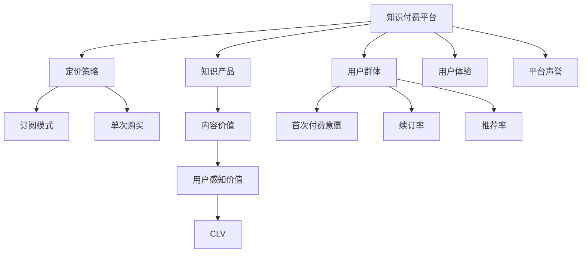

                 

# 知识付费创业的定价心理学

## 1. 背景介绍

知识付费（Knowledge Paid）是指用户为获取知识而支付费用的行为，这种模式正逐渐成为一种新的消费趋势。在知识付费领域，创业公司通过提供高质量、有价值的知识内容，吸引用户付费订阅或购买，从而实现盈利。但定价策略直接影响到用户获取知识和平台营收的效果，决定了知识付费创业的成败。本文将深入探讨知识付费创业的定价心理学，帮助创业者制定合理的定价策略，最大化商业价值。

## 2. 核心概念与联系

### 2.1 核心概念概述

为理解定价心理学的核心概念，我们首先定义几个关键术语：

- **知识付费平台**：以知识内容为核心产品，通过订阅或单次购买等方式，为用户提供付费服务的互联网平台。
- **定价策略**：针对不同用户群体、市场环境、知识产品类型等，制定的价格和收费方式。
- **用户感知价值**：用户对平台提供的知识和服务的总体评价，包括知识价值、用户体验、平台声誉等。
- **用户生命周期价值（CLV）**：单个用户在平台上的总消费价值，包括订阅费用、购买费用、推荐费等。

### 2.2 核心概念原理和架构的 Mermaid 流程图



该流程图展示了知识付费平台的核心概念及其相互关系：

1. **平台**：作为知识内容的核心承载体，提供用户可订阅和购买的服务。
2. **用户群体**：根据年龄、职业、兴趣等标签划分不同的用户群体，评估其首次付费意愿、续订率和推荐率。
3. **定价策略**：通过选择合适的订阅模式和单次购买策略，设定合适的价格，以最大化用户的付费意愿和平台的收入。
4. **知识产品**：平台提供的内容产品，价值和质量直接影响用户感知价值。
5. **用户体验**：用户对平台的使用感受，包括界面设计、加载速度、操作便捷性等，直接影响用户留存率。
6. **平台声誉**：用户在社交网络上的口碑传播，对吸引新用户和提升转化率有直接影响。
7. **用户感知价值**：用户对知识产品的整体评价，影响用户是否愿意持续付费。
8. **用户生命周期价值**：用户在平台上的消费总和，是衡量平台商业价值的重要指标。

## 3. 核心算法原理 & 具体操作步骤

### 3.1 算法原理概述

知识付费平台的定价策略主要基于经济学中的价值理论，通过分析用户感知价值和平台边际成本，来制定合理的价格。核心算法包括：

- **需求价格弹性**：衡量价格变动对需求量的影响，帮助制定合理的浮动价格。
- **边际分析**：分析平台的边际成本和边际收益，指导最优定价。
- **价值感知理论**：基于用户的感知价值来定价，最大化用户满意度和平台的收益。
- **动态定价**：根据市场需求和用户行为动态调整价格，提高转化率和收益。

### 3.2 算法步骤详解

**步骤一：市场调研与用户分析**
- 收集目标市场和用户群体的数据，包括年龄分布、职业特点、兴趣爱好等。
- 分析用户首次付费意愿、续订率和推荐率，确定不同用户群体的定价敏感度。
- 了解用户对知识产品价值的认知和期望，为制定定价策略提供依据。

**步骤二：成本分析与定价模型构建**
- 计算平台的边际成本，包括知识创作、技术维护、平台运营等成本。
- 根据用户感知价值和边际成本，构建定价模型。常用的模型包括线性定价模型、分级定价模型等。
- 设定不同的订阅计划和单次购买价格，满足不同用户的需求。

**步骤三：定价策略制定与优化**
- 确定基础定价，并根据市场需求和用户反馈，动态调整价格。
- 设计合理的续订策略，提升用户续订率和忠诚度。
- 实施折扣和优惠政策，吸引新用户和提升转化率。

**步骤四：定价效果评估与调整**
- 定期评估定价策略的效果，监测用户的付费意愿、续订率和推荐率。
- 根据数据分析结果，不断优化定价策略，确保最大化用户满意度和平台收益。

### 3.3 算法优缺点

知识付费平台的定价策略有以下优点：

- **灵活性**：根据市场需求和用户反馈，灵活调整价格策略，最大化商业价值。
- **精准性**：通过用户分析，精准定位不同用户群体的需求和定价敏感度。
- **用户满意度**：通过优化定价策略，提升用户感知价值和满意度，提高续订率和推荐率。

但该策略也存在以下缺点：

- **复杂性**：涉及多方面的数据和因素，制定和优化策略需要较高的专业性。
- **风险性**：价格变动可能影响用户需求和平台营收，需要进行风险管理。
- **数据依赖性**：定价策略的有效性依赖于精准的数据分析和用户反馈，获取和处理数据成本较高。

### 3.4 算法应用领域

知识付费平台的定价策略广泛应用于多种场景，包括：

- **教育培训**：根据不同课程难度和教学内容，制定差异化的定价策略。
- **专业咨询**：提供针对特定行业或领域的专业知识咨询，设定合理的价格。
- **技术支持**：提供技术问题解决、技术培训等服务，根据复杂度和需求设置不同的价格。
- **健康生活**：提供健康管理、营养咨询等服务，针对不同用户需求设定个性化价格。

## 4. 数学模型和公式 & 详细讲解 & 举例说明

### 4.1 数学模型构建

定价策略涉及的数学模型主要包括：

- **线性定价模型**：价格与知识产品价值成正比，公式为 $P = aV$，其中 $P$ 为价格，$V$ 为价值，$a$ 为价格系数。
- **分级定价模型**：根据知识产品价值和用户需求，设定不同价格层次，公式为 $P = \begin{cases} p_1 & \text{if } V \leq V_1 \\ p_2 & \text{if } V_1 < V \leq V_2 \\ \vdots \\ p_n & \text{if } V > V_{n-1} \end{cases}$，其中 $V_i$ 为价格层次值，$p_i$ 为对应价格。

### 4.2 公式推导过程

以线性定价模型为例，推导定价公式：

设知识产品价值为 $V$，用户感知价值为 $v$，则用户感知价值与产品价值的比值为：

$$ r = \frac{v}{V} $$

根据价值感知理论，用户愿意支付的价格 $P$ 与感知价值成正比，即：

$$ P = av $$

将 $r$ 代入上式，得：

$$ P = a \cdot \frac{v}{V} \cdot V = av $$

因此，定价公式为：

$$ P = aV $$

其中 $a$ 为价格系数，取决于平台对知识价值的评估和市场需求。

### 4.3 案例分析与讲解

**案例一：在线教育平台**
- **用户分析**：新用户首次付费意愿低，续订率和推荐率高。
- **定价模型**：设定基础定价为 9.9 元/月，随着课程难度和内容价值的增加，价格逐步提高。
- **定价策略**：通过优惠券和推荐奖励，吸引新用户试用课程，提升首次付费意愿。
- **定价效果**：用户满意度提高，续订率和推荐率提升，平台营收增长。

**案例二：专业咨询平台**
- **用户分析**：目标用户为高净值人群，对价格敏感度低。
- **定价模型**：根据咨询时长和复杂度，设定阶梯式价格，从 500 元/次到 2000 元/次不等。
- **定价策略**：提供一次性付费方案和按次计费方案，满足不同用户的需求。
- **定价效果**：平台收入增加，高价值用户的转化率提升。

## 5. 项目实践：代码实例和详细解释说明

### 5.1 开发环境搭建

- **操作系统**：选择 Linux 或 macOS，确保系统稳定性和可扩展性。
- **编程语言**：选择 Python，拥有丰富的数据分析和机器学习库。
- **数据分析工具**：使用 Pandas、NumPy 等工具，处理用户数据和定价策略。
- **机器学习框架**：使用 Scikit-Learn 和 TensorFlow，进行用户行为分析和模型训练。
- **Web 开发框架**：使用 Flask 或 Django，构建知识付费平台的用户界面。

### 5.2 源代码详细实现

**代码示例 1：用户数据分析**

```python
import pandas as pd
import numpy as np

# 读取用户数据
user_data = pd.read_csv('user_data.csv')

# 统计用户首次付费意愿和续订率
first_paid_rate = user_data['first_paid'].mean()
renewal_rate = user_data['renewed'].mean()

# 计算用户推荐率
recommendation_rate = user_data['recommended'].mean()

# 输出统计结果
print(f'首次付费意愿率：{first_paid_rate:.2f}')
print(f'续订率：{renewal_rate:.2f}')
print(f'推荐率：{recommendation_rate:.2f}')
```

**代码示例 2：定价策略制定**

```python
# 计算知识产品价值
product_value = 1000  # 假设知识产品价值为 1000

# 根据定价模型计算价格
base_price = 9.9  # 基础定价为 9.9 元/月
price_coefficient = 2  # 价格系数为 2
price = base_price + price_coefficient * product_value

# 输出定价结果
print(f'知识产品价值：{product_value:.2f}元')
print(f'基础定价：{base_price:.2f}元')
print(f'定价系数：{price_coefficient:.2f}')
print(f'计算价格：{price:.2f}元')
```

**代码示例 3：用户反馈分析**

```python
import matplotlib.pyplot as plt
import seaborn as sns

# 读取用户反馈数据
feedback_data = pd.read_csv('feedback_data.csv')

# 统计用户满意度
satisfaction_rate = feedback_data['satisfied'].mean()

# 可视化用户满意度分布
sns.histplot(feedback_data['satisfied'], bins=10, kde=True)
plt.title('用户满意度分布')
plt.show()

# 输出用户满意度
print(f'用户满意度：{satisfaction_rate:.2f}')
```

### 5.3 代码解读与分析

- **用户数据分析**：通过读取用户数据，统计首次付费意愿、续订率和推荐率，分析不同用户群体的需求和定价敏感度。
- **定价策略制定**：根据知识产品价值和用户感知价值，设定基础定价和价格系数，计算最终定价。
- **用户反馈分析**：通过读取用户反馈数据，统计用户满意度，可视化用户满意度分布，评估定价策略的效果。

## 6. 实际应用场景

### 6.1 在线教育平台

在线教育平台可以通过定价策略最大化用户收益和平台营收。具体应用场景包括：

- **基础课程**：设定基础定价，吸引新用户试用。
- **进阶课程**：随着课程难度和内容价值的增加，逐步提高价格。
- **限时优惠**：提供限时折扣和优惠活动，提升用户首次付费意愿。
- **会员体系**：设计会员体系，提供不同会员等级和优惠，提升用户粘性和续订率。

### 6.2 专业咨询平台

专业咨询平台通过精细化定价策略，满足不同用户需求，提升平台营收。具体应用场景包括：

- **按次付费**：根据咨询时长和复杂度，设定阶梯式价格。
- **一次性付费**：提供一次性付费方案，满足高净值用户需求。
- **定制服务**：根据用户需求，提供个性化定制服务，设置定制化价格。
- **推荐奖励**：通过推荐奖励机制，激励用户介绍新用户，提升推荐率。

### 6.3 健康生活平台

健康生活平台通过合理的定价策略，提升用户粘性和平台收益。具体应用场景包括：

- **基础会员**：设定基础会员价格，提供基本健康管理服务。
- **高级会员**：随着服务内容和健康管理价值的增加，逐步提高价格。
- **限时优惠**：提供限时折扣和优惠活动，吸引新用户试用。
- **推荐奖励**：通过推荐奖励机制，激励用户介绍新用户，提升推荐率。

## 7. 工具和资源推荐

### 7.1 学习资源推荐

- **《定价心理学》**：深入分析用户心理和市场变化，指导制定合理的定价策略。
- **《价值感知理论》**：详细介绍价值感知理论，帮助理解用户对知识产品的感知价值。
- **《数据分析与机器学习》**：学习如何使用 Pandas、NumPy、Scikit-Learn 等工具，进行数据处理和机器学习模型训练。

### 7.2 开发工具推荐

- **Python**：强大的数据分析和机器学习库，简单易用，适合快速原型开发和模型训练。
- **Pandas**：高效的数据处理工具，支持多种数据格式，适合数据清洗和统计分析。
- **NumPy**：强大的数值计算库，支持高效的数值运算和矩阵计算。
- **Scikit-Learn**：简单易用的机器学习库，包含多种算法和工具，适合快速原型开发和模型训练。
- **TensorFlow**：强大的深度学习框架，支持分布式训练和模型优化，适合大规模模型训练。
- **Flask/Django**：常用的 Web 开发框架，适合构建知识付费平台的用户界面和功能。

### 7.3 相关论文推荐

- **《知识付费平台的定价策略研究》**：分析不同定价策略对用户满意度和平台营收的影响。
- **《基于用户感知的知识付费平台定价优化》**：通过用户感知价值和定价模型，指导制定合理的定价策略。
- **《机器学习在知识付费平台定价中的应用》**：介绍机器学习算法在用户行为分析和定价策略优化中的应用。

## 8. 总结：未来发展趋势与挑战

### 8.1 未来发展趋势

知识付费平台的定价策略将呈现以下几个趋势：

- **个性化定价**：根据用户行为和需求，提供个性化定价方案，提升用户满意度和平台收益。
- **动态定价**：根据市场需求和用户反馈，动态调整价格，最大化用户收益和平台营收。
- **用户反馈机制**：引入用户反馈机制，及时调整定价策略，提升用户满意度和平台收益。

### 8.2 面临的挑战

尽管知识付费平台的定价策略取得了一定的成功，但在实际应用中仍面临以下挑战：

- **数据获取困难**：获取用户行为和反馈数据需要大量的用户参与和数据处理，难度较大。
- **用户需求多样性**：不同用户群体的需求和定价敏感度不同，制定统一的定价策略具有挑战性。
- **市场变化快速**：市场需求和用户行为的变化快速，定价策略需要快速调整，增加了管理难度。
- **竞争激烈**：知识付费平台面临激烈的市场竞争，需要不断创新和优化定价策略，保持市场竞争力。

### 8.3 研究展望

未来的研究需要关注以下几个方面：

- **数据驱动的定价策略**：利用机器学习和大数据分析，优化定价策略，提升用户满意度和平台营收。
- **用户行为分析**：深入研究用户行为，建立精准的用户画像，指导定价策略的制定。
- **动态定价算法**：研究动态定价算法，实时调整价格，提升用户满意度和平台收益。
- **市场竞争分析**：分析市场竞争环境，制定差异化的定价策略，提升平台竞争力。

## 9. 附录：常见问题与解答

**Q1：知识付费平台如何设计定价策略？**

A: 知识付费平台的定价策略需要考虑用户感知价值、平台边际成本和市场需求。通常采用线性定价模型或分级定价模型，根据知识产品价值和用户需求设定合适的价格。同时，根据用户反馈和市场变化，动态调整价格策略，最大化用户满意度和平台收益。

**Q2：如何评估定价策略的效果？**

A: 定价策略的效果评估可以从用户满意度、续订率、推荐率和平台营收等方面进行。通过统计分析和可视化，评估用户对定价策略的反馈，并根据数据分析结果，不断优化定价策略，确保最大化用户满意度和平台收益。

**Q3：如何应对数据获取困难的问题？**

A: 数据获取困难可以通过多种方式解决，如问卷调查、A/B测试、用户行为分析等。同时，利用机器学习和数据分析技术，提取有价值的用户行为特征，提升数据获取的效率和质量。

**Q4：如何应对用户需求多样性？**

A: 用户需求多样性可以通过建立用户画像、进行用户细分等方式解决。不同用户群体的需求和定价敏感度不同，可以针对性地设计定价策略，满足不同用户的需求。

**Q5：如何应对市场变化快速的问题？**

A: 应对市场变化快速，需要建立动态定价机制，实时监测市场变化和用户反馈，及时调整定价策略。同时，建立灵活的运营管理机制，快速响应市场变化，保持平台竞争力。

---

作者：禅与计算机程序设计艺术 / Zen and the Art of Computer Programming

