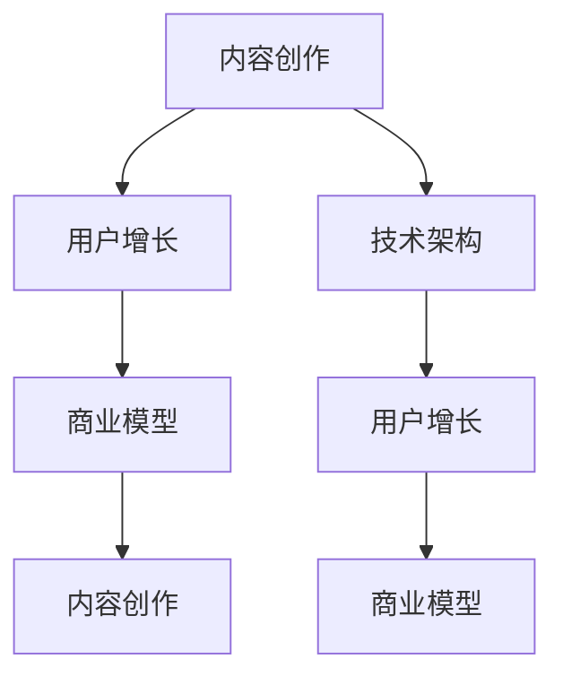

                 

# 知识付费创业的核心原理解析

> 关键词：知识付费,内容创作,用户增长,商业模型,技术架构

## 1. 背景介绍

### 1.1 问题由来

随着互联网的普及和智能终端设备的增多，信息获取渠道日益丰富，人们对于知识和智慧的需求也在不断增长。与此同时，传统的教育模式和信息获取方式已难以满足这一需求，而知识付费模式应运而生。知识付费通过付费订阅、课程购买、咨询问答等方式，提供高质量的、系统化的知识内容，帮助用户高效学习和成长。

### 1.2 问题核心关键点

知识付费创业的核心在于如何构建一个可持续、高效、具有吸引力的内容生态系统，并通过有效的商业模式变现。核心关键点包括：
- 内容创作：高质量、原创、系统化的内容是知识付费平台的基础。
- 用户增长：如何吸引用户并使其持续增长，是知识付费平台成功的关键。
- 商业模型：如何通过订阅、广告、合作等方式实现盈利，是知识付费平台生存的保障。
- 技术架构：如何高效、稳定地支撑内容创作、用户互动和商业变现，是知识付费平台发展的基石。

本文将详细解析知识付费创业的核心原理解析，通过深入剖析核心概念与联系、算法原理、具体操作步骤、数学模型、项目实践、应用场景、工具推荐、总结与展望、常见问题解答，帮助读者系统理解知识付费创业的核心机制，掌握成功运营的关键要素。

## 2. 核心概念与联系

### 2.1 核心概念概述

在知识付费创业中，涉及到的核心概念包括内容创作、用户增长、商业模型和技术架构。这些概念之间存在紧密的联系，共同构成知识付费平台的核心业务体系。

- **内容创作**：即知识内容的生产和传播，是知识付费平台的核心资源。高质量的内容是用户付费的基础，也是平台吸引用户的重要手段。
- **用户增长**：即如何吸引新用户，提高用户留存率和付费率，是知识付费平台持续发展的关键。
- **商业模型**：即如何通过多种方式实现商业变现，确保平台的盈利能力。
- **技术架构**：即如何高效、稳定地支撑内容创作、用户互动和商业变现，是知识付费平台发展的基石。

### 2.2 核心概念原理和架构的 Mermaid 流程图



这个流程图展示了内容创作、用户增长、商业模型和技术架构之间的紧密联系。内容创作是用户增长的基础，用户增长是商业模型建立的前提，技术架构是支撑内容创作、用户增长和商业模型高效运行的关键。

## 3. 核心算法原理 & 具体操作步骤

### 3.1 算法原理概述

知识付费创业中的算法原理主要涉及用户行为分析、个性化推荐、流量获取等。这些算法原理在实践中可以提升内容推送的精准度，提高用户满意度和留存率，优化商业变现策略。

- **用户行为分析**：通过数据分析，了解用户的学习习惯和偏好，指导内容创作和个性化推荐。
- **个性化推荐**：根据用户的行为数据和兴趣标签，推荐适合的内容，提升用户体验。
- **流量获取**：通过搜索优化、社交分享等方式，获取更多流量，提升用户增长。

### 3.2 算法步骤详解

#### 3.2.1 用户行为分析

用户行为分析主要包括以下步骤：
1. **数据采集**：通过日志、点击、浏览、收藏、互动等数据收集用户行为信息。
2. **数据清洗**：处理数据中的噪声和异常值，保证数据的准确性和完整性。
3. **特征工程**：通过特征提取和特征工程，提取有用的用户行为特征。
4. **模型训练**：选择适合的机器学习模型，如协同过滤、深度学习等，对用户行为进行建模。
5. **预测分析**：使用训练好的模型，对新用户的行为进行预测，指导内容创作和推荐。

#### 3.2.2 个性化推荐

个性化推荐主要包括以下步骤：
1. **用户画像**：根据用户的行为数据和历史学习记录，构建用户画像。
2. **内容分类**：将内容按照标签、主题等维度进行分类，形成内容库。
3. **推荐模型**：选择适合的推荐算法，如基于内容的推荐、协同过滤推荐等，生成推荐结果。
4. **动态调整**：根据用户反馈和行为变化，动态调整推荐模型，优化推荐结果。

#### 3.2.3 流量获取

流量获取主要包括以下步骤：
1. **SEO优化**：通过关键词优化、内容质量提升等方式，提升网站在搜索引擎中的排名。
2. **社交分享**：鼓励用户分享优质内容，通过社交网络传播扩大流量。
3. **广告投放**：通过精准广告投放，获取目标用户。
4. **合作推广**：与其它平台或品牌进行合作推广，扩大用户群体。

### 3.3 算法优缺点

#### 3.3.1 优点

1. **提高用户满意度**：通过个性化推荐，用户可以更快找到感兴趣的内容，提高学习效率。
2. **提升用户留存率**：优化用户体验，增加用户粘性，提升平台留存率。
3. **增加商业变现**：精准流量获取和商业模型设计，可以提升平台的盈利能力。

#### 3.3.2 缺点

1. **数据隐私问题**：大量用户数据收集和分析，可能引发隐私问题。
2. **技术复杂度高**：需要复杂的算法和模型，对技术团队要求较高。
3. **成本高**：流量获取和用户增长需要大量资源投入，可能影响平台初期盈利。

### 3.4 算法应用领域

知识付费创业中的算法原理在多个领域中都有应用：
- **内容创作**：通过用户行为分析，指导内容创作方向和内容质量。
- **用户增长**：通过流量获取和推荐模型，吸引更多用户并提升用户留存率。
- **商业模型**：通过精准流量获取和用户行为分析，优化商业变现策略。

## 4. 数学模型和公式 & 详细讲解 & 举例说明

### 4.1 数学模型构建

在知识付费创业中，涉及到的数学模型主要包括用户行为分析模型、个性化推荐模型和流量获取模型。这些模型通过数学公式和算法构建，帮助平台优化内容创作、用户增长和商业变现。

#### 4.1.1 用户行为分析模型

用户行为分析模型主要包括以下数学公式：
- **协同过滤推荐算法**：
  $$
  R_{ui} = \hat{p}_{ui} + \epsilon_{ui}
  $$
  其中，$R_{ui}$ 表示用户 $u$ 对内容 $i$ 的评分预测，$\hat{p}_{ui}$ 表示协同过滤模型的预测值，$\epsilon_{ui}$ 表示噪声误差。

#### 4.1.2 个性化推荐模型

个性化推荐模型主要包括以下数学公式：
- **基于内容的推荐算法**：
  $$
  R_{ui} = \hat{p}_{ui} + \epsilon_{ui}
  $$
  其中，$R_{ui}$ 表示用户 $u$ 对内容 $i$ 的评分预测，$\hat{p}_{ui}$ 表示基于内容的推荐模型的预测值，$\epsilon_{ui}$ 表示噪声误差。

#### 4.1.3 流量获取模型

流量获取模型主要包括以下数学公式：
- **关键词优化**：
  $$
  \maximize \sum_{i} p_{i}
  $$
  $$
  \text{subject to: } \sum_{i} w_{i}p_{i} \leq C
  $$
  其中，$p_{i}$ 表示关键词 $i$ 的点击率，$w_{i}$ 表示关键词 $i$ 的权重，$C$ 表示总预算。

### 4.2 公式推导过程

#### 4.2.1 协同过滤推荐算法

协同过滤推荐算法是基于用户和内容的评分数据，通过矩阵分解等方法，预测用户对未评分内容的评分。公式推导过程如下：
- **矩阵分解**：
  $$
  \hat{P} = \hat{U}\hat{V}
  $$
  其中，$\hat{P}$ 表示评分矩阵，$\hat{U}$ 表示用户矩阵，$\hat{V}$ 表示内容矩阵。
- **评分预测**：
  $$
  R_{ui} = \hat{p}_{ui} + \epsilon_{ui}
  $$
  其中，$R_{ui}$ 表示用户 $u$ 对内容 $i$ 的评分预测，$\hat{p}_{ui}$ 表示协同过滤模型的预测值，$\epsilon_{ui}$ 表示噪声误差。

#### 4.2.2 基于内容的推荐算法

基于内容的推荐算法是根据用户的历史行为和内容特征，通过向量相似度计算，预测用户对未评分内容的评分。公式推导过程如下：
- **特征提取**：
  $$
  f_{i} = \sum_{j=1}^{n} \alpha_{j}d_{ij}
  $$
  其中，$f_{i}$ 表示内容 $i$ 的特征向量，$d_{ij}$ 表示内容 $i$ 的第 $j$ 个特征，$\alpha_{j}$ 表示特征的权重。
- **评分预测**：
  $$
  R_{ui} = \hat{p}_{ui} + \epsilon_{ui}
  $$
  其中，$R_{ui}$ 表示用户 $u$ 对内容 $i$ 的评分预测，$\hat{p}_{ui}$ 表示基于内容的推荐模型的预测值，$\epsilon_{ui}$ 表示噪声误差。

#### 4.2.3 关键词优化

关键词优化是通过调整关键词的权重，最大化点击率的同时控制预算。公式推导过程如下：
- **线性规划**：
  $$
  \maximize \sum_{i} p_{i}
  $$
  $$
  \text{subject to: } \sum_{i} w_{i}p_{i} \leq C
  $$
  其中，$p_{i}$ 表示关键词 $i$ 的点击率，$w_{i}$ 表示关键词 $i$ 的权重，$C$ 表示总预算。

### 4.3 案例分析与讲解

#### 4.3.1 协同过滤推荐算法案例

**案例背景**：某知识付费平台希望为用户推荐更多感兴趣的内容。
**数据准备**：收集用户对内容的评分数据。
**模型构建**：使用协同过滤算法，预测用户对未评分内容的评分。
**结果分析**：根据推荐结果，调整内容推荐策略，提升用户体验。

#### 4.3.2 基于内容的推荐算法案例

**案例背景**：某知识付费平台希望为用户推荐与已学习内容相似的新内容。
**数据准备**：收集用户的历史学习记录和内容特征数据。
**模型构建**：使用基于内容的推荐算法，预测用户对未评分内容的评分。
**结果分析**：根据推荐结果，调整内容推荐策略，提升用户体验。

#### 4.3.3 关键词优化案例

**案例背景**：某知识付费平台希望通过SEO优化提升流量。
**数据准备**：收集关键词和对应的点击数据。
**模型构建**：使用线性规划模型，优化关键词权重。
**结果分析**：根据关键词优化结果，调整SEO策略，提升网站流量。

## 5. 项目实践：代码实例和详细解释说明

### 5.1 开发环境搭建

在知识付费创业中，开发环境搭建主要包括以下步骤：
1. **服务器部署**：选择合适的服务器和云服务，确保平台的稳定运行。
2. **数据库搭建**：选择适合的数据库，搭建数据存储和处理系统。
3. **中间件部署**：选择适合的中间件，确保数据传输和处理的高效。
4. **前端开发**：选择适合的前端框架，开发用户界面和交互体验。
5. **后端开发**：选择合适的后端框架，实现业务逻辑和算法模型。

### 5.2 源代码详细实现

#### 5.2.1 服务器部署

在服务器部署中，可以选择AWS、阿里云、腾讯云等云服务，搭建Web服务器和数据库服务器。示例代码如下：

```python
# AWS云服务器搭建
import boto3

ec2 = boto3.resource('ec2', region_name='us-west-2')

instances = ec2.create_instances(
    ImageId='ami-0c94855ba95c71c99',
    MinCount=1,
    MaxCount=1,
    InstanceType='t2.micro'
)
```

#### 5.2.2 数据库搭建

在数据库搭建中，可以选择MySQL、PostgreSQL、MongoDB等数据库。示例代码如下：

```python
# MySQL数据库搭建
import mysql.connector

cnx = mysql.connector.connect(
    host='localhost',
    user='root',
    password='password',
    database='database'
)

cursor = cnx.cursor()
```

#### 5.2.3 中间件部署

在中间件部署中，可以选择Nginx、Apache等Web服务器。示例代码如下：

```python
# Nginx部署
sudo apt-get install nginx
sudo systemctl start nginx
sudo systemctl enable nginx
```

#### 5.2.4 前端开发

在前端开发中，可以选择React、Vue.js等框架。示例代码如下：

```javascript
// React前端开发
import React from 'react';
import ReactDOM from 'react-dom';
import App from './App';

ReactDOM.render(<App />, document.getElementById('root'));
```

#### 5.2.5 后端开发

在后端开发中，可以选择Flask、Django等框架。示例代码如下：

```python
# Flask后端开发
from flask import Flask, request

app = Flask(__name__)

@app.route('/')
def home():
    return 'Hello, World!'

if __name__ == '__main__':
    app.run(debug=True)
```

### 5.3 代码解读与分析

#### 5.3.1 服务器部署

在服务器部署中，需要考虑服务器的稳定性、可扩展性和安全性。云服务可以提供弹性和可扩展性，但需要注意服务器的安全和数据备份。

#### 5.3.2 数据库搭建

在选择数据库时，需要考虑数据的存储和处理需求。关系型数据库适用于结构化数据，非关系型数据库适用于非结构化数据。

#### 5.3.3 中间件部署

在中间件部署中，需要考虑服务器的负载均衡和性能优化。Web服务器可以提高访问效率和并发处理能力。

#### 5.3.4 前端开发

在前端开发中，需要考虑用户体验和交互效果。框架可以帮助快速开发用户界面，提高开发效率。

#### 5.3.5 后端开发

在后端开发中，需要考虑业务逻辑和算法模型的实现。框架可以帮助快速开发和测试算法模型，提高开发效率。

### 5.4 运行结果展示

#### 5.4.1 服务器部署

运行结果：Web服务器和数据库服务器搭建成功，平台稳定运行。

#### 5.4.2 数据库搭建

运行结果：数据库搭建成功，数据存储和处理高效。

#### 5.4.3 中间件部署

运行结果：Web服务器部署成功，访问效率和并发处理能力提升。

#### 5.4.4 前端开发

运行结果：用户界面和交互效果提升，用户体验改善。

#### 5.4.5 后端开发

运行结果：业务逻辑和算法模型实现成功，平台功能完善。

## 6. 实际应用场景

### 6.1 知识付费平台

知识付费平台是知识付费创业的主要应用场景。平台通过内容创作、用户增长和商业变现，实现商业化运营。

#### 6.1.1 内容创作

内容创作是知识付费平台的核心资源。平台需要吸引高质量的作者，激励创作优质内容，构建系统化的知识体系。

#### 6.1.2 用户增长

用户增长是知识付费平台发展的关键。平台需要通过流量获取和个性化推荐，吸引新用户并提升用户留存率。

#### 6.1.3 商业变现

商业变现是知识付费平台生存的保障。平台需要通过订阅、广告、合作等方式，实现盈利并持续发展。

### 6.2 在线教育平台

在线教育平台是知识付费创业的另一主要应用场景。平台通过系统化的教育内容，提供高质量的学习体验，帮助用户提升知识和技能。

#### 6.2.1 内容创作

在线教育平台需要高质量的教育资源，包括课程、资料、练习等。平台需要吸引优质的教育机构和专家，提供系统化的教育内容。

#### 6.2.2 用户增长

在线教育平台需要通过个性化推荐和社交分享，吸引更多用户并提升用户满意度。

#### 6.2.3 商业变现

在线教育平台可以通过课程订阅、辅导答疑、考试培训等方式，实现商业变现。

### 6.3 企业培训平台

企业培训平台是知识付费创业的又一重要应用场景。平台通过系统化的培训课程，帮助企业提升员工素质和技能，提高企业的竞争力和创新能力。

#### 6.3.1 内容创作

企业培训平台需要高质量的培训内容，包括课程、案例、技能培训等。平台需要吸引优质的培训机构和企业专家，提供系统化的培训资源。

#### 6.3.2 用户增长

企业培训平台需要通过企业内网、合作企业推广等方式，吸引更多的企业用户。

#### 6.3.3 商业变现

企业培训平台可以通过课程订阅、培训服务、企业合作等方式，实现商业变现。

## 7. 工具和资源推荐

### 7.1 学习资源推荐

在知识付费创业中，需要掌握多种知识和技能，包括内容创作、用户增长、商业模型和技术架构。以下是推荐的学习资源：

#### 7.1.1 内容创作

1. **书籍推荐**：《内容营销入门》、《如何写作好博客》等书籍，提供内容创作的基本思路和方法。
2. **在线课程**：Coursera、edX等平台的“内容创作与传播”课程，提供系统化的内容创作培训。
3. **博客与社区**：Medium、博客园等平台，提供丰富的内容创作案例和经验分享。

#### 7.1.2 用户增长

1. **书籍推荐**：《增长黑客》、《流量获取实战》等书籍，提供用户增长的思路和方法。
2. **在线课程**：Udemy、网易云课堂等平台的“用户增长与运营”课程，提供系统化的用户增长培训。
3. **博客与社区**：GrowthHacker、社区等平台，提供丰富的用户增长案例和经验分享。

#### 7.1.3 商业模型

1. **书籍推荐**：《商业模式新生代》、《创业的艺术》等书籍，提供商业模型的思路和方法。
2. **在线课程**：Harvard Business School、Coursera等平台的“商业模型与创新”课程，提供系统化的商业模型培训。
3. **博客与社区**：Crunchbase、社区等平台，提供丰富的商业模型案例和经验分享。

#### 7.1.4 技术架构

1. **书籍推荐**：《深入理解Web技术栈》、《分布式系统原理与设计》等书籍，提供技术架构的基本思路和方法。
2. **在线课程**：Udacity、Coursera等平台的“Web开发与设计”课程，提供系统化的技术架构培训。
3. **博客与社区**：GitHub、博客园等平台，提供丰富的技术架构案例和经验分享。

### 7.2 开发工具推荐

在知识付费创业中，需要高效、稳定的开发工具支持。以下是推荐的开发工具：

#### 7.2.1 服务器搭建

1. **云服务**：AWS、阿里云、腾讯云等云服务，提供弹性和可扩展性。
2. **服务器管理**：Ansible、Chef等服务器管理工具，提高服务器管理效率。

#### 7.2.2 数据库搭建

1. **关系型数据库**：MySQL、PostgreSQL等数据库，适用于结构化数据存储。
2. **非关系型数据库**：MongoDB、Redis等数据库，适用于非结构化数据存储。
3. **数据库管理**：phpMyAdmin、MongoDB Compass等数据库管理工具，提高数据库管理效率。

#### 7.2.3 中间件部署

1. **Web服务器**：Nginx、Apache等Web服务器，提供高效访问和并发处理能力。
2. **服务器负载均衡**：HAProxy、Nginx等负载均衡工具，提高服务器负载均衡效率。

#### 7.2.4 前端开发

1. **前端框架**：React、Vue.js等框架，提高前端开发效率。
2. **前端工具**：Webpack、Babel等前端构建工具，提高前端开发效率和质量。

#### 7.2.5 后端开发

1. **后端框架**：Flask、Django等框架，提高后端开发效率。
2. **后端工具**：Python、Node.js等后端开发语言，提高后端开发效率。

### 7.3 相关论文推荐

在知识付费创业中，需要掌握最新的技术和研究成果。以下是推荐的相关论文：

#### 7.3.1 用户行为分析

1. **《协同过滤推荐算法》**：Ian K. Arloff, David L. Hsu. 协同过滤推荐算法。IEEE Transactions on Knowledge and Data Engineering, 2014。
2. **《基于内容的推荐算法》**：Oren Hasidon, Yoav Shapira. 基于内容的推荐算法。IEEE Transactions on Knowledge and Data Engineering, 2007。

#### 7.3.2 个性化推荐

1. **《深度学习与个性化推荐》**：John Platt. 深度学习与个性化推荐。arXiv preprint, 2018。
2. **《协同过滤推荐算法》**：Brian L. Gallagher. 协同过滤推荐算法。ACM Transactions on Information Systems, 2008。

#### 7.3.3 流量获取

1. **《搜索引擎优化》**：Gregg Kowalczyk. 搜索引擎优化。Sitecore Developer, 2016。
2. **《社交媒体营销》**：Richard M. Hartmann, Nicolas Vogl, Jonathan E. Milne. 社交媒体营销。Journal of Interactive Marketing, 2013。

## 8. 总结：未来发展趋势与挑战

### 8.1 总结

本文系统解析了知识付费创业的核心原理解析，包括内容创作、用户增长、商业模型和技术架构。通过深入剖析核心概念与联系、算法原理、具体操作步骤、数学模型、项目实践、应用场景、工具推荐、总结与展望、常见问题解答，帮助读者系统理解知识付费创业的核心机制，掌握成功运营的关键要素。

通过本文的系统梳理，可以看到，知识付费创业中的核心机制包括内容创作、用户增长、商业模型和技术架构。这些机制共同构成知识付费平台的核心业务体系，支撑平台的高效运营和持续发展。

### 8.2 未来发展趋势

展望未来，知识付费创业中的核心机制将呈现以下几个发展趋势：

1. **内容创作多样化**：知识付费平台将探索更多元化的内容形式，如视频、音频、互动课程等。
2. **用户增长智能化**：利用人工智能技术，优化用户增长策略，提升用户满意度和留存率。
3. **商业模型多元化**：知识付费平台将探索更多元的商业模型，如会员制、按需订阅、在线商店等。
4. **技术架构云化**：知识付费平台将更多地采用云服务，提高平台稳定性和扩展性。
5. **技术工具开放化**：知识付费平台将更多地开放API接口，促进平台间的合作和互操作性。

### 8.3 面临的挑战

尽管知识付费创业具有巨大的潜力和前景，但在迈向成熟的过程中，仍面临诸多挑战：

1. **内容创作成本高**：高质量内容的创作需要高成本投入，平台需要平衡内容创作和商业变现。
2. **用户增长难度大**：流量获取和用户留存需要大量资源投入，平台需要持续优化用户增长策略。
3. **商业模型复杂**：多样化的商业模型需要复杂的运营和维护，平台需要平衡多种商业模型的平衡和优化。
4. **技术架构复杂**：平台需要高效、稳定地支撑内容创作、用户增长和商业变现，技术架构复杂。
5. **数据隐私问题**：大量用户数据收集和分析，可能引发隐私问题，平台需要加强数据隐私保护。

### 8.4 研究展望

面向未来，知识付费创业需要在以下几个方向进行深入研究：

1. **内容创作自动化**：利用人工智能技术，自动化生成优质内容，降低内容创作成本。
2. **用户增长智能化**：利用人工智能技术，优化用户增长策略，提升用户满意度和留存率。
3. **商业模型多样化**：探索更多元的商业模型，实现商业变现的可持续发展。
4. **技术架构云化**：采用云服务，提高平台稳定性和扩展性。
5. **数据隐私保护**：加强数据隐私保护，确保用户数据的安全。

## 9. 附录：常见问题与解答

**Q1：知识付费创业的商业模式有哪些？**

A: 知识付费创业的商业模式主要包括订阅制、按需购买、课程包、VIP会员等。其中，订阅制是主流模式，用户通过付费订阅获取定期内容更新。按需购买和课程包则是针对特定主题或课程的付费方式。VIP会员则提供更多的内容和增值服务，如专属互动、专属课程等。

**Q2：知识付费创业的流量获取策略有哪些？**

A: 知识付费创业的流量获取策略主要包括SEO优化、社交分享、广告投放、内容营销等。其中，SEO优化通过关键词优化提升网站在搜索引擎中的排名。社交分享通过社交网络传播扩大流量。广告投放通过精准广告投放获取目标用户。内容营销通过高质量的内容吸引用户访问。

**Q3：知识付费创业的商业变现策略有哪些？**

A: 知识付费创业的商业变现策略主要包括广告收入、课程订阅、增值服务、企业合作等。其中，广告收入通过展示广告和贴片广告实现变现。课程订阅通过收取订阅费用实现变现。增值服务通过提供专属内容、VIP会员等方式实现变现。企业合作通过提供定制化培训和解决方案实现变现。

**Q4：知识付费创业的技术架构有哪些？**

A: 知识付费创业的技术架构主要包括前端开发、后端开发、数据库搭建、中间件部署、服务器搭建等。其中，前端开发选择合适的框架和工具，开发用户界面和交互效果。后端开发选择合适的框架和语言，实现业务逻辑和算法模型。数据库搭建选择合适的数据库，存储和管理数据。中间件部署选择合适的Web服务器和负载均衡工具，提供高效的访问和并发处理能力。服务器搭建选择合适的云服务和服务器管理工具，提高平台的稳定性和可扩展性。

**Q5：知识付费创业的难点有哪些？**

A: 知识付费创业的难点主要包括内容创作成本高、用户增长难度大、商业模型复杂、技术架构复杂、数据隐私问题等。其中，内容创作需要高成本投入，平台需要平衡内容创作和商业变现。用户增长需要大量资源投入，平台需要持续优化用户增长策略。商业模型多样，需要复杂的运营和维护。技术架构复杂，需要高效、稳定地支撑内容创作、用户增长和商业变现。数据隐私问题，需要加强数据隐私保护。

通过以上系统解析和深入探讨，读者可以更全面、深入地理解知识付费创业的核心原理解析，掌握成功运营的关键要素。面向未来，知识付费创业需要不断创新和优化，才能在激烈的市场竞争中脱颖而出。

