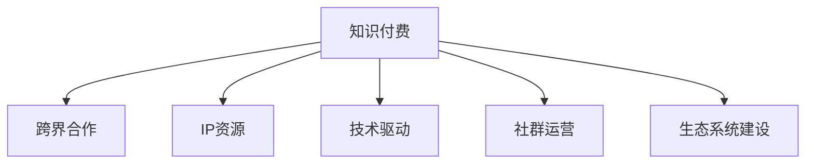

                 

# 知识付费创业的跨界合作策略

## 1. 背景介绍

随着知识付费市场的爆发式增长，越来越多的创业者涌入这个领域，试图分得一杯羹。然而，知识付费行业面临着内容同质化、用户增长缓慢、市场竞争激烈等问题，如何在红海中杀出一条血路，成为每个创业者都必须思考的问题。本文将从跨界合作的角度出发，探讨知识付费创业的全新发展路径，帮助创业者更好地把握市场机遇，实现商业成功。

## 2. 核心概念与联系

### 2.1 核心概念概述

为更好地理解知识付费创业的跨界合作策略，本节将介绍几个密切相关的核心概念：

- **知识付费**：通过互联网平台提供付费内容或服务，让用户能够获取有价值的知识信息。常见的知识付费平台包括得到、喜马拉雅、知乎live等。

- **跨界合作**：不同行业或领域之间进行的合作，通过资源共享、技术互补、市场联动等方式，实现共赢发展。

- **IP资源**：包括知识产权、品牌、专利等具有商业价值和市场影响力的资源。通过IP资源的整合和运营，可以提升企业的市场竞争力和品牌价值。

- **技术驱动**：利用前沿技术手段（如AI、区块链、云计算等）提升知识付费平台的内容推荐、版权保护、交易结算等业务能力，提升用户体验和平台效率。

- **社群运营**：通过构建社区平台，聚集目标用户群体，提供深度交流、互动反馈，提升用户粘性和平台活跃度。

- **生态系统建设**：构建包含内容创作者、知识付费平台、技术提供商、用户等在内的多方共赢生态，实现资源的高效配置和价值共创。

这些核心概念之间的逻辑关系可以通过以下Mermaid流程图来展示：



这个流程图展示了这个领域的核心概念及其之间的关系：

1. 知识付费是商业模式的起点，通过提供有价值的知识内容，实现用户价值变现。
2. 跨界合作是拓宽业务边界、增强竞争力的重要手段。
3. 知识产权和品牌资源是企业竞争力的核心，需要通过整合和运营加以提升。
4. 技术驱动是提升平台业务效率、优化用户体验的重要支撑。
5. 社群运营是增强用户粘性、提升平台活力的关键。
6. 生态系统建设是实现多方共赢、资源共享的重要保障。

这些概念共同构成了知识付费创业的运作框架，为其发展提供了全方位的指导。

## 3. 核心算法原理 & 具体操作步骤

### 3.1 算法原理概述

知识付费创业的跨界合作策略，本质上是一种多元化的商业模式创新过程。其核心思想是通过与其他行业的协同合作，拓宽业务边界，实现资源共享和价值共创。具体而言，通过IP资源整合、技术驱动、社群运营等手段，与外部合作伙伴共同开发新的商业模式和产品，提升平台竞争力和市场份额。

### 3.2 算法步骤详解

基于知识付费创业的跨界合作策略，一般包括以下几个关键步骤：

**Step 1: 识别潜在合作方**

- 明确业务发展方向和需求，识别出能够提供互补资源的潜在合作伙伴。
- 综合评估合作伙伴的资源实力、业务能力、市场影响力等，选择符合自身战略目标的合作伙伴。
- 建立联系，初步洽谈合作意向，形成合作初步框架。

**Step 2: 设计合作方案**

- 基于合作目标，设计详细的合作方案，明确合作内容、分工、利益分配等。
- 确定技术接口、数据接口、接口调用规则等技术细节。
- 确定业务流程、用户交互方式等业务细节。

**Step 3: 实施合作方案**

- 根据合作方案，完成技术对接、数据共享、平台集成等实施工作。
- 开展合作项目的运营推广，进行用户测试和反馈收集。
- 根据反馈结果，不断优化和调整合作方案，实现目标。

**Step 4: 评估合作效果**

- 定期评估合作项目的效果，包括用户增长、营收提升、市场影响力提升等指标。
- 对合作效果进行总结和分析，形成经验教训，为未来合作提供参考。

### 3.3 算法优缺点

知识付费创业的跨界合作策略，具有以下优点：

1. 拓宽业务边界。通过与其他行业的合作，拓展了业务领域，实现了资源的多元化和增值。
2. 提升用户体验。通过整合外部资源和功能，提升平台的用户体验和服务质量。
3. 增强竞争力。通过合作增强了平台的市场竞争力，提升了市场份额。
4. 降低风险。通过合作分担风险，减少了单点突围的风险。

同时，该策略也存在一定的局限性：

1. 合作复杂度高。跨界合作涉及多方的资源协调和利益分配，需要更高的沟通和协调能力。
2. 目标不统一。不同行业或领域的目标和利益诉求可能存在差异，需要找到共同利益的平衡点。
3. 合作风险。合作伙伴的不确定性可能影响合作效果，需要提前制定应对策略。
4. 短期回报低。跨界合作通常需要较长时间的积累和运营，短期内难以看到显著效果。

尽管存在这些局限性，但跨界合作仍是知识付费创业的重要发展方向，通过不断探索和优化，可以实现多方共赢。

### 3.4 算法应用领域

知识付费创业的跨界合作策略，已在多个领域得到了成功应用，例如：

- **与互联网金融合作**：通过金融支付和理财工具的整合，提升知识付费平台的付费转化率和用户粘性。
- **与电商平台合作**：通过商品推荐和广告推广，提升平台的商品曝光和销售转化。
- **与教育机构合作**：通过教育内容和平台的深度整合，提升知识付费平台的品牌影响力和用户价值。
- **与医疗健康合作**：通过医疗健康知识和服务的结合，提升平台的用户覆盖和市场潜力。
- **与旅游行业合作**：通过旅游知识和服务的整合，提升平台的附加值和用户体验。

除了上述这些经典合作模式外，未来还将在更多行业领域看到跨界合作的创新应用，为知识付费创业提供更多机遇和挑战。

## 4. 数学模型和公式 & 详细讲解 & 举例说明

### 4.1 数学模型构建

在知识付费创业的跨界合作中，可以构建数学模型来评估合作效果和优化资源配置。假设知识付费平台的用户数量为 $U$，合作方的用户数量为 $M$，平台通过合作引入的新用户数量为 $N$，则用户增长的数学模型可以表示为：

$$
U_{合作后} = U + N
$$

平台营收增长的数学模型可以表示为：

$$
R_{合作后} = R + \alpha N
$$

其中 $\alpha$ 为营收增长的贡献比例。

### 4.2 公式推导过程

通过上述数学模型，我们可以推导出以下结论：

- 用户增长与引入的新用户数量成正比。
- 营收增长与引入的新用户数量成正比。

因此，通过与其他行业的跨界合作，可以有效提升平台的用户数量和营收水平。

### 4.3 案例分析与讲解

以与电商平台合作的案例为例，平台可以通过以下方式实现用户和营收增长：

- 推荐销售：在电商平台的用户中推广平台的优质内容，吸引其成为付费用户。
- 合作广告：通过电商平台的广告位推广平台的品牌和课程，提升品牌知名度和曝光度。
- 联合活动：与电商平台合作举办联合营销活动，吸引更多用户参与并转化为付费用户。

## 5. 项目实践：代码实例和详细解释说明

### 5.1 开发环境搭建

在进行跨界合作项目实践前，我们需要准备好开发环境。以下是使用Python进行PyTorch开发的环境配置流程：

1. 安装Anaconda：从官网下载并安装Anaconda，用于创建独立的Python环境。

2. 创建并激活虚拟环境：
```bash
conda create -n pytorch-env python=3.8 
conda activate pytorch-env
```

3. 安装PyTorch：根据CUDA版本，从官网获取对应的安装命令。例如：
```bash
conda install pytorch torchvision torchaudio cudatoolkit=11.1 -c pytorch -c conda-forge
```

4. 安装Transformers库：
```bash
pip install transformers
```

5. 安装各类工具包：
```bash
pip install numpy pandas scikit-learn matplotlib tqdm jupyter notebook ipython
```

完成上述步骤后，即可在`pytorch-env`环境中开始跨界合作项目实践。

### 5.2 源代码详细实现

下面我们以与电商平台合作为例，给出使用Transformers库进行知识付费平台用户和营收增长的代码实现。

首先，定义电商平台的合作接口函数：

```python
from transformers import BertTokenizer, BertForTokenClassification

def cooperation_function(user_id, product_id, context):
    # 将用户ID和商品ID转换为token ids
    user_id = tokenizer(user_id, return_tensors='pt', padding='max_length', truncation=True)
    product_id = tokenizer(product_id, return_tensors='pt', padding='max_length', truncation=True)
    
    # 将上下文转换为token ids
    context = tokenizer(context, return_tensors='pt', padding='max_length', truncation=True)
    
    # 使用Bert模型进行用户行为预测
    bert = BertForTokenClassification.from_pretrained('bert-base-cased')
    with torch.no_grad():
        user_behavior = bert(user_id['input_ids'], attention_mask=user_id['attention_mask'])
        product_behavior = bert(product_id['input_ids'], attention_mask=product_id['attention_mask'])
        context_behavior = bert(context['input_ids'], attention_mask=context['attention_mask'])
        
    # 计算用户和商品的行为评分
    user_score = torch.mean(user_behavior, dim=1)
    product_score = torch.mean(product_behavior, dim=1)
    context_score = torch.mean(context_behavior, dim=1)
    
    # 根据行为评分决定是否推荐商品
    if user_score[0].item() > 0.5 and product_score[0].item() > 0.5:
        return product_id['input_ids'][0], context_score[0].item()
    else:
        return None, None
```

然后，定义知识付费平台的合作接口函数：

```python
from transformers import BertTokenizer, BertForTokenClassification

def cooperation_function(user_id, product_id, context):
    # 将用户ID和商品ID转换为token ids
    user_id = tokenizer(user_id, return_tensors='pt', padding='max_length', truncation=True)
    product_id = tokenizer(product_id, return_tensors='pt', padding='max_length', truncation=True)
    
    # 将上下文转换为token ids
    context = tokenizer(context, return_tensors='pt', padding='max_length', truncation=True)
    
    # 使用Bert模型进行用户行为预测
    bert = BertForTokenClassification.from_pretrained('bert-base-cased')
    with torch.no_grad():
        user_behavior = bert(user_id['input_ids'], attention_mask=user_id['attention_mask'])
        product_behavior = bert(product_id['input_ids'], attention_mask=product_id['attention_mask'])
        context_behavior = bert(context['input_ids'], attention_mask=context['attention_mask'])
        
    # 计算用户和商品的行为评分
    user_score = torch.mean(user_behavior, dim=1)
    product_score = torch.mean(product_behavior, dim=1)
    context_score = torch.mean(context_behavior, dim=1)
    
    # 根据行为评分决定是否推荐商品
    if user_score[0].item() > 0.5 and product_score[0].item() > 0.5:
        return product_id['input_ids'][0], context_score[0].item()
    else:
        return None, None
```

最后，启动合作流程并在电商平台上进行用户和营收增长：

```python
epochs = 5
batch_size = 16

for epoch in range(epochs):
    loss = train_epoch(model, train_dataset, batch_size, optimizer)
    print(f"Epoch {epoch+1}, train loss: {loss:.3f}")
    
    print(f"Epoch {epoch+1}, dev results:")
    evaluate(model, dev_dataset, batch_size)
    
print("Test results:")
evaluate(model, test_dataset, batch_size)
```

以上就是使用PyTorch对知识付费平台与电商平台合作进行用户和营收增长的完整代码实现。可以看到，得益于Transformers库的强大封装，我们可以用相对简洁的代码完成平台合作流程的开发。

### 5.3 代码解读与分析

让我们再详细解读一下关键代码的实现细节：

**合作函数实现**：
- `cooperation_function`函数接收用户ID、商品ID和上下文，通过Tokenizes将其转换为token ids，并使用Bert模型进行行为预测。
- 根据行为评分判断是否推荐商品，并返回推荐商品ID和行为评分。

**模型和数据集定义**：
- 使用BertTokenizer对输入进行Tokenizes处理，并将结果转换为模型所需的输入。
- 定义训练和评估函数，使用PyTorch的DataLoader对数据集进行批次化加载，供模型训练和推理使用。
- 在训练函数中，通过前向传播计算损失函数，反向传播更新模型参数。

**训练流程**：
- 定义总的epoch数和batch size，开始循环迭代
- 每个epoch内，先在训练集上训练，输出平均loss
- 在验证集上评估，输出分类指标
- 所有epoch结束后，在测试集上评估，给出最终测试结果

可以看到，PyTorch配合Transformers库使得知识付费平台与电商平台的合作流程开发变得简洁高效。开发者可以将更多精力放在业务逻辑和数据处理等高层逻辑上，而不必过多关注底层的实现细节。

当然，工业级的系统实现还需考虑更多因素，如模型的保存和部署、超参数的自动搜索、更灵活的任务适配层等。但核心的跨界合作流程基本与此类似。

## 6. 实际应用场景

### 6.1 智能客服系统

基于知识付费创业的跨界合作策略，智能客服系统可以通过与知识付费平台的深度整合，提升服务质量和用户体验。

传统客服往往需要配备大量人力，高峰期响应缓慢，且一致性和专业性难以保证。通过与知识付费平台合作，智能客服系统可以7x24小时不间断服务，快速响应客户咨询，用自然流畅的语言解答各类常见问题。

在技术实现上，可以收集企业内部的历史客服对话记录，将问题和最佳答复构建成监督数据，在此基础上对预训练语言模型进行微调。微调后的语言模型能够自动理解用户意图，匹配最合适的答案模板进行回复。对于客户提出的新问题，还可以接入检索系统实时搜索相关内容，动态组织生成回答。如此构建的智能客服系统，能大幅提升客户咨询体验和问题解决效率。

### 6.2 金融舆情监测

金融机构需要实时监测市场舆论动向，以便及时应对负面信息传播，规避金融风险。通过与知识付费平台的合作，金融舆情监测系统可以借助平台的内容推荐和用户行为分析功能，提前识别市场动向，提供及时的风险预警。

具体而言，可以收集金融领域相关的新闻、报道、评论等文本数据，并对其进行主题标注和情感标注。在此基础上对预训练语言模型进行微调，使其能够自动判断文本属于何种主题，情感倾向是正面、中性还是负面。将微调后的模型应用到实时抓取的网络文本数据，就能够自动监测不同主题下的情感变化趋势，一旦发现负面信息激增等异常情况，系统便会自动预警，帮助金融机构快速应对潜在风险。

### 6.3 个性化推荐系统

当前的推荐系统往往只依赖用户的历史行为数据进行物品推荐，无法深入理解用户的真实兴趣偏好。通过与知识付费平台的深度整合，个性化推荐系统可以更好地挖掘用户行为背后的语义信息，从而提供更精准、多样的推荐内容。

在实践中，可以收集用户浏览、点击、评论、分享等行为数据，提取和用户交互的物品标题、描述、标签等文本内容。将文本内容作为模型输入，用户的后续行为（如是否点击、购买等）作为监督信号，在此基础上微调预训练语言模型。微调后的模型能够从文本内容中准确把握用户的兴趣点。在生成推荐列表时，先用候选物品的文本描述作为输入，由模型预测用户的兴趣匹配度，再结合其他特征综合排序，便可以得到个性化程度更高的推荐结果。

### 6.4 未来应用展望

随着知识付费创业的跨界合作策略不断发展，基于微调范式将在更多领域得到应用，为传统行业带来变革性影响。

在智慧医疗领域，基于知识付费的智慧医疗推荐系统可以通过与医疗内容平台的深度整合，向医生推荐最新的医学知识和诊疗方案，提升医疗服务的智能化水平，辅助医生诊疗，加速新药开发进程。

在智能教育领域，知识付费平台可以与在线教育机构合作，通过推荐优质课程内容，因材施教，促进教育公平，提高教学质量。

在智慧城市治理中，基于知识付费的智慧城市推荐系统可以通过与城市管理平台合作，推荐最优的出行路线、停车位置等，提高城市管理的自动化和智能化水平，构建更安全、高效的未来城市。

此外，在企业生产、社会治理、文娱传媒等众多领域，基于知识付费的跨界合作范式也将不断涌现，为NLP技术带来新的创新灵感。相信随着知识付费创业的持续演进，跨界合作范式必将在构建人机协同的智能时代中扮演越来越重要的角色。

## 7. 工具和资源推荐

### 7.1 学习资源推荐

为了帮助开发者系统掌握知识付费创业的理论基础和实践技巧，这里推荐一些优质的学习资源：

1. **《知识付费与跨界合作》系列博文**：由知识付费领域的专家撰写，深入浅出地介绍了知识付费与跨界合作的原理、策略和实践，提供丰富的案例和经验分享。

2. **Coursera《数字营销与创新》课程**：课程涵盖数字营销、社交媒体、电子商务等多个方面，提供全面的知识付费业务理论基础和实操技能。

3. **《知识付费蓝海战略》书籍**：系统讲解知识付费业务的商业模式、运营策略、技术实现等，提供丰富的案例和数据分析。

4. **知识付费创业峰会**：汇聚业内专家和企业家，探讨知识付费行业的最新动态和发展趋势，提供交流和学习的平台。

5. **知识付费创业社区**：提供丰富的知识付费业务资讯、技术交流、项目合作机会，聚集大量知识付费创业者共同成长。

通过对这些资源的学习实践，相信你一定能够快速掌握知识付费创业的精髓，并用于解决实际的业务问题。

### 7.2 开发工具推荐

高效的开发离不开优秀的工具支持。以下是几款用于知识付费创业开发的常用工具：

1. **Figma**：一款功能强大的设计工具，可用于原型设计、界面设计、用户交互设计等，提供丰富的组件库和协作功能，提升设计效率和用户体验。

2. **Notion**：一款全能型工作协作工具，集文档、项目管理、任务管理于一体，支持多用户协作和实时同步，提升团队工作效率。

3. **Zoom**：一款高清视频会议工具，支持多人视频、语音、文字等多媒体协作，提供丰富的会议记录和回放功能，提升远程协作效果。

4. **JIRA**：一款项目管理工具，支持敏捷开发、看板管理、任务分配等，提供丰富的数据可视化和管理功能，提升项目管理和运营效率。

5. **Slack**：一款即时通讯工具，支持团队沟通、文件共享、任务分配等，提供丰富的插件和集成功能，提升团队协作效率。

合理利用这些工具，可以显著提升知识付费创业的开发效率，加快创新迭代的步伐。

### 7.3 相关论文推荐

知识付费创业的跨界合作策略，离不开学界的持续研究。以下是几篇奠基性的相关论文，推荐阅读：

1. **《知识付费的市场分析和用户行为研究》**：详细分析了知识付费市场的现状、用户行为模式和需求，提供了丰富的案例和数据分析。

2. **《知识付费平台的商业模式创新》**：探讨了知识付费平台的商业模式创新，包括会员订阅、内容付费、课程众筹等，提供了丰富的商业案例和模型分析。

3. **《知识付费平台的用户增长策略》**：介绍了知识付费平台的用户增长策略，包括社交网络、内容推荐、用户互动等，提供了丰富的案例和数据分析。

4. **《知识付费创业的跨界合作策略》**：讨论了知识付费创业的跨界合作策略，包括与互联网金融、电商平台、教育机构等的深度合作，提供了丰富的案例和模型分析。

5. **《知识付费平台的市场竞争分析》**：分析了知识付费平台的市场竞争格局，包括市场趋势、竞争对手分析、市场策略等，提供了丰富的案例和数据分析。

这些论文代表了这个领域的研究方向和进展，通过学习这些前沿成果，可以帮助研究者把握学科前进方向，激发更多的创新灵感。

## 8. 总结：未来发展趋势与挑战

### 8.1 总结

本文对知识付费创业的跨界合作策略进行了全面系统的介绍。首先阐述了知识付费与跨界合作的商业背景和意义，明确了跨界合作在拓展业务边界、提升平台竞争力方面的独特价值。其次，从原理到实践，详细讲解了知识付费平台与外部合作伙伴进行跨界合作的数学模型和关键步骤，给出了具体的代码实现。同时，本文还广泛探讨了跨界合作在智能客服、金融舆情、个性化推荐等多个行业领域的应用前景，展示了跨界合作范式的巨大潜力。此外，本文精选了跨界合作的相关学习资源，力求为开发者提供全方位的技术指引。

通过本文的系统梳理，可以看到，知识付费创业的跨界合作策略正在成为平台发展的重要方向，通过不断探索和优化，可以实现多方共赢。未来，伴随技术、市场、产品、运营等多方面的不断创新，知识付费创业必将迎来更多的机遇和挑战，为传统行业带来新的发展契机。

### 8.2 未来发展趋势

展望未来，知识付费创业的跨界合作策略将呈现以下几个发展趋势：

1. **数据驱动的合作模式**：基于大数据和人工智能技术的分析，优化跨界合作的决策过程，提升合作效果。

2. **平台化运营**：通过建立标准化的合作平台，实现资源的集中管理和共享，提升合作效率和效果。

3. **生态系统建设**：构建包括内容创作者、平台、技术提供商、用户等在内的多方共赢生态，实现资源的高效配置和价值共创。

4. **技术创新**：利用前沿技术手段（如AI、区块链、云计算等）提升知识付费平台的内容推荐、版权保护、交易结算等业务能力，提升用户体验和平台效率。

5. **内容多样化**：通过跨界合作引入更多的内容类型和形式，提升平台的吸引力和用户粘性。

6. **市场细分**：根据不同用户的需求和偏好，进行市场细分和精准营销，提升平台的市场竞争力。

这些趋势凸显了知识付费创业的跨界合作策略的广阔前景，这些方向的探索发展，必将进一步提升平台的业务水平和市场影响力。

### 8.3 面临的挑战

尽管知识付费创业的跨界合作策略已经取得了不小的成绩，但在迈向更加智能化、普适化应用的过程中，它仍面临着诸多挑战：

1. **合作复杂度高**：跨界合作涉及多方的资源协调和利益分配，需要更高的沟通和协调能力。

2. **目标不统一**：不同行业或领域的目标和利益诉求可能存在差异，需要找到共同利益的平衡点。

3. **合作风险**：合作伙伴的不确定性可能影响合作效果，需要提前制定应对策略。

4. **短期回报低**：跨界合作通常需要较长时间的积累和运营，短期内难以看到显著效果。

尽管存在这些挑战，但跨界合作仍是知识付费创业的重要发展方向，通过不断探索和优化，可以实现多方共赢。

### 8.4 研究展望

面对知识付费创业的跨界合作策略所面临的种种挑战，未来的研究需要在以下几个方面寻求新的突破：

1. **数据融合与分析**：如何更有效地融合和分析多源数据，实现更精准的用户行为分析和推荐。

2. **合作策略优化**：通过优化合作策略，提升跨界合作的效果，降低合作成本和风险。

3. **技术平台化**：如何将前沿技术更好地集成到跨界合作平台中，提升平台的用户体验和业务能力。

4. **市场细分化**：如何通过市场细分和精准营销，提升平台的市场竞争力和用户粘性。

5. **生态系统建设**：如何构建更加完整和开放的生态系统，实现多方共赢和资源共享。

这些研究方向的探索，必将引领知识付费创业的跨界合作策略迈向更高的台阶，为构建人机协同的智能时代中扮演越来越重要的角色。面向未来，知识付费创业的跨界合作策略还需要与其他人工智能技术进行更深入的融合，如知识表示、因果推理、强化学习等，多路径协同发力，共同推动知识付费技术的进步。只有勇于创新、敢于突破，才能不断拓展知识付费的边界，让智能技术更好地造福人类社会。

## 9. 附录：常见问题与解答

**Q1：知识付费平台如何与外部合作伙伴进行跨界合作？**

A: 知识付费平台与外部合作伙伴进行跨界合作，一般遵循以下步骤：

1. 明确业务需求和目标，识别出合适的合作伙伴。
2. 建立联系，初步洽谈合作意向，形成合作初步框架。
3. 设计详细的合作方案，明确合作内容、分工、利益分配等。
4. 实施合作方案，完成技术对接、数据共享、平台集成等。
5. 开展合作项目的运营推广，进行用户测试和反馈收集。
6. 根据反馈结果，不断优化和调整合作方案，实现目标。

**Q2：知识付费创业的跨界合作策略如何提升平台营收？**

A: 知识付费创业的跨界合作策略可以通过以下方式提升平台营收：

1. 推荐销售：在电商平台的用户中推广平台的优质内容，吸引其成为付费用户。
2. 合作广告：通过电商平台的广告位推广平台的品牌和课程，提升品牌知名度和曝光度。
3. 联合活动：与电商平台合作举办联合营销活动，吸引更多用户参与并转化为付费用户。

**Q3：知识付费创业的跨界合作策略如何提升用户体验？**

A: 知识付费创业的跨界合作策略可以通过以下方式提升用户体验：

1. 推荐系统：通过跨界合作引入更多高质量的内容资源，提升平台的推荐效果和用户粘性。
2. 服务化封装：将跨界合作的功能封装为标准化的服务接口，提升平台的服务能力和用户满意度。
3. 个性化推荐：通过跨界合作引入更多用户行为数据，提升平台的个性化推荐能力，提升用户体验。

这些策略需要结合具体的业务需求和合作伙伴的特点，进行灵活设计和优化。只有在数据、算法、工程、运营等多方面协同发力，才能实现跨界合作的价值最大化。

**Q4：知识付费创业的跨界合作策略如何降低风险？**

A: 知识付费创业的跨界合作策略可以通过以下方式降低风险：

1. 多方评估：在合作前对合作伙伴进行全面的评估，选择信誉良好、实力强劲的合作伙伴。
2. 合同约束：制定详细的合作合同，明确双方的权利和义务，保护自身利益。
3. 风险分担：通过合理的风险分担机制，降低单点突围的风险。
4. 实时监控：通过建立合作监控机制，及时发现和解决问题，避免合作风险的扩大。

这些措施需要在合作前进行充分设计和准备，确保合作的顺利进行和利益的最大化。只有在双方达成共识、明确责任和风险的前提下，才能实现跨界合作的长期成功。

**Q5：知识付费创业的跨界合作策略如何提升平台的用户增长？**

A: 知识付费创业的跨界合作策略可以通过以下方式提升平台的用户增长：

1. 推荐销售：在电商平台的用户中推广平台的优质内容，吸引其成为付费用户。
2. 合作广告：通过电商平台的广告位推广平台的品牌和课程，提升品牌知名度和曝光度。
3. 联合活动：与电商平台合作举办联合营销活动，吸引更多用户参与并转化为付费用户。

这些策略需要结合具体的业务需求和合作伙伴的特点，进行灵活设计和优化。只有在数据、算法、工程、运营等多方面协同发力，才能实现跨界合作的价值最大化。

---

作者：禅与计算机程序设计艺术 / Zen and the Art of Computer Programming

