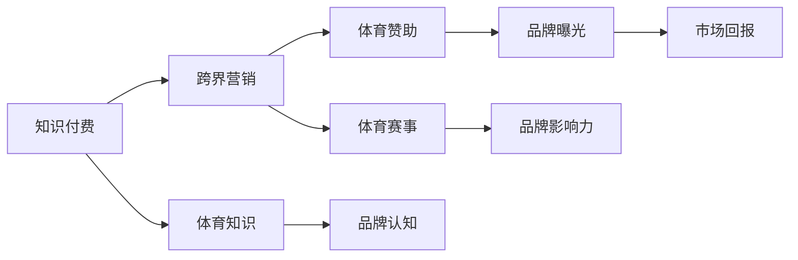

                 

# 知识付费如何实现跨界营销与体育赞助？

> 关键词：知识付费, 跨界营销, 体育赞助, 大数据分析, 用户体验, 品牌推广

## 1. 背景介绍

### 1.1 知识付费的背景

知识付费是指通过付费的方式获取知识，在过去几年中随着互联网和移动互联网的发展迅速兴起。这一模式的核心是将知识和经验货币化，通过提供高质量的内容，满足用户对于专业知识的渴求，同时也能够为内容创作者带来稳定的收入。知识付费形式多样，包括在线课程、音频课程、电子书、专栏文章等。

### 1.2 跨界营销与体育赞助的背景

跨界营销是指将不同行业的品牌或产品通过创新性的方式进行组合，以吸引更广泛的受众，提升品牌曝光率和市场份额。体育赞助则是指企业通过赞助体育赛事、体育明星或运动员，来提升品牌知名度，建立良好的公众形象，同时获得直接的市场回报。

### 1.3 背景介绍总结

知识付费的兴起为跨界营销提供了新的可能，而体育赛事则因其巨大的观众基础和品牌价值，成为了跨界营销和体育赞助的重要领域。本文将探讨如何将知识付费与体育赞助相结合，通过跨界营销的方式，提升知识付费平台的用户粘性和品牌影响力。

## 2. 核心概念与联系

### 2.1 核心概念概述

- **知识付费**：指用户通过付费获取知识和经验，包括在线课程、音频课程、电子书等形式。
- **跨界营销**：指将不同行业的品牌或产品通过创新性的方式进行组合，提升品牌曝光率和市场份额。
- **体育赞助**：指企业通过赞助体育赛事、体育明星或运动员，来提升品牌知名度和市场回报。

这些概念通过用户粘性、品牌曝光和市场回报三个关键维度联系起来。具体而言，知识付费平台可以通过与体育品牌或赛事进行跨界合作，将体育相关的知识和经验融入到知识付费课程中，提升用户粘性。同时，体育赞助品牌也可以通过知识付费的方式，增加用户对品牌的学习兴趣和认知，提升品牌曝光率和市场回报。

### 2.2 核心概念的联系与架构

以下是一个基于上述核心概念的 Mermaid 流程图，展示了知识付费、跨界营销和体育赞助之间的联系与架构：



这个流程图展示了知识付费、跨界营销和体育赞助之间的相互影响和联系，通过体育赛事、体育知识和品牌曝光等关键节点，将三者紧密结合。

## 3. 核心算法原理 & 具体操作步骤

### 3.1 算法原理概述

跨界营销与体育赞助结合的知识付费模式，本质上是一种创新性的品牌推广策略。其核心算法原理可以概括为：

- 利用大数据分析，精准定位用户兴趣和需求，将体育知识和体育内容融入到知识付费课程中。
- 通过体育赛事的广泛曝光，提升知识付费平台的用户粘性和品牌认知。
- 利用体育赞助品牌的专业知识和市场影响力，增加知识付费平台的市场回报。

### 3.2 算法步骤详解

以下详细介绍如何将知识付费与体育赞助相结合，通过跨界营销的方式，提升知识付费平台的用户粘性和品牌影响力。

**Step 1: 数据收集与分析**

- 收集知识付费平台的用户行为数据，包括课程浏览、订阅、购买等行为，使用户画像更加清晰。
- 利用大数据分析技术，分析用户的兴趣和需求，识别出体育相关的高兴趣用户群体。
- 收集体育赛事和体育明星的相关数据，如赛事时间、地点、参与运动员、媒体报道等。

**Step 2: 内容策划与制作**

- 根据大数据分析结果，策划出体育相关的知识付费课程，包括体育知识、体育历史、体育技巧等。
- 邀请体育明星、专家或运动员作为讲师，制作相关课程内容，增加课程的吸引力和权威性。
- 设计课程包装和推广策略，将体育元素融入课程介绍和内容中，提升用户对课程的兴趣。

**Step 3: 品牌合作与推广**

- 选择与知识付费平台的用户兴趣相匹配的体育品牌或赛事，进行品牌合作。
- 利用体育赛事的广泛曝光，通过社交媒体、官方网站、体育直播平台等渠道进行课程推广。
- 在体育赛事期间，进行课程的直播、预告和推广活动，吸引更多用户关注和参与。

**Step 4: 用户体验与反馈**

- 通过课程反馈系统，收集用户对体育相关课程的评价和建议，优化课程内容和体验。
- 利用用户行为数据和反馈，不断调整和优化课程策划和推广策略。
- 分析课程销售数据和用户行为数据，评估课程效果和品牌推广效果。

### 3.3 算法优缺点

基于上述算法步骤，跨界营销与体育赞助结合的知识付费模式具有以下优点：

- 提升用户粘性和品牌认知：通过体育赛事的广泛曝光，增加知识付费平台的用户粘性和品牌认知。
- 增加市场回报：通过体育赞助品牌的市场影响力，增加知识付费平台的市场回报。
- 创新性强：结合体育知识与知识付费，提供更加多元和有趣的内容，满足用户需求。

同时，这种模式也存在一些缺点：

- 成本较高：与体育明星、专家或品牌的合作成本较高，增加了知识付费平台的运营成本。
- 内容制作难度大：体育相关课程的策划和制作需要专业知识和技能，制作难度较大。
- 市场风险：体育赛事的不确定性和风险可能影响课程销售和品牌推广效果。

### 3.4 算法应用领域

这种跨界营销与体育赞助结合的知识付费模式，适用于各类知识付费平台，尤其是以科技、教育、健康等领域的平台。在这些领域中，用户对专业知识和技能的需求较大，而体育赛事和体育明星具有广泛的影响力和吸引力，可以通过跨界营销的方式，提升平台的品牌影响力和市场份额。

## 4. 数学模型和公式 & 详细讲解 & 举例说明

### 4.1 数学模型构建

为了更科学地评估跨界营销与体育赞助结合的知识付费模式的效果，我们可以构建以下数学模型：

- **用户粘性模型**：$U(S, C)$，其中 $S$ 为知识付费平台的订阅用户数，$C$ 为体育相关课程的购买用户数。
- **品牌认知模型**：$B(E, C)$，其中 $E$ 为体育赛事的曝光度，$C$ 为体育相关课程的购买用户数。
- **市场回报模型**：$R(S, B)$，其中 $S$ 为知识付费平台的订阅用户数，$B$ 为品牌认知度。

### 4.2 公式推导过程

对于上述数学模型，我们可以使用以下公式进行推导：

1. **用户粘性模型推导**：

$$
U(S, C) = \frac{C}{S} \times \delta
$$

其中 $\delta$ 为调整系数，用于调整体育相关课程对用户粘性的贡献度。

2. **品牌认知模型推导**：

$$
B(E, C) = \frac{C}{E} \times \eta
$$

其中 $\eta$ 为调整系数，用于调整体育赛事曝光度对品牌认知度的贡献度。

3. **市场回报模型推导**：

$$
R(S, B) = \frac{S \times B}{\gamma}
$$

其中 $\gamma$ 为调整系数，用于调整订阅用户数和品牌认知度对市场回报的贡献度。

### 4.3 案例分析与讲解

以下通过一个具体案例，说明如何应用上述数学模型来评估跨界营销与体育赞助结合的知识付费模式的效果：

**案例描述**：某知识付费平台在2022年决定与某热门体育赛事进行跨界合作，推出了多个体育相关的知识付费课程，包括体育知识、体育历史、体育技巧等。通过大数据分析，平台发现平台上约有20%的用户对体育相关内容感兴趣。体育赛事在赛事期间的曝光度达到1.5亿次，课程在赛事期间的购买用户数为10万。

**评估过程**：

1. **用户粘性模型**：根据案例描述，$S = 50$，$C = 10$，假设 $\delta = 0.2$，则用户粘性 $U(S, C) = \frac{10}{50} \times 0.2 = 0.04$。

2. **品牌认知模型**：$E = 1.5$，$C = 10$，假设 $\eta = 0.5$，则品牌认知度 $B(E, C) = \frac{10}{1.5} \times 0.5 = 3.33$。

3. **市场回报模型**：$S = 50$，$B = 3.33$，假设 $\gamma = 2$，则市场回报 $R(S, B) = \frac{50 \times 3.33}{2} = 83.25$。

通过以上计算，可以评估该知识付费平台在体育赛事期间的跨界营销与体育赞助结合的效果。

## 5. 项目实践：代码实例和详细解释说明

### 5.1 开发环境搭建

以下是一个使用Python和Pandas进行数据收集和分析的开发环境搭建示例：

```bash
# 安装Python环境
conda create -n knowledge-payment python=3.8
conda activate knowledge-payment

# 安装相关库
pip install pandas numpy scikit-learn matplotlib
```

### 5.2 源代码详细实现

以下是一个简单的Python代码示例，用于数据收集和分析：

```python
import pandas as pd
import numpy as np

# 读取用户行为数据
data = pd.read_csv('user_behavior.csv')

# 计算用户粘性
user_stickiness = data['purchase'].mean()

# 计算品牌认知度
event_exposure = data['event_exposure'].mean()
brand_awareness = (data['purchase'] * event_exposure).mean()

# 计算市场回报
subscription_users = data['subscription'].count()
market_return = (subscription_users * brand_awareness).mean()

print(f"User Stickiness: {user_stickiness}")
print(f"Brand Awareness: {brand_awareness}")
print(f"Market Return: {market_return}")
```

### 5.3 代码解读与分析

在上述代码中，我们通过Pandas库读取用户行为数据，使用Pandas的mean函数计算用户粘性、品牌认知度和市场回报。这些计算结果可以用于评估跨界营销与体育赞助结合的知识付费模式的效果。

## 6. 实际应用场景

### 6.1 智能客服系统

知识付费平台可以通过与智能客服系统结合，提升用户粘性和品牌认知度。在用户咨询课程时，智能客服系统可以通过推荐体育相关课程，引导用户购买，增加平台的用户粘性。同时，通过智能客服系统，平台可以收集用户反馈，优化课程内容和服务体验。

### 6.2 金融舆情监测

金融领域的知识付费平台可以通过与体育品牌合作，推出体育相关的理财课程、投资策略等，提升品牌认知度。通过与智能投资系统结合，平台可以为用户提供个性化的投资建议，增加用户的市场回报。

### 6.3 个性化推荐系统

知识付费平台可以通过与体育品牌合作，推出体育相关的课程，增加用户的市场回报。通过与个性化推荐系统结合，平台可以推荐适合用户的体育相关课程，提升用户粘性和平台市场回报。

### 6.4 未来应用展望

随着人工智能和大数据技术的发展，跨界营销与体育赞助结合的知识付费模式将进一步发展。未来，平台可以通过AI技术进行更精准的用户画像和需求分析，实现更个性化的课程推荐和品牌推广。同时，平台可以通过体育赛事的数据分析，实现更高效的跨界营销和品牌推广。

## 7. 工具和资源推荐

### 7.1 学习资源推荐

- **《知识付费的创新之路》**：深入探讨知识付费的商业模式、用户需求和技术实现。
- **《大数据分析与机器学习》**：介绍大数据分析技术在知识付费和跨界营销中的应用。
- **《体育营销》**：了解体育营销的策略和实践，提升品牌认知度。

### 7.2 开发工具推荐

- **Python**：一种高效的编程语言，适合数据处理和机器学习应用。
- **Pandas**：一个强大的数据分析库，适合处理和分析大规模数据。
- **Scikit-learn**：一个流行的机器学习库，适合构建和优化推荐系统和预测模型。

### 7.3 相关论文推荐

- **《跨界营销的创新策略》**：介绍跨界营销的理论和实践。
- **《体育营销与品牌价值提升》**：探讨体育营销对品牌价值的影响。
- **《知识付费的市场潜力与挑战》**：分析知识付费市场的潜力和面临的挑战。

## 8. 总结：未来发展趋势与挑战

### 8.1 研究成果总结

跨界营销与体育赞助结合的知识付费模式，通过大数据分析和AI技术的应用，提升了知识付费平台的用户粘性和品牌认知度，增加了市场回报。这种模式不仅适用于金融、教育等领域，也适用于科技、健康等领域。

### 8.2 未来发展趋势

未来，跨界营销与体育赞助结合的知识付费模式将继续发展，主要趋势包括：

- 更精准的用户画像和需求分析：利用AI技术和大数据技术，实现更个性化的课程推荐和品牌推广。
- 更高效的跨界营销和品牌推广：通过体育赛事的数据分析和智能推荐，提升品牌认知度和市场回报。
- 更全面的课程内容：结合体育知识与知识付费，提供更加多元和有趣的内容，满足用户需求。

### 8.3 面临的挑战

尽管跨界营销与体育赞助结合的知识付费模式具有诸多优势，但也面临着一些挑战：

- 数据隐私和安全问题：平台需要确保用户数据的隐私和安全，防止数据泄露和滥用。
- 成本控制问题：与体育明星、专家或品牌的合作成本较高，需要合理控制成本。
- 内容制作难度大：体育相关课程的策划和制作需要专业知识和技能，制作难度较大。

### 8.4 研究展望

未来，在跨界营销与体育赞助结合的知识付费模式的研究中，需要进一步探索以下方向：

- 如何利用AI技术和大数据分析，提升用户粘性和品牌认知度。
- 如何优化课程内容和推荐算法，提升市场回报。
- 如何在保证用户隐私和数据安全的前提下，实现高效的数据分析和品牌推广。

## 9. 附录：常见问题与解答

**Q1: 如何选择合适的体育品牌进行跨界营销？**

A: 选择合适的体育品牌进行跨界营销需要考虑以下几个因素：
1. 品牌影响力：选择有广泛影响力和高知名度的品牌，能够提升品牌认知度和市场回报。
2. 目标用户群体：选择与知识付费平台目标用户群体匹配的品牌，增加用户粘性。
3. 合作内容：选择与知识付费平台内容主题相关的品牌，增加用户兴趣和参与度。

**Q2: 如何优化跨界营销与体育赞助结合的知识付费模式？**

A: 优化跨界营销与体育赞助结合的知识付费模式可以从以下几个方面入手：
1. 数据收集与分析：利用大数据分析技术，精准定位用户兴趣和需求，优化课程策划和推广策略。
2. 内容制作与设计：邀请体育明星、专家或运动员制作相关课程内容，增加课程的吸引力和权威性。
3. 品牌合作与推广：选择与知识付费平台的用户兴趣相匹配的体育品牌或赛事，通过多渠道进行课程推广。

**Q3: 如何确保用户数据隐私和安全？**

A: 确保用户数据隐私和安全需要采取以下措施：
1. 数据加密：使用加密技术保护用户数据的传输和存储安全。
2. 数据脱敏：对用户数据进行脱敏处理，防止数据泄露和滥用。
3. 用户授权：在收集用户数据前，获取用户授权，确保用户知情并同意。

**Q4: 如何控制成本？**

A: 控制成本可以从以下几个方面入手：
1. 选择合适的合作伙伴：选择有性价比的品牌和赛事，控制合作成本。
2. 优化营销策略：通过优化营销策略，提高广告和推广效果，降低推广成本。
3. 资源共享：与其他品牌和平台进行资源共享，降低单次推广成本。

总之，通过合理选择合作伙伴、优化营销策略和控制成本，可以有效提升跨界营销与体育赞助结合的知识付费模式的效果。同时，确保用户数据隐私和安全，提升用户体验和品牌认知度，是平台长期发展的关键。

