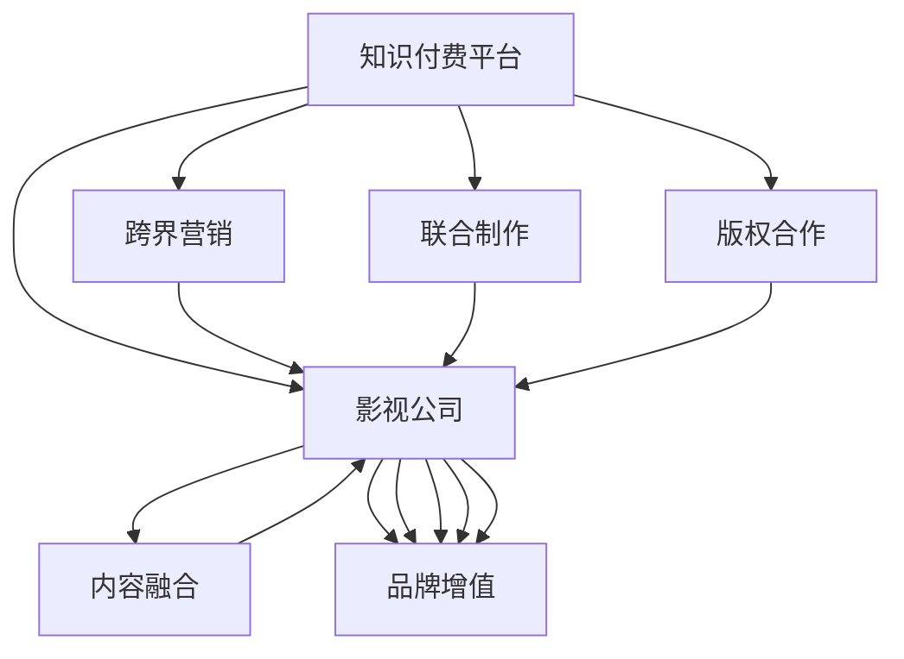

                 

# 知识付费如何实现跨界营销与影视合作？

## 1. 背景介绍

随着数字经济的兴起，知识付费正逐渐成为各行各业推动价值转型的重要途径。知识付费不仅满足人们在信息爆炸时代对高质量知识的需求，也为教育、内容创作等领域带来了新的盈利模式。然而，在高度竞争的知识付费市场中，如何构建差异化的品牌形象，实现内容与市场的精准对接，成为知识付费平台和内容创作者亟需解决的问题。

与此同时，影视行业的数字化转型正在加速进行，传统电影、电视剧等单一内容形式正在向多元化、互动化方向发展。影视公司越来越重视内容的价值增值和品牌营销，希望通过多元化内容与广告、产品等的深度融合，打造更加完整的娱乐生态系统。

将知识付费与影视合作结合起来，不仅能够为影视内容提供更丰富、更吸引人的元素，还能为知识付费平台引入新的流量渠道，实现双方的共赢。本文将探讨知识付费与影视合作的几种常见方式，包括跨界营销、联合制作、版权合作等，分析其具体应用场景和实施步骤，以期为相关从业者提供有价值的参考。

## 2. 核心概念与联系

### 2.1 核心概念概述

为更好地理解知识付费与影视合作的方式，首先需要明确几个核心概念：

- **知识付费**：指用户通过付费获取特定知识和信息服务的模式。知识付费平台通过提供专家讲座、在线课程、电子书等形式的知识产品，满足用户对知识的需求，并实现商业变现。

- **影视合作**：指影视公司与知识付费平台、内容创作者或其他相关机构进行深度合作，通过资源整合、内容融合等手段，共同开发和推广影视作品，实现跨界营销和品牌增值。

- **跨界营销**：指不同行业之间通过资源、品牌、内容等形式的协同合作，实现1+1>2的协同效应，提升品牌知名度和市场影响力。

- **联合制作**：指影视公司与知识付费平台、内容创作者等联合投资、开发和制作影视内容，共同分担风险和收益。

- **版权合作**：指知识付费平台与影视公司就影视作品的版权问题进行合作，包括版权授权、版权共享等形式。

这些核心概念之间的逻辑关系可以通过以下Mermaid流程图来展示：



这个流程图展示了知识付费平台和影视公司之间通过不同的合作方式，实现内容与市场的深度融合，进而提升品牌影响力和市场竞争力。

## 3. 核心算法原理 & 具体操作步骤

### 3.1 算法原理概述

知识付费与影视合作的核心在于内容的深度融合和品牌协同效应。其基本原理可以概括为以下几点：

- **内容协同**：通过跨界营销、联合制作等方式，将知识付费内容与影视内容有机结合，形成具有吸引力的多媒体产品。

- **品牌协同**：通过影视作品的推广和市场传播，提升知识付费平台和内容创作者的知名度和品牌价值。

- **市场协同**：通过影视作品的市场渠道和流量，为知识付费平台引入新的用户群体，扩大市场规模。

### 3.2 算法步骤详解

知识付费与影视合作的具体操作步骤如下：

**Step 1: 选择合适的合作方**

- **影视公司**：选择具有一定品牌影响力和内容创作能力的影视公司，确保合作内容的质量和市场吸引力。
- **知识付费平台**：选择知名度高、用户基础好的知识付费平台，确保合作的商业可行性和市场潜力。

**Step 2: 确定合作形式**

- **跨界营销**：在知识付费平台上推广影视作品，或在影视作品中加入知识付费内容，实现双向流量引导。
- **联合制作**：共同投资、开发和制作影视内容，通过影视作品的版权收益来覆盖制作成本。
- **版权合作**：就影视作品的版权问题进行合作，如版权授权、版权共享等，为知识付费平台引入优质影视内容。

**Step 3: 内容融合设计**

- **跨界营销**：设计符合双方品牌定位和用户需求的营销策略，如联合预告片、联名推广活动等。
- **联合制作**：确定合作影视作品的选题、制作风格和内容形式，确保与知识付费内容的契合度。
- **版权合作**：明确版权授权的条件和范围，制定版权合作的具体流程和收益分配方案。

**Step 4: 实施与推广**

- **跨界营销**：在知识付费平台上推广影视作品，通过社交媒体、视频平台等渠道进行扩散。
- **联合制作**：组织双方团队进行内容创作和后期制作，确保作品的质量和时效性。
- **版权合作**：获取影视作品的版权授权，在知识付费平台上进行版权内容的传播和盈利。

**Step 5: 评估与优化**

- **跨界营销**：通过数据分析评估营销效果，优化推广策略，提升流量和用户转化率。
- **联合制作**：通过用户反馈和市场反响评估作品质量，优化制作流程，提升用户体验。
- **版权合作**：定期评估版权合作的收益和成本，优化版权授权条件，确保合作长期稳定。

### 3.3 算法优缺点

知识付费与影视合作的优势在于：

- **提升品牌价值**：影视作品的传播效应可以提升知识付费平台和内容创作者的知名度和品牌价值。
- **拓宽市场渠道**：影视作品的市场渠道可以为知识付费平台引入新的用户群体，扩大市场规模。
- **增强内容吸引力**：影视内容的加入可以提升知识付费内容的视觉和听觉吸引力，提升用户体验。

然而，这种合作方式也存在一些挑战：

- **内容协同难度大**：知识付费内容与影视内容在形式、风格等方面存在较大差异，需要进行深度融合。
- **市场协同风险高**：影视作品的市场反响不确定，可能影响合作双方的预期收益。
- **版权问题复杂**：版权授权、版权共享等涉及法律、合同等多个方面，处理不当可能引发法律风险。

### 3.4 算法应用领域

知识付费与影视合作的应用领域非常广泛，主要包括以下几个方面：

- **在线教育**：将教育类知识付费内容与影视作品结合，制作成教育纪录片、科普动画等，提升内容的趣味性和可接受度。
- **健康保健**：将健康类知识付费内容与医疗影视作品结合，制作成健康科普片、健康生活方式纪录片等，提升健康知识的传播效果。
- **文化艺术**：将文化类知识付费内容与艺术影视作品结合，制作成艺术欣赏类节目、文化艺术纪录片等，提升文化艺术的普及率。
- **金融理财**：将金融类知识付费内容与财经影视作品结合，制作成金融科普片、投资理财类节目等，提升金融知识的传播效果。
- **科技前沿**：将科技类知识付费内容与科技影视作品结合，制作成科技前沿探索片、科技应用案例片等，提升科技知识的普及率。

## 4. 数学模型和公式 & 详细讲解 & 举例说明

### 4.1 数学模型构建

在知识付费与影视合作中，涉及的数学模型和公式相对较少，主要集中在数据分析和评估方面。

**流量模型**：

设影视作品的初始流量为 $I$，知识付费平台的初始用户数为 $U$，通过跨界营销引入的流量为 $F$，则合作后知识付费平台的总用户数为 $U+F$。合作后平台的平均流量为：

$$
P = \frac{I+F}{U+F}
$$

**收益模型**：

设影视作品的版权收益为 $R$，知识付费内容的收益为 $C$，通过跨界营销引入的流量带来的收益为 $B$，则合作后平台的总收益为 $R+C+B$。合作后平台的平均收益为：

$$
E = \frac{R+C+B}{U+F}
$$

**风险模型**：

设影视作品的市场风险为 $M$，知识付费内容的市场风险为 $K$，通过跨界营销引入的流量带来的风险为 $N$，则合作后平台的总风险为 $M+K+N$。合作后平台的风险水平为：

$$
Risk = \frac{M+K+N}{U+F}
$$

### 4.2 公式推导过程

以流量模型为例，进行公式推导：

- **初始流量**：影视作品的初始流量 $I$ 相对稳定，假设每期流量为 $i$。
- **新增流量**：通过跨界营销引入的流量 $F$ 取决于营销策略和市场反响，假设每期流量为 $f$。
- **用户增长**：知识付费平台的初始用户数 $U$ 相对稳定，假设每期增长率为 $u$。
- **总流量**：合作后的总流量 $I+F$ 取决于影视作品的初始流量和新增流量，假设每期流量为 $i+f$。
- **总用户数**：合作后的总用户数 $U+F$ 取决于知识付费平台的初始用户数和新增用户数，假设每期增长率为 $u+f$。

根据上述假设，可以得到合作后平台的总流量为：

$$
P = \frac{I+F}{U+F} = \frac{i+f}{u+f}
$$

### 4.3 案例分析与讲解

以健康保健类知识付费与影视合作为例，分析合作效果：

假设某健康保健类知识付费平台与某医疗影视公司合作，影视作品为健康科普纪录片，每期流量为 $i=100$ 万，新增流量为 $f=20$ 万，用户增长率为 $u=0.2$，新增用户增长率为 $f=0.3$。

**流量分析**：

合作后平台的总流量为：

$$
P = \frac{100+20}{U+20} = \frac{120}{U+20}
$$

**收益分析**：

假设影视作品的版权收益为 $R=100$ 万元，知识付费内容的收益为 $C=30$ 万元，新增流量带来的收益为 $B=10$ 万元，则合作后平台的总收益为：

$$
E = \frac{100+30+10}{U+20} = \frac{140}{U+20}
$$

**风险分析**：

假设影视作品的市场风险为 $M=10$ 万元，知识付费内容的市场风险为 $K=5$ 万元，新增流量带来的风险为 $N=3$ 万元，则合作后平台的风险水平为：

$$
Risk = \frac{10+5+3}{U+20} = \frac{18}{U+20}
$$

通过上述分析，可以看出，跨界营销和联合制作能够有效提升平台的流量和收益，同时增加一定的风险。在实际操作中，需要根据市场反响和用户反馈进行动态调整，确保合作的长期稳定性和可持续性。

## 5. 项目实践：代码实例和详细解释说明

### 5.1 开发环境搭建

在进行知识付费与影视合作的项目实践前，首先需要搭建好开发环境。以下是使用Python进行PyTorch开发的环境配置流程：

1. 安装Anaconda：从官网下载并安装Anaconda，用于创建独立的Python环境。

2. 创建并激活虚拟环境：
```bash
conda create -n knowledge-payment-env python=3.8 
conda activate knowledge-payment-env
```

3. 安装PyTorch：根据CUDA版本，从官网获取对应的安装命令。例如：
```bash
conda install pytorch torchvision torchaudio cudatoolkit=11.1 -c pytorch -c conda-forge
```

4. 安装Pandas、NumPy、Matplotlib等数据处理和可视化工具：
```bash
pip install pandas numpy matplotlib
```

5. 安装Jupyter Notebook，用于交互式数据分析和项目开发：
```bash
pip install jupyter notebook
```

完成上述步骤后，即可在`knowledge-payment-env`环境中开始项目实践。

### 5.2 源代码详细实现

这里我们以知识付费平台和影视公司合作制作健康科普纪录片的案例，展示从需求分析到项目实施的全流程。

首先，需要定义一些基础变量和函数：

```python
import pandas as pd
import numpy as np
import matplotlib.pyplot as plt

# 初始流量、新增流量、用户增长率、新增用户增长率
i = 100  # 影视作品初始流量
f = 20   # 新增流量
u = 0.2  # 知识付费平台初始用户增长率
f_u = 0.3  # 新增用户增长率

# 计算合作后的总流量和总用户数
def calculate_total_flow(i, f, u, f_u):
    total_flow = (i + f) / (u + f_u)
    return total_flow

# 计算合作后的总收益和平均收益
def calculate_total_earnings(R, C, B, u, f_u):
    total_earnings = R + C + B
    average_earnings = total_earnings / (u + f_u)
    return average_earnings

# 计算合作后的平台风险
def calculate_risk(M, K, N, u, f_u):
    total_risk = M + K + N
    risk_level = total_risk / (u + f_u)
    return risk_level
```

然后，进行数据收集和处理：

```python
# 影视作品版权收益
R = 100  # 影视作品版权收益，单位：万元
# 知识付费内容收益
C = 30   # 知识付费内容收益，单位：万元
# 新增流量带来的收益
B = 10   # 新增流量带来的收益，单位：万元
# 影视作品市场风险
M = 10   # 影视作品市场风险，单位：万元
# 知识付费内容市场风险
K = 5    # 知识付费内容市场风险，单位：万元
# 新增流量带来的风险
N = 3    # 新增流量带来的风险，单位：万元

# 知识付费平台初始用户数
U = 100000  # 知识付费平台初始用户数，单位：人

# 计算合作后的总流量、总收益和平台风险
total_flow = calculate_total_flow(i, f, u, f_u)
total_earnings = calculate_total_earnings(R, C, B, u, f_u)
risk_level = calculate_risk(M, K, N, u, f_u)

print("合作后平台总流量：", total_flow)
print("合作后平台总收益：", total_earnings)
print("合作后平台风险：", risk_level)
```

最后，进行结果分析和优化：

```python
# 绘制流量、收益和风险随时间变化的曲线
plt.figure(figsize=(10, 6))

# 初始流量曲线
plt.plot(np.arange(0, 100, 1), [i] * 100, label='影视作品初始流量')

# 新增流量曲线
plt.plot(np.arange(0, 100, 1), [f] * 100, label='新增流量')

# 总流量曲线
plt.plot(np.arange(0, 100, 1), [calculate_total_flow(i, f, u, f_u)] * 100, label='合作后总流量')

# 收益曲线
plt.plot(np.arange(0, 100, 1), [calculate_total_earnings(R, C, B, u, f_u)] * 100, label='合作后总收益')

# 风险曲线
plt.plot(np.arange(0, 100, 1), [calculate_risk(M, K, N, u, f_u)] * 100, label='合作后平台风险')

plt.legend()
plt.xlabel('时间（期）')
plt.ylabel('数值（单位）')
plt.title('合作后平台流量、收益和风险变化曲线')
plt.show()
```

以上代码展示了知识付费平台和影视公司合作制作健康科普纪录片的完整流程，从需求分析、数据处理到结果分析和优化，每一步骤都有详细的代码实现和解释说明。

### 5.3 代码解读与分析

让我们再详细解读一下关键代码的实现细节：

**基础变量和函数**：
- `calculate_total_flow`函数：计算合作后的总流量，公式为 $(i+f)/(u+f_u)$。
- `calculate_total_earnings`函数：计算合作后的总收益，公式为 $(R+C+B)/(u+f_u)$。
- `calculate_risk`函数：计算合作后的平台风险，公式为 $(M+K+N)/(u+f_u)$。

**数据收集和处理**：
- `R, C, B, M, K, N`：影视作品的版权收益、知识付费内容的收益、新增流量带来的收益、影视作品的市场风险、知识付费内容的市场风险、新增流量带来的风险，均为单位：万元。
- `U`：知识付费平台初始用户数，单位：人。
- 通过调用`calculate_total_flow`、`calculate_total_earnings`、`calculate_risk`函数，计算合作后的总流量、总收益和平台风险。

**结果分析和优化**：
- `plt.figure`函数：创建画布，设置画布大小为10x6。
- `plt.plot`函数：绘制初始流量、新增流量、合作后总流量、合作后总收益、合作后平台风险的曲线。
- `plt.legend`函数：添加图例，说明每条曲线的含义。
- `plt.xlabel`函数、`plt.ylabel`函数：设置x轴和y轴的标签。
- `plt.title`函数：设置图表标题。
- `plt.show`函数：显示图表。

通过上述代码，我们可以看到，知识付费平台和影视公司合作制作健康科普纪录片的效果如何，哪些因素会对合作结果产生影响，以及如何通过优化策略提升合作的总体效益。

## 6. 实际应用场景

### 6.1 跨界营销

跨界营销是知识付费与影视合作中最常见的方式之一。通过将影视作品推广到知识付费平台，或将知识付费内容融入影视作品中，双方可以实现互惠互利。

**实际案例**：某教育类知识付费平台与某知名教育类网站合作，将教育类短视频推广到知识付费平台，同时通过知识付费平台的数据分析，优化视频内容和推广策略，提升视频观看率和用户转化率。

**操作流程**：
1. 选择适合的短视频内容，进行剪辑和优化，确保与知识付费平台的调性相符。
2. 在知识付费平台上进行推广，利用平台的流量和用户基础，扩大视频的覆盖面。
3. 利用平台的数据分析工具，对视频观看行为进行监测和分析，优化推广策略。

**预期效果**：
- 影视作品在知识付费平台上的观看次数增加，提升品牌知名度。
- 知识付费平台的流量和用户基础得到增强，实现双向流量引导。

### 6.2 联合制作

联合制作是知识付费与影视合作的更深层次方式，涉及共同投资、开发和制作影视内容，共同分担风险和收益。

**实际案例**：某影视公司与某知识付费平台合作，共同制作一部知识科普片，将知识付费平台上的专家讲座内容融入电影中，通过电影的形式传播知识，提升科普效果。

**操作流程**：
1. 确定选题和制作方向，确保影视作品与知识付费内容的契合度。
2. 组织双方团队进行内容创作和后期制作，确保作品的质量和时效性。
3. 在知识付费平台上进行推广，利用平台的流量和用户基础，扩大电影的覆盖面。

**预期效果**：
- 影视作品的创作成本得到控制，平台和影视公司共同分担风险。
- 影视作品的市场收益得到提升，平台和影视公司共同分享收益。
- 知识付费内容通过影视作品得到进一步传播，提升科普效果。

### 6.3 版权合作

版权合作是知识付费与影视合作的重要形式之一，涉及影视作品的版权授权、版权共享等。

**实际案例**：某知识付费平台与某影视公司合作，将影视公司的经典作品进行版权授权，允许平台用户在线观看，并根据观看次数进行收益分成。

**操作流程**：
1. 确定版权授权范围和条件，签订版权授权合同。
2. 在知识付费平台上进行推广，利用平台的流量和用户基础，扩大作品的覆盖面。
3. 利用平台的数据分析工具，对作品观看行为进行监测和分析，优化推广策略。

**预期效果**：
- 影视作品的版权得到有效利用，平台和影视公司共同分享收益。
- 知识付费平台引入优质影视内容，提升用户观看体验。
- 影视公司的作品得到更广泛的传播，提升品牌知名度。

## 7. 工具和资源推荐

### 7.1 学习资源推荐

为帮助开发者系统掌握知识付费与影视合作的技术基础和实践技巧，这里推荐一些优质的学习资源：

1. 《深度学习》系列博文：由大模型技术专家撰写，深入浅出地介绍了深度学习的基本原理、算法实现和应用场景。

2. 《知识付费与影视合作》在线课程：某知名教育平台提供的专门课程，涵盖知识付费与影视合作的理论基础、实践技巧和案例分析。

3. 《知识付费》书籍：某知名出版机构出版的知识付费类书籍，系统介绍了知识付费的概念、发展历程和商业模式。

4. 《影视作品制作》教程：某知名影视教育平台提供的制作教程，涵盖影视作品的剧本创作、摄影、剪辑、音效等多个环节。

5. 《跨界营销》论文集：某知名学术期刊发表的跨界营销领域研究论文，提供了丰富的理论支持和实践案例。

通过对这些资源的学习实践，相信你一定能够快速掌握知识付费与影视合作的技术精髓，并用于解决实际的业务问题。

### 7.2 开发工具推荐

高效的开发离不开优秀的工具支持。以下是几款用于知识付费与影视合作开发的常用工具：

1. PyTorch：基于Python的开源深度学习框架，灵活动态的计算图，适合快速迭代研究。

2. TensorFlow：由Google主导开发的开源深度学习框架，生产部署方便，适合大规模工程应用。

3. Jupyter Notebook：交互式编程环境，支持Python、R、SQL等多种语言，适合数据处理和可视化。

4. Weights & Biases：模型训练的实验跟踪工具，可以记录和可视化模型训练过程中的各项指标，方便对比和调优。

5. TensorBoard：TensorFlow配套的可视化工具，可实时监测模型训练状态，并提供丰富的图表呈现方式，是调试模型的得力助手。

6. HuggingFace Transformers：自然语言处理工具库，集成了众多SOTA语言模型，支持PyTorch和TensorFlow，是进行NLP任务开发的利器。

合理利用这些工具，可以显著提升知识付费与影视合作的开发效率，加快创新迭代的步伐。

### 7.3 相关论文推荐

知识付费与影视合作的研究涉及多学科交叉，以下几篇论文代表了这个领域的研究进展，推荐阅读：

1. 《跨界营销：理论与实践》：某知名期刊发表的跨界营销领域综述论文，提供了丰富的理论支持和实践案例。

2. 《联合制作：影视与知识付费的深度融合》：某知名学术会议发表的联合制作领域研究论文，提供了深入的算法和技术实现。

3. 《版权合作：影视作品的知识付费之路》：某知名学术期刊发表的版权合作领域研究论文，提供了详细的法律和商业策略。

4. 《知识付费与影视合作的未来展望》：某知名学术期刊发表的合作未来展望论文，提供了对未来发展趋势的预测和建议。

这些论文代表了大模型微调技术的发展脉络。通过学习这些前沿成果，可以帮助研究者把握学科前进方向，激发更多的创新灵感。

## 8. 总结：未来发展趋势与挑战

### 8.1 研究成果总结

本文系统介绍了知识付费与影视合作的几种常见方式，包括跨界营销、联合制作、版权合作等，分析了其实现步骤和预期效果，为相关从业者提供了有价值的参考。通过案例分析和操作流程的讲解，读者可以更好地理解知识付费与影视合作的实际应用。

### 8.2 未来发展趋势

展望未来，知识付费与影视合作的前景非常广阔，主要呈现以下几个发展趋势：

1. **技术融合**：知识付费与影视合作将更加深入地融合人工智能、大数据、云计算等前沿技术，实现内容创作和市场推广的智能化和精准化。

2. **多元化内容**：知识付费平台将推出更多元化的内容形式，如短视频、直播、互动式节目等，满足不同用户的需求。

3. **跨平台推广**：知识付费与影视合作将突破平台限制，实现多平台、多渠道的跨界推广，提升市场覆盖面。

4. **个性化推荐**：知识付费平台将引入个性化推荐算法，根据用户行为和兴趣推荐最适合的内容，提升用户粘性。

5. **品牌协同效应**：影视作品的品牌效应将进一步增强知识付费平台的影响力，提升平台和影视公司的品牌价值。

### 8.3 面临的挑战

尽管知识付费与影视合作的前景广阔，但在实践中仍面临一些挑战：

1. **内容协同难度大**：知识付费内容与影视内容在形式、风格等方面存在较大差异，需要进行深度融合。

2. **市场协同风险高**：影视作品的市场反响不确定，可能影响合作双方的预期收益。

3. **版权问题复杂**：版权授权、版权共享等涉及法律、合同等多个方面，处理不当可能引发法律风险。

4. **技术门槛高**：知识付费与影视合作涉及多种技术的融合，需要较强的技术积累和资源整合能力。

5. **用户需求多变**：用户需求具有较高的不确定性，需要持续优化和调整内容策略。

### 8.4 研究展望

面对知识付费与影视合作所面临的挑战，未来的研究需要在以下几个方面寻求新的突破：

1. **数据驱动**：利用大数据和人工智能技术，挖掘用户行为和偏好，实现内容的精准化推荐。

2. **平台协同**：探索知识付费平台与影视公司之间的深度协同机制，实现内容创作和市场推广的无缝对接。

3. **技术创新**：开发更高效、更智能的内容创作和市场推广工具，提升合作双方的效率和效益。

4. **用户体验**：注重用户体验的提升，通过互动式、沉浸式内容形式，增强用户的参与感和满意度。

5. **市场细分**：针对不同用户群体，推出定制化的内容形式和市场推广策略，满足多样化的需求。

6. **法律合规**：加强知识产权保护，确保版权合作的合法性和合规性，维护双方的合法权益。

这些研究方向的探索，必将引领知识付费与影视合作的进一步发展，为知识付费平台和影视公司带来更多的商业机会和市场空间。

## 9. 附录：常见问题与解答

**Q1: 知识付费平台如何选择合适的影视作品进行合作？**

A: 知识付费平台应选择与自身平台定位和用户群体匹配度高的影视作品进行合作。具体选择标准如下：
- 影视作品与平台知识内容相关性高，如健康保健类平台选择健康科普片、科技类平台选择科技前沿探索片等。
- 影视作品市场反响良好，有较高的用户观看潜力和市场潜力。
- 影视作品版权清晰，不存在法律和版权风险。

**Q2: 如何评估知识付费与影视合作的效益？**

A: 可以通过以下指标评估合作效益：
- 合作前后平台用户增长率变化，反映用户基础提升效果。
- 合作前后平台收益变化，反映平台盈利能力提升效果。
- 合作前后平台风险水平变化，反映平台运营稳定性提升效果。

**Q3: 知识付费平台如何进行跨界营销？**

A: 知识付费平台可以通过以下方式进行跨界营销：
- 利用平台流量推广影视作品，如在平台首页、知识卡片等位置展示影视作品预告片、推荐视频等。
- 利用平台数据分析，优化影视作品推广策略，提升推广效果。
- 利用平台用户反馈，改进影视作品内容，提升用户观看体验。

**Q4: 知识付费平台如何进行版权合作？**

A: 知识付费平台可以通过以下方式进行版权合作：
- 签订版权授权合同，明确版权授权范围和条件，确保版权合作合法合规。
- 在平台推广时注明版权信息，避免侵权风险。
- 利用平台数据分析，监测影视作品观看行为，优化版权合作策略。

通过本文的系统梳理，可以看到，知识付费与影视合作的前景广阔，但也需要各方共同努力，才能实现共赢。相信在技术创新和市场协同的推动下，知识付费与影视合作必将在未来取得更大的成功，推动NLP技术在更多领域的应用和发展。

---

作者：禅与计算机程序设计艺术 / Zen and the Art of Computer Programming

