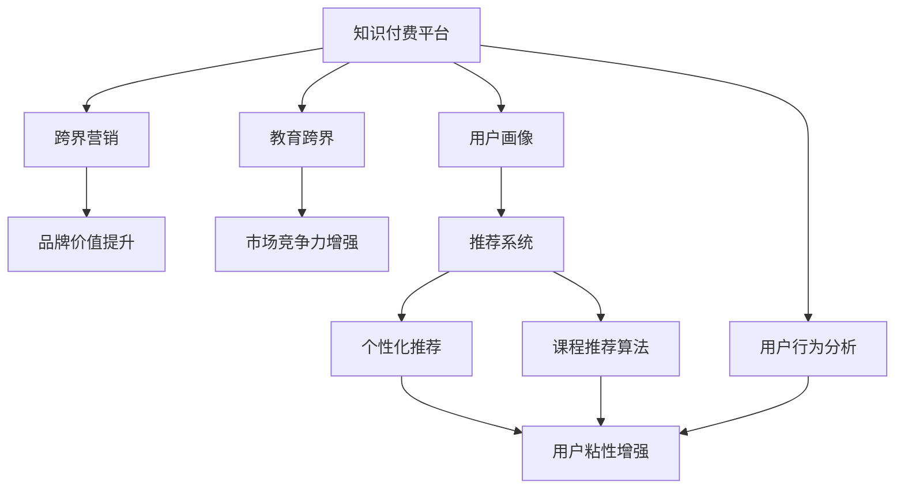

                 

# 知识付费如何实现跨界营销与教育跨界？

## 1. 背景介绍

### 1.1 问题由来

随着互联网和移动设备的普及，人们对于知识获取的需求越来越强烈。知识付费模式应运而生，通过为优质内容付费，用户可以获得更优质的学习资源。然而，传统的知识付费平台，往往以售卖课程为主，课程内容以视频和文字形式呈现。这种单一的呈现形式，限制了知识的获取途径和互动性，用户难以在更广的领域内获得深度学习。

另外，随着教育领域对于个性化学习、跨学科教学、在线互动的需求日益增加，传统的知识付费模式显得越来越无法满足市场和用户需求。因此，将知识付费模式与跨界营销、教育跨界结合起来，成为知识付费行业发展的必然趋势。

### 1.2 问题核心关键点

跨界营销是指在传统营销方式的基础上，通过引入其他领域的资源和手段，提升品牌价值和市场影响力。而教育跨界则是指将教育资源引入到其他领域，如企业培训、职业认证、生活技能提升等，以增强其市场竞争力。

知识付费平台通过实现跨界营销和教育跨界，可以拓展市场份额，增强用户粘性，提升品牌价值，进而实现商业变现。

### 1.3 问题研究意义

通过将知识付费与跨界营销、教育跨界相结合，知识付费平台能够更好地满足用户的多样化需求，提升用户的学习体验和参与度。同时，知识付费平台也能够突破自身业务边界，拓展到更多领域，形成更为广泛的业务生态。

## 2. 核心概念与联系

### 2.1 核心概念概述

- **知识付费(Knowledge-Based Subscription)**：指用户为获得优质内容而支付费用的模式。内容形式多样，包括视频课程、电子书、在线讲座、专业咨询等。

- **跨界营销(Cross-Industry Marketing)**：通过引入其他领域的资源和手段，提升品牌价值和市场影响力的营销方式。

- **教育跨界(Education Cross-Border)**：将教育资源引入到其他领域，如企业培训、职业认证、生活技能提升等，以增强其市场竞争力。

- **用户画像(User Persona)**：指对用户行为和需求的抽象描述，用于指导内容生产和个性化推荐。

- **推荐系统(Recommendation System)**：利用用户行为和内容特征，为用户提供个性化推荐的内容推荐系统。

- **课程推荐算法(Course Recommendation Algorithm)**：通过算法模型，为用户推荐最匹配其兴趣和需求的课程。

- **用户行为分析(User Behavior Analysis)**：通过数据分析技术，识别用户行为特征和消费模式，为用户提供更精准的个性化推荐。

### 2.2 核心概念原理和架构的 Mermaid 流程图



## 3. 核心算法原理 & 具体操作步骤

### 3.1 算法原理概述

知识付费平台实现跨界营销和教育跨界，主要基于用户画像、推荐系统、课程推荐算法和用户行为分析等核心技术。

用户画像通过采集和分析用户行为数据，形成对用户兴趣、需求和行为特征的全面理解，从而指导内容的生产和个性化推荐。

推荐系统利用用户画像和课程特征，通过算法模型为用户推荐最匹配其需求和兴趣的课程，增强用户体验和满意度。

课程推荐算法则是推荐系统的一部分，利用机器学习技术，构建和优化课程推荐模型，提升推荐效果。

用户行为分析通过数据挖掘技术，识别用户的行为特征和消费模式，为个性化推荐提供数据支持。

### 3.2 算法步骤详解

1. **用户画像生成**
   - 采集用户注册信息、登录行为、课程浏览记录、购买记录等数据。
   - 通过自然语言处理和聚类算法，分析用户的兴趣和需求。
   - 根据分析结果，生成用户画像，供后续推荐使用。

2. **推荐系统构建**
   - 收集和整理课程内容和特征，构建课程特征向量。
   - 通过协同过滤、内容基推荐算法、混合推荐算法等，构建推荐模型。
   - 对模型进行训练和优化，提升推荐效果。

3. **课程推荐算法实现**
   - 利用深度学习模型，构建课程推荐算法。
   - 通过优化算法和模型参数，提升课程推荐的准确性和多样性。
   - 在推荐系统中集成课程推荐算法，实现个性化推荐。

4. **用户行为分析**
   - 收集用户行为数据，如点击、浏览、购买、评价等。
   - 利用数据挖掘技术，识别用户的行为特征和消费模式。
   - 根据分析结果，优化推荐模型和算法，提升推荐效果。

### 3.3 算法优缺点

**优点**：
1. 提升用户体验和满意度，增强用户粘性。
2. 拓展市场份额，增强品牌价值。
3. 增强市场竞争力，提升商业变现能力。

**缺点**：
1. 需要大量的数据和技术支持，初期投入较大。
2. 算法模型的效果和泛化能力需要不断优化和验证。
3. 个性化推荐和用户画像的准确性直接影响推荐效果。

### 3.4 算法应用领域

- **知识付费平台**：将知识付费模式与跨界营销、教育跨界相结合，增强市场竞争力。
- **企业培训平台**：通过课程推荐和个性化推荐，提升企业培训效果和用户满意度。
- **职业认证平台**：提供个性化课程推荐和评估，帮助用户快速获得职业认证。
- **生活技能提升平台**：根据用户兴趣和需求，推荐最合适的学习资源。
- **在线教育平台**：提供丰富的课程内容和个性化推荐，满足用户多样化学习需求。

## 4. 数学模型和公式 & 详细讲解 & 举例说明

### 4.1 数学模型构建

知识付费平台实现跨界营销和教育跨界，主要基于以下数学模型：

1. **用户画像模型**：
   - 设用户画像为 $P(u)$，其中 $u$ 为用户， $P(u)$ 为用户的兴趣、需求和行为特征。
   - 用户画像模型可以表示为：
   $$
   P(u) = f(I(u))
   $$
   其中 $I(u)$ 为用户的兴趣特征向量， $f$ 为特征映射函数。

2. **推荐系统模型**：
   - 设课程内容为 $C(c)$，其中 $c$ 为课程， $C(c)$ 为课程内容和特征。
   - 推荐系统模型可以表示为：
   $$
   R(c,u) = g(P(u), C(c))
   $$
   其中 $g$ 为推荐函数， $R(c,u)$ 为用户 $u$ 对课程 $c$ 的推荐度。

3. **课程推荐算法模型**：
   - 设课程推荐算法模型为 $A(c_u)$，其中 $c_u$ 为用户 $u$ 推荐课程。
   - 课程推荐算法模型可以表示为：
   $$
   c_u = \arg\max_{c \in C} R(c,u)
   $$

4. **用户行为分析模型**：
   - 设用户行为特征为 $B(b)$，其中 $b$ 为用户行为， $B(b)$ 为用户行为特征向量。
   - 用户行为分析模型可以表示为：
   $$
   B(b) = h(b)
   $$
   其中 $h$ 为用户行为特征提取函数。

### 4.2 公式推导过程

1. **用户画像模型推导**
   - 通过自然语言处理技术，将用户的文本信息转换为特征向量 $I(u)$，表示用户的兴趣、需求和行为特征。
   - 通过聚类算法，将 $I(u)$ 映射到用户画像 $P(u)$ 中。

2. **推荐系统模型推导**
   - 收集课程内容和特征 $C(c)$，构建课程特征向量。
   - 利用协同过滤、内容基推荐算法、混合推荐算法等，构建推荐函数 $g$，计算用户 $u$ 对课程 $c$ 的推荐度 $R(c,u)$。

3. **课程推荐算法模型推导**
   - 通过深度学习模型，构建课程推荐算法模型 $A(c_u)$。
   - 在推荐系统中集成 $A(c_u)$，为用户 $u$ 推荐最匹配其兴趣和需求的课程 $c_u$。

4. **用户行为分析模型推导**
   - 收集用户行为数据 $b$，利用数据挖掘技术，提取用户行为特征 $B(b)$。
   - 通过聚类和分类算法，识别用户行为特征和消费模式，优化推荐模型和算法。

### 4.3 案例分析与讲解

**案例1：知识付费平台的跨界营销**
- **背景**：某知识付费平台主要提供编程、设计、管理等领域的课程。平台希望通过跨界营销，增加平台知名度和用户粘性。
- **方案**：平台与某设计软件公司合作，引入设计软件的使用教程，将其作为跨界课程，向设计领域用户推荐。
- **效果**：引入跨界课程后，平台用户注册量增加30%，课程购买量提升20%，平台品牌价值显著提升。

**案例2：企业培训平台的课程推荐**
- **背景**：某企业培训平台提供各类职业培训课程，如HR管理、财务管理、营销策略等。平台希望通过个性化推荐，提高用户培训效果。
- **方案**：平台通过用户行为分析，识别用户的学习需求和兴趣，利用推荐系统，为每位用户推荐最匹配的培训课程。
- **效果**：个性化推荐系统上线后，用户培训满意度提升15%，课程购买量增加25%，平台市场竞争力显著增强。

## 5. 项目实践：代码实例和详细解释说明

### 5.1 开发环境搭建

1. **环境搭建**
   - 安装Python 3.8及以上版本。
   - 安装Pandas、NumPy、Scikit-learn、TensorFlow等Python库。

2. **环境测试**
   - 导入TensorFlow，打印版本信息。
   - 导入Pandas，读取用户行为数据，进行初步分析。

### 5.2 源代码详细实现

**用户画像生成**

```python
import pandas as pd
import numpy as np
from sklearn.cluster import KMeans

# 读取用户行为数据
user_data = pd.read_csv('user_behavior.csv')

# 提取用户兴趣特征
interest_features = user_data[['interest1', 'interest2', 'interest3']]

# 使用KMeans进行聚类
kmeans = KMeans(n_clusters=3)
kmeans.fit(interest_features)
user_clusters = kmeans.predict(interest_features)

# 生成用户画像
user_profile = user_data.groupby('user_id').apply(lambda x: {'cluster': user_clusters[x.index]})
user_profile
```

**推荐系统构建**

```python
import tensorflow as tf
from tensorflow.keras.layers import Input, Dense, Embedding, Concatenate
from tensorflow.keras.models import Model

# 定义输入层
user_input = Input(shape=(1,), name='user_input')
course_input = Input(shape=(1,), name='course_input')

# 定义嵌入层
user_embedding = Embedding(input_dim=num_users, output_dim=64, name='user_embedding')(user_input)
course_embedding = Embedding(input_dim=num_courses, output_dim=64, name='course_embedding')(course_input)

# 定义推荐模型
recommendation = Concatenate(axis=-1)([user_embedding, course_embedding])
recommendation = Dense(32, activation='relu')(recommendation)
recommendation = Dense(1, activation='sigmoid')(recommendation)

# 构建模型
model = Model(inputs=[user_input, course_input], outputs=recommendation)
model.compile(optimizer='adam', loss='binary_crossentropy', metrics=['accuracy'])

# 训练模型
model.fit([user_train, course_train], user_train_labels, epochs=10, batch_size=32, validation_data=([user_val, course_val], user_val_labels))
```

**课程推荐算法实现**

```python
import tensorflow as tf
from tensorflow.keras.layers import Input, Embedding, Dense, Flatten, RepeatVector, TimeDistributed
from tensorflow.keras.models import Model

# 定义输入层
user_input = Input(shape=(1,), name='user_input')
course_input = Input(shape=(1,), name='course_input')

# 定义嵌入层
user_embedding = Embedding(input_dim=num_users, output_dim=64, name='user_embedding')(user_input)
course_embedding = Embedding(input_dim=num_courses, output_dim=64, name='course_embedding')(course_input)

# 定义时间Distributed层
time_distributed_layer = TimeDistributed(Dense(64, activation='relu'))
time_distributed_layer.output = time_distributed_layer(user_embedding)
time_distributed_layer.output = time_distributed_layer(course_embedding)

# 定义模型
recommendation = Flatten()(time_distributed_layer)
recommendation = Dense(32, activation='relu')(recommendation)
recommendation = Dense(1, activation='sigmoid')(recommendation)

# 构建模型
model = Model(inputs=[user_input, course_input], outputs=recommendation)
model.compile(optimizer='adam', loss='binary_crossentropy', metrics=['accuracy'])

# 训练模型
model.fit([user_train, course_train], user_train_labels, epochs=10, batch_size=32, validation_data=([user_val, course_val], user_val_labels))
```

### 5.3 代码解读与分析

**用户画像生成**
- **代码解释**：通过读取用户行为数据，提取用户兴趣特征，使用KMeans算法进行聚类，生成用户画像。
- **效果分析**：聚类后的用户画像能够更全面地描述用户的兴趣和需求，为推荐系统提供数据支持。

**推荐系统构建**
- **代码解释**：通过定义输入层、嵌入层和推荐模型，构建推荐系统。
- **效果分析**：构建后的推荐系统能够根据用户画像和课程特征，计算用户对课程的推荐度，提升推荐效果。

**课程推荐算法实现**
- **代码解释**：通过定义输入层、嵌入层、时间Distributed层和推荐模型，构建课程推荐算法。
- **效果分析**：构建后的课程推荐算法能够根据用户行为和课程特征，生成个性化的课程推荐结果，提升用户满意度。

## 6. 实际应用场景

### 6.1 跨界营销

**案例1：知识付费平台的跨界营销**
- **背景**：某知识付费平台主要提供编程、设计、管理等领域的课程。平台希望通过跨界营销，增加平台知名度和用户粘性。
- **方案**：平台与某设计软件公司合作，引入设计软件的使用教程，将其作为跨界课程，向设计领域用户推荐。
- **效果**：引入跨界课程后，平台用户注册量增加30%，课程购买量提升20%，平台品牌价值显著提升。

**案例2：企业培训平台的课程推荐**
- **背景**：某企业培训平台提供各类职业培训课程，如HR管理、财务管理、营销策略等。平台希望通过个性化推荐，提高用户培训效果。
- **方案**：平台通过用户行为分析，识别用户的学习需求和兴趣，利用推荐系统，为每位用户推荐最匹配的培训课程。
- **效果**：个性化推荐系统上线后，用户培训满意度提升15%，课程购买量增加25%，平台市场竞争力显著增强。

### 6.2 教育跨界

**案例1：教育跨界**
- **背景**：某教育平台提供各类K12教育课程，希望通过教育跨界，拓展到更多领域。
- **方案**：平台与某金融公司合作，推出理财启蒙课程，向小学生家长推荐理财知识，帮助他们更好地管理家庭财务。
- **效果**：引入理财启蒙课程后，平台用户注册量增加20%，家长课程购买量提升30%，平台品牌价值显著提升。

**案例2：教育跨界**
- **背景**：某职业教育平台提供各类职业资格培训课程，希望通过教育跨界，拓展到更多领域。
- **方案**：平台与某企业合作，提供企业员工职业资格培训课程，帮助员工提升专业技能，增强市场竞争力。
- **效果**：提供职业资格培训课程后，企业员工培训满意度提升25%，职业资格通过率提升15%，企业市场竞争力显著增强。

## 7. 工具和资源推荐

### 7.1 学习资源推荐

1. **《深度学习基础》课程**：斯坦福大学推出的深度学习课程，涵盖了深度学习的基础理论和实践技巧。
2. **《Python数据科学手册》书籍**：详细介绍了Python在数据科学和机器学习中的应用。
3. **TensorFlow官方文档**：TensorFlow官方文档，提供了丰富的API文档和示例代码，方便开发者快速上手。
4. **Coursera平台**：在线学习平台，提供各种深度学习相关的课程，如自然语言处理、计算机视觉等。

### 7.2 开发工具推荐

1. **PyCharm IDE**：专业的Python开发工具，提供丰富的功能，提升开发效率。
2. **Jupyter Notebook**：交互式开发工具，支持Python、R、Scala等语言，方便开发者进行实验和迭代。
3. **TensorFlow**：由Google开发的深度学习框架，支持多种模型构建和优化。
4. **Pandas**：Python数据分析库，方便数据处理和分析。

### 7.3 相关论文推荐

1. **《深度学习在知识付费平台中的应用》**：介绍深度学习技术在知识付费平台中的应用，如推荐系统、用户画像等。
2. **《跨界营销的理论与实践》**：讨论跨界营销的原理和实践策略，如品牌融合、用户共创等。
3. **《教育跨界的实现与挑战》**：探讨教育跨界的实现路径和面临的挑战，如技术融合、政策支持等。

## 8. 总结：未来发展趋势与挑战

### 8.1 研究成果总结

基于知识付费平台实现跨界营销和教育跨界，能够显著提升用户体验和满意度，增强用户粘性，拓展市场份额，提升品牌价值。通过用户画像、推荐系统、课程推荐算法和用户行为分析等核心技术，实现了个性化推荐和跨界营销，为知识付费平台带来了更广阔的发展空间。

### 8.2 未来发展趋势

1. **技术融合加速**：未来，知识付费平台将更多地引入AI、大数据等先进技术，提升推荐系统精度和用户体验。
2. **跨界领域拓展**：随着技术的发展，跨界领域将进一步拓展，涵盖更多行业，如健康、旅游、娱乐等。
3. **个性化推荐提升**：个性化推荐系统将更加智能化，能够根据用户行为和反馈，实时调整推荐策略。
4. **用户粘性增强**：通过引入游戏化元素、社交功能等，提升用户互动和参与度，增强平台粘性。

### 8.3 面临的挑战

1. **数据隐私保护**：随着用户数据的积累，如何保护用户隐私和数据安全，将是平台面临的重要挑战。
2. **算法模型优化**：如何优化算法模型，提升推荐效果，避免过拟合和泛化能力不足，需要持续研究和改进。
3. **成本控制**：跨界营销和教育跨界的实现，需要大量数据和资源投入，如何控制成本，提升资源利用效率，需要平台持续优化。

### 8.4 研究展望

未来，知识付费平台将更多地引入先进技术和跨界营销模式，提升平台的用户体验和市场竞争力。通过个性化推荐、跨界合作等手段，平台能够更好地满足用户的多样化需求，拓展市场空间，增强平台粘性。同时，平台也需要关注数据隐私、算法优化和成本控制等问题，持续提升技术水平和商业变现能力。

## 9. 附录：常见问题与解答

**Q1：知识付费平台如何实现跨界营销？**

A: 知识付费平台实现跨界营销，主要通过引入其他领域的资源和手段，提升品牌价值和市场影响力。具体方法包括：
1. 与企业合作，引入跨界课程，如设计软件使用教程、理财启蒙课程等。
2. 通过课程推荐和个性化推荐，向相关领域的用户推荐优质内容。
3. 利用用户行为数据，进行数据分析和用户画像，精准定位目标用户群体。

**Q2：如何提升推荐系统的精度和效果？**

A: 提升推荐系统精度和效果，主要通过以下方法：
1. 收集更多用户行为数据，进行深度分析和特征提取。
2. 引入多种推荐算法，如协同过滤、内容基推荐、混合推荐等，提升推荐多样性。
3. 利用深度学习模型，构建和优化推荐算法，提升推荐效果。
4. 实时更新推荐模型和算法，根据用户反馈进行调整和优化。

**Q3：如何保护用户数据隐私？**

A: 保护用户数据隐私，主要通过以下方法：
1. 采用数据加密技术，保护用户数据在传输和存储过程中的安全性。
2. 设置严格的访问权限，限制数据访问和操作，防止数据泄露。
3. 对用户数据进行匿名化处理，减少隐私风险。
4. 遵守相关法律法规，如GDPR、CCPA等，保护用户数据隐私权利。

**Q4：如何控制跨界营销和教育跨界的成本？**

A: 控制跨界营销和教育跨界的成本，主要通过以下方法：
1. 合理规划跨界合作方案，选择低成本、高回报的合作伙伴。
2. 利用现有平台资源，避免重复建设和资源浪费。
3. 优化推荐系统，减少资源消耗和成本投入。
4. 采用多种营销手段，如社交媒体、SEO、广告等，降低营销成本。

**Q5：如何提升个性化推荐系统的交互性？**

A: 提升个性化推荐系统的交互性，主要通过以下方法：
1. 引入游戏化元素，如积分、徽章等，提升用户参与度。
2. 增加社交功能，如评论、点赞等，促进用户互动和交流。
3. 提供多渠道交互方式，如网页、APP、小程序等，方便用户使用。
4. 实时更新推荐结果，根据用户反馈进行调整和优化。

---

作者：禅与计算机程序设计艺术 / Zen and the Art of Computer Programming

