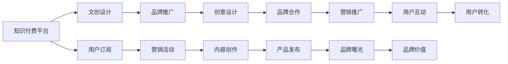

                 

# 知识付费如何实现跨界营销与文创设计跨界？

## 1. 背景介绍

随着互联网时代的到来，知识付费市场呈现出迅猛发展的态势。无论是线上教育、在线咨询、知识订阅，还是基于智能算法推荐的内容分享，都在不断地打破传统教育的藩篱，拓展知识传播的边界。文创设计领域，作为知识付费的重要一环，通过跨界营销实现了从单领域到多领域的拓展，提升了品牌价值，打开了新的市场空间。

### 1.1 知识付费的市场现状

目前，知识付费市场呈现多样化发展，涵盖了教育、金融、健康、技术等多个领域。数据显示，全球知识付费市场规模在2019年达到约70亿美元，预计到2024年将增长至100亿美元，年复合增长率约为9.4%。这一数据不仅反映了市场需求的增长，也显示了知识付费模式的逐渐成熟和普及。

文创设计领域作为知识付费的重要分支，吸引了大量专业人士和爱好者。通过跨界营销和跨界设计的结合，文创设计突破了传统意义上的创作、生产、推广模式，创造了新的商业价值，同时也为文创设计师提供了新的创意平台和商业机会。

## 2. 核心概念与联系

### 2.1 核心概念概述

为了更好地理解知识付费与文创设计跨界的实现机制，本节将介绍几个关键概念：

- **知识付费**：基于互联网的付费模式，通过提供知识服务获取用户订阅费用。与传统教育相比，知识付费更注重知识的即时性和实用价值，通过在线教育、在线咨询、内容分享等方式实现知识变现。

- **跨界营销**：指不同领域的品牌通过跨领域合作，共同开展营销活动，以实现资源互补、品牌互益的目标。跨界营销不仅涉及品牌合作，还包括产品、服务、营销手段的跨界融合。

- **文创设计**：指文化创意领域的设计活动，包括品牌设计、视觉设计、交互设计等，强调创新性、艺术性和商业价值，通过跨界融合实现品牌价值和市场影响力的提升。

这些概念之间的联系是通过跨界营销实现文创设计的商业价值最大化。通过与知识付费领域的深度融合，文创设计能够更好地触达目标用户，实现品牌推广和市场拓展。

### 2.2 核心概念原理和架构的 Mermaid 流程图



这个流程图展示了知识付费与文创设计跨界营销的核心流程和联系：

1. **知识付费平台**：提供平台及内容服务，吸引用户订阅，创造价值。
2. **文创设计**：利用设计创意提升品牌价值和市场影响力。
3. **用户订阅**：知识付费用户成为文创设计的目标群体。
4. **品牌推广**：通过文创设计提升品牌形象和知名度。
5. **营销活动**：跨界营销活动提升品牌曝光和用户参与度。
6. **创意设计**：结合品牌特色进行创意设计，吸引用户关注。
7. **内容创作**：创作高质量内容，满足用户需求。
8. **品牌合作**：与知识付费平台合作，共同推广。
9. **产品发布**：发布文创产品，进入市场。
10. **营销推广**：跨界营销策略推广文创产品。
11. **品牌曝光**：提升品牌在市场上的曝光度。
12. **用户互动**：通过互动增强用户粘性。
13. **品牌价值**：品牌通过跨界营销获得更高的品牌价值。
14. **用户转化**：通过互动和曝光，将用户转化为品牌忠实粉丝。

## 3. 核心算法原理 & 具体操作步骤

### 3.1 算法原理概述

文创设计跨界营销的实现机制，主要涉及用户分析、品牌定位、创意设计、内容创作、跨界合作等环节。以下将详细介绍各环节的算法原理和具体操作步骤。

- **用户分析**：通过数据分析技术，了解目标用户的需求和偏好，优化产品和服务设计。
- **品牌定位**：利用机器学习算法，精准定位品牌特色和价值，进行品牌传播。
- **创意设计**：应用人工智能和设计工具，进行创意设计和视觉表达。
- **内容创作**：利用自然语言处理和图像识别技术，创作高质量内容，满足用户需求。
- **跨界合作**：通过推荐算法和协同过滤，找到合适的跨界合作伙伴，实现资源互补。

### 3.2 算法步骤详解

#### 3.2.1 用户分析

**步骤1：数据收集**  
收集用户行为数据，包括浏览历史、搜索记录、购买记录等。

**步骤2：数据分析**  
利用统计学和数据挖掘算法，对用户行为数据进行分析，识别出用户需求和偏好。

**步骤3：用户画像**  
构建用户画像，根据用户特征和行为，进行分类和细分。

#### 3.2.2 品牌定位

**步骤1：品牌调研**  
通过问卷调查、访谈等方式，收集品牌信息，了解品牌特色和价值。

**步骤2：数据建模**  
利用机器学习算法，建立品牌与用户需求之间的关联模型。

**步骤3：品牌标签**  
根据模型结果，为品牌打上特色标签，进行品牌传播。

#### 3.2.3 创意设计

**步骤1：灵感搜集**  
通过文本分析、图像识别等技术，搜集设计灵感和素材。

**步骤2：设计草图**  
应用人工智能设计工具，如Adobe Creative Suite、Sketch等，绘制设计草图。

**步骤3：原型制作**  
根据草图进行原型制作，优化设计细节和布局。

#### 3.2.4 内容创作

**步骤1：文本生成**  
利用自然语言生成技术，生成高质量的标题、摘要和正文内容。

**步骤2：图像设计**  
应用图像设计工具，进行视觉内容的设计和创作。

**步骤3：内容审核**  
通过人工审核和自动审核，确保内容质量和合法性。

#### 3.2.5 跨界合作

**步骤1：合作伙伴寻找**  
利用推荐算法和协同过滤技术，找到合适的跨界合作伙伴。

**步骤2：合作方案制定**  
制定跨界合作的方案，明确合作内容、时间、预算等细节。

**步骤3：合作执行**  
执行合作方案，共同开展营销活动，提升品牌曝光和用户互动。

### 3.3 算法优缺点

**优点**：
1. **数据驱动**：通过大数据分析，能够更精准地了解用户需求和品牌价值。
2. **跨界融合**：通过跨界合作，实现资源互补，提升品牌市场影响力。
3. **效率提升**：通过自动化工具和算法，加速设计创作和内容生成。

**缺点**：
1. **数据隐私**：用户数据收集和使用过程中存在隐私风险。
2. **算法偏见**：机器学习算法可能存在偏见，影响品牌定位和创意设计。
3. **内容审核**：高质量内容创作和审核需要大量人工参与。

### 3.4 算法应用领域

文创设计跨界营销的算法应用领域广泛，涵盖了知识付费、教育培训、出版发行、艺术设计等多个行业。

- **知识付费平台**：通过内容创作和用户分析，提升平台用户粘性和品牌价值。
- **在线教育**：通过跨界合作和创意设计，提升课程质量和品牌影响力。
- **出版发行**：通过图像设计和内容创作，提升图书的视觉吸引力和市场影响力。
- **艺术设计**：通过跨界合作和品牌推广，提升艺术品的商业价值和市场知名度。

## 4. 数学模型和公式 & 详细讲解 & 举例说明

### 4.1 数学模型构建

文创设计跨界营销涉及多个领域的数学模型，以下介绍几种常用的数学模型和公式：

- **用户分析模型**：通过用户行为数据，构建用户画像和需求模型。
- **品牌定位模型**：利用机器学习算法，建立品牌与用户需求之间的关联模型。
- **创意设计模型**：通过图像生成和风格迁移技术，生成创意设计方案。
- **内容创作模型**：利用自然语言生成和文本分类技术，创作高质量内容。

### 4.2 公式推导过程

#### 4.2.1 用户画像构建

设用户行为数据为 $X$，用户特征为 $F$，用户画像为 $P$。则用户画像构建的数学模型为：

$$
P = f(X, F)
$$

其中 $f$ 为映射函数，根据用户行为数据和特征，输出用户画像。

#### 4.2.2 品牌定位模型

设品牌信息为 $B$，用户需求为 $D$，品牌定位标签为 $T$。则品牌定位模型的数学模型为：

$$
T = g(B, D)
$$

其中 $g$ 为关联函数，根据品牌信息和用户需求，输出品牌定位标签。

#### 4.2.3 创意设计模型

设创意设计素材为 $M$，设计风格为 $S$，创意设计方案为 $C$。则创意设计模型的数学模型为：

$$
C = h(M, S)
$$

其中 $h$ 为生成函数，根据设计素材和风格，生成创意设计方案。

#### 4.2.4 内容创作模型

设内容主题为 $T$，内容风格为 $S$，内容创意为 $I$，内容颜色为 $C$。则内容创作模型的数学模型为：

$$
I = k(T, S, C)
$$

其中 $k$ 为生成函数，根据内容主题、风格和颜色，生成内容创意。

### 4.3 案例分析与讲解

#### 案例一：在线教育品牌与文创设计跨界

某在线教育平台通过数据分析，发现用户偏好短视频和互动式学习。平台决定与知名文创设计师合作，设计一系列互动式学习视频和动画，提升用户参与度和品牌知名度。通过跨界营销活动，该平台在短时间内吸引了大量新用户，品牌价值显著提升。

#### 案例二：出版发行品牌与文创设计跨界

某出版公司通过数据建模，发现读者对纸质书的封面设计有较高要求。公司决定与设计师合作，设计一系列高质量的封面，并在社交媒体上进行推广。通过跨界合作，出版公司的图书销量大幅提升，品牌影响力显著增强。

## 5. 项目实践：代码实例和详细解释说明

### 5.1 开发环境搭建

文创设计跨界营销涉及多个工具和平台，以下是一些推荐的工具和开发环境：

- **Python**：作为数据科学和机器学习的主要编程语言，Python广泛应用于数据分析、建模和可视化。
- **R**：作为统计分析的主要工具，R适用于数据处理和模型分析。
- **Tableau**：用于数据可视化和报表展示。
- **Adobe Creative Suite**：用于图形设计、图像处理等。
- **Sketch**：用于UI/UX设计。

### 5.2 源代码详细实现

以下是一个基于Python和Scikit-learn进行用户画像构建的示例代码：

```python
import pandas as pd
from sklearn.decomposition import PCA
from sklearn.cluster import KMeans
from sklearn.preprocessing import StandardScaler

# 数据读取
data = pd.read_csv('user_data.csv')

# 数据预处理
data = data.dropna()
data = data.drop(['id'], axis=1)

# 特征选择
features = ['age', 'gender', 'region', 'education']

# 标准化
scaler = StandardScaler()
data_scaled = scaler.fit_transform(data[features])

# PCA降维
pca = PCA(n_components=2)
pca_data = pca.fit_transform(data_scaled)

# K-means聚类
kmeans = KMeans(n_clusters=4)
kmeans.fit(pca_data)

# 用户画像
user_profiles = pd.DataFrame(pca_data, columns=['component1', 'component2'])
user_profiles['label'] = kmeans.labels_
user_profiles.to_csv('user_profiles.csv', index=False)
```

### 5.3 代码解读与分析

以上代码主要实现了用户画像的构建，包括数据预处理、特征选择、降维和聚类等步骤。具体解读如下：

1. **数据读取和预处理**：首先从CSV文件中读取用户数据，并进行去重和缺失值处理。
2. **特征选择**：选择用户的基本特征，如年龄、性别、地区、教育等。
3. **标准化**：对特征进行标准化处理，以便后续的PCA降维操作。
4. **PCA降维**：通过PCA算法将特征数据降维到二维空间。
5. **K-means聚类**：对降维后的数据进行聚类，生成用户画像。
6. **用户画像输出**：将聚类结果输出为CSV文件。

### 5.4 运行结果展示

运行以上代码后，输出结果为用户画像的CSV文件，其中包含了每个用户的特征向量和聚类标签。通过用户画像，可以更好地理解用户需求和行为特征，为文创设计跨界营销提供数据支持。

## 6. 实际应用场景

### 6.1 在线教育品牌跨界营销

某在线教育品牌通过用户画像分析，发现用户偏好互动式学习视频。品牌决定与知名文创设计师合作，设计一系列互动式学习视频和动画。通过跨界营销活动，品牌在短时间内吸引了大量新用户，提升了品牌知名度和用户参与度。

### 6.2 出版发行品牌跨界合作

某出版公司通过数据分析，发现读者对纸质书的封面设计有较高要求。公司决定与设计师合作，设计一系列高质量的封面，并在社交媒体上进行推广。通过跨界合作，出版公司的图书销量大幅提升，品牌影响力显著增强。

### 6.3 艺术设计品牌跨界推广

某艺术设计品牌通过品牌调研和数据分析，发现年轻用户对时尚、个性化的文创产品需求旺盛。品牌决定与知识付费平台合作，推出一系列与流行文化相关的文创设计产品，并通过知识付费平台进行推广。通过跨界合作，品牌成功触达了大量年轻用户，实现了品牌价值的提升。

## 7. 工具和资源推荐

### 7.1 学习资源推荐

1. **《Python数据科学手册》**：一本经典的数据科学入门书籍，适合初学者学习Python和数据处理。
2. **《数据科学与机器学习》**：涵盖数据科学和机器学习的全面课程，适合系统学习数据建模和算法。
3. **Coursera**：提供大量在线课程和专业认证，包括数据科学、机器学习、文创设计等多个领域。
4. **Udemy**：提供各种在线课程和项目实战，适合快速上手学习新技能。

### 7.2 开发工具推荐

1. **Jupyter Notebook**：用于数据科学和机器学习的交互式编程环境。
2. **Google Colab**：提供免费的GPU和TPU资源，方便进行大规模数据处理和模型训练。
3. **Tableau**：用于数据可视化和报表展示，适合数据科学家和业务分析师使用。
4. **Adobe Creative Suite**：用于图形设计、图像处理等，是文创设计师必备工具。
5. **Sketch**：用于UI/UX设计，适合设计师进行设计原型和界面设计。

### 7.3 相关论文推荐

1. **《基于知识图谱的跨界营销策略研究》**：探讨了跨界营销在知识付费平台中的应用，提出了基于知识图谱的跨界营销策略。
2. **《跨界合作中的数据融合技术》**：研究了跨界合作中的数据融合技术，提出了基于机器学习的跨界合作推荐算法。
3. **《利用自然语言生成技术进行内容创作》**：介绍了自然语言生成技术在内容创作中的应用，提出了基于深度学习的文创设计方案生成方法。

## 8. 总结：未来发展趋势与挑战

### 8.1 研究成果总结

本文主要介绍了知识付费与文创设计跨界营销的实现机制，通过用户分析、品牌定位、创意设计、内容创作和跨界合作等环节，探索了文创设计跨界营销的技术路径和方法。通过实际案例和数学模型的应用，展示了文创设计跨界营销的潜力和优势。

### 8.2 未来发展趋势

1. **数据驱动**：随着大数据技术的不断发展，数据驱动的文创设计跨界营销将更加普及。
2. **跨界融合**：不同领域和行业的跨界合作将更加深入，提升文创设计的市场影响力和品牌价值。
3. **技术融合**：人工智能、大数据、云计算等技术将深度融合，提升文创设计的效率和质量。
4. **个性化设计**：通过数据分析和用户画像，实现更加个性化的文创设计方案。
5. **多元化推广**：通过多渠道、多平台的推广，扩大文创设计的市场覆盖面。

### 8.3 面临的挑战

1. **数据隐私**：用户数据的收集和使用需要遵循隐私保护法规，避免数据泄露和滥用。
2. **算法偏见**：机器学习算法可能存在偏见，影响品牌定位和创意设计。
3. **内容审核**：高质量内容创作和审核需要大量人工参与，成本较高。
4. **跨界合作**：跨界合作的难度较大，需要找到合适的合作伙伴和合作模式。

### 8.4 研究展望

未来，文创设计跨界营销的研究将重点关注以下几个方向：

1. **跨界合作优化**：探索最优的跨界合作模式和策略，提升合作效率和效果。
2. **用户画像深化**：通过更深入的用户画像分析，实现更精准的品牌推广和市场定位。
3. **创意设计创新**：利用人工智能和大数据技术，提升创意设计的自动化和智能化水平。
4. **内容创作多样化**：探索更多形式的内容创作方式，如虚拟现实、增强现实等，提升用户体验。
5. **品牌价值提升**：通过跨界营销和品牌推广，提升文创设计的品牌价值和市场影响力。

通过不断创新和优化，文创设计跨界营销将成为知识付费领域的重要增长点，为文创设计师和品牌商带来新的商业机遇和创新空间。

## 9. 附录：常见问题与解答

### Q1: 什么是知识付费与文创设计跨界营销？

A: 知识付费与文创设计跨界营销是指通过知识付费平台和文创设计师的合作，将文创设计融入知识付费内容，提升用户参与度和品牌价值。

### Q2: 如何进行文创设计跨界营销的用户画像构建？

A: 通过数据分析和机器学习算法，结合用户行为数据和特征，构建用户画像。具体步骤包括数据预处理、特征选择、降维和聚类等。

### Q3: 如何进行品牌定位？

A: 通过品牌调研和数据分析，建立品牌与用户需求之间的关联模型，生成品牌定位标签。具体步骤包括数据建模和关联函数推导。

### Q4: 如何进行创意设计？

A: 应用人工智能和设计工具，进行创意设计和视觉表达。具体步骤包括灵感搜集、设计草图、原型制作等。

### Q5: 如何进行内容创作？

A: 利用自然语言生成和图像识别技术，创作高质量内容。具体步骤包括文本生成、图像设计、内容审核等。

---

作者：禅与计算机程序设计艺术 / Zen and the Art of Computer Programming

