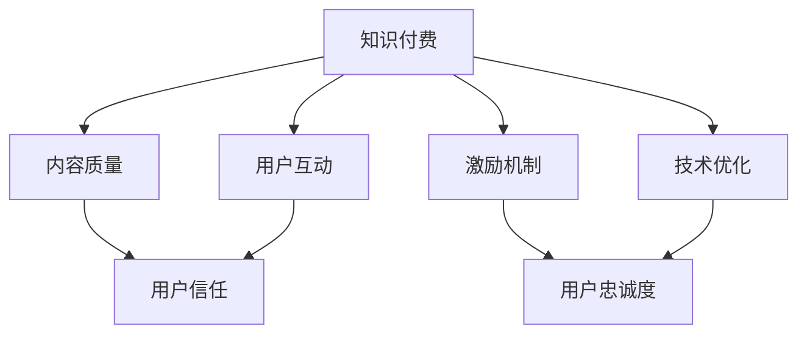

                 

# 知识付费如何建立用户信任和忠诚度？

> 关键词：知识付费, 用户信任, 忠诚度, 内容质量, 用户互动, 激励机制, 技术优化

## 1. 背景介绍

随着信息爆炸时代的到来，知识付费正成为一种新的知识获取方式。与免费获取信息相比，知识付费能够为消费者提供更高质量、更系统的知识内容，帮助他们更高效地提升自我，满足个性化的学习需求。然而，在知识付费领域，如何建立用户的信任和忠诚度，是各平台和内容创作者面临的共同挑战。本文将从核心概念入手，深入探讨知识付费中建立用户信任和忠诚度的机制，为相关企业和从业者提供策略指导。

## 2. 核心概念与联系

### 2.1 核心概念概述

1. **知识付费（Knowledge Subscription）**：用户为获得高质量的知识内容，通过付费订阅或单次购买的方式，获取知识资源的服务形式。

2. **用户信任（User Trust）**：用户在支付费用获取知识内容时，对知识付费平台的可靠性和内容质量的信心程度。

3. **用户忠诚度（User Loyalty）**：用户对知识付费平台的持续使用和推荐意愿，体现了平台对用户需求的满足程度和用户体验的感知。

4. **内容质量（Content Quality）**：知识付费平台提供的课程、文章、视频等内容的专业性和实用性。

5. **用户互动（User Interaction）**：用户在知识付费平台上的互动行为，包括评论、点赞、分享等，反映了平台与用户之间的互动程度。

6. **激励机制（Incentive Mechanism）**：知识付费平台为了鼓励用户购买和互动，设计的各种奖励和优惠措施。

7. **技术优化（Technical Optimization）**：平台通过技术手段提升用户体验的策略，如个性化推荐、界面优化、响应速度等。

以上概念之间存在紧密联系，良好的内容质量和用户互动可以增强用户信任，而激励机制和技术优化则能进一步提升用户忠诚度。

### 2.2 核心概念原理和架构的 Mermaid 流程图



此图展示了一个简化的知识付费平台中各核心概念之间的逻辑关系：

- 知识付费平台提供高质量内容（B），用户因此获得信任（C）。
- 平台通过互动（D）和激励（E）进一步提升用户信任和忠诚度（F）。
- 技术优化（G）提高用户体验，从而增强用户忠诚度（F）。

## 3. 核心算法原理 & 具体操作步骤

### 3.1 算法原理概述

建立用户信任和忠诚度的过程，本质上是一个多因素协同优化的过程。通过不断改进内容质量、增强用户互动、优化激励机制和技术架构，知识付费平台可以逐步建立和维护用户的信任和忠诚度。

### 3.2 算法步骤详解

1. **内容质量优化**：
   - 定期评估内容的专业性和实用性，引入专家评审机制，提升课程和文章的权威性。
   - 通过用户反馈和评价，动态调整课程内容和结构，确保课程贴近用户需求。
   - 引入多样化的内容形式，如图文、视频、音频等，满足不同用户的需求偏好。

2. **用户互动增强**：
   - 设计合理的互动界面，使用户能够在平台内方便地进行评论、点赞、分享等操作。
   - 引入社区功能，建立用户之间的互动和交流平台，提升用户粘性。
   - 定期举办线上线下活动，增加用户参与感和归属感。

3. **激励机制设计**：
   - 设计积分系统，用户通过学习、互动获得积分，积分可以兑换优惠券、免费课程等奖励。
   - 定期推出限时优惠、折扣活动，吸引新用户和提高老用户的活跃度。
   - 设置会员体系，提供会员专享内容和服务，提升用户粘性。

4. **技术优化策略**：
   - 采用高性能的服务器和数据库，保障平台的稳定性和响应速度。
   - 使用先进的视频流媒体技术和缓存策略，提升视频课程的播放质量。
   - 通过个性化推荐算法，根据用户历史行为推荐相关内容，提升用户体验。

### 3.3 算法优缺点

#### 优点：

- **全面提升用户体验**：通过内容质量优化、用户互动增强、激励机制设计和技术优化，全面提升用户满意度。
- **用户忠诚度提升**：合理的设计和策略能够显著提高用户的长期使用意愿和推荐行为。
- **灵活可调整**：各策略可以根据平台和用户的具体情况进行调整，具有较强的灵活性。

#### 缺点：

- **实施复杂**：需要多部门协同合作，涉及内容生产、技术开发、市场营销等多个方面。
- **成本较高**：优化和增强措施需要投入较大的人力和物力资源。

### 3.4 算法应用领域

知识付费平台如Coursera、Udemy、网易云课堂等，均已采用上述策略，通过不断改进和优化，建立起强大的用户信任和忠诚度，吸引了大量用户订阅和购买。

## 4. 数学模型和公式 & 详细讲解 & 举例说明

### 4.1 数学模型构建

假设知识付费平台有 $N$ 个用户，每个用户每天有 $P$ 次访问行为，每次访问行为会产生 $I$ 次互动，每次互动会带来 $C$ 元的收益，用户每次购买课程的费用为 $F$，内容质量得分为 $Q$，用户互动得分为 $I$，激励机制得分为 $M$，技术优化得分为 $T$。

平台的总收益 $R$ 可表示为：

$$
R = P \times I \times C + N \times F \times Q \times I \times M \times T
$$

其中， $Q = f(Q_i)$， $I = g(I_i)$， $M = h(M_i)$， $T = t(T_i)$ 分别表示内容质量、用户互动、激励机制、技术优化的函数形式。

### 4.2 公式推导过程

为了最大化平台收益 $R$，需要对 $Q$， $I$， $M$， $T$ 进行优化。以内容质量为例，其优化目标为：

$$
\max_{Q_i} f(Q_i) = \max_{Q_i} \left( \frac{Q_i}{\sum_{j=1}^{N} Q_j} \right)
$$

其中， $\frac{Q_i}{\sum_{j=1}^{N} Q_j}$ 表示内容质量占总体的比例，最大化这一比例，能够提升内容的权威性和用户满意度。

类似的，用户互动、激励机制、技术优化等也可通过相似的方式进行优化，实现平台收益的最大化。

### 4.3 案例分析与讲解

以Coursera平台为例，其通过以下几个策略提升用户信任和忠诚度：

1. **高质量内容**：Coursera 邀请全球顶尖大学和专家开设课程，课程内容经过严格审核和认证，确保了内容的权威性和实用性。

2. **社区互动**：平台设有论坛、讨论区等功能，用户可以在社区内分享学习心得、交流讨论，增强了用户互动。

3. **积分系统**：用户通过学习、互动获得积分，积分可以兑换优惠券和免费课程，增加了用户粘性。

4. **个性化推荐**：Coursera 通过机器学习算法，根据用户历史行为推荐相关课程，提升了用户体验。

5. **会员特权**：Coursera 设置高级会员，提供专属课程、服务和技术支持，进一步增强用户忠诚度。

## 5. 项目实践：代码实例和详细解释说明

### 5.1 开发环境搭建

1. **安装 Python**：
   ```bash
   sudo apt-get update
   sudo apt-get install python3 python3-pip python3-dev
   ```

2. **安装 Django**：
   ```bash
   pip install Django
   ```

3. **创建 Django 项目和应用**：
   ```bash
   django-admin startproject knowledge_purchase
   cd knowledge_purchase
   python manage.py startapp content_system
   ```

### 5.2 源代码详细实现

**content_system/views.py**：
```python
from django.shortcuts import render, redirect
from django.contrib.auth.decorators import login_required
from django.contrib import messages

@login_required
def content_page(request):
    if request.method == 'POST':
        review_content = request.POST['review_content']
        review_score = request.POST['review_score']
        # 处理用户评价
        # ...
        messages.success(request, 'Your review has been submitted.')
        return redirect('content_page')
    return render(request, 'content_system/content.html')
```

**content_system/templates/content.html**：
```html



<h2>Course Review</h2>
<form method="post">
    
    <textarea name="review_content" rows="4" cols="50"></textarea>
    <select name="review_score">
        <option value="1">1</option>
        <option value="2">2</option>
        <option value="3">3</option>
        <option value="4">4</option>
        <option value="5">5</option>
    </select>
    <button type="submit">Submit Review</button>
</form>

```

**content_system/admin.py**：
```python
from django.contrib import admin
from .models import Review

admin.site.register(Review)
```

**content_system/models.py**：
```python
from django.db import models
from django.contrib.auth.models import User

class Review(models.Model):
    user = models.ForeignKey(User, on_delete=models.CASCADE)
    course = models.ForeignKey('Course', on_delete=models.CASCADE)
    content = models.TextField()
    score = models.IntegerField()

    def __str__(self):
        return f'{self.user.username} - {self.score}'
```

### 5.3 代码解读与分析

本示例演示了如何在 Django 平台上实现用户对课程的评价功能。用户登录后，可以提交对课程的评价，平台根据评价生成统计信息，用于优化内容质量。

**views.py**：
- `login_required` 装饰器确保用户必须登录后才能进行评价。
- 用户提交评价后，使用 Django 的消息模块（`messages`）向用户发送成功提示。

**content.html**：
- 使用 HTML 和 Django 模板语言（``）继承页面基础模板。
- 使用 Django 表单处理机制（`<form method="post">`）捕获用户输入。

**admin.py**：
- 在 Django 管理界面（admin）中注册 `Review` 模型，便于管理和监控用户评价。

**models.py**：
- 定义了 `Review` 模型，关联用户和课程，记录用户的评价内容和评分。

### 5.4 运行结果展示

运行项目后，用户登录后即可看到评价页面，提交评价后系统显示成功提示，管理员可以在 Django 管理界面查看评价数据，用于分析优化内容质量。

## 6. 实际应用场景

### 6.1 教育培训

教育培训机构如新东方、学而思等，通过提供高质量的课程和良好的用户体验，建立了较高的用户信任和忠诚度。平台通过定期收集用户反馈，不断改进课程内容和教学方法，提升了用户的满意度和续订率。

### 6.2 职业培训

职业技能培训平台如LinkedIn Learning、Udacity，通过引入行业专家和实时项目实践，帮助用户提升职业技能。平台通过邀请专家授课、提供项目实战机会等措施，增强了用户的参与感和学习效果。

### 6.3 语言学习

语言学习平台如Duolingo、Babbel，通过趣味化的课程设计和互动游戏，提升了用户的兴趣和学习效果。平台通过定期更新课程内容和提供个性化推荐，增强了用户粘性。

## 7. 工具和资源推荐

### 7.1 学习资源推荐

1. **《知识付费：构建信任和忠诚度的策略》（Knowledge Subscription: Strategies for Trust and Loyalty）**：该书详细介绍了知识付费平台如何通过内容、互动、激励和优化，建立用户信任和忠诚度。

2. **Coursera 官方博客**：Coursera 在博客上分享了大量的运营策略和案例分析，可供学习借鉴。

3. **Django 官方文档**：Django 是一个流行的 Python Web 框架，通过 Django 实现用户评价功能，可以大大提升用户体验。

### 7.2 开发工具推荐

1. **Django**：一个流行的 Python Web 框架，提供了丰富的功能和灵活性，适用于构建知识付费平台。

2. **MySQL/PostgreSQL**：常用的关系型数据库，用于存储用户数据和课程信息。

3. **Redis**：用于缓存用户数据，提升访问速度和性能。

4. **Flask**：一个轻量级的 Python Web 框架，适用于构建小型知识付费应用。

### 7.3 相关论文推荐

1. **《知识付费平台的信任和忠诚度研究》（Trust and Loyalty in Knowledge Purchase Platforms）**：该论文探讨了知识付费平台如何通过内容质量、用户互动、激励机制和技术优化，建立用户信任和忠诚度。

2. **《个性化推荐算法在知识付费平台中的应用》（Application of Personalized Recommendation Algorithms in Knowledge Purchase Platforms）**：该论文介绍了如何通过机器学习算法，提升知识付费平台的个性化推荐效果。

## 8. 总结：未来发展趋势与挑战

### 8.1 研究成果总结

本文系统介绍了知识付费平台中建立用户信任和忠诚度的关键因素，包括内容质量、用户互动、激励机制和技术优化等。通过理论与实践相结合的方式，详细阐述了知识付费平台如何通过不断改进和优化，提升用户体验和平台收益。

### 8.2 未来发展趋势

1. **人工智能和大数据分析**：利用人工智能和大数据分析技术，对用户行为和反馈进行深入分析，优化课程推荐和个性化服务。
2. **区块链技术**：通过区块链技术实现内容版权保护和交易透明化，提升用户信任和平台安全性。
3. **社交网络整合**：将知识付费平台与社交网络整合，增强用户互动和推荐效果。

### 8.3 面临的挑战

1. **内容同质化**：随着平台数量的增加，内容同质化现象日益严重，用户难以区分平台差异。
2. **竞争激烈**：知识付费市场竞争激烈，如何吸引用户和保持用户粘性是一个重要挑战。
3. **用户隐私保护**：如何在提供个性化推荐和服务的同时，保护用户隐私，避免数据滥用。

### 8.4 研究展望

1. **内容创新**：开发更多新颖、有趣的课程内容，满足用户的个性化需求。
2. **平台合作**：与其他平台和机构合作，共享资源和用户数据，提升整体用户体验。
3. **技术创新**：探索新型技术如VR/AR、人工智能等，提升课程体验和互动效果。

## 9. 附录：常见问题与解答

**Q1: 如何衡量知识付费平台的用户信任和忠诚度？**

A: 用户信任和忠诚度可以通过以下几个指标衡量：
1. **订阅率**：用户订阅课程的比例，反映了用户对平台的信任程度。
2. **续订率**：用户续订课程的比例，反映了用户的忠诚度。
3. **用户评价**：用户对课程和平台的评价，反映了用户满意度和信任度。
4. **互动频率**：用户在平台上的互动频率，反映了用户粘性和活跃度。

**Q2: 如何提升知识付费平台的内容质量？**

A: 提升内容质量需要从以下几个方面入手：
1. **专家引入**：邀请行业专家和名校教授开设课程，提升课程的权威性和实用性。
2. **用户反馈**：定期收集用户反馈，根据用户需求和建议调整课程内容和结构。
3. **内容迭代**：定期更新课程内容，引入最新知识和技能，保持课程的时效性和实用性。

**Q3: 如何设计有效的激励机制？**

A: 设计有效的激励机制需要考虑以下几个因素：
1. **积分系统**：通过学习、互动获得积分，积分可以兑换优惠券、免费课程等奖励。
2. **限时优惠**：定期推出限时优惠和折扣活动，吸引新用户和提高老用户的活跃度。
3. **会员特权**：设置会员体系，提供会员专享内容和服务，增强用户粘性。

**Q4: 如何优化知识付费平台的技术架构？**

A: 优化技术架构需要从以下几个方面入手：
1. **高性能服务器**：使用高性能的服务器和数据库，保障平台的稳定性和响应速度。
2. **缓存策略**：使用缓存技术，提升视频课程的播放质量和用户体验。
3. **个性化推荐**：通过机器学习算法，根据用户历史行为推荐相关内容，提升用户体验。

**Q5: 如何处理用户评价和反馈？**

A: 处理用户评价和反馈需要从以下几个方面入手：
1. **自动处理**：使用自然语言处理技术自动处理用户评价，提取关键信息和情感。
2. **人工审核**：引入人工审核机制，对自动处理结果进行复审和校正。
3. **改进策略**：根据用户评价和反馈，优化课程内容和教学方法，提升用户体验。

---

作者：禅与计算机程序设计艺术 / Zen and the Art of Computer Programming

