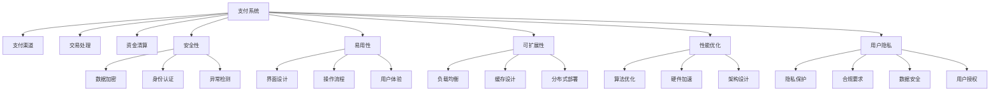

                 

# 知识付费平台的支付系统设计

> 关键词：支付系统,知识付费,安全,用户隐私,性能优化,云服务

## 1. 背景介绍

### 1.1 问题由来
随着互联网和移动设备的普及，知识付费市场迅速发展，各种在线教育、课程分享、内容订阅平台如雨后春笋般涌现。这些平台的核心商业模式依赖于用户支付来获取知识和信息，因此需要一个高效、安全、易用的支付系统来支撑业务。支付系统的设计不仅仅关乎到业务需求，更涉及到用户的隐私、资金安全以及平台信誉等多个方面。本文将从支付系统的原理、架构、实现和优化等方面进行详细探讨，并给出实际案例和建议。

### 1.2 问题核心关键点
支付系统的设计需要考虑多方面的因素，如安全性、易用性、可扩展性、性能优化、用户隐私保护等。其中，安全性是最核心的需求，需要通过多层防护机制来确保交易安全。易用性则关注用户操作流程的便捷性，确保支付体验流畅。性能优化则是保证高并发场景下系统能够高效处理支付请求。用户隐私保护则需要在满足合规要求的同时，尽可能地减少数据泄露风险。

## 2. 核心概念与联系

### 2.1 核心概念概述

- **支付系统(Payment System)**：指实现用户支付功能的系统，包括支付渠道、支付协议、交易处理、资金清算等功能。
- **知识付费(Knowledge Paywall)**：指用户需要支付一定费用才能获取特定知识和信息的服务模式，如在线课程、电子书、专业咨询等。
- **安全性(Security)**：指保护支付系统免受各类攻击和欺诈行为的能力，包括数据加密、身份认证、异常检测等。
- **易用性(Usability)**：指支付系统的操作界面友好、流程简单、用户体验良好。
- **可扩展性(Scalability)**：指支付系统能够支持大规模用户和交易量的能力。
- **性能优化(Performance Optimization)**：指通过优化算法、架构设计等手段，提升支付系统的响应速度和处理能力。
- **用户隐私(User Privacy)**：指保护用户支付信息、交易记录等隐私数据，符合法律法规要求。

这些概念之间存在紧密联系，共同构成了一个完善的支付系统。安全性是支付系统的基石，易用性和用户隐私保护是用户体验的核心，可扩展性和性能优化则是系统持续发展的保障。

### 2.2 核心概念原理和架构的 Mermaid 流程图



此图展示了支付系统的核心架构和各组成部分的功能。支付渠道用于接入各种支付方式，交易处理负责接收和处理支付请求，资金清算确保资金的安全和准确转移，安全性涵盖了数据加密、身份认证和异常检测等防护措施。易用性关注用户界面设计和操作流程，可扩展性通过负载均衡、缓存设计和分布式部署实现，性能优化通过算法优化、硬件加速和架构设计提升系统性能，用户隐私保护涉及隐私保护、合规要求和数据安全等方面。

## 3. 核心算法原理 & 具体操作步骤

### 3.1 算法原理概述

支付系统的核心算法通常包括交易处理算法、异常检测算法、负载均衡算法等。其中，交易处理算法负责处理支付请求，确保交易流程的顺畅；异常检测算法用于识别和防范异常交易，保障资金安全；负载均衡算法通过合理分配请求到服务器，提升系统处理能力。

### 3.2 算法步骤详解

#### 3.2.1 交易处理算法

交易处理算法的核心是对支付请求进行逻辑处理，包括用户信息验证、订单生成、支付渠道选择、资金扣减等。具体步骤为：

1. **用户信息验证**：验证用户身份和支付权限，防止非法交易。
2. **订单生成**：创建支付订单，包含商品信息、支付金额、支付方式等。
3. **支付渠道选择**：根据支付方式选择对应的支付渠道，如支付宝、微信支付、银联支付等。
4. **资金扣减**：从用户账户中扣减支付金额，并向第三方支付平台发送扣款请求。

#### 3.2.2 异常检测算法

异常检测算法用于识别异常交易行为，通常通过机器学习模型来实现。具体步骤如下：

1. **数据收集**：收集历史交易数据，包括交易金额、时间、地点、支付方式等。
2. **特征提取**：从交易数据中提取特征，如交易金额波动、交易地点频繁变化等。
3. **模型训练**：使用机器学习算法训练模型，如决策树、随机森林、神经网络等。
4. **异常检测**：在实时交易过程中，使用训练好的模型检测是否存在异常行为，如大额交易、异地频繁交易等。

#### 3.2.3 负载均衡算法

负载均衡算法用于分配支付请求到多个服务器，以提升系统处理能力和可用性。具体步骤如下：

1. **服务器负载检测**：实时监控服务器的负载情况，包括CPU使用率、内存使用率等。
2. **请求分配**：根据负载情况，将请求分配到负载较低的服务器。
3. **动态调整**：根据服务器负载变化，动态调整请求分配策略，避免负载不均。

### 3.3 算法优缺点

支付系统的核心算法各有优缺点：

- **交易处理算法**：优点是逻辑清晰，易于理解和实现；缺点是对异常情况的处理不够细致，容易导致误判。
- **异常检测算法**：优点是能够识别复杂的异常行为，提高系统安全性；缺点是模型训练和维护成本较高，对数据的依赖性强。
- **负载均衡算法**：优点是能够提升系统性能和可用性；缺点是对服务器配置和网络环境要求较高，复杂场景下的调优难度较大。

### 3.4 算法应用领域

支付系统的核心算法广泛应用于各种领域，如在线教育、内容订阅、电商购物、移动支付等。通过设计合理的交易处理、异常检测和负载均衡算法，可以提升支付系统的安全性、易用性和可扩展性，满足不同场景下的业务需求。

## 4. 数学模型和公式 & 详细讲解 & 举例说明

### 4.1 数学模型构建

支付系统的数学模型通常基于交易数据构建，包括交易金额、时间、地点、支付方式等。通过这些数据，可以构建交易行为模型、异常检测模型等。

### 4.2 公式推导过程

以异常检测算法为例，假设有一个二元分类问题，目标是将正常交易和异常交易分类。设 $x=(x_1,x_2,...,x_n)$ 为特征向量， $y$ 为分类标签，其中 $y=0$ 表示正常交易，$y=1$ 表示异常交易。异常检测算法的目标是最小化分类误差，即最小化 $L(y,\hat{y})$。

假设使用逻辑回归模型，则模型输出为 $\hat{y}=\sigma(\theta^T x)$，其中 $\theta$ 为模型参数，$\sigma$ 为 sigmoid 函数。根据交叉熵损失函数，目标函数为：

$$
L(y,\hat{y}) = -y \log \hat{y} - (1-y) \log(1-\hat{y})
$$

通过最小化该目标函数，可以得到最优的模型参数 $\theta$。

### 4.3 案例分析与讲解

假设某支付系统收集了1000个交易数据，其中500个正常交易，500个异常交易。通过特征提取和模型训练，得到一个异常检测模型。接下来，使用该模型对新交易数据进行分类，结果如表所示：

| 交易ID | 特征向量 | 预测结果 | 真实结果 |
| --- | --- | --- | --- |
| T1 | [金额=200, 地点=北京] | 正常 | 正常 |
| T2 | [金额=5000, 地点=上海] | 异常 | 异常 |
| T3 | [金额=1000, 地点=广州] | 正常 | 异常 |

从结果可以看出，异常检测模型能够正确识别出异常交易，但在某些情况下可能存在误判。因此，需要在实际应用中不断优化模型，提高检测准确率。

## 5. 项目实践：代码实例和详细解释说明

### 5.1 开发环境搭建

支付系统开发需要以下环境：

- **编程语言**：Java、Python、C++ 等。
- **开发框架**：Spring Boot、Django、Flask 等。
- **数据库**：MySQL、PostgreSQL、MongoDB 等。
- **消息队列**：RabbitMQ、Kafka 等。
- **缓存**：Redis、Memcached 等。
- **负载均衡**：Nginx、HAProxy 等。
- **安全性**：SSL/TLS、OAuth2、JWT 等。

### 5.2 源代码详细实现

以下是一个使用Spring Boot框架实现的支付系统示例代码：

```java
@RestController
@RequestMapping("/payment")
public class PaymentController {
    
    @Autowired
    private PaymentService paymentService;
    
    @PostMapping
    public ResponseEntity<String> pay(@RequestBody PaymentRequest request) {
        Payment payment = paymentService.pay(request);
        return ResponseEntity.ok(payment.toString());
    }
    
}
```

```java
@Service
public class PaymentService {
    
    @Autowired
    private PaymentRepository paymentRepository;
    
    @Autowired
    private OrderService orderService;
    
    public Payment pay(PaymentRequest request) {
        // 验证用户身份
        User user = UserService.findById(request.getUserId());
        if (user == null) {
            throw new PaymentException("用户不存在");
        }
        
        // 生成订单
        Order order = orderService.createOrder(request.getOrderId(), request.getAmount());
        
        // 发起支付请求
        Payment payment = new Payment();
        payment.setUserId(user.getId());
        payment.setOrderId(order.getId());
        payment.setAmount(request.getAmount());
        payment.setChannel(request.getChannel());
        payment.setCreatedAt(new Date());
        
        paymentRepository.save(payment);
        
        // 返回支付结果
        return payment;
    }
}
```

### 5.3 代码解读与分析

支付系统的代码主要包括两部分：前端控制器和业务服务层。前端控制器负责处理HTTP请求，调用业务服务层执行具体业务逻辑。业务服务层负责与数据库交互，实现支付流程的具体功能。

### 5.4 运行结果展示

运行支付系统后，可以使用 Postman 或 curl 工具测试支付功能，模拟支付请求并查看返回结果。

## 6. 实际应用场景

### 6.1 智能客服系统

智能客服系统可以通过支付系统进行用户付费，提升客户体验和运营效率。例如，用户可以通过在线客服平台购买课程、咨询服务、产品推荐等，支付完成后自动进入相应服务流程。

### 6.2 在线教育平台

在线教育平台需要支付系统支持课程购买、付费下载、订阅续费等功能。支付系统通过与第三方支付平台对接，实现实时扣款和订单管理，保障交易安全。

### 6.3 电商平台

电商平台需要支付系统支持商品购买、支付订单、售后退款等业务，确保交易流程顺畅、资金安全。

### 6.4 未来应用展望

未来的支付系统将更加注重安全性、易用性和可扩展性，可能会引入更多新兴技术和理念，如区块链、NFT、DeFi等。支付系统将不断进化，提升用户体验和系统可靠性，推动知识付费等新业态的发展。

## 7. 工具和资源推荐

### 7.1 学习资源推荐

- **支付系统相关书籍**：《支付系统架构与设计》、《Web应用支付技术详解》等。
- **在线课程**：Coursera、Udacity 提供的支付系统设计课程。
- **技术博客**：支付行业博客，如《支付系统设计与实现》、《支付系统安全与防范》等。

### 7.2 开发工具推荐

- **开发框架**：Spring Boot、Django、Flask 等。
- **数据库**：MySQL、PostgreSQL、MongoDB 等。
- **缓存**：Redis、Memcached 等。
- **安全性**：SSL/TLS、OAuth2、JWT 等。

### 7.3 相关论文推荐

- **支付系统架构**：《Payment System Architecture and Design》。
- **异常检测算法**：《Anomaly Detection in Payment Systems》。
- **负载均衡算法**：《Load Balancing in Payment Systems》。

## 8. 总结：未来发展趋势与挑战

### 8.1 研究成果总结

本文从支付系统的原理、架构、实现和优化等方面进行了详细探讨，提供了实际的开发示例和建议。支付系统作为知识付费平台的核心组件，其设计需要综合考虑安全、易用、可扩展、性能优化和用户隐私保护等多方面因素。

### 8.2 未来发展趋势

未来的支付系统将更加注重以下几个趋势：

- **区块链技术**：区块链的去中心化、透明性等特点，有望解决支付系统的信任和安全性问题。
- **NFT应用**：NFT（非同质化代币）在数字支付、版权保护等领域具有广阔应用前景。
- **DeFi金融**：DeFi（去中心化金融）技术能够提供低成本、高效率的支付和交易服务。
- **人工智能应用**：基于机器学习的异常检测和风险控制，提升支付系统的智能化水平。

### 8.3 面临的挑战

支付系统在未来的发展中仍面临一些挑战：

- **技术更新快**：支付技术日新月异，需要持续学习和更新。
- **合规要求高**：不同国家和地区的支付合规要求不同，需要严格遵守。
- **安全性问题**：支付系统涉及大量资金和用户信息，需要全方位的安全防护。
- **用户体验提升**：支付流程需要更加简洁高效，提升用户体验。

### 8.4 研究展望

未来的支付系统需要从以下几个方向进行研究：

- **支付系统的可扩展性和稳定性**：提升支付系统的并发处理能力和稳定性，支持大规模用户和交易量。
- **支付系统的安全性**：加强对支付系统的安全防护，包括数据加密、身份认证、异常检测等。
- **支付系统的智能化**：引入人工智能技术，提升异常检测和风险控制的准确性和效率。
- **支付系统的易用性**：优化支付流程，提升用户体验，降低支付门槛。

总之，支付系统作为知识付费平台的关键组成部分，其设计和优化对平台的成功与否至关重要。通过不断探索和创新，未来的支付系统必将更加智能、安全、高效，为知识付费等新兴业态提供坚实的技术支持。

## 9. 附录：常见问题与解答

**Q1：如何保障支付系统的安全性？**

A: 支付系统的安全性是核心需求，需要从以下几个方面进行保障：
- **数据加密**：对用户敏感信息进行加密存储和传输，防止数据泄露。
- **身份认证**：通过OAuth2、JWT等机制，确保用户身份的真实性和合法性。
- **异常检测**：使用机器学习模型，检测和防范异常交易行为，保障资金安全。
- **权限控制**：通过RBAC（基于角色的访问控制）机制，限制用户的操作权限，避免未经授权的支付行为。

**Q2：支付系统应该如何进行性能优化？**

A: 支付系统的性能优化需要从多个方面入手，如算法优化、架构设计、硬件加速等：
- **算法优化**：使用高效的算法实现交易处理、异常检测等功能。
- **架构设计**：采用分布式架构，利用负载均衡、缓存等技术提升系统性能。
- **硬件加速**：使用GPU、FPGA等硬件加速技术，提升系统处理能力。

**Q3：支付系统应该如何进行可扩展性设计？**

A: 支付系统的可扩展性设计需要从以下几个方面入手：
- **负载均衡**：使用负载均衡技术，合理分配请求到多个服务器。
- **缓存设计**：使用缓存技术，减少数据库的访问次数，提升系统响应速度。
- **分布式部署**：采用分布式架构，提升系统的可用性和处理能力。

**Q4：支付系统应该如何进行用户隐私保护？**

A: 支付系统的用户隐私保护需要从以下几个方面入手：
- **数据匿名化**：对用户敏感信息进行匿名化处理，防止数据泄露。
- **访问控制**：通过RBAC等机制，限制用户和管理员的操作权限，防止未经授权的访问。
- **合规要求**：遵守国家和地区的法律法规，保护用户隐私。

---

作者：禅与计算机程序设计艺术 / Zen and the Art of Computer Programming

