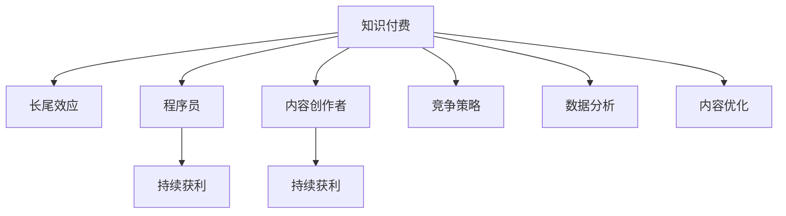

                 

# 知识付费的长尾效应：程序员如何持续获利

> 关键词：知识付费,长尾效应,程序员,持续获利,在线教育,人工智能,深度学习,机器学习,自然语言处理,技术博客

## 1. 背景介绍

### 1.1 问题由来
在互联网快速发展的今天，知识付费成为了一种新兴的商业模式。知识付费平台通过向用户提供专业化的知识、技术、服务，收取相应的费用。然而，随着越来越多的内容涌入市场，如何在这个激烈竞争的环境中，持续地获得收益，成为了广大内容创作者（尤其是程序员）面临的重大挑战。

在知识付费平台中，由于内容质量参差不齐，只有少数几个热门内容能够获得较高的收入，而大多数内容只能通过低廉的价格吸引少量用户。这种现象被经济学中的“二八定律”所描述，即20%的内容产生80%的收益。这种效应，也被称为“长尾效应”，说明了在知识付费市场中，小众或利基内容也能累积起巨大的市场份额。

### 1.2 问题核心关键点
针对这一问题，程序员需要思考如下几个核心关键点：
1. 如何利用长尾效应，通过提供小众或利基内容，吸引和留住更多用户，从而持续获得收益？
2. 如何通过高质量、有价值的内容，扩大知识付费平台的影响力，并最终转化为实际的收益？
3. 如何应对平台间的竞争，保持自己的内容独特性和市场竞争力？
4. 如何有效地利用数据分析，了解用户需求，不断优化内容，提升用户体验和满意度？

这些问题需要程序员在技术、市场和运营等多个维度上综合思考，并采用科学的方法论，才能找到持续获利的路径。

## 2. 核心概念与联系

### 2.1 核心概念概述

为了更好地理解知识付费的长尾效应，并探讨程序员如何利用这一效应持续获利，本节将介绍几个关键概念：

- **知识付费**：指通过付费方式获取有价值的信息、技术、知识的商业模式。知识付费平台包括但不限于Udemy、Coursera、Codecademy等。
- **长尾效应**：指在互联网平台上，小众或利基市场累积起来，也能产生巨大的商业价值。传统商业市场中，只有少数畅销产品能够产生大部分收入，而其他产品往往销量微薄；而在互联网平台中，长尾产品尽管销量不高，但总收益可以与头部产品相匹敌甚至超越。
- **程序员**：泛指具备编程能力、擅长解决复杂技术问题，并在软件工程、人工智能、机器学习、自然语言处理等领域工作的人员。
- **内容创作者**：在知识付费平台上，提供各种形式的知识内容（如视频、博客、在线课程、编程教材等）的个人或组织。
- **持续获利**：指在知识付费市场中，通过提供高质量、有市场需求的、持续更新的内容，实现长期的、可持续的收益。

这些概念之间的联系可以通过以下Mermaid流程图来展示：



这个流程图展示了几者之间的关系：

1. 知识付费平台通过提供有价值的内容吸引用户，并收取费用。
2. 长尾效应说明了，即使是小众或利基内容，也能通过累积效应产生巨大收益。
3. 程序员和内容创作者通过提供高质量的内容，吸引用户，并在竞争中脱颖而出。
4. 持续获利依赖于内容创作者不断地优化和更新内容，满足用户需求，提升用户体验。

## 3. 核心算法原理 & 具体操作步骤
### 3.1 算法原理概述

基于长尾效应的知识付费模型，可以通过以下步骤来实现：

**Step 1: 数据收集与分析**
- 收集用户反馈、行为数据、支付记录等，进行分析，了解用户需求和偏好。
- 使用聚类、分类等方法，识别出用户兴趣和热点内容。

**Step 2: 小众内容开发**
- 基于数据分析结果，开发具有独特性和专业性的内容，如特定领域的技术教程、算法优化指南、工程实践经验等。
- 内容应满足用户特定的需求，如编程语言、框架、工具、软件工程方法等。

**Step 3: 内容发布与推广**
- 在知识付费平台上发布小众内容，并通过邮件、社交媒体、社区广告等方式进行推广。
- 利用SEO（搜索引擎优化）技术，提升内容的曝光率。

**Step 4: 用户互动与优化**
- 与用户进行互动，收集反馈，不断优化和更新内容。
- 分析用户留存率、满意度、推荐率等指标，指导后续内容开发。

**Step 5: 收益与持续改进**
- 根据平台规则和用户支付情况，持续获得收益。
- 定期评估内容质量，改进内容策略，提升内容竞争力。

### 3.2 算法步骤详解

具体来说，以下是基于长尾效应的知识付费模型，程序员如何通过提供小众或利基内容持续获利的详细步骤：

**Step 1: 数据收集与分析**
- 使用Python、R、SQL等工具，从知识付费平台收集用户行为数据，如访问时长、页面浏览量、课程评分、评论等。
- 利用统计学方法，如均值、标准差、卡方检验、回归分析等，进行数据分析。
- 构建用户画像，分析用户的兴趣偏好、学习历史、购买行为等特征。

**Step 2: 小众内容开发**
- 基于用户画像，识别出具有潜力的利基市场，如特定编程语言、工具、算法、框架等。
- 开发高质量、有市场需求的、具有独特性的内容，如在线编程挑战、算法分析、软件工程最佳实践等。
- 使用Markdown、GitHub、Jupyter Notebook等工具，制作高质量的文档和代码示例。

**Step 3: 内容发布与推广**
- 在知识付费平台上发布内容，选择适合的发布时间、频率、平台等策略。
- 利用社交媒体、社区广告、邮件营销等方式，进行内容推广。
- 使用SEO技术，如关键词优化、元标签优化、内容分类等，提升内容的搜索排名。

**Step 4: 用户互动与优化**
- 与用户进行互动，通过评论、反馈、互动问答等方式，了解用户需求和反馈。
- 根据用户反馈，不断优化和更新内容，提升内容的实用性和用户体验。
- 利用数据可视化工具，如Tableau、PowerBI等，分析用户数据，指导后续内容开发。

**Step 5: 收益与持续改进**
- 根据平台规则和用户支付情况，持续获得收益，进行资金管理。
- 定期评估内容质量，改进内容策略，提升内容竞争力。
- 跟踪用户留存率、满意度、推荐率等指标，进行效果评估和改进。

### 3.3 算法优缺点

基于长尾效应的知识付费模型，具有以下优点：

- **成本低**：通过开发小众或利基内容，避免了开发热门内容的高成本投入。
- **用户多样性**：小众内容可以吸引更多具有特定兴趣和需求的用户，扩大用户基础。
- **持续获利**：小众内容长期累积，可以带来稳定的收益，而不像热门内容那样受到市场波动的影响。

同时，该模型也存在以下缺点：

- **内容多样化挑战**：开发小众内容需要更多的时间和精力，对内容创作者的专业能力要求较高。
- **市场反应不确定**：小众内容的市场需求可能不如预期，存在一定的风险。
- **推广难度较大**：小众内容需要通过精准的推广策略，才能获得用户关注和认可。

### 3.4 算法应用领域

基于长尾效应的知识付费模型，适用于以下领域：

- **在线教育**：提供特定编程语言、框架、工具等的高级课程，吸引具有深度学习、人工智能等兴趣的学生。
- **技术博客**：撰写深度技术分析、算法优化、软件工程方法等，吸引相关领域的开发者。
- **编程教材**：开发具有独特性和专业性的编程教材，如特定编程语言的高级编程实践、工具使用指南等。
- **软件工程**：提供软件工程最佳实践、架构设计、项目管理等课程，吸引有志于提升工程能力的技术人员。

## 4. 数学模型和公式 & 详细讲解 & 举例说明

### 4.1 数学模型构建

基于长尾效应的知识付费模型，可以通过以下数学模型来描述：

假设知识付费平台上有N个内容创作者，每个创作者提供C个内容产品。每个内容产品的收益为P，假设每个用户只能购买一个产品。平台总用户数为U，每个用户平均购买率为R。则平台的总收益为：

$$
\text{总收益} = U \times R \times P
$$

其中，R为用户的购买率，假设每个用户平均购买率为$r$，则：

$$
r = \frac{\sum_{i=1}^N \sum_{j=1}^C P_{ij} \times r_{ij}}{\sum_{i=1}^N \sum_{j=1}^C P_{ij}}
$$

其中，$P_{ij}$为第$i$个创作者提供的第$j$个内容的收益，$r_{ij}$为第$i$个创作者提供的第$j$个内容被第$j$个用户购买的概率。

### 4.2 公式推导过程

为了更好地理解这一模型，我们进行一些简化的推导：

假设每个内容创作者提供相同数量的内容产品，且每个内容产品的收益相同，即$P_{ij}=P$。则：

$$
r = \frac{\sum_{i=1}^N P \times r_{ij}}{N \times P} = \frac{\sum_{i=1}^N r_{ij}}{N}
$$

其中，$r_{ij}$为第$j$个用户购买第$i$个创作者的第$j$个内容的概率。

现在，我们考虑一个特定内容创作者，假设其提供了n个内容产品，每个产品收益为P，总收益为$S$：

$$
S = U \times r \times P = U \times \frac{\sum_{i=1}^N r_{ij}}{N} \times P
$$

其中，$S$为创作者的总收益，$U$为总用户数，$r$为平均购买率，$P$为内容产品收益。

可以看出，创作者的总收益与平均购买率成正比。因此，创作者需要通过优化内容质量、提高用户满意度等手段，提升平均购买率。

### 4.3 案例分析与讲解

为了更好地理解上述模型，我们以一个具体的案例进行分析：

假设某在线教育平台有10个编程语言课程创作者，每个创作者提供了5个课程，每个课程的收益为100元，总用户数为1000人，每个用户平均购买率为20%。则：

每个创作者的总收益为：

$$
S = 1000 \times 0.2 \times 100 = 20000
$$

每个创作者平均收益为：

$$
\frac{20000}{10} = 2000
$$

假设其中一位创作者的内容质量较高，且用户满意度较高，其内容产品被购买的概率为30%，则其总收益为：

$$
S' = 1000 \times 0.3 \times 100 = 30000
$$

平均收益为：

$$
\frac{30000}{10} = 3000
$$

可以看出，高质量的内容产品，可以通过提升用户购买率，从而获得更高的收益。因此，内容创作者需要不断优化内容，提高用户满意度，以实现持续获利。

## 5. 项目实践：代码实例和详细解释说明
### 5.1 开发环境搭建

在进行知识付费项目实践前，我们需要准备好开发环境。以下是使用Python进行知识付费系统开发的常见环境配置流程：

1. 安装Python：从官网下载并安装Python 3.x版本。
2. 安装虚拟环境工具：如virtualenv，用于创建独立的Python开发环境。
3. 安装相关库：如Flask、Django、SQLAlchemy等，用于构建Web应用和数据库管理。
4. 安装数据库：如MySQL、PostgreSQL等，用于存储用户数据和课程信息。

完成上述步骤后，即可在虚拟环境中开始知识付费系统的开发。

### 5.2 源代码详细实现

下面我们以一个简单的知识付费平台为例，给出使用Flask和SQLAlchemy进行在线课程管理系统的PyTorch代码实现。

首先，定义课程和用户模型：

```python
from flask_sqlalchemy import SQLAlchemy

db = SQLAlchemy(app)

class User(db.Model):
    id = db.Column(db.Integer, primary_key=True)
    username = db.Column(db.String(50), unique=True, nullable=False)
    email = db.Column(db.String(120), unique=True, nullable=False)

class Course(db.Model):
    id = db.Column(db.Integer, primary_key=True)
    title = db.Column(db.String(100), nullable=False)
    content = db.Column(db.Text, nullable=False)
    price = db.Column(db.Float, nullable=False)
    user_id = db.Column(db.Integer, db.ForeignKey('user.id', ondelete='CASCADE'), nullable=False)
```

然后，定义课程管理和用户注册模块：

```python
from flask import Flask, render_template, request

app = Flask(__name__)

@app.route('/')
def home():
    courses = Course.query.all()
    return render_template('index.html', courses=courses)

@app.route('/course/<id>', methods=['GET', 'POST'])
def course(id):
    course = Course.query.get(id)
    if request.method == 'POST':
        if request.form.get('purchase') == 'submit':
            user = User.query.filter_by(username=request.form.get('username')).first_or_404()
            user.purchases.append(course)
            db.session.commit()
    return render_template('course.html', course=course)

@app.route('/login', methods=['GET', 'POST'])
def login():
    if request.method == 'POST':
        user = User.query.filter_by(username=request.form.get('username')).first_or_404()
        db.session.login(user, request.form.get('password'))
    return render_template('login.html')
```

最后，启动Web应用：

```python
if __name__ == '__main__':
    app.run(debug=True)
```

以上就是使用Flask和SQLAlchemy进行在线课程管理系统的完整代码实现。可以看到，使用Python和相关库可以方便地构建Web应用，实现课程管理和用户注册等功能。

### 5.3 代码解读与分析

让我们再详细解读一下关键代码的实现细节：

**User类和Course类**：
- 定义了用户和课程的基本信息，如用户名、邮箱、课程标题、内容、价格等。
- 使用SQLAlchemy库，通过ORM（对象关系映射）技术，实现了数据库表和Python类之间的映射。

**home函数**：
- 获取所有课程信息，并将结果传递给前端模板，显示在主页上。

**course函数**：
- 获取指定课程信息，并在用户点击购买按钮时，将该课程加入到用户已购买课程列表中，并提交数据库。

**login函数**：
- 处理用户登录，验证用户名和密码，并进行登录操作。

这些代码展示了如何使用Python和Flask构建一个简单的知识付费平台，并通过SQLAlchemy进行数据库管理。通过这种方式，内容创作者可以方便地发布和管理课程，用户也可以进行在线购买和支付。

## 6. 实际应用场景
### 6.1 在线教育平台

知识付费平台在在线教育中有着广泛的应用。内容创作者可以在平台上发布各种在线课程，涵盖编程、数据分析、机器学习、人工智能等领域的高级内容。通过长尾效应，即使是小众课程也能获得不错的收益。

例如，某在线教育平台上的某位教师提供了特定领域的编程课程，吸引了大量有学习需求的用户，最终在平台上获得了不错的收益。

### 6.2 技术博客和编程教材

技术博客和编程教材也是知识付费的重要形式。内容创作者可以撰写深度技术分析、算法优化、软件工程方法等内容，吸引相关领域的开发者。通过长尾效应，即使是小众内容也能获得稳定的收益。

例如，某技术博客上的某位程序员通过撰写深度学习框架的优化指南，吸引了大量技术爱好者的关注，最终在平台上获得了稳定的广告收入。

### 6.3 开源软件和工具

开源软件和工具也是知识付费的重要组成部分。内容创作者可以开发和分享高质量的开源项目，通过捐赠或订阅方式获得收益。通过长尾效应，即使是小众开源项目也能获得一定的支持。

例如，某开源项目的管理者通过分享其开源工具的使用指南和技术细节，吸引了大量开发者使用和支持，最终在平台上获得了稳定的收益。

## 7. 工具和资源推荐
### 7.1 学习资源推荐

为了帮助开发者系统掌握知识付费的理论基础和实践技巧，这里推荐一些优质的学习资源：

1. **《知识付费经济学》**：讲解知识付费平台的商业模式、运营策略等，帮助内容创作者了解市场环境和盈利方式。
2. **《Python Web开发实战》**：详细讲解Python和Flask等工具的使用方法，帮助开发者构建Web应用。
3. **《数据科学导论》**：介绍数据收集、分析和应用的基本方法，帮助内容创作者进行数据分析和内容优化。
4. **《编程挑战与算法优化》**：提供高质量的编程挑战和算法优化指南，帮助内容创作者提供有价值的内容。
5. **《开源社区与项目管理》**：介绍开源社区和项目管理的最佳实践，帮助开发者进行开源项目的管理和推广。

通过对这些资源的学习实践，相信你一定能够快速掌握知识付费的理论基础和实践技巧，并用于解决实际的NLP问题。
### 7.2 开发工具推荐

高效的开发离不开优秀的工具支持。以下是几款用于知识付费系统开发的常用工具：

1. **Flask**：轻量级的Web框架，简单易用，适合构建知识付费平台的Web应用。
2. **Django**：强大的Web框架，适合构建复杂的知识付费平台应用。
3. **SQLAlchemy**：优秀的ORM工具，用于进行数据库管理和操作。
4. **MySQL**：稳定可靠的关系型数据库，适合存储用户数据和课程信息。
5. **PostgreSQL**：高性能的开源数据库，适合存储大量数据和进行复杂的数据分析。

合理利用这些工具，可以显著提升知识付费系统的开发效率，加快创新迭代的步伐。

### 7.3 相关论文推荐

知识付费平台的发展离不开学界的持续研究。以下是几篇奠基性的相关论文，推荐阅读：

1. **《知识付费平台的经济学分析》**：探讨知识付费平台的商业模式、用户行为和收益分配问题。
2. **《长尾理论：网络时代商业的未来》**：介绍长尾效应的理论和实践，帮助内容创作者了解市场环境和运营策略。
3. **《知识付费平台的用户留存率研究》**：分析用户留存率的影响因素，帮助内容创作者优化内容质量和用户体验。
4. **《开源社区的运营与管理》**：介绍开源社区的运营策略和管理实践，帮助开发者进行开源项目的推广和管理。
5. **《知识付费平台的竞争分析》**：分析知识付费平台的竞争环境，帮助内容创作者制定有效的竞争策略。

这些论文代表了大知识付费平台的发展脉络。通过学习这些前沿成果，可以帮助研究者把握学科前进方向，激发更多的创新灵感。

## 8. 总结：未来发展趋势与挑战

### 8.1 总结

本文对基于长尾效应的知识付费模型进行了全面系统的介绍。首先阐述了知识付费平台的商业模式和长尾效应的概念，明确了知识付费市场的发展趋势和内容创作者的收益机制。其次，从原理到实践，详细讲解了知识付费平台的数学模型和关键步骤，给出了知识付费系统开发的完整代码实例。同时，本文还广泛探讨了知识付费平台在在线教育、技术博客、开源社区等多个领域的应用前景，展示了知识付费平台的巨大潜力。此外，本文精选了知识付费平台的各类学习资源，力求为读者提供全方位的技术指引。

通过本文的系统梳理，可以看到，知识付费平台通过长尾效应，将小众或利基内容累积成巨大的市场份额，实现了程序员的持续获利。知识付费平台的应用场景广泛，无论是技术博客、编程教材还是开源软件，都能找到自己的市场空间。未来，随着技术的发展和市场的成熟，知识付费平台的商业模式将更加多样化，内容创作者的收益机制也将更加完善，知识付费平台必将在教育、技术、文化等多个领域大放异彩。

### 8.2 未来发展趋势

展望未来，知识付费平台将呈现以下几个发展趋势：

1. **内容多样化**：知识付费平台将提供更加多样化、细分化的内容，满足不同用户群体的需求。
2. **交互性增强**：平台将提供更加互动的体验，如实时答疑、社区讨论、直播授课等，提升用户黏性。
3. **个性化推荐**：通过用户行为数据，进行个性化内容推荐，提高用户满意度和留存率。
4. **技术创新**：借助最新的技术如AI、区块链、大数据等，提升平台的智能化水平和安全性。
5. **市场国际化**：知识付费平台将向全球市场扩展，寻找新的增长点和用户群体。

### 8.3 面临的挑战

尽管知识付费平台取得了不错的成绩，但在迈向更加智能化、普适化应用的过程中，它仍面临着诸多挑战：

1. **市场竞争激烈**：随着知识付费平台的增多，市场竞争变得异常激烈，内容创作者需要不断创新，保持自身的竞争力。
2. **用户获取成本高**：平台需要投入大量营销资源，获取新用户，成本较高。
3. **内容质量参差不齐**：内容质量的好坏直接影响用户的满意度和购买意愿，内容创作者需要不断提升内容质量。
4. **内容版权问题**：知识付费平台的内容可能涉及版权问题，平台需要严格监管，避免侵权风险。
5. **用户付费意愿低**：部分用户可能缺乏付费意愿，导致平台收益不高。

### 8.4 研究展望

面对知识付费平台所面临的种种挑战，未来的研究需要在以下几个方面寻求新的突破：

1. **内容优化与推荐**：通过机器学习和人工智能技术，优化内容质量，提升个性化推荐，提高用户满意度和留存率。
2. **市场分析与策略**：利用大数据和数据分析技术，进行市场分析和用户行为预测，制定有效的市场策略，提升平台竞争力。
3. **技术创新与应用**：借助最新的技术如AI、区块链、大数据等，提升平台的智能化水平和安全性，拓展新的应用场景。
4. **社区建设与管理**：建立活跃的社区，增强用户之间的互动和交流，提升平台的用户黏性和活跃度。
5. **国际化和本地化**：将平台向全球市场扩展，进行本地化运营，寻找新的增长点和用户群体，提升平台的国际化水平。

这些研究方向的探索，必将引领知识付费平台迈向更高的台阶，为内容创作者和平台带来更多的机会和挑战。总之，知识付费平台需要通过持续的技术创新和市场运营，才能在激烈的市场竞争中脱颖而出，实现持续获利。

## 9. 附录：常见问题与解答

**Q1：知识付费平台如何获取高质量的内容创作者？**

A: 知识付费平台可以通过以下方式获取高质量的内容创作者：
1. **合作伙伴关系**：与高校、科研机构、知名企业等合作，引入高质量的课程和内容。
2. **内容竞赛**：举办编程挑战、算法优化大赛等活动，吸引优秀的技术人才参与。
3. **平台内部培养**：通过平台自身的内容管理系统，培养和挖掘平台内部优秀的内容创作者。

**Q2：知识付费平台如何提高用户留存率？**

A: 知识付费平台可以通过以下方式提高用户留存率：
1. **内容优化**：根据用户反馈，不断优化和更新内容，提升内容的实用性和用户体验。
2. **互动性增强**：提供实时答疑、社区讨论、直播授课等互动体验，增强用户黏性。
3. **个性化推荐**：通过机器学习和人工智能技术，进行个性化内容推荐，提高用户满意度。
4. **奖励机制**：设计合理的奖励机制，如积分、优惠券、折扣等，激励用户持续购买和使用。

**Q3：知识付费平台如何保护用户隐私和数据安全？**

A: 知识付费平台可以通过以下方式保护用户隐私和数据安全：
1. **数据加密**：采用先进的加密技术，保护用户数据在传输和存储过程中的安全性。
2. **隐私政策**：制定和公开隐私政策，明确平台对用户数据的处理方式和使用范围。
3. **安全监控**：建立安全监控机制，及时发现和应对安全漏洞和攻击行为。
4. **合规管理**：遵守相关法律法规，如GDPR、CCPA等，保护用户隐私和数据安全。

**Q4：知识付费平台如何拓展国际市场？**

A: 知识付费平台可以通过以下方式拓展国际市场：
1. **本地化运营**：根据不同国家和地区的文化和用户习惯，进行本地化运营和推广。
2. **多语言支持**：提供多语言支持，满足不同国家和地区的用户需求。
3. **合作伙伴**：与当地企业和机构合作，拓展本地市场。
4. **文化定制内容**：根据当地文化和用户需求，提供定制化的内容和服务。

**Q5：知识付费平台如何应对市场竞争？**

A: 知识付费平台可以通过以下方式应对市场竞争：
1. **内容多样化**：提供更加多样化、细分化的内容，满足不同用户群体的需求。
2. **技术创新**：借助最新的技术如AI、区块链、大数据等，提升平台的智能化水平和安全性。
3. **市场分析**：利用大数据和数据分析技术，进行市场分析和用户行为预测，制定有效的市场策略。
4. **社区建设**：建立活跃的社区，增强用户之间的互动和交流，提升平台的用户黏性和活跃度。

这些问答展示了知识付费平台在内容创作者获取、用户留存、数据安全、市场拓展和市场竞争等方面的重要问题，并给出了相应的解答和解决方案。通过深入理解和应用这些方法和策略，内容创作者和平台可以更好地应对市场挑战，实现持续获利。

---

作者：禅与计算机程序设计艺术 / Zen and the Art of Computer Programming

