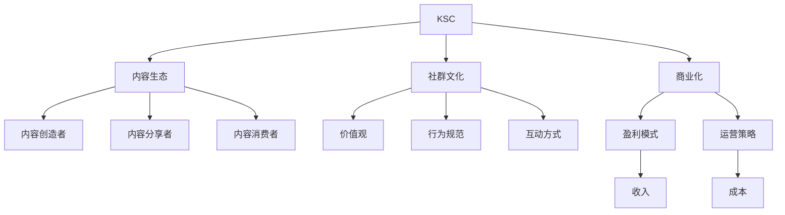

                 

# 知识付费社群运营：程序员的另一种可能

## 1. 背景介绍

### 1.1 问题由来
随着互联网的迅猛发展和数字经济时代的到来，知识付费行业正在快速发展。传统通过书籍、课程、培训等方式获取知识的方式已经不能满足现代人的学习需求。人们越来越希望通过更便捷、高效、个性化的方式获取知识。知识付费社群作为一种新型的知识分享模式应运而生。它将一群具有相同学习兴趣和目标的人聚集在一起，通过定期分享、讨论、交流的方式，实现知识共享和价值交换。

对于程序员来说，知识付费社群提供了一个全新的学习和成长环境。在社群中，程序员不仅可以获取到最新的技术趋势、前沿知识和实践经验，还可以与行业大咖、同行交流互动，解决实际问题，拓展职业发展路径。因此，越来越多的程序员开始积极参与知识付费社群的运营和发展，探索新的职业可能。

### 1.2 问题核心关键点
知识付费社群的运营面临的主要问题包括：
1. 如何吸引和留住高质量的社群成员。
2. 如何构建有价值的内容生态，满足不同成员的学习需求。
3. 如何建立良好的社群文化和规则，维护社群的秩序和活跃度。
4. 如何实现社群的商业化和盈利，实现自我可持续发展。

本文将从以上几个关键点出发，探讨如何通过高效的运营策略，构建一个有价值、可持续的知识付费社群。

## 2. 核心概念与联系

### 2.1 核心概念概述

为更好地理解知识付费社群的运营策略，本节将介绍几个密切相关的核心概念：

- 知识付费社群(Knowledge-based Subscription Community, KSC)：通过订阅、付费等方式，聚集具有相同学习兴趣和目标的人群，定期分享、讨论、交流知识，实现知识共享和价值交换的社群平台。
- 内容生态(Content Ecosystem)：社群内外的知识创造者、分享者和消费者之间通过内容互动，形成相互依存、共生共荣的关系。
- 社群文化(Group Culture)：社群成员共同的价值观、行为规范、互动方式等，是社群凝聚力和活跃度的重要基础。
- 商业化(Business Commercialization)：通过合理的商业模式，将社群运营与盈利相结合，实现自我可持续发展的过程。

这些核心概念之间的逻辑关系可以通过以下Mermaid流程图来展示：



这个流程图展示的知识付费社群的核心概念及其之间的关系：

1. 知识付费社群通过聚集具有相同兴趣的人群，提供有价值的内容生态。
2. 社群文化是社群成员之间互动的基础，影响社群的凝聚力和活跃度。
3. 商业化是知识付费社群实现自我可持续发展的关键。

这些概念共同构成了知识付费社群的运营框架，使其能够在不同的情境下发挥最大的价值。

## 3. 核心算法原理 & 具体操作步骤

### 3.1 算法原理概述

知识付费社群的运营，本质上是一个有目的的知识传播和价值交换过程。其核心在于如何吸引和留住高质量的社群成员，构建有价值的内容生态，建立良好的社群文化和规则，并实现社群的商业化。以下将详细阐述知识付费社群运营的核心算法原理和操作步骤。

### 3.2 算法步骤详解

#### 步骤1：设计社群定位和目标

社群定位和目标是社群运营的起点。在设计社群时，需要考虑以下几个方面：
1. **目标人群**：明确社群的目标用户群体，包括年龄、职业、学习兴趣等。
2. **社群价值**：确定社群的核心价值主张，如技术分享、职业发展、人际关系等。
3. **竞争分析**：分析类似社群的市场需求和竞争环境，找到差异化竞争点。

#### 步骤2：构建社群内容和生态

社群的内容生态是社群的核心竞争力。构建内容生态时，需要：
1. **内容类型**：根据目标人群的需求，设计不同类型的知识分享内容，如技术文章、视频课程、直播讲座、问答互动等。
2. **内容创作者**：招募或合作具有专业知识和技术背景的内容创作者，定期输出高质量的内容。
3. **内容互动**：建立多样化的互动机制，如问答、讨论、项目合作等，增强成员间的互动和交流。
4. **内容筛选**：设立严格的筛选机制，确保内容的质量和相关性。

#### 步骤3：建立社群文化和规则

社群文化和规则是社群的基础保障。建立社群文化和规则时，需要：
1. **价值观**：明确社群的核心价值观，如知识共享、相互尊重、诚信守约等。
2. **行为规范**：制定具体的行为规范，如发言礼仪、互帮互助、内容原创等。
3. **规则维护**：设立专门的规则维护团队，及时处理违规行为，确保社群的健康发展。

#### 步骤4：实现社群商业化和盈利

社群商业化和盈利是社群运营的关键。实现社群商业化和盈利时，需要：
1. **盈利模式**：选择合理的盈利模式，如会员收费、广告合作、项目孵化等。
2. **定价策略**：根据社群的价值和内容质量，制定合理的收费标准。
3. **业务拓展**：不断拓展社群业务范围，扩大受众群体，提升商业价值。

### 3.3 算法优缺点

知识付费社群的运营策略具有以下优点：
1. **精准定位**：通过设计合理的社群定位和目标，精准吸引和留住具有相同兴趣和目标的成员。
2. **资源共享**：构建有价值的内容生态，使得成员之间能够共享知识和资源，提升整体学习效果。
3. **高效互动**：通过多样化的互动机制，增强成员之间的互动和交流，建立紧密的社群关系。
4. **市场拓展**：通过合理的商业化和盈利模式，实现社群的自我可持续发展，拓展市场空间。

同时，该策略也存在一定的局限性：
1. **用户黏性不足**：社群运营需要持续投入时间和资源，若内容或互动机制不够吸引人，容易导致成员流失。
2. **内容质量参差不齐**：内容创作者的水平和积极性直接影响社群内容的质量和数量。
3. **盈利模式单一**：目前知识付费社群的盈利模式较为单一，容易受到市场环境的影响。
4. **规则维护困难**：社群文化和规则的维护需要持续投入人力和精力，存在一定的难度。

尽管存在这些局限性，但就目前而言，知识付费社群的运营策略仍然是大规模知识传播和价值交换的重要手段。未来相关研究的重点在于如何进一步提升社群的用户黏性，优化内容生态，实现多元化的盈利模式，同时兼顾社群文化和规则的维护，以实现更为理想的运营效果。

### 3.4 算法应用领域

知识付费社群的运营方法在知识分享、职业发展、技术交流等多个领域得到了广泛的应用，具体包括：

- 技术社区：如Github、Stack Overflow等，通过技术分享和代码协作，促进技术交流和创新。
- 职业培训：如Coursera、Udemy等，通过课程学习、项目合作，提升个人职业技能和就业竞争力。
- 知识付费平台：如得到、喜马拉雅等，通过订阅服务、知识付费，提供专业知识和技能培训。
- 商业咨询：如LinkedIn、Slack等，通过专业交流、信息共享，拓展商业合作和资源对接。

除了上述这些经典应用外，知识付费社群还被创新性地应用到更多场景中，如在线协作、社交网络、职业导师等，为知识传播和价值交换提供了新的路径。随着知识付费社群的不断发展，相信在更多领域将会有更广阔的应用前景。

## 4. 数学模型和公式 & 详细讲解 & 举例说明

### 4.1 数学模型构建

本节将使用数学语言对知识付费社群的运营策略进行更加严格的刻画。

设知识付费社群的成员数为 $N$，内容创作者数为 $M$，参与内容互动的频率为 $f$，社群文化的质量和认同度为 $C$，商业化的收入为 $R$。则知识付费社群的总效用 $U$ 可以表示为：

$$
U = f \cdot N + C \cdot M + R \cdot N
$$

其中，$f \cdot N$ 表示内容互动对成员的积极影响，$C \cdot M$ 表示社群文化对内容创作者的积极影响，$R \cdot N$ 表示商业化对社群的积极影响。

### 4.2 公式推导过程

在知识付费社群的运营过程中，需要不断优化各因素以提升总效用 $U$。以下通过推导来分析各因素对总效用的影响：

1. **内容互动**：
   $$
   \frac{\partial U}{\partial f} = N + R
   $$
   增加内容互动频率 $f$ 可以显著提升总效用，因为内容互动可以增强成员之间的互动和交流，提升社群活跃度，同时商业化也能带来收入。

2. **社群文化**：
   $$
   \frac{\partial U}{\partial C} = M + N
   $$
   提升社群文化的质量和认同度 $C$ 可以提升内容创作者和成员的积极性和满意度，从而增强社群的凝聚力和影响力。

3. **商业化**：
   $$
   \frac{\partial U}{\partial R} = N
   $$
   合理的商业化策略可以带来稳定的收入，提升社群的可持续性，从而吸引更多的成员和内容创作者。

### 4.3 案例分析与讲解

假设知识付费社群的目标是技术交流和职业发展，成员数量为 $N=1000$，内容创作者数量为 $M=100$，内容互动频率为 $f=0.1$，社群文化质量和认同度为 $C=0.8$，商业化收入为 $R=10$。

根据公式推导结果，计算总效用 $U$：

$$
U = 1000 \times 0.1 + 100 \times 0.8 + 1000 \times 10 = 1290
$$

可见，尽管内容互动频率 $f$ 较低，但通过优化社群文化和商业化策略，总效用仍能保持在较高水平。

## 5. 项目实践：代码实例和详细解释说明

### 5.1 开发环境搭建

在进行知识付费社群的运营实践前，我们需要准备好开发环境。以下是使用Python进行开发的环境配置流程：

1. 安装Anaconda：从官网下载并安装Anaconda，用于创建独立的Python环境。

2. 创建并激活虚拟环境：
```bash
conda create -n pytorch-env python=3.8 
conda activate pytorch-env
```

3. 安装PyTorch：根据CUDA版本，从官网获取对应的安装命令。例如：
```bash
conda install pytorch torchvision torchaudio cudatoolkit=11.1 -c pytorch -c conda-forge
```

4. 安装TensorFlow：
```bash
conda install tensorflow -c conda-forge
```

5. 安装Flask：
```bash
pip install flask
```

完成上述步骤后，即可在`pytorch-env`环境中开始知识付费社群的运营实践。

### 5.2 源代码详细实现

下面我们以一个简单的知识付费社群平台为例，给出使用Flask框架构建知识付费社群的Python代码实现。

首先，定义Flask应用程序：

```python
from flask import Flask, request, jsonify

app = Flask(__name__)

@app.route('/api/content', methods=['GET', 'POST'])
def content_api():
    if request.method == 'GET':
        # 返回所有内容列表
        return jsonify([{'id': 1, 'title': 'Python基础', 'author': '张三'}, {'id': 2, 'title': '深度学习入门', 'author': '李四'}])
    elif request.method == 'POST':
        # 添加新内容
        data = request.json
        content = {'id': 3, 'title': data['title'], 'author': data['author']}
        return jsonify(content)
```

然后，定义内容发布和互动功能：

```python
@app.route('/api/content/<int:id>', methods=['GET'])
def content_detail(id):
    # 返回指定内容详情
    return jsonify({'id': id, 'title': 'Python基础', 'author': '张三'})

@app.route('/api/interaction', methods=['POST'])
def interaction_api():
    # 添加新互动
    data = request.json
    interaction = {'title': data['title'], 'content': data['content'], 'timestamp': datetime.now()}
    return jsonify(interaction)
```

最后，启动Flask应用程序：

```python
if __name__ == '__main__':
    app.run(debug=True)
```

以上就是使用Flask构建知识付费社群平台的完整代码实现。可以看到，Flask提供了简单易用的路由管理和HTTP请求处理机制，能够快速实现基本的社群功能。

### 5.3 代码解读与分析

让我们再详细解读一下关键代码的实现细节：

**Flask应用程序**：
- 定义Flask应用程序，使用`@app.route`装饰器定义路由。
- 使用`request`对象获取HTTP请求方法、URL参数、JSON数据等。
- 使用`jsonify`函数将Python对象转换为JSON格式响应。

**内容API**：
- 使用`@app.route`定义路由，根据请求方法处理不同类型的API请求。
- 在GET请求中，返回所有内容列表。
- 在POST请求中，添加新内容并返回JSON格式响应。

**互动API**：
- 使用`@app.route`定义路由，处理新增互动请求。
- 在POST请求中，获取请求体中的JSON数据，添加新互动并返回JSON格式响应。

**启动Flask应用程序**：
- 使用`app.run()`启动Flask应用程序，并设置`debug=True`以开启调试模式。

以上代码实现了知识付费社群的基本功能，包括内容列表展示、内容详情查看和互动提交等。开发者可以根据实际需求，进一步扩展功能，如权限控制、搜索排序、评论系统等，以提升社群的互动性和体验感。

## 6. 实际应用场景

### 6.1 技术交流社群

知识付费社群在技术交流社群中的应用非常广泛。开发者可以通过社群分享技术经验、交流编程心得、讨论问题解决方案，快速提升技术水平。

具体来说，可以建立Python、Java、Web开发、人工智能等技术社群，定期邀请技术大咖进行技术讲座和项目分享，组织线上线下的技术讨论和代码评审，开展技术竞赛和编程挑战等活动，吸引和留住高水平的技术爱好者。

### 6.2 职业发展社群

知识付费社群也可以成为职业发展的平台。职场人士可以通过社群获取职业发展指导、求职建议、招聘信息等，提升职业竞争力。

例如，可以建立产品经理、数据科学家、前端开发等职业社群，定期分享行业动态、职业发展路径、技能培训课程，组织职业咨询和求职辅导，搭建人脉网络，帮助职场人士实现职业目标。

### 6.3 创新创业社群

知识付费社群还可以助力创新创业。创业者可以通过社群获取创业资源、商业机会、投资信息等，加速创新项目的孵化和成长。

例如，可以建立创业加速器、孵化器、众创空间等创新创业社群，定期组织创业沙龙、路演活动、创业导师交流会，搭建创业生态圈，提供创业辅导、资金对接、市场分析等服务，帮助创业者快速突破瓶颈，实现项目落地和商业化。

### 6.4 未来应用展望

随着知识付费社群的不断发展，未来将会有更多的应用场景涌现，如在线教育、内容创作、职业培训等。知识付费社群的运营策略也将不断创新和优化，为知识传播和价值交换提供更为高效和精准的平台。

1. **个性化推荐系统**：利用机器学习和数据分析技术，为用户提供个性化的内容推荐，提升用户体验和满意度。
2. **多平台联动**：将知识付费社群与其他社交平台、学习平台、商务平台等进行联动，实现资源的跨平台共享和互通。
3. **在线协作平台**：将知识付费社群与在线协作平台结合，实现内容创作和项目协作，提升效率和质量。
4. **智能客服系统**：利用AI技术和知识图谱，构建智能客服系统，提供自动化的问答和咨询服务，提升社群运营效率。

通过不断探索和创新，知识付费社群必将在更多的领域发挥更大的价值，成为知识传播和价值交换的重要渠道。

## 7. 工具和资源推荐

### 7.1 学习资源推荐

为了帮助开发者系统掌握知识付费社群的运营策略，这里推荐一些优质的学习资源：

1. **《知识付费社群运营手册》**：这是一本系统介绍知识付费社群运营策略和方法的书籍，涵盖社群定位、内容生态、商业化、用户管理等多个方面。

2. **Coursera《知识付费社群运营》课程**：由知识付费领域的专家讲授，涵盖社群运营的基本概念、关键策略、成功案例等。

3. **Github《知识付费社群案例分析》**：Github上有很多成功和失败的案例，开发者可以从中学习社群运营的经验和教训。

4. **LinkedIn《社群运营技巧》文章**：LinkedIn上的这篇文章详细介绍了社群运营的技巧和方法，包括如何吸引成员、如何管理互动、如何实现商业化等。

5. **Udemy《知识付费社群管理》课程**：Udemy上有一系列知识付费社群管理的课程，涵盖社群运营的各个环节，从内容创作到用户管理，再到商业化运营。

通过对这些资源的学习实践，相信你一定能够快速掌握知识付费社群的运营精髓，并用于解决实际的社群问题。

### 7.2 开发工具推荐

高效的开发离不开优秀的工具支持。以下是几款用于知识付费社群运营开发的常用工具：

1. **Flask**：Python的Web开发框架，简单易用，适合快速搭建Web应用和API接口。

2. **PostgreSQL**：流行的开源数据库，支持高并发、高可用，适合存储和管理社群数据。

3. **Redis**：内存数据库，支持快速读写操作，适合缓存社群互动数据和用户信息。

4. **Kubernetes**：容器编排工具，支持集群管理和扩展，适合部署大规模的社群服务。

5. **Hadoop/Spark**：大数据处理工具，适合处理社群中的大量数据和复杂分析。

6. **Docker**：容器化技术，适合封装和部署社群应用，提高稳定性和可移植性。

合理利用这些工具，可以显著提升知识付费社群的开发效率，加快创新迭代的步伐。

### 7.3 相关论文推荐

知识付费社群的运营策略涉及众多领域，包括市场营销、用户体验、数据科学等。以下是几篇奠基性的相关论文，推荐阅读：

1. **《知识付费社群的市场营销策略》**：探讨了知识付费社群的营销策略，如何通过社交媒体、搜索引擎优化等手段吸引和留住社群成员。

2. **《知识付费社群的用户体验设计》**：分析了知识付费社群的用户体验设计，如何通过界面设计、互动机制、内容推荐等方式提升用户满意度。

3. **《知识付费社群的数据分析与优化》**：介绍了知识付费社群的数据分析方法，如何通过数据分析优化社群的内容生态和商业化策略。

4. **《知识付费社群的算法优化》**：探讨了知识付费社群的算法优化，如何通过机器学习、自然语言处理等技术提升社群的运营效率和用户体验。

这些论文代表了大语言模型微调技术的发展脉络。通过学习这些前沿成果，可以帮助研究者把握学科前进方向，激发更多的创新灵感。

## 8. 总结：未来发展趋势与挑战

### 8.1 总结

本文对知识付费社群的运营策略进行了全面系统的介绍。首先阐述了知识付费社群的运营背景和目标，明确了运营策略在吸引和留住高质量社群成员、构建有价值的内容生态、建立良好的社群文化和规则，并实现社群商业化方面的独特价值。其次，从原理到实践，详细讲解了知识付费社群运营的核心算法原理和操作步骤，给出了社群运营实践的完整代码实例。同时，本文还广泛探讨了知识付费社群在技术交流、职业发展、创新创业等多个领域的应用前景，展示了社群运营范式的巨大潜力。此外，本文精选了社群运营的技术资源，力求为读者提供全方位的技术指引。

通过本文的系统梳理，可以看到，知识付费社群运营通过精准定位、内容生态、社群文化和商业化等多方面的综合优化，可以在不同的情境下发挥最大的价值。知识付费社群的运营策略正在成为知识传播和价值交换的重要手段，极大地拓展了知识传播的边界，催生了更多的落地场景。未来，伴随知识付费社群的不断发展，相信在更多领域将会有更广阔的应用前景。

### 8.2 未来发展趋势

展望未来，知识付费社群运营将呈现以下几个发展趋势：

1. **个性化推荐系统**：利用机器学习和数据分析技术，为用户提供个性化的内容推荐，提升用户体验和满意度。

2. **多平台联动**：将知识付费社群与其他社交平台、学习平台、商务平台等进行联动，实现资源的跨平台共享和互通。

3. **在线协作平台**：将知识付费社群与在线协作平台结合，实现内容创作和项目协作，提升效率和质量。

4. **智能客服系统**：利用AI技术和知识图谱，构建智能客服系统，提供自动化的问答和咨询服务，提升社群运营效率。

5. **全渠道营销**：通过社交媒体、搜索引擎优化、内容营销等多种渠道，吸引和留住社群成员，提升社群的影响力和活跃度。

6. **社区运营工具**：开发更加智能化的社区运营工具，如内容管理系统、用户管理系统、互动管理系统等，提升社群的运营效率和管理水平。

以上趋势凸显了知识付费社群运营的广阔前景。这些方向的探索发展，必将进一步提升社群的用户黏性，优化内容生态，实现多元化的盈利模式，同时兼顾社群文化和规则的维护，以实现更为理想的运营效果。

### 8.3 面临的挑战

尽管知识付费社群运营已经取得了瞩目成就，但在迈向更加智能化、普适化应用的过程中，它仍面临着诸多挑战：

1. **用户黏性不足**：社群运营需要持续投入时间和资源，若内容或互动机制不够吸引人，容易导致成员流失。

2. **内容质量参差不齐**：内容创作者的水平和积极性直接影响社群内容的质量和数量。

3. **盈利模式单一**：目前知识付费社群的盈利模式较为单一，容易受到市场环境的影响。

4. **规则维护困难**：社群文化和规则的维护需要持续投入人力和精力，存在一定的难度。

尽管存在这些挑战，但就目前而言，知识付费社群的运营策略仍然是大规模知识传播和价值交换的重要手段。未来相关研究的重点在于如何进一步提升社群的用户黏性，优化内容生态，实现多元化的盈利模式，同时兼顾社群文化和规则的维护，以实现更为理想的运营效果。

### 8.4 研究展望

面对知识付费社群运营所面临的种种挑战，未来的研究需要在以下几个方面寻求新的突破：

1. **个性化推荐系统**：探索更加智能和高效的推荐算法，提升用户体验和满意度。

2. **内容质量控制**：引入专家评审和社区筛选机制，提升内容质量，确保社群的权威性和专业性。

3. **多渠道盈利模式**：探索多元化的盈利模式，如知识付费、内容广告、商业合作等，实现可持续发展。

4. **智能客服系统**：研究智能客服系统的构建方法，提升社群的互动效率和服务质量。

5. **社区规则优化**：研究社区规则的优化策略，提升社群的稳定性和规范性。

6. **社区运营工具**：开发更加智能化的社区运营工具，提升社群的运营效率和管理水平。

这些研究方向的探索，必将引领知识付费社群运营技术迈向更高的台阶，为知识传播和价值交换提供更为高效和精准的平台。面向未来，知识付费社群运营还需要与其他人工智能技术进行更深入的融合，如知识表示、因果推理、强化学习等，多路径协同发力，共同推动知识传播和价值交换系统的进步。只有勇于创新、敢于突破，才能不断拓展知识付费社群的边界，让知识传播和价值交换更加深入和广泛。

## 9. 附录：常见问题与解答

**Q1：知识付费社群运营如何吸引和留住高质量的社群成员？**

A: 吸引和留住高质量的社群成员是知识付费社群运营的关键。以下是一些具体的策略：

1. **精准定位**：明确社群的目标用户群体，提供有价值的内容和服务，满足他们的实际需求。
2. **内容质量**：确保内容创作者的水平和积极性，定期输出高质量的内容，增强社群的吸引力。
3. **互动机制**：建立多样化的互动机制，如问答、讨论、项目合作等，增强成员之间的互动和交流。
4. **社区文化**：建立良好的社群文化和规则，培养成员的归属感和认同感。
5. **商业化策略**：提供商业化的增值服务，如付费会员、定制内容等，满足不同成员的需求。

通过以上策略，可以逐步吸引和留住高质量的社群成员，提升社群的凝聚力和活跃度。

**Q2：知识付费社群运营的盈利模式有哪些？**

A: 知识付费社群的盈利模式主要包括以下几种：

1. **会员收费**：通过提供会员特权、付费内容、定制服务等方式，获取稳定的收入。
2. **内容广告**：通过内容平台引入广告，获取广告收入。
3. **商业合作**：与企业、品牌、项目等进行合作，提供专业的服务和技术支持，获取商业收入。
4. **项目孵化**：通过社群内的项目合作和资源对接，帮助项目落地和成长，获取项目收益。

选择合适的盈利模式需要根据社群的特点和市场需求进行综合考虑。

**Q3：如何处理社群中的违规行为？**

A: 处理社群中的违规行为需要建立严格的规则和机制：

1. **规则制定**：明确社群的规则和行为规范，确保规则的公平性和可执行性。
2. **规则维护**：设立专门的规则维护团队，及时处理违规行为，确保社群的健康发展。
3. **惩罚机制**：制定合理的惩罚措施，如警告、禁言、踢出等，避免违规行为的发生。

通过建立严格的政策和执行机制，可以有效避免违规行为，维护社群的秩序和活跃度。

**Q4：知识付费社群运营中的内容筛选机制如何设计？**

A: 内容筛选机制是确保内容质量的关键：

1. **专家评审**：邀请行业专家和领域大咖进行内容评审，确保内容的权威性和准确性。
2. **社区筛选**：通过社区成员的投票和反馈，筛选高质量的内容，提升社群的筛选效率。
3. **数据分析**：利用数据分析工具，识别高点击率、高互动率的内容，进行重点推广。

通过以上机制，可以确保内容的质量和相关性，提升社群的声誉和影响力。

**Q5：知识付费社群运营中的社区文化如何建立？**

A: 社区文化的建立需要长期的努力和维护：

1. **价值观引导**：明确社群的价值观，如知识共享、相互尊重、诚信守约等，引导成员的行为规范。
2. **活动组织**：定期组织线上线下的活动，增强成员的互动和交流，建立紧密的社群关系。
3. **激励机制**：建立激励机制，如内容贡献奖励、优秀成员表彰等，增强成员的归属感和积极性。

通过以上措施，可以逐步建立良好的社群文化，提升社群的凝聚力和活跃度。

---

作者：禅与计算机程序设计艺术 / Zen and the Art of Computer Programming

