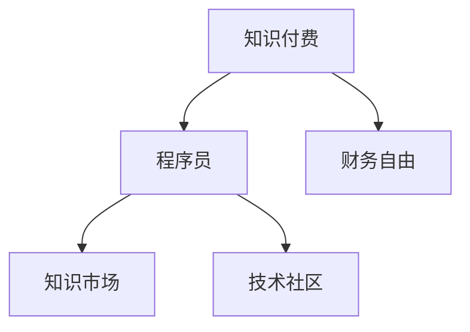

                 

# 知识付费让程序员实现财务自由的方法

## 1. 背景介绍

在当今信息爆炸的时代，知识付费逐渐成为一种流行趋势。对于程序员来说，如何利用自身技能和经验，通过知识付费实现财务自由，成为了一个备受关注的话题。本文将深入探讨这一问题，提供一套系统化的方法论，帮助程序员通过知识付费实现财务自由。

## 2. 核心概念与联系

### 2.1 核心概念概述

为更好地理解知识付费在程序员实现财务自由中的作用，本节将介绍几个核心概念：

- **知识付费**：指通过付费获取高价值知识或信息的一种经济模式。在知识付费的平台上，程序员可以分享自己的专业技能和经验，获取相应的经济回报。

- **程序员**：指具备编程能力和技术经验，能在计算机领域解决实际问题的专业技术人员。程序员是知识付费的主要供给方。

- **财务自由**：指个人或家庭的财务状况达到一种无需为基本生活开销而忧虑的状态，能够自由地选择自己的生活方式。

- **知识市场**：指知识付费的供需平台，如知乎、Coursera、Udemy等，是知识付费的主要交易场所。

- **技术社区**：指程序员交流技术的平台，如GitHub、Stack Overflow等，是程序员获取知识和分享经验的重要场所。

这些核心概念之间的逻辑关系可以通过以下Mermaid流程图来展示：



这个流程图展示了一些关键概念及其之间的关系：

1. 程序员通过知识市场进行知识付费，获取经济回报。
2. 经济回报是程序员实现财务自由的重要途径。
3. 技术社区是程序员获取知识和分享经验的重要场所。

## 3. 核心算法原理 & 具体操作步骤

### 3.1 算法原理概述

知识付费的核心算法原理是基于信息不对称和价值交换的经济理论。程序员通过在知识市场上传递其专业技能和经验，满足市场需求，从而获取经济回报。财务自由则是在积累一定经济资本后，无需再为基本生活开销而工作，达到完全自由的状态。

### 3.2 算法步骤详解

1. **确定优势领域**：
   - 识别自己在编程领域中的优势和专长，如熟练掌握一种编程语言、具有丰富的项目经验等。

2. **选择合适的平台**：
   - 在多个知识付费平台上选择合适的平台进行内容发布，如知乎、Coursera、Udemy等。

3. **制定内容策略**：
   - 根据目标平台的用户需求，制定内容策略，如写技术博客、制作教学视频、创建在线课程等。

4. **创建高质量内容**：
   - 输出高质量的原创内容，内容需具备专业性、实用性、可分享性。

5. **获取用户反馈**：
   - 收集用户的反馈和评价，持续优化内容，提高用户满意度和复购率。

6. **增加变现方式**：
   - 在内容中增加变现手段，如收取订阅费、设置付费问答、销售课程等。

7. **持续积累资本**：
   - 通过知识付费的收入，持续积累经济资本，逐步实现财务自由。

### 3.3 算法优缺点

知识付费的优点包括：

- 以个人专长为基础，实现自我价值和社会价值的双重提升。
- 灵活性强，时间和地点限制较少。
- 收入较为稳定，具有可持续性。

缺点则包括：

- 初始投入较大，需要一定的内容和市场运营经验。
- 需要持续输出高质量内容，保持用户的关注和满意度。
- 市场竞争激烈，需要不断创新和优化。

### 3.4 算法应用领域

知识付费不仅适用于传统的技术教育领域，还可以应用于以下多个方面：

- **在线课程**：制作和销售编程课程、技术讲座等，如Udemy、Coursera上的热门课程。
- **技术博客**：撰写并发布高质量的技术文章，如Medium、知乎专栏。
- **技术咨询**：通过付费问答平台提供技术咨询服务，如Stack Overflow上的专家咨询。
- **产品开发**：开发具有高价值的软件产品和应用，通过APP Store等平台进行销售。

## 4. 数学模型和公式 & 详细讲解 & 举例说明

### 4.1 数学模型构建

知识付费的数学模型可以简化为供需模型。假设需求方的需求为 $D$，供给方的知识价值为 $V$，知识市场的价格为 $P$。知识市场的均衡状态可以用以下公式表示：

$$
D = \frac{V}{P}
$$

其中 $D$ 表示需求方的需求量，$V$ 表示供给方的知识价值，$P$ 表示知识市场的价格。

### 4.2 公式推导过程

根据供需模型，需求量 $D$ 与供给方的知识价值 $V$ 成正比，与知识市场的价格 $P$ 成反比。这意味着，供给方的知识价值越高，市场价格越能反映其真实价值。需求方愿意支付的价格则取决于其对知识的需求强度。

### 4.3 案例分析与讲解

假设某程序员在技术博客上的单篇文章阅读量为 10,000 次，每篇文章的平均打赏金额为 5 元。根据供需模型，该程序员的知识价值为：

$$
V = 10,000 \times 5 = 50,000 \text{ 元/月}
$$

这意味着，该程序员每月通过技术博客获取的知识价值为 50,000 元。如果该程序员每月的生活开销为 30,000 元，则其每月净收入为：

$$
\text{净收入} = 50,000 - 30,000 = 20,000 \text{ 元/月}
$$

这表明，通过知识付费，该程序员可以实现财务自由。

## 5. 项目实践：代码实例和详细解释说明

### 5.1 开发环境搭建

在进行知识付费实践前，我们需要准备好开发环境。以下是使用Python进行知识付费内容创建和销售的环境配置流程：

1. 安装Python：从官网下载并安装Python，适合Windows和Linux系统。

2. 安装Flask框架：使用pip安装Flask框架，方便创建Web应用。

3. 创建项目文件夹：创建一个名为`knowledge_paid`的文件夹，作为项目的主目录。

4. 安装必要的第三方库：使用pip安装Flask、Jinja2等库，以便创建Web应用和模板。

5. 创建开发服务器：使用Flask创建一个开发服务器，用于测试和调试知识付费应用。

完成上述步骤后，即可在`knowledge_paid`文件夹下开始知识付费实践。

### 5.2 源代码详细实现

下面以技术博客为例，给出使用Flask框架创建知识付费内容平台和销售的PyTorch代码实现。

首先，定义技术博客的路由和视图函数：

```python
from flask import Flask, render_template, request

app = Flask(__name__)

@app.route('/')
def home():
    return render_template('index.html')

@app.route('/article/<id>', methods=['GET', 'POST'])
def article(id):
    if request.method == 'POST':
        # 处理打赏逻辑
        pass
    return render_template('article.html', id=id)
```

然后，创建技术博客的页面模板：

```html
<!-- index.html 模板 -->
<!DOCTYPE html>
<html>
<head>
    <title>知识付费平台</title>
</head>
<body>
    <h1>知识付费平台</h1>
    <ul>
        
            <li><a href="/article/{{ article.id }}">文章 {{ article.title }}</a></li>
        
    </ul>
</body>
</html>

<!-- article.html 模板 -->
<!DOCTYPE html>
<html>
<head>
    <title>文章 {{ article.title }}</title>
</head>
<body>
    <h1>文章 {{ article.title }}</h1>
    <p>{{ article.content }}</p>
    <form method="POST">
        <label>打赏金额：</label>
        <input type="number" name="amount">
        <button type="submit">打赏</button>
    </form>
</body>
</html>
```

最后，启动开发服务器并测试功能：

```python
if __name__ == '__main__':
    app.run(debug=True)
```

以上就是一个使用Flask框架创建技术博客的完整代码实现。可以看到，Flask框架的简单和灵活，使得创建和维护知识付费内容平台变得非常方便。

### 5.3 代码解读与分析

让我们再详细解读一下关键代码的实现细节：

**Flask应用**：
- 通过Flask创建应用实例，并定义路由和视图函数。
- 首页路由`/`显示所有文章的列表。
- 文章详情路由`/article/<id>`显示单篇文章的内容，并处理用户打赏。

**模板**：
- 使用Jinja2模板引擎渲染HTML页面。
- `index.html`模板列出所有文章。
- `article.html`模板显示单篇文章的内容，并包含打赏表单。

**打赏处理**：
- 在`article.html`模板中，通过POST方法接收打赏金额，并进行相应的处理。
- 在`article`函数中，实际处理打赏逻辑，并将其记录到数据库或云存储中。

通过这些代码，可以看到，使用Flask框架创建知识付费平台非常简单，开发者可以专注于内容的创作和运营。

### 5.4 运行结果展示

启动开发服务器后，在浏览器中访问`http://localhost:5000`，即可看到知识付费平台的页面。点击任意文章标题，进入文章详情页面，即可进行打赏操作。打赏金额将在后台进行处理和记录。

## 6. 实际应用场景

### 6.1 技术培训平台

技术培训平台可以采用知识付费模式，提供高质量的技术课程和培训服务。在平台上，程序员可以制作和销售在线课程、技术讲座等，满足市场对于技术培训的需求。

**案例**：Udemy是一个典型的技术培训平台，平台上众多程序员通过录制视频课程，教授编程语言、框架、工具等技术知识，获取大量用户的订阅和打赏。

### 6.2 技术咨询社区

技术咨询社区可以提供专业的技术咨询和解答服务，通过知识付费获取用户付费。在平台上，程序员可以创建付费问答专栏、提供一对一技术咨询，解决用户的实际技术问题。

**案例**：Stack Overflow是一个技术问答社区，用户可以通过付费方式，咨询技术问题并获得专业的解答。

### 6.3 技术文章创作平台

技术文章创作平台可以鼓励程序员撰写高质量的技术文章，并通过知识付费获取收益。在平台上，程序员可以创建博客、发布技术文章，获取用户的阅读和打赏。

**案例**：Medium是一个以技术文章为主的平台，程序员可以创建个人博客，撰写技术文章，并通过广告、打赏等多种方式获取收益。

### 6.4 未来应用展望

随着知识付费市场的不断发展和完善，知识付费在程序员实现财务自由方面的应用前景将更加广阔。未来的技术发展方向可能包括：

- **知识付费生态圈**：知识付费平台与其他技术生态圈（如编程社区、在线教育等）进行深度整合，形成完整的知识付费生态链。
- **知识付费内容定制化**：根据用户需求，提供定制化的技术培训和咨询服务，实现更精准的知识付费。
- **跨平台知识付费**：通过多平台布局，扩大知识付费的市场范围和用户群体，提高知识付费的覆盖率。

## 7. 工具和资源推荐

### 7.1 学习资源推荐

为了帮助程序员系统掌握知识付费的理论与实践，这里推荐一些优质的学习资源：

1. **《知识付费营销手册》**：详细介绍知识付费的商业模式、运营策略和实践技巧，适合初入知识付费领域的程序员。

2. **《内容创作与知识付费》课程**：由知名知识付费平台推出，涵盖内容创作、用户运营、变现策略等内容，帮助程序员提升知识付费技能。

3. **《知识付费前沿研究》论文集**：收录了大量关于知识付费的研究论文，帮助程序员深入理解知识付费的理论基础和实践方法。

4. **《知识付费平台搭建指南》**：详细介绍了知识付费平台的搭建步骤和技术实现，适合程序员快速搭建自己的知识付费平台。

5. **《知识付费案例分析》**：提供多个知识付费平台的案例分析，帮助程序员了解知识付费的实际应用和成功经验。

通过对这些资源的学习实践，相信你一定能够快速掌握知识付费的精髓，并用于解决实际的NLP问题。

### 7.2 开发工具推荐

高效的开发离不开优秀的工具支持。以下是几款用于知识付费开发的常用工具：

1. **Flask**：Python Web应用框架，简单易用，适合快速搭建知识付费平台。

2. **Jinja2**：Python模板引擎，用于渲染HTML页面，适合处理用户界面。

3. **MySQL**：关系型数据库，适合存储用户信息和交易数据。

4. **Redis**：内存数据库，适合缓存频繁访问的数据，提高系统响应速度。

5. **Flask-RESTful**：基于Flask的RESTful框架，适合构建API接口，方便与其他系统集成。

6. **Slack API**：用于知识付费平台与Slack等即时通讯工具的集成，方便用户反馈和沟通。

合理利用这些工具，可以显著提升知识付费系统的开发效率，加快创新迭代的步伐。

### 7.3 相关论文推荐

知识付费技术的发展源于学界的持续研究。以下是几篇奠基性的相关论文，推荐阅读：

1. **《知识付费平台的商业模式研究》**：详细分析了知识付费平台的商业模式和运营策略，为知识付费平台的建设提供了理论基础。

2. **《知识付费内容质量的评价与改进》**：研究了知识付费内容的质量评价方法，提出改进建议，提高知识付费内容的价值。

3. **《知识付费用户行为分析》**：分析了知识付费用户的需求和行为特征，为知识付费平台的优化提供了数据支持。

4. **《知识付费生态系统的构建》**：研究了知识付费生态系统的构建方法，提出了基于平台整合和数据共享的生态圈构建思路。

5. **《知识付费平台的安全性研究》**：研究了知识付费平台的安全问题，提出了数据加密、访问控制等安全措施。

这些论文代表了大知识付费技术的发展脉络。通过学习这些前沿成果，可以帮助研究者把握学科前进方向，激发更多的创新灵感。

## 8. 总结：未来发展趋势与挑战

### 8.1 总结

本文对知识付费在程序员实现财务自由中的作用进行了全面系统的介绍。首先阐述了知识付费的商业价值和实际应用，明确了知识付费在程序员财务自由中的重要地位。其次，从原理到实践，详细讲解了知识付费的数学模型和具体操作步骤，提供了知识付费内容平台实现的完整代码实例。同时，本文还广泛探讨了知识付费在技术培训、技术咨询、技术文章创作等多个领域的应用前景，展示了知识付费范式的巨大潜力。此外，本文精选了知识付费技术的各类学习资源，力求为读者提供全方位的技术指引。

通过本文的系统梳理，可以看到，知识付费技术在程序员财务自由方面具有重要意义，能够显著提升程序员的经济收益和生活质量。未来，伴随知识付费市场的不断成熟和完善，知识付费必将在更多领域得到应用，为程序员带来更多的财务自由和职业发展机会。

### 8.2 未来发展趋势

展望未来，知识付费技术将呈现以下几个发展趋势：

1. **知识付费生态圈的成熟**：知识付费平台与其他技术生态圈（如编程社区、在线教育等）进行深度整合，形成完整的知识付费生态链。

2. **知识付费内容定制化**：根据用户需求，提供定制化的技术培训和咨询服务，实现更精准的知识付费。

3. **跨平台知识付费**：通过多平台布局，扩大知识付费的市场范围和用户群体，提高知识付费的覆盖率。

4. **知识付费内容的精准推送**：通过大数据分析和推荐算法，精准推送用户感兴趣的内容，提高用户的满意度和粘性。

5. **知识付费平台的多样化**：知识付费平台将更加多样化，涵盖在线课程、技术文章、技术咨询等多种形式，满足用户多样化的需求。

以上趋势凸显了知识付费技术的广阔前景。这些方向的探索发展，必将进一步提升知识付费系统的性能和应用范围，为程序员带来更多的财务自由和职业发展机会。

### 8.3 面临的挑战

尽管知识付费技术已经取得了瞩目成就，但在迈向更加智能化、普适化应用的过程中，它仍面临着诸多挑战：

1. **知识付费内容的泛化能力不足**：当前的很多知识付费内容更多是针对特定领域和技能，难以满足用户多样化的需求。

2. **知识付费平台的竞争激烈**：知识付费市场竞争激烈，需要不断创新和优化，才能保持竞争力。

3. **知识付费内容的版权问题**：部分知识付费内容涉及版权问题，需要解决好版权归属和保护问题。

4. **知识付费内容的质量监管**：知识付费平台需要建立严格的内容审核机制，确保内容的质量和真实性。

5. **知识付费平台的安全性问题**：知识付费平台需要加强安全防护，防止数据泄露和黑客攻击。

6. **知识付费内容的付费模式单一**：当前的很多知识付费平台主要依赖一次性付费模式，缺乏可持续性。

正视知识付费面临的这些挑战，积极应对并寻求突破，将使知识付费技术迈向更加成熟和稳定的阶段。相信随着学界和产业界的共同努力，这些挑战终将一一被克服，知识付费必将在构建人机协同的智能时代中扮演越来越重要的角色。

### 8.4 未来突破

面对知识付费技术所面临的种种挑战，未来的研究需要在以下几个方面寻求新的突破：

1. **知识付费内容的泛化能力提升**：通过引入更多先验知识，如知识图谱、逻辑规则等，引导知识付费内容的泛化能力提升，满足用户多样化的需求。

2. **知识付费平台的持续优化**：通过大数据分析和推荐算法，不断优化知识付费平台的用户体验和内容推荐，提高用户的满意度和粘性。

3. **知识付费内容的灵活变现**：探索多样化的知识付费变现模式，如订阅制、会员制、按需支付等，提高知识付费的可持续性。

4. **知识付费内容的版权保护**：通过技术手段和法律手段，加强知识付费内容的版权保护，确保内容创作者的合法权益。

5. **知识付费平台的安全防护**：通过数据加密、访问控制等措施，加强知识付费平台的安全防护，防止数据泄露和黑客攻击。

这些研究方向的探索，必将引领知识付费技术迈向更高的台阶，为程序员带来更多的财务自由和职业发展机会。面向未来，知识付费技术还需要与其他人工智能技术进行更深入的融合，如自然语言处理、机器学习等，多路径协同发力，共同推动智能交互系统的进步。只有勇于创新、敢于突破，才能不断拓展知识付费技术的边界，让智能技术更好地造福人类社会。

## 9. 附录：常见问题与解答

**Q1：知识付费是否适用于所有程序员？**

A: 知识付费适用于那些具有特定技能和经验的程序员，能够在特定领域提供有价值的内容。对于没有显著技术专长的程序员，建议先积累相关经验，再尝试知识付费。

**Q2：如何选择合适的知识付费平台？**

A: 选择合适的知识付费平台需要考虑平台的用户基数、用户质量、内容丰富度等因素。建议选择用户活跃、内容丰富、技术领先的平台，如Udemy、Coursera、Medium等。

**Q3：知识付费内容的制作需要哪些技能？**

A: 知识付费内容的制作需要具备以下技能：

1. 编程和软件开发能力：编写高质量的技术文章和编程代码。
2. 内容创作能力：撰写富有逻辑性和可读性的技术文章和博客。
3. 多媒体制作能力：制作技术视频、演示动画等。
4. 市场营销能力：运营知识付费平台，吸引和留住用户。

**Q4：知识付费内容的变现方式有哪些？**

A: 知识付费内容的变现方式包括：

1. 订阅费：用户定期支付固定费用，获取持续的内容更新和优质服务。
2. 单次付费：用户支付一次性费用，获取特定内容或服务。
3. 会员制：用户支付会员费，获取更多专属内容和服务。
4. 打赏和分成：用户对高质量内容进行打赏或分成，激励内容创作者。
5. 广告收入：通过平台广告获取收入，如文章中的广告位。

这些变现方式需要根据具体内容和平台特点进行选择。

**Q5：知识付费平台如何提高用户满意度和留存率？**

A: 知识付费平台提高用户满意度和留存率的关键在于：

1. 高质量的内容：提供有价值、有深度的技术文章和视频，满足用户需求。
2. 良好的用户体验：平台界面简洁易用，功能完备，用户体验良好。
3. 持续的内容更新：定期更新内容，保持平台活跃，吸引用户持续关注。
4. 社区互动：建立用户社区，鼓励用户交流和反馈，增强用户粘性。
5. 个性化推荐：通过推荐算法，向用户推送符合其兴趣的内容，提高用户满意度。

以上措施需要结合平台的实际情况进行综合考虑和优化。

---

作者：禅与计算机程序设计艺术 / Zen and the Art of Computer Programming

