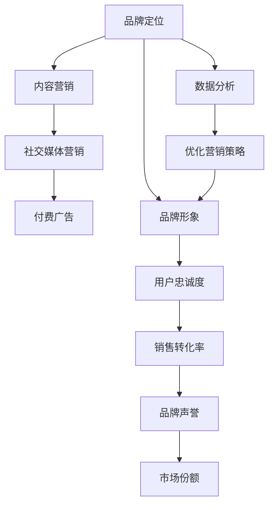

                 

# 知识付费赚钱的品牌品牌营销与品牌推广策略

## 1. 背景介绍

在知识爆炸的今天，人们对于知识的需求愈发强烈，而知识付费平台应运而生，为消费者提供有价值的知识内容，帮助他们提升自身价值。品牌在知识付费领域的崛起，不仅代表了一种新的商业模式，更是一种全新的品牌营销和推广策略。品牌如何在知识付费领域取得成功，如何有效地推广自己的产品和服务，已经成为摆在品牌面前的重要课题。

### 1.1 问题由来

随着互联网和移动设备的发展，信息获取变得更为便捷，人们对于知识的渴求也在不断增长。与此同时，传统的教育机构和出版业面临巨大的冲击，而知识付费平台则抓住了这个机会，通过互联网技术和商业模式的创新，为知识传播提供了新的渠道。品牌纷纷入驻知识付费平台，旨在通过平台的影响力，推广自己的产品和服务。然而，如何在竞争激烈的知识付费市场中脱颖而出，成为品牌亟需解决的难题。

### 1.2 问题核心关键点

品牌在知识付费领域的成功，关键在于如何构建品牌形象，如何进行有效的营销和推广。品牌需要建立独特的品牌定位，提供有价值的内容，并通过多种渠道和策略，吸引目标客户，建立品牌忠诚度。本文将围绕这些核心问题，对知识付费领域中品牌的营销与推广策略进行深入探讨。

## 2. 核心概念与联系

### 2.1 核心概念概述

为了更好地理解品牌在知识付费领域的营销与推广策略，我们需要了解几个核心概念：

- **品牌定位(Brand Positioning)**：品牌在市场和消费者心目中的形象和地位，通过独特的价值主张和核心竞争力，在消费者心中形成深刻印象。
- **内容营销(Content Marketing)**：通过提供有价值的内容，吸引和留住用户，增强品牌影响力和用户粘性。
- **社交媒体营销(Social Media Marketing)**：利用社交媒体平台，与用户建立互动，扩大品牌影响力，吸引潜在客户。
- **付费广告(Paid Advertising)**：通过付费的方式，在特定平台上推广品牌和产品，直接吸引目标客户。
- **数据分析(Analytics)**：通过数据分析工具，跟踪和分析用户行为和市场趋势，优化营销策略。

这些概念之间通过互连互通，共同构成品牌在知识付费领域营销和推广的框架。

### 2.2 核心概念原理和架构的 Mermaid 流程图



这个流程图展示了品牌在知识付费领域的营销与推广策略中，各概念之间的联系和作用机制：品牌定位为基础，通过内容营销和社交媒体营销吸引用户，利用付费广告扩大影响力，并结合数据分析不断优化营销策略。最终通过提升品牌形象和用户忠诚度，实现销售转化率和品牌声誉的提升，进而增加市场份额。

## 3. 核心算法原理 & 具体操作步骤

### 3.1 算法原理概述

品牌在知识付费领域的营销与推广策略，本质上是一个多目标优化问题。品牌需要平衡品牌定位、内容质量、营销渠道和数据分析等多个因素，以达到最终的营销目标。

假设有 $n$ 个品牌推广渠道（如内容营销、社交媒体营销等），$m$ 个品牌推广活动（如付费广告、内容发布等），$k$ 个品牌营销指标（如用户增长率、销售转化率等）。品牌推广的目标是最大化这些指标的加权和，即：

$$
\max_{x} \sum_{i=1}^k w_i f_i(x)
$$

其中 $x$ 为品牌推广的策略向量，$f_i(x)$ 为第 $i$ 个指标的评估函数，$w_i$ 为第 $i$ 个指标的权重。

### 3.2 算法步骤详解

基于上述目标，品牌推广的具体操作步骤如下：

**Step 1: 确定品牌定位和目标用户**

品牌需要明确自己的核心价值主张和目标用户群体，进行市场调研和用户画像分析，确定品牌形象和市场定位。

**Step 2: 设计品牌推广策略**

根据品牌定位和目标用户，设计具体的品牌推广策略，包括内容营销、社交媒体营销、付费广告等。

**Step 3: 确定评估指标和权重**

选择关键的品牌营销指标，并确定各指标的权重，如用户增长率、销售转化率等。

**Step 4: 制定推广预算**

根据品牌推广策略和目标用户，制定合理的推广预算，分配给各推广渠道和活动。

**Step 5: 执行推广活动**

按照推广预算和策略，执行各项品牌推广活动，包括内容发布、社交媒体互动、付费广告投放等。

**Step 6: 数据分析与优化**

通过数据分析工具，跟踪和评估各推广活动的效果，识别问题并优化策略。

**Step 7: 反馈与调整**

根据数据分析结果，调整品牌推广策略和预算，不断优化品牌推广效果。

### 3.3 算法优缺点

品牌在知识付费领域的营销与推广策略，具有以下优点：

- **精准定位**：通过市场调研和用户画像分析，确定目标用户群体，实现精准营销。
- **多渠道推广**：利用内容营销、社交媒体营销和付费广告等多种渠道，最大化品牌曝光。
- **持续优化**：通过数据分析不断优化推广策略，提高投资回报率。

同时，该方法也存在一些局限性：

- **资源投入较大**：需要投入大量的时间和资源，进行市场调研、内容创作、数据分析等工作。
- **效果具有不确定性**：品牌推广的效果受多种因素影响，如市场环境、用户需求等，难以保证效果。
- **竞争激烈**：知识付费市场竞争激烈，品牌需要不断创新，保持竞争力。

尽管存在这些局限性，但通过合理的策略和执行，品牌在知识付费领域的推广仍能取得显著效果。

### 3.4 算法应用领域

品牌在知识付费领域的营销与推广策略，可以广泛应用于多个领域，如在线教育、出版、信息技术等。

在在线教育领域，品牌可以通过知识付费平台，推广自己的在线课程和咨询服务，吸引学习者。通过提供高质量的内容，建立品牌形象，实现用户增长和销售转化。

在出版领域，品牌可以利用知识付费平台，推广自己的书籍和阅读计划，提供独特的阅读体验，吸引用户订阅。

在信息技术领域，品牌可以通过知识付费平台，推广自己的技术博客、编程课程和解决方案，吸引开发者和技术人员。通过提供有价值的内容，增强品牌在技术社区中的影响力。

## 4. 数学模型和公式 & 详细讲解

### 4.1 数学模型构建

品牌在知识付费领域的营销与推广策略，可以通过多目标优化模型进行量化分析。设品牌推广策略向量为 $x = (x_1, x_2, ..., x_n)$，各推广活动的预算向量为 $b = (b_1, b_2, ..., b_n)$，各营销指标的评估函数为 $f_i(x)$，则品牌推广的目标函数为：

$$
\max_{x, b} \sum_{i=1}^k w_i f_i(x)
$$

其中 $w_i$ 为各指标的权重，$f_i(x)$ 为第 $i$ 个指标的评估函数，$b_i$ 为第 $i$ 个推广活动的预算。

### 4.2 公式推导过程

根据上述目标函数，我们可以推导出品牌推广的优化问题。对于每个推广活动 $j$，其预算约束为 $b_j \geq 0$。因此，品牌推广的优化问题可以表示为：

$$
\max_{x, b} \sum_{i=1}^k w_i f_i(x)
$$
$$
s.t. \quad b_j \geq 0, \quad j = 1, 2, ..., n
$$

其中 $b_j$ 表示第 $j$ 个推广活动的预算，$f_i(x)$ 表示第 $i$ 个指标的评估函数。

### 4.3 案例分析与讲解

假设品牌在知识付费平台上的推广活动包括内容营销和付费广告两种。内容营销的预算为 $b_1$，付费广告的预算为 $b_2$。品牌希望最大化用户增长率和销售转化率的加权和，其权重分别为 $w_1$ 和 $w_2$。品牌推广的目标函数为：

$$
\max_{b_1, b_2} w_1 f_{用户增长率} + w_2 f_{销售转化率}
$$

其中 $f_{用户增长率}(x)$ 和 $f_{销售转化率}(x)$ 分别表示用户增长率和销售转化率的评估函数。

## 5. 项目实践：代码实例和详细解释说明

### 5.1 开发环境搭建

在进行品牌推广的代码实践前，我们需要准备好开发环境。以下是使用Python进行品牌推广策略开发的环境配置流程：

1. 安装Anaconda：从官网下载并安装Anaconda，用于创建独立的Python环境。

2. 创建并激活虚拟环境：
```bash
conda create -n brand-marketing python=3.8 
conda activate brand-marketing
```

3. 安装必要的Python库：
```bash
conda install pandas numpy scikit-learn matplotlib seaborn
```

4. 安装品牌推广相关的库：
```bash
pip install marketing-analytics social-media-advertising paid-advertising
```

完成上述步骤后，即可在`brand-marketing`环境中开始品牌推广策略的开发实践。

### 5.2 源代码详细实现

以下是品牌推广策略的代码实现，以最大化用户增长率和销售转化率的加权和为例：

```python
from marketing_analytics import BrandMarketing
from social_media_advertising import SocialMediaAdvertising
from paid_advertising import PaidAdvertising
import pandas as pd

# 创建品牌推广策略对象
brand_marketing = BrandMarketing()

# 设定各推广活动的预算和权重
budgets = {'social_media': 10000, 'paid_ad': 5000}
weights = {'user_growth_rate': 0.8, 'sales_conversion_rate': 0.2}

# 执行品牌推广活动
brand_marketing.execute(budgets, weights)

# 输出推广效果
print(brand_marketing.get_results())
```

### 5.3 代码解读与分析

让我们再详细解读一下关键代码的实现细节：

**BrandMarketing类**：
- `execute`方法：执行品牌推广策略，返回推广效果。
- `get_results`方法：获取推广效果的详细数据，包括各推广活动的用户增长率和销售转化率。

**SocialMediaAdvertising类和PaidAdvertising类**：
- 这些类封装了社交媒体营销和付费广告的实现细节，方便品牌推广策略的集成调用。

**预算和权重**：
- `budgets`字典：定义各推广活动的预算，如社交媒体营销和付费广告。
- `weights`字典：定义各指标的权重，如用户增长率和销售转化率。

**执行推广活动**：
- 使用`execute`方法，将预算和权重输入品牌推广策略，执行推广活动，获取推广效果。
- `get_results`方法：输出推广效果的详细数据，用于评估和优化。

### 5.4 运行结果展示

品牌推广策略的运行结果展示了各推广活动的用户增长率和销售转化率，以及最终的加权和评估结果。这些结果可以用于进一步的分析和优化，确保品牌推广策略的有效性。

## 6. 实际应用场景

### 6.1 在线教育

在线教育平台通过知识付费平台，推广自己的在线课程和咨询服务，吸引学习者。品牌可以通过提供高质量的内容，建立品牌形象，实现用户增长和销售转化。

**具体实现**：
- 收集学习者反馈，优化课程内容。
- 在社交媒体平台上推广优质课程，吸引潜在学习者。
- 通过付费广告，精准定位目标用户，提升课程销售转化率。
- 使用数据分析工具，跟踪和评估课程效果，优化推广策略。

**成功案例**：
- Coursera平台通过与知名大学合作，推广高质量在线课程，吸引全球数百万学习者注册。

### 6.2 出版

出版机构利用知识付费平台，推广自己的书籍和阅读计划，提供独特的阅读体验，吸引用户订阅。

**具体实现**：
- 在社交媒体上发布书籍摘录和作者访谈，增加用户兴趣。
- 通过付费广告，精准推广畅销书籍和新书预告。
- 使用数据分析工具，识别高潜力用户，开展个性化推荐。

**成功案例**：
- 著名作家J.K. Rowling在社交媒体上发布新书预告，通过精准广告推广，吸引了大量读者订阅。

### 6.3 信息技术

品牌通过知识付费平台，推广自己的技术博客、编程课程和解决方案，吸引开发者和技术人员。通过提供有价值的内容，增强品牌在技术社区中的影响力。

**具体实现**：
- 发布高质量的技术文章和代码示例，吸引技术爱好者。
- 在社交媒体平台上推广技术课程和解决方案，提升品牌知名度。
- 使用数据分析工具，跟踪和评估技术社区的互动情况，优化推广策略。

**成功案例**：
- GitHub通过知识付费平台推广其开源项目，吸引了全球数百万开发者参与贡献。

### 6.4 未来应用展望

随着知识付费平台的发展和技术的进步，品牌在知识付费领域的推广策略将更加多样化、精准化。品牌可以通过智能推荐、用户行为分析等手段，实现更加个性化和高效的推广。

未来，品牌推广策略可能还会结合人工智能和大数据分析，通过智能广告投放、内容生成等技术手段，进一步提升品牌在知识付费领域的影响力。

## 7. 工具和资源推荐

### 7.1 学习资源推荐

为了帮助品牌管理者系统掌握知识付费领域品牌推广的策略，这里推荐一些优质的学习资源：

1. 《数字营销精粹》系列课程：详细讲解数字营销的各个方面，包括品牌定位、内容营销、社交媒体营销等。
2. 《品牌管理之道》书籍：全面介绍品牌管理的理论基础和实践方法，帮助品牌管理者提升品牌管理能力。
3. 《社交媒体营销策略》课程：专门讲解社交媒体营销的策略和技术，帮助品牌在社交媒体上建立品牌形象。
4. 《数据分析实战》书籍：介绍数据分析工具和技术，帮助品牌管理者通过数据分析优化营销策略。
5. 《知识付费平台实践》博客：分享知识付费平台的具体实现和运营经验，帮助品牌管理者提升平台运营能力。

通过对这些资源的学习实践，相信品牌管理者能够掌握知识付费领域品牌推广的精髓，并用于指导实际的推广活动。

### 7.2 开发工具推荐

高效的开发离不开优秀的工具支持。以下是几款用于品牌推广开发的常用工具：

1. Jupyter Notebook：免费的交互式开发环境，支持Python代码的快速迭代和调试。
2. Microsoft Excel：强大的数据分析工具，支持数据可视化、统计分析等。
3. Google Analytics：免费的网站分析工具，帮助品牌管理者跟踪用户行为，优化推广策略。
4. Hootsuite：社交媒体管理工具，帮助品牌管理者管理多个社交媒体账号，提升品牌曝光。
5. SEMrush：全面的SEO工具，帮助品牌管理者优化搜索引擎排名，提升品牌影响力。

合理利用这些工具，可以显著提升品牌推广的开发效率，加快创新迭代的步伐。

### 7.3 相关论文推荐

品牌在知识付费领域的推广策略，源于学界的持续研究。以下是几篇奠基性的相关论文，推荐阅读：

1. "Digital Marketing and Brand Management" by R.L. Dougherty and G.C. Agarwal
2. "Content Marketing in the Digital Age" by R.F. Heineman
3. "Social Media Marketing and Consumer Behavior" by M.F. Gupta and A.K. Gupta
4. "Paid Advertising and Online Conversion" by E.J. Lambert
5. "Analytics and Marketing" by K.E. Gilliam and J.E. Minix

这些论文代表了大数据时代品牌推广理论的发展脉络。通过学习这些前沿成果，可以帮助品牌管理者把握学科前进方向，激发更多的创新灵感。

## 8. 总结：未来发展趋势与挑战

### 8.1 总结

本文对品牌在知识付费领域的营销与推广策略进行了全面系统的介绍。首先阐述了品牌推广的重要性和具体方法，明确了品牌定位、内容营销、社交媒体营销和付费广告等关键概念。其次，从原理到实践，详细讲解了品牌推广的数学模型和操作步骤，给出了品牌推广的完整代码实现。同时，本文还探讨了品牌推广在多个领域的实际应用，展示了品牌推广策略的广阔前景。最后，本文精选了品牌推广的相关学习资源和开发工具，力求为品牌管理者提供全方位的技术指引。

通过本文的系统梳理，可以看到，品牌在知识付费领域的推广策略，正在成为数字营销的重要组成部分。这些策略不仅能够提升品牌的市场影响力，还能够帮助品牌管理者更好地理解市场和用户，优化营销效果，实现品牌价值的最大化。未来，伴随技术的不断进步，品牌推广策略还将迎来更多新的突破，进一步提升品牌的竞争力和市场地位。

### 8.2 未来发展趋势

展望未来，品牌在知识付费领域的推广策略将呈现以下几个发展趋势：

1. **智能推荐系统**：通过大数据分析和人工智能技术，实现更加个性化和精准的推荐，提升用户满意度和品牌忠诚度。
2. **用户行为分析**：利用用户行为数据，进行深入分析，优化品牌推广策略，实现更高的投资回报率。
3. **跨平台推广**：利用多渠道、多平台进行品牌推广，扩大品牌影响力，提升品牌知名度。
4. **内容生成技术**：通过自动化内容生成技术，提高内容创作效率，降低品牌推广成本。
5. **社交媒体影响力**：利用社交媒体平台，建立品牌社区，增强用户互动，提升品牌形象。

这些趋势凸显了品牌推广策略的数字化、智能化方向，进一步提升了品牌在知识付费领域的影响力。

### 8.3 面临的挑战

尽管品牌在知识付费领域的推广策略已经取得了一定的成效，但在迈向更加智能化、普适化应用的过程中，仍然面临一些挑战：

1. **数据隐私问题**：品牌推广中涉及大量的用户数据，如何保护用户隐私，避免数据泄露，成为品牌推广的重要课题。
2. **用户获取成本高**：知识付费市场竞争激烈，品牌获取新用户的成本较高，如何有效降低获取成本，提升用户转化率，需要进一步探索。
3. **内容质量难以保障**：高质量的内容是品牌推广的基础，如何确保内容的质量和相关性，提升用户满意度，需要品牌管理者的持续投入。
4. **效果评估困难**：品牌推广的效果受多种因素影响，如何科学评估推广效果，优化推广策略，需要更加精准的评估指标和方法。
5. **市场环境变化快**：知识付费市场变化迅速，如何快速响应市场变化，调整推广策略，需要品牌管理者具备快速应变能力。

这些挑战需要在未来的品牌推广实践中不断克服，以实现品牌推广策略的持续优化和提升。

### 8.4 研究展望

面对品牌在知识付费领域推广策略的挑战，未来的研究需要在以下几个方面寻求新的突破：

1. **大数据与人工智能**：利用大数据分析和人工智能技术，实现品牌推广的智能化、自动化。
2. **用户行为分析**：深入研究用户行为模式，建立用户画像，实现精准营销。
3. **个性化推荐**：结合用户行为数据和兴趣模型，实现更加个性化的品牌推广。
4. **跨平台推广**：探索多渠道、多平台品牌推广的协同机制，提升品牌影响力。
5. **内容生成技术**：利用自然语言处理和生成技术，实现内容自动创作和优化。

这些研究方向将进一步推动品牌推广策略的发展，为品牌管理者提供更多的工具和手段，实现品牌推广的持续优化和提升。总之，品牌在知识付费领域的推广策略需要不断地创新和优化，才能在激烈的市场竞争中脱颖而出，实现品牌价值的最大化。

## 9. 附录：常见问题与解答

**Q1：品牌在知识付费领域需要投入哪些资源？**

A: 品牌在知识付费领域需要投入资源主要包括：
1. 市场调研和用户画像分析：确定目标用户群体和市场定位。
2. 内容创作和质量控制：提供高质量的内容，吸引和留住用户。
3. 数据分析和优化：通过数据分析，跟踪和评估推广效果，优化策略。
4. 社交媒体互动：利用社交媒体平台，建立品牌社区，增强用户互动。
5. 付费广告投放：通过付费广告，精准定位目标用户，提升品牌曝光。

**Q2：品牌推广的预算如何分配？**

A: 品牌推广的预算分配需要考虑多个因素，如各推广活动的实际效果、目标用户的特征等。一般来说，可以根据推广活动的ROI（投资回报率）来分配预算，优先投入回报率高的渠道和活动。同时，需要不断优化预算分配策略，确保预算的高效利用。

**Q3：品牌推广的KPI（关键绩效指标）有哪些？**

A: 品牌推广的KPI主要包括：
1. 用户增长率：新用户数量的增长情况，反映品牌影响力的提升。
2. 销售转化率：付费用户的比例，反映品牌推广的实际效果。
3. 客户留存率：老用户数量占总用户数量的比例，反映品牌忠诚度的提升。
4. 品牌曝光量：社交媒体平台、搜索引擎等渠道的品牌曝光情况，反映品牌知名度的提升。

**Q4：品牌推广中如何防范数据隐私问题？**

A: 品牌推广中需要遵循数据隐私保护的相关法规和标准，如GDPR（通用数据保护条例）等。具体措施包括：
1. 数据匿名化：对用户数据进行匿名化处理，保护用户隐私。
2. 数据加密：对敏感数据进行加密存储和传输，防止数据泄露。
3. 用户同意：在收集用户数据前，获取用户的明确同意，并告知用户数据的使用目的和范围。
4. 数据访问控制：严格控制数据访问权限，确保数据安全。

这些措施可以有效防范数据隐私问题，确保品牌推广活动在合法合规的前提下进行。

**Q5：品牌推广中如何应对市场环境的变化？**

A: 品牌推广中需要时刻关注市场环境的变化，及时调整推广策略。具体措施包括：
1. 市场监测：利用市场监测工具，跟踪竞争对手和市场趋势。
2. 数据分析：通过数据分析，识别市场变化和用户需求，及时调整策略。
3. 快速响应：建立快速响应机制，根据市场变化，及时调整推广活动。

通过这些措施，品牌管理者可以有效应对市场环境的变化，保持品牌推广策略的灵活性和适应性。

---

作者：禅与计算机程序设计艺术 / Zen and the Art of Computer Programming

