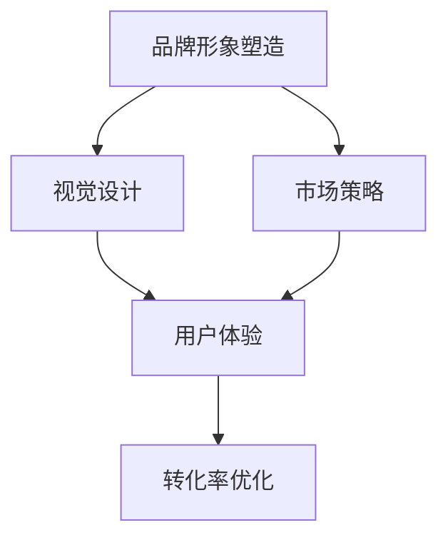

                 

# 知识付费赚钱的品牌形象塑造与视觉设计

> 关键词：知识付费, 品牌形象塑造, 视觉设计, 市场策略, 用户体验, 转化率优化

## 1. 背景介绍

### 1.1 问题由来

随着互联网和数字经济的发展，知识付费成为越来越多用户选择的学习和获取知识的方式。根据艾媒咨询发布的《2020年中国知识付费行业研究报告》显示，2020年我国知识付费市场规模达238.1亿元，同比2019年增长40.1%，用户规模达4.49亿人。知识付费已经逐渐从初步探索阶段进入快速成长阶段。

知识付费市场催生了一批优秀的平台，如得到、喜马拉雅、知乎live、逻辑思维等。这些平台在品牌形象塑造和视觉设计方面，有着不同的侧重点和策略。而如何通过有效的品牌形象塑造与视觉设计，增强用户粘性，提升转化率，成为知识付费平台在激烈竞争中脱颖而出的关键。

### 1.2 问题核心关键点

1. **品牌形象塑造**：通过品牌建设，树立用户对平台的信任感，增强品牌忠诚度。
2. **视觉设计**：通过视觉设计，提升用户体验，强化品牌记忆点。
3. **市场策略**：通过合理的市场策略，提升新用户转化率和用户留存率。
4. **用户体验**：通过优化用户体验，增强用户粘性，减少用户流失。
5. **转化率优化**：通过有效的转化策略，提升平台收益，实现商业价值的最大化。

### 1.3 问题研究意义

在知识付费领域，良好的品牌形象与视觉设计可以显著提升用户黏性，增强用户信任，从而推动平台向良性循环发展。具体而言，品牌形象和视觉设计对平台的正面影响包括：

1. **增强用户信任**：优质的品牌形象可以增强用户对平台的信任感，降低转化成本。
2. **提升用户粘性**：视觉设计可以增强用户体验，使用户产生归属感，提高用户留存率。
3. **提升转化率**：有效的市场策略与视觉设计可以显著提升用户转化率，提升平台收益。
4. **提升品牌价值**：品牌形象的塑造与推广，可以提升平台的社会影响力，树立行业标准。

## 2. 核心概念与联系

### 2.1 核心概念概述

为更好地理解品牌形象塑造与视觉设计的内在联系，本节将介绍几个密切相关的核心概念：

- **品牌形象塑造(Brand Image Construction)**：通过一系列品牌建设活动，提升品牌知名度，增强品牌价值感。
- **视觉设计(Visual Design)**：通过视觉元素的设计，如颜色、字体、图标、版面等，增强用户体验，传递品牌理念。
- **市场策略(Market Strategy)**：通过市场调研、用户定位、营销推广等手段，提升品牌影响力，拓展市场份额。
- **用户体验(User Experience, UX)**：通过优化界面设计、交互逻辑、内容展示等，提升用户满意度，增强用户黏性。
- **转化率优化(Conversion Rate Optimization, CRO)**：通过优化用户体验、营销策略等手段，提升用户在平台上的转化率，实现商业价值最大化。

这些核心概念之间的逻辑关系可以通过以下Mermaid流程图来展示：



这个流程图展示出品牌形象塑造、市场策略、视觉设计、用户体验、转化率优化等概念之间的相互关系：

1. **品牌形象塑造**：通过市场策略和视觉设计，提升品牌知名度和价值感。
2. **视觉设计**：增强用户体验，同时传递品牌理念。
3. **市场策略**：通过品牌形象和用户体验，提升用户转化率。
4. **用户体验**：增强用户黏性，同时通过视觉设计传递品牌价值。
5. **转化率优化**：通过市场策略和用户体验，提升平台收益。

这些概念共同构成了品牌形象塑造与视觉设计的核心框架，帮助知识付费平台在竞争激烈的市场环境中突围。

## 3. 核心算法原理 & 具体操作步骤
### 3.1 算法原理概述

知识付费平台通过品牌形象塑造与视觉设计，可以显著提升用户转化率和平台收益。其核心思想是：

1. **品牌形象塑造**：通过市场策略，提升品牌知名度和价值感，增强用户信任。
2. **视觉设计**：通过视觉元素的设计，增强用户体验，传递品牌理念，提升用户黏性。
3. **市场策略**：通过营销推广，提升新用户转化率，拓展市场份额。
4. **用户体验**：通过优化界面设计、交互逻辑、内容展示等，提升用户满意度，增强用户留存。
5. **转化率优化**：通过市场策略和用户体验优化，提升用户在平台上的转化率，实现商业价值最大化。

具体步骤如下：

**Step 1: 品牌形象塑造**

1. **品牌定位**：明确品牌的目标用户群体、价值主张和市场定位。
2. **品牌故事**：通过品牌故事，传递品牌理念和价值观。
3. **品牌元素**：设计品牌标识、口号、字体、颜色等品牌元素。

**Step 2: 视觉设计**

1. **界面设计**：优化界面布局、颜色搭配、字体选择等。
2. **图标设计**：设计符合品牌调性的图标和图标系统。
3. **动画设计**：使用动画效果增强用户体验，传递品牌理念。

**Step 3: 市场策略**

1. **目标市场**：定义目标用户群体，进行市场细分。
2. **营销推广**：通过广告、社交媒体、内容营销等手段，提升品牌知名度。
3. **用户互动**：通过社区、论坛、活动等形式，增强用户互动和品牌忠诚度。

**Step 4: 用户体验优化**

1. **交互设计**：优化界面交互逻辑，提升用户操作效率。
2. **内容展示**：优化内容展示方式，提升用户阅读体验。
3. **反馈机制**：建立用户反馈机制，及时解决用户问题。

**Step 5: 转化率优化**

1. **着陆页优化**：优化着陆页设计，提升用户转化率。
2. **A/B测试**：通过A/B测试，找到最佳的用户转化路径。
3. **用户激励**：通过奖励、会员制度等激励手段，提升用户转化率。

### 3.2 算法步骤详解

以下是详细的品牌形象塑造与视觉设计的操作步骤：

**Step 1: 品牌形象塑造**

1. **品牌定位**：明确品牌目标用户群体、价值主张和市场定位。例如，得到强调“付费订阅、高性价比、高质量内容”，而喜马拉雅则侧重“音频内容、泛娱乐、社区互动”。

2. **品牌故事**：通过品牌故事，传递品牌理念和价值观。例如，逻辑思维的“为聪明人节省时间”，新东方在线的“成就更好未来”。

3. **品牌元素**：设计品牌标识、口号、字体、颜色等品牌元素。例如，逻辑思维的标志是一只简洁的蓝色小图标，反映其简约、高效的品牌调性。

**Step 2: 视觉设计**

1. **界面设计**：优化界面布局、颜色搭配、字体选择等。例如，喜马拉雅通过简约的黑色与白色，以及大号文字突出内容主体，传递品牌的专业性和简洁性。

2. **图标设计**：设计符合品牌调性的图标和图标系统。例如，得到使用圆润的动态图标，强调其活力与用户互动性。

3. **动画设计**：使用动画效果增强用户体验，传递品牌理念。例如，知乎通过渐变动画和动态元素，提升内容展示的生动性。

**Step 3: 市场策略**

1. **目标市场**：定义目标用户群体，进行市场细分。例如，新东方在线通过精准的广告投放，针对不同年龄、职业的用户群体，提升品牌影响力。

2. **营销推广**：通过广告、社交媒体、内容营销等手段，提升品牌知名度。例如，得到通过KOL推广和精准广告，提升品牌曝光度。

3. **用户互动**：通过社区、论坛、活动等形式，增强用户互动和品牌忠诚度。例如，喜马拉雅通过语音互动和社交功能，增强用户参与度。

**Step 4: 用户体验优化**

1. **交互设计**：优化界面交互逻辑，提升用户操作效率。例如，得到通过简洁的界面设计和流畅的操作逻辑，提升用户体验。

2. **内容展示**：优化内容展示方式，提升用户阅读体验。例如，知乎通过卡片式布局和简洁的阅读界面，提升内容展示的清晰度和便捷性。

3. **反馈机制**：建立用户反馈机制，及时解决用户问题。例如，新东方在线通过用户反馈渠道和客服支持，提升用户满意度。

**Step 5: 转化率优化**

1. **着陆页优化**：优化着陆页设计，提升用户转化率。例如，逻辑思维通过简洁的购买流程和清晰的优惠信息，提升购买转化率。

2. **A/B测试**：通过A/B测试，找到最佳的用户转化路径。例如，喜马拉雅通过测试不同的按钮样式和优惠信息，找到最优的转化策略。

3. **用户激励**：通过奖励、会员制度等激励手段，提升用户转化率。例如，得到通过积分系统和会员特权，提升用户粘性和平台忠诚度。

### 3.3 算法优缺点

品牌形象塑造与视觉设计具有以下优点：

1. **提升用户信任**：通过品牌形象的塑造，增强用户对平台的信任感。
2. **提升用户体验**：通过视觉设计，优化用户界面和内容展示，提升用户满意度。
3. **增强品牌价值**：通过品牌故事和视觉元素，传递品牌理念和价值观。
4. **降低转化成本**：通过市场策略和用户体验优化，提升新用户转化率。

同时，这些方法也存在一定的局限性：

1. **成本较高**：品牌形象塑造和视觉设计需要大量的时间和金钱投入，尤其是高质量的品牌设计和市场推广。
2. **效果依赖用户群体**：品牌形象和视觉设计的有效性很大程度上取决于目标用户群体的接受度和偏好。
3. **市场竞争激烈**：在知识付费领域，平台众多，品牌形象和视觉设计需要具备独特性，才能在竞争中脱颖而出。

### 3.4 算法应用领域

品牌形象塑造与视觉设计在知识付费平台中的应用，主要体现在以下几个方面：

1. **品牌建设**：通过品牌故事和标识设计，提升品牌知名度和价值感。
2. **内容展示**：通过界面设计和内容展示优化，提升用户阅读体验和互动性。
3. **市场推广**：通过精准的市场策略和推广手段，提升品牌影响力。
4. **用户互动**：通过社区、论坛、活动等形式，增强用户参与度和品牌忠诚度。
5. **转化优化**：通过用户体验优化和激励手段，提升用户在平台上的转化率。

这些应用领域展示了品牌形象塑造与视觉设计在知识付费平台中的广泛影响力和重要性。

## 4. 数学模型和公式 & 详细讲解  
### 4.1 数学模型构建

品牌形象塑造与视觉设计可以通过以下数学模型来建模：

**品牌知名度模型**：

$$
\text{Brand Awareness} = f(\text{Marketing Spend}, \text{Competitor Impact}, \text{User Feedback})
$$

**用户体验满意度模型**：

$$
\text{User Satisfaction} = g(\text{UI/UX}, \text{Content Quality}, \text{User Engagement})
$$

**用户转化率模型**：

$$
\text{Conversion Rate} = h(\text{Landing Page Optimization}, \text{A/B Testing}, \text{User Incentives})
$$

**品牌价值模型**：

$$
\text{Brand Value} = i(\text{Brand Story}, \text{Brand Elements}, \text{User Perception})
$$

其中，$f$、$g$、$h$、$i$为模型函数，代表品牌知名度、用户体验、转化率、品牌价值等变量的计算方法。

### 4.2 公式推导过程

以下是各个模型的详细推导过程：

**品牌知名度模型**：

1. **品牌知名度**：品牌知名度反映了用户对品牌的认知和认可程度，可以通过市场投入、竞争对手影响和用户反馈三个因素进行计算。
2. **品牌知名度函数**：品牌知名度$BA$的计算公式为：

$$
BA = \alpha \times \text{Marketing Spend} + \beta \times \text{Competitor Impact} + \gamma \times \text{User Feedback}
$$

其中，$\alpha$、$\beta$、$\gamma$为模型系数，分别代表市场投入、竞争对手影响和用户反馈的权重。

**用户体验满意度模型**：

1. **用户体验满意度**：用户体验满意度反映了用户对平台的满意程度，可以通过界面设计、内容质量和用户参与度进行计算。
2. **用户体验满意度函数**：用户体验满意度$US$的计算公式为：

$$
US = \delta \times \text{UI/UX} + \epsilon \times \text{Content Quality} + \zeta \times \text{User Engagement}
$$

其中，$\delta$、$\epsilon$、$\zeta$为模型系数，分别代表界面设计、内容质量和用户参与度的权重。

**用户转化率模型**：

1. **用户转化率**：用户转化率反映了用户在平台上的付费意愿和购买行为，可以通过着陆页优化、A/B测试和用户激励进行计算。
2. **用户转化率函数**：用户转化率$CR$的计算公式为：

$$
CR = \lambda \times \text{Landing Page Optimization} + \mu \times \text{A/B Testing} + \nu \times \text{User Incentives}
$$

其中，$\lambda$、$\mu$、$\nu$为模型系数，分别代表着陆页优化、A/B测试和用户激励的权重。

**品牌价值模型**：

1. **品牌价值**：品牌价值反映了用户对品牌的认可和信任程度，可以通过品牌故事、品牌元素和用户感知进行计算。
2. **品牌价值函数**：品牌价值$BV$的计算公式为：

$$
BV = \sigma \times \text{Brand Story} + \tau \times \text{Brand Elements} + \phi \times \text{User Perception}
$$

其中，$\sigma$、$\tau$、$\phi$为模型系数，分别代表品牌故事、品牌元素和用户感知的权重。

### 4.3 案例分析与讲解

以得到平台为例，分析其品牌形象塑造与视觉设计的具体实施：

**品牌形象塑造**：

1. **品牌定位**：得到定位为“碎片化时间学习”，针对年轻职业人群，提供高性价比和高质量的课程内容。
2. **品牌故事**：得到通过“为聪明人节省时间”的品牌故事，传递“高效学习”的理念，吸引目标用户群体。
3. **品牌元素**：得到采用简洁的蓝色图标和干净的界面设计，传递其专业性和简约性。

**视觉设计**：

1. **界面设计**：得到采用简洁的界面设计，突出课程内容和购买按钮，提升用户购买转化率。
2. **图标设计**：得到使用圆润的动态图标，增强用户互动性和品牌记忆点。
3. **动画设计**：得到通过渐变动画和动态元素，提升内容展示的生动性，增强用户体验。

**市场策略**：

1. **目标市场**：得到通过精准的广告投放，针对年轻职业人群进行市场细分。
2. **营销推广**：得到通过KOL推广和精准广告，提升品牌曝光度和用户转化率。
3. **用户互动**：得到通过社区和论坛，增强用户互动和品牌忠诚度。

**用户体验优化**：

1. **交互设计**：得到通过简洁的界面设计和流畅的操作逻辑，提升用户体验和操作效率。
2. **内容展示**：得到通过卡片式布局和简洁的阅读界面，提升内容展示的清晰度和便捷性。
3. **反馈机制**：得到通过用户反馈渠道和客服支持，提升用户满意度和平台忠诚度。

**转化率优化**：

1. **着陆页优化**：得到通过简洁的购买流程和清晰的优惠信息，提升购买转化率。
2. **A/B测试**：得到通过A/B测试，找到最佳的用户转化路径，提升用户转化率。
3. **用户激励**：得到通过积分系统和会员特权，提升用户粘性和平台忠诚度。

通过以上分析可以看出，得到在品牌形象塑造与视觉设计方面，通过精准的市场策略和用户体验优化，显著提升了用户转化率和品牌价值。

## 5. 项目实践：代码实例和详细解释说明
### 5.1 开发环境搭建

在进行品牌形象塑造与视觉设计实践前，我们需要准备好开发环境。以下是使用Python进行Django开发的环境配置流程：

1. 安装Anaconda：从官网下载并安装Anaconda，用于创建独立的Python环境。

2. 创建并激活虚拟环境：
```bash
conda create -n django-env python=3.8 
conda activate django-env
```

3. 安装Django：从官网获取对应的安装命令。例如：
```bash
pip install django
```

4. 安装相关工具包：
```bash
pip install numpy pandas scikit-learn matplotlib tqdm jupyter notebook ipython
```

完成上述步骤后，即可在`django-env`环境中开始项目实践。

### 5.2 源代码详细实现

以下是品牌形象塑造与视觉设计实践的Django项目代码实现：

**settings.py**

```python
INSTALLED_APPS = [
    'django.contrib.admin',
    'django.contrib.auth',
    'django.contrib.contenttypes',
    'django.contrib.sessions',
    'django.contrib.messages',
    'django.contrib.staticfiles',
    'home',
    'brand',
    'user',
]

TEMPLATES = [
    {
        'BACKEND': 'django.template.backends.django.DjangoTemplates',
        'DIRS': [BASE_DIR + '/templates'],
        'APP_DIRS': True,
        'OPTIONS': {
            'context_processors': [
                'django.template.context_processors.debug',
                'django.template.context_processors.request',
                'django.contrib.auth.context_processors.auth',
                'django.contrib.messages.context_processors.messages',
            ],
        },
    },
]

```

**urls.py**

```python
from django.contrib import admin
from django.urls import path, include

urlpatterns = [
    path('admin/', admin.site.urls),
    path('', include('home.urls')),
    path('brand/', include('brand.urls')),
    path('user/', include('user.urls')),
]

```

**home/views.py**

```python
from django.shortcuts import render

def index(request):
    return render(request, 'home/index.html')
```

**home/urls.py**

```python
from django.urls import path

from . import views

urlpatterns = [
    path('', views.index, name='home'),
]

```

**brand/views.py**

```python
from django.shortcuts import render

def home(request):
    return render(request, 'brand/home.html')
```

**brand/urls.py**

```python
from django.urls import path

from . import views

urlpatterns = [
    path('', views.home, name='brand'),
]

```

**user/views.py**

```python
from django.shortcuts import render

def home(request):
    return render(request, 'user/home.html')
```

**user/urls.py**

```python
from django.urls import path

from . import views

urlpatterns = [
    path('', views.home, name='user'),
]

```

通过以上代码，我们构建了一个包含品牌形象塑造、用户管理等功能的Django应用。在`brand`应用中，我们通过`home`视图函数，展示品牌形象塑造的相关页面。在`user`应用中，我们通过`home`视图函数，展示用户管理的相关页面。

### 5.3 代码解读与分析

让我们再详细解读一下关键代码的实现细节：

**settings.py**：

- `INSTALLED_APPS`：配置应用程序列表，包括`home`、`brand`和`user`等应用。
- `TEMPLATES`：配置模板引擎，指定模板文件目录和模板上下文处理器。

**urls.py**：

- `urlpatterns`：定义应用路由，将请求映射到相应的视图函数。

**home/views.py**：

- `index`函数：通过`render`函数，渲染首页内容，并展示在用户界面中。

**home/urls.py**：

- `urlpatterns`：定义应用路由，将首页请求映射到`home`视图函数。

**brand/views.py**：

- `home`函数：通过`render`函数，渲染品牌形象塑造页面，并展示在用户界面中。

**brand/urls.py**：

- `urlpatterns`：定义应用路由，将品牌形象塑造请求映射到`home`视图函数。

**user/views.py**：

- `home`函数：通过`render`函数，渲染用户管理页面，并展示在用户界面中。

**user/urls.py**：

- `urlpatterns`：定义应用路由，将用户管理请求映射到`home`视图函数。

通过以上代码的实现，我们可以清晰地看到品牌形象塑造与视觉设计在Django应用中的实现流程。开发者可以通过类似的方式，在实际项目中实现品牌形象塑造与视觉设计功能。

## 6. 实际应用场景
### 6.1 智能客服系统

品牌形象塑造与视觉设计在智能客服系统中的应用，主要体现在以下几个方面：

1. **品牌故事**：通过品牌故事，传递智能客服的品牌理念和价值观，增强用户信任。
2. **视觉设计**：通过视觉设计，优化用户界面和内容展示，提升用户体验。
3. **市场策略**：通过精准的市场策略和推广手段，提升品牌知名度和用户转化率。
4. **用户体验优化**：通过优化界面设计、交互逻辑、内容展示等，提升用户满意度。

例如，智能客服系统可以通过简洁的界面设计和友好的交互逻辑，传递其专业性和用户友好的品牌形象。通过品牌故事和视觉设计，增强用户对平台的信任感。

### 6.2 金融舆情监测

品牌形象塑造与视觉设计在金融舆情监测中的应用，主要体现在以下几个方面：

1. **品牌形象塑造**：通过品牌故事和视觉设计，传递金融舆情监测的专业性和权威性，增强用户信任。
2. **视觉设计**：通过简洁的界面设计和清晰的内容展示，提升用户阅读体验和互动性。
3. **市场策略**：通过精准的市场推广和内容营销，提升品牌知名度和用户转化率。
4. **用户体验优化**：通过优化界面设计和交互逻辑，提升用户满意度。

例如，金融舆情监测系统可以通过品牌故事和视觉设计，传递其专业性和权威性，增强用户对平台的信任感。通过简洁的界面设计和清晰的内容展示，提升用户阅读体验和互动性。

### 6.3 个性化推荐系统

品牌形象塑造与视觉设计在个性化推荐系统中的应用，主要体现在以下几个方面：

1. **品牌形象塑造**：通过品牌故事和视觉设计，传递个性化推荐系统的个性化和精准性，增强用户信任。
2. **视觉设计**：通过简洁的界面设计和清晰的内容展示，提升用户阅读体验和互动性。
3. **市场策略**：通过精准的市场推广和内容营销，提升品牌知名度和用户转化率。
4. **用户体验优化**：通过优化界面设计和交互逻辑，提升用户满意度。

例如，个性化推荐系统可以通过品牌故事和视觉设计，传递其个性化和精准性，增强用户对平台的信任感。通过简洁的界面设计和清晰的内容展示，提升用户阅读体验和互动性。

### 6.4 未来应用展望

随着品牌形象塑造与视觉设计技术的发展，其在知识付费领域的应用将更加广泛和深入。未来，该技术将在以下方面取得更大的突破：

1. **多模态融合**：通过视觉设计、语音识别、自然语言处理等技术的融合，提供更加全面和立体的用户体验。
2. **智能推荐**：通过品牌故事和视觉设计，提升智能推荐系统的个性化和精准性，增强用户信任和黏性。
3. **实时互动**：通过品牌故事和视觉设计，增强实时互动功能，提升用户满意度和品牌忠诚度。
4. **人工智能辅助**：通过品牌故事和视觉设计，结合人工智能技术，提供更加智能和高效的服务。

这些应用展望展示了品牌形象塑造与视觉设计在知识付费领域的巨大潜力和广泛前景。

## 7. 工具和资源推荐
### 7.1 学习资源推荐

为了帮助开发者系统掌握品牌形象塑造与视觉设计的理论基础和实践技巧，这里推荐一些优质的学习资源：

1. **《UI/UX设计》系列博文**：由知名UI/UX设计师撰写，深入浅出地介绍了UI/UX设计的原理、工具和方法。

2. **《品牌管理》课程**：多所名校开设的品牌管理课程，涵盖品牌定位、品牌故事、品牌元素等核心内容，帮助理解品牌塑造的底层逻辑。

3. **《市场营销》书籍**：经典的市场营销书籍，如菲利普·科特勒的《市场营销原理》，介绍市场营销的核心概念和实践策略。

4. **Dribbble、Behance**：设计师社区，展示全球顶尖的UI/UX设计和品牌形象案例，提供丰富的灵感和思路。

5. **Awwwards**：网站设计奖项，评选全球最优秀的网站设计，涵盖品牌形象塑造与视觉设计等多个方面。

通过对这些资源的学习实践，相信你一定能够快速掌握品牌形象塑造与视觉设计的精髓，并用于解决实际的NLP问题。

### 7.2 开发工具推荐

高效的开发离不开优秀的工具支持。以下是几款用于品牌形象塑造与视觉设计开发的常用工具：

1. **Sketch**：UI/UX设计师常用的设计工具，提供丰富的组件库和设计模板，帮助快速创建品牌形象和界面设计。

2. **Adobe Photoshop**：图像处理工具，可以用于品牌元素设计、图标设计、视觉元素调整等。

3. **Figma**：在线协作设计工具，支持实时编辑、版本控制等，方便团队协作和快速迭代设计方案。

4. **Adobe Illustrator**：矢量图形设计工具，适合制作品牌标识、图标等视觉元素。

5. **Adobe XD**：用户体验设计工具，提供设计原型和交互设计功能，帮助快速实现品牌故事和用户体验。

6. **Adobe Creative Cloud**：一站式设计平台，涵盖各类设计工具，帮助设计师快速实现创意。

合理利用这些工具，可以显著提升品牌形象塑造与视觉设计的开发效率，加快创新迭代的步伐。

### 7.3 相关论文推荐

品牌形象塑造与视觉设计的发展源于学界的持续研究。以下是几篇奠基性的相关论文，推荐阅读：

1. **《品牌塑造的心理学》**：探讨品牌形象塑造的心理学原理，分析品牌故事、品牌元素对用户心理的影响。

2. **《用户体验设计原则》**：介绍用户体验设计的核心原则和实践方法，帮助理解用户体验优化的关键要素。

3. **《品牌价值管理的框架》**：提出品牌价值管理的框架和方法，帮助理解品牌价值模型和品牌塑造的策略。

4. **《视觉设计中的色彩心理学》**：探讨色彩在视觉设计中的心理学原理，帮助理解品牌视觉元素的设计原则。

5. **《智能推荐系统中的个性化设计》**：介绍智能推荐系统中的个性化设计和优化策略，帮助理解品牌故事和视觉设计对推荐系统的影响。

这些论文代表了大语言模型微调技术的发展脉络。通过学习这些前沿成果，可以帮助研究者把握学科前进方向，激发更多的创新灵感。

## 8. 总结：未来发展趋势与挑战
### 8.1 总结

本文对品牌形象塑造与视觉设计的方法进行了全面系统的介绍。首先阐述了品牌形象塑造与视觉设计的研究背景和意义，明确了其对知识付费平台的重要性。其次，从原理到实践，详细讲解了品牌形象塑造、视觉设计、市场策略、用户体验、转化率优化等核心步骤，给出了品牌形象塑造与视觉设计实践的完整代码实例。同时，本文还广泛探讨了品牌形象塑造与视觉设计在智能客服、金融舆情、个性化推荐等多个行业领域的应用前景，展示了其在知识付费领域的广泛影响力。

通过本文的系统梳理，可以看到，品牌形象塑造与视觉设计在知识付费平台中扮演着重要的角色，极大地提升了用户转化率和平台收益。未来，伴随技术的发展，品牌形象塑造与视觉设计将更加灵活多样，能够更好地服务于平台和用户。

### 8.2 未来发展趋势

展望未来，品牌形象塑造与视觉设计技术将呈现以下几个发展趋势：

1. **数据驱动设计**：通过数据分析和用户调研，设计更加符合用户需求和心理的设计方案。
2. **个性化设计**：通过个性化设计，满足不同用户群体的需求，提升用户体验和品牌忠诚度。
3. **多模态设计**：通过视觉设计、语音识别、自然语言处理等技术的融合，提供更加全面和立体的用户体验。
4. **智能设计**：通过人工智能技术，实现设计自动化和智能化，提高设计效率和创新性。
5. **用户体验优化**：通过优化界面设计、交互逻辑、内容展示等，提升用户满意度和平台留存率。
6. **实时互动设计**：通过实时互动功能，提升用户粘性和品牌忠诚度。

以上趋势凸显了品牌形象塑造与视觉设计的广阔前景。这些方向的探索发展，必将进一步提升用户体验和平台收益，为知识付费平台带来更大的商业价值。

### 8.3 面临的挑战

尽管品牌形象塑造与视觉设计技术已经取得了显著成效，但在迈向更加智能化、普适化应用的过程中，仍面临诸多挑战：

1. **用户需求多样性**：不同用户群体的需求和偏好差异较大，设计需要兼顾多样性和个性化。
2. **设计效率问题**：大批量设计需求和快速迭代设计方案，对设计效率提出了更高要求。
3. **设计质量控制**：如何保证设计质量，避免设计偏差和不良影响，需要更多工具和方法。
4. **跨平台适配**：不同设备和平台的适配问题，需要考虑用户体验的一致性和便捷性。
5. **设计与业务融合**：如何将设计理念和业务目标有机结合，提升平台整体价值，需要更多跨学科的合作。

### 8.4 研究展望

面对品牌形象塑造与视觉设计所面临的挑战，未来的研究需要在以下几个方面寻求新的突破：

1. **设计自动化**：通过设计自动化工具和方法，提高设计效率和质量，减少设计师的工作量。
2. **智能设计辅助**：结合人工智能技术，实现设计智能化和自动化，提升设计效率和创新性。
3. **用户需求分析**：通过用户调研和数据分析，深入理解用户需求，设计更加符合用户心理的设计方案。
4. **多模态设计融合**：通过视觉设计、语音识别、自然语言处理等技术的融合，提供更加全面和立体的用户体验。
5. **跨学科合作**：加强设计与业务、技术、市场等跨学科的合作，提升平台整体价值。

这些研究方向的探索，必将引领品牌形象塑造与视觉设计技术迈向更高的台阶，为知识付费平台带来更大的商业价值和用户体验。面向未来，品牌形象塑造与视觉设计技术还需要与其他人工智能技术进行更深入的融合，共同推动知识付费平台的发展和创新。

## 9. 附录：常见问题与解答

**Q1：品牌形象塑造与视觉设计是否适用于所有知识付费平台？**

A: 品牌形象塑造与视觉设计在大多数知识付费平台中都可以取得不错的效果。但对于一些特定领域的知识付费平台，如医疗、法律等，仅仅依靠通用设计方案可能无法完全适应。此时需要在特定领域语料上进一步进行设计和优化。

**Q2：设计过程中如何避免用户需求冲突？**

A: 设计过程中，需要充分进行用户调研和数据分析，了解不同用户群体的需求和偏好，设计符合用户心理和行为的设计方案。同时，通过A/B测试和用户反馈机制，及时调整和优化设计方案，确保设计方案的合理性和一致性。

**Q3：设计质量控制的关键是什么？**

A: 设计质量控制的关键在于确保设计方案的一致性、可用性和美感。设计过程中需要严格遵循设计规范和标准，确保设计元素的一致性。同时，通过用户测试和反馈，及时发现和解决问题，提升设计方案的可用性和用户满意度。

**Q4：跨平台设计时需要注意哪些问题？**

A: 跨平台设计时，需要注意以下几个问题：

1. **设备适配**：不同设备屏幕尺寸和分辨率不同，设计需要考虑设备适配和布局优化。
2. **交互一致性**：不同设备交互方式和操作习惯不同，设计需要保证交互一致性和便捷性。
3. **性能优化**：不同设备性能和网络环境不同，设计需要考虑性能优化和资源消耗。

**Q5：如何衡量设计效果？**

A: 设计效果的衡量可以通过以下几个指标进行评估：

1. **用户满意度**：通过用户调研和反馈，评估用户对设计方案的满意度。
2. **转化率**：通过统计用户注册、购买等转化行为，评估设计方案的效果。
3. **用户留存率**：通过统计用户留存时间和活跃度，评估设计方案的用户粘性。
4. **设计成本**：通过评估设计方案的开发和维护成本，衡量设计的经济效益。

通过以上问题的解答，可以帮助设计师更好地理解品牌形象塑造与视觉设计的实际应用，提升设计效率和效果。

---

作者：禅与计算机程序设计艺术 / Zen and the Art of Computer Programming

