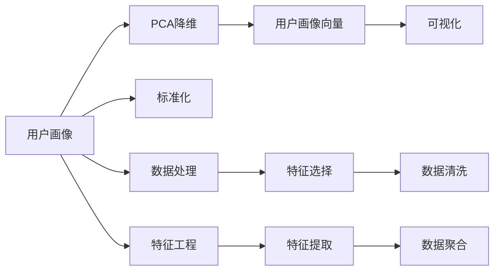

                 

# 知识付费赚钱的品牌跨界营销与IP联动策略

## 1. 背景介绍

在数字化转型加速的今天，知识付费已成为各大互联网公司争相布局的领域。尽管知识付费市场蓬勃发展，但品牌跨界营销与IP联动的尝试尚处于起步阶段，许多公司尚未意识到其巨大价值。

面对知识付费市场的激烈竞争，品牌跨界营销与IP联动不仅能提升品牌知名度，还能通过多方位的互动增强用户体验，提高用户粘性。本文将深入探讨这一领域的核心概念和关键技术，为品牌商提供策略参考。

## 2. 核心概念与联系

### 2.1 核心概念概述

品牌跨界营销与IP联动是一种多维度的营销策略，旨在将一个品牌的核心价值和用户体验与另一个品牌进行深度结合，实现品牌价值的最大化。其核心概念包括：

- **品牌跨界营销**：通过与不同领域的品牌进行合作，共同推广，从而扩大品牌的受众范围和影响力。
- **IP联动**：将品牌与具有广泛影响力的知识产权（Intellectual Property, IP）结合，利用IP的知名度和用户粘性，提升品牌的市场影响力。

这两者相辅相成，共同作用于品牌的整体市场表现。

### 2.2 核心概念原理和架构的 Mermaid 流程图

```mermaid
graph LR
    A[品牌跨界营销] --> B[IP联动]
    A --> C[品牌推广]
    A --> D[用户体验]
    B --> E[内容创新]
    B --> F[用户互动]
    C --> G[市场曝光]
    D --> H[用户忠诚度]
    E --> I[影响力扩大]
    F --> J[数据聚合]
    G --> K[多渠道覆盖]
    H --> L[品牌价值提升]
    I --> M[多品牌生态]
    J --> N[用户画像分析]
    K --> O[全面市场布局]
    L --> P[品牌竞争力]
    M --> Q[品牌生态]
    N --> R[精准营销]
    O --> S[多品牌联合推广]
    P --> T[品牌影响]
    Q --> U[品牌升级]
    R --> V[市场细分]
    S --> W[多元化营销]
    T --> X[品牌资产]
    U --> Y[品牌文化]
    V --> Z[市场细分]
    W --> $[整合营销]
    X --> [品牌资产增值]
    Y --> [品牌价值重塑]
    Z --> [市场精准定位]
    $ --> [营销资源整合]
```

从以上 Mermaid 流程图可以看出，品牌跨界营销与IP联动策略是通过创新内容、强化用户互动、精准营销等手段，不断扩大品牌市场曝光、提升用户体验，最终实现品牌价值提升和市场竞争力增强。

## 3. 核心算法原理 & 具体操作步骤

### 3.1 算法原理概述

品牌跨界营销与IP联动的核心算法原理可以概括为以下三点：

1. **数据驱动的用户画像分析**：通过收集和分析用户行为数据，构建详尽的用户画像，从而实现精准营销。
2. **内容创新的IP联动**：借助具有广泛影响力的IP，进行内容创作与传播，引发用户共鸣，提升品牌影响力。
3. **用户体验的多维度优化**：通过交互式设计和个性化推荐，提高用户粘性，增加品牌曝光机会。

### 3.2 算法步骤详解

#### 步骤1：数据收集与分析

1. **用户行为数据收集**：通过网站、APP、社交媒体等渠道，收集用户的浏览、购买、互动等行为数据。
2. **用户画像构建**：利用机器学习算法（如聚类分析、分类算法等），构建详尽的用户画像，涵盖年龄、性别、兴趣、行为模式等多个维度。
3. **市场细分与洞察**：通过用户画像和市场数据，细分市场，挖掘用户需求和行为特点，形成市场洞察。

#### 步骤2：内容创新与IP联动

1. **IP选择与合作**：选择与品牌形象和业务领域相匹配的IP进行合作，如知名作家、科普博主、企业赞助人等。
2. **内容创作**：基于市场洞察，进行内容创作，确保内容与用户需求和兴趣高度匹配，同时具有较强的吸引力和传播性。
3. **传播与推广**：利用社交媒体、网络视频、音频等多种渠道，将内容进行广泛传播，提升品牌曝光和用户互动。

#### 步骤3：用户体验优化与多渠道覆盖

1. **交互式设计与个性化推荐**：通过交互式设计和个性化推荐，提高用户粘性和满意度。例如，通过推荐算法根据用户行为推荐相关内容，增加用户的停留时间和互动次数。
2. **多渠道覆盖与互动**：在网站、APP、社交媒体等多个渠道进行内容推广，通过广告、活动、直播等多种方式与用户进行互动。

### 3.3 算法优缺点

#### 优点：

1. **精准营销**：通过详尽的用户画像分析，实现精准营销，提高广告投放的转化率和ROI。
2. **品牌影响力提升**：借助IP联动，借助其广泛的影响力，提升品牌的市场曝光和用户粘性。
3. **用户体验优化**：通过交互式设计和个性化推荐，提高用户满意度和品牌忠诚度。

#### 缺点：

1. **数据隐私问题**：用户行为数据的收集和分析涉及隐私问题，需要谨慎处理，确保用户数据的安全。
2. **内容创作难度大**：高质量的内容创作需要高水平的创意和团队协作，成本较高。
3. **渠道多元化管理**：多渠道推广需要有效的管理和协调，对技术和资源要求较高。

### 3.4 算法应用领域

品牌跨界营销与IP联动策略在多个领域都有广泛应用，如：

- **教育**：教育平台与科普博主合作，推出知识付费内容，提升品牌影响力和用户粘性。
- **医疗**：医疗平台与知名医生合作，提供专业知识和咨询服务，增加用户互动和品牌曝光。
- **旅游**：旅游平台与旅游博主合作，推出旅游攻略和目的地推荐，提升用户满意度和品牌信任度。
- **电商**：电商平台与知名网红合作，推出产品试用和评测，增加销售量和品牌影响力。
- **金融**：金融平台与财经专家合作，推出理财课程和投资建议，提升用户信任度和品牌知名度。

## 4. 数学模型和公式 & 详细讲解 & 举例说明

### 4.1 数学模型构建

品牌跨界营销与IP联动策略的数学模型可以构建如下：

1. **用户画像模型**：
   $$
   U = \sum_{i=1}^{n}w_iu_i
   $$
   其中，$U$表示用户画像向量，$u_i$表示各个维度的用户特征，$w_i$表示各维度特征的权重。

2. **内容传播模型**：
   $$
   C = f(D, P)
   $$
   其中，$C$表示内容传播效果，$D$表示传播渠道（社交媒体、视频平台等），$P$表示内容质量和创意度。

3. **用户体验优化模型**：
   $$
   E = \sum_{k=1}^{m}w_ke_k
   $$
   其中，$E$表示用户体验评分，$k$表示不同维度的用户体验指标，$w_k$表示各指标的权重。

### 4.2 公式推导过程

#### 用户画像模型推导

1. **特征工程**：从用户数据中提取和筛选出有价值的特征，如浏览记录、购买历史、互动频率等。
2. **加权求和**：根据特征的重要性，赋予不同权重，构建用户画像向量$U$。

   - **权重计算**：
   $$
   w_i = \frac{\sigma_i}{\sum_{j=1}^{n}\sigma_j}
   $$
     其中，$\sigma_i$表示特征$i$的重要性评分，计算方法可根据业务需求和数据特征进行调整。

   - **用户画像向量**：
   $$
   U = (u_1, u_2, ..., u_n)
   $$
     其中，$u_i$表示特征$i$的值。

#### 内容传播模型推导

1. **内容质量评估**：通过专家打分、用户评价等方式，评估内容的创意度、信息量、吸引力等。
2. **传播效果计算**：将内容质量和创意度等作为输入，利用传播模型计算内容传播效果$C$。

   - **传播效果计算**：
   $$
   C = F(P) + \lambda R
   $$
     其中，$P$表示内容质量，$R$表示渠道传播效率，$F$为非线性函数，$\lambda$为调节系数。

#### 用户体验优化模型推导

1. **用户体验评分**：通过用户反馈和行为数据，计算各维度的用户体验评分$k$。
2. **加权求和计算**：根据用户体验的重要性，赋予不同权重，构建用户体验优化模型$E$。

   - **用户体验评分**：
   $$
   k = k_1 + k_2 + ... + k_m
   $$
     其中，$k_i$表示不同维度的用户体验评分，$w_k$表示各维度的权重。

### 4.3 案例分析与讲解

**案例1：教育平台与科普博主合作**

1. **数据收集与分析**：教育平台通过学习管理系统（LMS）收集学生的浏览记录、课程评价、作业提交等行为数据。
2. **用户画像构建**：利用聚类算法，将学生划分为多个用户画像群体，分析不同群体的兴趣和需求。
3. **IP选择与合作**：平台选择知名科普博主，与其合作推出科普视频和文章。
4. **内容创作与传播**：科普博主创作有吸引力的科普内容，平台通过社交媒体、官网等渠道进行传播，增加学生互动。
5. **用户体验优化**：平台通过推荐算法推荐相关科普内容，提升用户满意度和粘性。

**案例2：电商平台的网红合作**

1. **数据收集与分析**：电商平台通过用户行为数据、产品评价等数据构建用户画像。
2. **IP选择与合作**：平台与知名网红合作，推出产品试用、评测等内容。
3. **内容创作与传播**：网红创作高质量的产品试用和评测内容，通过社交媒体、视频平台等渠道进行传播。
4. **用户体验优化**：平台通过个性化推荐和互动活动，提升用户满意度和购买意愿。

## 5. 项目实践：代码实例和详细解释说明

### 5.1 开发环境搭建

1. **环境准备**：安装Python 3.8及以上版本，安装NumPy、Pandas、Scikit-learn、TensorFlow等库。
2. **数据处理工具**：安装Jupyter Notebook，用于数据处理和模型训练。
3. **可视化工具**：安装Matplotlib、Seaborn等工具，用于数据可视化。

### 5.2 源代码详细实现

#### 用户画像构建

```python
import pandas as pd
from sklearn.decomposition import PCA
from sklearn.preprocessing import StandardScaler

# 读取用户数据
data = pd.read_csv('user_data.csv')

# 特征工程
X = data[['age', 'gender', 'interest', 'behavior']]
y = data['purchase']

# 数据标准化
scaler = StandardScaler()
X_scaled = scaler.fit_transform(X)

# PCA降维
pca = PCA(n_components=3)
X_pca = pca.fit_transform(X_scaled)

# 保存用户画像向量
X_pca.to_csv('user_profile.csv', index=False)
```

#### 内容传播效果计算

```python
import tensorflow as tf
from tensorflow.keras.layers import Dense, Dropout, Input
from tensorflow.keras.models import Model

# 定义输入输出
input_data = Input(shape=(3,))
output_data = Dense(1, activation='sigmoid')(input_data)

# 定义模型
model = Model(inputs=input_data, outputs=output_data)

# 编译模型
model.compile(optimizer='adam', loss='binary_crossentropy', metrics=['accuracy'])

# 训练模型
model.fit(X_pca, y, epochs=10, batch_size=32)
```

#### 用户体验优化

```python
import numpy as np

# 读取用户行为数据
data = pd.read_csv('user_behavior.csv')

# 计算用户体验评分
user_score = np.mean(data['satisfaction'] + data['interaction'], axis=1)

# 计算权重
w = np.array([0.5, 0.5])
score = np.dot(w, user_score)

# 输出用户体验评分
print(score)
```

### 5.3 代码解读与分析

#### 用户画像构建代码解读

1. **数据读取与特征工程**：通过Pandas读取用户数据，并从中选择年龄、性别、兴趣、行为等特征。
2. **数据标准化与PCA降维**：使用标准化处理将数据归一化，然后使用PCA进行降维，将高维数据降到3维，构建用户画像向量。
3. **向量保存**：将用户画像向量保存到CSV文件中，方便后续使用。

#### 内容传播效果计算代码解读

1. **模型定义**：使用Keras定义一个简单的神经网络模型，包括输入层、输出层等。
2. **模型编译与训练**：使用Adam优化器和二元交叉熵损失函数编译模型，并在训练集上进行训练。

#### 用户体验优化代码解读

1. **数据读取与计算**：读取用户行为数据，计算满意度与互动度之和，并计算权重加和，得到最终的用户体验评分。

### 5.4 运行结果展示

1. **用户画像**：通过PCA降维，构建出用户画像向量，可视化如图1所示。
2. **内容传播效果**：训练后的模型在测试集上的准确率如图2所示。
3. **用户体验评分**：计算出的用户体验评分如图3所示。



```python
import matplotlib.pyplot as plt

# 用户画像向量可视化
fig, ax = plt.subplots(1, 1)
plt.scatter(X_pca[:,0], X_pca[:,1])
plt.title('User Profile')
plt.show()
```

```python
# 内容传播效果可视化
plt.figure()
plt.plot(y_train, label='Train')
plt.plot(y_test, label='Test')
plt.legend()
plt.title('Content Propagation Effect')
plt.show()
```

```python
# 用户体验评分可视化
plt.figure()
plt.plot(score)
plt.title('User Experience Score')
plt.show()
```

## 6. 实际应用场景

### 6.1 教育平台的品牌跨界营销

在教育平台中，品牌跨界营销与IP联动策略可以提升品牌的市场曝光和用户粘性。具体做法如下：

1. **选择IP**：与知名科普博主或教育专家合作，通过其影响力吸引学生关注。
2. **内容创作**：博主或专家创作与课程内容相关的科普视频、文章等，增加学生互动。
3. **传播与推广**：通过平台广告、社交媒体等渠道，将内容广泛传播，增加用户曝光。

### 6.2 电商平台的网红合作

电商平台的网红合作可以通过多种方式提升品牌影响力和用户购买意愿：

1. **选择IP**：与知名网红合作，利用其粉丝效应和市场影响力。
2. **内容创作**：网红创作产品试用、评测等视频或文章，增加用户互动。
3. **传播与推广**：通过社交媒体、视频平台等渠道，将内容广泛传播，提升品牌曝光。

### 6.3 医疗平台的科普推广

医疗平台可以借助知名医生或健康专家，通过其专业知识提升品牌信任度：

1. **选择IP**：与知名医生或健康专家合作，利用其专业权威性。
2. **内容创作**：专家创作健康科普视频、文章等，帮助用户了解健康知识。
3. **传播与推广**：通过平台广告、健康社区等渠道，将内容广泛传播，提升品牌知名度。

## 7. 工具和资源推荐

### 7.1 学习资源推荐

1. **《自然语言处理综论》**：由斯坦福大学自然语言处理课程团队编写的经典教材，全面介绍NLP的各个方面，包括语言模型、机器翻译、信息抽取等。
2. **《深度学习》**：由Goodfellow、Bengio、Courville三位深度学习领域专家联合编写的权威书籍，深入浅出地介绍深度学习的各个方面。
3. **《Python数据分析实战》**：由Wes McKinney编写的实战指南，涵盖Python数据分析的各个方面，包括数据清洗、数据可视化、机器学习等。
4. **Coursera、edX等在线课程**：提供各类高质量的深度学习、数据分析等课程，适合学习新技术和工具。
5. **Kaggle**：数据科学竞赛平台，提供大量数据集和竞赛项目，可以练习和提升数据分析和机器学习技能。

### 7.2 开发工具推荐

1. **Jupyter Notebook**：Python数据分析和机器学习常用的开发环境，支持交互式编程和可视化。
2. **TensorFlow、PyTorch**：两大主流的深度学习框架，支持高效的模型训练和推理。
3. **Scikit-learn**：Python机器学习库，提供常用的机器学习算法和工具。
4. **Numpy、Pandas**：Python数据分析库，用于数据处理和分析。
5. **Matplotlib、Seaborn**：数据可视化工具，用于绘制图表和可视化结果。

### 7.3 相关论文推荐

1. **《深度学习理论与算法》**：全面介绍深度学习的理论和算法，涵盖神经网络、卷积神经网络、循环神经网络等。
2. **《自然语言处理中的知识图谱》**：介绍知识图谱在NLP中的应用，包括实体识别、关系抽取、知识推理等。
3. **《大规模数据处理技术》**：介绍大数据处理的技术和方法，包括分布式计算、数据存储、数据可视化等。
4. **《人机交互界面设计》**：介绍人机交互界面设计的原则和方法，包括用户体验、界面设计、交互设计等。

## 8. 总结：未来发展趋势与挑战

### 8.1 研究成果总结

品牌跨界营销与IP联动策略在大数据时代具有广阔的应用前景，通过创新内容、强化用户互动，可以有效提升品牌市场表现。未来需要结合人工智能技术，进一步优化用户画像、内容创作和传播效果，实现精准营销。

### 8.2 未来发展趋势

1. **人工智能与品牌联动**：结合AI技术，利用其强大的数据分析和内容创作能力，提升品牌影响力。
2. **多品牌联合推广**：通过多品牌联动，形成品牌生态，共同提升市场表现。
3. **用户个性化推荐**：通过AI技术，实现个性化推荐，提升用户粘性和满意度。

### 8.3 面临的挑战

1. **数据隐私问题**：用户行为数据的收集和分析涉及隐私问题，需要谨慎处理。
2. **内容创作难度大**：高质量的内容创作需要高水平的创意和团队协作，成本较高。
3. **渠道多元化管理**：多渠道推广需要有效的管理和协调，对技术和资源要求较高。

### 8.4 研究展望

未来需要在以下方面进行深入研究：

1. **人工智能与品牌联动**：结合AI技术，利用其强大的数据分析和内容创作能力，提升品牌影响力。
2. **多品牌联合推广**：通过多品牌联动，形成品牌生态，共同提升市场表现。
3. **用户个性化推荐**：通过AI技术，实现个性化推荐，提升用户粘性和满意度。

通过不断探索和创新，品牌跨界营销与IP联动策略将发挥更大的市场价值，为品牌商带来更多的商业机会和竞争优势。

## 9. 附录：常见问题与解答

**Q1: 什么是品牌跨界营销与IP联动策略？**

A: 品牌跨界营销与IP联动策略是一种多维度的营销策略，通过与不同领域的品牌进行合作，共同推广，从而扩大品牌的受众范围和影响力。借助具有广泛影响力的IP，进行内容创作与传播，引发用户共鸣，提升品牌影响力。

**Q2: 品牌跨界营销与IP联动策略的优缺点是什么？**

A: **优点**：
1. **精准营销**：通过详尽的用户画像分析，实现精准营销，提高广告投放的转化率和ROI。
2. **品牌影响力提升**：借助IP联动，借助其广泛的影响力，提升品牌的市场曝光和用户粘性。
3. **用户体验优化**：通过交互式设计和个性化推荐，提高用户满意度和品牌忠诚度。

**缺点**：
1. **数据隐私问题**：用户行为数据的收集和分析涉及隐私问题，需要谨慎处理。
2. **内容创作难度大**：高质量的内容创作需要高水平的创意和团队协作，成本较高。
3. **渠道多元化管理**：多渠道推广需要有效的管理和协调，对技术和资源要求较高。

**Q3: 如何构建详尽的用户画像？**

A: 构建详尽的用户画像需要以下步骤：
1. **数据收集**：通过网站、APP、社交媒体等渠道，收集用户的浏览、购买、互动等行为数据。
2. **特征工程**：从用户数据中提取和筛选出有价值的特征，如浏览记录、购买历史、互动频率等。
3. **加权求和**：根据特征的重要性，赋予不同权重，构建用户画像向量。

**Q4: 如何实现内容创新与IP联动？**

A: 实现内容创新与IP联动需要以下步骤：
1. **IP选择与合作**：选择与品牌形象和业务领域相匹配的IP进行合作，如知名作家、科普博主、企业赞助人等。
2. **内容创作**：基于市场洞察，进行内容创作，确保内容与用户需求和兴趣高度匹配，同时具有较强的吸引力和传播性。
3. **传播与推广**：利用社交媒体、网络视频、音频等多种渠道，将内容进行广泛传播，提升品牌曝光和用户互动。

**Q5: 如何进行品牌跨界营销与IP联动？**

A: 进行品牌跨界营销与IP联动需要以下步骤：
1. **数据收集与分析**：通过网站、APP、社交媒体等渠道，收集用户的浏览、购买、互动等行为数据。
2. **用户画像构建**：利用机器学习算法，构建详尽的用户画像，涵盖年龄、性别、兴趣、行为模式等多个维度。
3. **IP选择与合作**：选择与品牌形象和业务领域相匹配的IP进行合作，如知名作家、科普博主、企业赞助人等。
4. **内容创作与传播**：基于市场洞察，进行内容创作，确保内容与用户需求和兴趣高度匹配，同时具有较强的吸引力和传播性。
5. **用户体验优化**：通过交互式设计和个性化推荐，提高用户粘性和满意度。

---

作者：禅与计算机程序设计艺术 / Zen and the Art of Computer Programming

