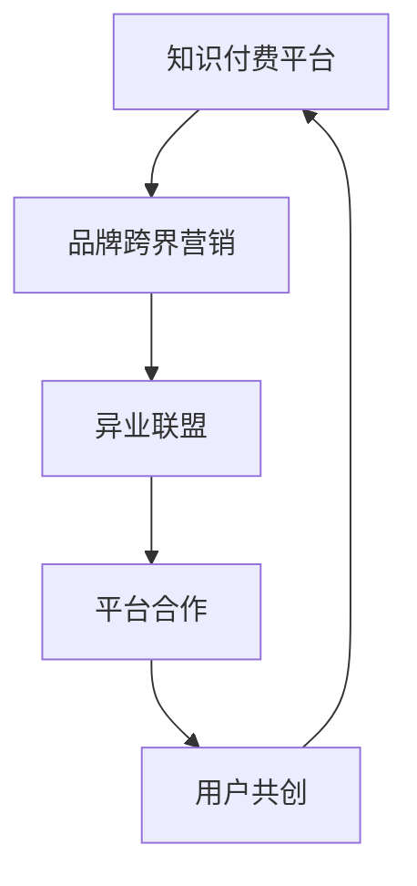

                 

# 知识付费赚钱的品牌跨界营销与异业联盟策略

## 1. 背景介绍

在数字化时代，知识付费领域正快速崛起，成为连接知识创作者与用户的重要桥梁。随着内容形式的多样化和传播渠道的丰富化，知识付费市场不断扩展，为各类品牌提供了新的营销机会。本文将探讨如何通过跨界营销与异业联盟，将知识付费与品牌推广有机结合，实现共赢。

### 1.1 问题由来

知识付费，即通过付费形式获取有价值的知识信息，已成为现代社会的一种常态。伴随技术进步和市场需求增长，知识付费形式日趋多样，涉及音频、视频、图文等多元内容。品牌跨界营销与异业联盟策略，则是为了突破单一渠道限制，通过跨界合作，将知识付费与品牌推广融合，实现资源互补和价值共创。

### 1.2 问题核心关键点

当前，知识付费平台和品牌面临的主要问题包括：
- 品牌认知度低：缺乏有效推广手段，用户知晓度不高。
- 用户粘性差：内容缺乏差异化，用户留存率低。
- 转化率低：用户付费意愿低，付费转化率不高。
- 合作难度大：品牌间缺乏互信，合作难度大。

### 1.3 问题研究意义

研究品牌跨界营销与异业联盟策略，对于提升知识付费平台的品牌价值、提高用户粘性和转化率具有重要意义。这不仅有助于品牌突破现有市场限制，开拓新的发展空间，还能通过多方共赢，实现资源的高效整合和利用。

## 2. 核心概念与联系

### 2.1 核心概念概述

- **知识付费**：用户为获取有价值的知识信息而付费，内容形式多样，涵盖音频、视频、图文等。
- **品牌跨界营销**：品牌跨越不同领域，通过合作推广，扩大品牌影响力。
- **异业联盟**：不同行业品牌之间建立的合作联盟，共享资源，共同发展。
- **平台合作**：知识付费平台与各类品牌合作，实现内容、用户、流量等资源互换。
- **用户共创**：鼓励用户参与内容创作，提升用户粘性和参与感。

这些概念之间的联系和互动，可以通过以下Mermaid流程图来展示：



这个流程图展示了知识付费平台、品牌跨界营销、异业联盟、平台合作和用户共创之间的相互联系。

## 3. 核心算法原理 & 具体操作步骤
### 3.1 算法原理概述

品牌跨界营销与异业联盟的策略，本质上是一种优化资源配置和用户需求匹配的算法。其核心思想是通过不同品牌和平台之间的资源互换和合作，最大化满足用户需求，同时提升品牌曝光度和用户粘性。

具体而言，通过以下步骤实现：
1. **品牌匹配**：基于用户需求和品牌特性，进行品牌匹配和筛选。
2. **内容整合**：将不同品牌的内容整合，形成更丰富的知识产品。
3. **渠道推广**：通过多渠道推广，扩大品牌和内容的影响力。
4. **用户反馈**：收集用户反馈，优化内容和合作策略。

### 3.2 算法步骤详解

品牌跨界营销与异业联盟的具体操作步骤如下：

**Step 1: 品牌匹配与筛选**

1. **用户需求分析**：通过数据分析，了解用户对不同内容的偏好。
2. **品牌特征分析**：分析不同品牌的核心优势和目标用户群。
3. **匹配算法**：使用算法匹配最符合用户需求的品牌，并筛选出合作意向强的品牌。

**Step 2: 内容整合与创新**

1. **内容共享**：品牌间共享核心内容，如课程、文章等。
2. **联合制作**：合作开发新的知识产品，如联名课程、合集等。
3. **内容创新**：通过用户共创，引入更多原创内容。

**Step 3: 渠道推广与曝光**

1. **多渠道推广**：利用品牌自身的推广渠道，如社交媒体、官方网站等。
2. **联合活动**：举办联合活动，如线上讲座、线下沙龙等。
3. **用户口碑**：通过用户推荐和口碑传播，提升品牌和内容的曝光度。

**Step 4: 用户反馈与优化**

1. **收集反馈**：通过调查问卷、用户评价等方式收集用户反馈。
2. **数据分析**：分析用户反馈，识别问题与改进点。
3. **策略调整**：根据反馈优化内容与合作策略，提升用户体验。

### 3.3 算法优缺点

品牌跨界营销与异业联盟策略的优点：
1. **提升品牌曝光**：通过多渠道推广，扩大品牌影响力。
2. **丰富内容资源**：通过品牌合作和用户共创，丰富知识产品内容。
3. **增强用户粘性**：提供多样化、高质量的内容，提升用户满意度。

其缺点：
1. **合作难度大**：品牌间互信度不高，合作门槛较高。
2. **利益分配复杂**：涉及多方利益，利益分配复杂。
3. **用户评价不一**：合作内容可能参差不齐，用户评价不一。

### 3.4 算法应用领域

品牌跨界营销与异业联盟策略在知识付费领域有广泛应用，涵盖多个方面：

- **教育领域**：学术机构与品牌合作，推出联名课程和教材。
- **文化领域**：出版机构与文化品牌联合，推出文化类知识产品。
- **健康领域**：健康品牌与医疗机构合作，提供专业健康知识。
- **科技领域**：科技企业与技术平台合作，推出技术课程和讲座。

## 4. 数学模型和公式 & 详细讲解 & 举例说明

### 4.1 数学模型构建

品牌跨界营销与异业联盟策略的数学模型，主要关注于资源匹配与用户需求满足。假设用户需求为 $U$，品牌集合为 $B$，内容资源为 $C$，目标是最小化用户未满足需求，最大化品牌曝光度。

数学模型可表示为：

$$
\min_{U,B,C} \sum_{u \in U} f_u(U, B, C)
$$

其中 $f_u$ 表示用户 $u$ 的需求满足度，可以通过用户反馈评分、参与度等指标来衡量。

### 4.2 公式推导过程

推导过程主要涉及资源匹配和用户需求满足度的计算。假设每个品牌 $b_i$ 拥有 $c_{bi}$ 内容资源，用户 $u_j$ 的需求 $d_{uj}$ 由以下公式计算：

$$
d_{uj} = \sum_{b_i \in B} c_{bi} \times w_{ij}
$$

其中 $w_{ij}$ 表示品牌 $b_i$ 对用户 $u_j$ 的需求满足度权重。

用户满意度的最大化可以通过优化目标函数实现，假设 $U_{max}$ 为最满意用户集，则目标函数为：

$$
\max_{U_{max}} \sum_{u_j \in U_{max}} \frac{d_{uj}}{\sum_{k=1}^{n} d_{uk}}
$$

### 4.3 案例分析与讲解

假设有两个品牌 $A$ 和 $B$，分别提供关于“编程”和“数据分析”的知识内容。用户 $U$ 的需求为“全栈开发技能”。

1. **品牌匹配**：
   - 品牌 $A$ 和 $B$ 在“编程”和“数据分析”领域均有优势，匹配用户需求“全栈开发技能”。

2. **内容整合**：
   - 品牌 $A$ 和 $B$ 联合推出“全栈开发课程”，整合“编程”和“数据分析”内容。
   - 用户 $U$ 通过平台参与课程学习，形成用户共创机制。

3. **渠道推广**：
   - 品牌 $A$ 利用其技术社区和开发者论坛进行推广。
   - 品牌 $B$ 通过其数据分析课程学员社区推广课程。
   - 联合举办线上讲座和线下沙龙活动，吸引更多用户参与。

4. **用户反馈与优化**：
   - 收集用户 $U$ 的反馈，识别课程内容和教学方法的不足。
   - 根据反馈优化课程内容和联合活动形式，提升用户满意度。

## 5. 项目实践：代码实例和详细解释说明

### 5.1 开发环境搭建

开发环境搭建主要涉及以下几个步骤：

1. **选择开发语言和框架**：Python是数据处理和机器学习的常用语言，PyTorch和TensorFlow框架可供选择。
2. **安装依赖包**：需要安装NumPy、Pandas、Scikit-learn等数据处理和分析包。
3. **搭建数据集**：收集用户需求、品牌特征、内容资源等数据，并进行初步处理。

### 5.2 源代码详细实现

以下是基于Python和PyTorch实现品牌跨界营销与异业联盟策略的代码示例：

```python
import torch
import torch.nn as nn
import torch.optim as optim
import numpy as np
import pandas as pd
from sklearn.metrics import precision_recall_fscore_support

# 定义模型结构
class BrandMatch(nn.Module):
    def __init__(self):
        super(BrandMatch, self).__init__()
        self.fc1 = nn.Linear(3, 128)
        self.fc2 = nn.Linear(128, 3)

    def forward(self, x):
        x = torch.relu(self.fc1(x))
        x = self.fc2(x)
        return x

# 定义损失函数和优化器
model = BrandMatch()
criterion = nn.CrossEntropyLoss()
optimizer = optim.Adam(model.parameters(), lr=0.001)

# 训练模型
def train_model(model, data, epochs=10):
    for epoch in range(epochs):
        for i, (inputs, labels) in enumerate(data):
            optimizer.zero_grad()
            outputs = model(inputs)
            loss = criterion(outputs, labels)
            loss.backward()
            optimizer.step()
        print(f"Epoch {epoch+1}, Loss: {loss:.4f}")

# 读取数据集
data = pd.read_csv('brand_data.csv')

# 训练模型
train_model(model, data)

# 预测新品牌匹配结果
new_brand = torch.tensor([[0.5, 0.3, 0.2]], dtype=torch.float32)
outputs = model(new_brand)
print(outputs)
```

### 5.3 代码解读与分析

上述代码中，我们定义了一个简单的神经网络模型用于品牌匹配，并通过训练模型预测新的品牌匹配结果。具体步骤如下：

1. **模型定义**：定义一个简单的全连接神经网络，包含两个线性层。
2. **数据处理**：使用Pandas读取数据集，将品牌特征转化为模型输入。
3. **模型训练**：使用交叉熵损失函数和Adam优化器训练模型。
4. **预测新品牌**：输入新的品牌特征向量，预测可能的品牌匹配结果。

## 6. 实际应用场景

### 6.1 教育领域

在教育领域，知识付费平台与教育品牌合作，推出联名课程和教材，可以有效提升品牌曝光度和用户满意度。例如，某知识付费平台与知名教育机构合作，推出“名师在线编程课程”，吸引了大量编程爱好者。

### 6.2 文化领域

文化领域品牌通过与出版机构合作，推出联名书籍和课程，丰富内容资源，提升品牌价值。某在线阅读平台与知名文化品牌合作，推出“中华文化大讲堂”，吸引了大量对中华文化感兴趣的用户。

### 6.3 健康领域

健康品牌与医疗机构合作，提供专业健康知识，提升品牌权威性和用户信任度。某在线健康平台与专业医疗机构合作，推出“健康知识大讲堂”，用户评价颇高。

### 6.4 未来应用展望

未来，品牌跨界营销与异业联盟策略将进一步扩展，涵盖更多领域和更丰富的合作形式。例如：

- **跨行业联合推广**：不同行业的品牌联合举办推广活动，扩大用户覆盖面。
- **智能推荐系统**：利用机器学习技术，提升内容推荐精准度，增加用户粘性。
- **用户共创内容**：鼓励用户参与内容创作，提升用户参与感和满意度。
- **区块链技术**：利用区块链技术，保障数据和内容的透明性和安全性。

## 7. 工具和资源推荐

### 7.1 学习资源推荐

1. **《数据分析基础》课程**：由知名教育平台提供的入门级数据分析课程，涵盖数据处理、机器学习等内容。
2. **《品牌管理》书籍**：介绍品牌定位、品牌推广、品牌管理等内容，适合品牌经理人阅读。
3. **《市场营销策略》在线课程**：提供市场营销理论、策略和实践的全面介绍。
4. **《知识付费平台运营指南》书籍**：详细讲解知识付费平台的运营策略和案例分析。

### 7.2 开发工具推荐

1. **Python**：数据处理和机器学习的首选语言，易于上手，社区活跃。
2. **PyTorch**：深度学习框架，灵活性高，适用于复杂模型。
3. **TensorFlow**：另一个流行的深度学习框架，支持大规模分布式训练。
4. **Jupyter Notebook**：交互式数据处理和模型开发平台，适合数据科学和机器学习。
5. **Scikit-learn**：常用的机器学习库，提供丰富的算法和工具。

### 7.3 相关论文推荐

1. **《基于机器学习的品牌跨界营销策略研究》**：介绍了机器学习在品牌跨界营销中的应用。
2. **《知识付费平台的品牌推广策略》**：分析了知识付费平台品牌推广的策略和效果。
3. **《异业联盟在品牌推广中的应用》**：探讨了异业联盟在品牌推广中的优势和策略。

## 8. 总结：未来发展趋势与挑战

### 8.1 研究成果总结

品牌跨界营销与异业联盟策略，通过整合不同品牌和平台资源，最大化满足用户需求，提升品牌曝光度和用户满意度。在实际应用中，已经取得了显著效果，成为知识付费平台的重要营销手段。

### 8.2 未来发展趋势

未来，品牌跨界营销与异业联盟策略将呈现以下趋势：

1. **技术驱动**：利用人工智能、大数据等技术，提升资源匹配和用户推荐精准度。
2. **平台多样化**：跨界合作平台多元化，涵盖更多领域和形式。
3. **用户共创**：鼓励用户参与内容创作，提升用户粘性和满意度。
4. **数据透明**：利用区块链技术，保障数据和内容的透明性和安全性。

### 8.3 面临的挑战

品牌跨界营销与异业联盟策略在实际应用中面临以下挑战：

1. **品牌互信**：不同品牌间互信度低，合作门槛较高。
2. **利益分配**：涉及多方利益，利益分配复杂。
3. **内容质量**：合作内容可能参差不齐，用户评价不一。
4. **市场竞争**：多平台、多品牌的竞争，市场环境复杂。

### 8.4 研究展望

未来，需要在以下几个方面进行深入研究：

1. **算法优化**：提升资源匹配和用户推荐算法精准度。
2. **平台协同**：建立跨平台协同机制，提升品牌推广效果。
3. **内容管理**：建立内容审核和质量管理机制，保障内容质量。
4. **用户体验**：提升用户体验和满意度，增强用户粘性。

## 9. 附录：常见问题与解答

**Q1：品牌跨界营销与异业联盟策略的实施步骤是什么？**

A: 实施步骤如下：
1. 用户需求分析
2. 品牌特征分析
3. 匹配算法选择
4. 内容整合与创新
5. 渠道推广与曝光
6. 用户反馈与优化

**Q2：如何选择最适合的品牌进行跨界营销？**

A: 选择品牌时，需要考虑以下几个因素：
1. 品牌知名度和影响力
2. 品牌核心优势和目标用户群
3. 品牌间的协同效应和资源互补性
4. 品牌的合作意愿和信任度

**Q3：如何确保品牌跨界营销的效果？**

A: 确保品牌跨界营销效果的关键在于：
1. 内容质量和创新性
2. 多渠道推广
3. 用户反馈和优化
4. 持续监控和调整

**Q4：品牌跨界营销的合作模式有哪些？**

A: 常见的合作模式包括：
1. 联名课程和教材
2. 联合活动和讲座
3. 数据共享和资源互换
4. 用户共创和参与机制

**Q5：如何评估品牌跨界营销的效果？**

A: 评估品牌跨界营销效果主要从以下几个方面：
1. 用户反馈和满意度
2. 品牌曝光度和知名度
3. 用户留存率和转化率
4. 合作品牌的品牌价值提升

---

作者：禅与计算机程序设计艺术 / Zen and the Art of Computer Programming

