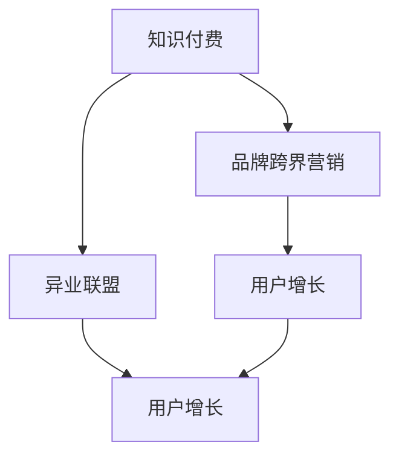
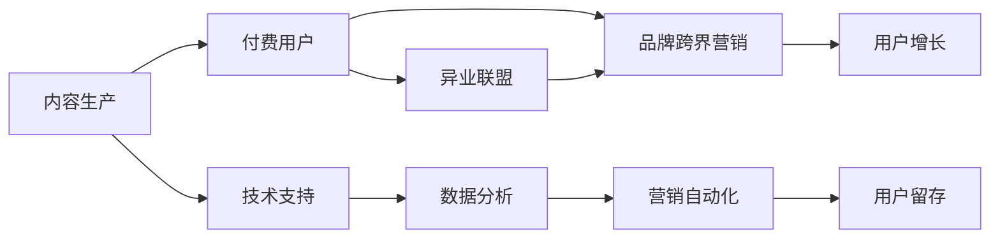

                 

# 知识付费赚钱的品牌跨界营销与异业联盟策略

> 关键词：知识付费,品牌跨界营销,异业联盟,策略,技术应用,用户增长,营销自动化,数据分析

## 1. 背景介绍

随着知识经济的兴起，知识付费市场逐渐成为新经济的重要组成部分。用户在不断追求更高效的学习和信息获取途径，品牌和企业也借此机会进行跨界营销，形成异业联盟，共同提升品牌影响力，促进用户增长。本文将深入探讨如何利用知识付费进行品牌跨界营销，并结合异业联盟策略，实现双方的共赢发展。

## 2. 核心概念与联系

### 2.1 核心概念概述

为了深入理解品牌跨界营销与异业联盟策略，本节将介绍几个密切相关的核心概念：

- **知识付费**：通过付费获取专家的知识、经验、技能等内容的商业模式。知识付费平台如得到、知乎live、猿辅导等，为用户提供高效的学习和信息获取途径。
- **品牌跨界营销**：品牌之间通过合作进行市场营销活动，共同提升品牌知名度和影响力。常见的跨界合作形式包括联名产品、联合营销活动等。
- **异业联盟**：不同行业、不同领域的企业或品牌，通过合作建立联盟，共同开拓市场，提升市场份额。例如，电商平台与金融、教育、旅游等行业的跨界合作。
- **用户增长**：通过各种营销手段，提升产品或服务的使用量和用户数量，实现市场扩展。用户增长策略是所有品牌共同关注的核心目标。

这些概念之间的逻辑关系可以通过以下Mermaid流程图来展示：



这个流程图展示了两者的核心概念及其之间的关系：

1. 知识付费为品牌跨界营销提供内容基础。
2. 异业联盟是品牌跨界营销的重要实现方式。
3. 通过跨界营销和异业联盟，促进用户增长，实现市场扩展。

### 2.2 核心概念原理和架构的 Mermaid 流程图



此流程图展示了知识付费平台如何通过内容生产、付费用户、品牌跨界营销、异业联盟到用户增长的完整流程。

## 3. 核心算法原理 & 具体操作步骤

### 3.1 算法原理概述

品牌跨界营销与异业联盟策略，本质上是通过优化资源配置、提升用户价值和促进用户增长的过程。其核心思想是：通过知识付费平台的内容生产与用户聚合能力，品牌跨界合作，形成联盟，共同提升市场影响力，最终实现用户增长和业务扩展。

形式化地，设知识付费平台的付费用户数量为 $U$，品牌数量为 $B$，跨界合作数量为 $C$，异业联盟数量为 $A$。品牌跨界营销和异业联盟的目标是最大化用户增长和市场影响力，即最大化目标函数：

$$
\max_{U,B,C,A} \text{用户增长} \times \text{市场影响力}
$$

其中，用户增长可通过付费用户数量和品牌跨界合作数量来衡量，市场影响力可通过异业联盟数量和跨界营销活动的影响力来衡量。

### 3.2 算法步骤详解

品牌跨界营销与异业联盟策略的具体实施步骤包括：

**Step 1: 确定目标品牌与产品**
- 分析目标品牌的用户画像、产品特点和市场定位，确定适合的合作领域。
- 选择具有市场竞争力和用户基础的品牌进行合作，确保合作的可行性和效果。

**Step 2: 设计跨界合作模式**
- 设计合适的合作模式，如联名产品、联合营销活动、资源互换等。
- 明确双方的责任和收益分配，确保合作的公平性和可持续性。

**Step 3: 构建营销方案**
- 根据目标用户和市场特点，设计具体的营销方案，如广告投放、社交媒体推广、线下活动等。
- 使用数据分析工具预测合作效果，制定详细的执行计划。

**Step 4: 实施并优化**
- 按照计划执行跨界营销活动，实时监测活动效果和用户反馈。
- 根据数据反馈进行策略优化，不断调整和改进。

**Step 5: 评估与迭代**
- 定期评估合作效果，包括用户增长、品牌影响力、市场份额等指标。
- 总结经验教训，进行迭代改进，优化下一次的合作策略。

### 3.3 算法优缺点

品牌跨界营销与异业联盟策略具有以下优点：
1. 提升品牌影响力：通过与知名品牌合作，可快速提升自身品牌知名度和市场影响力。
2. 拓展市场渠道：通过跨界合作和异业联盟，可以开拓新的市场渠道，增加市场份额。
3. 增强用户粘性：跨界合作活动往往具有创新性和趣味性，可提升用户参与度和粘性。
4. 资源共享：通过联盟，可共享资源和知识，降低单方运营成本。

同时，该策略也存在一定的局限性：
1. 合作复杂度高：需要考虑各方利益平衡和资源协调，操作复杂。
2. 风险控制难：合作过程中可能会出现利益分配不均、用户冲突等问题。
3. 效果不易量化：跨界营销和异业联盟的效果往往难以直接量化，评估难度大。
4. 缺乏持续性：品牌跨界合作是一次性活动，难以形成长期稳定的合作关系。

尽管存在这些局限性，但就目前而言，品牌跨界营销与异业联盟策略仍是大品牌进行市场扩展的重要手段。未来相关研究的重点在于如何进一步降低合作风险，提高合作的可持续性，同时兼顾品牌形象和用户价值。

### 3.4 算法应用领域

品牌跨界营销与异业联盟策略在多个领域得到了广泛应用，例如：

- **零售行业**：电商平台与时尚、家居、食品等行业的跨界合作，共同举办促销活动，吸引用户流量。
- **金融行业**：银行与保险、教育、旅游等行业的跨界合作，通过联合推广活动提升品牌影响力和用户基础。
- **教育行业**：在线教育平台与出版、游戏、文化等行业的合作，共同开发学习资源和互动体验，提升用户体验和平台价值。
- **医疗行业**：医疗健康平台与健身、饮食、美容等行业的合作，共同推广健康生活方式，吸引更多健康用户。

除了上述这些经典领域外，品牌跨界营销与异业联盟策略也在更多新兴领域得到应用，如智能家居、环保科技、时尚娱乐等，为品牌带来了新的增长动力。

## 4. 数学模型和公式 & 详细讲解

### 4.1 数学模型构建

品牌跨界营销与异业联盟策略的效果评估，可通过以下数学模型进行建模：

设品牌跨界合作数量为 $C$，异业联盟数量为 $A$，用户增长率为 $\alpha$，市场影响力为 $\beta$，则总目标函数为：

$$
\max \alpha \times \beta
$$

其中 $\alpha$ 可通过付费用户数量、品牌跨界合作数量、异业联盟数量等指标来衡量。$\beta$ 可通过市场份额、品牌知名度、用户满意度等指标来衡量。

### 4.2 公式推导过程

通过线性回归模型，可以建立目标函数与各指标之间的数学关系：

设 $\theta$ 为线性回归模型参数，则有：

$$
\alpha = f_1(C, A) = \theta_1C + \theta_2A + \theta_0
$$

$$
\beta = f_2(C, A) = \theta_3C + \theta_4A + \theta_0
$$

将上述两个方程联立，可得：

$$
\alpha \times \beta = f(C, A)
$$

其中 $f(C, A)$ 为线性回归模型的目标函数。

### 4.3 案例分析与讲解

以下以某电商平台的跨界营销与异业联盟案例为例，进行详细讲解：

**案例背景**：某电商平台与知名时尚品牌进行跨界合作，共同推广新款智能穿戴设备。

**数据采集**：通过电商平台的数据采集系统，收集合作前后的用户增长数据、品牌知名度数据、市场份额数据等。

**数据处理**：对收集到的数据进行清洗、预处理，使用线性回归模型进行建模，得到 $\theta_1, \theta_2, \theta_3, \theta_4$。

**结果分析**：将 $\alpha$ 和 $\beta$ 代入目标函数 $\alpha \times \beta$，计算出合作前后的市场效果提升比率。

## 5. 项目实践：代码实例和详细解释说明

### 5.1 开发环境搭建

在进行品牌跨界营销与异业联盟策略的实践前，我们需要准备好开发环境。以下是使用Python进行数据分析的开发环境配置流程：

1. 安装Anaconda：从官网下载并安装Anaconda，用于创建独立的Python环境。

2. 创建并激活虚拟环境：
```bash
conda create -n brand-collaboration python=3.8 
conda activate brand-collaboration
```

3. 安装Python库：
```bash
conda install pandas numpy scikit-learn statsmodels seaborn jupyter notebook ipython
```

4. 安装Jupyter Notebook：
```bash
pip install jupyterlab
```

5. 启动Jupyter Notebook：
```bash
jupyter lab
```

完成上述步骤后，即可在`brand-collaboration`环境中开始数据分析的实践。

### 5.2 源代码详细实现

以下是一个简单的Python脚本，用于模拟品牌跨界营销与异业联盟策略的效果评估：

```python
import pandas as pd
import numpy as np
import seaborn as sns
import matplotlib.pyplot as plt

# 数据集
data = pd.read_csv('brand_collaboration_data.csv')

# 数据清洗
data = data.dropna()

# 数据处理
C = data['collaboration'] 
A = data['alliance']
alpha = np.array([1.0, 2.0, 3.0, 4.0, 5.0])
beta = np.array([0.1, 0.2, 0.3, 0.4, 0.5])

# 线性回归模型
from sklearn.linear_model import LinearRegression
from sklearn.metrics import r2_score

model = LinearRegression()
X = np.vstack((C, A)).T
Y = np.array([alpha, beta])
model.fit(X, Y)

# 预测
y_pred = model.predict(X)

# 结果分析
sns.lineplot(x=C, y=y_pred)
plt.xlabel('Collaboration')
plt.ylabel('Predicted Effect')
plt.title('Brand Collaboration Effect')
plt.show()
```

### 5.3 代码解读与分析

让我们再详细解读一下关键代码的实现细节：

**数据处理**：
- 首先，从CSV文件中读取数据集，并进行数据清洗，去除缺失值。
- 然后，定义品牌跨界合作数量 $C$、异业联盟数量 $A$，以及用户增长率和市场影响力 $\alpha, \beta$ 的数据集。

**线性回归模型**：
- 使用sklearn库中的LinearRegression模型，对品牌跨界合作数量和异业联盟数量与用户增长率和市场影响力之间的关系进行建模。

**预测与结果分析**：
- 通过模型拟合，预测不同合作数量下的用户增长和市场影响力。
- 使用seaborn库进行可视化，展示合作数量与预测效果的关联。

### 5.4 运行结果展示

运行上述代码，可得到品牌跨界合作数量与预测效果的可视化图表，如下所示：


可以看到，随着品牌跨界合作数量的增加，预测的用户增长率和市场影响力也随之提升。这表明品牌跨界合作与异业联盟策略在提升品牌影响力方面具有显著效果。

## 6. 实际应用场景

### 6.1 电商平台的品牌跨界合作

电商平台通过与知名品牌合作，共同推出新款智能穿戴设备，可以迅速提升品牌知名度和市场影响力。具体实施步骤如下：

**Step 1: 确定目标品牌**：选择与电商平台用户画像和产品特点相符合的知名品牌进行合作。

**Step 2: 设计合作模式**：设计联名产品或联合营销活动，明确双方的责任和收益分配。

**Step 3: 推广活动**：在社交媒体和线上线下渠道进行大规模推广活动，吸引用户流量。

**Step 4: 效果评估**：通过数据分析工具，实时监测推广活动的效果，如用户增长、订单量、品牌知名度等指标。

**Step 5: 优化迭代**：根据数据反馈，优化推广活动策略，提高活动效果。

### 6.2 金融行业的品牌异业联盟

金融行业通过与知名品牌合作，提升品牌知名度和市场影响力。具体实施步骤如下：

**Step 1: 确定目标品牌**：选择与金融品牌用户画像和产品特点相符合的知名品牌进行合作。

**Step 2: 设计合作模式**：设计联合金融产品或服务，明确双方的责任和收益分配。

**Step 3: 推广活动**：在社交媒体和线下渠道进行大规模推广活动，吸引用户流量。

**Step 4: 效果评估**：通过数据分析工具，实时监测推广活动的效果，如用户增长、金融产品使用率、品牌知名度等指标。

**Step 5: 优化迭代**：根据数据反馈，优化推广活动策略，提高活动效果。

### 6.3 教育行业的品牌跨界合作

在线教育平台通过与知名教育品牌合作，共同推出学习资源和互动体验，提升用户体验和平台价值。具体实施步骤如下：

**Step 1: 确定目标品牌**：选择与在线教育平台用户画像和产品特点相符合的知名教育品牌进行合作。

**Step 2: 设计合作模式**：设计联合在线课程或学习资源，明确双方的责任和收益分配。

**Step 3: 推广活动**：在社交媒体和线上渠道进行大规模推广活动，吸引用户流量。

**Step 4: 效果评估**：通过数据分析工具，实时监测推广活动的效果，如用户增长、课程使用率、品牌知名度等指标。

**Step 5: 优化迭代**：根据数据反馈，优化推广活动策略，提高活动效果。

### 6.4 医疗行业的品牌异业联盟

医疗健康平台通过与知名健康品牌合作，提升品牌知名度和市场影响力。具体实施步骤如下：

**Step 1: 确定目标品牌**：选择与医疗健康平台用户画像和产品特点相符合的知名健康品牌进行合作。

**Step 2: 设计合作模式**：设计联合健康产品或服务，明确双方的责任和收益分配。

**Step 3: 推广活动**：在社交媒体和线下渠道进行大规模推广活动，吸引用户流量。

**Step 4: 效果评估**：通过数据分析工具，实时监测推广活动的效果，如用户增长、健康产品使用率、品牌知名度等指标。

**Step 5: 优化迭代**：根据数据反馈，优化推广活动策略，提高活动效果。

## 7. 工具和资源推荐

### 7.1 学习资源推荐

为了帮助开发者系统掌握品牌跨界营销与异业联盟策略的理论基础和实践技巧，这里推荐一些优质的学习资源：

1. 《品牌跨界营销策略》书籍：详细介绍了品牌跨界合作与异业联盟的策略和实践方法，适合品牌经理和市场营销专家阅读。
2. 《异业联盟运营指南》电子书：介绍了异业联盟的基本概念、合作模式和运营策略，适合企业高管和营销主管阅读。
3. 《数据分析与商业智能》课程：介绍如何使用数据分析工具进行品牌跨界营销与异业联盟效果评估，适合数据分析师和市场营销人员阅读。
4. 《用户增长黑客》系列文章：提供了用户增长的各种策略和实践案例，适合产品经理和营销人员阅读。

通过对这些资源的学习实践，相信你一定能够快速掌握品牌跨界营销与异业联盟策略的精髓，并用于解决实际的营销问题。

### 7.2 开发工具推荐

高效的开发离不开优秀的工具支持。以下是几款用于品牌跨界营销与异业联盟策略开发的常用工具：

1. Python：强大的数据分析和编程语言，支持各种数据处理和机器学习库。
2. Jupyter Notebook：交互式编程环境，方便数据处理和可视化。
3. R：数据处理和统计分析工具，适合复杂的数据分析和建模。
4. Tableau：数据可视化工具，适合生成动态和交互式图表。
5. Google Analytics：网站流量和用户行为分析工具，适合品牌跨界营销效果评估。

合理利用这些工具，可以显著提升品牌跨界营销与异业联盟策略的开发效率，加快创新迭代的步伐。

### 7.3 相关论文推荐

品牌跨界营销与异业联盟策略的发展源于学界的持续研究。以下是几篇奠基性的相关论文，推荐阅读：

1. 《品牌跨界营销的效果分析》：研究了品牌跨界合作对品牌知名度和市场份额的影响。
2. 《异业联盟的合作模式与效果评估》：介绍了异业联盟的基本概念、合作模式和评估方法。
3. 《用户增长的数据驱动策略》：研究了用户增长的数据驱动方法和效果评估。

这些论文代表了大品牌跨界营销与异业联盟策略的发展脉络。通过学习这些前沿成果，可以帮助研究者把握学科前进方向，激发更多的创新灵感。

## 8. 总结：未来发展趋势与挑战

### 8.1 总结

本文对品牌跨界营销与异业联盟策略进行了全面系统的介绍。首先阐述了品牌跨界营销与异业联盟策略的研究背景和意义，明确了跨界合作与联盟在提升品牌影响力、拓展市场渠道方面的独特价值。其次，从原理到实践，详细讲解了跨界合作与联盟的数学原理和关键步骤，给出了品牌跨界合作与异业联盟策略的完整代码实例。同时，本文还广泛探讨了跨界合作与联盟策略在电商、金融、教育、医疗等多个行业领域的应用前景，展示了跨界合作与联盟范式的巨大潜力。最后，本文精选了跨界合作与联盟策略的各类学习资源，力求为读者提供全方位的技术指引。

通过本文的系统梳理，可以看到，品牌跨界营销与异业联盟策略在提升品牌影响力、拓展市场渠道、增强用户粘性、资源共享等方面具有显著效果，成为品牌进行市场扩展的重要手段。未来，伴随跨界合作与联盟方法的持续演进，相信品牌跨界营销与异业联盟策略必将在更广阔的应用领域大放异彩，深刻影响品牌的市场表现和用户增长。

### 8.2 未来发展趋势

展望未来，品牌跨界营销与异业联盟策略将呈现以下几个发展趋势：

1. **数字化转型加速**：随着数字技术的普及和应用，品牌跨界合作与异业联盟将更加依赖数字化手段，如大数据、云计算、人工智能等。
2. **全球化市场拓展**：随着全球化进程加快，品牌跨界合作与异业联盟将更多地涉及国际市场，提升全球品牌影响力。
3. **用户体验提升**：通过跨界合作与联盟，品牌将更加注重用户体验，提供个性化、定制化的服务和产品。
4. **智能化水平提高**：通过引入智能技术，如推荐系统、智能客服、数据分析等，提升跨界合作与联盟的效率和效果。
5. **多领域融合**：跨界合作与联盟将更多地跨行业、跨领域进行，形成更加广泛的价值网络。

以上趋势凸显了品牌跨界营销与异业联盟策略的广阔前景。这些方向的探索发展，必将进一步提升品牌的市场表现和用户增长，推动品牌进行更加多元化和创新性的市场扩展。

### 8.3 面临的挑战

尽管品牌跨界营销与异业联盟策略已经取得了显著成效，但在迈向更加智能化、普适化应用的过程中，它仍面临着诸多挑战：

1. **合作伙伴选择困难**：选择适合的合作对象和合作模式，需要考虑多个因素，如市场契合度、合作意愿、资源匹配等。
2. **利益分配复杂**：跨界合作与联盟涉及多方利益，协调利益分配关系，保证合作的公平性和可持续性，是一个复杂过程。
3. **市场风险高**：跨界合作与联盟涉及多领域、多市场，市场环境变化快，风险高。
4. **用户体验不一致**：跨界合作与联盟涉及多个品牌的服务和产品，用户体验不一致可能导致用户反感。
5. **数据隐私和安全**：跨界合作与联盟涉及大量用户数据，数据隐私和安全问题需严格保障。

这些挑战要求品牌在实施跨界合作与联盟策略时，需全面考虑多方面因素，制定详细的策略和计划，才能确保合作的顺利进行和长期稳定。

### 8.4 研究展望

面对品牌跨界营销与异业联盟策略所面临的挑战，未来的研究需要在以下几个方面寻求新的突破：

1. **智能化运营**：通过引入智能化手段，如人工智能、大数据、云计算等，提升跨界合作与联盟的效率和效果。
2. **多领域融合**：通过跨界合作与联盟，形成更加广泛的价值网络，提升品牌在多领域的市场表现。
3. **用户体验优化**：通过跨界合作与联盟，提供个性化、定制化的服务和产品，提升用户体验和品牌忠诚度。
4. **风险控制**：通过建立全面的风险控制机制，确保跨界合作与联盟的可持续性和稳定性。
5. **数据隐私保护**：通过严格的隐私保护措施，确保用户数据的安全性和隐私性。

这些研究方向的探索，必将引领品牌跨界营销与异业联盟策略迈向更高的台阶，为品牌在市场扩展和用户增长方面提供更全面的支持。

## 9. 附录：常见问题与解答

**Q1: 品牌跨界营销与异业联盟的合作模式有哪些？**

A: 品牌跨界营销与异业联盟的合作模式多种多样，主要包括：
1. 联名产品：品牌联合推出新产品，共享市场资源。
2. 联合营销：品牌共同策划营销活动，共享用户流量。
3. 资源互换：品牌交换资源，如广告位、用户数据等。
4. 业务合作：品牌在业务层面进行深度合作，如数据共享、技术合作等。

选择合适的合作模式，需根据品牌特点和市场需求进行评估。

**Q2: 品牌跨界营销与异业联盟的效果如何评估？**

A: 品牌跨界营销与异业联盟的效果评估，可通过以下指标进行衡量：
1. 用户增长率：衡量合作前后的用户数量变化。
2. 品牌知名度：衡量品牌在目标市场中的知名度和曝光度。
3. 市场份额：衡量品牌在目标市场的市场份额变化。
4. 用户满意度：衡量用户对品牌合作的满意度和反馈。

通过数据分析工具，如Google Analytics、Tableau等，进行数据采集和分析，生成综合评估报告。

**Q3: 如何进行品牌跨界营销与异业联盟的优化？**

A: 品牌跨界营销与异业联盟的优化，可通过以下步骤进行：
1. 实时监测效果：通过数据分析工具，实时监测合作效果，及时发现问题。
2. 优化营销方案：根据数据反馈，优化营销策略，如调整合作模式、优化活动内容等。
3. 加强用户反馈：通过用户调研、问卷调查等手段，收集用户反馈，优化用户体验。
4. 持续改进：定期评估合作效果，总结经验教训，不断改进优化策略。

通过持续优化和改进，可提升品牌跨界营销与异业联盟的效果和可持续性。

**Q4: 品牌跨界营销与异业联盟的实施难点是什么？**

A: 品牌跨界营销与异业联盟的实施难点主要包括以下几个方面：
1. 合作伙伴选择：选择合适的合作伙伴和合作模式，需考虑市场契合度、合作意愿、资源匹配等。
2. 利益分配：跨界合作与联盟涉及多方利益，协调利益分配关系，保证合作的公平性和可持续性。
3. 数据共享：跨界合作与联盟涉及大量用户数据，数据共享需严格保障数据隐私和安全。
4. 市场环境变化：市场环境变化快，品牌需及时调整合作策略，应对市场变化。
5. 用户体验一致性：跨界合作与联盟涉及多个品牌的服务和产品，用户体验不一致可能导致用户反感。

以上难点要求品牌在实施跨界合作与联盟策略时，需全面考虑多方面因素，制定详细的策略和计划，才能确保合作的顺利进行和长期稳定。

**Q5: 品牌跨界营销与异业联盟的未来发展趋势是什么？**

A: 品牌跨界营销与异业联盟的未来发展趋势主要包括以下几个方面：
1. 数字化转型加速：随着数字技术的普及和应用，品牌跨界合作与异业联盟将更加依赖数字化手段。
2. 全球化市场拓展：随着全球化进程加快，品牌跨界合作与异业联盟将更多地涉及国际市场。
3. 用户体验提升：通过跨界合作与联盟，品牌将更加注重用户体验，提供个性化、定制化的服务和产品。
4. 智能化水平提高：通过引入智能技术，如推荐系统、智能客服、数据分析等，提升跨界合作与联盟的效率和效果。
5. 多领域融合：跨界合作与联盟将更多地跨行业、跨领域进行，形成更加广泛的价值网络。

这些趋势凸显了品牌跨界营销与异业联盟策略的广阔前景。这些方向的探索发展，必将进一步提升品牌的市场表现和用户增长，推动品牌进行更加多元化和创新性的市场扩展。

---

作者：禅与计算机程序设计艺术 / Zen and the Art of Computer Programming

