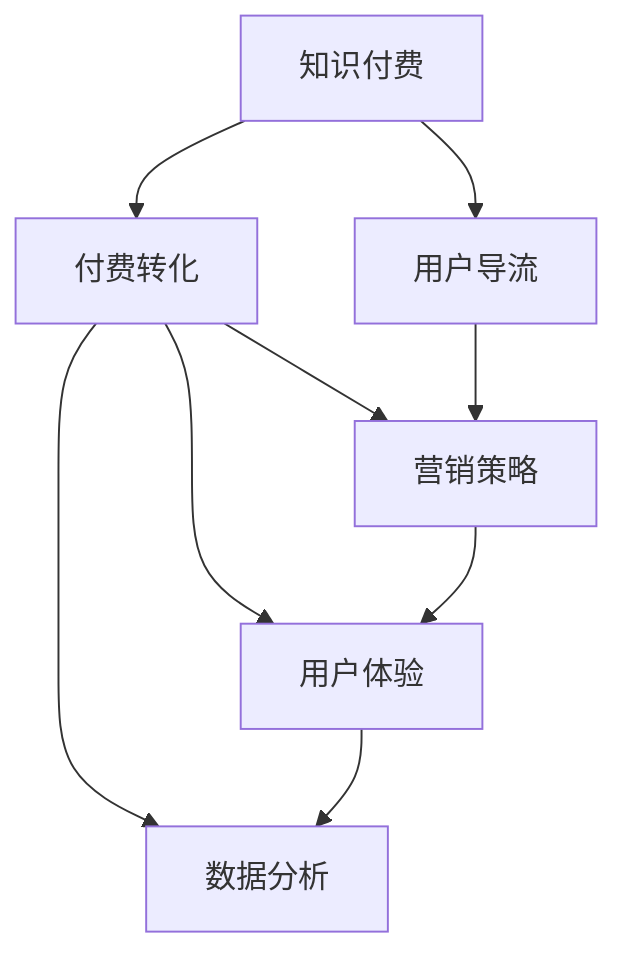

                 

# 知识付费赚钱的用户导流与付费转化策略

> 关键词：知识付费,用户导流,付费转化,营销策略,用户体验

## 1. 背景介绍

### 1.1 问题由来
随着互联网的发展和用户对知识的需求日益增长，知识付费市场日益火热。据统计，全球知识付费市场规模已达数百亿美元，且年增长率保持在30%以上。在这个趋势下，越来越多的企业和个人开始通过知识付费平台赚取收益。然而，虽然市场潜力巨大，但实际运营中，用户导流和付费转化问题依然困扰着许多从业者。如何吸引更多用户，提升付费转化率，成为亟待解决的关键问题。

### 1.2 问题核心关键点
知识付费平台的用户导流与付费转化，本质上是一个多变量、多维度的复杂问题。核心在于如何通过营销手段吸引潜在用户，并通过精准推荐和有效促成支付方式，将用户转化为实际付费客户。

要解决这一问题，需要结合心理学、市场分析、用户行为学等跨学科知识，从平台设计、营销策略、产品定位等多个方面进行综合优化。同时，还需持续监控数据，以数据驱动的方式迭代优化营销策略。

## 2. 核心概念与联系

### 2.1 核心概念概述

为了更好地理解用户导流与付费转化策略，本节将介绍几个密切相关的核心概念：

- **知识付费**：即以在线课程、文章、音频、视频等形式提供专业知识，用户通过支付一定费用获取相关内容的一种服务模式。
- **用户导流**：指通过各种手段吸引用户关注和访问知识付费平台的过程。常见方法包括SEO优化、社交媒体推广、内容营销等。
- **付费转化**：指将有意向的潜在用户转化为实际付费客户的过程。包括用户下单、支付、消费等环节。
- **营销策略**：指针对用户导流与付费转化过程中不同阶段，设计和实施的一系列营销手段，如内容营销、精准推荐、优惠券、限时促销等。
- **用户体验**：指用户在使用知识付费平台时所获得的主观感受。包括界面友好度、内容质量、购买流程便捷性等方面。
- **数据分析**：通过收集和分析用户行为数据，了解用户偏好和需求，为优化用户导流与付费转化策略提供依据。

这些概念之间的逻辑关系可以通过以下Mermaid流程图来展示：



这个流程图展示了几大核心概念及其之间的关系：

1. 知识付费是整个业务流程的起点，用户导流与付费转化是为了促成知识付费过程的关键环节。
2. 营销策略和用户体验是导流和转化的重要手段，两者需紧密结合。
3. 数据分析贯穿于整个流程，通过数据驱动的方式不断优化和迭代。

## 3. 核心算法原理 & 具体操作步骤
### 3.1 算法原理概述

知识付费平台的用户导流与付费转化，本质上是一个多变量、多维度的复杂问题。核心在于如何通过营销手段吸引潜在用户，并通过精准推荐和有效促成支付方式，将用户转化为实际付费客户。

具体算法原理如下：

1. **需求识别**：通过数据分析，识别用户在不同时间段、不同渠道上的需求。
2. **内容推荐**：根据用户行为数据，推荐用户可能感兴趣的内容。
3. **促销活动**：定期推出限时优惠、折扣等促销活动，吸引用户购买。
4. **用户体验优化**：通过界面设计、交互流程优化等手段，提升用户购买体验。
5. **用户行为监控**：持续跟踪用户行为数据，了解用户购买意愿和行为模式。
6. **转化率优化**：结合A/B测试等方法，不断优化付费转化策略。

### 3.2 算法步骤详解

基于上述算法原理，用户导流与付费转化策略的主要步骤包括：

**Step 1: 数据收集与处理**
- 通过网站、应用等渠道收集用户行为数据，包括访问路径、点击率、购买记录等。
- 对数据进行清洗和预处理，确保数据质量和准确性。

**Step 2: 用户行为分析**
- 通过统计分析、机器学习等方法，识别用户的行为模式和偏好。
- 使用用户画像技术，构建用户群体画像，了解不同用户群体的特征和需求。

**Step 3: 内容推荐优化**
- 根据用户画像和行为数据，设计推荐算法，推荐用户可能感兴趣的内容。
- 定期更新推荐模型，根据用户反馈和实际点击数据调整推荐策略。

**Step 4: 促销活动设计**
- 设计针对性的促销活动，如限时折扣、优惠券、满减等。
- 使用A/B测试等方法评估不同促销策略的效果，选择最优方案。

**Step 5: 用户体验优化**
- 通过界面设计、交互流程优化等手段，提升用户购买体验。
- 引入反馈机制，持续收集用户意见，改进产品和服务。

**Step 6: 转化率优化**
- 通过A/B测试、多臂老虎机等方法，优化购买流程，提升转化率。
- 监控转化率变化，及时调整策略，确保用户获取最大化价值。

### 3.3 算法优缺点

用户导流与付费转化策略的优势包括：

1. **数据驱动**：通过数据驱动的方式，不断优化策略，提升效果。
2. **个性化推荐**：能够根据用户兴趣和行为，提供个性化推荐，提升用户体验。
3. **促销手段丰富**：通过多种促销手段吸引用户，增强用户粘性。
4. **精准营销**：通过精准的用户画像，实现更高效的营销推广。

同时，该方法也存在一定的局限性：

1. **数据隐私问题**：在数据收集和处理过程中，需关注用户隐私保护，避免数据泄露风险。
2. **模型复杂性**：用户画像和推荐模型的构建和维护需要一定技术实力和资源投入。
3. **策略迭代周期长**：策略的优化和调整需要不断收集数据和实验，周期较长。
4. **用户行为多样性**：用户行为多样，不同用户群体有不同的需求，策略需灵活调整。

尽管存在这些局限性，但就目前而言，用户导流与付费转化策略仍是大规模知识付费平台的主流范式。未来相关研究的重点在于如何进一步优化数据收集和处理流程，提升推荐和促销策略的效率，同时兼顾数据隐私和用户体验等关键因素。

### 3.4 算法应用领域

用户导流与付费转化策略在知识付费平台中的应用十分广泛，涵盖多个环节，例如：

- **内容发现**：通过推荐引擎，帮助用户发现感兴趣的内容。
- **产品推广**：通过各种营销手段，推广平台上的付费产品。
- **用户留存**：通过个性化推荐和优质服务，提升用户粘性和留存率。
- **付费转化**：通过精准营销和优惠活动，提升用户购买转化率。

此外，该策略也广泛应用于其他电商、教育、金融等领域，通过精准的用户画像和个性化推荐，实现更高的转化率和用户体验。

## 4. 数学模型和公式 & 详细讲解  
### 4.1 数学模型构建

在用户导流与付费转化策略中，数学模型主要包括以下几个部分：

1. **用户画像模型**：通过机器学习算法，构建用户兴趣和行为的数学模型。
2. **推荐系统模型**：使用协同过滤、内容过滤等算法，推荐用户可能感兴趣的内容。
3. **促销活动模型**：设计促销活动，根据用户行为数据评估活动效果。
4. **转化率优化模型**：使用A/B测试等方法，优化购买流程，提升转化率。

### 4.2 公式推导过程

**用户画像模型**：

假设用户画像由多个特征组成，记为 $\mathbf{x} = [x_1, x_2, ..., x_n]$。使用线性回归模型，将用户画像与付费行为之间的关系建模：

$$
\mathbf{y} = \mathbf{W} \mathbf{x} + \mathbf{b}
$$

其中 $\mathbf{y}$ 为预测的付费概率，$\mathbf{W}$ 为模型参数，$\mathbf{b}$ 为偏置项。

**推荐系统模型**：

使用协同过滤算法，根据用户历史行为和兴趣，推荐可能感兴趣的内容：

$$
\hat{r}_{ui} = \alpha_u \cdot \alpha_i \cdot \langle \mathbf{u}, \mathbf{v}_i \rangle
$$

其中 $\alpha_u$ 为对用户 $u$ 的评分放缩，$\alpha_i$ 为对物品 $i$ 的评分放缩，$\langle \mathbf{u}, \mathbf{v}_i \rangle$ 为物品 $i$ 和用户 $u$ 的评分加权内积。

**促销活动模型**：

设计限时折扣活动，根据用户行为数据，计算折扣后的收益最大化：

$$
\max_{k} \sum_{i \in I} \left( \delta_i - \frac{\delta_i}{p_i} \right) \cdot r_{ui}
$$

其中 $\delta_i$ 为用户对物品 $i$ 的付费意愿，$p_i$ 为物品 $i$ 的价格，$r_{ui}$ 为用户对物品 $i$ 的兴趣度。

**转化率优化模型**：

使用A/B测试，比较不同购买流程对用户转化率的影响：

$$
\frac{N_{test}}{N_{control}} = \frac{N_{convert_{test}}}{N_{convert_{control}}}
$$

其中 $N_{test}$ 和 $N_{control}$ 分别为测试组和对照组的总数，$N_{convert_{test}}$ 和 $N_{convert_{control}}$ 分别为测试组和对照组的转化数。

### 4.3 案例分析与讲解

以某知识付费平台为例，详细讲解上述模型的应用：

**用户画像模型**：通过平台收集的用户浏览、购买、学习行为数据，构建用户画像模型。使用线性回归模型，预测用户购买课程的概率，模型参数通过训练数据进行优化。

**推荐系统模型**：平台采用协同过滤算法，根据用户历史行为推荐新课程。同时，使用内容过滤算法，根据课程标签、作者等特征推荐相关课程。

**促销活动模型**：平台定期推出限时折扣活动，根据用户行为数据评估活动效果。通过分析用户点击、购买记录等数据，设计最优的折扣策略。

**转化率优化模型**：平台通过A/B测试比较不同购买流程对用户转化率的影响。通过分析不同页面设计、付款方式等变化，优化购买流程，提升转化率。

## 5. 项目实践：代码实例和详细解释说明
### 5.1 开发环境搭建

在进行用户导流与付费转化策略实践前，我们需要准备好开发环境。以下是使用Python进行Flask开发的环境配置流程：

1. 安装Anaconda：从官网下载并安装Anaconda，用于创建独立的Python环境。

2. 创建并激活虚拟环境：
```bash
conda create -n flask-env python=3.8 
conda activate flask-env
```

3. 安装Flask：使用pip安装Flask框架。

4. 安装其他必需库：
```bash
pip install flask pandas scikit-learn
```

完成上述步骤后，即可在`flask-env`环境中开始项目开发。

### 5.2 源代码详细实现

下面我们以某知识付费平台的用户导流与付费转化策略为例，给出完整的Flask代码实现。

首先，定义Flask应用程序和路由：

```python
from flask import Flask, request, jsonify

app = Flask(__name__)

@app.route('/user/recommend', methods=['GET'])
def user_recommend():
    user_id = request.args.get('user_id')
    # 调用推荐系统API，获取推荐课程列表
    courses = get_recommend_courses(user_id)
    return jsonify({'courses': courses})

@app.route('/promotion', methods=['GET'])
def promotion():
    # 调用促销活动API，获取促销活动信息
    activities = get_promotion_activities()
    return jsonify({'activities': activities})
```

然后，定义推荐系统模块和促销活动模块：

```python
from flask import request, jsonify

@app.route('/recommend', methods=['GET'])
def get_recommend_courses(user_id):
    # 调用推荐系统API，获取推荐课程列表
    return jsonify({'courses': get_courses(user_id)})

def get_courses(user_id):
    # 根据用户ID和历史行为，获取推荐课程列表
    # 具体实现可以参考协同过滤、内容过滤等推荐算法
    pass

@app.route('/promotion', methods=['GET'])
def get_promotion_activities():
    # 调用促销活动API，获取促销活动信息
    return jsonify({'activities': get_activities()})

def get_activities():
    # 根据用户行为数据，获取促销活动列表
    # 具体实现可以参考A/B测试、多臂老虎机等策略
    pass
```

最后，启动Flask应用程序：

```python
if __name__ == '__main__':
    app.run(debug=True)
```

以上就是使用Flask进行用户导流与付费转化策略的完整代码实现。可以看到，通过Flask框架，我们可以实现简洁高效的后端服务，同时与前端页面进行无缝对接，方便展示推荐和促销活动。

### 5.3 代码解读与分析

让我们再详细解读一下关键代码的实现细节：

**Flask应用程序**：
- `__init__`方法：初始化Flask应用程序对象。
- `@app.route`装饰器：定义路由，指定请求方法、路径和处理函数。
- `request.args.get`方法：从请求参数中获取指定字段。

**推荐系统模块**：
- `@app.route`装饰器：定义推荐课程API，指定路径和处理函数。
- `get_recommend_courses`函数：调用推荐系统API，获取推荐课程列表。
- `get_courses`函数：根据用户ID和历史行为，获取推荐课程列表，具体实现可以参考协同过滤、内容过滤等推荐算法。

**促销活动模块**：
- `@app.route`装饰器：定义促销活动API，指定路径和处理函数。
- `get_promotion_activities`函数：调用促销活动API，获取促销活动列表。
- `get_activities`函数：根据用户行为数据，获取促销活动列表，具体实现可以参考A/B测试、多臂老虎机等策略。

**Flask应用程序启动**：
- `if __name__ == '__main__':`语句：判断当前脚本是否为入口文件，如果是，则启动Flask应用程序。
- `app.run(debug=True)`方法：启动Flask应用程序，开启调试模式。

可以看到，通过Flask框架，我们可以快速构建用户导流与付费转化策略的API服务，方便前端页面调用和展示。同时，Flask的简洁性和易用性也使得开发和维护变得更加高效。

当然，实际应用中还需考虑更多因素，如前后端数据传输、安全性、负载均衡等。但核心的策略开发流程基本与此类似。

## 6. 实际应用场景
### 6.1 智能客服系统

智能客服系统利用用户导流与付费转化策略，能够提供7x24小时不间断服务，快速响应客户咨询，用自然流畅的语言解答各类常见问题。

在技术实现上，可以收集企业内部的历史客服对话记录，将问题和最佳答复构建成监督数据，在此基础上对推荐系统和促销活动进行优化，使得系统能够自动理解用户意图，匹配最合适的答案模板进行回复。对于客户提出的新问题，还可以接入检索系统实时搜索相关内容，动态组织生成回答。如此构建的智能客服系统，能大幅提升客户咨询体验和问题解决效率。

### 6.2 金融舆情监测

金融机构需要实时监测市场舆论动向，以便及时应对负面信息传播，规避金融风险。传统的人工监测方式成本高、效率低，难以应对网络时代海量信息爆发的挑战。基于用户导流与付费转化策略的文本分类和情感分析技术，为金融舆情监测提供了新的解决方案。

具体而言，可以收集金融领域相关的新闻、报道、评论等文本数据，并对其进行主题标注和情感标注。在此基础上对推荐系统和促销活动进行优化，使其能够自动判断文本属于何种主题，情感倾向是正面、中性还是负面。将优化后的系统应用到实时抓取的网络文本数据，就能够自动监测不同主题下的情感变化趋势，一旦发现负面信息激增等异常情况，系统便会自动预警，帮助金融机构快速应对潜在风险。

### 6.3 个性化推荐系统

当前的推荐系统往往只依赖用户的历史行为数据进行物品推荐，无法深入理解用户的真实兴趣偏好。基于用户导流与付费转化策略的个性化推荐系统，可以更好地挖掘用户行为背后的语义信息，从而提供更精准、多样的推荐内容。

在实践中，可以收集用户浏览、点击、评论、分享等行为数据，提取和用户交互的物品标题、描述、标签等文本内容。将文本内容作为模型输入，用户的后续行为（如是否点击、购买等）作为监督信号，在此基础上对推荐系统和促销活动进行优化，使得模型能够从文本内容中准确把握用户的兴趣点。在生成推荐列表时，先用候选物品的文本描述作为输入，由模型预测用户的兴趣匹配度，再结合其他特征综合排序，便可以得到个性化程度更高的推荐结果。

### 6.4 未来应用展望

随着用户导流与付费转化策略的发展，未来其在更多领域将得到应用，为传统行业带来变革性影响。

在智慧医疗领域，基于用户导流与付费转化策略的医疗问答、病历分析、药物研发等应用将提升医疗服务的智能化水平，辅助医生诊疗，加速新药开发进程。

在智能教育领域，用户导流与付费转化策略可应用于作业批改、学情分析、知识推荐等方面，因材施教，促进教育公平，提高教学质量。

在智慧城市治理中，用户导流与付费转化策略可应用于城市事件监测、舆情分析、应急指挥等环节，提高城市管理的自动化和智能化水平，构建更安全、高效的未来城市。

此外，在企业生产、社会治理、文娱传媒等众多领域，基于用户导流与付费转化策略的人工智能应用也将不断涌现，为经济社会发展注入新的动力。相信随着技术的日益成熟，该策略必将在构建人机协同的智能时代中扮演越来越重要的角色。

## 7. 工具和资源推荐
### 7.1 学习资源推荐

为了帮助开发者系统掌握用户导流与付费转化策略的理论基础和实践技巧，这里推荐一些优质的学习资源：

1. **《Web 前端开发实战》系列博文**：由知名前端开发专家撰写，深入浅出地介绍了前端开发的技术栈、实践技巧和常见问题。
2. **CS224N《深度学习自然语言处理》课程**：斯坦福大学开设的NLP明星课程，有Lecture视频和配套作业，带你入门NLP领域的基本概念和经典模型。
3. **《Web开发框架Flask入门与实战》书籍**：Flask框架的官方文档，全面介绍了Flask的基本用法和实践案例，适合Flask新手学习。
4. **《推荐系统实战》课程**：Coursera平台提供的推荐系统相关课程，涵盖协同过滤、内容过滤等算法，适合实战学习。
5. **《用户行为分析与数据驱动营销》书籍**：专门讲解用户行为分析和数据驱动营销的书籍，适合市场营销从业人员学习。

通过对这些资源的学习实践，相信你一定能够快速掌握用户导流与付费转化策略的精髓，并用于解决实际的NLP问题。
###  7.2 开发工具推荐

高效的开发离不开优秀的工具支持。以下是几款用于用户导流与付费转化策略开发的常用工具：

1. **Flask框架**：基于Python的开源Web框架，灵活易用，适合快速开发前后端接口。
2. **Scikit-learn库**：Python的机器学习库，提供了丰富的机器学习算法和工具，适合数据分析和模型训练。
3. **TensorFlow**：由Google主导开发的开源深度学习框架，适合大规模模型训练和推理。
4. **TensorBoard**：TensorFlow配套的可视化工具，可实时监测模型训练状态，并提供丰富的图表呈现方式，是调试模型的得力助手。
5. **Pandas库**：Python的数据处理库，适合数据清洗、统计分析和数据可视化。
6. **Jupyter Notebook**：交互式的开发环境，适合编写代码和实时调试，适合数据分析和模型开发。

合理利用这些工具，可以显著提升用户导流与付费转化策略的开发效率，加快创新迭代的步伐。

### 7.3 相关论文推荐

用户导流与付费转化策略的研究源于学界的持续研究。以下是几篇奠基性的相关论文，推荐阅读：

1. **《深度学习推荐系统》论文**：介绍了深度学习在推荐系统中的应用，涵盖了协同过滤、内容过滤等经典算法。
2. **《A/B测试：验证假设的方法》书籍**：讲解了A/B测试的基本原理和实际应用，适合产品运营和数据分析人员学习。
3. **《用户行为分析与数据驱动营销》论文**：介绍了用户行为分析和数据驱动营销的基本方法，适合市场营销从业人员学习。
4. **《推荐系统新方法》论文**：介绍了多臂老虎机等推荐系统的新方法，适合算法工程师学习。

这些论文代表了大语言模型微调技术的发展脉络。通过学习这些前沿成果，可以帮助研究者把握学科前进方向，激发更多的创新灵感。

## 8. 总结：未来发展趋势与挑战

### 8.1 总结

本文对用户导流与付费转化策略进行了全面系统的介绍。首先阐述了知识付费市场的发展趋势和面临的关键问题，明确了策略在用户导流和付费转化过程中的重要性。其次，从原理到实践，详细讲解了用户导流与付费转化策略的数学模型和关键步骤，给出了策略开发的完整代码实例。同时，本文还广泛探讨了策略在智能客服、金融舆情、个性化推荐等多个行业领域的应用前景，展示了策略的巨大潜力。此外，本文精选了策略相关的学习资源，力求为读者提供全方位的技术指引。

通过本文的系统梳理，可以看到，用户导流与付费转化策略在大规模知识付费平台中具有广泛的应用前景，极大地提升了平台的用户获取和转化效率。未来，伴随预训练语言模型和微调方法的持续演进，基于数据驱动的策略必将更加精准和高效，为知识付费市场带来更多的商业价值。

### 8.2 未来发展趋势

展望未来，用户导流与付费转化策略将呈现以下几个发展趋势：

1. **数据驱动的个性化推荐**：利用深度学习和大数据技术，实现更精准的个性化推荐，提升用户满意度。
2. **实时化、智能化营销**：通过实时数据监测和智能分析，实现更高效的营销推广。
3. **多渠道、多触点用户导流**：通过多渠道、多触点的用户导流策略，提升用户获取效率。
4. **跨平台的用户体验优化**：通过跨平台的用户体验优化，提升用户在各个渠道上的体验一致性。
5. **动态化、灵活化的促销策略**：根据用户行为数据，动态调整促销策略，提升用户粘性和转化率。

以上趋势凸显了用户导流与付费转化策略的广阔前景。这些方向的探索发展，必将进一步提升知识付费平台的竞争力和市场份额，为行业带来新的发展机遇。

### 8.3 面临的挑战

尽管用户导流与付费转化策略已经取得了瞩目成就，但在迈向更加智能化、普适化应用的过程中，它仍面临着诸多挑战：

1. **数据隐私问题**：在数据收集和处理过程中，需关注用户隐私保护，避免数据泄露风险。
2. **模型复杂性**：用户画像和推荐模型的构建和维护需要一定技术实力和资源投入。
3. **策略迭代周期长**：策略的优化和调整需要不断收集数据和实验，周期较长。
4. **用户行为多样性**：用户行为多样，不同用户群体有不同的需求，策略需灵活调整。
5. **用户行为稳定性**：用户行为可能受多种因素影响，策略需具备良好的鲁棒性和灵活性。

尽管存在这些挑战，但就目前而言，用户导流与付费转化策略仍是大规模知识付费平台的主流范式。未来相关研究的重点在于如何进一步优化数据收集和处理流程，提升推荐和促销策略的效率，同时兼顾数据隐私和用户体验等关键因素。

### 8.4 研究展望

面向未来，用户导流与付费转化策略的研究需要在以下几个方面寻求新的突破：

1. **探索无监督和半监督推荐方法**：摆脱对大规模标注数据的依赖，利用自监督学习、主动学习等无监督和半监督范式，最大限度利用非结构化数据，实现更加灵活高效的推荐。
2. **研究参数高效和计算高效的推荐范式**：开发更加参数高效的推荐方法，在固定大部分预训练参数的同时，只更新极少量的任务相关参数。同时优化推荐模型的计算图，减少前向传播和反向传播的资源消耗，实现更加轻量级、实时性的部署。
3. **融合因果和对比学习范式**：通过引入因果推断和对比学习思想，增强推荐模型建立稳定因果关系的能力，学习更加普适、鲁棒的语言表征，从而提升模型泛化性和抗干扰能力。
4. **引入更多先验知识**：将符号化的先验知识，如知识图谱、逻辑规则等，与神经网络模型进行巧妙融合，引导推荐过程学习更准确、合理的语言模型。同时加强不同模态数据的整合，实现视觉、语音等多模态信息与文本信息的协同建模。
5. **结合因果分析和博弈论工具**：将因果分析方法引入推荐模型，识别出模型决策的关键特征，增强输出解释的因果性和逻辑性。借助博弈论工具刻画人机交互过程，主动探索并规避模型的脆弱点，提高系统稳定性。
6. **纳入伦理道德约束**：在模型训练目标中引入伦理导向的评估指标，过滤和惩罚有偏见、有害的输出倾向。同时加强人工干预和审核，建立模型行为的监管机制，确保输出符合人类价值观和伦理道德。

这些研究方向的探索，必将引领用户导流与付费转化策略技术迈向更高的台阶，为构建安全、可靠、可解释、可控的智能系统铺平道路。面向未来，用户导流与付费转化策略还需要与其他人工智能技术进行更深入的融合，如知识表示、因果推理、强化学习等，多路径协同发力，共同推动知识付费平台的技术进步。只有勇于创新、敢于突破，才能不断拓展语言模型的边界，让智能技术更好地造福人类社会。

## 9. 附录：常见问题与解答

**Q1：知识付费平台的用户导流与付费转化策略是否适用于所有平台？**

A: 用户导流与付费转化策略在大规模知识付费平台中具有广泛的应用前景，但也需根据平台特点进行适当调整。如针对视频平台、音频平台等，需考虑多媒体内容的推荐和促成方式。

**Q2：推荐系统如何处理冷启动用户？**

A: 冷启动用户指的是刚注册但没有过任何行为记录的用户。为了处理冷启动用户，推荐系统通常会采用以下方法：
1. 利用用户画像模型，通过用户信息（如性别、年龄、兴趣等）预测用户行为。
2. 引入元数据，如用户注册时间、IP地址等，进一步丰富用户画像。
3. 提供初始推荐列表，如根据热门课程或热门推荐列表，引导用户初步体验平台。

**Q3：促销活动设计需考虑哪些因素？**

A: 促销活动设计需考虑以下因素：
1. 用户群体：不同用户群体有不同的促销策略，需针对性地设计活动。
2. 促销力度：需根据不同用户的购买意愿，合理设定折扣和优惠方式。
3. 活动周期：需考虑促销活动的周期和频率，避免频繁的优惠活动降低用户感知价值。
4. 数据监测：需实时监测促销活动的效果，及时调整策略，确保活动效果最大化。

**Q4：如何平衡用户隐私和策略优化？**

A: 平衡用户隐私和策略优化需注意以下方法：
1. 数据匿名化：在数据收集和处理过程中，进行数据匿名化，确保用户隐私不被泄露。
2. 合法合规：遵守相关法律法规，确保数据使用合法合规。
3. 用户透明：在策略设计和实施过程中，确保用户知情并同意数据使用。
4. 隐私保护技术：采用数据加密、匿名化等技术手段，确保数据安全。

**Q5：用户行为分析的主要方法有哪些？**

A: 用户行为分析的主要方法包括：
1. 统计分析：通过数据统计和分析，了解用户行为模式和趋势。
2. 机器学习：利用机器学习算法，建立用户行为预测模型。
3. A/B测试：通过A/B测试，比较不同策略的效果，选择最优方案。
4. 多臂老虎机：通过多臂老虎机算法，动态调整策略，优化资源分配。
5. 关联规则学习：通过关联规则学习，发现用户行为中的潜在关联关系。

这些方法可以综合运用，从多个角度分析和优化用户行为，提升策略效果。

---

作者：禅与计算机程序设计艺术 / Zen and the Art of Computer Programming

