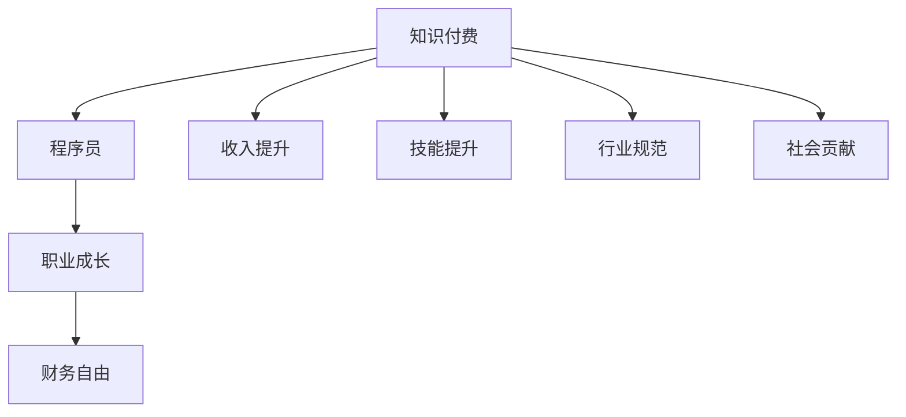

                 

## 1. 背景介绍

### 1.1 问题由来
在过去几十年里，互联网和计算机技术的飞速发展极大地推动了全球经济的发展。然而，这一过程中，程序员等IT从业人员并没有得到应有的回报。尽管程序员薪资普遍较高，但与其他行业的同行相比，其收入和劳动投入不匹配的问题依然存在。

### 1.2 问题核心关键点
为了解决这一问题，越来越多的程序员开始尝试通过知识付费的方式实现财富自由。知识付费，即通过出售自己的专业知识、技能或经验，获取相应的经济回报。这种方式不仅能提升程序员的专业水平，还能为其带来丰厚的收入，甚至实现财务自由。

### 1.3 问题研究意义
研究知识付费的商业模式，对于提升程序员收入水平、促进IT行业健康发展具有重要意义：

1. **收入提升**：知识付费为程序员提供了更多收入渠道，尤其是在高薪机会减少的情况下，通过出售专业知识，能够实现财务自由。
2. **技能提升**：知识付费过程中，程序员需要不断学习和更新知识，提升技能，有助于其职业成长。
3. **行业规范**：知识付费的普及将推动IT行业逐步走向规范，提升整个行业的价值和信誉。
4. **社会贡献**：通过知识付费，程序员可以将自己的知识贡献给社会，推动知识的普及和传播。

## 2. 核心概念与联系

### 2.1 核心概念概述

为更好地理解知识付费的概念及其与程序员财富自由的关系，本节将介绍几个密切相关的核心概念：

- **知识付费**：指通过出售知识、技能、经验等知识产权，获取经济回报的行为。知识付费形式多样，包括在线课程、技术博客、技术咨询等。
- **程序员职业**：以软件开发、系统维护、系统架构等为主要工作的职业，在信息时代具有重要地位。
- **财富自由**：个人或家庭在不依赖外部收入来源的情况下，能够凭借自身拥有的资产实现稳定的财务收支平衡，甚至无需工作即可生活的状态。
- **商业模式**：指在特定市场中，企业或个人为了实现其战略目标而构建的一系列活动和流程。知识付费作为一种新兴的商业模式，正在深刻影响着IT行业。

这些核心概念之间的逻辑关系可以通过以下Mermaid流程图来展示：



这个流程图展示了一切由知识付费到实现财富自由的整个过程：

1. 知识付费能够为程序员带来收入提升和技能提升。
2. 技能提升和收入提升能够促进程序员职业成长，进而影响行业规范。
3. 最终，通过知识付费和技能提升，程序员能够实现财务自由，同时对社会做出贡献。

## 3. 核心算法原理 & 具体操作步骤
### 3.1 算法原理概述

知识付费的核心在于通过技术手段实现知识和技能的传递与变现。其算法原理主要涉及以下几个方面：

- **内容创作**：通过编写代码、制作视频、撰写博客等方式，创造有价值的内容。
- **内容分发**：利用互联网平台，如YouTube、Bilibili、CSDN等，将内容分发给受众。
- **平台抽取**：平台通过算法对内容进行评估，抽取合适的广告收益、用户捐赠等。
- **用户消费**：用户通过付费购买内容，实现知识付费循环。

### 3.2 算法步骤详解

基于知识付费的算法，程序员实现财富自由的具体步骤如下：

**Step 1: 选择合适的知识付费平台**
- 根据自身优势和市场需求，选择适合的在线平台，如CSDN、博客园、知乎、YouTube等。
- 了解平台的内容质量要求、收益分配规则等。

**Step 2: 创作高质量内容**
- 根据市场需求和自身技能，选择创作形式，如技术博客、开源项目、视频教程等。
- 确保内容原创、有价值，符合平台质量要求。

**Step 3: 推广和分发内容**
- 利用社交媒体、技术社区、线上论坛等渠道，推广内容。
- 利用SEO、SEM、社交媒体营销等手段，提高内容曝光率。

**Step 4: 建立品牌和粉丝群体**
- 建立个人品牌，通过持续输出有价值的内容，吸引忠实粉丝。
- 与粉丝互动，回答问题，开展线上线下的技术交流活动。

**Step 5: 通过收益模式变现**
- 利用平台提供的收益模式，如广告收益、用户捐赠、付费阅读、线下培训等，实现收入变现。
- 不断优化内容质量，提升用户粘性，逐步增加收入。

**Step 6: 持续学习和优化**
- 关注行业动态和市场需求，不断学习新知识、新技术。
- 根据粉丝反馈和市场变化，及时优化内容策略，保持市场竞争力。

### 3.3 算法优缺点

知识付费作为程序员实现财富自由的一种方式，具有以下优点：

1. **灵活性高**：知识付费的自由度较高，程序员可以自主选择内容创作和发布渠道。
2. **覆盖广泛**：互联网平台的广泛覆盖，能够帮助程序员触及更多潜在用户。
3. **持续收益**：持续创作优质内容，能够实现长期稳定的收入来源。
4. **技术积累**：知识付费过程促进了程序员的技术积累和职业成长。

同时，这种模式也存在一些缺点：

1. **竞争激烈**：互联网平台竞争激烈，优质内容稀缺，需要持续创新才能保持竞争力。
2. **收益不稳定**：平台收益分配规则复杂，程序员的收入可能受到平台政策、内容质量等因素影响。
3. **时间成本高**：知识付费的创作和推广需要大量时间精力投入，短期内难以见效。
4. **市场认知**：部分内容受众可能对知识付费认知不足，导致收益效果不佳。

尽管存在这些局限性，但知识付费仍是大有潜力的商业化方式，能够为程序员提供一条实现财富自由的新途径。

### 3.4 算法应用领域

知识付费模式在IT行业中具有广泛的应用场景，涵盖以下几个领域：

1. **技术博客与文档**：程序员通过撰写技术博客、技术文档，分享自己的经验和技术积累，吸引开发者阅读和分享。
2. **在线课程与培训**：通过在线平台制作和销售技术课程、编程培训，提升自身市场价值。
3. **技术咨询与指导**：提供技术咨询服务，解答开发者的技术难题，收取咨询费用。
4. **开源项目与插件**：制作并推广开源项目或插件，获取社区贡献和用户捐赠。
5. **技术演讲与讲座**：参与技术会议、线上讲座，通过演讲获取听众捐赠和广告收益。

## 4. 数学模型和公式 & 详细讲解 & 举例说明（备注：数学公式请使用latex格式，latex嵌入文中独立段落使用 $$，段落内使用 $)
### 4.1 数学模型构建

知识付费的数学模型主要涉及以下几个部分：

- **内容质量**：内容价值越高，受众越多，收益越高。
- **内容推广**：通过SEO、SEM、社交媒体等手段，提升内容曝光率和访问量。
- **收益模式**：根据内容形式、用户行为等因素，确定收益分配模型。

定义内容价值 $V$，内容曝光量 $E$，用户转化率 $C$，广告收益 $A$，用户捐赠 $D$，其他收入 $O$，总收益 $R$。则知识付费的数学模型为：

$$
R = f(V,E,C,A,D,O)
$$

其中 $f$ 为收益函数，依赖于内容价值、曝光量、用户转化率、广告收益、用户捐赠和其他收入。

### 4.2 公式推导过程

以广告收益和用户捐赠为例，推导收益函数 $f$ 的部分公式。

**广告收益 $A$**：

$$
A = C \times E \times p_a
$$

其中 $C$ 为用户转化率，$E$ 为内容曝光量，$p_a$ 为广告点击率。

**用户捐赠 $D$**：

$$
D = k \times V \times E \times C
$$

其中 $k$ 为用户捐赠系数，$V$ 为内容价值，$E$ 为内容曝光量，$C$ 为用户转化率。

**其他收入 $O$**：

$$
O = g(V,E,C)
$$

其中 $g$ 为其他收入函数，可能包括线下培训、技术咨询、内容出售等。

将上述公式代入总收益函数 $R$，得到：

$$
R = A + D + O
$$

$$
R = C \times E \times p_a + k \times V \times E \times C + g(V,E,C)
$$

这表明，总收益 $R$ 主要由内容价值 $V$、曝光量 $E$、用户转化率 $C$ 和广告点击率 $p_a$ 等因素决定。

### 4.3 案例分析与讲解

以某知名编程网站为例，分析其知识付费模型。

假设该网站用户平均转化率为 $C=10\%$，内容曝光量 $E=10000$，广告点击率 $p_a=1\%$，内容价值 $V=5$，用户捐赠系数 $k=0.1$，其他收入函数 $g(V,E,C)=V^2 \times E^2 \times C^2$。则总收益 $R$ 计算如下：

$$
R = C \times E \times p_a + k \times V \times E \times C + g(V,E,C)
$$

$$
R = 0.1 \times 10000 \times 0.01 + 0.1 \times 5 \times 10000 \times 0.1 + 5^2 \times 10000^2 \times 0.1^2
$$

$$
R = 100 + 5000 + 2500000
$$

$$
R = 2500510
$$

可以看出，随着内容价值和曝光量的增加，总收益呈指数级增长。这说明，高质量的内容是知识付费成功的关键。

## 5. 项目实践：代码实例和详细解释说明
### 5.1 开发环境搭建

在进行知识付费实践前，我们需要准备好开发环境。以下是使用Python进行知识付费实践的环境配置流程：

1. 安装Anaconda：从官网下载并安装Anaconda，用于创建独立的Python环境。

2. 创建并激活虚拟环境：
```bash
conda create -n knowledge-payment python=3.8 
conda activate knowledge-payment
```

3. 安装Python相关工具包：
```bash
pip install beautifulsoup4 requests flask
```

4. 安装Markdown解析库：
```bash
pip install markdown
```

完成上述步骤后，即可在`knowledge-payment`环境中开始知识付费实践。

### 5.2 源代码详细实现

这里我们以制作和销售在线技术博客为例，给出使用Flask框架进行知识付费实践的PyTorch代码实现。

首先，定义博客页面：

```python
from flask import Flask, render_template, request

app = Flask(__name__)

@app.route('/')
def index():
    return render_template('index.html')

@app.route('/blog/<id>', methods=['GET', 'POST'])
def blog(id):
    if request.method == 'POST':
        # 处理支付逻辑，存储捐赠记录
        return render_template('blog.html', id=id)
    else:
        # 加载博客内容
        return render_template('blog.html', id=id)
```

然后，定义博客内容：

```python
@app.route('/content/<id>')
def content(id):
    # 从数据库或存储中加载博客内容
    content = load_content(id)
    return render_template('content.html', content=content)
```

最后，启动Flask服务：

```python
if __name__ == '__main__':
    app.run(debug=True)
```

这个Flask程序可以实现简单的在线博客系统，通过页面展示博客内容，并支持用户捐赠。

### 5.3 代码解读与分析

让我们再详细解读一下关键代码的实现细节：

**Flask框架**：
- `Flask`：轻量级的Python Web框架，易于学习和使用。
- `render_template`：渲染HTML模板，方便生成动态页面。
- `request`：处理HTTP请求，获取用户输入。
- `load_content`：从数据库或存储中加载博客内容，实现内容管理。

**路由处理**：
- `@app.route('/')`：定义首页路由，渲染`index.html`模板。
- `@app.route('/blog/<id>', methods=['GET', 'POST'])`：定义博客详情页路由，处理GET和POST请求。
- `@app.route('/content/<id>')`：定义博客内容页路由，展示博客内容。

**内容展示**：
- `return render_template('content.html', content=content)`：渲染`content.html`模板，展示博客内容。

**用户捐赠**：
- `if request.method == 'POST'`：处理POST请求，进行支付逻辑。
- `return render_template('blog.html', id=id)`：渲染`blog.html`模板，记录捐赠记录。

通过这个简单的Flask程序，程序员能够实现基本的在线博客系统，并通过用户捐赠实现收入变现。当然，在实际应用中，还需要对内容管理系统、用户支付逻辑、数据存储等进行优化，以满足实际需求。

## 6. 实际应用场景
### 6.1 在线教育平台

知识付费在在线教育领域具有广阔的应用前景。传统教育培训往往费用高昂、课程质量参差不齐，而在线教育平台可以提供价格合理、内容丰富的课程，满足不同用户的学习需求。

在技术实现上，可以收集用户的学习反馈和评价，实时调整课程内容和质量，提升用户体验。通过知识付费，在线教育平台能够持续获得收入，同时吸引更多优质内容创作者入驻。

### 6.2 技术咨询公司

技术咨询公司需要大量专业人士提供专业知识和经验，而知识付费平台能够为其提供高效、灵活的人才招聘方式。

技术咨询公司可以在平台上发布咨询需求，程序员根据自身专长进行竞标，提供高质量的技术咨询服务。平台通过抽取咨询费用，实现盈利。同时，平台还能够通过课程和培训，提升自身服务能力。

### 6.3 软件开发社区

软件开发社区是程序员交流技术、分享经验的重要场所。通过知识付费，社区能够持续获取收入，同时吸引更多优质内容创作者，提升社区整体价值。

社区可以开设付费课程、技术博客、在线问答等服务，满足开发者对深度学习、人工智能、软件开发等技术的学习需求。程序员可以通过提供知识服务，获得相应的经济回报。

### 6.4 未来应用展望

随着知识付费技术的不断发展，其在IT行业的应用场景将不断拓展，为程序员提供更多实现财富自由的机会。

在智慧城市、医疗、金融等领域，知识付费将提供更多的应用机会，推动相关行业的数字化转型。同时，知识付费将与其他新兴技术，如区块链、人工智能等深度融合，催生新的商业模式和应用场景。

未来，知识付费平台将逐步成为IT行业的标配，程序员通过持续输出高质量内容，能够实现稳定的收入来源，甚至实现财务自由。相信在学界和产业界的共同努力下，知识付费将成为IT行业的重要发展方向，推动整个行业迈向更加健康、可持续的发展道路。

## 7. 工具和资源推荐
### 7.1 学习资源推荐

为了帮助程序员系统掌握知识付费的理论基础和实践技巧，这里推荐一些优质的学习资源：

1. **《知识付费商业模型》系列博文**：全面介绍知识付费的商业模式、运营策略和实现路径。
2. **《知识付费案例分析》系列视频**：从多个成功案例中，提炼知识付费的实践经验和教训。
3. **《知识付费平台开发指南》书籍**：详细介绍知识付费平台的技术实现，涵盖Flask、Django等主流框架。
4. **Coursera《知识付费营销》课程**：由知名市场营销专家开设，深入讲解知识付费的营销策略和用户运营技巧。
5. **Medium《知识付费指南》文章**：总结了知识付费领域的最佳实践，涵盖内容创作、用户互动、收益管理等方面。

通过对这些资源的学习实践，相信程序员能够快速掌握知识付费的精髓，并用于解决实际的IT问题。

### 7.2 开发工具推荐

高效的开发离不开优秀的工具支持。以下是几款用于知识付费开发的常用工具：

1. **Flask**：轻量级的Python Web框架，适合快速迭代开发。
2. **Django**：功能强大的Web框架，适合复杂应用场景。
3. **MySQL/PostgreSQL**：数据库管理系统，用于存储和管理用户数据。
4. **Redis/Memcached**：内存数据库，用于缓存和加速系统性能。
5. **Docker/Kubernetes**：容器化和容器编排工具，用于部署和管理Web应用。
6. **Anaconda**：科学计算和数据分析环境，便于管理和重复使用。

合理利用这些工具，可以显著提升知识付费系统的开发效率，加快创新迭代的步伐。

### 7.3 相关论文推荐

知识付费作为一种新兴的商业模式，受到学界的广泛关注。以下是几篇奠基性的相关论文，推荐阅读：

1. **《知识付费商业模式的经济学分析》**：分析了知识付费的经济学原理，讨论了其对内容创作者和消费者的影响。
2. **《知识付费平台的价值评估模型》**：提出了一套知识付费平台价值评估模型，用于衡量平台运营效果。
3. **《知识付费用户行为分析》**：通过对用户行为数据的分析，揭示了知识付费用户的学习习惯和付费意愿。
4. **《知识付费平台技术架构》**：介绍了知识付费平台的技术架构，包括前端、后端、数据库等各环节的设计。
5. **《知识付费平台用户体验优化》**：探讨了知识付费平台的用户体验优化策略，提升用户满意度和平台留存率。

这些论文代表了大语言模型微调技术的发展脉络。通过学习这些前沿成果，可以帮助研究者把握学科前进方向，激发更多的创新灵感。

## 8. 总结：未来发展趋势与挑战
### 8.1 总结

本文对知识付费的概念及其与程序员财富自由的关系进行了全面系统的介绍。首先阐述了知识付费的商业模式，明确了其对程序员收入提升、技能提升、行业规范等的影响。其次，从原理到实践，详细讲解了知识付费的数学模型和操作步骤，给出了知识付费任务开发的完整代码实例。同时，本文还广泛探讨了知识付费在在线教育、技术咨询、软件开发等诸多领域的应用前景，展示了知识付费的巨大潜力。此外，本文精选了知识付费技术的各类学习资源，力求为程序员提供全方位的技术指引。

通过本文的系统梳理，可以看到，知识付费作为程序员实现财富自由的新途径，正在成为IT行业的重要发展方向，为程序员提供了更多的收入来源。未来，伴随知识付费技术的持续演进，相信程序员能够通过持续输出高质量内容，实现长期的职业成长和财务自由。

### 8.2 未来发展趋势

展望未来，知识付费技术将呈现以下几个发展趋势：

1. **内容多样化**：知识付费内容将更加多样化，涵盖编程、人工智能、大数据、区块链等多个领域。同时，视频、直播、互动等新型形式也将涌现，满足不同用户的需求。
2. **平台个性化**：知识付费平台将更加注重用户个性化需求，通过推荐算法和大数据分析，提供定制化的内容和服务。
3. **技术融合**：知识付费将与其他新兴技术，如人工智能、大数据、区块链等深度融合，催生新的商业模式和应用场景。
4. **市场拓展**：知识付费将逐步拓展到企业培训、政府采购等领域，实现更大的市场规模和收益。
5. **国际推广**：随着全球化的推进，知识付费也将拓展到海外市场，为全球知识创作者提供新的机会。

以上趋势凸显了知识付费技术的广阔前景。这些方向的探索发展，将进一步提升知识付费系统的价值，为程序员带来更多实现财富自由的机会。

### 8.3 面临的挑战

尽管知识付费技术已经取得了瞩目成就，但在迈向更加智能化、普适化应用的过程中，它仍面临诸多挑战：

1. **内容质量控制**：如何保证内容的高质量和真实性，避免伪劣内容的泛滥，是一个重要问题。
2. **用户信任度**：如何建立用户对平台的信任，防止诈骗和虚假宣传，提升用户满意度。
3. **市场竞争**：随着知识付费市场的逐步成熟，平台之间的竞争将更加激烈，如何保持竞争优势，是一个长期挑战。
4. **技术门槛**：知识付费的开发和运营需要较高的技术门槛，如何降低门槛，让更多程序员参与其中，是一个重要问题。
5. **法律法规**：知识付费需要遵守相关法律法规，如何平衡商业利益和用户隐私，是一个重要问题。

尽管存在这些挑战，但知识付费仍是大有潜力的商业模式，能够为程序员提供一条实现财务自由的新途径。相信在学界和产业界的共同努力下，知识付费技术将不断完善，助力程序员实现职业成长和财务自由。

### 8.4 研究展望

面对知识付费面临的诸多挑战，未来的研究需要在以下几个方面寻求新的突破：

1. **内容质量评估**：开发更加先进的内容质量评估算法，保证内容的高质量和真实性。
2. **用户信任机制**：建立用户信任机制，提升用户对平台的信任度，防止诈骗和虚假宣传。
3. **平台竞争力提升**：通过持续创新和优化，提升知识付费平台的竞争力，保持市场领先地位。
4. **技术普及**：降低知识付费的开发和运营门槛，让更多程序员能够参与其中，实现财富自由。
5. **法律法规研究**：深入研究知识付费相关的法律法规，平衡商业利益和用户隐私，确保平台运营的合法合规。

这些研究方向的探索，将推动知识付费技术的进一步发展，为程序员提供更多的实现财富自由的机会。相信在学界和产业界的共同努力下，知识付费技术必将在IT行业迎来更广阔的应用前景。

## 9. 附录：常见问题与解答
----------------------------------------------------------------

**Q1：知识付费是否适用于所有程序员？**

A: 知识付费适用于大部分具有一定技术积累和经验的程序员。尤其是具有特定领域技能和经验的程序员，通过知识付费更容易实现财务自由。

**Q2：如何选择合适的知识付费平台？**

A: 选择知识付费平台时，需要考虑其用户规模、内容质量、收益分配规则、用户互动等方面。建议选择有稳定用户基础和良好口碑的平台。

**Q3：如何进行内容创作和推广？**

A: 内容创作需要根据市场需求和个人专长进行定位。推广则可以利用SEO、SEM、社交媒体等手段，提升内容曝光率。同时，可以通过平台提供的工具和功能，优化内容推荐和用户互动。

**Q4：如何提升用户转化率和留存率？**

A: 提升用户转化率和留存率的关键在于提供高质量的内容和服务。可以通过优化用户体验、增加用户互动、提升内容更新频率等方式，增强用户粘性。

**Q5：如何应对市场竞争和法律法规风险？**

A: 应对市场竞争需要持续创新和优化，提升平台竞争力。法律法规风险则需要深入研究相关法律法规，确保平台运营的合法合规。

总之，知识付费为程序员提供了实现财富自由的新途径，但同时也需要面对诸多挑战和问题。通过深入研究和不断优化，相信知识付费将成为程序员职业发展的重要方向。

