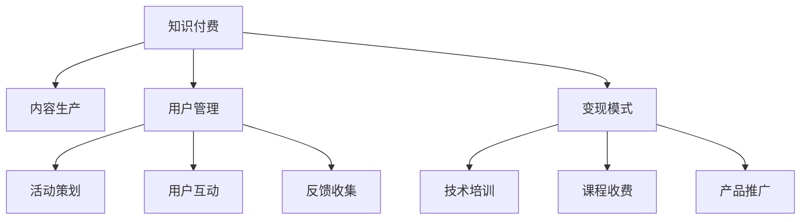

                 

# 知识付费：程序员的社群运营指导

> 关键词：知识付费、程序员、社群运营、内容生产、用户管理、变现模式

## 1. 背景介绍

### 1.1 问题由来
知识付费作为互联网时代的新兴模式，为知识拥有者和需求者搭建起了一个高效的信息交换平台。特别是近年来，伴随着知识付费平台如得到、喜马拉雅、知乎 live 等的兴起，知识付费已经成为内容消费市场中的重要组成部分。

对于程序员群体来说，由于技术和市场的快速发展，需要不断更新知识体系和掌握最新技术，知识付费成为了获取高质量技术内容的重要途径。但与此同时，传统知识付费平台的内容质量参差不齐，版权问题频出，付费效率不高，用户粘性差，盈利模式单一。因此，作为知识付费的重要受众，程序员群体对高质量、高效益、低成本的知识付费内容有强烈需求。

### 1.2 问题核心关键点
针对程序员知识付费市场的需求，本文聚焦于程序员的社群运营，通过系统化、结构化的分析，探讨如何高效产出高质量内容，打造稳定的用户群体，实现可持续的商业模式。

## 2. 核心概念与联系

### 2.1 核心概念概述

为更好地理解程序员社群运营的策略，本节将介绍几个核心概念：

- **知识付费**：指通过购买技术内容、服务或经验，获取高质量知识内容的商业模式。知识付费平台通过内容生产、用户管理、变现模式等环节实现盈利。

- **程序员社群**：指以程序员为对象，聚焦技术交流、问题解决、职业发展的专业社群。社群运营的关键在于高效产出内容，吸引和维护活跃用户。

- **内容生产**：指社群内成员通过编写技术文章、录制视频、开发应用等形式，创造技术内容，满足社群成员的学习需求。

- **用户管理**：指社群运营者通过活动策划、用户互动、反馈收集等手段，保持社群活跃，增强用户粘性。

- **变现模式**：指通过技术培训、课程收费、产品推广等方式，实现知识付费平台和内容创作者的商业变现。

这些核心概念之间的关系可以通过以下Mermaid流程图来展示：



这个流程图展示出知识付费中的各个环节及其联系：

1. **内容生产**是知识付费的核心，通过内容吸引用户。
2. **用户管理**通过活动策划、用户互动、反馈收集等手段，保持社群活跃。
3. **变现模式**通过技术培训、课程收费、产品推广等方式实现商业变现。
4. **活动策划、用户互动、反馈收集**等手段共同作用于内容生产，促进内容创新和用户粘性提升。
5. **技术培训、课程收费、产品推广**是变现模式的直接体现，也是内容创作者收益的来源。

## 3. 核心算法原理 & 具体操作步骤
### 3.1 算法原理概述

程序员社群的运营可以视为一个复杂的多目标优化问题。其核心在于通过高效的资源配置，最大化用户满意度和商业回报。具体而言，主要涉及以下几个方面：

- **内容质量优化**：通过算法模型评估内容质量，筛选优质内容并优先推荐，提升用户满意度。
- **用户行为分析**：分析用户行为数据，识别活跃用户和潜在付费用户，制定精准的用户管理策略。
- **变现模式设计**：设计合理的价格策略，提供多样化的付费内容，实现知识付费平台的商业变现。

### 3.2 算法步骤详解

**步骤 1：内容质量评估**

内容质量评估是程序员社群运营的基础。一般采用以下方法：

1. **用户评价**：通过用户评分、评论等反馈数据，对内容进行初步评估。
2. **算法模型**：基于自然语言处理和机器学习技术，建立内容质量评估模型，计算内容的NLP特征和用户互动指标。
3. **专家评审**：邀请领域专家对高权重内容进行人工评审，补充模型的缺陷。

**步骤 2：用户行为分析**

用户行为分析是社群运营的关键。具体包括：

1. **用户画像构建**：通过数据分析，构建用户兴趣画像，识别出高价值用户。
2. **行为模式挖掘**：分析用户在社群中的活动模式，识别活跃用户和潜在付费用户。
3. **互动效果评估**：通过统计用户互动数据，评估不同内容对用户活跃度的影响。

**步骤 3：变现模式设计**

变现模式设计是知识付费平台的核心。主要考虑以下几个方面：

1. **课程结构设计**：设计多样化、系统化的课程结构，满足用户多层次的学习需求。
2. **价格策略制定**：根据内容价值和用户需求，合理制定课程和服务的收费标准。
3. **推广策略实施**：利用社交媒体、社群推荐等手段，提升课程曝光率，增加用户付费意愿。

### 3.3 算法优缺点

程序员社群运营中的算法主要包括以下优点：

1. **自动化高效**：算法可以自动分析用户行为和内容质量，高效筛选优质内容，提升运营效率。
2. **精准化运营**：通过用户画像和行为分析，制定精准的用户管理策略，提升用户满意度。
3. **灵活性高**：算法可根据社群数据和用户反馈，动态调整内容生产和变现模式，灵活应对市场变化。

但同时，算法也存在一些局限性：

1. **数据依赖性高**：算法的有效性依赖于高质量的数据输入，数据缺失或噪声可能导致模型误判。
2. **模型复杂度**：复杂模型虽然精度高，但计算资源消耗大，难以实时处理大规模数据。
3. **算法黑盒性**：算法模型通常是一个黑盒系统，缺乏对决策过程的可解释性，难以调试和优化。
4. **公平性问题**：算法决策可能受数据偏见影响，导致部分用户被忽视或错误对待。

针对这些缺点，未来的研究需要进一步探索，提升数据质量，简化模型结构，增强模型的可解释性，确保算法决策的公平性和透明性。

### 3.4 算法应用领域

程序员社群运营的算法在多个领域都有广泛应用，例如：

- **内容推荐**：根据用户行为和内容质量，推荐高质量技术文章和课程。
- **用户管理**：通过用户画像和行为分析，精准制定社群运营策略。
- **课程设计**：根据用户需求和反馈，优化课程结构和收费策略。
- **活动策划**：利用行为数据预测用户活跃度，策划高质量的社群活动。

除了上述这些经典应用外，程序员社群运营算法还将不断创新，如利用情感分析技术，提升用户满意度，结合强化学习，动态调整内容和活动策略等，以实现更高效的用户管理和内容产出。

## 4. 数学模型和公式 & 详细讲解 & 举例说明

### 4.1 数学模型构建

程序员社群运营中的算法模型一般包括以下几个关键模块：

- **内容质量评估模型**：$M_{content}$，用于评估内容的质量，输出内容评分 $C$。
- **用户行为分析模型**：$M_{user}$，用于分析用户行为，输出用户画像 $P$。
- **课程设计模型**：$M_{course}$，用于设计课程结构，输出课程内容 $S$。
- **价格策略模型**：$M_{price}$，用于制定课程收费策略，输出课程定价 $P_{charge}$。

### 4.2 公式推导过程

以内容质量评估模型为例，假设内容 $D$ 包含文本 $X$ 和代码片段 $C$，模型的输入为 $(x, c)$，其中 $x$ 表示文本内容，$c$ 表示代码片段。模型的输出为内容评分 $C$。

内容质量评估模型 $M_{content}$ 可以表示为：

$$
M_{content}(x, c) = W_{content} \cdot [f_{NLP}(x) + f_{code}(c)]
$$

其中 $W_{content}$ 为权重向量，$f_{NLP}(x)$ 为自然语言处理特征函数，$f_{code}(c)$ 为代码片段处理函数。假设模型的输出为 $C$，则有：

$$
C = M_{content}(x, c) = W_{content} \cdot [f_{NLP}(x) + f_{code}(c)]
$$

对于用户行为分析模型 $M_{user}$，假设用户行为数据包含阅读时间 $R$、点赞数量 $L$、评论数量 $C$，模型的输入为 $(r, l, c)$，其中 $r$ 表示阅读时间，$l$ 表示点赞数量，$c$ 表示评论数量。模型的输出为用户画像 $P$。

用户行为分析模型 $M_{user}$ 可以表示为：

$$
M_{user}(r, l, c) = W_{user} \cdot [g_{read}(r) + g_{like}(l) + g_{comment}(c)]
$$

其中 $W_{user}$ 为用户画像权重向量，$g_{read}(r)$ 为用户阅读时间处理函数，$g_{like}(l)$ 为用户点赞数量处理函数，$g_{comment}(c)$ 为用户评论数量处理函数。假设模型的输出为用户画像 $P$，则有：

$$
P = M_{user}(r, l, c) = W_{user} \cdot [g_{read}(r) + g_{like}(l) + g_{comment}(c)]
$$

对于课程设计模型 $M_{course}$，假设课程内容包含视频 $V$、文章 $A$、实战代码 $C$，模型的输入为 $(v, a, c)$，其中 $v$ 表示视频时长，$a$ 表示文章字数，$c$ 表示实战代码行数。模型的输出为课程结构 $S$。

课程设计模型 $M_{course}$ 可以表示为：

$$
M_{course}(v, a, c) = W_{course} \cdot [h_{video}(v) + h_{article}(a) + h_{code}(c)]
$$

其中 $W_{course}$ 为课程结构权重向量，$h_{video}(v)$ 为视频时长处理函数，$h_{article}(a)$ 为文章字数处理函数，$h_{code}(c)$ 为实战代码行数处理函数。假设模型的输出为课程结构 $S$，则有：

$$
S = M_{course}(v, a, c) = W_{course} \cdot [h_{video}(v) + h_{article}(a) + h_{code}(c)]
$$

对于价格策略模型 $M_{price}$，假设课程定价包含基础价格 $P_{base}$ 和进阶价格 $P_{adv}$，模型的输入为 $(s, l, f)$，其中 $s$ 表示课程结构复杂度，$l$ 表示课程学习难度，$f$ 表示课程服务时间。模型的输出为课程定价 $P_{charge}$。

价格策略模型 $M_{price}$ 可以表示为：

$$
M_{price}(s, l, f) = W_{price} \cdot [p_{base}(s) + p_{adv}(l) + p_{time}(f)]
$$

其中 $W_{price}$ 为课程定价权重向量，$p_{base}(s)$ 为基础价格处理函数，$p_{adv}(l)$ 为进阶价格处理函数，$p_{time}(f)$ 为服务时间处理函数。假设模型的输出为课程定价 $P_{charge}$，则有：

$$
P_{charge} = M_{price}(s, l, f) = W_{price} \cdot [p_{base}(s) + p_{adv}(l) + p_{time}(f)]
$$

### 4.3 案例分析与讲解

假设我们有一个程序员社群，收集到如下数据：

- 内容数据：100 篇技术文章，每篇文章包含 500 行代码片段。
- 用户行为数据：1000 名用户，阅读时间均值为 30 分钟，点赞数量为 2，评论数量为 3。
- 课程数据：10 门课程，视频时长均值为 2 小时，文章字数均值为 2000，实战代码行数均值为 100。

首先，通过内容质量评估模型，计算每篇文章的内容评分：

$$
C_1 = M_{content}(x_1, c_1) = W_{content} \cdot [f_{NLP}(x_1) + f_{code}(c_1)]
$$

重复计算，得到所有文章的内容评分。

然后，通过用户行为分析模型，计算每名用户的用户画像：

$$
P_1 = M_{user}(r_1, l_1, c_1) = W_{user} \cdot [g_{read}(r_1) + g_{like}(l_1) + g_{comment}(c_1)]
$$

重复计算，得到所有用户画像。

接着，通过课程设计模型，计算每门课程的课程结构：

$$
S_1 = M_{course}(v_1, a_1, c_1) = W_{course} \cdot [h_{video}(v_1) + h_{article}(a_1) + h_{code}(c_1)]
$$

重复计算，得到所有课程结构。

最后，通过价格策略模型，计算每门课程的定价：

$$
P_{charge1} = M_{price}(s_1, l_1, f_1) = W_{price} \cdot [p_{base}(s_1) + p_{adv}(l_1) + p_{time}(f_1)]
$$

重复计算，得到所有课程的定价。

## 5. 项目实践：代码实例和详细解释说明
### 5.1 开发环境搭建

在进行程序员社群运营算法实践前，我们需要准备好开发环境。以下是使用Python进行PyTorch开发的环境配置流程：

1. 安装Anaconda：从官网下载并安装Anaconda，用于创建独立的Python环境。

2. 创建并激活虚拟环境：
```bash
conda create -n pytorch-env python=3.8 
conda activate pytorch-env
```

3. 安装PyTorch：根据CUDA版本，从官网获取对应的安装命令。例如：
```bash
conda install pytorch torchvision torchaudio cudatoolkit=11.1 -c pytorch -c conda-forge
```

4. 安装相关的库：
```bash
pip install pandas numpy scipy torch torchtext
```

5. 安装数据处理和分析库：
```bash
pip install scipy torchtext datasets
```

6. 安装TensorBoard：用于可视化模型训练过程和结果。
```bash
pip install tensorboard
```

完成上述步骤后，即可在`pytorch-env`环境中开始项目实践。

### 5.2 源代码详细实现

下面我们以内容质量评估为例，给出使用PyTorch进行程序员社群运营算法的PyTorch代码实现。

首先，定义内容质量评估的模型：

```python
import torch
import torch.nn as nn
import torch.nn.functional as F
from transformers import BertTokenizer, BertModel

class ContentQualityModel(nn.Module):
    def __init__(self, vocab_size, embed_dim, num_labels):
        super(ContentQualityModel, self).__init__()
        self.tokenizer = BertTokenizer.from_pretrained('bert-base-cased')
        self.bert = BertModel.from_pretrained('bert-base-cased')
        self.classifier = nn.Linear(embed_dim, num_labels)
        
    def forward(self, text, codes):
        # 分词并编码
        tokens = self.tokenizer.tokenize(text)
        tokens = ['[CLS]'] + tokens + ['[SEP]']
        tokens = self.tokenizer.convert_tokens_to_ids(tokens)
        
        # 编码器
        outputs = self.bert(text=tokens)
        last_hidden_states = outputs[0]
        
        # 将代码片段转换为token ids
        code_ids = self.tokenizer.convert_tokens_to_ids(codes.split(' '))
        
        # 编码器
        outputs = self.bert(code_ids)
        last_hidden_states = outputs[0]
        
        # 合并并取pooling结果
        pooled = last_hidden_states[0, :].unsqueeze(0)
        merged = torch.cat([last_hidden_states, pooled], dim=1)
        
        # 输出分类得分
        logits = self.classifier(merged)
        return logits
```

然后，定义用户行为分析模型：

```python
class UserBehaviorModel(nn.Module):
    def __init__(self, n_labels):
        super(UserBehaviorModel, self).__init__()
        self.fc1 = nn.Linear(3, 128)
        self.fc2 = nn.Linear(128, n_labels)
        
    def forward(self, read_time, like_count, comment_count):
        # 线性层
        x = torch.stack([read_time, like_count, comment_count], dim=1)
        x = self.fc1(x)
        x = F.relu(x)
        x = self.fc2(x)
        return x
```

接着，定义课程设计模型：

```python
class CourseDesignModel(nn.Module):
    def __init__(self, n_labels):
        super(CourseDesignModel, self).__init__()
        self.fc1 = nn.Linear(3, 128)
        self.fc2 = nn.Linear(128, n_labels)
        
    def forward(self, video_length, article_words, code_lines):
        # 线性层
        x = torch.stack([video_length, article_words, code_lines], dim=1)
        x = self.fc1(x)
        x = F.relu(x)
        x = self.fc2(x)
        return x
```

最后，定义价格策略模型：

```python
class PriceStrategyModel(nn.Module):
    def __init__(self, n_labels):
        super(PriceStrategyModel, self).__init__()
        self.fc1 = nn.Linear(3, 128)
        self.fc2 = nn.Linear(128, n_labels)
        
    def forward(self, course_structure, course_difficulty, course_duration):
        # 线性层
        x = torch.stack([course_structure, course_difficulty, course_duration], dim=1)
        x = self.fc1(x)
        x = F.relu(x)
        x = self.fc2(x)
        return x
```

在定义好模型后，我们可以开始训练模型。假设我们有训练数据，可以用以下代码进行模型训练：

```python
# 定义训练函数
def train_model(model, data, optimizer):
    model.train()
    loss = 0
    for i in range(len(data)):
        input_ids = data['input_ids']
        attention_mask = data['attention_mask']
        labels = data['labels']
        outputs = model(input_ids, attention_mask=attention_mask)
        loss += F.cross_entropy(outputs, labels)
        optimizer.zero_grad()
        loss.backward()
        optimizer.step()
    return loss

# 训练数据
data = ...
labels = ...
input_ids = ...
attention_mask = ...

# 定义优化器
optimizer = torch.optim.Adam(model.parameters(), lr=0.001)

# 训练模型
for epoch in range(epochs):
    loss = train_model(model, data, optimizer)
    print('Epoch {}: Loss: {:.4f}'.format(epoch, loss))
```

### 5.3 代码解读与分析

让我们再详细解读一下关键代码的实现细节：

**ContentQualityModel类**：
- `__init__`方法：初始化分词器和BERT模型，并定义分类器。
- `forward`方法：对输入文本和代码片段进行编码，合并并输出分类得分。

**UserBehaviorModel类**：
- `__init__`方法：定义线性层。
- `forward`方法：对用户行为数据进行线性变换，输出用户画像。

**CourseDesignModel类**：
- `__init__`方法：定义线性层。
- `forward`方法：对课程数据进行线性变换，输出课程结构。

**PriceStrategyModel类**：
- `__init__`方法：定义线性层。
- `forward`方法：对课程定价数据进行线性变换，输出课程定价。

**训练函数**：
- `train_model`方法：对模型进行前向传播、损失计算、反向传播和参数更新。
- `loss`计算模型输出与真实标签之间的交叉熵损失。

**训练流程**：
- 定义总的epoch数，开始循环迭代
- 每个epoch内，在训练数据上训练模型，输出平均loss
- 打印输出每个epoch的平均loss

可以看到，PyTorch配合Transformer模型使得程序员社群运营的算法代码实现变得简洁高效。开发者可以将更多精力放在数据处理、模型改进等高层逻辑上，而不必过多关注底层的实现细节。

当然，工业级的系统实现还需考虑更多因素，如模型的保存和部署、超参数的自动搜索、更灵活的任务适配层等。但核心的算法思想基本与此类似。

## 6. 实际应用场景

### 6.1 程序员社区平台

程序员社区平台是程序员社群运营的重要场景之一。通过构建高质量的技术交流平台，程序员可以随时获取最新技术资讯、分享代码经验、参与技术讨论。社区平台可以借助内容质量评估模型，筛选优质内容并进行推荐，吸引更多程序员加入。

同时，社区平台还可以通过用户行为分析模型，了解程序员的兴趣和需求，开展针对性的活动策划，提升社区活跃度。例如，可以通过举办编程竞赛、技术分享会等活动，增强社区成员的参与感和归属感。

### 6.2 在线编程学习平台

在线编程学习平台也是程序员社群运营的重要应用场景。平台通过提供系统化的课程和实战练习，帮助程序员掌握最新技术，提升编程能力。内容质量评估模型可以用于筛选优质课程和练习，保证教学质量。

平台还可以利用用户行为分析模型，识别出高价值用户，开展精准推广。例如，对于课程购买率高的用户，可以推出高级课程、VIP会员等增值服务，增强用户体验。

### 6.3 企业技术培训平台

企业技术培训平台面向企业内部员工，提供定制化的技术培训课程。平台可以通过课程设计模型，根据企业需求和员工水平，设计多样化的课程结构。课程设计模型可以帮助企业快速推出高质量的培训课程，提升员工技能。

平台还可以通过价格策略模型，制定合理的课程收费标准，确保培训项目的商业变现。同时，利用用户行为分析模型，识别潜在付费用户，开展精准营销，提升培训效果。

### 6.4 未来应用展望

随着程序员社群运营算法的不断发展，基于程序员知识付费的内容推荐、用户管理、课程设计、定价策略等环节将迎来新的突破。未来，算法将更加智能化和自动化，能够动态优化内容质量和课程结构，提升用户体验和商业回报。

同时，未来算法还将更深入地融合情感分析、强化学习等技术，提升内容推荐的效果和课程设计的灵活性。通过用户画像和行为分析，平台可以更加精准地预测用户需求，提供个性化的学习方案，增强用户粘性和平台竞争力。

## 7. 工具和资源推荐
### 7.1 学习资源推荐

为了帮助开发者系统掌握程序员社群运营的理论基础和实践技巧，这里推荐一些优质的学习资源：

1. **《程序员的社群运营指南》**：由知名社区运营专家撰写，全面介绍社区运营的各个环节，包括内容生产、用户管理、商业变现等。
2. **《自然语言处理与深度学习》课程**：斯坦福大学开设的自然语言处理课程，涵盖NLP的基础知识和前沿技术，适合编程学习。
3. **《深度学习与NLP》书籍**：专注于深度学习和NLP应用的经典书籍，提供大量代码实例和案例分析。
4. **GitHub开源项目**：程序员社区运营的开源项目，包含多种社区运营相关的代码和文档，适合参考学习。

通过对这些资源的学习实践，相信你一定能够快速掌握程序员社群运营的精髓，并用于解决实际的程序员知识付费问题。
###  7.2 开发工具推荐

高效的开发离不开优秀的工具支持。以下是几款用于程序员社群运营开发的常用工具：

1. **Jupyter Notebook**：用于编写和运行Python代码，支持代码高亮、执行结果可视化等。
2. **PyTorch**：基于Python的开源深度学习框架，灵活动态的计算图，适合快速迭代研究。
3. **TensorBoard**：用于可视化模型训练过程和结果，帮助调试和优化模型。
4. **TorchText**：用于处理自然语言数据，支持分词、向量化等。
5. **SciPy**：用于科学计算和数据分析，支持高效的数值计算和统计分析。

合理利用这些工具，可以显著提升程序员社群运营的开发效率，加快创新迭代的步伐。

### 7.3 相关论文推荐

程序员社群运营的算法在多个领域都有广泛应用，以下是几篇奠基性的相关论文，推荐阅读：

1. **《社区运营自动化：一种基于机器学习的算法》**：介绍利用机器学习算法自动化社区运营的方法。
2. **《基于自然语言处理的课程推荐系统》**：介绍利用自然语言处理技术进行课程推荐的方法。
3. **《深度学习在社区运营中的应用》**：介绍深度学习技术在社区运营中的各种应用，包括内容推荐、用户画像、课程设计等。
4. **《强化学习在课程设计中的应用》**：介绍利用强化学习技术设计课程结构的方法。

这些论文代表了大语言模型微调技术的发展脉络。通过学习这些前沿成果，可以帮助研究者把握学科前进方向，激发更多的创新灵感。

## 8. 总结：未来发展趋势与挑战

### 8.1 总结

本文对程序员社群运营的算法进行了全面系统的介绍。首先阐述了程序员知识付费市场的需求，明确了社群运营的核心任务在于高效产出高质量内容，打造稳定的用户群体，实现可持续的商业模式。其次，从原理到实践，详细讲解了社群运营中的内容质量评估、用户行为分析、课程设计、定价策略等关键算法，给出了程序员社群运营的完整代码实例。同时，本文还探讨了社群运营在多个实际应用场景中的具体应用，展示了算法在程序员知识付费领域的广泛应用前景。

通过本文的系统梳理，可以看到，程序员社群运营算法正在成为程序员知识付费的重要范式，极大地拓展了社区平台的运营范围，催生了更多的落地场景。得益于算法的高效性和自动化，程序员社群运营有望实现内容推荐、用户管理、课程设计等环节的持续优化，提升社区平台的商业价值和用户体验。未来，伴随算法的不断迭代和优化，程序员社群运营必将迎来新的突破，为程序员知识付费市场带来更多创新和机遇。

### 8.2 未来发展趋势

展望未来，程序员社群运营算法将呈现以下几个发展趋势：

1. **内容质量动态优化**：利用在线反馈和动态调整机制，持续提升内容质量，吸引更多高质量内容创作者。
2. **用户行为实时监控**：通过实时监控用户行为，动态调整运营策略，提升用户满意度和留存率。
3. **课程设计个性化**：结合用户画像和行为分析，动态调整课程结构和定价策略，提升课程的适配性和受欢迎度。
4. **商业变现多样化**：结合内容推荐、用户管理、课程设计等环节，设计多元化的商业变现模式，增强平台的盈利能力。
5. **跨平台协同运营**：实现社区平台和在线学习平台的协同运营，提供一体化的学习和交流服务。

以上趋势凸显了程序员社群运营算法的广阔前景。这些方向的探索发展，必将进一步提升社区平台的运营效率和用户满意度，为程序员知识付费市场带来新的商业机遇。

### 8.3 面临的挑战

尽管程序员社群运营算法已经取得了一定的成果，但在迈向更加智能化、普适化应用的过程中，它仍面临着诸多挑战：

1. **数据质量问题**：算法的有效性依赖于高质量的数据输入，数据缺失或噪声可能导致模型误判，影响运营效果。
2. **模型复杂度**：复杂模型虽然精度高，但计算资源消耗大，难以实时处理大规模数据，影响用户体验。
3. **可解释性不足**：算法模型通常是一个黑盒系统，缺乏对决策过程的可解释性，难以调试和优化，影响用户信任度。
4. **商业化瓶颈**：社区平台和在线学习平台的商业变现模式单一，难以实现多元化的盈利模式，影响平台盈利能力。
5. **用户隐私保护**：社区平台和在线学习平台涉及大量用户数据，如何保护用户隐私，防止数据滥用，是一个重要问题。

针对这些挑战，未来的研究需要进一步探索，提升数据质量，简化模型结构，增强模型的可解释性，设计多元化的商业变现模式，确保用户隐私安全。

### 8.4 研究展望

未来的研究需要在以下几个方面寻求新的突破：

1. **数据增强**：探索如何利用用户反馈和外部数据，增强算法的鲁棒性和泛化能力。
2. **模型压缩**：研究如何通过模型压缩和量化技术，提升模型的计算效率和推理速度，提高用户体验。
3. **可解释性增强**：研究如何增强算法的可解释性，提升用户信任度，降低运营风险。
4. **多元化变现**：探索多样化的商业变现模式，如会员制度、广告投放、第三方合作等，提升平台盈利能力。
5. **隐私保护**：研究如何保护用户隐私，防止数据滥用，提升用户信任度和平台安全性。

这些研究方向将推动程序员社群运营算法不断优化和创新，为程序员知识付费市场带来更多的商业机遇和用户价值。

## 9. 附录：常见问题与解答

**Q1：程序员社群运营是否适用于所有社区类型？**

A: 程序员社群运营算法适用于以技术交流和编程学习为主要内容的社区，如技术博客、在线编程学习平台等。但对于以娱乐、社交为主要内容的社区，其运营策略可能有所不同，需要结合社区特点进行优化。

**Q2：如何保证内容质量评估模型的公正性？**

A: 内容质量评估模型的公正性主要依赖于高质量的数据和算法。可以通过定期审核和用户反馈，不断优化模型，减少偏见。同时，可以引入多个评估维度，如用户评分、专家评审等，综合判断内容质量。

**Q3：用户行为分析模型中的行为数据如何收集？**

A: 用户行为数据可以通过用户在平台上的操作记录、课程参与情况、互动行为等进行收集。可以设计合理的数据收集机制，如埋点、日志记录等，获取用户的行为数据。

**Q4：如何实现课程设计模型的自动化？**

A: 课程设计模型的自动化可以通过机器学习算法和专家规则结合实现。可以首先设计多个课程模板，通过算法匹配用户需求，生成个性化课程结构。同时，结合专家规则进行人工审核和调整，确保课程质量。

**Q5：如何提高程序员社群运营算法的可解释性？**

A: 提高算法可解释性可以通过以下几种方式：
1. 设计简洁的模型结构，减少层数和参数量。
2. 使用可解释性较强的算法，如决策树、线性回归等。
3. 结合自然语言处理技术，解释模型的决策过程。
4. 引入专家评审机制，通过人工审核和解释，增强算法的透明度。

这些方法可以结合使用，逐步提升程序员社群运营算法的可解释性。

---

作者：禅与计算机程序设计艺术 / Zen and the Art of Computer Programming

