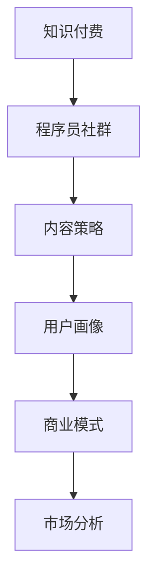

                 

# 知识付费：程序员的社群运营秘籍

> 关键词：知识付费, 程序员, 社群运营, 内容策略, 用户画像, 商业模式, 市场分析

## 1. 背景介绍

### 1.1 问题由来
在信息技术快速发展的今天，程序员面临着技能更新迭代、项目周期缩短、协作难度增大等诸多挑战。如何帮助程序员在有限的时间内提升技能、高效工作，成为各大互联网公司关注的重点。与此同时，知识付费模式正在成为互联网新风口。为此，越来越多的科技公司及创业团队纷纷进入知识付费领域，利用技术手段将优质内容与付费模式结合，打造专业化、定制化的知识服务，满足程序员的成长需求。

### 1.2 问题核心关键点
在知识付费领域，程序员社群运营是一个非常重要的环节。如何精准地定位用户需求、高效地运营社群，通过内容和服务赢得用户，从而实现商业价值的最大化，是每一位知识付费从业者面临的核心问题。

### 1.3 问题研究意义
通过运营程序员社群，为程序员提供精准、专业的知识和技能培训，不仅能够帮助程序员更快地实现职业成长，提高其工作效率和产出，还能够为知识付费平台带来可观的收入和品牌影响，具有重要的研究和实践意义。

## 2. 核心概念与联系

### 2.1 核心概念概述

为更好地理解程序员社群运营，本节将介绍几个密切相关的核心概念：

- **知识付费**：利用互联网技术，将优质内容与付费模式结合，提供付费订阅或单次购买的课程、文章、视频等知识产品，满足用户的学习和成长需求。

- **程序员社群**：由具有相同职业身份和兴趣爱好的程序员群体组成的社区，通过分享知识、交流经验、互相帮助，形成较强的粘性和活跃度。

- **内容策略**：指针对特定目标用户群体，制定并实施的内容创作、分发、传播计划，以达成内容目标。

- **用户画像**：基于用户行为数据和调查分析，构建详细、精准的用户模型，用于指导内容和运营策略。

- **商业模式**：基于知识付费和程序员社群运营，形成的商业模式包括订阅制、按需支付、会员制、打赏制等。

- **市场分析**：对目标市场的需求、竞争、用户行为等进行分析，指导社群运营策略的制定。

这些核心概念之间的逻辑关系可以通过以下Mermaid流程图来展示：



这个流程图展示的知识付费核心概念及其之间的关系：

1. 知识付费提供优质的知识产品。
2. 程序员社群作为目标用户群体，进行内容消费。
3. 内容策略指导内容创作和分发。
4. 用户画像分析用户需求和行为，用于内容定位和优化。
5. 商业模式确定知识付费平台的主要盈利方式。
6. 市场分析指导市场定位和运营策略。

这些概念共同构成了知识付费和程序员社群运营的基本框架，为其发展提供了理论支撑。

## 3. 核心算法原理 & 具体操作步骤

### 3.1 算法原理概述

知识付费平台和程序员社群运营涉及多个环节，包括用户画像构建、内容策略制定、社区管理、商业变现等。这些环节的优化都离不开数据驱动。以下将详细介绍这些环节的数据驱动模型和算法原理。

### 3.2 算法步骤详解

**Step 1: 用户画像构建**

1. **数据采集**：收集用户注册信息、学习行为数据、社群互动数据等，进行综合分析。
2. **特征工程**：对采集到的数据进行清洗和特征提取，构建用户画像的基础特征。
3. **聚类分析**：利用聚类算法将用户分为不同的细分市场，形成用户画像。

**Step 2: 内容策略制定**

1. **需求分析**：通过用户画像和市场分析，识别用户的核心需求和热点话题。
2. **内容定位**：根据需求分析结果，确定内容主题、形式和发布渠道。
3. **内容分发**：利用推荐算法和分发策略，提升内容曝光率和点击率。

**Step 3: 社群管理**

1. **用户互动分析**：分析社群中用户之间的互动行为，识别出活跃用户和意见领袖。
2. **用户参与度提升**：设计互动话题、挑战赛、问答等活动，提高用户参与度。
3. **社群氛围营造**：定期进行社群主题讨论，营造积极的社群氛围。

**Step 4: 商业变现**

1. **收入来源确定**：分析现有用户群体，确定盈利模式。
2. **价格策略制定**：制定合理的单次付费和订阅付费价格。
3. **优惠方案设计**：设计会员专享、新用户优惠等策略，吸引用户付费。

### 3.3 算法优缺点

知识付费和程序员社群运营的数据驱动模型具有以下优点：

- 精准定位：通过用户画像分析，可以精准定位用户需求和热点话题，提高内容的相关性和吸引力。
- 高效运营：利用推荐算法和互动设计，可以提升社群活跃度和用户粘性。
- 商业变现：通过商业分析确定盈利模式和价格策略，实现商业价值的最大化。

同时，该模型也存在一定的局限性：

- 依赖数据质量：如果数据收集不全面、不准确，会导致用户画像和内容策略偏差。
- 隐私保护：收集用户数据需要遵守隐私保护法规，否则可能引发用户流失和法律风险。
- 技术门槛高：构建和维护数据驱动模型需要较高的技术门槛，对于小团队可能较难实现。
- 用户习惯变化：用户的习惯和偏好可能随时发生变化，模型需要持续迭代和优化。

尽管存在这些局限性，但数据驱动模型依然是知识付费和程序员社群运营的主流范式。未来相关研究的重点在于如何进一步降低数据采集成本，提高数据质量，同时兼顾隐私保护和技术可行性的要求。

### 3.4 算法应用领域

知识付费和程序员社群运营的数据驱动模型已经在众多领域得到应用，例如：

- 在线教育平台：通过用户画像和内容策略，提升课程销售量和用户粘性。
- 技术论坛：利用社群管理和互动分析，提高用户参与度和社群活跃度。
- 软件开发社区：通过内容分发和价格策略，实现知识变现。
- 企业培训：利用知识付费和社群运营，提升员工技能水平和业务效率。
- 技术讲座：通过互动设计，提升讲师与学员的互动效果和讲座质量。

除了上述这些经典应用外，知识付费和程序员社群运营的数据驱动模型还将被创新性地应用到更多场景中，如知识图谱构建、AI辅助设计等，为知识付费和技术发展带来新的创新突破。

## 4. 数学模型和公式 & 详细讲解  
### 4.1 数学模型构建

本节将使用数学语言对程序员社群运营中的核心算法进行更加严格的刻画。

记用户画像为 $P$，内容策略为 $S$，社群管理策略为 $G$，商业变现模型为 $M$。通过以下模型对知识付费和程序员社群运营进行描述：

$$
\text{Maximize} \quad \sum_{u \in U} \text{value}_u - \text{cost}_u
$$

其中 $U$ 为用户集合，$\text{value}_u$ 为用户贡献的收入，$\text{cost}_u$ 为运营成本。

### 4.2 公式推导过程

以下我们以用户画像构建为例，推导基于用户行为数据的聚类算法公式。

假设用户集合 $U=\{u_1,u_2,\dots,u_n\}$，每个用户 $u_i$ 的行为数据为 $D_i=\{x_1,x_2,\dots,x_m\}$，其中 $x_j \in \{学习时间,付费次数,评论数量,\dots\}$。

定义用户行为向量 $V_i=[v_{i1},v_{i2},\dots,v_{im}]$，其中 $v_{ij}$ 表示用户 $u_i$ 在行为 $x_j$ 上花费的时间或次数。

假设已知用户行为数据集 $D=\{D_1,D_2,\dots,D_n\}$，则聚类算法的优化目标为：

$$
\mathop{\arg\min}_{C} \sum_{u \in U} \sum_{x \in V} v_{ux}^2
$$

其中 $C$ 为用户聚类标签，$v_{ux}$ 为用户 $u$ 在行为 $x$ 上的聚类标签贡献值。

为了实现上述优化目标，可以使用K-means算法。其核心步骤包括：

1. **初始化聚类中心**：随机选择K个初始聚类中心。
2. **分配行为数据**：将用户行为数据分配到最近的聚类中心。
3. **重新计算聚类中心**：根据分配结果重新计算每个聚类中心的位置。
4. **迭代更新**：重复2和3步骤，直到聚类中心不再发生变化。

### 4.3 案例分析与讲解

假设我们有一家知识付费平台，收集到部分用户的注册信息和学习行为数据。现需要通过聚类分析，将用户分为不同的细分市场，为内容策略制定和社群管理提供支持。

我们可以将用户的注册信息（如职位、公司、行业等）和行为数据（如课程学习时间、付费次数、互动行为等）作为输入，应用K-means算法进行聚类。具体的聚类过程如下：

1. **初始化聚类中心**：随机选择K个初始聚类中心，每个中心代表一个未知的细分市场。
2. **分配行为数据**：将每个用户的行为数据分配到最近的聚类中心，构建用户-聚类中心关联矩阵。
3. **重新计算聚类中心**：根据用户行为数据和聚类中心关联矩阵，重新计算每个聚类中心的位置。
4. **迭代更新**：重复2和3步骤，直到聚类中心不再变化，得到最终的聚类结果。

最终，我们可以得到不同细分市场的用户画像，分别为：

- **初级开发者**：职位为初级开发，公司规模较小，对新技术和开源项目较为感兴趣。
- **中级开发者**：职位为中级开发，公司规模中等，对技术架构和项目管理有深入理解。
- **高级开发者**：职位为高级开发，公司规模较大，对前沿技术和性能优化有较高要求。

通过这些用户画像，知识付费平台可以制定相应的内容策略，如：

- 初级开发者适合学习基础编程和框架课程。
- 中级开发者适合学习高级架构和算法课程。
- 高级开发者适合学习深度学习和大数据课程。

## 5. 项目实践：代码实例和详细解释说明
### 5.1 开发环境搭建

在进行程序员社群运营的数据驱动模型实现前，我们需要准备好开发环境。以下是使用Python进行Pandas和Scikit-learn库开发的Python环境配置流程：

1. 安装Anaconda：从官网下载并安装Anaconda，用于创建独立的Python环境。

2. 创建并激活虚拟环境：
```bash
conda create -n pyproject python=3.8 
conda activate pyproject
```

3. 安装Pandas：
```bash
pip install pandas
```

4. 安装Scikit-learn：
```bash
pip install scikit-learn
```

5. 安装各类工具包：
```bash
pip install numpy matplotlib seaborn sklearn
```

完成上述步骤后，即可在`pyproject-env`环境中开始数据驱动模型开发。

### 5.2 源代码详细实现

下面我们以用户画像构建为例，给出使用Pandas和Scikit-learn库对用户数据进行聚类分析的Python代码实现。

首先，定义用户行为数据集：

```python
import pandas as pd
import numpy as np

# 加载用户行为数据集
user_data = pd.read_csv('user_behavior.csv', sep=',')
```

然后，构建行为数据矩阵：

```python
# 定义行为特征列
features = ['study_time', 'paid_courses', 'comment_count']

# 构建行为数据矩阵
X = user_data[features].values
```

接着，应用K-means算法进行聚类分析：

```python
from sklearn.cluster import KMeans

# 初始化K-means模型
kmeans = KMeans(n_clusters=3, random_state=42)

# 应用K-means算法
kmeans.fit(X)

# 获取聚类结果
labels = kmeans.labels_
```

最后，对聚类结果进行可视化展示：

```python
import matplotlib.pyplot as plt

# 定义不同聚类中心的坐标
centers = kmeans.cluster_centers_

# 定义颜色映射
colors = ['red', 'green', 'blue']

# 绘制散点图
plt.scatter(X[:,0], X[:,1], c=colors[labels], cmap='viridis')

# 绘制聚类中心
plt.scatter(centers[:,0], centers[:,1], c='black', marker='x')

# 显示图例
plt.legend(['Cluster 1', 'Cluster 2', 'Cluster 3'])

# 显示图像
plt.show()
```

以上就是使用Python对用户数据进行聚类分析的完整代码实现。可以看到，利用Pandas和Scikit-learn库，用户画像构建的过程变得简洁高效。

### 5.3 代码解读与分析

让我们再详细解读一下关键代码的实现细节：

**数据加载与预处理**：
- `pd.read_csv`方法：用于加载用户行为数据集，通过指定分隔符将CSV文件中的数据读取为Pandas DataFrame对象。
- `features`变量：定义了需要用于聚类分析的行为特征列。
- `X`变量：通过`user_data` DataFrame对象选择指定特征列，并转换为NumPy数组。

**K-means算法应用**：
- `KMeans`类：用于构建K-means聚类模型，指定聚类数目为3。
- `fit`方法：将行为数据矩阵`X`输入到K-means模型中，应用聚类算法得到聚类结果。
- `labels`变量：获取每个用户的聚类标签。

**可视化展示**：
- `plt.scatter`方法：用于绘制散点图，标记不同聚类中心的坐标。
- `colors`变量：定义了聚类标签对应的颜色。
- `cmap`参数：用于设置颜色映射。
- `legend`方法：用于显示图例，标识不同的聚类。

通过上述代码实现，我们可以看到，用户画像构建的数学模型和算法原理可以通过Python代码实现，而且过程非常简洁。未来，在实际应用中，我们还需要进一步优化数据驱动模型的各个环节，如选择合适的聚类算法、优化数据特征提取等，以提高模型精度和效率。

## 6. 实际应用场景
### 6.1 在线教育平台

在线教育平台利用程序员社群运营的数据驱动模型，通过精准定位用户需求和行为，制定个性化的学习方案，提高课程销售量和用户粘性。例如，某在线教育平台通过聚类分析，发现大部分用户对编程框架和数据结构有较深的兴趣，进而推出相关课程，并在社群中宣传，提升了课程的销售量。

### 6.2 技术论坛

技术论坛通过数据驱动模型，利用用户互动分析，引导社区内高质量内容发布和讨论。例如，某技术论坛通过分析用户互动行为，识别出活跃用户和意见领袖，在社区内定期发布热门话题，引发用户讨论和反馈，提高了论坛的活跃度和用户参与度。

### 6.3 软件开发社区

软件开发社区利用数据驱动模型，通过内容分发和价格策略，实现知识变现。例如，某软件开发社区通过数据分析，发现大部分用户对算法和架构有较高的需求，推出相关课程和书籍，并根据用户购买行为定价，实现了社群内部的付费模式。

### 6.4 企业培训

企业培训通过数据驱动模型，利用知识付费和社群运营，提升员工技能水平和业务效率。例如，某企业利用数据驱动模型分析员工行为，发现大部分员工对新技术和工具有较高的学习需求，推出相关培训课程，并根据学习效果付费，实现了企业内部知识的有效传递和应用。

### 6.5 技术讲座

技术讲座通过数据驱动模型，利用互动设计，提升讲师与学员的互动效果和讲座质量。例如，某技术讲座平台通过数据分析，识别出高互动率的讲师和热门话题，安排相关讲师进行讲座，并在社群内推广，提高了讲座的参与率和满意度。

## 7. 工具和资源推荐
### 7.1 学习资源推荐

为了帮助开发者系统掌握程序员社群运营的理论基础和实践技巧，这里推荐一些优质的学习资源：

1. **《数据科学与算法》系列课程**：清华大学开设的在线课程，涵盖数据分析、机器学习、统计学等基础知识，适合入门和进阶学习。

2. **《Python数据科学手册》**：由数据科学家撰写，全面介绍了Python在数据科学中的各种应用，包括数据清洗、可视化、建模等。

3. **《Scikit-learn官方文档》**：Scikit-learn库的官方文档，提供了丰富的学习资源和样例代码，适合深入学习。

4. **Kaggle竞赛**：全球最大的数据科学竞赛平台，参与Kaggle竞赛可以积累实战经验，提升数据分析能力。

5. **Coursera《数据科学导论》课程**：由业界专家开设的在线课程，涵盖数据分析和数据可视化的基本概念和技巧。

6. **Medium博客**：一篇篇高质量的博客文章，覆盖数据科学和程序员社群运营的各类主题，值得定期阅读。

通过对这些资源的学习实践，相信你一定能够快速掌握程序员社群运营的理论基础和实践技巧，并用于解决实际的社群运营问题。

### 7.2 开发工具推荐

高效的开发离不开优秀的工具支持。以下是几款用于程序员社群运营开发的常用工具：

1. **Pandas**：用于数据清洗、处理和分析的Python库，能够高效地进行数据操作和分析。

2. **Scikit-learn**：用于机器学习建模和算法的Python库，提供丰富的分类、聚类、回归等算法。

3. **Jupyter Notebook**：Python开发中的主流交互式环境，支持代码编写、数据可视化、结果展示等。

4. **Tableau**：商业智能和数据可视化工具，用于生成交互式数据报表和可视化图表。

5. **Google Analytics**：数据分析工具，用于跟踪和分析网站访问者的行为和流量。

6. **Google Trends**：市场分析工具，用于分析搜索趋势，了解用户兴趣和需求。

合理利用这些工具，可以显著提升程序员社群运营的开发效率，加快创新迭代的步伐。

### 7.3 相关论文推荐

程序员社群运营的数据驱动模型已经引起了学界的广泛关注，以下是几篇具有代表性的相关论文，推荐阅读：

1. **《用户行为分析在知识付费平台中的应用》**：研究了基于用户行为数据的用户画像构建和聚类分析，提出了改进用户画像的算法。

2. **《基于机器学习的知识付费平台推荐系统》**：介绍了利用推荐算法和用户画像提升内容推荐效果的方法，给出了推荐系统的详细实现。

3. **《数据驱动的程序员社群管理策略》**：分析了程序员社群中用户行为和互动数据，提出了通过数据驱动优化社群运营的策略。

4. **《知识付费平台商业变现模型研究》**：介绍了知识付费平台的收入来源和定价策略，提出了多种商业变现方案。

这些论文代表了大数据在程序员社群运营中的前沿应用，通过学习这些前沿成果，可以帮助研究者把握学科前进方向，激发更多的创新灵感。

## 8. 总结：未来发展趋势与挑战

### 8.1 总结

本文对程序员社群运营的数据驱动模型进行了全面系统的介绍。首先阐述了知识付费和程序员社群运营的背景和意义，明确了数据驱动模型在精准定位、高效运营、商业变现等方面的独特价值。其次，从原理到实践，详细讲解了数据驱动模型的构建过程，给出了详细的代码实现和解读。同时，本文还广泛探讨了数据驱动模型在多个场景中的应用，展示了其广阔的应用前景。

通过本文的系统梳理，可以看到，数据驱动模型在程序员社群运营中发挥着重要作用，通过精准定位用户需求、高效运营社群、优化商业变现，极大地提升了知识付费平台的竞争力。未来，随着数据驱动技术的不断进步，知识付费和程序员社群运营将迎来更多创新突破，带来更加丰富、多样化的服务体验。

### 8.2 未来发展趋势

展望未来，程序员社群运营的数据驱动模型将呈现以下几个发展趋势：

1. **智能推荐系统**：通过深度学习技术，利用用户行为数据，实现更加精准的内容推荐和个性化服务。

2. **多模态数据融合**：结合文本、图像、视频等多种数据源，进行多模态数据分析和聚类，提升用户画像的丰富性和准确性。

3. **实时分析与优化**：通过实时数据分析和优化，动态调整内容和运营策略，及时应对用户需求的变化。

4. **用户行为预测**：利用机器学习技术，对用户行为进行预测和建模，提前制定优化策略，提升用户满意度。

5. **社交网络分析**：利用社交网络分析技术，识别社区内意见领袖和关键用户，进行定向推广和互动。

6. **用户情感分析**：通过对用户评论和反馈的情感分析，及时调整内容和运营策略，提升用户体验。

这些趋势凸显了数据驱动模型在程序员社群运营中的重要价值。这些方向的探索发展，必将进一步提升知识付费平台的性能和用户体验，为程序员群体提供更加精准、高效的服务。

### 8.3 面临的挑战

尽管数据驱动模型在程序员社群运营中已经取得了显著效果，但在迈向更加智能化、普适化应用的过程中，它仍面临诸多挑战：

1. **数据隐私保护**：在收集用户数据时，需要遵守隐私保护法规，否则可能引发用户流失和法律风险。

2. **数据质量控制**：如果数据收集不全面、不准确，会导致用户画像和内容策略偏差，影响模型的效果。

3. **算法复杂度**：数据分析和模型构建需要较高的技术门槛，对于小团队可能较难实现。

4. **模型稳定性**：模型的稳定性和鲁棒性需要进一步验证，确保其在不同场景下的一致性。

5. **算法透明度**：数据驱动模型往往是"黑盒"系统，难以解释其内部工作机制和决策逻辑，影响用户信任度。

6. **成本控制**：数据采集、模型构建和运营维护需要大量的时间和成本，需要进行合理控制。

尽管存在这些挑战，但数据驱动模型依然是程序员社群运营的主流范式。未来相关研究的重点在于如何进一步降低数据采集成本，提高数据质量，同时兼顾隐私保护和技术可行性的要求。

### 8.4 研究展望

面对程序员社群运营所面临的种种挑战，未来的研究需要在以下几个方面寻求新的突破：

1. **自动化数据采集与处理**：引入自动化工具和算法，提高数据收集和处理的效率，降低人工成本。

2. **实时数据流分析**：利用大数据技术，进行实时数据流分析，提升数据分析的及时性和准确性。

3. **跨模态数据融合**：结合多种数据源，进行多模态数据分析，提升用户画像的全面性和准确性。

4. **可解释性增强**：引入可解释性技术，增强模型的透明度和可解释性，提升用户信任度。

5. **隐私保护机制**：开发隐私保护算法，确保用户数据的隐私和安全。

6. **成本效益分析**：进行成本效益分析，制定合理的运营策略，提高投资回报率。

这些研究方向的探索，必将引领程序员社群运营的数据驱动技术迈向更高的台阶，为知识付费平台带来新的突破和创新。面向未来，程序员社群运营需要从数据、算法、技术等多个维度协同发力，共同推动其发展，带来更加全面、高效的解决方案。

## 9. 附录：常见问题与解答

**Q1: 程序员社群运营的数据驱动模型是否适用于所有场景？**

A: 数据驱动模型适用于大部分知识付费场景，但在某些特殊场景中可能需要进行调整。例如，对于高度定制化的课程或服务，数据驱动模型可能无法满足需求。此时，需要结合专家知识和用户反馈进行优化。

**Q2: 数据驱动模型在社群运营中如何避免隐私泄露？**

A: 数据驱动模型在数据采集和处理过程中，需要严格遵守隐私保护法规，如GDPR、CCPA等。通过数据匿名化、去标识化等技术手段，保护用户隐私。同时，对于涉及敏感数据的行为需要进行严格审核和控制。

**Q3: 如何提高数据驱动模型的稳定性？**

A: 提高数据驱动模型的稳定性，需要从数据质量控制、算法优化、模型评估等多个环节进行综合优化。例如，采用多模型融合技术，增强模型的鲁棒性。通过持续监控和反馈，及时调整和优化模型。

**Q4: 如何增强数据驱动模型的可解释性？**

A: 增强数据驱动模型的可解释性，需要引入可解释性技术，如LIME、SHAP等。这些技术可以生成模型预测的特征重要性、局部解释等，帮助用户理解模型的决策过程。

**Q5: 如何控制数据驱动模型的成本？**

A: 控制数据驱动模型的成本，需要优化数据采集、处理和模型构建的流程。例如，引入自动化工具和算法，提高效率。通过成本效益分析，选择合理的数据采集和模型构建策略，避免过度投入。

通过这些问题的解答，我们能够更全面地理解程序员社群运营的数据驱动模型，掌握其应用技巧，为实际应用提供有力支持。总之，数据驱动模型在程序员社群运营中具有重要价值，但其发展也面临诸多挑战，未来需要在多个方面进行深入研究和探索。

---

作者：禅与计算机程序设计艺术 / Zen and the Art of Computer Programming

