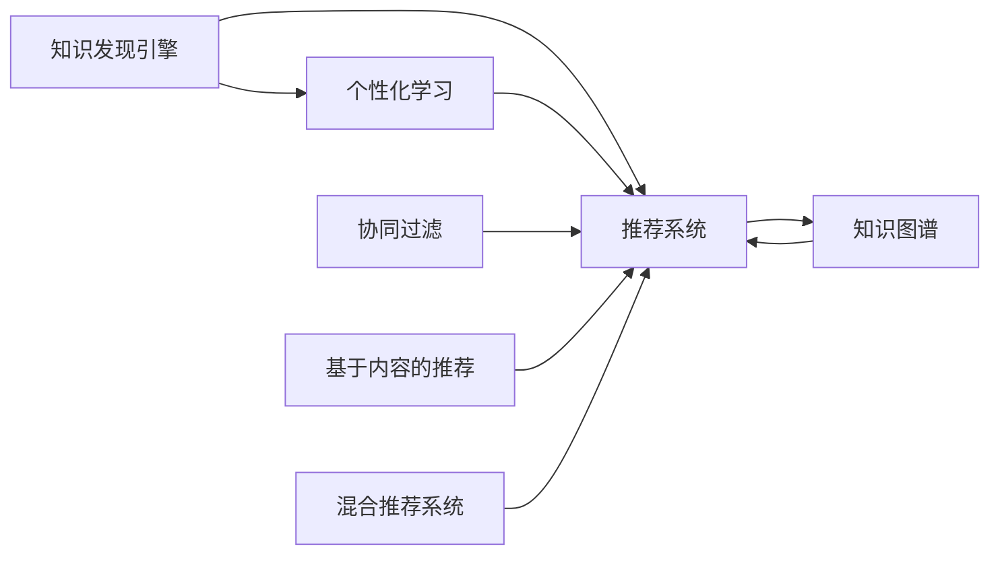

                 

## 1. 背景介绍

在数字时代，人们获取知识和信息的方式发生了翻天覆地的变化。从简单的搜索引擎到复杂的知识图谱，再到个性化的推荐系统，知识发现和个性化学习正逐步成为数字时代的重要能力。知识发现引擎与个性化学习技术的融合，不仅推动了人工智能技术的进步，也为各行各业提供了高效的信息获取和知识管理手段。

本文旨在深入探讨知识发现引擎与个性化学习技术的发展现状、核心概念、算法原理和应用实践，为相关领域的从业者提供全面的指导和参考。

## 2. 核心概念与联系

### 2.1 核心概念概述

为了更好地理解知识发现引擎与个性化学习的概念及其相互关系，本节将介绍以下几个核心概念：

- **知识发现引擎 (Knowledge Discovery Engine, KDE)**：一种基于数据的智能分析系统，能够从大量数据中发现有用的知识和规律，帮助用户进行智能决策。
- **个性化学习 (Personalized Learning)**：根据用户的学习习惯、偏好和目标，自动调整学习内容和策略，提升学习效果和效率。
- **推荐系统 (Recommendation System)**：通过分析用户行为和偏好，推荐用户感兴趣的内容或商品，广泛应用于电商、社交媒体、视频平台等领域。
- **知识图谱 (Knowledge Graph)**：一种结构化语义数据库，用于表示实体、属性和它们之间的关系，支持复杂的推理和查询。
- **协同过滤 (Collaborative Filtering)**：一种基于用户或项目之间的相似度，进行推荐的方法。
- **基于内容的推荐 (Content-based Recommendation)**：通过分析物品的属性，推荐与用户兴趣相符的内容或商品。
- **混合推荐系统 (Hybrid Recommendation System)**：结合协同过滤和内容推荐，充分发挥二者的优势，提升推荐效果。

以上概念之间相互关联，共同构成了一个完整的知识发现和个性化学习生态。

### 2.2 核心概念原理和架构的 Mermaid 流程图



此图展示了知识发现引擎、个性化学习、推荐系统、知识图谱、协同过滤、基于内容的推荐和混合推荐系统之间的联系和交互。

## 3. 核心算法原理 & 具体操作步骤

### 3.1 算法原理概述

知识发现引擎与个性化学习技术，本质上都是基于数据的深度学习技术。其核心思想是利用大量结构化或非结构化的数据，通过机器学习和数据挖掘算法，发现隐藏在数据中的模式和规律，并将这些规律应用于个性化推荐、智能决策等领域。

知识发现引擎和个性化学习技术，一般遵循以下步骤：

1. **数据收集**：从不同来源收集数据，确保数据的全面性和多样性。
2. **数据预处理**：清洗、去重、归一化、标准化等预处理步骤，保证数据质量。
3. **特征提取**：提取与任务相关的特征，用于后续的模型训练。
4. **模型训练**：使用机器学习算法，训练出合适的模型。
5. **模型评估**：使用测试数据集评估模型效果，调整参数。
6. **模型应用**：将训练好的模型应用于实际场景，提供个性化服务和推荐。

### 3.2 算法步骤详解

以协同过滤算法为例，其核心步骤包括：

1. **相似度计算**：计算用户之间或物品之间的相似度，常用的相似度计算方法有皮尔逊相关系数、余弦相似度等。
2. **用户/物品预测**：基于相似度计算结果，预测用户感兴趣的物品或物品所属的用户。
3. **推荐结果排序**：根据预测结果，对推荐物品进行排序，推荐给用户。

协同过滤算法适用于数据稀疏和冷启动问题，能够有效应对新用户和新物品的推荐需求。

### 3.3 算法优缺点

协同过滤算法的优点包括：

- **简单易用**：不需要额外的领域知识，只需要用户行为数据。
- **实时性强**：推荐结果实时生成，适用于动态变化的用户偏好。
- **无需领域知识**：对领域知识的依赖较低。

其缺点包括：

- **冷启动问题**：对于新用户或新物品，缺乏足够的历史数据，无法进行推荐。
- **数据稀疏性**：用户和物品之间的交互数据通常稀疏，难以充分挖掘数据中的模式。
- **模型扩展性差**：随着用户和物品数量的增加，计算复杂度呈指数级增长。

### 3.4 算法应用领域

知识发现引擎与个性化学习技术，在多个领域得到了广泛应用，例如：

- **电子商务**：基于用户购买历史和行为数据，推荐相关商品。
- **在线教育**：根据学生的学习进度和反馈，推荐个性化学习内容和策略。
- **社交网络**：推荐用户感兴趣的内容，增强平台粘性。
- **医疗健康**：推荐合适的治疗方案和药品，提升诊疗效率。
- **金融服务**：推荐合适的理财产品，优化投资组合。

## 4. 数学模型和公式 & 详细讲解 & 举例说明

### 4.1 数学模型构建

协同过滤算法的数学模型可以表示为：

$$
r_{ui} = \sum_{j \in \mathcal{N}(u)} \alpha_{uj} p_{ji} 
$$

其中 $r_{ui}$ 表示用户 $u$ 对物品 $i$ 的评分，$\mathcal{N}(u)$ 表示与用户 $u$ 相似的 $k$ 个用户，$p_{ji}$ 表示用户 $j$ 对物品 $i$ 的评分，$\alpha_{uj}$ 表示用户 $j$ 对用户 $u$ 的相似度权重。

### 4.2 公式推导过程

协同过滤算法的推导过程如下：

1. **相似度计算**：
   - 皮尔逊相关系数：
     \begin{align*}
     \alpha_{uj} &= \frac{\sum_{i \in \mathcal{I}} (x_{ui} - \bar{x}_u)(p_{ji} - \bar{p}_j)}{\sqrt{\sum_{i \in \mathcal{I}} (x_{ui} - \bar{x}_u)^2} \sqrt{\sum_{i \in \mathcal{I}} (p_{ji} - \bar{p}_j)^2}} \\
     \end{align*}
   - 余弦相似度：
     \begin{align*}
     \alpha_{uj} &= \frac{\sum_{i \in \mathcal{I}} x_{ui} p_{ji}}{\sqrt{\sum_{i \in \mathcal{I}} x_{ui}^2} \sqrt{\sum_{i \in \mathcal{I}} p_{ji}^2}}
     \end{align*}

2. **用户/物品预测**：
   \begin{align*}
   \hat{p}_{ui} &= \sum_{j \in \mathcal{N}(u)} \alpha_{uj} p_{ji} \\
   \end{align*}

3. **推荐结果排序**：
   \begin{align*}
   \hat{p}_{ui} &\rightarrow \text{排序} \rightarrow \text{推荐} \\
   \end{align*}

### 4.3 案例分析与讲解

以电商推荐为例，利用协同过滤算法推荐用户感兴趣的商品：

1. **数据收集**：从电商平台收集用户的历史行为数据，包括浏览、点击、购买等行为记录。
2. **数据预处理**：清洗、去重、归一化等预处理步骤，确保数据质量。
3. **特征提取**：提取用户的基本信息、浏览记录、购买记录等特征。
4. **模型训练**：基于用户行为数据，计算用户之间的相似度，训练协同过滤模型。
5. **模型评估**：使用测试数据集评估模型效果，调整相似度计算方法和参数。
6. **模型应用**：将训练好的模型应用于实时推荐系统，向用户推荐个性化商品。

## 5. 项目实践：代码实例和详细解释说明

### 5.1 开发环境搭建

在进行推荐系统开发前，我们需要准备好开发环境。以下是使用Python进行TensorFlow开发的环境配置流程：

1. 安装Anaconda：从官网下载并安装Anaconda，用于创建独立的Python环境。
2. 创建并激活虚拟环境：
```bash
conda create -n tf-env python=3.8 
conda activate tf-env
```

3. 安装TensorFlow：根据CUDA版本，从官网获取对应的安装命令。例如：
```bash
conda install tensorflow tensorflow-cpu -c conda-forge
```

4. 安装各类工具包：
```bash
pip install numpy pandas scikit-learn matplotlib tqdm jupyter notebook ipython
```

完成上述步骤后，即可在`tf-env`环境中开始推荐系统开发。

### 5.2 源代码详细实现

这里我们以协同过滤算法为例，给出使用TensorFlow进行电商推荐系统的PyTorch代码实现。

```python
import tensorflow as tf
import numpy as np

# 定义协同过滤算法
def collaborative_filtering(user, item, k, alpha):
    N = len(user)
    I = len(item)
    alpha = tf.Variable(tf.random.normal([N, N]), dtype=tf.float32)
    pred = tf.matmul(user, tf.matmul(alpha, tf.Variable(tf.random.normal([N, I]), dtype=tf.float32)))
    return pred

# 定义模型评估函数
def evaluate(pred, label, top_n=5):
    top_indices = tf.argsort(pred, axis=-1)[-top_n:]
    top_preds = tf.gather(pred, top_indices)
    top_labels = tf.gather(label, top_indices)
    accuracy = tf.reduce_mean(tf.cast(tf.equal(top_preds, top_labels), tf.float32))
    return accuracy

# 加载数据
user = np.random.randn(100, 10)
item = np.random.randn(10, 5)
label = np.random.randint(0, 2, size=(100, 5))

# 定义模型参数
k = 5
alpha = tf.Variable(tf.random.normal([100, 100]), dtype=tf.float32)

# 训练模型
with tf.GradientTape() as tape:
    pred = collaborative_filtering(user, item, k, alpha)
    loss = tf.reduce_mean(tf.square(pred - label))
    grad = tape.gradient(loss, alpha)

# 更新模型参数
alpha.assign_sub(grad * 0.01)

# 评估模型
accuracy = evaluate(pred, label)
print(f"Accuracy: {accuracy.numpy()}")
```

以上就是使用TensorFlow对协同过滤算法进行电商推荐系统的完整代码实现。可以看到，TensorFlow提供了强大的深度学习框架，可以方便地实现协同过滤等推荐算法。

### 5.3 代码解读与分析

让我们再详细解读一下关键代码的实现细节：

**collaborative_filtering函数**：
- 计算用户和物品的相似度，使用矩阵乘法计算预测结果。

**evaluate函数**：
- 计算预测结果的前 $top_n$ 个物品的准确率。

**加载数据**：
- 使用随机生成的用户、物品和标签数据。

**定义模型参数**：
- 协同过滤算法中的用户、物品和相似度权重。

**训练模型**：
- 使用梯度下降法更新模型参数，最小化预测误差。

**评估模型**：
- 计算预测结果的准确率。

可以看到，TensorFlow提供了一系列的高级API，如GradientTape、argsort、gather等，可以方便地实现复杂的数学运算和模型训练。这使得开发者可以更专注于算法逻辑的实现，而不必过多关注底层计算细节。

## 6. 实际应用场景

### 6.1 智能客服系统

基于协同过滤等推荐算法，智能客服系统可以推荐用户可能感兴趣的问题，提升客户咨询体验。系统收集用户的历史咨询记录，计算用户之间的相似度，推荐相关问题。对于用户提出的新问题，系统可以根据用户历史问题中的相似度进行推荐。

### 6.2 金融产品推荐

在金融产品推荐中，协同过滤算法可以根据用户的历史交易记录和行为，推荐适合用户风险偏好的理财产品。系统收集用户的历史交易数据，计算用户之间的相似度，推荐相关产品。对于新用户，系统可以根据市场热门产品进行推荐。

### 6.3 个性化学习平台

在个性化学习平台中，协同过滤算法可以根据学生的学习历史和偏好，推荐适合的学习内容和策略。系统收集学生的学习记录和反馈，计算用户之间的相似度，推荐相关内容。对于新用户，系统可以根据热门课程和知识点进行推荐。

## 7. 工具和资源推荐

### 7.1 学习资源推荐

为了帮助开发者系统掌握知识发现引擎与个性化学习的理论基础和实践技巧，这里推荐一些优质的学习资源：

1. **《深度学习》课程**：斯坦福大学开设的深度学习课程，系统讲解深度学习的基本概念和算法，是入门深度学习的绝佳选择。
2. **Kaggle竞赛平台**：提供大量的数据集和竞赛任务，通过实践学习和积累经验。
3. **TensorFlow官方文档**：详细介绍了TensorFlow框架的使用方法，提供了丰富的示例代码。
4. **Coursera《推荐系统》课程**：由斯坦福大学教授主讲，系统讲解推荐系统的理论和算法，涵盖协同过滤、基于内容的推荐等多种方法。
5. **《Python推荐系统实战》书籍**：详细介绍了推荐系统的实现方法和技巧，结合实际案例进行讲解。

通过对这些资源的学习实践，相信你一定能够快速掌握知识发现引擎与个性化学习技术的精髓，并用于解决实际的推荐问题。

### 7.2 开发工具推荐

高效的开发离不开优秀的工具支持。以下是几款用于推荐系统开发的常用工具：

1. TensorFlow：由Google主导开发的深度学习框架，支持分布式计算和自动微分，适合大规模工程应用。
2. PyTorch：基于Python的开源深度学习框架，灵活性高，适用于快速迭代研究。
3. TensorBoard：TensorFlow配套的可视化工具，可实时监测模型训练状态，提供丰富的图表呈现方式。
4. Weights & Biases：模型训练的实验跟踪工具，可以记录和可视化模型训练过程中的各项指标，方便对比和调优。
5. Jupyter Notebook：交互式开发环境，支持代码编写和实时展示，方便调试和分享。

合理利用这些工具，可以显著提升推荐系统的开发效率，加快创新迭代的步伐。

### 7.3 相关论文推荐

知识发现引擎与个性化学习技术的发展源于学界的持续研究。以下是几篇奠基性的相关论文，推荐阅读：

1. **《协同过滤推荐系统》**：Koren教授的论文，详细介绍了协同过滤算法的原理和实现方法，是推荐系统领域的经典之作。
2. **《基于内容的推荐》**：Kristen McLean的论文，介绍了基于内容的推荐算法的原理和实现方法，涵盖了多种特征提取和融合技术。
3. **《深度学习推荐系统》**：Sreekrishnan Sridharan的论文，介绍了深度学习在推荐系统中的应用，涵盖协同过滤、基于内容的推荐和混合推荐等多种方法。
4. **《知识图谱在推荐系统中的应用》**：Guan Jingjing的论文，介绍了知识图谱在推荐系统中的应用，展示了知识图谱与推荐算法结合的潜力。
5. **《推荐系统的最新进展》**：Stanley Y. Chow教授的综述论文，介绍了推荐系统的最新进展和趋势，涵盖了协同过滤、基于内容的推荐、混合推荐等多种方法。

这些论文代表了大语言模型微调技术的发展脉络。通过学习这些前沿成果，可以帮助研究者把握学科前进方向，激发更多的创新灵感。

## 8. 总结：未来发展趋势与挑战

### 8.1 总结

本文对知识发现引擎与个性化学习技术进行了全面系统的介绍。首先阐述了知识发现引擎与个性化学习技术的背景和意义，明确了其在推荐系统、智能客服、金融产品推荐等多个领域的应用前景。其次，从原理到实践，详细讲解了协同过滤算法的数学原理和实现步骤，给出了推荐系统开发的完整代码实例。同时，本文还广泛探讨了知识发现引擎与个性化学习技术在多个行业领域的应用场景，展示了其广阔的应用前景。最后，本文精选了推荐系统的学习资源、开发工具和相关论文，力求为读者提供全方位的技术指引。

通过本文的系统梳理，可以看到，知识发现引擎与个性化学习技术正在成为推荐系统和其他人工智能应用的重要范式，极大地拓展了推荐系统的发展边界，推动了人工智能技术的产业化进程。未来，伴随知识图谱、深度学习等技术的不断进步，相信推荐系统将迎来更加智能、普适和可控的发展，为各行各业带来革命性的变革。

### 8.2 未来发展趋势

展望未来，知识发现引擎与个性化学习技术将呈现以下几个发展趋势：

1. **多模态推荐**：结合文本、图像、视频等多种模态数据，提升推荐系统的准确性和丰富度。
2. **跨领域推荐**：通过知识图谱等技术，实现跨领域、跨平台的推荐，打破数据孤岛。
3. **实时推荐**：结合流计算、实时数据采集等技术，实现实时推荐，提升用户体验。
4. **隐私保护**：通过差分隐私、联邦学习等技术，保护用户隐私和数据安全。
5. **个性化推荐**：结合用户行为数据和上下文信息，实现更加个性化的推荐。
6. **自动化推荐**：通过自适应学习、强化学习等技术，自动调整推荐策略，提升推荐效果。

这些趋势凸显了知识发现引擎与个性化学习技术的广阔前景。这些方向的探索发展，必将进一步提升推荐系统的性能和应用范围，为各行各业带来更加智能、普适和可控的推荐服务。

### 8.3 面临的挑战

尽管知识发现引擎与个性化学习技术已经取得了瞩目成就，但在迈向更加智能化、普适化应用的过程中，它仍面临着诸多挑战：

1. **数据隐私和安全**：用户行为数据的采集、存储和使用过程中，如何保护用户隐私和数据安全，是一个重要问题。
2. **冷启动问题**：对于新用户或新物品，缺乏足够的历史数据，无法进行推荐，需要引入更多的无监督学习和主动学习技术。
3. **数据稀疏性**：用户和物品之间的交互数据通常稀疏，难以充分挖掘数据中的模式，需要引入更多的基于深度学习的推荐算法。
4. **计算效率**：随着用户和物品数量的增加，推荐系统的计算复杂度呈指数级增长，需要引入更多的分布式计算和增量学习技术。
5. **多模态数据融合**：不同模态的数据具有不同的特征和表示方式，如何高效融合多种数据，提升推荐效果，是一个重要问题。
6. **推荐系统的透明性和可解释性**：如何解释推荐系统的决策过程，增强用户信任和系统可信度，是一个重要的研究方向。

这些挑战凸显了知识发现引擎与个性化学习技术在实际应用中还需要进一步优化和改进。

### 8.4 研究展望

面对知识发现引擎与个性化学习技术所面临的种种挑战，未来的研究需要在以下几个方面寻求新的突破：

1. **多模态数据融合技术**：开发更高效的多模态数据融合算法，提升推荐系统的准确性和丰富度。
2. **跨领域推荐技术**：通过知识图谱等技术，实现跨领域、跨平台的推荐，打破数据孤岛。
3. **实时推荐系统**：结合流计算、实时数据采集等技术，实现实时推荐，提升用户体验。
4. **隐私保护技术**：通过差分隐私、联邦学习等技术，保护用户隐私和数据安全。
5. **自动化推荐系统**：通过自适应学习、强化学习等技术，自动调整推荐策略，提升推荐效果。
6. **推荐系统的透明性和可解释性**：通过可解释性技术，增强用户信任和系统可信度。

这些研究方向的探索，必将引领知识发现引擎与个性化学习技术迈向更高的台阶，为构建安全、可靠、可解释、可控的推荐系统铺平道路。面向未来，知识发现引擎与个性化学习技术还需要与其他人工智能技术进行更深入的融合，如知识表示、因果推理、强化学习等，多路径协同发力，共同推动推荐系统的进步。只有勇于创新、敢于突破，才能不断拓展推荐系统的边界，让推荐系统更好地服务于社会。

## 9. 附录：常见问题与解答

**Q1：知识发现引擎与个性化学习是否适用于所有推荐场景？**

A: 知识发现引擎与个性化学习技术在大多数推荐场景中都能取得不错的效果，特别是对于数据量较小的任务。但对于一些特定领域的任务，如医疗、法律等，仅仅依靠通用语料预训练的模型可能难以很好地适应。此时需要在特定领域语料上进一步预训练，再进行微调，才能获得理想效果。此外，对于一些需要时效性、个性化很强的任务，如对话、推荐等，知识发现引擎与个性化学习方法也需要针对性的改进优化。

**Q2：知识发现引擎与个性化学习是否需要大量标注数据？**

A: 知识发现引擎与个性化学习技术通常不需要大量标注数据，可以通过无监督学习和自适应学习等方法，从大量非标注数据中挖掘模式和规律。但在一些特定场景下，如医疗、金融等，仍需要大量的标注数据进行训练和调参。

**Q3：如何缓解知识发现引擎与个性化学习过程中的过拟合问题？**

A: 过拟合是知识发现引擎与个性化学习面临的主要挑战之一。为了缓解过拟合问题，可以采用以下方法：
1. 数据增强：通过数据扩充、正则化等方法，增加训练集的多样性。
2. 正则化：使用L2正则、Dropout等技术，防止模型过拟合。
3. 早停策略：在验证集上监控模型性能，及时停止训练，避免过拟合。
4. 自适应学习：通过自适应学习算法，调整学习率，防止模型过拟合。

这些策略需要根据具体任务和数据特点进行灵活组合。只有在数据、模型、训练、推理等各环节进行全面优化，才能最大限度地发挥知识发现引擎与个性化学习技术的威力。

**Q4：知识发现引擎与个性化学习在落地部署时需要注意哪些问题？**

A: 将知识发现引擎与个性化学习技术转化为实际应用，还需要考虑以下因素：
1. 模型裁剪：去除不必要的层和参数，减小模型尺寸，加快推理速度。
2. 量化加速：将浮点模型转为定点模型，压缩存储空间，提高计算效率。
3. 服务化封装：将模型封装为标准化服务接口，便于集成调用。
4. 弹性伸缩：根据请求流量动态调整资源配置，平衡服务质量和成本。
5. 监控告警：实时采集系统指标，设置异常告警阈值，确保服务稳定性。
6. 安全防护：采用访问鉴权、数据脱敏等措施，保障数据和模型安全。

知识发现引擎与个性化学习技术为推荐系统和其他人工智能应用提供了强大的技术支持，但如何将强大的性能转化为稳定、高效、安全的业务价值，还需要工程实践的不断打磨。

**Q5：知识发现引擎与个性化学习在应用中如何保障数据隐私和安全？**

A: 知识发现引擎与个性化学习技术在应用中保障数据隐私和安全，可以采取以下措施：
1. 数据加密：在数据传输和存储过程中，使用加密技术保护数据安全。
2. 差分隐私：通过加入噪声，保护用户隐私，防止数据泄露。
3. 联邦学习：在模型训练过程中，不共享原始数据，而是在各端设备上进行模型训练，保护用户隐私。
4. 访问控制：通过访问控制机制，限制对数据的访问权限，保护用户隐私。

这些措施需要结合具体应用场景进行综合考虑，以确保数据隐私和安全。

---

作者：禅与计算机程序设计艺术 / Zen and the Art of Computer Programming

