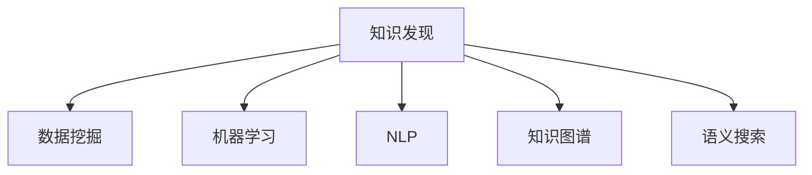

                 

# 知识发现引擎助力程序员解决难题

## 1. 背景介绍

在软件开发过程中，程序员常常需要处理各种复杂且重复的问题，比如代码重构、缺陷修复、性能调优等。这些问题不仅耗费时间和精力，还可能引发更多新问题。为了提升开发效率和代码质量，程序员们需要借助有效的工具和算法，以实现自动化、智能化、定制化的解决方案。

## 2. 核心概念与联系

### 2.1 核心概念概述

为更好地理解知识发现引擎(Knowledge Discovery Engine, KDE)的概念及其实现原理，本节将介绍几个密切相关的核心概念：

- **知识发现(Knowledge Discovery, KD)**：指从海量数据中挖掘、发现和抽取有用知识和信息的过程。知识发现旨在提升决策支持、商业智能、科学研究和金融分析等领域的能力。
- **数据挖掘(Data Mining)**：是知识发现的一个主要技术手段，通过算法从数据集中提取有价值的模式、关联和规律。
- **机器学习(Machine Learning)**：是实现知识发现和数据挖掘的重要技术，通过训练模型从数据中学习规律和模式。
- **自然语言处理(Natural Language Processing, NLP)**：指使计算机理解和生成人类语言的技术，是知识发现的重要应用之一。
- **知识图谱(Knowledge Graph)**：是由节点和边组成的图结构，用于描述实体及其关系，常用于知识发现和推理。
- **语义搜索(Semantic Search)**：利用自然语言处理技术，实现对文本和数据的深度理解，提高搜索结果的相关性和准确性。

这些核心概念之间的逻辑关系可以通过以下Mermaid流程图来展示：



这个流程图展示的知识发现主要技术手段及其应用场景，各技术手段相互作用，形成了一个完整的知识发现生态系统。

## 3. 核心算法原理 & 具体操作步骤

### 3.1 算法原理概述

知识发现引擎利用数据挖掘、机器学习和自然语言处理等技术，从海量数据中发现和抽取有用知识和信息。在软件开发领域，知识发现引擎可以帮助程序员解决以下问题：

- **代码重构**：通过分析历史代码和变更记录，发现和应用代码优化模式。
- **缺陷修复**：利用代码变异分析和回归测试，定位和修复软件缺陷。
- **性能调优**：通过代码执行分析和性能指标分析，指导软件性能优化。

### 3.2 算法步骤详解

基于知识发现引擎的开发流程一般包括以下几个关键步骤：

**Step 1: 数据收集与预处理**
- 收集与目标问题相关的数据源，包括源代码、日志文件、文档等。
- 对数据进行清洗、转换和归一化，确保数据质量一致性。

**Step 2: 特征提取与选择**
- 通过词频统计、语法分析、调用图分析等技术，提取与目标问题相关的特征。
- 使用特征选择算法（如互信息、卡方检验等），选择最相关的特征，减少计算复杂度。

**Step 3: 模型训练与优化**
- 选择或设计合适的机器学习模型（如决策树、随机森林、神经网络等），训练并优化模型。
- 使用交叉验证、网格搜索等方法，调整模型超参数，提高模型泛化能力。

**Step 4: 知识抽取与可视化**
- 利用训练好的模型，从数据集中抽取知识，生成知识图谱或规则集。
- 使用可视化工具（如Gephi、Tableau等），展示知识图谱或规则集，便于理解和应用。

**Step 5: 应用与部署**
- 将知识图谱或规则集集成到开发环境或IDE中，实现自动化分析和决策支持。
- 根据实际应用需求，调整模型和规则集，确保其稳定性和实用性。

### 3.3 算法优缺点

基于知识发现引擎的知识发现方法具有以下优点：
- 自动化程度高：能够自动从数据中提取知识和规律，节省手动分析和处理的时间。
- 数据利用率高：能够高效利用海量的数据源，发现和抽取高质量的有用信息。
- 可扩展性好：可以集成多种技术和算法，实现多维度的分析与优化。

同时，该方法也存在一些局限性：
- 数据质量依赖：知识发现结果的质量很大程度上依赖于数据的质量和完整性。
- 模型复杂度高：复杂的模型可能需要大量的计算资源和时间，效率较低。
- 解释性不足：一些复杂的模型和算法，其内部工作机制难以解释，难以理解其决策逻辑。
- 泛化能力有限：知识发现方法依赖于特定数据集的特征，难以泛化到新场景和新数据集。

### 3.4 算法应用领域

基于知识发现引擎的方法在软件开发领域得到了广泛的应用，覆盖了以下多个方面：

- **代码重构**：利用代码相似性和重构历史数据，推荐有效的重构模式，提高代码可维护性。
- **缺陷修复**：通过分析代码变异和回归测试结果，识别常见错误类型，提供修复建议。
- **性能调优**：利用代码执行分析和性能指标，识别性能瓶颈，提出优化建议。
- **代码生成**：基于知识图谱和规则集，自动生成新的代码实现，提升开发效率。
- **版本管理**：通过版本控制数据和变更历史，发现代码演进趋势，优化版本策略。
- **用户界面设计**：利用用户反馈和行为数据，发现和优化用户界面设计，提升用户体验。

## 4. 数学模型和公式 & 详细讲解 & 举例说明

### 4.1 数学模型构建

基于知识发现引擎的知识发现过程可以建模为如下形式：

$$
K = D \times T + P \times A
$$

其中，$K$ 表示知识，$D$ 表示数据，$T$ 表示模型，$P$ 表示算法，$A$ 表示用户需求。知识发现过程即为从数据、模型和算法中抽取有用信息，满足用户需求的过程。

### 4.2 公式推导过程

为了具体理解知识发现引擎的工作原理，我们以代码重构为例进行推导。代码重构的数学模型可以建模为：

$$
\min_{R} C_{after} - C_{before} \quad s.t. \quad R_{before} \rightarrow R_{after}
$$

其中，$R$ 表示代码重构模式，$C_{before}$ 和 $C_{after}$ 分别表示重构前后的代码性能指标，$R_{before}$ 和 $R_{after}$ 分别表示重构前后的代码结构。目标是在满足结构变化约束的前提下，最小化性能差距。

### 4.3 案例分析与讲解

假设我们有一组代码变更记录，目标是从这些记录中发现最优的代码重构模式，以提升代码性能。我们可以使用机器学习模型（如决策树、随机森林等）来训练，并使用特征选择算法（如卡方检验）选择最相关的特征。

训练好的模型可以抽取代码重构知识，生成知识图谱。例如，可以发现某类方法调用频繁，但性能较低，建议将其改写为更高效的方式。这种知识可以进一步集成到开发环境或IDE中，实现自动化重构。

## 5. 项目实践：代码实例和详细解释说明

### 5.1 开发环境搭建

在进行知识发现引擎的开发前，我们需要准备好开发环境。以下是使用Python进行Scikit-learn开发的环境配置流程：

1. 安装Anaconda：从官网下载并安装Anaconda，用于创建独立的Python环境。

2. 创建并激活虚拟环境：
```bash
conda create -n kde-env python=3.8 
conda activate kde-env
```

3. 安装Scikit-learn：
```bash
conda install scikit-learn
```

4. 安装其他各类工具包：
```bash
pip install pandas numpy matplotlib seaborn jupyter notebook ipython
```

完成上述步骤后，即可在`kde-env`环境中开始开发。

### 5.2 源代码详细实现

下面我们以代码重构任务为例，给出使用Scikit-learn进行知识发现的Python代码实现。

首先，定义数据处理函数：

```python
import pandas as pd
from sklearn.feature_extraction.text import TfidfVectorizer
from sklearn.ensemble import RandomForestClassifier

def preprocess_data(data_path):
    data = pd.read_csv(data_path)
    data['before_code'] = data['before_code'].replace('\n', '')
    data['after_code'] = data['after_code'].replace('\n', '')
    X = data[['before_code', 'after_code']]
    y = data['reconstructed']
    return X, y
```

然后，定义特征提取和模型训练函数：

```python
from sklearn.model_selection import train_test_split
from sklearn.feature_selection import SelectKBest, chi2

def extract_features(X, y):
    vectorizer = TfidfVectorizer(stop_words='english', max_features=1000)
    X_vec = vectorizer.fit_transform(X['before_code'].tolist())
    X_vec = X_vec.todense()
    X_vec = pd.DataFrame(X_vec, columns=vectorizer.get_feature_names_out())
    X_vec['after_code'] = vectorizer.transform(X['after_code'].tolist()).todense()
    X_vec['after_code'] = pd.DataFrame(X_vec['after_code'], columns=vectorizer.get_feature_names_out())
    X_vec['before_code'] = X_vec['before_code'].fillna(0)
    X_vec['after_code'] = X_vec['after_code'].fillna(0)
    return X_vec, y

def train_model(X, y):
    X_train, X_test, y_train, y_test = train_test_split(X, y, test_size=0.2, random_state=42)
    clf = RandomForestClassifier(n_estimators=100, random_state=42)
    clf.fit(X_train, y_train)
    y_pred = clf.predict(X_test)
    return clf, y_pred
```

最后，启动知识发现流程：

```python
data_path = 'code_reconstruction_data.csv'
X, y = preprocess_data(data_path)
X_vec, y = extract_features(X, y)
clf, y_pred = train_model(X_vec, y)

# 输出模型性能
from sklearn.metrics import classification_report
print(classification_report(y, y_pred))

# 输出特征重要性
importances = clf.feature_importances_
feature_names = vectorizer.get_feature_names_out()
importance_series = pd.Series(importances, index=feature_names).sort_values(ascending=False)
print(importance_series)
```

以上就是使用Scikit-learn进行代码重构任务知识发现的完整代码实现。可以看到，得益于Scikit-learn的强大封装，我们可以用相对简洁的代码完成数据处理和模型训练。

### 5.3 代码解读与分析

让我们再详细解读一下关键代码的实现细节：

**preprocess_data函数**：
- 读取CSV格式的数据集，并清洗文本数据，移除换行符。
- 构建特征集 $X$ 和标签 $y$。

**extract_features函数**：
- 使用TF-IDF特征提取器，提取代码前后的特征。
- 填充缺失值，并将特征集转换为Pandas DataFrame格式。

**train_model函数**：
- 将数据集划分为训练集和测试集。
- 训练随机森林模型，并预测测试集结果。
- 使用分类报告输出模型性能。
- 输出特征重要性，便于选择最相关特征。

**主函数**：
- 执行数据预处理和特征提取，训练模型，并输出模型性能和特征重要性。

可以看到，Scikit-learn使得知识发现任务的开发变得简洁高效。开发者可以将更多精力放在数据处理、模型改进等高层逻辑上，而不必过多关注底层的实现细节。

## 6. 实际应用场景

### 6.1 代码重构

基于知识发现引擎的代码重构技术，可以帮助程序员自动识别和应用代码优化模式，提高代码可维护性和可读性。具体应用场景包括：

- **功能重构**：将冗余代码、重复代码、低效代码重构为更简洁、高效的方式。
- **风格重构**：统一代码风格，消除代码不一致性，提高代码可读性。
- **结构重构**：优化代码结构，简化继承关系，提升系统稳定性。

### 6.2 缺陷修复

利用代码变异分析和回归测试，知识发现引擎可以识别出常见缺陷类型，提供修复建议。具体应用场景包括：

- **逻辑错误修复**：分析代码变异结果，定位逻辑错误的代码路径，提供修复方案。
- **性能瓶颈修复**：通过代码执行分析，识别性能瓶颈，提出优化建议。
- **安全漏洞修复**：利用安全检测工具，检测代码中的潜在漏洞，并提供修复建议。

### 6.3 性能调优

知识发现引擎可以帮助程序员识别代码中的性能瓶颈，提出优化建议。具体应用场景包括：

- **内存泄漏修复**：分析内存使用情况，识别内存泄漏点，优化内存管理。
- **CPU利用率优化**：通过代码执行分析，优化CPU利用率，提升系统性能。
- **I/O优化**：优化I/O操作，提高数据读写效率。

### 6.4 未来应用展望

随着知识发现技术的不断发展，未来知识发现引擎将在更多领域得到应用，为软件开发带来新的变革。

在智慧城市治理中，知识发现引擎可以用于实时监测和分析城市事件，优化资源配置，提升治理效率。

在智慧医疗领域，知识发现引擎可以帮助医生分析和理解病历数据，提出诊断和治疗建议，提高医疗质量。

在智慧金融领域，知识发现引擎可以用于风险评估、交易分析、用户行为预测等方面，提升金融服务的智能化水平。

在智能制造领域，知识发现引擎可以用于设备状态监测、故障预测、生产优化等方面，提升生产效率和安全性。

此外，在教育、交通、农业等众多领域，知识发现引擎也将不断拓展应用场景，为行业转型升级提供新的技术支持。相信随着技术的日益成熟，知识发现引擎必将在更多行业领域大放异彩，推动智能技术的普及和应用。

## 7. 工具和资源推荐

### 7.1 学习资源推荐

为了帮助开发者系统掌握知识发现引擎的理论基础和实践技巧，这里推荐一些优质的学习资源：

1. 《数据挖掘导论》（Introduction to Data Mining in Statistical Learning）：由李航教授所著，全面介绍了数据挖掘的基本概念、技术和应用。
2. 《Python数据科学手册》（Python Data Science Handbook）：由Jake VanderPlas所著，介绍了Python在数据科学和机器学习中的应用。
3. 《统计学习方法》（Pattern Recognition and Machine Learning）：由Christopher M. Bishop所著，介绍了各种机器学习算法和知识发现方法。
4. 《数据科学实战》（Data Science from Scratch）：由Joel Grus所著，介绍了数据科学的基本原理和实践技巧。
5. Kaggle：全球最大的数据科学竞赛平台，提供了大量的公开数据集和机器学习样例，供学习者练习和研究。

通过对这些资源的学习实践，相信你一定能够快速掌握知识发现引擎的精髓，并用于解决实际的软件开发问题。

### 7.2 开发工具推荐

高效的开发离不开优秀的工具支持。以下是几款用于知识发现引擎开发的常用工具：

1. Python：开源的编程语言，具有丰富的第三方库和工具支持，是知识发现任务开发的主流选择。
2. Scikit-learn：基于Python的机器学习库，提供了多种机器学习算法和特征提取工具，适合快速开发和实验。
3. Weights & Biases：模型训练的实验跟踪工具，可以记录和可视化模型训练过程中的各项指标，方便对比和调优。
4. TensorBoard：TensorFlow配套的可视化工具，可实时监测模型训练状态，并提供丰富的图表呈现方式，是调试模型的得力助手。
5. Jupyter Notebook：开源的交互式笔记本，支持代码执行和数据可视化，方便实验研究和团队协作。

合理利用这些工具，可以显著提升知识发现引擎任务的开发效率，加快创新迭代的步伐。

### 7.3 相关论文推荐

知识发现引擎的发展源于学界的持续研究。以下是几篇奠基性的相关论文，推荐阅读：

1. 《数据挖掘：概念与技术》（Data Mining: Concepts and Techniques）：由Jerry Kaisa和Ian H. Witten所著，介绍了数据挖掘的基本概念、技术和应用。
2. 《机器学习：原理、算法与应用》（Machine Learning: A Probabilistic Perspective）：由Kevin Murphy所著，介绍了机器学习的基本原理和应用。
3. 《自然语言处理综论》（Speech and Language Processing）：由Daniel Jurafsky和James H. Martin所著，介绍了自然语言处理的基本原理和技术。
4. 《深度学习》（Deep Learning）：由Ian Goodfellow、Yoshua Bengio和Aaron Courville所著，介绍了深度学习的基本原理和应用。
5. 《知识图谱：概念、技术与应用》（Knowledge Graphs: Concepts, Technologies and Applications）：由Patrick S. Shadbolt、Andreas Nenkova和Geoffrey C. Cox所著，介绍了知识图谱的基本概念、技术和应用。

这些论文代表了大数据技术的发展脉络。通过学习这些前沿成果，可以帮助研究者把握学科前进方向，激发更多的创新灵感。

## 8. 总结：未来发展趋势与挑战

### 8.1 总结

本文对知识发现引擎的理论基础和实践应用进行了全面系统的介绍。首先阐述了知识发现引擎在软件开发中的重要性和应用场景，明确了知识发现引擎在自动化、智能化、定制化方面的独特价值。其次，从原理到实践，详细讲解了知识发现引擎的数学模型和关键算法，给出了知识发现任务的完整代码实现。同时，本文还探讨了知识发现引擎在代码重构、缺陷修复、性能调优等实际应用场景中的应用，展示了知识发现引擎的广泛应用前景。此外，本文精选了知识发现引擎的学习资源、开发工具和相关论文，力求为读者提供全方位的技术指引。

通过本文的系统梳理，可以看到，知识发现引擎在软件开发领域具备强大的应用潜力，通过自动化和智能化的方法，帮助程序员提升开发效率和代码质量。未来，伴随知识发现技术的发展和优化，知识发现引擎必将在更多的软件开发领域大放异彩，推动软件开发向更高效、智能、定制化的方向发展。

### 8.2 未来发展趋势

展望未来，知识发现引擎将在软件开发领域呈现以下几个发展趋势：

1. **自动化程度提升**：未来的知识发现引擎将进一步提升自动化程度，能够自动识别和应用更多的代码优化模式，提供更准确的推荐结果。
2. **智能化水平提升**：通过引入更多先进的机器学习算法，如深度学习、强化学习等，知识发现引擎将具备更强的智能推理和决策能力，提供更精准的建议。
3. **多领域融合**：知识发现引擎将进一步拓展应用领域，结合自然语言处理、计算机视觉、物联网等技术，形成更加全面的智能解决方案。
4. **跨平台支持**：知识发现引擎将支持多种开发平台和编程语言，实现跨平台应用和互操作。
5. **实时性增强**：通过分布式计算和云服务，知识发现引擎将具备更强的实时性，能够实时监测和分析开发过程中的数据，提供及时的决策支持。
6. **安全性增强**：未来的知识发现引擎将加强数据保护和隐私保护，确保数据和模型安全，避免数据泄露和模型滥用。

### 8.3 面临的挑战

尽管知识发现引擎在软件开发领域已经取得了显著成效，但在迈向更加智能化、普适化应用的过程中，它仍面临着诸多挑战：

1. **数据质量瓶颈**：知识发现结果的质量很大程度上依赖于数据的质量和完整性，高质量数据的获取和清洗成本较高。
2. **算法复杂度高**：复杂的算法和模型需要大量的计算资源和时间，效率较低。
3. **模型可解释性不足**：一些复杂的模型和算法，其内部工作机制难以解释，难以理解其决策逻辑。
4. **泛化能力有限**：知识发现方法依赖于特定数据集的特征，难以泛化到新场景和新数据集。
5. **安全性问题**：知识发现引擎可能学习到有偏见、有害的信息，通过优化过程传递到代码和模型中，造成安全隐患。
6. **用户接受度低**：知识发现引擎的自动化和智能化程度较高，可能改变程序员的工作习惯和开发流程，面临用户接受度低的挑战。

### 8.4 研究展望

为了克服知识发现引擎面临的挑战，未来的研究需要在以下几个方面寻求新的突破：

1. **数据质量提升**：引入更多数据清洗和预处理技术，提高数据质量，减少数据噪声。
2. **算法优化**：设计更加高效、轻量级的算法和模型，降低计算复杂度，提高效率。
3. **模型解释性增强**：引入可解释性技术，如特征重要性分析、模型可视化等，提高模型的可解释性。
4. **泛化能力增强**：引入迁移学习和跨领域学习技术，提高知识发现引擎的泛化能力，适应更多应用场景。
5. **安全性保障**：引入安全性和隐私保护技术，确保数据和模型安全，避免模型滥用。
6. **用户友好性提升**：设计更加人性化、易于接受的用户界面和操作流程，提升用户接受度。

这些研究方向的探索，必将引领知识发现引擎技术迈向更高的台阶，为软件开发提供更加智能化、自动化的解决方案，进一步推动软件开发技术的发展。总之，知识发现引擎作为软件开发领域的利器，将在未来发挥更大的作用，为软件开发带来革命性的变化。

