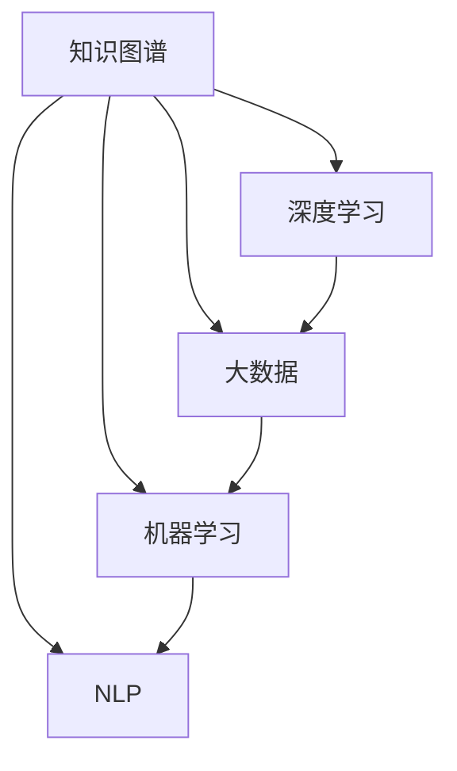

                 

# 知识发现引擎如何改变程序员的学习模式与方法

> 关键词：知识发现引擎,程序员学习,学习模式,知识图谱,深度学习,大数据,机器学习

## 1. 背景介绍

在数字化时代，知识的获取、整理和应用成为了创新的重要驱动力。程序员作为IT行业的中坚力量，其学习模式和方法直接影响到技术进步和行业发展。传统的基于知识库、文档和案例的学习方式，逐渐无法满足快速变化的技术需求。知识发现引擎(Knowledge Discovery Engine, KDE)作为一种新型技术，正通过智能化的方式改变程序员的学习模式与方法，助力其高效获取和应用知识。

### 1.1 问题由来

当前程序员面临知识更新的挑战：

- **知识量大、更新快**：随着技术的不断迭代，程序员需要持续学习新技术、新工具。
- **知识零散、难以整合**：编程语言、框架、工具等方面的知识，往往散落在不同文档、示例代码中，难以系统化地掌握。
- **知识应用困难**：复杂项目中，程序员需要综合运用多种知识，并整合多源数据，形成解决方案。

这些问题导致程序员的学习效率低下，面对技术挑战时常常感到力不从心。知识发现引擎通过自动化、智能化手段，精准发现并呈现程序员需要的知识，改变了传统被动学习的方式，实现了知识的主动发现和高效应用。

### 1.2 问题核心关键点

知识发现引擎的核心思想是：通过人工智能和大数据技术，从海量、异构的数据源中自动抽取、整合和呈现知识，为程序员提供即时、个性化、系统化的学习支持。其关键点包括：

- **数据获取**：从开源社区、技术论坛、编程工具、文档等来源，自动化抓取相关知识数据。
- **知识抽取**：使用自然语言处理(NLP)、知识图谱等技术，从数据中抽取核心概念、方法、案例等关键信息。
- **知识整合**：将抽取的知识进行分类、关联和聚合，构建系统的知识体系。
- **知识展示**：通过图形化界面、推荐系统等形式，向程序员呈现知识结构、相关案例、最佳实践等信息。
- **知识应用**：在实际编程环境中，提供智能代码补全、自动重构、错误提示等功能，辅助程序员进行知识应用。

这些核心关键点共同构成了知识发现引擎的技术框架，使其能够精准地辅助程序员，提升其学习效率和应用能力。

### 1.3 问题研究意义

研究知识发现引擎对程序员学习模式与方法的影响，具有重要意义：

- **提升学习效率**：通过智能化的知识呈现，程序员可以更高效地获取所需知识，减少时间成本。
- **优化学习体验**：个性化推荐和可视化展示，使得学习过程更加直观、愉悦。
- **辅助知识应用**：实时化的代码辅助、错误诊断等功能，提升了编程效率和质量。
- **驱动技术创新**：通过知识整合和迁移，加速新技术的落地应用，促进技术创新。
- **推动行业发展**：为IT行业人才培养和团队协作提供了新的工具和方法，提升整体竞争力。

## 2. 核心概念与联系

### 2.1 核心概念概述

本节将介绍几个密切相关的核心概念，帮助理解知识发现引擎的原理和架构：

- **知识图谱(Knowledge Graph)**：通过语义关系将实体和属性关联起来，构建知识网络，便于知识抽取和应用。
- **深度学习(Deep Learning)**：利用多层神经网络，从大规模数据中提取高层次特征，用于自然语言处理、图像识别等任务。
- **大数据(Big Data)**：指海量、多样化的数据集合，包括结构化、半结构化和非结构化数据，用于知识发现和知识抽取。
- **自然语言处理(NLP)**：研究计算机如何理解、处理和生成人类语言的技术，用于文本挖掘和知识抽取。
- **机器学习(Machine Learning)**：通过算法让计算机从数据中学习规律，用于预测、分类等任务，是知识发现引擎的核心技术之一。

这些概念之间的逻辑关系可以通过以下Mermaid流程图来展示：



这个流程图展示了几大核心概念之间的联系和相互作用：

1. **知识图谱**：构建知识网络，作为深度学习和大数据处理的基础。
2. **大数据**：提供数据源，为深度学习和机器学习提供训练数据。
3. **NLP**：利用自然语言处理技术，从文本数据中抽取知识。
4. **深度学习**：通过多层神经网络，从数据中学习模式和特征。
5. **机器学习**：利用算法，从数据中提取规律和规律性信息。

这些概念共同构成了知识发现引擎的技术基础，使其能够自动化地发现和呈现知识。

## 3. 核心算法原理 & 具体操作步骤

### 3.1 算法原理概述

知识发现引擎的核心算法原理包括：

- **知识抽取**：通过自然语言处理技术，从文本数据中自动识别和提取关键实体、关系和属性。
- **知识关联**：利用知识图谱，将提取的知识进行分类、关联和聚合，构建系统的知识体系。
- **知识展示**：通过图形化界面或推荐系统，将知识结构、相关案例、最佳实践等信息展示给程序员。
- **知识应用**：在实际编程环境中，提供智能代码补全、自动重构、错误提示等功能，辅助程序员进行知识应用。

### 3.2 算法步骤详解

知识发现引擎的核心算法步骤包括：

1. **数据获取**：
   - 自动化抓取开源社区、技术论坛、编程工具、文档等来源的相关知识数据。
   - 整合多源数据，构建全局的知识图谱。

2. **知识抽取**：
   - 利用自然语言处理技术，从文本数据中自动识别和提取关键实体、关系和属性。
   - 构建知识图谱，存储和表示抽取的知识结构。

3. **知识关联**：
   - 将抽取的知识进行分类、关联和聚合，构建系统的知识体系。
   - 使用图谱算法，优化知识图谱的结构和性能。

4. **知识展示**：
   - 通过图形化界面或推荐系统，将知识结构、相关案例、最佳实践等信息展示给程序员。
   - 提供个性化的知识推荐，辅助程序员进行学习。

5. **知识应用**：
   - 在实际编程环境中，提供智能代码补全、自动重构、错误提示等功能，辅助程序员进行知识应用。
   - 实时反馈编程效果，优化知识呈现方式。

### 3.3 算法优缺点

知识发现引擎的优点包括：

- **智能化高**：自动化抽取、整合和呈现知识，提升了程序员的学习效率。
- **个性化强**：根据程序员的需求和背景，提供个性化的知识推荐。
- **系统性强**：构建系统的知识体系，便于程序员系统化地掌握技术。

缺点包括：

- **依赖高质量数据**：知识抽取和关联依赖高质量的数据源，数据质量不高时效果可能不佳。
- **复杂度高**：知识抽取和关联需要复杂的算法，实现难度较大。
- **应用场景有限**：目前主要应用于编程语言、框架、工具等知识领域，应用范围有待扩展。

### 3.4 算法应用领域

知识发现引擎已经在多个领域得到了广泛应用，例如：

- **编程语言学习**：辅助程序员学习Python、Java、C++等编程语言的特性、语法和应用案例。
- **框架学习**：帮助程序员快速掌握Spring、Django、React等框架的核心概念、最佳实践和案例。
- **工具学习**：介绍Git、Maven、Docker等工具的使用方法、命令和最佳实践。
- **技术文档学习**：提供开源项目的技术文档和用户手册，辅助程序员理解和应用。
- **项目实践学习**：根据程序员的实践需求，推荐相关案例和解决方案。

除了上述这些经典领域外，知识发现引擎还被创新性地应用于更多场景中，如可控编程、自适应学习、智能问答等，为编程学习提供了全新的突破。

## 4. 数学模型和公式 & 详细讲解 & 举例说明（备注：数学公式请使用latex格式，latex嵌入文中独立段落使用 $$，段落内使用 $)
### 4.1 数学模型构建

知识发现引擎的数学模型主要涉及以下几类：

- **知识图谱构建**：利用图谱算法，构建知识图谱的邻接矩阵和实体属性向量。
- **知识抽取**：通过文本挖掘算法，从数据中抽取实体、关系和属性。
- **知识关联**：使用图谱算法，优化知识图谱的结构和性能。
- **知识展示**：通过推荐算法，个性化推荐知识结构和案例。
- **知识应用**：使用机器学习算法，优化代码补全、重构和错误提示的功能。

### 4.2 公式推导过程

以下以知识图谱构建为例，推导知识图谱邻接矩阵的构建公式。

设知识图谱中实体集合为 $V$，关系集合为 $E$，每个实体的属性集合为 $A$。记 $N_{V} = |V|$，$N_{E} = |E|$，$N_{A} = \sum_{v \in V} |A_v|$。邻接矩阵 $A$ 的行和列分别表示实体集合 $V$ 中的节点，矩阵元素 $A_{u,v}$ 表示节点 $u$ 和节点 $v$ 之间是否存在关系，如果存在，值为 $1$，否则为 $0$。

知识图谱的构建公式如下：

$$
A = \frac{1}{N_E} \sum_{e \in E} (I^{A_e} - I^{A_e})
$$

其中 $I^{A_e}$ 表示将实体 $A_e$ 的邻接矩阵转换为二值矩阵，即只保留关系 $e$ 所连接的节点关系，其余节点关系置为 $0$。$\frac{1}{N_E}$ 是为了使邻接矩阵的元素值在 $[0,1]$ 范围内。

### 4.3 案例分析与讲解

考虑一个包含以下实体的知识图谱：

- 人：Alice, Bob
- 关系：知识共享，指教
- 组织：Company X, Company Y

知识图谱的邻接矩阵可以表示为：

$$
A = \begin{bmatrix}
0 & 1 & 0 & 1 \\
1 & 0 & 1 & 0 \\
0 & 1 & 0 & 0 \\
1 & 0 & 0 & 0 \\
\end{bmatrix}
$$

其中，Alice 和 Company X 之间存在知识共享关系，Bob 和 Company Y 之间存在指教关系。通过邻接矩阵，可以直观地看出知识图谱中各实体之间的连接关系。

## 5. 项目实践：代码实例和详细解释说明
### 5.1 开发环境搭建

在进行知识发现引擎的实践开发前，我们需要准备好开发环境。以下是使用Python进行Apache Jena开发的环境配置流程：

1. 安装Apache Jena：从官网下载并安装Apache Jena，作为知识图谱的构建和查询工具。

2. 创建并激活虚拟环境：
```bash
conda create -n jena-env python=3.8 
conda activate jena-env
```

3. 安装Jena库：
```bash
pip install apache-jena-ldapi-contrib apache-jena-riot apache-jena-query apache-jena-tutorial
```

4. 安装RDF4J库：
```bash
pip install rdf4j
```

5. 安装Sparql endpoint：
```bash
pip install sparql-endpoint
```

完成上述步骤后，即可在`jena-env`环境中开始知识发现引擎的实践开发。

### 5.2 源代码详细实现

下面以知识图谱的构建为例，给出使用Apache Jena构建知识图谱的Python代码实现。

首先，定义知识图谱的实体和关系：

```python
from apache.jena.rdf.model import Namespace, Resource, Model, RDF
from apache.jena.query import QueryExecution
from apache.jena.riot import RDFWriter
from rdf4j.rio import RIO

# 定义命名空间
ns = Namespace("http://example.org/")

# 创建知识图谱
g = Model.create()

# 添加实体和关系
g.add((ns.makeResource("Alice"), RDF.type, ns.makeResource("Person")))
g.add((ns.makeResource("Bob"), RDF.type, ns.makeResource("Person")))
g.add((ns.makeResource("Alice"), ns.makeResource("knows"), ns.makeResource("CompanyX")))
g.add((ns.makeResource("Bob"), ns.makeResource("teaches"), ns.makeResource("CompanyY")))

# 保存知识图谱
g.write(RDFWriterRegistry.getWriter("Turtle"), open("example.ttl", "t"))
```

然后，使用Jena库查询知识图谱中的关系：

```python
from apache.jena.query import QueryExecution
from apache.jena.rdf.model import Resource, Literal, Namespace

# 创建查询
query = """
SELECT ?p ?o WHERE {
    Alice ?p ?o .
    FILTER (?p = <http://example.org/knows>)
}
"""
qe = QueryExecution(query, g, rdf_prefix)
results = qe.evaluate() # 返回结果集
```

最后，在Sparql endpoint上查询知识图谱：

```python
from sparql_endpoint import SPARQL

# 创建查询
query = """
SELECT ?p ?o WHERE {
    Alice ?p ?o .
    FILTER (?p = <http://example.org/knows>)
}
"""
sparql = SPARQL("http://localhost:8088/sparql")
sparql.query(query)
```

### 5.3 代码解读与分析

让我们再详细解读一下关键代码的实现细节：

**定义实体和关系**：
- 使用`Namespace`定义命名空间，方便构建统一的知识图谱。
- 使用`Model`创建知识图谱对象，并添加实体和关系。

**保存知识图谱**：
- 使用`RDFWriter`将知识图谱保存为Turtle格式文件。

**查询知识图谱**：
- 使用`QueryExecution`类创建查询对象，设置查询语句和数据源。
- 使用`evaluate`方法执行查询，返回查询结果。

**Sparql查询**：
- 使用`SPARQL`类连接Sparql endpoint，执行查询。

可以看到，Apache Jena为知识图谱的构建和查询提供了强大的功能支持。开发者可以灵活使用这些工具，快速实现知识图谱的构建和查询，满足各种应用需求。

## 6. 实际应用场景
### 6.1 编程语言学习

知识发现引擎可以为程序员提供全面的编程语言学习支持。例如，通过查询语言图谱，发现Python中常用的数据结构、算法和库，提供相关的教程、示例和案例，帮助程序员快速掌握新技术。

**具体应用场景**：
- 编程语言特性学习：查询Python中常用的数据结构（如列表、字典）、算法（如排序、搜索）和库（如NumPy、Pandas）的特性和使用方式。
- 编程语言最佳实践学习：查询Python中常用的编程技巧、最佳实践和代码风格指南。
- 编程语言案例学习：查询Python中常见的应用案例，如数据处理、机器学习、Web开发等。

### 6.2 框架学习

知识发现引擎也可以用于框架的学习。通过查询框架图谱，发现框架中常用的概念、组件和API，提供相关的教程、示例和案例，帮助程序员快速掌握框架的用法。

**具体应用场景**：
- 框架特性学习：查询Spring、Django等框架中常用的注解、组件和API的特性和使用方式。
- 框架最佳实践学习：查询框架中常用的编程技巧、最佳实践和代码风格指南。
- 框架案例学习：查询框架中常见的应用案例，如Web应用开发、移动应用开发等。

### 6.3 工具学习

知识发现引擎还可以用于工具的学习。通过查询工具图谱，发现工具中常用的功能和命令，提供相关的教程、示例和案例，帮助程序员快速掌握工具的使用方法。

**具体应用场景**：
- 工具特性学习：查询Git、Maven、Docker等工具的特性和常用命令。
- 工具最佳实践学习：查询工具中常用的编程技巧、最佳实践和代码风格指南。
- 工具案例学习：查询工具中常见的应用案例，如版本控制、项目构建、容器部署等。

### 6.4 技术文档学习

知识发现引擎还可以用于技术文档的学习。通过查询文档图谱，发现技术文档中的关键概念和示例，提供相关的教程、示例和案例，帮助程序员快速理解和应用技术文档。

**具体应用场景**：
- 技术文档特性学习：查询技术文档中的核心概念、方法、案例等关键信息。
- 技术文档最佳实践学习：查询技术文档中的最佳实践和代码风格指南。
- 技术文档案例学习：查询技术文档中的应用案例和解决方案。

### 6.5 项目实践学习

知识发现引擎还可以用于项目实践的学习。通过查询项目图谱，发现项目中的关键问题和解决方案，提供相关的教程、示例和案例，帮助程序员快速解决项目中的问题。

**具体应用场景**：
- 项目问题学习：查询项目中的常见问题和解决方案，如数据库设计、网络架构、安全问题等。
- 项目最佳实践学习：查询项目中的最佳实践和代码风格指南。
- 项目案例学习：查询项目中的应用案例和解决方案。

## 7. 工具和资源推荐
### 7.1 学习资源推荐

为了帮助开发者系统掌握知识发现引擎的理论基础和实践技巧，这里推荐一些优质的学习资源：

1. **《数据挖掘导论》**：由Jerry Kilian, Eibe Frank等人所著，全面介绍了数据挖掘和知识发现的基本概念和技术。
2. **《机器学习实战》**：由Peter Harrington所著，通过实际案例介绍了机器学习算法和应用。
3. **《TensorFlow for Data Science》**：由Doruk Emiroglu等人所著，介绍了如何使用TensorFlow进行数据科学和知识发现。
4. **《Apache Jena用户手册》**：Apache Jena官方文档，详细介绍了Jena库的使用方法和相关案例。
5. **《Linked Data for Semantic Web》**：由Ian Reid所著，介绍了Linked Data在语义网中的应用和实现。

通过对这些资源的学习实践，相信你一定能够快速掌握知识发现引擎的精髓，并用于解决实际的NLP问题。

### 7.2 开发工具推荐

高效的开发离不开优秀的工具支持。以下是几款用于知识发现引擎开发的常用工具：

1. **Apache Jena**：Apache Jena是Java平台上的知识图谱和语义Web库，提供了丰富的RDF处理功能，支持构建、查询和处理知识图谱。
2. **RDF4J**：RDF4J是一个Java库，用于处理RDF数据，提供了便捷的API和工具。
3. **Sparql endpoint**：Sparql endpoint是一个SpaQL查询工具，可以连接到各种Sparql服务，执行查询和检索。
4. **ELK stack**：ELK stack是一个开源的日志和监控解决方案，包含Elasticsearch、Logstash和Kibana三个组件，支持知识图谱的存储和查询。

合理利用这些工具，可以显著提升知识发现引擎的开发效率，加快创新迭代的步伐。

### 7.3 相关论文推荐

知识发现引擎的发展源于学界的持续研究。以下是几篇奠基性的相关论文，推荐阅读：

1. **《知识发现：算法与应用》**：由Geoffrey Krewson所著，介绍了知识发现和数据挖掘的基本概念和算法。
2. **《知识抽取和语义网》**：由Neeraj Sood等人所著，介绍了知识抽取和语义网技术的应用和实现。
3. **《基于语义网的知识抽取与融合》**：由Jonathan J. Hall等人所著，介绍了基于语义网的知识抽取和融合技术。
4. **《深度学习在知识图谱构建中的应用》**：由Denny Britz等人所著，介绍了深度学习在知识图谱构建中的应用和效果。

这些论文代表了大数据知识发现引擎的发展脉络。通过学习这些前沿成果，可以帮助研究者把握学科前进方向，激发更多的创新灵感。

## 8. 总结：未来发展趋势与挑战

### 8.1 研究成果总结

本文对知识发现引擎对程序员学习模式与方法的影响进行了全面系统的介绍。首先阐述了知识发现引擎的核心思想和应用场景，明确了其在提升学习效率、优化学习体验、辅助知识应用等方面的价值。其次，从原理到实践，详细讲解了知识发现引擎的数学模型和关键算法，给出了知识图谱构建和查询的完整代码实例。同时，本文还广泛探讨了知识发现引擎在编程语言学习、框架学习、工具学习、技术文档学习等多个领域的应用前景，展示了其广泛的应用范围。最后，本文精选了知识发现引擎的学习资源、开发工具和相关论文，力求为开发者提供全方位的技术指引。

通过本文的系统梳理，可以看到，知识发现引擎正通过智能化的方式改变程序员的学习模式与方法，显著提升了学习效率和应用能力。知识发现引擎的引入，使得程序员能够更加主动地发现和应用知识，加速技术进步和行业发展。

### 8.2 未来发展趋势

展望未来，知识发现引擎的发展趋势包括：

1. **智能化程度提升**：通过更高级的算法和模型，如深度学习、知识图谱等，提高知识抽取和关联的准确性和效率。
2. **应用范围扩大**：从编程语言、框架、工具等知识领域，逐步拓展到更多学科和技术领域，如医疗、金融、物流等。
3. **用户体验优化**：通过个性化推荐、可视化展示等手段，提升知识发现引擎的用户体验，使其更加直观、便捷。
4. **实时性增强**：通过实时数据处理和更新，使知识发现引擎能够及时响应程序员的需求，提供最新的知识信息。
5. **跨平台支持**：实现跨平台、跨语言的知识发现引擎，支持更多设备和操作系统的应用。

以上趋势凸显了知识发现引擎的广阔前景，其将进一步提升程序员的学习效率和应用能力，加速技术创新和行业发展。

### 8.3 面临的挑战

尽管知识发现引擎已经取得了显著成效，但在应用过程中仍面临以下挑战：

1. **数据质量问题**：知识抽取和关联依赖高质量的数据源，数据质量不高时效果可能不佳。
2. **算法复杂度**：知识图谱构建和优化算法复杂度较高，实现难度较大。
3. **应用场景局限**：目前主要应用于编程语言、框架、工具等知识领域，应用范围有待扩展。
4. **性能瓶颈**：知识图谱的构建和查询可能存在性能瓶颈，影响用户体验。
5. **隐私与安全**：知识图谱中包含敏感数据，需要采取相应的隐私和安全措施，保护用户信息。

正视这些挑战，积极应对并寻求突破，将使知识发现引擎走向成熟，为程序员学习模式与方法的变革提供新的动力。

### 8.4 研究展望

面对知识发现引擎所面临的挑战，未来的研究需要在以下几个方面寻求新的突破：

1. **提高数据质量**：优化数据获取和清洗流程，确保数据的高质量和高可用性。
2. **简化算法**：开发更高效的算法，提高知识抽取和关联的准确性和效率。
3. **拓展应用范围**：拓展知识发现引擎的应用范围，支持更多学科和技术领域。
4. **增强实时性**：优化数据处理和更新机制，实现知识发现引擎的实时化、自动化。
5. **保护隐私与安全**：开发隐私保护和安全措施，确保知识图谱中数据的隐私和安全。

这些研究方向的探索，必将引领知识发现引擎向更高的台阶发展，为程序员学习模式与方法的变革提供新的工具和方法，推动IT行业的发展和进步。总之，知识发现引擎将为程序员提供更加智能、高效、便捷的学习体验，助力其高效获取和应用知识，加速技术创新和行业发展。

## 9. 附录：常见问题与解答

**Q1：什么是知识图谱？**

A: 知识图谱是一种语义化的表示方式，通过节点和边的关系，构建知识网络，用于知识抽取和应用。

**Q2：知识发现引擎如何提升程序员的学习效率？**

A: 知识发现引擎通过智能化地从知识图谱中抽取和关联知识，提供即时、个性化的学习支持，帮助程序员快速获取所需知识，提升学习效率。

**Q3：知识发现引擎的算法复杂度如何？**

A: 知识图谱的构建和优化算法较为复杂，涉及到图谱算法、自然语言处理等技术，实现难度较大。

**Q4：知识发现引擎的应用范围有哪些？**

A: 知识发现引擎主要应用于编程语言、框架、工具等知识领域，未来将拓展到更多学科和技术领域，如医疗、金融、物流等。

**Q5：知识发现引擎面临的隐私和安全问题如何解决？**

A: 知识发现引擎需要采取相应的隐私和安全措施，如数据脱敏、加密等技术，确保知识图谱中数据的隐私和安全。

这些常见问题的回答，展示了知识发现引擎的核心概念和应用价值，帮助读者更好地理解其原理和实践。相信通过本文的系统梳理，您一定能够全面掌握知识发现引擎的精髓，并在实际应用中发挥其最大效用。

---

作者：禅与计算机程序设计艺术 / Zen and the Art of Computer Programming

