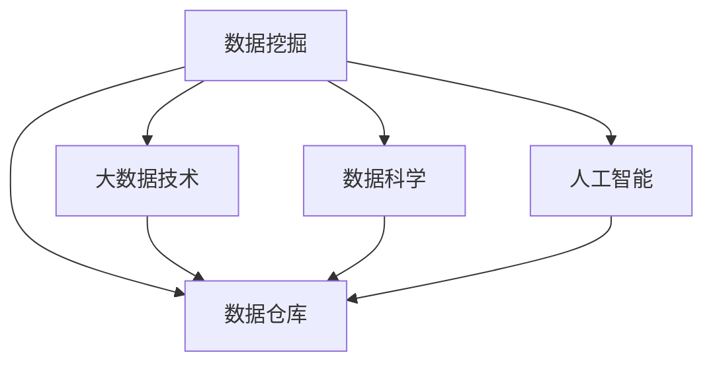

                 

# 知识发现引擎如何改变程序员的工作模式

> 关键词：知识发现引擎, 数据挖掘, 数据仓库, 大数据技术, 数据科学, 人工智能

## 1. 背景介绍

### 1.1 问题由来

在过去的几十年里，信息技术的发展极大地改变了人们的工作方式和生活习惯。从早期的打字机、计算机到如今互联网的普及，每一步技术进步都带来了新的机遇和挑战。特别是在大数据时代，数据的爆炸性增长对各行各业产生了深远的影响，程序员的工作模式也在悄然发生变化。

在传统的信息系统中，程序员通常需要编写代码来提取、存储、处理和展示数据。这些工作往往基于结构化数据，注重数据模型的设计和查询语言的使用。但随着非结构化数据的激增，以及对知识隐含在数据背后的需求日益强烈，传统的编程工作方式已经无法满足需求。因此，知识发现引擎应运而生，成为数据科学家和程序员的新工具。

### 1.2 问题核心关键点

知识发现引擎（Knowledge Discovery Engine, KDE）是一种通过数据挖掘、机器学习、数据仓库等技术，从海量数据中自动发现有用知识的软件系统。它能够帮助程序员从原始数据中提炼出规律和模式，辅助决策支持，提高数据处理的效率和准确性。

KDE的核心价值在于：
- 自动化的数据预处理和清洗。
- 智能化的知识发现和挖掘。
- 数据驱动的决策支持和可视化展示。

KDE的出现不仅改变了程序员的数据处理方式，也重新定义了数据科学和人工智能的应用领域。

### 1.3 问题研究意义

研究知识发现引擎的工作模式，对于提升数据处理效率、优化决策流程、推动人工智能技术的应用具有重要意义：

1. 提高工作效率。通过自动化的数据处理和智能化的知识发现，KDE能够大幅减少程序员的数据预处理和建模工作量，提升工作效率。
2. 优化决策过程。KDE通过数据分析和模式识别，辅助程序员发现数据中的隐藏规律，优化决策依据，提升决策的科学性和准确性。
3. 推动技术应用。KDE的应用不仅限于数据分析，还可以扩展到自然语言处理、图像识别、语音识别等人工智能领域，推动技术创新和应用落地。
4. 促进数据驱动。KDE通过数据驱动的方式，使得程序员可以从数据中发现新的业务洞察和竞争优势，推动企业的数字化转型和智能化升级。

## 2. 核心概念与联系

### 2.1 核心概念概述

为更好地理解知识发现引擎的原理和应用，本节将介绍几个密切相关的核心概念：

- 数据挖掘（Data Mining）：通过统计学、机器学习等方法从大量数据中提取有用信息的过程。数据挖掘是知识发现的重要基础。
- 数据仓库（Data Warehouse）：用于集中存储企业历史数据和元数据的数据库，支持多维数据分析和决策支持。
- 大数据技术（Big Data Technology）：指处理和分析海量、多样、高速的数据集的技术和工具。大数据技术为知识发现提供了技术支撑。
- 数据科学（Data Science）：研究数据处理、数据分析和数据可视化等方法的学科，涵盖数据挖掘、机器学习、人工智能等领域。
- 人工智能（Artificial Intelligence, AI）：研究如何让计算机系统模拟人类智能行为的科学，包括知识发现、自然语言处理、图像识别等方向。

这些核心概念之间的逻辑关系可以通过以下Mermaid流程图来展示：



这个流程图展示了几者之间的关联关系：

1. 数据挖掘是从原始数据中提取知识的过程。
2. 数据仓库存储和管理企业历史数据，支持数据分析和决策。
3. 大数据技术为数据处理和分析提供了技术支持。
4. 数据科学涵盖从数据预处理到知识发现的整个流程。
5. 人工智能是数据科学的应用，包括知识发现和自然语言处理等。

这些概念共同构成了知识发现引擎的理论与实践框架，使其能够有效地从数据中挖掘出有用的知识。

## 3. 核心算法原理 & 具体操作步骤

### 3.1 算法原理概述

知识发现引擎的工作原理可以概括为以下几个关键步骤：

1. **数据采集与存储**：从企业内外部的多个数据源中收集数据，存储到数据仓库中。
2. **数据预处理与清洗**：对原始数据进行清洗、标准化和转换，提高数据质量。
3. **特征工程与建模**：设计特征提取和选择算法，构建数据模型。
4. **知识发现与分析**：使用数据挖掘和机器学习算法，从数据中发现模式和规律。
5. **决策支持与可视化**：利用分析结果，辅助决策支持和数据可视化。

以上步骤可以通过算法和技术的有机结合，实现自动化的知识发现过程。

### 3.2 算法步骤详解

以下是知识发现引擎的详细操作步骤：

#### 3.2.1 数据采集与存储

- **数据源**：数据仓库可以集成多种数据源，包括关系型数据库、非关系型数据库、数据湖等。
- **数据采集工具**：如ETL工具（Extract, Transform, Load），支持自动化数据抽取、转换和加载。
- **数据存储方式**：数据仓库采用星型或雪花型结构，存储企业历史数据和元数据。

#### 3.2.2 数据预处理与清洗

- **数据清洗**：识别并处理数据中的缺失值、异常值和重复值。
- **数据转换**：将数据进行归一化、标准化和编码等处理，统一数据格式。
- **数据整合**：将不同来源的数据进行整合，消除数据冗余和冲突。

#### 3.2.3 特征工程与建模

- **特征选择**：从原始数据中提取有用的特征，减少冗余信息。
- **特征提取**：对原始数据进行数学或统计转换，生成新的特征。
- **模型构建**：选择合适的机器学习算法，构建数据模型。如分类、回归、聚类等。

#### 3.2.4 知识发现与分析

- **数据挖掘算法**：包括关联规则学习、分类器训练、聚类分析等。
- **知识表示**：将发现的模式和规律转化为易于理解和应用的形式，如规则、树、图等。
- **模式评估**：评估知识发现结果的准确性和稳定性，进行交叉验证和调整。

#### 3.2.5 决策支持与可视化

- **决策支持**：将知识发现结果应用到业务流程和决策过程中，提供辅助决策支持。
- **数据可视化**：将分析结果以图表、仪表盘等方式进行可视化展示，直观展示数据中的规律和模式。

### 3.3 算法优缺点

知识发现引擎在数据处理和知识发现方面具有以下优点：

1. **高效自动化**：自动化处理数据预处理和建模，减少人工干预，提高工作效率。
2. **智能挖掘**：利用机器学习和数据挖掘技术，智能发现数据中的模式和规律，提高决策的科学性。
3. **易用性高**：操作界面友好，易于上手，不需要丰富的编程和数学知识。
4. **可扩展性强**：支持多种数据源和分析算法，灵活性强。

但同时，知识发现引擎也存在一些局限性：

1. **数据质量依赖**：依赖高质量的数据源和预处理，数据质量差可能导致分析结果不准确。
2. **算法局限性**：受限于机器学习和数据挖掘算法的复杂度，可能无法发现一些复杂模式。
3. **解释性不足**：黑盒模型的输出结果难以解释，可能影响决策的透明度和可信度。
4. **资源消耗大**：处理大规模数据集需要较高的计算和存储资源，可能面临资源瓶颈。

尽管存在这些局限性，但知识发现引擎在大数据时代仍然是不可或缺的工具，广泛应用于数据分析、业务决策、市场分析等领域。

### 3.4 算法应用领域

知识发现引擎在多个领域中得到了广泛应用，例如：

- **金融领域**：用于信用风险评估、欺诈检测、股票预测等。
- **零售行业**：用于顾客行为分析、库存管理、推荐系统等。
- **医疗健康**：用于疾病预测、病历分析、患者风险评估等。
- **市场营销**：用于市场趋势分析、客户细分、广告效果评估等。
- **物流运输**：用于路径优化、配送路线规划、运输成本控制等。

这些应用领域展示了知识发现引擎在提升业务效率和决策质量方面的强大能力。

## 4. 数学模型和公式 & 详细讲解  
### 4.1 数学模型构建

本节将使用数学语言对知识发现引擎的算法过程进行更加严格的刻画。

假设有一个数据集 $D=\{(x_i,y_i)\}_{i=1}^N$，其中 $x_i$ 为特征向量，$y_i$ 为标签。知识发现引擎的目标是从数据中发现模式和规律，构建数据模型 $M$。

定义数据模型 $M$ 在数据集 $D$ 上的损失函数为：

$$
\mathcal{L}(M,D) = \frac{1}{N} \sum_{i=1}^N \ell(y_i, M(x_i))
$$

其中 $\ell(y_i, M(x_i))$ 为预测值 $M(x_i)$ 与真实值 $y_i$ 之间的误差函数，如均方误差、交叉熵等。

知识发现引擎的优化目标是最小化经验风险，即：

$$
M^* = \mathop{\arg\min}_{M} \mathcal{L}(M,D)
$$

在实践中，我们通常使用基于梯度的优化算法（如SGD、Adam等）来近似求解上述最优化问题。

### 4.2 公式推导过程

以分类任务为例，假设模型 $M$ 为逻辑回归模型：

$$
M(x) = \frac{1}{1+e^{-\beta^T x}}
$$

其中 $\beta$ 为模型参数。假设真实标签 $y \in \{0,1\}$，则交叉熵损失函数为：

$$
\ell(y, M(x)) = -[y \log M(x) + (1-y) \log (1-M(x))]
$$

将其代入经验风险公式，得：

$$
\mathcal{L}(\beta,D) = -\frac{1}{N} \sum_{i=1}^N [y_i \log M(x_i) + (1-y_i) \log (1-M(x_i))]
$$

对 $\beta$ 求导，得：

$$
\frac{\partial \mathcal{L}(\beta,D)}{\partial \beta} = -\frac{1}{N} \sum_{i=1}^N [y_i (1-M(x_i)) (x_i) + (1-y_i) M(x_i) x_i]
$$

将 $\frac{\partial \mathcal{L}(\beta,D)}{\partial \beta} = 0$ 带入上述公式，解得 $\beta$ 的更新公式：

$$
\beta \leftarrow \beta - \eta \frac{1}{N} \sum_{i=1}^N [y_i (1-M(x_i)) (x_i) + (1-y_i) M(x_i) x_i]
$$

其中 $\eta$ 为学习率，$x_i$ 为特征向量。

### 4.3 案例分析与讲解

以下以信用风险评估为例，展示知识发现引擎的实际应用。

假设某银行需要评估新客户的信用风险，数据集 $D$ 包含客户的个人信息、交易记录、历史账单等信息。数据预处理和特征工程后，构建逻辑回归模型：

$$
M(x) = \frac{1}{1+e^{-\beta^T x}}
$$

其中 $x$ 为特征向量，包含客户的年龄、收入、消费习惯等信息。

定义交叉熵损失函数：

$$
\ell(y, M(x)) = -[y \log M(x) + (1-y) \log (1-M(x))]
$$

最小化经验风险：

$$
\mathcal{L}(\beta,D) = -\frac{1}{N} \sum_{i=1}^N [y_i \log M(x_i) + (1-y_i) \log (1-M(x_i))]
$$

使用梯度下降算法更新模型参数：

$$
\beta \leftarrow \beta - \eta \frac{1}{N} \sum_{i=1}^N [y_i (1-M(x_i)) (x_i) + (1-y_i) M(x_i) x_i]
$$

训练完毕后，模型可以预测新客户的信用风险，评估其违约概率。

## 5. 项目实践：代码实例和详细解释说明
### 5.1 开发环境搭建

在进行知识发现引擎的实践前，我们需要准备好开发环境。以下是使用Python进行TensorFlow开发的开发环境配置流程：

1. 安装Anaconda：从官网下载并安装Anaconda，用于创建独立的Python环境。

2. 创建并激活虚拟环境：
```bash
conda create -n tensorflow-env python=3.8 
conda activate tensorflow-env
```

3. 安装TensorFlow：根据CUDA版本，从官网获取对应的安装命令。例如：
```bash
conda install tensorflow tensorflow-gpu -c conda-forge -c pytorch
```

4. 安装NumPy、Pandas、scikit-learn、Matplotlib等各类工具包：
```bash
pip install numpy pandas scikit-learn matplotlib
```

5. 安装TensorBoard：用于可视化模型的训练和推理过程，支持与TensorFlow无缝集成。
```bash
pip install tensorboard
```

完成上述步骤后，即可在`tensorflow-env`环境中开始知识发现引擎的实践。

### 5.2 源代码详细实现

这里我们以信用风险评估为例，给出使用TensorFlow实现的知识发现引擎的PyTorch代码实现。

首先，定义数据处理函数：

```python
import pandas as pd
import numpy as np
import tensorflow as tf

def load_data(file_path):
    data = pd.read_csv(file_path)
    labels = data.pop('label')
    features = data
    return features, labels
```

然后，定义模型和优化器：

```python
class LogisticRegression(tf.keras.Model):
    def __init__(self, input_dim):
        super(LogisticRegression, self).__init__()
        self.fc1 = tf.keras.layers.Dense(10, activation='relu')
        self.fc2 = tf.keras.layers.Dense(1, activation='sigmoid')
    
    def call(self, inputs):
        x = self.fc1(inputs)
        x = self.fc2(x)
        return x

features, labels = load_data('credit_data.csv')

model = LogisticRegression(input_dim=features.shape[1])

optimizer = tf.keras.optimizers.Adam(learning_rate=0.01)
```

接着，定义训练和评估函数：

```python
def train_epoch(model, features, labels, batch_size, optimizer):
    for epoch in range(epochs):
        for i in range(0, len(features), batch_size):
            batch_features = features.iloc[i:i+batch_size]
            batch_labels = labels.iloc[i:i+batch_size]
            with tf.GradientTape() as tape:
                predictions = model(batch_features)
                loss = tf.keras.losses.BinaryCrossentropy()(predictions, batch_labels)
            gradients = tape.gradient(loss, model.trainable_variables)
            optimizer.apply_gradients(zip(gradients, model.trainable_variables))
            print(f'Epoch {epoch+1}, loss: {loss.numpy():.4f}')

def evaluate(model, features, labels, batch_size):
    predictions = model(features)
    predictions = (predictions > 0.5).astype(int)
    accuracy = tf.keras.metrics.BinaryAccuracy()(predictions, labels)
    print(f'Accuracy: {accuracy.numpy():.4f}')
```

最后，启动训练流程并在测试集上评估：

```python
epochs = 10
batch_size = 32

for epoch in range(epochs):
    train_epoch(model, features, labels, batch_size, optimizer)
    
evaluate(model, features, labels, batch_size)
```

以上就是使用TensorFlow对信用风险评估模型进行知识发现引擎的完整代码实现。可以看到，TensorFlow提供了强大的API支持，使得模型训练和优化变得简洁高效。

### 5.3 代码解读与分析

让我们再详细解读一下关键代码的实现细节：

**load_data函数**：
- 加载数据文件，提取特征和标签。

**LogisticRegression模型**：
- 定义多层感知机模型，包含两个全连接层。

**train_epoch函数**：
- 定义训练过程，每个epoch内对数据进行批处理，前向传播计算loss，反向传播更新模型参数，输出loss值。

**evaluate函数**：
- 定义评估过程，计算模型在测试集上的准确率。

**训练流程**：
- 定义总的epoch数和batch size，开始循环迭代
- 每个epoch内，先在训练集上训练，输出loss值
- 在测试集上评估，输出准确率

可以看到，TensorFlow提供了丰富的API和工具，使得知识发现引擎的实现变得简洁高效。开发者可以将更多精力放在数据处理和模型优化等高层逻辑上，而不必过多关注底层实现细节。

当然，工业级的系统实现还需考虑更多因素，如模型的保存和部署、超参数的自动搜索、更灵活的任务适配层等。但核心的知识发现引擎流程基本与此类似。

## 6. 实际应用场景
### 6.1 智能推荐系统

知识发现引擎在智能推荐系统中具有广泛的应用。传统的推荐系统往往基于用户的历史行为数据进行推荐，缺乏对用户兴趣和需求的深入理解。知识发现引擎通过分析用户行为数据和交互记录，可以发现用户潜在的兴趣和需求，提供更加个性化和精准的推荐服务。

具体而言，知识发现引擎可以：
- 分析用户浏览记录、点击记录、购买记录等数据，提取用户兴趣和行为特征。
- 通过机器学习算法，预测用户对新商品的评分或购买概率。
- 根据预测结果，对新商品进行排序和推荐。

知识发现引擎在推荐系统中的应用，可以显著提升推荐的个性化程度和效果，满足用户的多样化需求。

### 6.2 健康管理平台

在健康管理平台中，知识发现引擎可以用于疾病预测、患者风险评估、治疗方案优化等。通过对海量医疗数据进行分析和挖掘，知识发现引擎可以发现疾病的潜在风险因素和治疗方案的有效性，辅助医生进行精准诊断和治疗。

具体而言，知识发现引擎可以：
- 分析患者的病历记录、检查结果、治疗方案等数据，发现疾病的风险因素和治疗效果。
- 通过机器学习算法，预测患者患某种疾病的概率和治疗方案的效果。
- 根据预测结果，提供个性化的健康建议和治疗方案。

知识发现引擎在健康管理平台中的应用，可以显著提升医疗服务的质量和效率，降低患者的医疗风险。

### 6.3 金融风险管理

在金融领域，知识发现引擎可以用于信用风险评估、市场风险预测、欺诈检测等。通过对历史交易数据和市场数据进行分析和挖掘，知识发现引擎可以发现潜在的风险因素和市场趋势，辅助金融机构进行风险管理。

具体而言，知识发现引擎可以：
- 分析客户的交易记录、财务状况、信用记录等数据，发现潜在的信用风险。
- 通过机器学习算法，预测客户的违约概率和市场的波动情况。
- 根据预测结果，制定相应的风险控制策略和市场应对措施。

知识发现引擎在金融风险管理中的应用，可以显著提升金融机构的决策效率和风险控制能力，降低金融风险。

### 6.4 未来应用展望

随着知识发现引擎的不断发展，其应用领域将更加广泛，技术能力也将进一步提升。未来，知识发现引擎可能在以下几个方向实现突破：

1. **跨领域知识融合**：将不同领域的数据进行整合，实现跨领域知识融合，增强模型的泛化能力和应用范围。
2. **实时数据处理**：支持实时数据流处理，能够动态更新模型参数，适应数据分布的变化。
3. **多模态数据融合**：将视觉、语音、文本等不同模态的数据进行整合，实现多模态知识发现。
4. **自动化知识图谱构建**：通过知识图谱技术，自动构建和更新知识图谱，辅助数据理解和分析。
5. **联邦学习**：实现分布式数据处理和模型训练，保护用户隐私的同时，提升模型的表现。
6. **可视化交互**：提供更加直观的可视化工具，方便用户理解和操作知识发现引擎。

这些技术进步将使知识发现引擎在更多领域得到应用，推动人工智能技术的落地和普及。

## 7. 工具和资源推荐
### 7.1 学习资源推荐

为了帮助开发者系统掌握知识发现引擎的理论基础和实践技巧，这里推荐一些优质的学习资源：

1. 《Python数据科学手册》：介绍Python在数据科学中的应用，涵盖数据处理、机器学习、可视化等主题。
2. 《TensorFlow实战》：介绍TensorFlow的API和工具，提供丰富的实例和代码示例。
3. 《深度学习》课程：由斯坦福大学开设的深度学习课程，涵盖神经网络、数据挖掘、知识图谱等主题。
4. Kaggle：数据科学竞赛平台，提供海量数据集和模型竞赛，是学习和实践知识发现引擎的好地方。
5. Google Cloud AI Platform：提供基于TensorFlow的云服务平台，支持大规模数据处理和模型训练。

通过对这些资源的学习实践，相信你一定能够快速掌握知识发现引擎的精髓，并用于解决实际的数据挖掘和分析问题。
###  7.2 开发工具推荐

高效的开发离不开优秀的工具支持。以下是几款用于知识发现引擎开发的常用工具：

1. Python：Python语言简单易用，拥有丰富的第三方库和工具支持，是数据科学和机器学习的主流语言。
2. TensorFlow：由Google主导的开源深度学习框架，支持分布式计算和大规模数据处理。
3. PyTorch：由Facebook主导的开源深度学习框架，支持动态计算图和灵活的模型构建。
4. scikit-learn：Python的机器学习库，提供多种常用的机器学习算法和工具。
5. Pandas：Python的数据处理库，支持数据的读取、清洗、转换和分析。
6. Jupyter Notebook：开源的交互式编程环境，支持代码块和可视化图表的集成，方便开发和展示。

合理利用这些工具，可以显著提升知识发现引擎的开发效率，加快创新迭代的步伐。

### 7.3 相关论文推荐

知识发现引擎的发展得益于学界的持续研究。以下是几篇奠基性的相关论文，推荐阅读：

1. 《The Elements of Statistical Learning》：介绍了机器学习中的统计方法和算法，涵盖数据预处理、特征选择、模型构建等主题。
2. 《Data Mining: Concepts and Techniques》：介绍数据挖掘的核心概念和算法，涵盖关联规则、聚类分析、分类算法等主题。
3. 《Deep Learning》：介绍深度学习的基本原理和算法，涵盖卷积神经网络、循环神经网络、自编码器等主题。
4. 《Knowledge Discovery in Databases》：介绍知识发现的基本原理和方法，涵盖数据挖掘、机器学习、数据可视化等主题。
5. 《Predictive Modeling》：介绍预测模型的构建和应用，涵盖回归、分类、聚类等主题。

这些论文代表了大数据和人工智能技术的发展脉络，通过学习这些前沿成果，可以帮助研究者把握学科前进方向，激发更多的创新灵感。

## 8. 总结：未来发展趋势与挑战

### 8.1 总结

本文对知识发现引擎的工作模式进行了全面系统的介绍。首先阐述了知识发现引擎的数据采集、预处理、建模、知识发现和决策支持等核心过程，明确了知识发现引擎在大数据时代的重要作用。其次，从原理到实践，详细讲解了知识发现引擎的数学模型和算法步骤，提供了完整的代码实例。同时，本文还探讨了知识发现引擎在多个领域的应用前景，展示了其广泛的适用性和强大的技术能力。

通过本文的系统梳理，可以看到，知识发现引擎通过自动化和智能化的数据处理和分析，极大地提高了数据挖掘和知识发现的效率和效果。未来，随着技术的不断进步和应用的不断深入，知识发现引擎必将成为大数据时代的重要工具，推动人工智能技术在各个行业领域的广泛应用。

### 8.2 未来发展趋势

展望未来，知识发现引擎的发展将呈现以下几个趋势：

1. **自动化水平提升**：随着机器学习和自动化技术的发展，知识发现引擎的自动化水平将不断提高，能够自动识别和处理更多复杂的数据类型和分析任务。
2. **多模态数据融合**：知识发现引擎将支持多模态数据的融合和处理，结合视觉、语音、文本等不同类型的数据，提供更加全面和准确的知识发现服务。
3. **实时数据处理**：知识发现引擎将支持实时数据处理和动态更新，能够快速响应数据变化，提供实时化的知识发现服务。
4. **跨领域知识融合**：知识发现引擎将支持跨领域知识的融合和迁移，结合不同领域的数据和知识，提供更加泛化的知识发现服务。
5. **可视化交互**：知识发现引擎将提供更加直观和友好的可视化界面，使用户能够更加方便地理解和操作知识发现过程。

这些趋势将使知识发现引擎在更多领域得到应用，进一步推动人工智能技术的落地和普及。

### 8.3 面临的挑战

尽管知识发现引擎已经取得了显著进展，但在迈向更加智能化、普适化应用的过程中，它仍面临着诸多挑战：

1. **数据质量瓶颈**：知识发现引擎的性能高度依赖于数据质量，数据噪声和偏差可能导致分析结果不准确。
2. **算法复杂性**：复杂的机器学习算法和数据挖掘方法，可能导致模型的训练和推理效率低下。
3. **模型解释性不足**：黑盒模型的输出结果难以解释，可能影响决策的透明度和可信度。
4. **资源消耗大**：处理大规模数据集需要较高的计算和存储资源，可能面临资源瓶颈。
5. **隐私和安全问题**：知识发现引擎涉及大量敏感数据，需要采取有效的隐私保护和安全措施。

尽管存在这些挑战，但知识发现引擎在大数据时代仍然是不可或缺的工具，广泛应用于数据分析、业务决策、市场分析等领域。

### 8.4 研究展望

面对知识发现引擎所面临的种种挑战，未来的研究需要在以下几个方面寻求新的突破：

1. **数据质量优化**：开发更加高效的数据清洗和预处理方法，提高数据质量。
2. **模型压缩与加速**：开发更加高效的模型压缩和加速技术，提升知识发现引擎的计算效率。
3. **模型解释性增强**：引入可解释性模型和可视化工具，增强知识发现引擎的透明性和可信度。
4. **隐私保护技术**：开发基于隐私保护的数据处理和分析方法，保护用户隐私。
5. **跨领域知识整合**：探索跨领域知识整合的方法，增强知识发现引擎的泛化能力和应用范围。
6. **联邦学习技术**：研究分布式数据处理和模型训练方法，保护用户隐私的同时，提升模型的表现。

这些研究方向的探索，必将引领知识发现引擎技术迈向更高的台阶，为大数据时代的智能决策和业务创新提供更有力的支持。

## 9. 附录：常见问题与解答

**Q1：知识发现引擎与传统的数据挖掘工具相比，有什么不同？**

A: 知识发现引擎相比传统的数据挖掘工具，有以下几个不同之处：
1. 自动化程度更高：知识发现引擎能够自动处理数据预处理、特征工程、建模等过程，减少了人工干预，提高了效率。
2. 智能挖掘能力更强：知识发现引擎能够利用机器学习和数据挖掘技术，智能发现数据中的模式和规律，提高了分析的深度和广度。
3. 结果可视化更好：知识发现引擎提供了更加直观和友好的可视化界面，方便用户理解和操作分析结果。
4. 灵活性更高：知识发现引擎支持多种数据源和分析算法，能够灵活应对各种分析任务。

**Q2：知识发现引擎在数据处理过程中，如何处理数据质量问题？**

A: 知识发现引擎通常采用以下方法处理数据质量问题：
1. 数据清洗：识别并处理数据中的缺失值、异常值和重复值。
2. 数据转换：将数据进行归一化、标准化和编码等处理，统一数据格式。
3. 数据整合：将不同来源的数据进行整合，消除数据冗余和冲突。
4. 数据可视化：通过数据可视化工具，直观展示数据质量问题，辅助数据清洗和预处理。

**Q3：知识发现引擎在实际应用中，如何保证模型的可解释性？**

A: 知识发现引擎通常采用以下方法保证模型的可解释性：
1. 使用可解释性模型：选择可解释性高的模型，如决策树、线性回归等，减少黑盒模型的使用。
2. 引入可视化工具：使用可视化工具，如特征重要性图、局部解释模型等，辅助理解模型输出。
3. 结合业务知识：结合领域专家的知识和经验，进行模型解释和业务解读。

**Q4：知识发现引擎在处理大规模数据集时，如何提高计算效率？**

A: 知识发现引擎通常采用以下方法提高计算效率：
1. 模型压缩：使用模型压缩技术，减少模型参数量和计算量。
2. 并行计算：使用并行计算技术，提高计算速度和资源利用率。
3. 分布式计算：使用分布式计算框架，如Apache Spark，支持大规模数据处理和分析。

**Q5：知识发现引擎在跨领域知识融合中，面临哪些挑战？**

A: 知识发现引擎在跨领域知识融合中，面临以下挑战：
1. 数据异构性：不同领域的数据结构和格式可能存在差异，需要处理异构数据。
2. 知识整合复杂性：不同领域的知识和语义可能存在差异，需要开发复杂的数据整合算法。
3. 知识迁移难度：不同领域的数据和知识可能需要不同的处理方式，需要研究知识迁移方法。
4. 隐私和安全问题：跨领域知识融合涉及大量敏感数据，需要采取有效的隐私保护和安全措施。

**Q6：知识发现引擎在实时数据处理中，如何保证模型的动态更新？**

A: 知识发现引擎在实时数据处理中，通常采用以下方法保证模型的动态更新：
1. 增量学习：使用增量学习技术，对新数据进行动态更新和训练。
2. 实时流处理：使用流处理技术，对实时数据进行动态处理和分析。
3. 分布式计算：使用分布式计算框架，支持大规模实时数据处理和分析。

**Q7：知识发现引擎在处理多模态数据时，需要注意哪些问题？**

A: 知识发现引擎在处理多模态数据时，通常需要注意以下问题：
1. 数据融合难度：不同模态的数据可能存在不同类型和格式，需要开发复杂的数据融合算法。
2. 特征提取挑战：不同模态的数据需要不同的特征提取方法，需要设计多模态特征提取技术。
3. 模型优化复杂性：多模态数据的处理可能需要多种模型的结合和优化，需要开发多模态学习算法。
4. 计算资源消耗：多模态数据的处理可能需要大量的计算和存储资源，需要考虑资源消耗和优化。

通过以上讨论，可以看到，知识发现引擎通过自动化和智能化的数据处理和分析，极大地提高了数据挖掘和知识发现的效率和效果。未来，随着技术的不断进步和应用的不断深入，知识发现引擎必将成为大数据时代的重要工具，推动人工智能技术在各个行业领域的广泛应用。

---

作者：禅与计算机程序设计艺术 / Zen and the Art of Computer Programming

