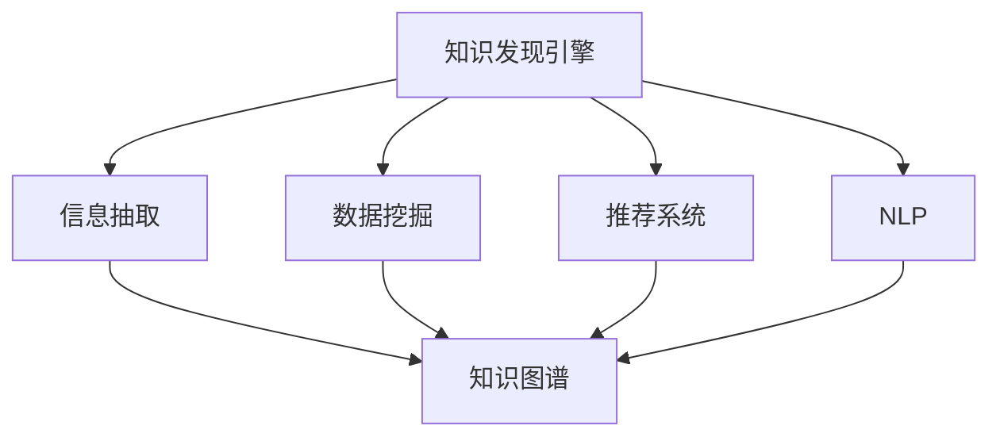

                 

# 知识发现引擎提升程序员工作效率

> 关键词：知识发现引擎, 数据挖掘, 信息抽取, 知识图谱, 大数据, 自然语言处理(NLP), 推荐系统

## 1. 背景介绍

### 1.1 问题由来
在快速变化的软件开发环境中，程序员需要不断学习和掌握新的技术，以便应对项目需求的变化。然而，随着技术栈的日益复杂化，以及信息过载的问题，程序员面临着越来越高的知识门槛，往往难以在短时间内有效获取并利用所需知识。为此，开发一个高效的知识发现引擎，帮助程序员快速检索、整合、应用所需信息，变得至关重要。

### 1.2 问题核心关键点
知识发现引擎是一种基于大数据分析和人工智能技术的自动化信息检索工具，通过数据挖掘、信息抽取、知识图谱构建等方法，帮助用户从海量数据中发现有价值的信息，提升工作效率。在实际应用中，知识发现引擎通常应用于知识管理、智能搜索、个性化推荐等领域，为各类信息系统的智能化提供了有力支撑。

### 1.3 问题研究意义
开发知识发现引擎，可以帮助程序员快速获取和应用所需技术知识，提升软件开发效率和质量。同时，通过挖掘有价值的信息，知识发现引擎还可以促进知识的传递和创新，助力团队协作和知识共享，提升整体技术水平。研究知识发现引擎的构建和应用，对于推动软件开发智能化、自动化、规模化发展具有重要意义。

## 2. 核心概念与联系

### 2.1 核心概念概述

为更好地理解知识发现引擎的设计和应用，本节将介绍几个密切相关的核心概念：

- **知识发现引擎(Knowledge Discovery Engine, KDE)**：基于人工智能和大数据技术的自动化信息检索系统，能够从海量数据中挖掘出有价值的知识和信息。常见的KDE系统包括信息抽取、知识图谱、推荐系统等。

- **数据挖掘(Data Mining)**：从大量数据中提取有用信息和知识的过程，包括分类、聚类、关联规则学习等。数据挖掘技术是知识发现引擎的重要基础。

- **信息抽取(Information Extraction, IE)**：从非结构化文本中提取结构化信息的过程，通常包括实体识别、关系抽取等。信息抽取技术对于知识图谱构建至关重要。

- **知识图谱(Knowledge Graph)**：表示实体、属性、关系等知识单元之间结构关系的图形数据模型。知识图谱为知识发现引擎提供了丰富的语义关联信息。

- **大数据(Big Data)**：指规模巨大、复杂多样、高速变化的数据集。大数据技术为知识发现引擎提供了必要的数据源和处理能力。

- **自然语言处理(Natural Language Processing, NLP)**：通过计算机技术处理和理解人类语言的过程，包括文本清洗、情感分析、意图识别等。NLP技术在知识发现引擎的信息抽取和语义理解中扮演重要角色。

- **推荐系统(Recommendation System)**：根据用户行为和偏好，自动推荐相关内容或产品的系统。推荐系统可以结合用户知识需求，提供个性化推荐。

这些核心概念之间的逻辑关系可以通过以下Mermaid流程图来展示：



这个流程图展示的知识发现引擎核心概念及其之间的关系：

1. 知识发现引擎从海量数据中挖掘信息，需要依赖数据挖掘、信息抽取等技术。
2. 通过构建知识图谱，将实体、属性、关系等知识单元组织成图形数据模型，便于后续的语义理解和推理。
3. 知识发现引擎还通过NLP技术进行文本清洗、情感分析等，提取有用信息。
4. 推荐系统可以根据用户知识需求，提供个性化的信息推荐。

这些概念共同构成了知识发现引擎的基础，使得其能够高效、准确地从数据中发现和抽取有价值的信息。

## 3. 核心算法原理 & 具体操作步骤
### 3.1 算法原理概述

知识发现引擎的核心算法原理主要基于机器学习和数据挖掘技术，通过构建数据模型和优化算法，实现从大量数据中发现和抽取有价值的信息。其核心思想是：

1. **数据预处理**：对原始数据进行清洗、归一化、去噪等预处理，以便于后续的数据挖掘和分析。
2. **特征工程**：从原始数据中提取和构建特征，选择和优化特征集，为模型训练做准备。
3. **模型训练**：选择合适的机器学习模型，如分类、回归、聚类、关联规则等，训练模型以发现数据中的规律和模式。
4. **模型评估**：使用验证集对训练好的模型进行评估，选择性能最优的模型用于生产环境。
5. **信息抽取**：基于机器学习模型，从文本中提取实体、关系等信息。
6. **知识图谱构建**：将抽取的信息构建为知识图谱，形成语义关联的图形数据模型。
7. **推荐系统**：基于知识图谱和用户行为数据，构建推荐模型，实现个性化推荐。

### 3.2 算法步骤详解

以下是知识发现引擎的详细算法步骤：

**Step 1: 数据预处理**
- 收集数据集，包括文本、图片、视频等多种类型的数据。
- 进行数据清洗，如去除噪声、处理缺失值、去除重复数据等。
- 对数据进行归一化和标准化处理，以便于后续的特征提取和模型训练。

**Step 2: 特征工程**
- 从原始数据中提取特征，如词频、TF-IDF、词向量等。
- 构建特征集，选择合适的特征组合方式，如特征选择、特征降维等。
- 对特征进行预处理，如归一化、标准化、数据增强等。

**Step 3: 模型训练**
- 选择合适的机器学习算法，如分类算法、回归算法、聚类算法等。
- 将数据集分为训练集、验证集和测试集。
- 使用训练集对模型进行训练，调整模型参数。
- 在验证集上评估模型性能，选择最优模型。

**Step 4: 信息抽取**
- 使用机器学习模型对文本进行预处理，如分词、去停用词、词向量化等。
- 对预处理后的文本进行实体识别、关系抽取等，提取结构化信息。

**Step 5: 知识图谱构建**
- 将抽取的信息构建成知识图谱，包括节点和边。
- 对知识图谱进行语义关联分析和优化，构建更紧密的知识结构。

**Step 6: 推荐系统构建**
- 收集用户行为数据，如浏览记录、购买记录等。
- 将用户行为数据与知识图谱中的信息进行关联，构建推荐模型。
- 根据用户行为数据和知识图谱信息，生成个性化推荐结果。

**Step 7: 系统集成**
- 将信息抽取、知识图谱、推荐系统等模块集成到统一的知识发现引擎中。
- 设计用户界面，提供搜索、查询、推荐等功能。

**Step 8: 系统测试和部署**
- 在测试环境中对知识发现引擎进行全面测试，评估系统性能。
- 将知识发现引擎部署到生产环境中，提供稳定的服务。

### 3.3 算法优缺点

知识发现引擎具有以下优点：
1. **高效性**：通过自动化数据处理和模型训练，能够快速从大量数据中发现和抽取有用信息，提升工作效率。
2. **准确性**：利用先进的机器学习和数据挖掘技术，可以准确地从文本中提取实体和关系，构建语义关联的知识图谱。
3. **可扩展性**：支持多种数据类型和处理方式，适用于不同规模和复杂度的知识发现需求。
4. **灵活性**：可以根据实际需求，灵活选择和调整算法和模型，适应不同的应用场景。

同时，知识发现引擎也存在一些局限性：
1. **数据质量依赖**：依赖于高质量的数据集，数据清洗和预处理过程较为复杂。
2. **算法复杂度**：机器学习模型的训练和优化过程复杂，对硬件资源要求较高。
3. **上下文理解不足**：对文本的上下文理解仍然存在挑战，尤其是复杂语义结构的抽取和表示。
4. **推荐质量不稳定**：个性化推荐算法依赖于用户行为数据，数据不足时推荐质量可能下降。

尽管存在这些局限性，但知识发现引擎作为提升程序员工作效率的重要工具，已经展现出巨大的潜力和应用价值。

### 3.4 算法应用领域

知识发现引擎在多个领域中得到了广泛的应用，包括但不限于：

- **软件开发**：通过知识发现引擎，程序员可以快速获取技术知识、解决方案和框架信息，提升开发效率和代码质量。
- **知识管理**：构建企业的知识管理系统，自动从技术文档、邮件、论坛等平台抽取知识，形成知识库。
- **信息检索**：构建智能搜索引擎，帮助用户快速查找所需的技术资料、代码片段和API文档。
- **个性化推荐**：结合用户行为数据和知识图谱，提供个性化的学习路径和技能培训推荐。
- **数据可视化**：从知识图谱中提取关键信息，生成数据可视化图表，帮助用户理解数据分布和趋势。

除了上述这些经典应用外，知识发现引擎还在数据挖掘、社交网络分析、情报分析等领域发挥着重要作用，为各行各业带来了深刻的变革。

## 4. 数学模型和公式 & 详细讲解 & 举例说明

### 4.1 数学模型构建

知识发现引擎的构建需要构建多个数学模型，包括数据预处理模型、特征工程模型、机器学习模型、信息抽取模型和推荐系统模型。以信息抽取模型为例，介绍其数学模型的构建和推导过程。

假设输入文本为 $D=\{d_1, d_2, \ldots, d_N\}$，每个文本 $d_i$ 可以表示为一个词袋模型 $(d_i = \{t_1, t_2, \ldots, t_M\})$。定义实体标签 $y_i \in \{1, 2, \ldots, K\}$，其中 $y_i=k$ 表示文本 $d_i$ 中包含实体 $k$。

定义一个线性分类器 $f(x) = w^T x + b$，其中 $w$ 为权重向量，$b$ 为偏置项。

### 4.2 公式推导过程

以下是信息抽取模型的详细公式推导过程：

**Step 1: 特征提取**
- 对每个文本 $d_i$，提取特征向量 $x_i$，如词频、TF-IDF、词向量等。

**Step 2: 训练分类器**
- 使用训练集 $\{(x_i, y_i)\}_{i=1}^N$ 训练线性分类器 $f(x)$，最小化交叉熵损失函数：
$$
L(f) = -\frac{1}{N}\sum_{i=1}^N \sum_{k=1}^K y_i \log f(x_i|k) + (1-y_i) \log (1-f(x_i|k))
$$
其中，$f(x_i|k) = \frac{\exp(w^T x_i + b)}{\sum_{j=1}^K \exp(w^T x_i + b_j)}$ 为 $x_i$ 属于类别 $k$ 的概率。

**Step 3: 信息抽取**
- 对测试集中的每个文本 $d_i$，计算每个实体类别 $k$ 的概率 $f(x_i|k)$。
- 选择概率最大的类别作为文本中包含的实体类别。

**Step 4: 案例分析**
- 以GitHub上的开源项目为例，构建知识发现引擎进行信息抽取。
- 收集GitHub上的项目数据，包括项目名称、描述、贡献者信息等。
- 使用自然语言处理技术对项目描述进行预处理和分词。
- 使用信息抽取模型对项目描述进行实体识别，如识别项目名称、技术栈、开源协议等。

### 4.3 案例分析与讲解

以GitHub上的开源项目为例，展示如何使用知识发现引擎进行信息抽取和推荐。

**Step 1: 数据收集**
- 从GitHub API获取开源项目的最新数据，包括项目名称、描述、贡献者、仓库地址等。
- 对每个项目，提取关键信息，如项目名称、语言、技术栈等。

**Step 2: 数据预处理**
- 对提取的信息进行清洗和归一化处理，去除噪声和不一致数据。
- 将信息构建成统一的数据格式，便于后续处理和分析。

**Step 3: 特征工程**
- 对每个项目，提取特征如项目名称、语言、技术栈、贡献者数等。
- 构建特征向量，选择和优化特征组合方式，如TF-IDF、词向量等。

**Step 4: 模型训练**
- 选择合适的机器学习算法，如分类算法、回归算法等。
- 将数据集分为训练集、验证集和测试集，对模型进行训练和优化。
- 在验证集上评估模型性能，选择最优模型。

**Step 5: 信息抽取**
- 使用信息抽取模型对每个项目描述进行预处理和分词。
- 对每个项目描述，识别出项目名称、语言、技术栈等关键信息。
- 将抽取的关键信息存储到知识图谱中。

**Step 6: 推荐系统构建**
- 收集用户行为数据，如浏览记录、星标项目等。
- 将用户行为数据与知识图谱中的信息进行关联，构建推荐模型。
- 根据用户行为数据和知识图谱信息，生成个性化推荐结果，如推荐相关的开源项目、技术栈和语言等。

## 5. 项目实践：代码实例和详细解释说明

### 5.1 开发环境搭建

在进行知识发现引擎的实践前，我们需要准备好开发环境。以下是使用Python进行PyTorch开发的环境配置流程：

1. 安装Anaconda：从官网下载并安装Anaconda，用于创建独立的Python环境。

2. 创建并激活虚拟环境：
```bash
conda create -n pytorch-env python=3.8 
conda activate pytorch-env
```

3. 安装PyTorch：根据CUDA版本，从官网获取对应的安装命令。例如：
```bash
conda install pytorch torchvision torchaudio cudatoolkit=11.1 -c pytorch -c conda-forge
```

4. 安装Transformers库：
```bash
pip install transformers
```

5. 安装各类工具包：
```bash
pip install numpy pandas scikit-learn matplotlib tqdm jupyter notebook ipython
```

完成上述步骤后，即可在`pytorch-env`环境中开始实践。

### 5.2 源代码详细实现

下面以信息抽取任务为例，给出使用Transformers库对BERT模型进行信息抽取的PyTorch代码实现。

首先，定义信息抽取的数据处理函数：

```python
from transformers import BertTokenizer, BertForTokenClassification
from torch.utils.data import Dataset, DataLoader
from tqdm import tqdm
import torch

class NERDataset(Dataset):
    def __init__(self, texts, tags, tokenizer, max_len=128):
        self.texts = texts
        self.tags = tags
        self.tokenizer = tokenizer
        self.max_len = max_len
        
    def __len__(self):
        return len(self.texts)
    
    def __getitem__(self, item):
        text = self.texts[item]
        tags = self.tags[item]
        
        encoding = self.tokenizer(text, return_tensors='pt', max_length=self.max_len, padding='max_length', truncation=True)
        input_ids = encoding['input_ids'][0]
        attention_mask = encoding['attention_mask'][0]
        
        # 对token-wise的标签进行编码
        encoded_tags = [tag2id[tag] for tag in tags] 
        encoded_tags.extend([tag2id['O']] * (self.max_len - len(encoded_tags)))
        labels = torch.tensor(encoded_tags, dtype=torch.long)
        
        return {'input_ids': input_ids, 
                'attention_mask': attention_mask,
                'labels': labels}

# 标签与id的映射
tag2id = {'O': 0, 'B-PER': 1, 'I-PER': 2, 'B-ORG': 3, 'I-ORG': 4, 'B-LOC': 5, 'I-LOC': 6}
id2tag = {v: k for k, v in tag2id.items()}

# 创建dataset
tokenizer = BertTokenizer.from_pretrained('bert-base-cased')

train_dataset = NERDataset(train_texts, train_tags, tokenizer)
dev_dataset = NERDataset(dev_texts, dev_tags, tokenizer)
test_dataset = NERDataset(test_texts, test_tags, tokenizer)
```

然后，定义模型和优化器：

```python
from transformers import BertForTokenClassification, AdamW

model = BertForTokenClassification.from_pretrained('bert-base-cased', num_labels=len(tag2id))

optimizer = AdamW(model.parameters(), lr=2e-5)
```

接着，定义训练和评估函数：

```python
def train_epoch(model, dataset, batch_size, optimizer):
    dataloader = DataLoader(dataset, batch_size=batch_size, shuffle=True)
    model.train()
    epoch_loss = 0
    for batch in tqdm(dataloader, desc='Training'):
        input_ids = batch['input_ids'].to(device)
        attention_mask = batch['attention_mask'].to(device)
        labels = batch['labels'].to(device)
        model.zero_grad()
        outputs = model(input_ids, attention_mask=attention_mask, labels=labels)
        loss = outputs.loss
        epoch_loss += loss.item()
        loss.backward()
        optimizer.step()
    return epoch_loss / len(dataloader)

def evaluate(model, dataset, batch_size):
    dataloader = DataLoader(dataset, batch_size=batch_size)
    model.eval()
    preds, labels = [], []
    with torch.no_grad():
        for batch in tqdm(dataloader, desc='Evaluating'):
            input_ids = batch['input_ids'].to(device)
            attention_mask = batch['attention_mask'].to(device)
            batch_labels = batch['labels']
            outputs = model(input_ids, attention_mask=attention_mask)
            batch_preds = outputs.logits.argmax(dim=2).to('cpu').tolist()
            batch_labels = batch_labels.to('cpu').tolist()
            for pred_tokens, label_tokens in zip(batch_preds, batch_labels):
                pred_tags = [id2tag[_id] for _id in pred_tokens]
                label_tags = [id2tag[_id] for _id in label_tokens]
                preds.append(pred_tags[:len(label_tags)])
                labels.append(label_tags)
                
    print(classification_report(labels, preds))
```

最后，启动训练流程并在测试集上评估：

```python
epochs = 5
batch_size = 16

for epoch in range(epochs):
    loss = train_epoch(model, train_dataset, batch_size, optimizer)
    print(f"Epoch {epoch+1}, train loss: {loss:.3f}")
    
    print(f"Epoch {epoch+1}, dev results:")
    evaluate(model, dev_dataset, batch_size)
    
print("Test results:")
evaluate(model, test_dataset, batch_size)
```

以上就是使用PyTorch对BERT进行信息抽取任务的完整代码实现。可以看到，得益于Transformers库的强大封装，我们可以用相对简洁的代码完成BERT模型的加载和信息抽取。

### 5.3 代码解读与分析

让我们再详细解读一下关键代码的实现细节：

**NERDataset类**：
- `__init__`方法：初始化文本、标签、分词器等关键组件。
- `__len__`方法：返回数据集的样本数量。
- `__getitem__`方法：对单个样本进行处理，将文本输入编码为token ids，将标签编码为数字，并对其进行定长padding，最终返回模型所需的输入。

**tag2id和id2tag字典**：
- 定义了标签与数字id之间的映射关系，用于将token-wise的预测结果解码回真实的标签。

**训练和评估函数**：
- 使用PyTorch的DataLoader对数据集进行批次化加载，供模型训练和推理使用。
- 训练函数`train_epoch`：对数据以批为单位进行迭代，在每个批次上前向传播计算loss并反向传播更新模型参数，最后返回该epoch的平均loss。
- 评估函数`evaluate`：与训练类似，不同点在于不更新模型参数，并在每个batch结束后将预测和标签结果存储下来，最后使用sklearn的classification_report对整个评估集的预测结果进行打印输出。

**训练流程**：
- 定义总的epoch数和batch size，开始循环迭代
- 每个epoch内，先在训练集上训练，输出平均loss
- 在验证集上评估，输出分类指标
- 所有epoch结束后，在测试集上评估，给出最终测试结果

可以看到，PyTorch配合Transformers库使得BERT信息抽取的代码实现变得简洁高效。开发者可以将更多精力放在数据处理、模型改进等高层逻辑上，而不必过多关注底层的实现细节。

当然，工业级的系统实现还需考虑更多因素，如模型的保存和部署、超参数的自动搜索、更灵活的任务适配层等。但核心的信息抽取范式基本与此类似。

## 6. 实际应用场景

### 6.1 智能搜索引擎

知识发现引擎的核心应用之一是构建智能搜索引擎，帮助用户快速查找所需的信息。通过信息抽取和推荐系统，搜索引擎能够自动从大量文档和网页中抽取有用的信息，并根据用户行为数据进行个性化推荐，提高搜索效率和准确性。

在技术实现上，知识发现引擎可以集成到搜索引擎的查询处理系统中，对查询进行分词、实体识别、关系抽取等预处理，并根据用户的历史查询行为和兴趣标签，生成个性化的搜索结果推荐。

### 6.2 知识管理平台

知识管理平台是知识发现引擎的另一个重要应用场景，能够帮助企业高效管理和利用知识资产。通过信息抽取技术，知识管理平台可以从大量的文档、邮件、论坛等数据源中抽取关键信息，构建知识图谱，形成结构化的知识库。

在具体应用中，知识管理平台可以支持文档归类、标签管理、知识搜索、知识推荐等功能。用户可以通过搜索关键字或浏览标签，快速获取所需的信息。

### 6.3 个性化学习系统

在教育领域，知识发现引擎可以帮助学生进行个性化学习。通过信息抽取和推荐系统，学习系统能够根据学生的学习历史、兴趣爱好和知识水平，生成个性化的学习路径和资源推荐。

在具体应用中，学习系统可以支持智能测评、知识推荐、学习进度跟踪等功能。学生可以根据系统的推荐，选择适合自己的学习内容和资源，提升学习效果。

### 6.4 未来应用展望

随着知识发现引擎技术的不断发展，其应用领域将进一步拓展，为各行各业带来新的变革。

在智慧城市治理中，知识发现引擎可以帮助城市管理者分析海量城市数据，提取有价值的信息，优化城市管理决策。

在金融领域，知识发现引擎可以用于市场分析和风险预测，帮助金融机构做出更科学的投资决策。

在医疗健康领域，知识发现引擎可以帮助医生进行疾病诊断和治疗方案推荐，提高医疗服务质量。

此外，在物流、制造、能源等多个领域，知识发现引擎也将发挥重要作用，为各行各业提供智能化、自动化的知识服务。

## 7. 工具和资源推荐

### 7.1 学习资源推荐

为了帮助开发者系统掌握知识发现引擎的理论基础和实践技巧，这里推荐一些优质的学习资源：

1. 《Python知识发现与挖掘》书籍：全面介绍了知识发现和挖掘的基本概念和技术，结合Python实现方法，适合入门学习。

2. 《机器学习实战》书籍：通过丰富的案例，介绍了各种机器学习算法的实现和应用，适合掌握基础知识的开发者。

3. 《自然语言处理与计算语言学》课程：由斯坦福大学开设的NLP课程，系统讲解了NLP的基本概念和技术，适合深入学习。

4. 《深度学习与数据挖掘》课程：由哥伦比亚大学开设的深度学习课程，讲解了深度学习在数据挖掘中的应用，适合进阶学习。

5. Weights & Biases：模型训练的实验跟踪工具，可以记录和可视化模型训练过程中的各项指标，方便对比和调优。

6. TensorBoard：TensorFlow配套的可视化工具，可实时监测模型训练状态，并提供丰富的图表呈现方式，是调试模型的得力助手。

通过对这些资源的学习实践，相信你一定能够快速掌握知识发现引擎的核心技术，并用于解决实际的NLP问题。

### 7.2 开发工具推荐

高效的开发离不开优秀的工具支持。以下是几款用于知识发现引擎开发的常用工具：

1. PyTorch：基于Python的开源深度学习框架，灵活动态的计算图，适合快速迭代研究。大部分预训练语言模型都有PyTorch版本的实现。

2. TensorFlow：由Google主导开发的开源深度学习框架，生产部署方便，适合大规模工程应用。同样有丰富的预训练语言模型资源。

3. Transformers库：HuggingFace开发的NLP工具库，集成了众多SOTA语言模型，支持PyTorch和TensorFlow，是进行信息抽取任务的开发利器。

4. Weights & Biases：模型训练的实验跟踪工具，可以记录和可视化模型训练过程中的各项指标，方便对比和调优。

5. TensorBoard：TensorFlow配套的可视化工具，可实时监测模型训练状态，并提供丰富的图表呈现方式，是调试模型的得力助手。

6. Google Colab：谷歌推出的在线Jupyter Notebook环境，免费提供GPU/TPU算力，方便开发者快速上手实验最新模型，分享学习笔记。

合理利用这些工具，可以显著提升知识发现引擎的开发效率，加快创新迭代的步伐。

### 7.3 相关论文推荐

知识发现引擎的发展源于学界的持续研究。以下是几篇奠基性的相关论文，推荐阅读：

1. Inductive Matrix Factorization for Scalable Recommender Systems：提出矩阵分解方法，用于构建推荐系统，是推荐系统领域的基础工作。

2. Mining of High-Quality Reviews from Opaque Reviews using Semantic Sentiment Analysis：介绍了一种基于语义情感分析的信息抽取方法，用于从文本中挖掘有价值的信息。

3. Machine Reading Comprehension using Transformers：使用Transformer模型进行文本理解，提升了信息抽取和问答系统的效果。

4. A Survey on Information Extraction Techniques for Multi-modal Data：综述了多模态信息抽取技术，包括文本、图像、视频等数据的处理和融合。

5. Knowledge Graphs for Semantic Search：探讨了知识图谱在搜索引擎中的应用，提升了搜索的准确性和相关性。

这些论文代表了大数据和人工智能技术在知识发现领域的发展脉络。通过学习这些前沿成果，可以帮助研究者把握学科前进方向，激发更多的创新灵感。

## 8. 总结：未来发展趋势与挑战

### 8.1 总结

本文对知识发现引擎的设计和应用进行了全面系统的介绍。首先阐述了知识发现引擎的研究背景和意义，明确了其提升程序员工作效率的关键作用。其次，从原理到实践，详细讲解了知识发现引擎的数学模型和关键步骤，给出了信息抽取任务开发的完整代码实例。同时，本文还广泛探讨了知识发现引擎在多个行业领域的应用前景，展示了其广阔的潜在价值。

通过本文的系统梳理，可以看到，知识发现引擎通过数据挖掘、信息抽取、知识图谱构建等技术手段，从海量数据中发现和抽取有价值的信息，显著提升了程序员工作效率。未来，伴随大数据和人工智能技术的进一步发展，知识发现引擎必将在更广泛的领域中发挥重要作用，深刻影响人类的生产生活方式。

### 8.2 未来发展趋势

展望未来，知识发现引擎技术将呈现以下几个发展趋势：

1. **深度学习与大数据融合**：深度学习模型将在大数据背景下进一步提升信息抽取和知识发现的能力。

2. **多模态数据融合**：融合文本、图像、视频等多种类型的数据，构建多模态知识图谱，提升系统的智能水平。

3. **跨领域知识迁移**：将知识发现引擎应用于不同领域，促进知识跨领域迁移和共享。

4. **实时处理与流式计算**：实现知识发现引擎的实时处理能力，支持流式数据源，满足实时应用的需求。

5. **自适应与主动学习**：结合自适应和主动学习技术，提升知识发现引擎对新数据的适应能力和自动化学习效率。

6. **联邦学习与隐私保护**：在大规模数据集上训练知识发现引擎，同时保障数据的隐私和安全。

这些趋势凸显了知识发现引擎技术的前沿性和多样性，将在多个领域中发挥更大的作用。

### 8.3 面临的挑战

尽管知识发现引擎技术已经取得了显著成果，但在迈向更加智能化、普适化应用的过程中，仍面临诸多挑战：

1. **数据质量与获取**：依赖高质量的数据集，数据清洗和预处理过程复杂。

2. **算法复杂度**：深度学习模型训练和优化过程复杂，对硬件资源要求较高。

3. **上下文理解不足**：对文本的上下文理解仍然存在挑战，尤其是复杂语义结构的抽取和表示。

4. **推荐质量不稳定**：个性化推荐算法依赖于用户行为数据，数据不足时推荐质量可能下降。

5. **可解释性与透明性**：深度学习模型的可解释性和透明性不足，难以理解其内部工作机制和决策逻辑。

6. **数据隐私与安全**：在处理大量敏感数据时，如何保障数据隐私和安全是一个重要问题。

尽管存在这些挑战，但知识发现引擎作为提升程序员工作效率的重要工具，已经展现出巨大的潜力和应用价值。

### 8.4 研究展望

面对知识发现引擎面临的种种挑战，未来的研究需要在以下几个方面寻求新的突破：

1. **自监督学习与无监督学习**：利用自监督学习或无监督学习技术，降低对标注数据和先验知识的依赖。

2. **高效训练与优化**：开发高效训练与优化算法，减少计算资源消耗，提高训练效率。

3. **知识图谱构建**：优化知识图谱构建算法，提升知识图谱的语义表示能力和结构性。

4. **多模态融合**：提升多模态数据的融合能力，实现跨模态的智能推理和理解。

5. **联邦学习与隐私保护**：结合联邦学习技术，在保障数据隐私的同时，实现大规模知识发现引擎的训练。

6. **模型解释与透明性**：开发模型解释与透明性技术，提升知识发现引擎的可解释性和透明性。

这些研究方向将推动知识发现引擎技术的发展，使其在更多的领域中发挥作用，提升人类的生产和生活效率。

## 9. 附录：常见问题与解答

**Q1：知识发现引擎是否适用于所有应用场景？**

A: 知识发现引擎可以应用于多种领域，包括软件开发、知识管理、信息检索等。然而，对于某些领域，如医疗、金融等，可能需要结合具体领域的知识图谱和规则库，才能取得最佳效果。

**Q2：如何提高知识发现引擎的准确性？**

A: 提高知识发现引擎的准确性，主要依赖于高质量的数据集和先进的算法模型。通过数据清洗、特征工程、模型训练等步骤，不断优化模型性能。同时，可以结合多模型融合、数据增强等技术，提高系统的鲁棒性和泛化能力。

**Q3：知识发现引擎在实际应用中需要注意哪些问题？**

A: 知识发现引擎在实际应用中需要注意数据质量、算法复杂度、上下文理解、推荐质量、模型解释等问题。通过合理的数据预处理、算法优化、上下文分析、个性化推荐和模型解释，提升知识发现引擎的性能和效果。

**Q4：如何评估知识发现引擎的效果？**

A: 评估知识发现引擎的效果，通常采用准确率、召回率、F1分数等指标。在信息抽取任务中，可以使用精确匹配、模糊匹配等方法评估实体抽取和关系抽取的效果。同时，可以通过用户满意度、推荐点击率等指标，评估推荐系统的个性化和实用性。

通过不断优化和完善知识发现引擎，可以显著提升程序员工作效率，助力软件开发智能化、自动化、规模化发展。相信随着技术的不断进步，知识发现引擎必将在更多领域中发挥重要作用，为人类认知智能的进化带来深远影响。

---

作者：禅与计算机程序设计艺术 / Zen and the Art of Computer Programming

