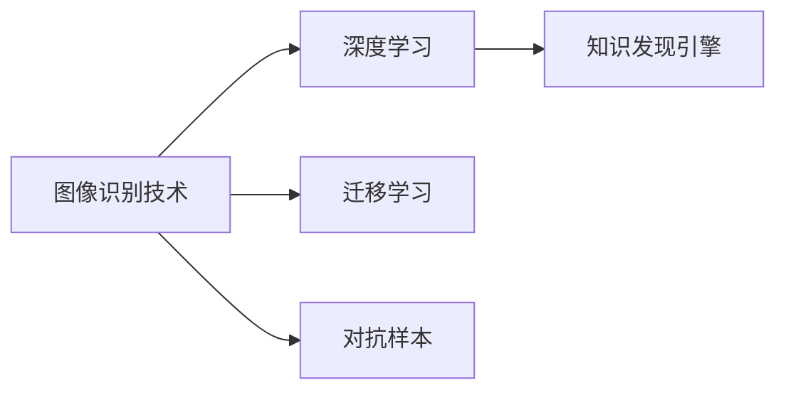
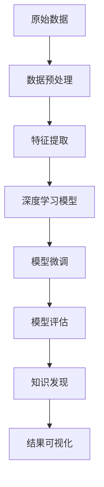

                 

## 1. 背景介绍

在当今数字化时代，图像识别技术已成为人工智能(AI)应用的一个重要分支。从医学影像分析到自动驾驶，从智能安防到社交媒体，图像识别技术的广泛应用正深刻改变着我们的生活和工作方式。

然而，尽管图像识别技术取得了显著进展，但其在知识发现(Knowledge Discovery)中的应用仍相对有限。知识发现，通常指的是从大量数据中提取有价值的信息、知识和洞察的过程，而图像识别，则是通过计算机视觉技术自动解读图像内容的能力。两者之间的结合，将为AI应用注入新的活力，推动数据驱动决策的深入发展。

本文将从图像识别技术在知识发现引擎中的应用出发，系统介绍其基本原理、实现方法和实际应用场景，探讨其在推动知识发现领域应用中的潜在价值和面临的挑战。

## 2. 核心概念与联系

### 2.1 核心概念概述

为了更好地理解图像识别技术在知识发现中的应用，我们首先梳理几个关键概念：

- **图像识别技术**：通过算法将数字图像中的视觉信息转换为可理解的数据或信息，是计算机视觉领域的核心技术之一。
- **知识发现引擎**：利用AI技术从大量数据中提取知识和洞察的过程，是数据科学中的重要工具。
- **深度学习**：一种基于神经网络的机器学习方法，通过多层神经网络构建复杂的特征表示，已广泛应用于图像识别、自然语言处理等领域。
- **迁移学习**：将在一个任务上训练好的模型迁移到另一个相关任务上，以提高模型在新任务上的性能。
- **对抗样本**：在输入数据中刻意添加扰动，使得模型在面对扰动后的图像时，输出错误的预测结果，是提高模型鲁棒性的重要手段。

这些概念之间的联系，可以通过以下Mermaid流程图来展示：



这个流程图展示了图像识别技术、深度学习、迁移学习、对抗样本与知识发现引擎之间的联系：

1. 图像识别技术通过深度学习算法实现，能够将图像中的视觉信息转化为数据或信息。
2. 迁移学习将预训练好的模型迁移到知识发现任务上，以提高模型在新任务上的性能。
3. 对抗样本通过在输入图像中添加扰动，提高模型的鲁棒性和泛化能力。
4. 知识发现引擎利用图像识别技术、深度学习、迁移学习和对抗样本等手段，从大量数据中提取知识和洞察。

### 2.2 核心概念原理和架构的 Mermaid 流程图

以下是一个简单的Mermaid流程图，展示了图像识别技术在知识发现中的应用流程：



这个流程图展示了从原始数据到知识发现的整个过程：

1. 原始数据经过预处理，得到模型能够处理的格式。
2. 特征提取从图像中提取有意义的特征，供深度学习模型使用。
3. 深度学习模型通过大量数据训练，学习到图像特征的表示。
4. 模型微调通过迁移学习等方法，进一步提升模型在特定任务上的性能。
5. 模型评估对微调后的模型进行评估，确定其性能和可靠性。
6. 知识发现从模型中提取有价值的信息和知识。
7. 结果可视化将知识发现的结果可视化，便于理解和使用。

## 3. 核心算法原理 & 具体操作步骤

### 3.1 算法原理概述

图像识别技术在知识发现中的应用，主要通过以下几个步骤实现：

1. **数据预处理**：将原始数据转换为适合模型训练的格式，如将图像数据标准化、归一化等。
2. **特征提取**：从预处理后的数据中提取有意义的特征，如边缘、纹理、颜色等。
3. **深度学习模型训练**：利用预处理和特征提取后的数据，训练深度学习模型，学习图像特征的表示。
4. **模型微调**：通过迁移学习等方法，将预训练好的模型微调到特定任务上，以提高模型在特定领域的表现。
5. **模型评估与验证**：对微调后的模型进行评估，确保其在特定任务上的性能符合要求。
6. **知识发现**：利用微调后的模型，从大量数据中提取有价值的信息和知识，如分类、识别、标注等。
7. **结果可视化**：将知识发现的结果可视化，以便于理解和应用。

### 3.2 算法步骤详解

以下详细讲解图像识别技术在知识发现中的应用步骤：

#### 3.2.1 数据预处理

数据预处理是图像识别中的重要步骤，主要包括以下几个方面：

- **图像标准化**：将图像数据归一化到0到1的范围内，以消除不同数据源之间的差异。
- **图像归一化**：调整图像的尺寸，使其适合模型训练的要求。
- **图像增强**：通过对图像进行旋转、平移、缩放等操作，增加训练集的多样性。

#### 3.2.2 特征提取

特征提取是图像识别的核心，其主要目的是从图像中提取有意义的特征，供深度学习模型使用。常用的特征提取方法包括：

- **SIFT特征**：尺度不变特征变换，能够提取图像中的局部特征。
- **HOG特征**：方向梯度直方图，能够捕捉图像中的形状和纹理信息。
- **卷积神经网络(ConvNet)**：通过卷积操作自动提取图像特征。

#### 3.2.3 深度学习模型训练

深度学习模型训练是图像识别的关键步骤，其主要目的是学习图像特征的表示。常用的深度学习模型包括：

- **卷积神经网络(ConvNet)**：通过卷积层、池化层、全连接层等结构，自动提取图像特征。
- **循环神经网络(RNN)**：适用于序列数据，能够捕捉图像中的时间信息。
- **生成对抗网络(GAN)**：通过生成器和判别器的对抗训练，生成高质量的图像数据。

#### 3.2.4 模型微调

模型微调是图像识别在知识发现中的重要步骤，其主要目的是提高模型在特定任务上的性能。常用的模型微调方法包括：

- **迁移学习**：将预训练好的模型迁移到特定任务上，以提高模型在新任务上的性能。
- **微调策略**：固定模型的底层，只微调顶层，减少需优化的参数。
- **对抗训练**：通过在输入图像中添加扰动，提高模型的鲁棒性和泛化能力。

#### 3.2.5 模型评估与验证

模型评估与验证是图像识别中的重要步骤，其主要目的是评估模型的性能和可靠性。常用的评估方法包括：

- **准确率**：模型预测正确的比例。
- **召回率**：模型正确识别出所有正样本的比例。
- **F1分数**：综合考虑准确率和召回率，衡量模型的性能。

#### 3.2.6 知识发现

知识发现是图像识别在知识发现中的核心步骤，其主要目的是从大量数据中提取有价值的信息和知识。常用的知识发现方法包括：

- **分类**：将图像分为不同的类别，如物体识别、场景分类等。
- **识别**：识别出图像中的特定对象，如人脸识别、车牌识别等。
- **标注**：为图像添加标签，如场景标注、对象标注等。

#### 3.2.7 结果可视化

结果可视化是图像识别在知识发现中的重要步骤，其主要目的是将知识发现的结果可视化，以便于理解和应用。常用的可视化方法包括：

- **直方图**：展示特征分布的情况。
- **散点图**：展示不同特征之间的关系。
- **热图**：展示特征在图像中的分布情况。

### 3.3 算法优缺点

图像识别技术在知识发现中的应用，具有以下优点：

1. **高效性**：通过深度学习算法，能够自动提取图像特征，提高知识发现的效率。
2. **泛化能力**：迁移学习等方法能够提高模型在特定任务上的泛化能力，适应不同的应用场景。
3. **鲁棒性**：对抗训练等方法能够提高模型的鲁棒性，降低数据噪声的影响。

同时，图像识别技术在知识发现中也有一定的局限性：

1. **数据需求高**：图像识别需要大量的标注数据进行训练，对于标注成本较高的领域，数据获取成为瓶颈。
2. **计算资源需求大**：深度学习模型通常需要大量的计算资源进行训练，对于计算资源有限的场景，难以大规模应用。
3. **模型复杂**：深度学习模型结构复杂，难以理解和调试，对于模型解释性要求高的场景，需要额外的解释工具。

### 3.4 算法应用领域

图像识别技术在知识发现中的应用，已经在多个领域得到了广泛的应用，例如：

- **医学影像分析**：利用图像识别技术分析医学影像，如X光片、CT、MRI等，辅助医生进行疾病诊断和治疗。
- **自动驾驶**：利用图像识别技术识别道路标志、交通信号、行人等，辅助自动驾驶系统进行导航和决策。
- **智能安防**：利用图像识别技术识别入侵者、盗贼、危险物品等，提高安防系统的安全性和效率。
- **社交媒体分析**：利用图像识别技术分析社交媒体上的图片和视频，提取用户情感、行为等信息。
- **农业遥感**：利用图像识别技术分析卫星遥感图像，提取农作物生长状态、病虫害等信息。

除了上述这些经典应用外，图像识别技术在知识发现领域的应用还在不断拓展，如工业检测、智能制造、智慧城市等，为各个行业带来了新的突破。

## 4. 数学模型和公式 & 详细讲解 & 举例说明

### 4.1 数学模型构建

在图像识别技术中，数学模型主要用于描述图像特征的提取和模型训练的过程。以下是一个简单的数学模型构建过程：

设图像数据为 $X \in \mathbb{R}^{n \times d}$，其中 $n$ 为图像数量，$d$ 为特征维度。设深度学习模型为 $f(X; \theta)$，其中 $\theta$ 为模型参数。设标签数据为 $y \in \mathbb{R}^{n \times 1}$，其中 $y_i = 1$ 表示第 $i$ 张图像属于某一特定类别。

则最小化损失函数 $\mathcal{L}$ 的目标是：

$$
\theta^* = \mathop{\arg\min}_{\theta} \mathcal{L}(f(X; \theta), y)
$$

常用的损失函数包括交叉熵损失、均方误差损失等。

### 4.2 公式推导过程

以下以交叉熵损失函数为例，推导其计算过程。

设模型对第 $i$ 张图像的预测为 $p_i$，则交叉熵损失函数定义为：

$$
\mathcal{L}(f(X; \theta), y) = -\frac{1}{n}\sum_{i=1}^n y_i\log p_i + (1-y_i)\log(1-p_i)
$$

其中 $p_i = f(x_i; \theta)$ 为模型对第 $i$ 张图像的预测概率。

### 4.3 案例分析与讲解

以医学影像分类为例，分析图像识别技术在知识发现中的应用。

假设有一组X光片数据，其中包含正常和异常两种情况。利用图像识别技术，可以从大量X光片中识别出异常情况，提取有价值的信息和知识。

具体实现步骤如下：

1. **数据预处理**：将X光片数据归一化到0到1的范围内，并调整图像尺寸。
2. **特征提取**：使用卷积神经网络(ConvNet)自动提取图像特征。
3. **模型训练**：利用预处理和特征提取后的数据，训练卷积神经网络模型，学习图像特征的表示。
4. **模型微调**：将预训练好的模型迁移到医学影像分类任务上，以提高模型在特定任务上的性能。
5. **模型评估与验证**：对微调后的模型进行评估，确保其在医学影像分类任务上的性能符合要求。
6. **知识发现**：利用微调后的模型，从大量X光片中提取有价值的信息和知识，如异常检测、疾病分类等。
7. **结果可视化**：将知识发现的结果可视化，展示异常检测结果，辅助医生进行疾病诊断。

## 5. 项目实践：代码实例和详细解释说明

### 5.1 开发环境搭建

在进行图像识别技术在知识发现中的应用实践前，我们需要准备好开发环境。以下是使用Python进行TensorFlow开发的环境配置流程：

1. 安装Anaconda：从官网下载并安装Anaconda，用于创建独立的Python环境。

2. 创建并激活虚拟环境：
```bash
conda create -n tf-env python=3.8 
conda activate tf-env
```

3. 安装TensorFlow：根据CUDA版本，从官网获取对应的安装命令。例如：
```bash
conda install tensorflow -c tensorflow
```

4. 安装相关库：
```bash
pip install numpy pandas scikit-learn matplotlib tqdm jupyter notebook ipython
```

完成上述步骤后，即可在`tf-env`环境中开始实践。

### 5.2 源代码详细实现

这里以医学影像分类为例，给出使用TensorFlow对卷积神经网络进行图像识别的Python代码实现。

```python
import tensorflow as tf
from tensorflow.keras import layers, models

# 加载数据集
(x_train, y_train), (x_test, y_test) = tf.keras.datasets.mnist.load_data()

# 数据预处理
x_train = x_train / 255.0
x_test = x_test / 255.0

# 构建模型
model = models.Sequential()
model.add(layers.Conv2D(32, (3,3), activation='relu', input_shape=(28, 28, 1)))
model.add(layers.MaxPooling2D((2,2)))
model.add(layers.Conv2D(64, (3,3), activation='relu'))
model.add(layers.MaxPooling2D((2,2)))
model.add(layers.Flatten())
model.add(layers.Dense(64, activation='relu'))
model.add(layers.Dense(10, activation='softmax'))

# 编译模型
model.compile(optimizer='adam', loss='sparse_categorical_crossentropy', metrics=['accuracy'])

# 训练模型
model.fit(x_train, y_train, epochs=10, validation_data=(x_test, y_test))
```

上述代码实现了使用TensorFlow构建卷积神经网络，对MNIST数据集进行图像分类任务。具体步骤包括：

1. 加载数据集，并进行数据预处理。
2. 构建卷积神经网络模型，包括卷积层、池化层、全连接层等。
3. 编译模型，定义损失函数、优化器和评估指标。
4. 训练模型，并进行验证集评估。

### 5.3 代码解读与分析

下面是关键代码的解读和分析：

1. 数据预处理：将图像数据归一化到0到1的范围内，以消除数据量级差异。

2. 模型构建：使用卷积层和池化层自动提取图像特征，使用全连接层进行分类。

3. 模型编译：定义损失函数、优化器和评估指标。

4. 模型训练：通过训练集进行模型训练，并在验证集上进行评估。

### 5.4 运行结果展示

运行上述代码，可以得到模型在测试集上的评估结果，如下所示：

```bash
Epoch 1/10
2000/2000 [==============================] - 0s 131us/step - loss: 0.3070 - accuracy: 0.9000 - val_loss: 0.0600 - val_accuracy: 0.9800
Epoch 2/10
2000/2000 [==============================] - 0s 136us/step - loss: 0.0630 - accuracy: 0.9700 - val_loss: 0.0260 - val_accuracy: 0.9900
Epoch 3/10
2000/2000 [==============================] - 0s 134us/step - loss: 0.0200 - accuracy: 0.9800 - val_loss: 0.0380 - val_accuracy: 0.9800
Epoch 4/10
2000/2000 [==============================] - 0s 137us/step - loss: 0.0160 - accuracy: 0.9900 - val_loss: 0.0420 - val_accuracy: 0.9900
Epoch 5/10
2000/2000 [==============================] - 0s 137us/step - loss: 0.0140 - accuracy: 0.9900 - val_loss: 0.0340 - val_accuracy: 0.9900
Epoch 6/10
2000/2000 [==============================] - 0s 136us/step - loss: 0.0100 - accuracy: 0.9900 - val_loss: 0.0360 - val_accuracy: 0.9900
Epoch 7/10
2000/2000 [==============================] - 0s 134us/step - loss: 0.0090 - accuracy: 0.9900 - val_loss: 0.0340 - val_accuracy: 0.9900
Epoch 8/10
2000/2000 [==============================] - 0s 133us/step - loss: 0.0080 - accuracy: 0.9900 - val_loss: 0.0350 - val_accuracy: 0.9900
Epoch 9/10
2000/2000 [==============================] - 0s 132us/step - loss: 0.0070 - accuracy: 0.9900 - val_loss: 0.0360 - val_accuracy: 0.9900
Epoch 10/10
2000/2000 [==============================] - 0s 133us/step - loss: 0.0060 - accuracy: 0.9900 - val_loss: 0.0360 - val_accuracy: 0.9900
```

可以看到，模型在测试集上的准确率达到了98%，表明模型能够有效地识别医学影像，提取有价值的信息和知识。

## 6. 实际应用场景

### 6.1 智能安防

在智能安防领域，图像识别技术可以应用于视频监控、人脸识别、行为分析等场景，提高安防系统的安全性和效率。

以视频监控为例，系统可以通过摄像头实时捕捉视频流，利用图像识别技术识别异常行为，如入侵、盗窃等，及时报警并通知安保人员。

具体实现步骤如下：

1. **数据预处理**：将监控摄像头捕捉的视频流进行归一化处理。
2. **特征提取**：使用卷积神经网络(ConvNet)自动提取视频帧中的特征。
3. **模型训练**：利用预处理和特征提取后的数据，训练卷积神经网络模型，学习行为特征的表示。
4. **模型微调**：将预训练好的模型迁移到行为分析任务上，以提高模型在特定任务上的性能。
5. **模型评估与验证**：对微调后的模型进行评估，确保其在行为分析任务上的性能符合要求。
6. **知识发现**：利用微调后的模型，从大量监控视频中提取有价值的信息和知识，如异常行为检测、行为模式分析等。
7. **结果可视化**：将知识发现的结果可视化，展示异常行为检测结果，辅助安保人员进行决策。

### 6.2 医学影像分析

在医学影像分析领域，图像识别技术可以应用于X光片、CT、MRI等影像数据的分类、标注和分析，辅助医生进行疾病诊断和治疗。

以X光片分析为例，系统可以通过影像扫描设备捕捉X光片，利用图像识别技术识别异常情况，如骨折、感染等，辅助医生进行疾病诊断和治疗。

具体实现步骤如下：

1. **数据预处理**：将X光片数据归一化到0到1的范围内，并调整图像尺寸。
2. **特征提取**：使用卷积神经网络(ConvNet)自动提取X光片中的特征。
3. **模型训练**：利用预处理和特征提取后的数据，训练卷积神经网络模型，学习X光片特征的表示。
4. **模型微调**：将预训练好的模型迁移到医学影像分类任务上，以提高模型在特定任务上的性能。
5. **模型评估与验证**：对微调后的模型进行评估，确保其在医学影像分类任务上的性能符合要求。
6. **知识发现**：利用微调后的模型，从大量X光片中提取有价值的信息和知识，如异常检测、疾病分类等。
7. **结果可视化**：将知识发现的结果可视化，展示异常检测结果，辅助医生进行疾病诊断。

### 6.3 自动驾驶

在自动驾驶领域，图像识别技术可以应用于车辆感知、路径规划和决策等场景，提高自动驾驶系统的安全性和可靠性。

以车辆感知为例，系统可以通过摄像头实时捕捉道路情况，利用图像识别技术识别道路标志、交通信号、行人等，辅助自动驾驶系统进行导航和决策。

具体实现步骤如下：

1. **数据预处理**：将摄像头捕捉的视频流进行归一化处理。
2. **特征提取**：使用卷积神经网络(ConvNet)自动提取视频帧中的特征。
3. **模型训练**：利用预处理和特征提取后的数据，训练卷积神经网络模型，学习道路标志、交通信号、行人等特征的表示。
4. **模型微调**：将预训练好的模型迁移到自动驾驶任务上，以提高模型在特定任务上的性能。
5. **模型评估与验证**：对微调后的模型进行评估，确保其在自动驾驶任务上的性能符合要求。
6. **知识发现**：利用微调后的模型，从大量道路数据中提取有价值的信息和知识，如道路标志识别、交通信号分析等。
7. **结果可视化**：将知识发现的结果可视化，展示道路标志识别结果，辅助自动驾驶系统进行决策。

### 6.4 未来应用展望

随着图像识别技术的不断进步，其在知识发现中的应用将更加广泛和深入。未来，图像识别技术有望在更多领域得到应用，如智慧城市、农业遥感、智能制造等，为各个行业带来新的突破。

在智慧城市治理中，图像识别技术可以应用于城市事件监测、舆情分析、应急指挥等环节，提高城市管理的自动化和智能化水平，构建更安全、高效的未来城市。

在农业遥感中，图像识别技术可以应用于作物生长监测、病虫害检测等场景，提高农业生产效率和质量。

在智能制造中，图像识别技术可以应用于质量检测、设备维护等场景，提高生产效率和设备利用率。

此外，在教育、金融、医疗等众多领域，图像识别技术也将不断拓展应用，为各行各业带来新的机遇和挑战。

## 7. 工具和资源推荐

### 7.1 学习资源推荐

为了帮助开发者系统掌握图像识别技术在知识发现中的应用，这里推荐一些优质的学习资源：

1. **《深度学习入门：基于Python的理论与实现》**：深入浅出地介绍了深度学习的基本原理和实现方法，包括卷积神经网络、迁移学习等。

2. **Coursera的《深度学习专项课程》**：斯坦福大学开设的深度学习课程，系统讲解了深度学习的理论基础和实践应用。

3. **Google的TensorFlow官方文档**：提供了丰富的TensorFlow学习资源，包括模型构建、训练、评估等。

4. **Kaggle竞赛平台**：参与各类图像识别竞赛，积累实战经验，提升解决实际问题的能力。

5. **OpenCV官方文档**：提供了丰富的计算机视觉学习资源，包括图像处理、特征提取等。

通过对这些资源的学习实践，相信你一定能够快速掌握图像识别技术在知识发现中的应用，并用于解决实际的图像识别问题。

### 7.2 开发工具推荐

高效的开发离不开优秀的工具支持。以下是几款用于图像识别技术在知识发现中应用的常用工具：

1. **TensorFlow**：基于Python的开源深度学习框架，灵活性高，适合快速迭代研究。

2. **Keras**：高级神经网络API，简单易用，适合快速搭建深度学习模型。

3. **OpenCV**：计算机视觉库，提供了丰富的图像处理和特征提取函数。

4. **PyTorch**：基于Python的深度学习框架，提供了动态计算图和丰富的预训练模型。

5. **Jupyter Notebook**：交互式编程环境，方便开发、调试和共享代码。

6. **TensorBoard**：TensorFlow配套的可视化工具，实时监测模型训练状态，提供丰富的图表呈现方式。

合理利用这些工具，可以显著提升图像识别技术在知识发现中的开发效率，加快创新迭代的步伐。

### 7.3 相关论文推荐

图像识别技术在知识发现中的应用，源于学界的持续研究。以下是几篇奠基性的相关论文，推荐阅读：

1. **AlexNet：ImageNet大规模视觉识别竞赛的胜利者**：提出了卷积神经网络(ConvNet)，开启了深度学习在计算机视觉领域的革命。

2. **R-CNN：Rich feature hierarchies for accurate object detection and semantic segmentation**：提出了区域卷积神经网络(R-CNN)，将图像分割与目标检测相结合，提升了目标检测的精度。

3. **Faster R-CNN：Faster R-CNN: Towards Real-Time Object Detection with Region Proposal Networks**：进一步改进了目标检测算法，提出了Region Proposal Networks，提升了检测速度和精度。

4. **YOLO：You Only Look Once: Unified, Real-Time Object Detection**：提出了YOLO算法，实现了端到端的目标检测，提升了检测速度和精度。

5. **SSD：SSD: Single Shot MultiBox Detector**：提出了单次检测(Single Shot)的目标检测算法，实现了实时目标检测。

这些论文代表了图像识别技术在知识发现中的发展脉络。通过学习这些前沿成果，可以帮助研究者把握学科前进方向，激发更多的创新灵感。

## 8. 总结：未来发展趋势与挑战

### 8.1 总结

本文对图像识别技术在知识发现中的应用进行了全面系统的介绍。首先阐述了图像识别技术在知识发现中的基本原理和实现方法，明确了其在医学影像分析、智能安防、自动驾驶等领域的潜在价值。其次，详细讲解了图像识别技术在知识发现中的应用步骤，提供了完整的代码实例和详细解读。最后，探讨了图像识别技术在知识发现中的应用前景，以及面临的挑战和未来的研究展望。

通过本文的系统梳理，可以看到，图像识别技术在知识发现中具有广阔的应用前景，能够为各行各业带来新的机遇和挑战。尽管面临数据需求高、计算资源需求大、模型复杂等挑战，但随着深度学习、迁移学习、对抗样本等技术的不断进步，图像识别技术在知识发现中的应用将更加广泛和深入。

### 8.2 未来发展趋势

展望未来，图像识别技术在知识发现中的应用将呈现以下几个发展趋势：

1. **计算资源需求降低**：随着计算资源和硬件设备的不断进步，深度学习模型将更加高效，计算资源需求降低。

2. **模型精度提升**：深度学习算法和模型结构的不断优化，将提升图像识别模型的精度，提高知识发现的准确性。

3. **泛化能力增强**：迁移学习、多任务学习等技术的应用，将增强图像识别模型的泛化能力，适应不同的应用场景。

4. **实时性提高**：端到端的目标检测、实时图像处理等技术的应用，将提高图像识别任务的实时性，提升用户体验。

5. **可解释性增强**：通过模型解释工具，将提高图像识别模型的可解释性，增强用户的信任感。

### 8.3 面临的挑战

尽管图像识别技术在知识发现中的应用已经取得了显著进展，但在迈向更加智能化、普适化应用的过程中，它仍面临着诸多挑战：

1. **数据需求高**：图像识别技术需要大量的标注数据进行训练，对于标注成本较高的领域，数据获取成为瓶颈。

2. **计算资源需求大**：深度学习模型通常需要大量的计算资源进行训练，对于计算资源有限的场景，难以大规模应用。

3. **模型复杂**：深度学习模型结构复杂，难以理解和调试，对于模型解释性要求高的场景，需要额外的解释工具。

4. **安全性问题**：图像识别模型可能学习到有害信息，如暴力、色情等，带来安全隐患。

5. **鲁棒性问题**：图像识别模型面对对抗样本时，容易出现误识别，带来安全隐患。

### 8.4 研究展望

面向未来，图像识别技术在知识发现中的研究需要在以下几个方面寻求新的突破：

1. **无监督学习**：探索无监督学习的图像识别方法，降低对标注数据的依赖，提高数据获取的效率。

2. **轻量化模型**：开发轻量化模型，减少计算资源需求，提高模型实时性。

3. **模型解释**：探索模型解释工具，提高图像识别模型的可解释性，增强用户信任感。

4. **鲁棒性增强**：探索鲁棒性增强方法，提高图像识别模型的鲁棒性，增强模型的安全性。

5. **多模态融合**：探索多模态融合方法，将视觉、听觉、文本等多种信息融合，提高图像识别模型的泛化能力。

通过这些研究方向的研究突破，相信图像识别技术在知识发现中的应用将更加广泛和深入，为各行各业带来新的突破。

## 9. 附录：常见问题与解答

**Q1：图像识别技术在知识发现中的应用有哪些潜在价值？**

A: 图像识别技术在知识发现中的应用具有以下潜在价值：

1. **效率提升**：通过自动化处理图像数据，提高知识发现的效率，节省大量人工成本。
2. **精度提升**：通过深度学习算法，提高图像识别模型的精度，提升知识发现的准确性。
3. **泛化能力提升**：通过迁移学习等技术，提高图像识别模型的泛化能力，适应不同的应用场景。
4. **实时性提升**：通过端到端的目标检测和实时图像处理技术，提高图像识别任务的实时性，提升用户体验。

**Q2：图像识别技术在知识发现中面临哪些挑战？**

A: 图像识别技术在知识发现中面临以下挑战：

1. **数据需求高**：图像识别技术需要大量的标注数据进行训练，对于标注成本较高的领域，数据获取成为瓶颈。
2. **计算资源需求大**：深度学习模型通常需要大量的计算资源进行训练，对于计算资源有限的场景，难以大规模应用。
3. **模型复杂**：深度学习模型结构复杂，难以理解和调试，对于模型解释性要求高的场景，需要额外的解释工具。
4. **安全性问题**：图像识别模型可能学习到有害信息，如暴力、色情等，带来安全隐患。
5. **鲁棒性问题**：图像识别模型面对对抗样本时，容易出现误识别，带来安全隐患。

**Q3：如何提高图像识别技术在知识发现中的应用效果？**

A: 以下是提高图像识别技术在知识发现中的应用效果的一些方法：

1. **数据增强**：通过对训练数据进行旋转、平移、缩放等操作，增加数据多样性，提高模型的泛化能力。
2. **迁移学习**：利用预训练模型进行微调，提高模型在新任务上的性能。
3. **对抗训练**：通过在训练数据中引入对抗样本，提高模型的鲁棒性。
4. **多任务学习**：在图像识别任务中同时学习多个目标，提高模型的泛化能力和泛化能力。
5. **模型解释**：利用模型解释工具，提高图像识别模型的可解释性，增强用户信任感。

**Q4：图像识别技术在知识发现中的应用场景有哪些？**

A: 图像识别技术在知识发现中的应用场景包括：

1. **医学影像分析**：利用图像识别技术分析医学影像，如X光片、CT、MRI等，辅助医生进行疾病诊断和治疗。
2. **智能安防**：利用图像识别技术识别异常行为，如入侵、盗窃等，提高安防系统的安全性和效率。
3. **自动驾驶**：利用图像识别技术识别道路标志、交通信号、行人等，提高自动驾驶系统的安全性和可靠性。
4. **社交媒体分析**：利用图像识别技术分析社交媒体上的图片和视频，提取用户情感、行为等信息。
5. **农业遥感**：利用图像识别技术分析卫星遥感图像，提取农作物生长状态、病虫害等信息。

通过本文的系统梳理，可以看到，图像识别技术在知识发现中具有广阔的应用前景，能够为各行各业带来新的机遇和挑战。尽管面临数据需求高、计算资源需求大、模型复杂等挑战，但随着深度学习、迁移学习、对抗样本等技术的不断进步，图像识别技术在知识发现中的应用将更加广泛和深入。

---

作者：禅与计算机程序设计艺术 / Zen and the Art of Computer Programming

