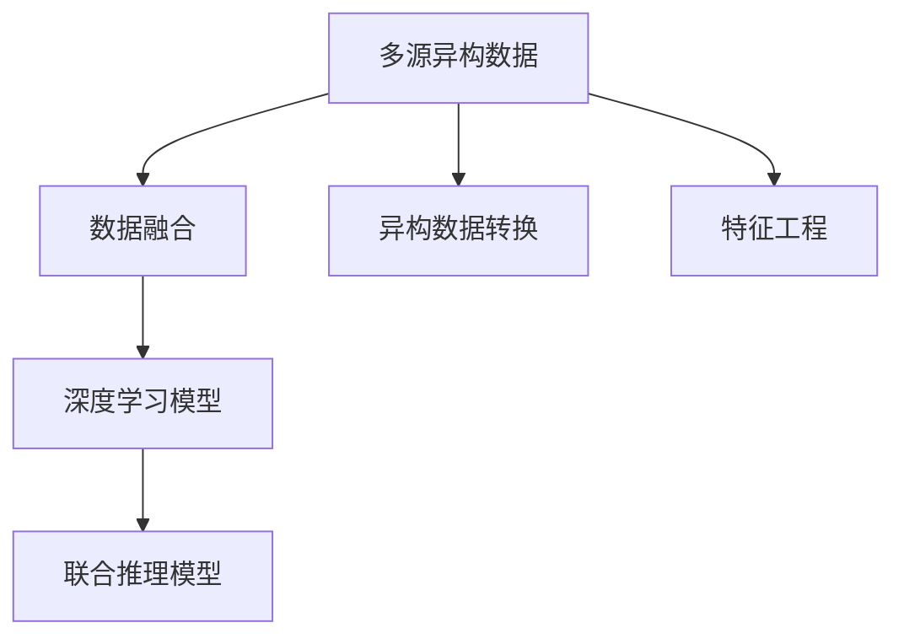

                 

# 知识发现引擎的多模态学习技术应用

> 关键词：知识发现引擎, 多模态学习, 数据融合, 深度学习, 深度学习模型, 特征工程, 无监督学习

## 1. 背景介绍

### 1.1 问题由来

在信息化时代，数据种类和来源日益多样化，如何高效整合这些异构数据，提取其中的知识，成为了许多企业和组织关注的焦点。知识发现引擎（Knowledge Discovery Engine, KDE），作为数据智能化的关键组件，旨在从海量数据中自动发现、识别和提取出有用的信息。

然而，传统的知识发现方法往往基于单一数据源，难以应对多源异构数据集。在多源异构数据的场景下，需要引入多模态学习（Multimodal Learning）技术，对不同类型的数据进行综合分析，从中提取深层次的知识和洞察。

多模态学习不仅包括传统的基于统计的方法，如因子分析和聚类算法，还包括近年来兴起的大数据、深度学习和人工智能技术，如深度神经网络（DNN）和卷积神经网络（CNN）。

### 1.2 问题核心关键点

多模态学习旨在处理和分析不同类型的数据，如文本、图像、音频和视频，从中提取有价值的信息，实现数据的自动融合与知识发现。其主要关键点包括：

- 多源数据融合：将不同类型的数据进行融合，利用多源数据间的互补性，提高知识发现的能力和准确性。
- 异构数据转换：将非结构化数据转化为结构化数据，便于分析与计算。
- 跨模态特征提取：通过多模态特征学习算法，提取不同模态数据中的共性和差异性特征。
- 联合推理模型：利用联合推理机制，建立跨模态模型，实现多模态数据的联合推理和联合预测。
- 深度学习模型：利用深度神经网络等深度学习技术，建立端到端的联合预测模型。

这些关键点共同构成了多模态学习的应用框架，使其能够从多源异构数据中提取深层知识，提升数据价值的挖掘能力。

## 2. 核心概念与联系

### 2.1 核心概念概述

为更好地理解多模态学习的核心概念和架构，本节将介绍几个密切相关的核心概念：

- 多源异构数据：指来自不同来源、不同类型、不同格式的数据，如文本、图像、音频、视频等。
- 数据融合（Data Fusion）：指将多个独立数据源的数据进行综合，生成新的信息。
- 异构数据转换：指将非结构化数据转化为结构化数据，便于分析与计算。
- 特征工程（Feature Engineering）：指通过数据预处理、特征选择、特征提取等手段，构建适于深度学习的输入特征。
- 深度学习模型：指基于神经网络（Neural Network）的深度学习模型，能够处理非线性、高维数据，提取深层次的特征和模式。

这些核心概念之间的逻辑关系可以通过以下Mermaid流程图来展示：



这个流程图展示了多模态学习的主要流程：

1. 多源异构数据通过数据融合，生成综合数据。
2. 异构数据通过转换，转化为结构化数据。
3. 特征工程对数据进行处理，提取适合深度学习模型的特征。
4. 深度学习模型对这些特征进行学习和推理，构建联合模型。

## 3. 核心算法原理 & 具体操作步骤

### 3.1 算法原理概述

多模态学习的主要目的是通过深度学习模型，实现多源异构数据的联合推理和联合预测。其核心思想是：将不同类型的数据进行特征融合，建立跨模态的联合预测模型，从而提高模型的泛化能力和预测精度。

多模态学习包括两个主要步骤：

1. **特征对齐与融合**：对不同模态的数据进行特征对齐和融合，使得不同模态的数据具有相同的维度，便于后续的联合推理和联合预测。

2. **联合模型训练**：利用深度学习模型，对多模态数据进行联合训练，学习不同模态数据间的共性和差异性，建立跨模态的联合推理模型。

### 3.2 算法步骤详解

**Step 1: 数据收集与预处理**

多模态数据通常来自不同的数据源，数据类型和格式各异。因此，首先需要进行数据收集和预处理：

- 收集不同模态的数据，如文本、图像、音频等。
- 对数据进行去噪、归一化、标准化等预处理步骤，保证数据质量和一致性。
- 对文本数据进行分词、词向量化等文本处理步骤。
- 对图像数据进行缩放、裁剪、归一化等图像处理步骤。

**Step 2: 特征提取与对齐**

将不同模态的数据转化为适合深度学习的输入特征，并进行特征对齐：

- 对文本数据使用词向量模型（如Word2Vec、GloVe）进行特征提取。
- 对图像数据使用卷积神经网络（CNN）进行特征提取。
- 对音频数据使用卷积神经网络（CNN）或循环神经网络（RNN）进行特征提取。
- 利用特征对齐算法（如TensorFlow的Stacked RNN）将不同模态的数据特征对齐。

**Step 3: 联合模型训练**

通过深度学习模型，对不同模态的数据进行联合训练，建立联合推理模型：

- 使用深度学习框架（如TensorFlow、PyTorch）搭建联合模型。
- 使用联合损失函数（如多模态交叉熵）训练联合模型。
- 利用训练集数据进行模型训练，迭代优化模型参数。
- 在验证集和测试集上进行模型评估和调整。

**Step 4: 模型优化与验证**

模型训练完成后，进行模型优化和验证：

- 利用正则化技术（如L2正则、Dropout）防止模型过拟合。
- 利用交叉验证技术评估模型的泛化能力和性能。
- 利用超参数优化技术（如网格搜索、随机搜索）优化模型参数。

### 3.3 算法优缺点

多模态学习具有以下优点：

- **数据融合能力**：能够综合分析不同类型的数据，提高知识发现的全面性和深度。
- **跨模态特征学习**：能够提取不同模态数据间的共性和差异性，提升模型的泛化能力和预测精度。
- **联合推理机制**：能够建立跨模态的联合模型，实现多模态数据的联合推理和联合预测。

同时，多模态学习也存在一些局限性：

- **数据源不一致**：不同数据源的数据格式和质量不同，需要进行大量的数据预处理和对齐工作。
- **特征工程复杂**：多模态特征工程复杂，需要考虑不同模态数据之间的相互作用和关系。
- **计算成本高**：多模态数据量和计算量巨大，需要高性能计算资源支持。
- **模型复杂度高**：多模态模型通常包含多个深度学习子网络，训练和推理复杂度较高。

### 3.4 算法应用领域

多模态学习技术在多个领域得到了广泛应用，包括：

- **医学影像分析**：利用多模态影像数据，如CT、MRI、超声等，结合基因数据和临床数据，提高疾病诊断的准确性。
- **智能视频监控**：结合视频、声音和传感器数据，实现对视频内容的智能分析与识别。
- **智能推荐系统**：结合用户行为数据、物品属性数据、社交网络数据等多源数据，提供个性化推荐服务。
- **智能客服系统**：结合用户语音、文字、面部表情等多模态数据，提升客服系统的人机交互体验。
- **智能交通系统**：结合视频、雷达、传感器等多模态数据，实现交通流量预测、事故预警等功能。

这些应用领域展示了多模态学习的广泛应用前景和巨大价值。

## 4. 数学模型和公式 & 详细讲解 & 举例说明

### 4.1 数学模型构建

多模态学习的数学模型通常包括两部分：

1. **特征对齐与融合模型**：将不同模态的数据进行特征对齐和融合，构建统一的特征空间。

2. **联合模型训练模型**：利用深度学习模型，对多模态数据进行联合训练，建立联合推理模型。

### 4.2 公式推导过程

以下以医学影像分类任务为例，推导多模态联合模型训练的数学模型。

设 $X_1$ 和 $X_2$ 分别为不同模态的数据特征向量，$Y$ 为标签向量。假设联合模型 $F$ 包含两个部分：文本特征提取器 $E_1$ 和图像特征提取器 $E_2$，以及联合分类器 $G$。则联合模型的训练目标函数为：

$$
\mathcal{L} = \frac{1}{N} \sum_{i=1}^N \left( \ell_G(G(E_1(x_{1,i}), E_2(x_{2,i})), y_i) + \lambda \|E_1(x_{1,i}) - E_2(x_{2,i})\|^2 \right)
$$

其中 $\ell_G$ 为联合分类器的损失函数，$\|E_1(x_{1,i}) - E_2(x_{2,i})\|^2$ 为特征对齐项，$\lambda$ 为正则化系数。

假设 $E_1$ 和 $E_2$ 分别为文本和图像的特征提取器，$G$ 为联合分类器。则联合模型的前向传播过程为：

$$
h_1 = E_1(x_1) \\
h_2 = E_2(x_2) \\
h_G = G(h_1, h_2) \\
y_G = h_G
$$

其中 $h_1$ 和 $h_2$ 分别为文本和图像的特征表示，$h_G$ 为联合特征表示，$y_G$ 为联合分类结果。

### 4.3 案例分析与讲解

以智能视频监控系统为例，分析多模态学习的应用。假设系统需要识别监控视频中的异常行为，可以使用多模态数据，如视频帧、声音、人体关键点等。具体步骤如下：

1. **数据收集**：收集监控视频帧、音频和人体关键点数据。
2. **特征提取**：对视频帧使用卷积神经网络（CNN）进行特征提取，对音频使用卷积神经网络（CNN）或循环神经网络（RNN）进行特征提取，对关键点数据进行特征提取。
3. **特征对齐**：使用特征对齐算法将不同模态的数据特征对齐。
4. **联合模型训练**：使用深度学习框架搭建联合模型，利用联合损失函数训练模型。
5. **模型优化**：对模型进行正则化和超参数优化，防止过拟合。
6. **模型验证**：在验证集和测试集上进行模型评估，优化模型参数。
7. **部署应用**：将模型部署到监控系统中，实现实时异常行为识别和预警。

## 5. 项目实践：代码实例和详细解释说明

### 5.1 开发环境搭建

在进行多模态学习项目开发前，需要准备好开发环境。以下是使用Python进行TensorFlow开发的环境配置流程：

1. 安装Anaconda：从官网下载并安装Anaconda，用于创建独立的Python环境。

2. 创建并激活虚拟环境：
```bash
conda create -n tf-env python=3.8 
conda activate tf-env
```

3. 安装TensorFlow：根据CUDA版本，从官网获取对应的安装命令。例如：
```bash
conda install tensorflow -c pytorch -c conda-forge
```

4. 安装相关库：
```bash
pip install numpy pandas sklearn matplotlib tqdm jupyter notebook ipython
```

完成上述步骤后，即可在`tf-env`环境中开始多模态学习项目的开发。

### 5.2 源代码详细实现

下面以医学影像分类任务为例，给出使用TensorFlow对多模态数据进行联合训练的代码实现。

```python
import tensorflow as tf
from tensorflow.keras.layers import Input, Dense, concatenate
from tensorflow.keras.models import Model

# 定义输入层
input_1 = Input(shape=(None,), name='text_input')
input_2 = Input(shape=(None, None, 3), name='image_input')

# 定义特征提取器
text_encoder = tf.keras.Sequential([
    tf.keras.layers.Embedding(input_dim=10000, output_dim=128, name='text_encoder')
])
image_encoder = tf.keras.Sequential([
    tf.keras.layers.Conv2D(32, (3,3), activation='relu', name='image_encoder')
])

# 定义联合分类器
combined_features = concatenate([text_encoder(input_1), image_encoder(input_2)])
output = Dense(1, activation='sigmoid', name='output')(combined_features)

# 定义模型
model = Model(inputs=[input_1, input_2], outputs=output)

# 定义损失函数
loss = tf.keras.losses.BinaryCrossentropy(from_logits=True)
model.compile(optimizer='adam', loss=loss)

# 训练模型
model.fit(x_train, y_train, epochs=10, batch_size=32)
```

### 5.3 代码解读与分析

让我们再详细解读一下关键代码的实现细节：

**Input层**：
- 定义了文本和图像的输入层，分别对应文本和图像数据的维度。
- 使用`Input`层定义输入数据维度，`name`参数用于标识层的名称，便于模型构建。

**特征提取器**：
- 对文本数据使用嵌入层进行特征提取，`Embedding`层将文本转化为稠密向量。
- 对图像数据使用卷积层进行特征提取，`Conv2D`层提取图像的局部特征。

**联合分类器**：
- 使用`concatenate`层将文本和图像特征进行拼接。
- 使用`Dense`层进行联合分类，`output`层输出预测结果。

**模型构建**：
- 使用`Model`层定义输入和输出，以及它们之间的映射关系。
- 设置`optimizer`和`loss`，配置优化器和损失函数。

**模型训练**：
- 使用`fit`方法对模型进行训练，指定训练数据和标签，设置训练轮数和批次大小。

可以看到，TensorFlow提供了便捷的API，使得多模态学习的实现变得简单高效。开发者可以将更多精力放在模型设计、超参数优化等高层次逻辑上，而不必过多关注底层的实现细节。

## 6. 实际应用场景

### 6.1 医学影像分类

多模态学习在医学影像分类中具有重要应用，结合CT、MRI、超声等多种影像数据，可以显著提升疾病诊断的准确性。具体应用场景包括：

- **乳腺癌诊断**：利用多模态影像数据，结合基因数据和临床数据，进行乳腺癌的早期检测和分类。
- **脑部疾病诊断**：结合MRI和CT影像数据，进行脑部疾病的诊断和分类，如脑肿瘤、脑出血等。
- **心电图分析**：结合心电图和CT影像数据，进行心脏病诊断和分类，如心肌梗塞、心律失常等。

通过多模态学习，可以综合利用不同类型的数据，提高诊断的全面性和准确性。

### 6.2 智能视频监控

在智能视频监控系统中，结合视频、声音和传感器数据，可以实时监测视频内容，提高异常行为识别能力。具体应用场景包括：

- **行为识别**：利用视频帧、声音和人体关键点数据，实现对监控视频中异常行为的自动识别和预警。
- **车辆检测**：结合视频和传感器数据，实现对监控区域内车辆类型的检测和分类。
- **入侵检测**：结合视频、声音和传感器数据，实现对监控区域内入侵行为的实时检测和报警。

多模态学习能够综合分析多种数据，提高监控系统的智能化和自动化水平。

### 6.3 智能推荐系统

在智能推荐系统中，结合用户行为数据、物品属性数据、社交网络数据等多源数据，可以提供个性化推荐服务。具体应用场景包括：

- **电商推荐**：结合用户浏览历史、物品属性和用户社交网络数据，进行电商商品的个性化推荐。
- **音乐推荐**：结合用户听歌历史、音乐属性和用户社交网络数据，进行音乐播放列表的个性化推荐。
- **新闻推荐**：结合用户阅读历史、新闻属性和用户社交网络数据，进行新闻文章的个性化推荐。

多模态学习能够综合利用多种数据，提供更加精准和多样化的推荐服务。

### 6.4 未来应用展望

随着多模态学习技术的发展，未来的应用场景将更加广泛和深入，具体展望如下：

- **跨模态情感分析**：结合文本、图像和语音数据，进行情感的跨模态分析，提升情感识别的准确性和全面性。
- **多模态社交网络分析**：结合用户社交网络数据、行为数据和图像数据，进行社交网络关系的分析和预测。
- **跨模态医学影像分析**：结合不同模态的医学影像数据，进行疾病诊断和治疗方案的预测和优化。
- **多模态智能客服**：结合用户语音、文字和面部表情数据，提升客服系统的智能化和自然交互体验。
- **跨模态智能交通**：结合视频、雷达和传感器数据，实现交通流量预测和事故预警。

多模态学习技术将在更多领域得到应用，为智能化和自动化带来新的突破。

## 7. 工具和资源推荐

### 7.1 学习资源推荐

为了帮助开发者系统掌握多模态学习理论基础和实践技巧，这里推荐一些优质的学习资源：

1. 《深度学习》课程（Andrew Ng）：斯坦福大学开设的深度学习入门课程，内容涵盖了神经网络、卷积神经网络、循环神经网络等基础知识。
2. 《多模态数据挖掘》书籍：详细介绍了多模态数据的特征提取、数据融合、联合学习等技术。
3. 《深度学习与多模态数据融合》博文：介绍多模态数据融合和特征对齐技术，并提供了实际案例。
4. 《TensorFlow教程》：官方提供的TensorFlow学习资源，包含多模态学习的实现样例。
5. 《PyTorch教程》：官方提供的PyTorch学习资源，包含多模态学习的实现样例。

通过对这些资源的学习实践，相信你一定能够快速掌握多模态学习的精髓，并用于解决实际的NLP问题。

### 7.2 开发工具推荐

高效的开发离不开优秀的工具支持。以下是几款用于多模态学习开发的常用工具：

1. TensorFlow：基于Python的开源深度学习框架，提供便捷的API和丰富的模型库，适合多模态学习项目的开发。
2. PyTorch：基于Python的开源深度学习框架，提供灵活的计算图和高效的模型训练，适合研究型多模态学习项目。
3. Weights & Biases：模型训练的实验跟踪工具，可以记录和可视化模型训练过程中的各项指标，方便对比和调优。
4. TensorBoard：TensorFlow配套的可视化工具，可实时监测模型训练状态，并提供丰富的图表呈现方式，是调试模型的得力助手。
5. OpenCV：开源计算机视觉库，提供丰富的图像处理和特征提取算法，适合图像多模态学习项目。
6. Keras：基于TensorFlow和Theano的高级深度学习API，提供简单易用的接口，适合快速原型开发和实验。

合理利用这些工具，可以显著提升多模态学习任务的开发效率，加快创新迭代的步伐。

### 7.3 相关论文推荐

多模态学习的研究源于学界的持续研究。以下是几篇奠基性的相关论文，推荐阅读：

1. 《Multimodal Learning》（Michael A. Carreira-Perpinan）：详细介绍了多模态学习的概念和应用，介绍了多模态特征对齐和联合推理技术。
2. 《Deep Learning for Multimodal Features》（Jitendra Malik）：介绍了多模态特征学习和联合推理技术，并提供了实际应用案例。
3. 《Learning to Combine Multimodal Features》（Daphne Koller）：介绍了多模态特征融合和联合推理技术，并提供了深度学习模型的实现方法。
4. 《Multi-Sensor Fusion for Robust Object Tracking》（Neville Dalal）：介绍了多传感器数据融合技术，并提供了实际应用案例。
5. 《A Comprehensive Survey of Multi-Sensor Data Fusion》（Kaveh Hosseini）：介绍了多传感器数据融合技术的综合综述，并提供了多种融合算法的对比分析。

这些论文代表了大模态学习的研究进展，帮助理解多模态学习的原理和应用。

## 8. 总结：未来发展趋势与挑战

### 8.1 总结

本文对多模态学习技术的应用进行了全面系统的介绍。首先阐述了多模态学习的背景和重要性，明确了多模态学习在多源异构数据处理中的关键作用。其次，从原理到实践，详细讲解了多模态学习的数学模型和关键步骤，给出了多模态学习任务开发的完整代码实例。同时，本文还广泛探讨了多模态学习在医学、视频监控、智能推荐等多个行业领域的应用前景，展示了多模态学习的广泛应用前景和巨大价值。

通过本文的系统梳理，可以看到，多模态学习技术在多源异构数据处理中具有重要应用，能够从多源异构数据中提取深层知识，提升数据价值的挖掘能力。未来，伴随多模态学习技术的不断发展，将在更多领域得到应用，为智能化和自动化带来新的突破。

### 8.2 未来发展趋势

展望未来，多模态学习技术将呈现以下几个发展趋势：

1. **多模态深度学习模型**：利用深度学习模型，建立端到端的联合预测模型，提高模型的泛化能力和预测精度。
2. **跨模态特征对齐**：进一步提升特征对齐的准确性和鲁棒性，实现更加高效的特征融合。
3. **联合推理机制**：研究更加复杂的联合推理机制，实现更加准确和鲁棒的联合预测。
4. **多模态数据生成**：结合生成对抗网络（GAN）和变分自编码器（VAE），实现多模态数据的生成与增强。
5. **联合学习**：研究更加高效的联合学习算法，提高多模态数据的学习效率和准确性。
6. **多模态联邦学习**：结合联邦学习技术，实现多模态数据的分布式联合学习，保护数据隐私和安全。

这些趋势凸显了多模态学习技术的广阔前景，将继续推动多模态学习技术的不断发展和应用。

### 8.3 面临的挑战

尽管多模态学习技术已经取得了瞩目成就，但在迈向更加智能化、普适化应用的过程中，仍面临诸多挑战：

1. **数据源不一致**：不同数据源的数据格式和质量不同，需要进行大量的数据预处理和对齐工作。
2. **特征工程复杂**：多模态特征工程复杂，需要考虑不同模态数据之间的相互作用和关系。
3. **计算成本高**：多模态数据量和计算量巨大，需要高性能计算资源支持。
4. **模型复杂度高**：多模态模型通常包含多个深度学习子网络，训练和推理复杂度较高。
5. **数据隐私和安全**：多模态学习中涉及大量敏感数据，如何在保护数据隐私和安全的前提下，实现多模态数据的学习和联合推理。
6. **模型可解释性**：多模态模型通常较为复杂，难以解释其内部工作机制和决策逻辑，如何赋予模型更强的可解释性，仍是重要的研究课题。

这些挑战需要学界和产业界的共同努力，以推动多模态学习技术的进一步发展和应用。

### 8.4 研究展望

面对多模态学习面临的挑战，未来的研究需要在以下几个方面寻求新的突破：

1. **高效特征提取**：研究更加高效的多模态特征提取算法，提升特征工程效率和模型准确性。
2. **自适应特征对齐**：研究更加自适应的特征对齐算法，提升特征对齐的鲁棒性和准确性。
3. **分布式联合学习**：研究分布式联合学习算法，提高多模态数据的学习效率和准确性，保护数据隐私和安全。
4. **模型压缩和加速**：研究模型压缩和加速技术，提升多模态模型的推理速度和计算效率，降低计算成本。
5. **模型可解释性**：研究模型可解释性技术，赋予多模态模型更强的可解释性，提升模型可信度和实用性。
6. **跨模态迁移学习**：研究跨模态迁移学习技术，提升多模态模型在不同领域和任务上的适应性和泛化能力。

这些研究方向的探索，将推动多模态学习技术向更深层次和更广泛领域的应用，为智能化和自动化带来新的突破。

## 9. 附录：常见问题与解答

**Q1：多模态学习中的数据融合方法有哪些？**

A: 多模态数据融合的方法包括：

- **融合算法**：如投票、加权平均、最小方差、最大后验概率等。
- **特征对齐**：如TensorFlow的Stacked RNN、Deep Canonical Correlation Analysis（DCCA）等。
- **联合推理**：如最大似然估计、最小化交叉熵损失、联合分类器等。

**Q2：如何选择合适的多模态学习模型？**

A: 选择多模态学习模型应考虑以下几个因素：

- **任务类型**：根据任务类型选择合适的模型，如分类任务使用联合分类器，回归任务使用联合回归器。
- **数据特点**：根据数据特点选择合适的模型，如文本数据使用嵌入层，图像数据使用卷积层。
- **模型复杂度**：根据计算资源和模型推理速度的要求，选择复杂度适中的模型。
- **模型泛化能力**：根据模型泛化能力和预测精度的要求，选择训练数据集和超参数。

**Q3：多模态学习中如何防止过拟合？**

A: 多模态学习中的过拟合问题可以通过以下方法进行缓解：

- **正则化**：使用L2正则、Dropout等正则化技术，防止模型过拟合。
- **数据增强**：通过对训练数据进行数据增强，如回译、旋转、裁剪等，提升模型的泛化能力。
- **模型压缩**：使用模型压缩技术，如剪枝、量化等，减少模型参数量，提高模型的泛化能力。
- **联合训练**：使用联合训练算法，如FedLab、DeepMultiModel等，提升模型的泛化能力和鲁棒性。

这些方法可以帮助防止过拟合，提升多模态学习模型的性能。

**Q4：多模态学习在实际应用中需要注意哪些问题？**

A: 多模态学习在实际应用中需要注意以下几个问题：

- **数据质量**：确保多模态数据的准确性和一致性，避免数据质量问题对模型性能的影响。
- **计算资源**：多模态数据量和计算量巨大，需要高性能计算资源支持。
- **模型复杂度**：多模态模型通常包含多个深度学习子网络，训练和推理复杂度较高，需要合理配置计算资源。
- **模型泛化能力**：多模态模型的泛化能力受到数据集规模和多样性的影响，需要大量的标注数据和多样化的训练数据。
- **模型推理速度**：多模态模型通常较大，推理速度较慢，需要进行模型压缩和加速优化。
- **模型可解释性**：多模态模型通常较为复杂，难以解释其内部工作机制和决策逻辑，需要赋予模型更强的可解释性。

这些问题是多模态学习在实际应用中需要考虑的，需要根据具体情况进行优化和调整。

---

作者：禅与计算机程序设计艺术 / Zen and the Art of Computer Programming

