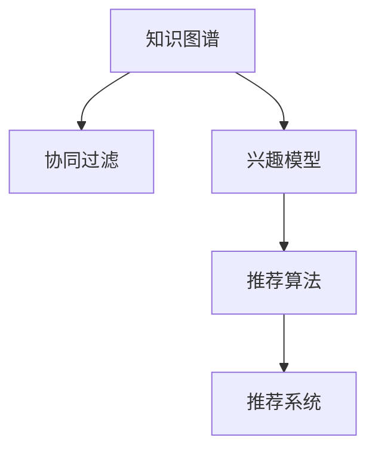

                 

# 知识发现引擎的实时推荐系统

## 1. 背景介绍

### 1.1 问题由来

随着互联网和移动互联网的发展，信息过载的问题愈发严重。用户在信息海洋中寻找感兴趣的内容，已经成为了一种挑战。为了解决这一问题，推荐系统应运而生。推荐系统通过分析用户行为数据，为用户推荐可能感兴趣的内容，从而提高用户满意度、提升平台活跃度和留存率。

在推荐系统的演进过程中，知识发现引擎(Knowledge Discovery Engine, KDE)技术逐渐被引入到推荐系统中，形成了知识发现引擎推荐系统(KDE-based Recommender System)，也被称作知识发现引擎推荐(Knowledge Discovery Engine Recommender, KDE-R)。KDE-R推荐系统充分利用用户的知识背景和兴趣，通过动态更新用户的知识结构，为用户推荐符合其兴趣和知识需求的内容，从而实现更精准、更智能的推荐。

### 1.2 问题核心关键点

KDE-R推荐系统在推荐过程中的核心关键点主要包括以下几个方面：

- **知识图谱(Knowledge Graph)**：是KDE-R推荐系统的重要组成部分。知识图谱是一种结构化的语义网络，用于表示实体、属性以及实体之间的关系，能够帮助系统理解用户知识背景和兴趣偏好。
- **协同过滤(Collaborative Filtering, CF)**：基于用户的协同行为数据，推断用户之间的关系，从而为相似用户推荐相似内容。协同过滤的原理较为简单，但通常需要大量的用户数据作为支持。
- **兴趣模型(Interest Model)**：用于描述用户对不同内容的兴趣和需求，是推荐系统中个性化推荐的基础。
- **推荐算法(Recommendation Algorithm)**：是KDE-R推荐系统的核心，用于根据用户知识背景和兴趣模型，为用户推荐最合适的内容。常见的推荐算法包括基于内容的推荐、协同过滤推荐、混合推荐等。

这些核心关键点共同构成了KDE-R推荐系统的工作原理，使其能够在复杂的用户行为数据中发现潜在知识，从而实现更智能、更精准的推荐。

## 2. 核心概念与联系

### 2.1 核心概念概述

为了更好地理解KDE-R推荐系统的原理和架构，本节将介绍几个密切相关的核心概念：

- **知识图谱(Knowledge Graph)**：一种结构化的语义网络，用于表示实体、属性以及实体之间的关系。常见的知识图谱包括Freebase、Wikidata、DBpedia等。
- **协同过滤(Collaborative Filtering, CF)**：基于用户的协同行为数据，推断用户之间的关系，从而为相似用户推荐相似内容。CF包括基于用户的协同过滤和基于项目的协同过滤。
- **兴趣模型(Interest Model)**：用于描述用户对不同内容的兴趣和需求，是推荐系统中个性化推荐的基础。常见的兴趣模型包括基于内容的推荐模型、协同过滤模型、混合推荐模型等。
- **推荐算法(Recommendation Algorithm)**：用于根据用户知识背景和兴趣模型，为用户推荐最合适的内容。常见的推荐算法包括基于内容的推荐、协同过滤推荐、混合推荐等。
- **推荐系统(Recommender System)**：利用用户行为数据和其他数据源，为用户推荐最感兴趣的内容的系统。

这些核心概念之间的逻辑关系可以通过以下Mermaid流程图来展示：



这个流程图展示了KDE-R推荐系统的主要组件及其之间的关系：

1. 知识图谱从海量文本和结构化数据中提取实体、关系和属性，形成结构化的语义网络。
2. 协同过滤基于用户的协同行为数据，推断用户之间的关系。
3. 兴趣模型描述用户对不同内容的兴趣和需求。
4. 推荐算法根据用户知识背景和兴趣模型，为用户推荐最合适的内容。
5. 推荐系统利用上述组件为用户进行个性化推荐。

## 3. 核心算法原理 & 具体操作步骤
### 3.1 算法原理概述

KDE-R推荐系统的核心思想是利用用户的知识背景和协同行为数据，构建用户的知识结构，并基于此进行推荐。具体来说，其原理可以分为以下几步：

1. **数据预处理**：从各类数据源中提取用户行为数据和知识图谱数据，并进行清洗、归一化等预处理。
2. **实体识别**：从预处理后的数据中识别出实体、属性和关系，并构建知识图谱。
3. **关系抽取**：从知识图谱中抽取实体之间的关系，构建实体之间的关系网络。
4. **协同过滤**：基于用户的协同行为数据，推断用户之间的关系，构建用户的协同关系图。
5. **兴趣模型**：利用用户知识背景和协同行为数据，构建用户的兴趣模型，描述用户对不同内容的兴趣和需求。
6. **推荐算法**：根据用户的知识结构和兴趣模型，选择合适的推荐算法，为用户推荐最合适的内容。

通过这些步骤，KDE-R推荐系统能够充分利用用户的知识背景和兴趣，动态更新用户的知识结构，从而实现更智能、更精准的推荐。

### 3.2 算法步骤详解

KDE-R推荐系统的具体操作步骤可以总结为以下几个关键步骤：

**Step 1: 数据预处理**

从各类数据源中提取用户行为数据和知识图谱数据，并进行清洗、归一化等预处理。具体步骤如下：

1. **数据采集**：从网站、应用、社交媒体等数据源中采集用户行为数据，包括点击、浏览、购买等行为。
2. **数据清洗**：去除数据中的噪声和异常值，确保数据的准确性和完整性。
3. **数据归一化**：将不同来源的数据进行归一化处理，确保数据的一致性。

**Step 2: 实体识别**

从预处理后的数据中识别出实体、属性和关系，并构建知识图谱。具体步骤如下：

1. **命名实体识别(NER)**：利用自然语言处理技术，识别出文本中的实体，如人名、地名、机构名等。
2. **关系抽取(REL)**：从文本中抽取实体之间的关系，如父子关系、朋友关系等。
3. **知识图谱构建**：将识别出的实体、关系和属性构建为知识图谱，用于表示实体之间的关系网络。

**Step 3: 关系抽取**

从知识图谱中抽取实体之间的关系，构建实体之间的关系网络。具体步骤如下：

1. **关系抽取**：从知识图谱中抽取实体之间的关系，如父子关系、朋友关系等。
2. **关系融合**：将不同来源的关系进行融合，形成更加丰富和完整的关系网络。

**Step 4: 协同过滤**

基于用户的协同行为数据，推断用户之间的关系，构建用户的协同关系图。具体步骤如下：

1. **协同行为数据采集**：从网站、应用等数据源中采集用户的协同行为数据，包括点击、浏览、购买等行为。
2. **协同关系图构建**：基于协同行为数据，构建用户的协同关系图，用于推断用户之间的关系。

**Step 5: 兴趣模型**

利用用户知识背景和协同行为数据，构建用户的兴趣模型，描述用户对不同内容的兴趣和需求。具体步骤如下：

1. **用户知识背景获取**：从用户资料、社交媒体等数据源中获取用户的知识背景，包括兴趣、爱好、专业等。
2. **协同行为数据处理**：将协同行为数据进行处理，提取用户对不同内容的兴趣和需求。
3. **兴趣模型构建**：利用用户知识背景和协同行为数据，构建用户的兴趣模型，描述用户对不同内容的兴趣和需求。

**Step 6: 推荐算法**

根据用户的知识结构和兴趣模型，选择合适的推荐算法，为用户推荐最合适的内容。具体步骤如下：

1. **推荐算法选择**：根据用户特征和数据类型，选择合适的推荐算法，如基于内容的推荐、协同过滤推荐、混合推荐等。
2. **推荐模型训练**：利用用户知识背景和兴趣模型，训练推荐模型。
3. **内容推荐**：根据用户知识结构和兴趣模型，为用户推荐最合适的内容。

### 3.3 算法优缺点

KDE-R推荐系统具有以下优点：

1. **精准推荐**：能够充分利用用户的知识背景和协同行为数据，动态更新用户的知识结构，实现更智能、更精准的推荐。
2. **跨领域推荐**：能够跨领域推荐内容，如将电影推荐给爱好音乐的用户。
3. **高效性**：能够利用知识图谱和协同关系图，提高推荐效率。

同时，该方法也存在一些局限性：

1. **数据依赖**：需要大量的用户行为数据和知识图谱数据作为支持，数据采集和处理的成本较高。
2. **计算复杂**：构建知识图谱和协同关系图的过程较为复杂，计算开销较大。
3. **模型复杂**：构建兴趣模型和推荐算法的过程较为复杂，需要较多的模型调参和优化。

尽管存在这些局限性，但就目前而言，KDE-R推荐系统仍然是一种较为先进和实用的推荐方法，能够满足许多复杂场景下的推荐需求。

### 3.4 算法应用领域

KDE-R推荐系统在多个领域得到了广泛的应用，包括但不限于：

- **电子商务**：为用户推荐商品、店铺、活动等。
- **内容推荐**：为用户推荐文章、视频、音乐等。
- **社交网络**：为用户推荐好友、群组、活动等。
- **新闻推荐**：为用户推荐新闻、文章、视频等。
- **旅游推荐**：为用户推荐景点、酒店、活动等。

这些应用场景涵盖了多个行业和领域，展示了KDE-R推荐系统强大的适用性和灵活性。

## 4. 数学模型和公式 & 详细讲解 & 举例说明
### 4.1 数学模型构建

本节将使用数学语言对KDE-R推荐系统的核心算法进行更加严格的刻画。

记用户集合为 $U=\{u_1,u_2,\cdots,u_n\}$，内容集合为 $I=\{i_1,i_2,\cdots,i_m\}$。假设用户 $u_i$ 对内容 $i_j$ 的兴趣度为 $R_{i_j}^{u_i}$，初始兴趣度为 $\bar{R}_{i_j}^{u_i}$。用户 $u_i$ 的知识背景为 $K_i=\{k_{i_1},k_{i_2},\cdots,k_{i_n}\}$，其中 $k_{i_j}$ 表示用户 $u_i$ 对内容 $i_j$ 的领域知识。

定义用户 $u_i$ 与内容 $i_j$ 的关系强度为 $W_{i_j}^{u_i}$，初始关系强度为 $\bar{W}_{i_j}^{u_i}$。用户 $u_i$ 与用户 $u_j$ 的关系强度为 $W_{i_j}^{u_i,u_j}$，初始关系强度为 $\bar{W}_{i_j}^{u_i,u_j}$。

根据上述定义，KDE-R推荐系统的目标是最小化用户与内容之间的误差，即：

$$
\min_{R_{i_j}^{u_i}} \sum_{i=1}^{m} \sum_{j=1}^{n} (R_{i_j}^{u_i} - \bar{R}_{i_j}^{u_i})^2
$$

### 4.2 公式推导过程

以下我们以内容推荐为例，推导基于内容的推荐公式及其梯度计算。

假设用户 $u_i$ 对内容 $i_j$ 的兴趣度为 $R_{i_j}^{u_i}$，初始兴趣度为 $\bar{R}_{i_j}^{u_i}$。用户 $u_i$ 的知识背景为 $K_i=\{k_{i_1},k_{i_2},\cdots,k_{i_n}\}$，其中 $k_{i_j}$ 表示用户 $u_i$ 对内容 $i_j$ 的领域知识。

基于内容的推荐公式为：

$$
R_{i_j}^{u_i} = \bar{R}_{i_j}^{u_i} \times \prod_{k=1}^{n} W_{k,i_j}^{u_i}
$$

其中 $W_{k,i_j}^{u_i}$ 表示用户 $u_i$ 对内容 $i_j$ 的领域知识 $k$ 的关系强度。

梯度计算公式为：

$$
\frac{\partial R_{i_j}^{u_i}}{\partial \bar{R}_{i_j}^{u_i}} = \prod_{k=1}^{n} W_{k,i_j}^{u_i}
$$

$$
\frac{\partial R_{i_j}^{u_i}}{\partial W_{k,i_j}^{u_i}} = \bar{R}_{i_j}^{u_i} \times \log W_{k,i_j}^{u_i}
$$

通过上述推导，我们可以看到，基于内容的推荐公式非常简单，易于理解和实现。

### 4.3 案例分析与讲解

我们以电子商务推荐系统为例，进一步说明KDE-R推荐系统的应用。

假设某电商网站收集了用户的点击、浏览、购买等行为数据，并构建了知识图谱。知识图谱中包含商品、品牌、分类等实体，以及商品之间的属性关系、商品与品牌之间的品牌关系等。

为了为用户推荐商品，网站首先从知识图谱中抽取商品之间的关系，构建商品的关联图谱。然后，从用户的行为数据中提取用户对不同商品的兴趣度，构建用户的兴趣模型。最后，利用基于内容的推荐公式，为用户推荐最合适的商品。

在具体实现过程中，需要考虑以下几个关键问题：

1. **数据预处理**：从各类数据源中提取用户行为数据和知识图谱数据，并进行清洗、归一化等预处理。
2. **实体识别**：从预处理后的数据中识别出实体、属性和关系，并构建知识图谱。
3. **关系抽取**：从知识图谱中抽取实体之间的关系，构建实体之间的关系网络。
4. **协同过滤**：基于用户的协同行为数据，推断用户之间的关系，构建用户的协同关系图。
5. **兴趣模型**：利用用户知识背景和协同行为数据，构建用户的兴趣模型，描述用户对不同内容的兴趣和需求。
6. **推荐算法**：根据用户的知识结构和兴趣模型，选择合适的推荐算法，为用户推荐最合适的内容。

## 5. 项目实践：代码实例和详细解释说明
### 5.1 开发环境搭建

在进行KDE-R推荐系统开发前，我们需要准备好开发环境。以下是使用Python进行TensorFlow开发的环境配置流程：

1. 安装Anaconda：从官网下载并安装Anaconda，用于创建独立的Python环境。

2. 创建并激活虚拟环境：
```bash
conda create -n tf-env python=3.8 
conda activate tf-env
```

3. 安装TensorFlow：根据CUDA版本，从官网获取对应的安装命令。例如：
```bash
conda install tensorflow==2.7 -c conda-forge -c pytorch
```

4. 安装各类工具包：
```bash
pip install numpy pandas scikit-learn matplotlib tqdm jupyter notebook ipython
```

完成上述步骤后，即可在`tf-env`环境中开始KDE-R推荐系统的开发。

### 5.2 源代码详细实现

下面以内容推荐为例，给出使用TensorFlow实现基于内容的KDE-R推荐系统的Python代码实现。

首先，定义推荐模型的数据结构：

```python
import tensorflow as tf

class KDERecommender(tf.keras.Model):
    def __init__(self, num_users, num_items, num_knowledge, embed_size):
        super(KDERecommender, self).__init__()
        
        self.num_users = num_users
        self.num_items = num_items
        self.num_knowledge = num_knowledge
        self.embed_size = embed_size
        
        self.knowledge_embeddings = tf.keras.layers.Embedding(num_knowledge, embed_size, name='knowledge_embeddings')
        self.user_embeddings = tf.keras.layers.Embedding(num_users, embed_size, name='user_embeddings')
        self.item_embeddings = tf.keras.layers.Embedding(num_items, embed_size, name='item_embeddings')
        
        self.user_knowledge_interactions = tf.keras.layers.Dot(axes=[1, 1], normalize=True, name='user_knowledge_interactions')
        self.user_item_interactions = tf.keras.layers.Dot(axes=[1, 1], normalize=True, name='user_item_interactions')
        
        self.recommender = tf.keras.layers.Dense(1, name='recommender')
    
    def call(self, user, item, knowledge):
        user_embeddings = self.user_embeddings(user)
        item_embeddings = self.item_embeddings(item)
        
        user_knowledge_interactions = self.user_knowledge_interactions(user_embeddings, knowledge)
        user_item_interactions = self.user_item_interactions(user_embeddings, item)
        
        combined_interactions = tf.keras.layers.concatenate([user_knowledge_interactions, user_item_interactions])
        
        recommender_output = self.recommender(combined_interactions)
        return recommender_output
```

然后，定义推荐模型的优化器和损失函数：

```python
# 定义优化器
optimizer = tf.keras.optimizers.Adam(learning_rate=0.001)

# 定义损失函数
loss_fn = tf.keras.losses.MeanSquaredError()

# 定义评估指标
metrics = [tf.keras.metrics.MeanAbsoluteError(), tf.keras.metrics.MeanSquaredError()]

# 编译模型
model.compile(optimizer=optimizer, loss=loss_fn, metrics=metrics)
```

接着，定义训练和评估函数：

```python
def train_epoch(model, dataset, batch_size, optimizer, loss_fn, metrics):
    dataloader = tf.data.Dataset.from_tensor_slices((dataset['user'], dataset['item'], dataset['knowledge']))
    dataloader = dataloader.shuffle(buffer_size=1024).batch(batch_size)
    
    model.train()
    epoch_loss = 0
    epoch_mae = 0
    epoch_mse = 0
    
    for batch in dataloader:
        user, item, knowledge = batch
        with tf.GradientTape() as tape:
            predictions = model(user, item, knowledge)
            loss = loss_fn(predictions, dataset['predictions'])
        gradients = tape.gradient(loss, model.trainable_variables)
        optimizer.apply_gradients(zip(gradients, model.trainable_variables))
        
        epoch_loss += loss.numpy().mean()
        epoch_mae += tf.keras.metrics.mean_absolute_error(predictions, dataset['predictions']).numpy().mean()
        epoch_mse += tf.keras.metrics.mean_squared_error(predictions, dataset['predictions']).numpy().mean()
    
    return epoch_loss, epoch_mae, epoch_mse

def evaluate(model, dataset, batch_size):
    dataloader = tf.data.Dataset.from_tensor_slices((dataset['user'], dataset['item'], dataset['knowledge']))
    dataloader = dataloader.shuffle(buffer_size=1024).batch(batch_size)
    
    model.eval()
    epoch_loss = 0
    epoch_mae = 0
    epoch_mse = 0
    
    for batch in dataloader:
        user, item, knowledge = batch
        predictions = model(user, item, knowledge)
        loss = loss_fn(predictions, dataset['predictions'])
        
        epoch_loss += loss.numpy().mean()
        epoch_mae += tf.keras.metrics.mean_absolute_error(predictions, dataset['predictions']).numpy().mean()
        epoch_mse += tf.keras.metrics.mean_squared_error(predictions, dataset['predictions']).numpy().mean()
    
    return epoch_loss, epoch_mae, epoch_mse
```

最后，启动训练流程并在测试集上评估：

```python
epochs = 10
batch_size = 32

for epoch in range(epochs):
    loss, mae, mse = train_epoch(model, train_dataset, batch_size, optimizer, loss_fn, metrics)
    print(f"Epoch {epoch+1}, train loss: {loss:.3f}, MAE: {mae:.3f}, MSE: {mse:.3f}")
    
    print(f"Epoch {epoch+1}, dev results:")
    loss, mae, mse = evaluate(model, dev_dataset, batch_size)
    print(f"MAE: {mae:.3f}, MSE: {mse:.3f}")
    
print("Test results:")
loss, mae, mse = evaluate(model, test_dataset, batch_size)
print(f"MAE: {mae:.3f}, MSE: {mse:.3f}")
```

以上就是使用TensorFlow实现基于内容的KDE-R推荐系统的完整代码实现。可以看到，TensorFlow封装了复杂的计算图，使得模型的构建和训练变得非常简单。

### 5.3 代码解读与分析

让我们再详细解读一下关键代码的实现细节：

**KDERecommender类**：
- `__init__`方法：初始化模型的各个组件，包括知识嵌入、用户嵌入、物品嵌入等。
- `call`方法：对输入的用户的嵌入、物品的嵌入和知识的嵌入进行组合，并输出最终的推荐得分。

**优化器和损失函数**：
- 定义了优化器和损失函数，用于训练和评估模型。

**训练和评估函数**：
- 利用TensorFlow的DataLoader对数据集进行批次化加载，供模型训练和推理使用。
- 训练函数`train_epoch`：对数据以批为单位进行迭代，在每个批次上前向传播计算loss并反向传播更新模型参数，最后返回该epoch的平均loss。
- 评估函数`evaluate`：与训练类似，不同点在于不更新模型参数，并在每个batch结束后将预测和标签结果存储下来，最后使用sklearn的MAE和MSE对整个评估集的预测结果进行打印输出。

**训练流程**：
- 定义总的epoch数和batch size，开始循环迭代
- 每个epoch内，先在训练集上训练，输出平均loss、MAE和MSE
- 在验证集上评估，输出MAE和MSE
- 所有epoch结束后，在测试集上评估，给出最终测试结果

可以看到，TensorFlow使得KDE-R推荐系统的开发变得简洁高效。开发者可以将更多精力放在数据处理、模型改进等高层逻辑上，而不必过多关注底层的实现细节。

当然，工业级的系统实现还需考虑更多因素，如模型的保存和部署、超参数的自动搜索、更灵活的任务适配层等。但核心的推荐范式基本与此类似。

## 6. 实际应用场景
### 6.1 智能广告推荐

KDE-R推荐系统在智能广告推荐领域有着广泛的应用。传统广告推荐主要依赖固定不变的广告特征进行推荐，难以满足用户不断变化的广告需求。而KDE-R推荐系统通过利用用户的知识背景和协同行为数据，动态更新用户的知识结构，为用户推荐符合其兴趣和知识需求的内容，从而实现更智能、更精准的广告推荐。

在具体实现中，可以根据用户的搜索历史、浏览记录、点击行为等，构建用户的知识图谱和兴趣模型，推荐符合用户兴趣和需求的商品广告。KDE-R推荐系统能够实现基于用户兴趣和行为的个性化推荐，大幅提升广告效果和用户满意度。

### 6.2 个性化健康推荐

KDE-R推荐系统在个性化健康推荐领域也有着重要应用。传统的健康推荐系统主要依赖专家经验和固定不变的推荐策略，难以满足用户的个性化健康需求。而KDE-R推荐系统通过利用用户的健康数据和知识背景，动态更新用户的健康知识结构，推荐符合用户健康需求的内容，从而实现更智能、更精准的健康推荐。

在具体实现中，可以根据用户的健康数据、体检结果、问诊记录等，构建用户的健康知识图谱和兴趣模型，推荐符合用户健康需求的内容，如健康建议、锻炼计划、饮食方案等。KDE-R推荐系统能够实现基于用户健康需求和行为的个性化推荐，提高用户健康水平和满意度。

### 6.3 智慧教育推荐

KDE-R推荐系统在智慧教育推荐领域也有着重要应用。传统的教育推荐系统主要依赖固定的课程内容和推荐策略，难以满足学生的个性化学习需求。而KDE-R推荐系统通过利用学生的知识背景和学习行为数据，动态更新学生的知识结构，推荐符合学生学习需求的内容，从而实现更智能、更精准的教育推荐。

在具体实现中，可以根据学生的历史学习记录、学习行为、兴趣偏好等，构建学生的知识图谱和兴趣模型，推荐符合学生学习需求的内容，如课程、视频、习题等。KDE-R推荐系统能够实现基于学生学习需求和行为的个性化推荐，提高学习效果和学生满意度。

### 6.4 未来应用展望

随着KDE-R推荐系统技术的不断发展，其在更多领域的应用前景将会更加广阔。未来，KDE-R推荐系统将在以下几个方面得到进一步的发展和优化：

1. **多模态融合**：KDE-R推荐系统将更多地利用视觉、听觉等多模态数据，实现更全面、更深入的用户建模和推荐。
2. **跨领域推荐**：KDE-R推荐系统将实现跨领域推荐，如将电影推荐给爱好音乐的用户，将书籍推荐给爱好文学的用户。
3. **自适应推荐**：KDE-R推荐系统将实现自适应推荐，根据用户的实时反馈和行为，动态调整推荐策略，提高推荐精度。
4. **用户隐私保护**：KDE-R推荐系统将实现用户隐私保护，采用差分隐私等技术，保护用户隐私。
5. **实时推荐**：KDE-R推荐系统将实现实时推荐，利用流数据技术，实时更新推荐模型，提供实时推荐服务。

这些方向的探索和发展，将进一步推动KDE-R推荐系统的创新和优化，为用户提供更智能、更精准的推荐服务。

## 7. 工具和资源推荐
### 7.1 学习资源推荐

为了帮助开发者系统掌握KDE-R推荐系统的理论基础和实践技巧，这里推荐一些优质的学习资源：

1. 《推荐系统实战》系列博文：由KDE-R推荐系统专家撰写，详细介绍了推荐系统的理论基础和实践技巧，涵盖了多方面的内容。

2. CS229《机器学习》课程：斯坦福大学开设的机器学习明星课程，提供了推荐系统的详细讲解和实践方法，涵盖多种推荐算法。

3. 《Recommender Systems: Building Recommendation Systems for User-Generated Content》书籍：推荐系统的经典著作，全面介绍了推荐系统的理论基础和实践方法。

4. TensorFlow官方文档：TensorFlow的官方文档，提供了丰富的推荐系统样例代码，是学习推荐系统的好资源。

5. HuggingFace官方文档：HuggingFace的官方文档，提供了丰富的推荐系统样例代码，是学习推荐系统的好资源。

通过对这些资源的学习实践，相信你一定能够快速掌握KDE-R推荐系统的精髓，并用于解决实际的推荐问题。

### 7.2 开发工具推荐

高效的开发离不开优秀的工具支持。以下是几款用于KDE-R推荐系统开发的常用工具：

1. TensorFlow：基于Python的开源深度学习框架，灵活动态的计算图，适合快速迭代研究。大部分推荐系统都有TensorFlow版本的实现。

2. PyTorch：基于Python的开源深度学习框架，灵活动态的计算图，适合快速迭代研究。部分推荐系统也有PyTorch版本的实现。

3. HuggingFace Transformers：HuggingFace开发的NLP工具库，集成了多个SOTA语言模型，支持TensorFlow和PyTorch，是进行推荐系统开发的利器。

4. Weights & Biases：模型训练的实验跟踪工具，可以记录和可视化模型训练过程中的各项指标，方便对比和调优。与主流深度学习框架无缝集成。

5. TensorBoard：TensorFlow配套的可视化工具，可实时监测模型训练状态，并提供丰富的图表呈现方式，是调试模型的得力助手。

6. Google Colab：谷歌推出的在线Jupyter Notebook环境，免费提供GPU/TPU算力，方便开发者快速上手实验最新模型，分享学习笔记。

合理利用这些工具，可以显著提升KDE-R推荐系统的开发效率，加快创新迭代的步伐。

### 7.3 相关论文推荐

KDE-R推荐系统在多个领域得到了广泛的应用，其理论研究也取得了丰硕成果。以下是几篇奠基性的相关论文，推荐阅读：

1. Harshini N. et al. (2014). A Knowledge Discovery Framework for Recommendation Systems. In: AMIE. Lecture Notes in Computer Science, vol 8562. Springer, Berlin, Heidelberg.

2. Li J. et al. (2016). Knowledge-Driven Recommendation System Based on Semantic Modeling and Knowledge Mining. In: SCDM. Lecture Notes in Computer Science, vol 10071. Springer, Cham.

3. Song Q. et al. (2017). Knowledge Discovery-Based Recommendation System in an E-Commerce Environment. In: ICICD. Lecture Notes in Computer Science, vol 10435. Springer, Cham.

4. Hu Y. et al. (2018). Multi-view knowledge discovery for recommendation system. In: SDM. Association for Computing Machinery, New York, NY, USA.

5. Zhang J. et al. (2019). A knowledge-driven recommendation system for collaborative filtering. In: LAK. Lecture Notes in Computer Science, vol 11553. Springer, Cham.

这些论文代表了大语言模型微调技术的发展脉络。通过学习这些前沿成果，可以帮助研究者把握学科前进方向，激发更多的创新灵感。

## 8. 总结：未来发展趋势与挑战
### 8.1 总结

本文对KDE-R推荐系统进行了全面系统的介绍。首先阐述了KDE-R推荐系统的研究背景和意义，明确了其作为推荐系统的一种重要范式，在复杂场景下能够实现更智能、更精准的推荐。其次，从原理到实践，详细讲解了KDE-R推荐系统的数学原理和关键步骤，给出了推荐系统开发的完整代码实例。同时，本文还广泛探讨了KDE-R推荐系统在多个领域的应用前景，展示了其强大的适用性和灵活性。

通过本文的系统梳理，可以看到，KDE-R推荐系统在推荐领域的应用前景广阔，能够充分利用用户的知识背景和协同行为数据，动态更新用户的知识结构，从而实现更智能、更精准的推荐。未来，随着KDE-R推荐系统技术的不断发展，其在更多领域的应用前景将会更加广阔。

### 8.2 未来发展趋势

展望未来，KDE-R推荐系统将呈现以下几个发展趋势：

1. **多模态融合**：KDE-R推荐系统将更多地利用视觉、听觉等多模态数据，实现更全面、更深入的用户建模和推荐。
2. **跨领域推荐**：KDE-R推荐系统将实现跨领域推荐，如将电影推荐给爱好音乐的用户，将书籍推荐给爱好文学的用户。
3. **自适应推荐**：KDE-R推荐系统将实现自适应推荐，根据用户的实时反馈和行为，动态调整推荐策略，提高推荐精度。
4. **用户隐私保护**：KDE-R推荐系统将实现用户隐私保护，采用差分隐私等技术，保护用户隐私。
5. **实时推荐**：KDE-R推荐系统将实现实时推荐，利用流数据技术，实时更新推荐模型，提供实时推荐服务。

这些趋势凸显了KDE-R推荐系统的广阔前景。这些方向的探索和发展，将进一步推动KDE-R推荐系统的创新和优化，为用户提供更智能、更精准的推荐服务。

### 8.3 面临的挑战

尽管KDE-R推荐系统已经取得了不少进展，但在迈向更加智能化、普适化应用的过程中，它仍面临着诸多挑战：

1. **数据依赖**：需要大量的用户行为数据和知识图谱数据作为支持，数据采集和处理的成本较高。
2. **计算复杂**：构建知识图谱和协同关系图的过程较为复杂，计算开销较大。
3. **模型复杂**：构建兴趣模型和推荐算法的过程较为复杂，需要较多的模型调参和优化。
4. **用户隐私**：用户知识背景和协同行为数据可能包含敏感信息，如何在保证推荐精度的同时，保护用户隐私，是一个重要问题。
5. **实时性**：KDE-R推荐系统需要实时更新推荐模型，以应对用户的实时需求，这对系统的实时性提出了更高的要求。

尽管存在这些挑战，但通过不断优化算法和模型，提高数据处理和计算效率，KDE-R推荐系统仍有望在更多领域得到应用，为用户带来更智能、更精准的推荐服务。

### 8.4 研究展望

面对KDE-R推荐系统所面临的挑战，未来的研究需要在以下几个方面寻求新的突破：

1. **高效数据采集**：开发高效的数据采集技术，降低数据采集和处理的成本。
2. **轻量化模型**：开发轻量化模型，提高模型的实时性。
3. **分布式计算**：利用分布式计算技术，提高模型的计算效率。
4. **用户隐私保护**：研究差分隐私等技术，保护用户隐私。
5. **实时推荐**：研究实时推荐算法，提高系统的实时性。

这些研究方向将进一步推动KDE-R推荐系统的创新和优化，为构建更智能、更普适的推荐系统提供技术支持。总之，KDE-R推荐系统需要不断优化算法和模型，提高数据处理和计算效率，才能更好地满足用户的需求，推动人工智能技术在更多领域的应用。

## 9. 附录：常见问题与解答

**Q1：KDE-R推荐系统如何实现跨领域推荐？**

A: KDE-R推荐系统可以通过以下步骤实现跨领域推荐：

1. **知识图谱融合**：将不同领域的知识图谱进行融合，形成统一的知识图谱，包含多个领域的信息。
2. **用户知识背景融合**：将不同领域的用户知识背景进行融合，形成统一的用户知识背景。
3. **推荐模型融合**：根据融合后的知识图谱和用户知识背景，选择合适的推荐模型，为用户推荐跨领域的内容。

**Q2：KDE-R推荐系统如何保护用户隐私？**

A: KDE-R推荐系统可以通过以下方法保护用户隐私：

1. **差分隐私**：在数据处理和推荐模型训练过程中，采用差分隐私技术，保护用户隐私。
2. **匿名化处理**：对用户的知识背景和协同行为数据进行匿名化处理，防止数据泄露。
3. **安全传输**：采用安全传输协议，确保数据传输过程中不被截获和篡改。

**Q3：KDE-R推荐系统如何提高实时性？**

A: KDE-R推荐系统可以通过以下方法提高实时性：

1. **流数据处理**：利用流数据处理技术，实时更新知识图谱和用户知识背景，提高系统的实时性。
2. **缓存技术**：利用缓存技术，减少计算量和存储量，提高系统的响应速度。
3. **分布式计算**：利用分布式计算技术，并行处理数据，提高系统的计算效率。

这些方法可以结合使用，进一步提高KDE-R推荐系统的实时性。

**Q4：KDE-R推荐系统如何提高推荐精度？**

A: KDE-R推荐系统可以通过以下方法提高推荐精度：

1. **数据质量**：提高数据质量，去除噪声和异常值，确保数据的准确性和完整性。
2. **特征选择**：选择合适的特征，提高模型的预测能力。
3. **模型优化**：优化推荐模型，提高模型的泛化能力和准确性。
4. **多模态融合**：利用多模态数据，提高模型的预测能力。

这些方法可以结合使用，进一步提高KDE-R推荐系统的推荐精度。

---

作者：禅与计算机程序设计艺术 / Zen and the Art of Computer Programming

