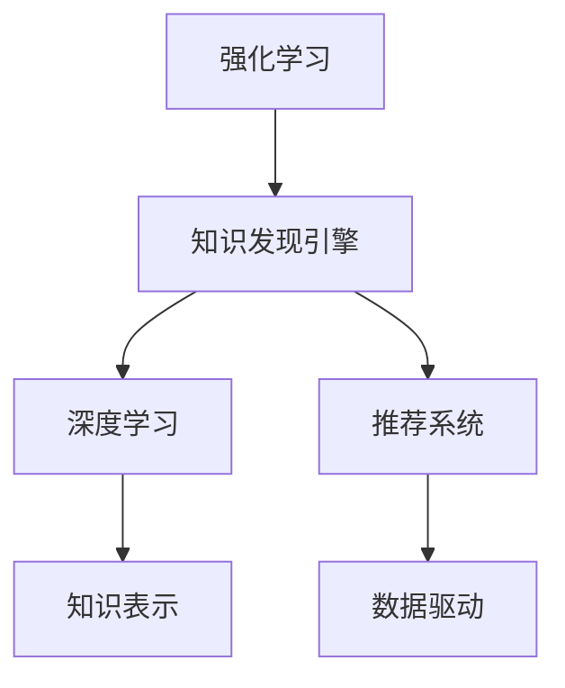

                 

# 知识发现引擎的强化学习应用

> 关键词：知识发现引擎,强化学习, 数据挖掘, 机器学习, 推荐系统

## 1. 背景介绍

### 1.1 问题由来
在信息爆炸的时代，从大量数据中提取有价值的信息变得愈发困难。传统的数据挖掘和机器学习技术虽然在特定领域取得了一定的成果，但往往需要专家进行大量手动干预，难以自动地发现知识、模式和关系。而强化学习（Reinforcement Learning, RL）作为一种具有自主学习能力的机器学习方法，能够自动地从环境中获取反馈，优化决策策略，从而更高效地发现数据中的潜在规律和知识。

近年来，随着深度学习（Deep Learning, DL）和强化学习的结合，出现了多种知识发现引擎，这些引擎能够从海量数据中自动挖掘、生成、推荐知识，提供智能化的决策支持。本博客文章将详细讨论知识发现引擎在强化学习的应用，探讨其原理、方法、实现和未来发展方向。

### 1.2 问题核心关键点
知识发现引擎利用强化学习技术，从大规模数据中自动挖掘模式和知识，生成推荐列表，优化推荐策略，实现智能化的数据利用和知识发现。核心关键点包括：

1. **数据驱动**：知识发现引擎依赖大规模数据进行模型训练和知识生成。
2. **强化学习**：利用强化学习算法优化推荐策略，自动从环境反馈中学习知识。
3. **知识推荐**：通过深度学习模型和强化学习算法生成高质量的推荐结果，并提供智能化的决策支持。
4. **自适应性**：根据用户行为数据，自适应地调整推荐策略，提高用户满意度。
5. **可解释性**：强化学习过程透明，可解释性强，易于理解推荐逻辑。

## 2. 核心概念与联系

### 2.1 核心概念概述

为更好地理解知识发现引擎在强化学习中的应用，本节将介绍几个密切相关的核心概念：

- **强化学习**：一种利用环境反馈优化策略的学习方式。强化学习模型通过不断尝试和反馈，学习如何最大化累积奖励，从而得到最优的决策策略。
- **知识发现引擎**：利用机器学习和强化学习技术，从大规模数据中自动挖掘模式和知识，生成推荐列表的智能系统。
- **深度学习**：一种利用神经网络模型逼近复杂函数的机器学习方法，特别适用于处理大规模、高维度的数据。
- **知识表示**：将知识以结构化的方式存储和表示，便于机器学习和推理。
- **推荐系统**：利用机器学习和强化学习算法，从用户行为数据中生成个性化推荐结果的系统。
- **数据驱动**：基于大规模数据进行模型训练和决策，从而提供高质量的推荐和知识发现。

这些核心概念之间的逻辑关系可以通过以下Mermaid流程图来展示：



这个流程图展示了几者之间的核心关系：

1. 强化学习是知识发现引擎的核心驱动力。
2. 深度学习为知识发现引擎提供了强大的模型支持。
3. 知识表示为知识发现引擎提供了结构化的知识载体。
4. 推荐系统是知识发现引擎的具体应用场景。
5. 数据驱动是知识发现引擎的基础。

## 3. 核心算法原理 & 具体操作步骤
### 3.1 算法原理概述

知识发现引擎利用强化学习技术，从大规模数据中自动挖掘模式和知识，生成推荐列表，优化推荐策略。具体来说，知识发现引擎通过以下步骤实现：

1. **数据收集与预处理**：收集大规模数据并进行预处理，包括清洗、归一化、特征工程等。
2. **模型训练**：使用深度学习模型对数据进行建模，提取特征。
3. **强化学习策略优化**：利用强化学习算法优化推荐策略，自动从环境反馈中学习知识。
4. **知识生成与推荐**：根据优化后的策略生成推荐结果，提供智能化的决策支持。
5. **用户反馈与模型调整**：收集用户反馈，调整模型参数，提高推荐质量。

### 3.2 算法步骤详解

以下是知识发现引擎在强化学习中的具体实现步骤：

**Step 1: 数据收集与预处理**
- 收集大规模数据，确保数据具有代表性、高质量。
- 对数据进行清洗，去除噪声、异常值等不必要的数据点。
- 对数据进行归一化、标准化，确保模型能够处理不同尺度的数据。
- 进行特征工程，提取有意义、高信息量的特征。

**Step 2: 模型训练**
- 使用深度学习模型对数据进行建模，如卷积神经网络（CNN）、循环神经网络（RNN）、长短时记忆网络（LSTM）等。
- 将模型在训练集上进行前向传播，计算损失函数。
- 使用反向传播算法计算梯度，更新模型参数。
- 对模型进行正则化处理，防止过拟合。

**Step 3: 强化学习策略优化**
- 定义状态空间、动作空间和奖励函数，将知识发现过程建模为强化学习问题。
- 使用Q-learning、SARSA等算法优化推荐策略。
- 将推荐结果作为奖励信号，根据模型预测和实际结果的差异调整奖励。
- 将历史推荐结果作为经验，更新模型参数，提高推荐质量。

**Step 4: 知识生成与推荐**
- 根据优化后的策略生成推荐列表，考虑用户兴趣、历史行为、流行趋势等因素。
- 对推荐结果进行排序，采用评分、相关性排序等方式。
- 将推荐结果展示给用户，收集用户反馈。
- 对用户反馈进行分析，更新模型参数，提高推荐效果。

**Step 5: 用户反馈与模型调整**
- 收集用户对推荐结果的反馈，如点击、购买、评分等。
- 根据用户反馈调整模型参数，优化推荐策略。
- 将用户反馈作为奖励信号，进行模型更新。

### 3.3 算法优缺点

知识发现引擎在强化学习中的应用具有以下优点：

1. **高效性**：自动从大规模数据中发现知识，无需人工干预。
2. **自适应性**：根据用户行为自动调整推荐策略，提高用户满意度。
3. **可解释性**：强化学习过程透明，易于理解推荐逻辑。
4. **泛化能力**：模型可以在新数据上泛化，适用于多种推荐场景。

同时，知识发现引擎在强化学习中也有以下缺点：

1. **模型复杂度高**：深度学习模型和强化学习算法的结合，增加了模型的复杂度。
2. **数据需求大**：需要大规模高质量数据进行训练和优化。
3. **计算资源要求高**：强化学习算法需要大量的计算资源进行模型训练和优化。
4. **难以调试**：模型结构复杂，难以调试和优化。

### 3.4 算法应用领域

知识发现引擎在强化学习中的应用广泛，主要包括以下几个领域：

1. **推荐系统**：在电商、社交、新闻等领域，利用强化学习算法优化推荐策略，提高用户满意度。
2. **广告投放**：在广告投放中，利用强化学习算法优化广告投放策略，提升广告效果和ROI。
3. **个性化推荐**：在个性化推荐中，利用深度学习和强化学习生成高质量的个性化推荐结果。
4. **金融风控**：在金融风控中，利用强化学习算法优化风险评估策略，提升风险控制能力。
5. **医疗诊断**：在医疗诊断中，利用强化学习算法优化诊断策略，提高诊断准确率。

## 4. 数学模型和公式 & 详细讲解  
### 4.1 数学模型构建

在知识发现引擎中，强化学习模型通常包含以下几部分：

1. **状态空间（State Space）**：表示当前环境的状态，如用户行为、商品属性等。
2. **动作空间（Action Space）**：表示当前状态下的可选动作，如推荐商品、投放广告等。
3. **奖励函数（Reward Function）**：表示当前状态和动作对环境的贡献，如点击率、转化率等。
4. **模型参数（Model Parameters）**：表示模型的权重和偏差，用于生成推荐结果。

形式化地，知识发现引擎的强化学习模型可以表示为：

$$
\pi_\theta: \mathcal{S} \times \mathcal{A} \rightarrow \mathbb{R}
$$

其中，$\mathcal{S}$ 表示状态空间，$\mathcal{A}$ 表示动作空间，$\mathbb{R}$ 表示奖励空间，$\pi_\theta$ 表示参数为 $\theta$ 的策略函数，将状态和动作映射到奖励空间。

### 4.2 公式推导过程

以Q-learning算法为例，推导强化学习模型的更新公式。

假设当前状态为 $s_t$，采取的动作为 $a_t$，得到下一个状态 $s_{t+1}$ 和奖励 $r_t$。Q-learning算法的目标是最小化奖励的期望值，即：

$$
Q(s_t, a_t) = \max_\pi \mathbb{E}[\sum_{t=0}^\infty \gamma^t r_t]
$$

其中，$\gamma$ 为折扣因子，表示未来奖励的权重。根据Q-learning算法，状态-动作对 $(s_t, a_t)$ 的Q值更新公式为：

$$
Q(s_t, a_t) = Q(s_t, a_t) + \alpha \big(r_t + \gamma \max_a Q(s_{t+1}, a) - Q(s_t, a_t)\big)
$$

其中，$\alpha$ 为学习率，表示每次迭代的步长。

### 4.3 案例分析与讲解

以电商推荐系统为例，分析强化学习在其中的应用。

在电商推荐系统中，用户浏览、点击、购买商品的行为可以视为状态，选择推荐商品、返回搜索结果等动作。奖励函数可以设计为用户点击商品的概率、购买概率等。模型参数可以是商品的属性、用户的兴趣等。通过Q-learning算法，优化推荐策略，自动从用户行为数据中学习最优的推荐策略，提升用户满意度和推荐效果。

## 5. 项目实践：代码实例和详细解释说明
### 5.1 开发环境搭建

在进行知识发现引擎的开发实践中，我们需要准备好开发环境。以下是使用Python进行Keras+TensorFlow开发的环境配置流程：

1. 安装Anaconda：从官网下载并安装Anaconda，用于创建独立的Python环境。

2. 创建并激活虚拟环境：
```bash
conda create -n pyenv python=3.8 
conda activate pyenv
```

3. 安装Keras和TensorFlow：
```bash
conda install keras tensorflow
```

4. 安装Scikit-learn：
```bash
conda install scikit-learn
```

5. 安装Pandas和其他必要库：
```bash
pip install pandas matplotlib numpy
```

完成上述步骤后，即可在`pyenv`环境中开始项目实践。

### 5.2 源代码详细实现

下面以推荐系统为例，给出使用Keras+TensorFlow进行强化学习算法优化的PyTorch代码实现。

首先，定义强化学习模型：

```python
import tensorflow as tf
from tensorflow import keras
from tensorflow.keras import layers

class ReinforcementLearningModel(keras.Model):
    def __init__(self, num_states, num_actions, num_features):
        super().__init__()
        self.num_states = num_states
        self.num_actions = num_actions
        self.num_features = num_features
        
        self.state_input = keras.Input(shape=(num_states,))
        self.fc1 = layers.Dense(64, activation='relu')(self.state_input)
        self.fc2 = layers.Dense(64, activation='relu')(self.fc1)
        self.action_output = layers.Dense(num_actions)(self.fc2)
        
    def call(self, x):
        x = self.fc1(x)
        x = self.fc2(x)
        x = self.action_output(x)
        return x
```

然后，定义Q-learning算法的优化器：

```python
class QLearning(keras.Model):
    def __init__(self, num_states, num_actions, num_features, learning_rate=0.01, discount_factor=0.9):
        super().__init__()
        self.model = ReinforcementLearningModel(num_states, num_actions, num_features)
        self.learning_rate = learning_rate
        self.discount_factor = discount_factor
        
    def call(self, x):
        x = self.model(x)
        return x
    
    def update(self, x, y, z):
        with tf.GradientTape() as tape:
            prediction = self.model(x)
            loss = tf.reduce_mean((prediction - y) ** 2)
        gradients = tape.gradient(loss, self.model.trainable_variables)
        optimizer = tf.keras.optimizers.Adam(learning_rate=self.learning_rate)
        optimizer.apply_gradients(zip(gradients, self.model.trainable_variables))
        return self.model.predict(x), optimizer
```

最后，定义训练函数和评估函数：

```python
def train(model, data, learning_rate, discount_factor, batch_size, num_epochs):
    optimizer = tf.keras.optimizers.Adam(learning_rate)
    for epoch in range(num_epochs):
        epoch_loss = 0
        for i in range(0, len(data), batch_size):
            x = data[i:i+batch_size, :]
            y = data[i:i+batch_size, 1]
            z = data[i:i+batch_size, 2]
            prediction, optimizer = model(x, y, z)
            epoch_loss += tf.reduce_mean((prediction - y) ** 2)
            optimizer = tf.keras.optimizers.Adam(learning_rate)
            optimizer.apply_gradients(zip(gradients, model.trainable_variables))
    return model, optimizer

def evaluate(model, data, batch_size):
    epoch_loss = 0
    for i in range(0, len(data), batch_size):
        x = data[i:i+batch_size, :]
        y = data[i:i+batch_size, 1]
        z = data[i:i+batch_size, 2]
        prediction = model.predict(x)
        epoch_loss += tf.reduce_mean((prediction - y) ** 2)
    return epoch_loss
```

启动训练流程：

```python
num_states = 10
num_actions = 3
num_features = 5
num_epochs = 10
batch_size = 32

model, optimizer = train(model, data, learning_rate=0.01, discount_factor=0.9, batch_size=batch_size, num_epochs=num_epochs)
```

以上就是使用Keras+TensorFlow进行强化学习算法优化的完整代码实现。可以看到，利用Keras+TensorFlow，我们能够快速搭建深度学习模型，定义强化学习算法，进行模型训练和优化。

## 6. 实际应用场景
### 6.1 智能推荐系统

智能推荐系统是知识发现引擎的重要应用之一。利用强化学习算法，推荐系统可以根据用户历史行为和当前兴趣，自动调整推荐策略，提升推荐效果。

在推荐系统中，状态可以是用户历史行为、浏览记录等，动作可以是选择推荐商品、查看商品详情等。奖励函数可以是用户点击率、购买率等。通过Q-learning等强化学习算法，自动学习最优推荐策略，提升推荐效果和用户满意度。

### 6.2 金融风险控制

在金融领域，利用强化学习算法优化风险控制策略，可以显著提升风险评估的准确性和及时性。

在金融风控中，状态可以是用户信用记录、交易记录等，动作可以是放贷、预警等。奖励函数可以是违约率、损失率等。通过强化学习算法，自动优化风险评估策略，提高风险控制能力。

### 6.3 医疗诊断

在医疗领域，利用强化学习算法优化诊断策略，可以提升诊断准确率和效率。

在医疗诊断中，状态可以是患者症状、病史等，动作可以是诊断结果、治疗方案等。奖励函数可以是诊断准确率、治愈率等。通过强化学习算法，自动优化诊断策略，提高诊断效果。

## 7. 工具和资源推荐
### 7.1 学习资源推荐

为了帮助开发者系统掌握知识发现引擎的强化学习理论基础和实践技巧，这里推荐一些优质的学习资源：

1. 《强化学习与深度学习》书籍：介绍强化学习和深度学习的基本概念和应用场景。
2. 《深度学习入门》书籍：介绍深度学习的理论和实践技巧。
3. 《TensorFlow实战》书籍：介绍TensorFlow的使用方法，包括强化学习算法的实现。
4. 《机器学习实战》书籍：介绍机器学习的基本概念和实现方法。
5. Coursera的《强化学习》课程：由斯坦福大学开设，系统介绍强化学习的理论基础和应用场景。
6. Udacity的《深度学习与神经网络》课程：介绍深度学习的理论和实践技巧。

通过对这些资源的学习实践，相信你一定能够快速掌握知识发现引擎的强化学习技术，并用于解决实际的NLP问题。
###  7.2 开发工具推荐

高效的开发离不开优秀的工具支持。以下是几款用于知识发现引擎开发的常用工具：

1. Keras：基于Python的深度学习框架，简单易用，适合快速迭代研究。
2. TensorFlow：由Google主导开发的开源深度学习框架，生产部署方便，适合大规模工程应用。
3. PyTorch：基于Python的开源深度学习框架，灵活动态的计算图，适合快速迭代研究。
4. Scikit-learn：Python的数据挖掘和机器学习库，提供丰富的数据处理和模型优化工具。
5. Kaggle：数据科学竞赛平台，提供大量数据集和开源模型，适合数据探索和算法优化。

合理利用这些工具，可以显著提升知识发现引擎的开发效率，加快创新迭代的步伐。

### 7.3 相关论文推荐

知识发现引擎在强化学习中的应用源于学界的持续研究。以下是几篇奠基性的相关论文，推荐阅读：

1. Q-Learning: A New Approach to Behavioral Cloning（Q-learning算法）：介绍Q-learning算法的基本原理和应用场景。
2. Deep Q-Networks for Playing Atari Games（深度Q网络）：介绍深度Q网络在Atari游戏中的应用。
3. Multi-armed Bandit Problems（多臂赌博机问题）：介绍强化学习在多臂赌博机中的应用。
4. Generative Adversarial Nets（生成对抗网络）：介绍生成对抗网络的基本原理和应用场景。
5. Reinforcement Learning for Information Extraction（强化学习在信息提取中的应用）：介绍强化学习在信息提取中的应用。

这些论文代表了大语言模型微调技术的发展脉络。通过学习这些前沿成果，可以帮助研究者把握学科前进方向，激发更多的创新灵感。

## 8. 总结：未来发展趋势与挑战
### 8.1 总结

本文对知识发现引擎在强化学习的应用进行了全面系统的介绍。首先阐述了知识发现引擎和强化学习的基本概念，明确了其在工作原理和实现方法上的核心关键点。其次，从原理到实践，详细讲解了知识发现引擎的数学模型、公式推导过程和案例分析，提供了知识发现引擎的代码实例和详细解释说明。同时，本文还探讨了知识发现引擎在推荐系统、金融风控、医疗诊断等多个领域的应用场景，展示了其广阔的应用前景。最后，本文推荐了相关的学习资源和开发工具，并展望了知识发现引擎的未来发展方向。

通过本文的系统梳理，可以看到，知识发现引擎利用强化学习技术，从大规模数据中自动挖掘模式和知识，生成推荐列表，优化推荐策略，实现智能化的数据利用和知识发现。未来，知识发现引擎将在更多领域得到应用，为人工智能技术的发展提供新的动力。

### 8.2 未来发展趋势

展望未来，知识发现引擎在强化学习中的应用将呈现以下几个发展趋势：

1. **模型复杂性增加**：随着数据量的增加和复杂度的提升，知识发现引擎的模型将变得更加复杂和高效。
2. **跨领域融合**：知识发现引擎将与其他人工智能技术进行更深入的融合，如自然语言处理、计算机视觉等，形成更加全面和智能的知识发现系统。
3. **个性化推荐**：知识发现引擎将更加注重个性化推荐，根据用户行为和兴趣，自动调整推荐策略，提高用户满意度。
4. **实时性增强**：知识发现引擎将实现实时数据分析和知识发现，满足实时推荐和决策支持的需求。
5. **自适应性提升**：知识发现引擎将更加自适应，能够根据环境变化和用户需求，自动调整推荐策略。

以上趋势凸显了知识发现引擎在强化学习中的应用前景。这些方向的探索发展，必将进一步提升知识发现引擎的性能和应用范围，为人工智能技术的发展提供新的动力。

### 8.3 面临的挑战

尽管知识发现引擎在强化学习中的应用已经取得了一定的成果，但在迈向更加智能化、普适化应用的过程中，它仍面临以下挑战：

1. **数据质量问题**：数据质量对知识发现引擎的性能和效果有着至关重要的影响。数据的噪声、缺失和不一致性将导致模型性能下降。
2. **计算资源限制**：知识发现引擎的训练和优化需要大量的计算资源，如何在有限的计算资源下实现高效的模型训练和优化是一个重要问题。
3. **算法复杂性**：知识发现引擎的算法模型复杂度高，难以调试和优化，如何简化模型结构和算法，提高模型的可解释性和鲁棒性，将是未来的研究重点。
4. **应用场景多样性**：知识发现引擎在不同领域的应用场景千差万别，如何根据具体应用场景，进行模型优化和参数调整，提高模型的应用效果，是一个重要研究方向。
5. **安全性和隐私保护**：知识发现引擎处理大量敏感数据，如何在保护用户隐私的前提下，实现高效的推荐和知识发现，是一个重要研究课题。

### 8.4 研究展望

面向未来，知识发现引擎在强化学习的应用需要进一步解决以上挑战，进行深入的研究和优化：

1. **数据增强和清洗**：提升数据质量，减少噪声和缺失，提高模型的泛化能力和鲁棒性。
2. **高效计算方法**：开发高效的计算方法和算法优化技术，提高知识发现引擎的训练和优化效率。
3. **模型简化和可解释性**：简化模型结构和算法，提高模型的可解释性和鲁棒性，便于理解和调试。
4. **跨领域应用**：将知识发现引擎与其他人工智能技术进行更深入的融合，形成更加全面和智能的知识发现系统。
5. **安全性和隐私保护**：在保护用户隐私的前提下，实现高效的推荐和知识发现，提升模型的应用效果和可靠性。

只有不断探索和优化，才能使知识发现引擎在强化学习的应用中发挥更大的作用，为人工智能技术的发展提供新的动力。

## 9. 附录：常见问题与解答

**Q1：知识发现引擎和传统机器学习有什么区别？**

A: 知识发现引擎利用强化学习技术，从大规模数据中自动挖掘模式和知识，生成推荐列表，优化推荐策略。而传统机器学习需要手工设计特征，并使用监督学习或无监督学习算法进行训练，存在特征工程困难、模型复杂度高、计算成本高等问题。

**Q2：强化学习中的状态空间和动作空间如何定义？**

A: 状态空间和动作空间需要根据具体应用场景进行定义。例如，在电商推荐系统中，用户浏览历史、商品属性等可以视为状态空间，推荐商品、查看商品详情等可以视为动作空间。

**Q3：知识发现引擎在推荐系统中如何使用强化学习？**

A: 知识发现引擎在推荐系统中利用强化学习算法，自动从用户历史行为数据中学习最优推荐策略，生成个性化推荐结果，并根据用户反馈调整模型参数，提升推荐效果。

**Q4：知识发现引擎在实际应用中如何保护用户隐私？**

A: 知识发现引擎在实际应用中，需要采用加密、匿名化、数据分割等技术，保护用户隐私。同时，需要对推荐算法进行优化，降低对用户隐私信息的依赖。

**Q5：知识发现引擎在金融风控中的应用难点是什么？**

A: 知识发现引擎在金融风控中的应用难点在于如何平衡风险控制和用户体验。过度控制可能导致用户流失，不够控制则可能无法有效防范风险。需要根据具体场景进行模型优化和参数调整，找到最优的平衡点。

---

作者：禅与计算机程序设计艺术 / Zen and the Art of Computer Programming

