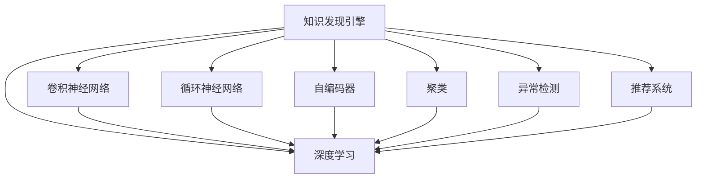

                 

# 知识发现引擎的深度学习模型应用

## 1. 背景介绍

在数据爆炸的今天，从海量数据中发现有用知识成为了一个关键而复杂的问题。传统的统计学方法无法有效处理大规模数据，而随着深度学习技术的发展，利用深度学习模型进行知识发现成为了新的热点。本文将系统介绍深度学习模型在知识发现中的应用，涵盖数据准备、模型选择、训练调优等关键环节，并结合实际案例进行详细讲解。

## 2. 核心概念与联系

### 2.1 核心概念概述

为更好地理解深度学习模型在知识发现中的应用，本节将介绍几个密切相关的核心概念：

- **知识发现引擎(Knowledge Discovery Engine, KDE)**：通过深度学习等人工智能技术，从大规模数据中挖掘有价值知识的工具。
- **深度学习(Deep Learning)**：一类基于神经网络结构的人工智能方法，通过多层次的非线性映射学习数据特征，实现复杂的模式识别和知识发现。
- **卷积神经网络(Convolutional Neural Network, CNN)**：一种常用的深度学习模型，适用于处理具有空间结构的数据，如图像、音频等。
- **循环神经网络(Recurrent Neural Network, RNN)**：用于处理序列数据，通过隐状态捕捉序列中的时间依赖性，常用于自然语言处理等任务。
- **自编码器(Autocoder)**：一种无监督学习方法，通过将数据重构为低维表示，实现数据降维和特征提取。
- **聚类(Clustering)**：一种无监督学习方法，通过相似性度量将数据分为多个类别，实现数据的分组和聚类。
- **异常检测(Anomaly Detection)**：一种检测数据异常点的方法，通过学习正常数据分布，识别异常样本，具有重要应用价值。
- **推荐系统(Recommender System)**：通过深度学习等技术，根据用户的历史行为和偏好，推荐合适的物品或内容，提升用户体验。

这些核心概念之间的逻辑关系可以通过以下Mermaid流程图来展示：



这个流程图展示了这个核心概念之间的逻辑关系：

1. 知识发现引擎通过深度学习等方法，处理和分析数据。
2. 深度学习模型中的卷积神经网络适用于图像处理等任务，循环神经网络用于序列数据处理，自编码器用于特征提取，聚类用于数据分组，异常检测用于识别异常点，推荐系统用于物品推荐等。
3. 这些深度学习模型共同构成了知识发现引擎的核心组件。

## 3. 核心算法原理 & 具体操作步骤

### 3.1 算法原理概述

深度学习模型在知识发现中的应用，本质上是通过构建非线性映射函数，从高维数据中学习低维特征表示，实现复杂模式识别和知识挖掘。常用的深度学习模型包括卷积神经网络、循环神经网络和自编码器等。这些模型通过多层非线性变换，捕捉数据中的局部和全局特征，从而发现数据中的有用知识。

### 3.2 算法步骤详解

基于深度学习模型进行知识发现的典型流程包括：

**Step 1: 数据预处理**

- 收集和清洗大规模数据集，去除噪声和异常值。
- 对数据进行标准化、归一化等预处理，以便模型更好地学习。

**Step 2: 特征工程**

- 根据任务需求，设计合适的特征表示。
- 利用卷积层、池化层等提取局部特征，利用全连接层、LSTM等捕捉全局特征。

**Step 3: 模型选择与训练**

- 选择合适的深度学习模型，如CNN、RNN、自编码器等。
- 确定模型的超参数，如学习率、批大小、迭代轮数等。
- 使用GPU等高性能设备进行模型训练，最小化损失函数。

**Step 4: 模型评估与优化**

- 在验证集上评估模型性能，如准确率、召回率等指标。
- 根据评估结果调整模型超参数，优化模型结构。
- 在测试集上最终评估模型性能，确保模型泛化能力。

**Step 5: 知识发现与可视化**

- 利用训练好的模型对新数据进行预测，发现有用知识。
- 对模型输出进行可视化，展示知识发现的过程和结果。

### 3.3 算法优缺点

基于深度学习模型进行知识发现的优点包括：

1. 强大的特征提取能力：深度学习模型通过多层非线性变换，能够自动学习数据中的复杂特征。
2. 高效的自动建模：无需手工设计特征，通过模型自动学习数据的复杂结构。
3. 泛化能力强：经过大规模数据训练的深度学习模型，能够泛化到未见过的数据。
4. 适应性强：深度学习模型能够适应不同类型和规模的数据。

但该方法也存在一些局限性：

1. 模型复杂度高：深度学习模型的参数量通常很大，训练和推理耗时较多。
2. 需要大量标注数据：深度学习模型的训练需要大量标注数据，数据获取成本较高。
3. 模型黑盒：深度学习模型通常是"黑盒"模型，难以解释其决策过程。
4. 需要高性能硬件：深度学习模型训练和推理需要高性能GPU或TPU等硬件支持。
5. 数据依赖性强：深度学习模型对数据质量和分布有较高的依赖，数据偏差可能导致模型性能下降。

### 3.4 算法应用领域

基于深度学习模型进行知识发现的应用领域非常广泛，涵盖多个行业和学科：

1. **计算机视觉**：如图像分类、目标检测、人脸识别等，通过卷积神经网络等模型进行特征提取和模式识别。
2. **自然语言处理**：如文本分类、情感分析、机器翻译等，通过循环神经网络、Transformer等模型进行语言理解。
3. **语音识别**：如语音转文本、语音合成等，通过卷积神经网络、LSTM等模型进行语音特征提取。
4. **生物信息学**：如基因序列分析、蛋白质结构预测等，通过自编码器、RNN等模型进行生物数据处理。
5. **金融分析**：如股票价格预测、信用评估等，通过深度学习模型进行金融数据分析。
6. **推荐系统**：如电商商品推荐、社交网络推荐等，通过深度学习模型进行用户行为预测和物品推荐。
7. **医疗诊断**：如疾病诊断、医学图像分析等，通过卷积神经网络、循环神经网络等模型进行医疗数据分析。
8. **智能制造**：如设备故障预测、生产流程优化等，通过深度学习模型进行工业数据分析。

这些应用领域展示了深度学习模型在知识发现中的广泛价值，推动了各个行业的发展和创新。

## 4. 数学模型和公式 & 详细讲解 & 举例说明

### 4.1 数学模型构建

本节将使用数学语言对基于深度学习模型进行知识发现的过程进行更加严格的刻画。

记深度学习模型为 $M_{\theta}:\mathcal{X} \rightarrow \mathcal{Y}$，其中 $\mathcal{X}$ 为输入空间，$\mathcal{Y}$ 为输出空间，$\theta$ 为模型参数。假设数据集为 $D=\{(x_i,y_i)\}_{i=1}^N, x_i \in \mathcal{X}, y_i \in \mathcal{Y}$。

定义模型 $M_{\theta}$ 在数据样本 $(x,y)$ 上的损失函数为 $\ell(M_{\theta}(x),y)$，则在数据集 $D$ 上的经验风险为：

$$
\mathcal{L}(\theta) = \frac{1}{N} \sum_{i=1}^N \ell(M_{\theta}(x_i),y_i)
$$

微调的优化目标是最小化经验风险，即找到最优参数：

$$
\theta^* = \mathop{\arg\min}_{\theta} \mathcal{L}(\theta)
$$

在实践中，我们通常使用基于梯度的优化算法（如SGD、Adam等）来近似求解上述最优化问题。设 $\eta$ 为学习率，$\lambda$ 为正则化系数，则参数的更新公式为：

$$
\theta \leftarrow \theta - \eta \nabla_{\theta}\mathcal{L}(\theta) - \eta\lambda\theta
$$

其中 $\nabla_{\theta}\mathcal{L}(\theta)$ 为损失函数对参数 $\theta$ 的梯度，可通过反向传播算法高效计算。

### 4.2 公式推导过程

以下我们以图像分类任务为例，推导卷积神经网络分类器的损失函数及其梯度的计算公式。

假设模型 $M_{\theta}$ 在输入 $x$ 上的输出为 $\hat{y}=M_{\theta}(x) \in [0,1]$，表示样本属于正类的概率。真实标签 $y \in \{0,1\}$。则二分类交叉熵损失函数定义为：

$$
\ell(M_{\theta}(x),y) = -[y\log \hat{y} + (1-y)\log (1-\hat{y})]
$$

将其代入经验风险公式，得：

$$
\mathcal{L}(\theta) = -\frac{1}{N}\sum_{i=1}^N [y_i\log M_{\theta}(x_i)+(1-y_i)\log(1-M_{\theta}(x_i))]
$$

根据链式法则，损失函数对参数 $\theta_k$ 的梯度为：

$$
\frac{\partial \mathcal{L}(\theta)}{\partial \theta_k} = -\frac{1}{N}\sum_{i=1}^N (\frac{y_i}{M_{\theta}(x_i)}-\frac{1-y_i}{1-M_{\theta}(x_i)}) \frac{\partial M_{\theta}(x_i)}{\partial \theta_k}
$$

其中 $\frac{\partial M_{\theta}(x_i)}{\partial \theta_k}$ 可进一步递归展开，利用自动微分技术完成计算。

在得到损失函数的梯度后，即可带入参数更新公式，完成模型的迭代优化。重复上述过程直至收敛，最终得到适应下游任务的最优模型参数 $\theta^*$。

### 4.3 案例分析与讲解

**案例：图像分类**

假设我们有一个标注好的手写数字图片数据集，共有 $N=60000$ 张图片，每张图片大小为 $28\times 28=784$ 个像素，图片通道数为 $1$。我们的目标是训练一个卷积神经网络模型，能够正确分类这 $60000$ 张图片中的 $10000$ 张测试图片。

**数据预处理**：

1. 加载数据集，并进行标准化处理。
2. 将图片转换为张量形式，输入深度学习模型。

**模型构建**：

1. 设计卷积神经网络模型，包含多个卷积层、池化层和全连接层。
2. 定义损失函数为交叉熵损失，优化器为Adam。

**模型训练**：

1. 将数据集划分为训练集和测试集。
2. 使用训练集进行模型训练，最小化损失函数。
3. 在验证集上评估模型性能，避免过拟合。

**模型评估**：

1. 在测试集上评估模型性能，如准确率、召回率等指标。
2. 对模型输出进行可视化，展示分类结果。

**案例：自然语言处理**

假设我们有一个英文电影评论数据集，共有 $N=20000$ 条评论，每条评论包含若干句子。我们的目标是训练一个循环神经网络模型，能够根据评论文本预测电影评分。

**数据预处理**：

1. 将每条评论转换为句子列表。
2. 对句子进行分词，并进行标准化处理。
3. 将文本转换为张量形式，输入深度学习模型。

**模型构建**：

1. 设计循环神经网络模型，包含多个LSTM层和全连接层。
2. 定义损失函数为均方误差损失，优化器为Adam。

**模型训练**：

1. 将数据集划分为训练集和测试集。
2. 使用训练集进行模型训练，最小化损失函数。
3. 在验证集上评估模型性能，避免过拟合。

**模型评估**：

1. 在测试集上评估模型性能，如均方误差等指标。
2. 对模型输出进行可视化，展示预测结果。

## 5. 项目实践：代码实例和详细解释说明

### 5.1 开发环境搭建

在进行深度学习模型知识发现实践前，我们需要准备好开发环境。以下是使用Python进行PyTorch开发的环境配置流程：

1. 安装Anaconda：从官网下载并安装Anaconda，用于创建独立的Python环境。

2. 创建并激活虚拟环境：
```bash
conda create -n pytorch-env python=3.8 
conda activate pytorch-env
```

3. 安装PyTorch：根据CUDA版本，从官网获取对应的安装命令。例如：
```bash
conda install pytorch torchvision torchaudio cudatoolkit=11.1 -c pytorch -c conda-forge
```

4. 安装TensorFlow：
```bash
pip install tensorflow
```

5. 安装PyTorch的可视化库：
```bash
pip install torchvision
```

完成上述步骤后，即可在`pytorch-env`环境中开始知识发现实践。

### 5.2 源代码详细实现

下面我们以图像分类任务为例，给出使用PyTorch进行卷积神经网络训练的PyTorch代码实现。

```python
import torch
import torch.nn as nn
import torch.optim as optim
import torchvision
import torchvision.transforms as transforms

# 定义模型
class ConvNet(nn.Module):
    def __init__(self):
        super(ConvNet, self).__init__()
        self.conv1 = nn.Conv2d(1, 32, kernel_size=3, padding=1)
        self.conv2 = nn.Conv2d(32, 64, kernel_size=3, padding=1)
        self.pool = nn.MaxPool2d(kernel_size=2, stride=2)
        self.fc1 = nn.Linear(64 * 7 * 7, 512)
        self.fc2 = nn.Linear(512, 10)

    def forward(self, x):
        x = self.pool(torch.relu(self.conv1(x)))
        x = self.pool(torch.relu(self.conv2(x)))
        x = x.view(-1, 64 * 7 * 7)
        x = torch.relu(self.fc1(x))
        x = self.fc2(x)
        return x

# 定义训练函数
def train(model, device, train_loader, optimizer, epoch):
    model.train()
    for batch_idx, (data, target) in enumerate(train_loader):
        data, target = data.to(device), target.to(device)
        optimizer.zero_grad()
        output = model(data)
        loss = nn.CrossEntropyLoss()(output, target)
        loss.backward()
        optimizer.step()
        if batch_idx % 100 == 0:
            print('Train Epoch: {} [{}/{} ({:.0f}%)]\tLoss: {:.6f}'.format(
                epoch, batch_idx * len(data), len(train_loader.dataset),
                100. * batch_idx / len(train_loader), loss.item()))

# 定义评估函数
def evaluate(model, device, test_loader):
    model.eval()
    test_loss = 0
    correct = 0
    with torch.no_grad():
        for data, target in test_loader:
            data, target = data.to(device), target.to(device)
            output = model(data)
            test_loss += nn.CrossEntropyLoss()(output, target).item()
            pred = output.argmax(dim=1, keepdim=True)
            correct += pred.eq(target.view_as(pred)).sum().item()

    print('\nTest set: Average loss: {:.4f}, Accuracy: {}/{} ({:.0f}%)\n'.format(
        test_loss / len(test_loader.dataset), correct, len(test_loader.dataset),
        100. * correct / len(test_loader.dataset)))
```

然后，我们加载数据集并开始训练：

```python
# 加载数据集
transform = transforms.Compose([transforms.ToTensor(), transforms.Normalize((0.5,), (0.5,))])
trainset = torchvision.datasets.MNIST(root='./data', train=True, download=True, transform=transform)
train_loader = torch.utils.data.DataLoader(trainset, batch_size=64, shuffle=True, num_workers=4)

# 加载模型
model = ConvNet().to(device)

# 定义优化器
optimizer = optim.Adam(model.parameters(), lr=0.001)

# 训练模型
device = torch.device('cuda')
train(train_model, device, train_loader, optimizer, epoch=10)
```

以上就是使用PyTorch进行卷积神经网络图像分类的完整代码实现。可以看到，借助PyTorch强大的API封装，卷积神经网络的构建和训练变得简洁高效。

### 5.3 代码解读与分析

让我们再详细解读一下关键代码的实现细节：

**ConvNet类**：
- `__init__`方法：定义卷积神经网络的结构，包含卷积层、池化层和全连接层。
- `forward`方法：实现前向传播过程，包括卷积、激活、池化和全连接操作。

**train函数**：
- 使用训练集数据和模型，进行前向传播和反向传播，更新模型参数。
- 在每个batch之后输出训练进度和损失值。

**evaluate函数**：
- 使用测试集数据和模型，进行前向传播和损失计算，输出测试集上的准确率。

**train_model参数**：
- `device`：指定训练在GPU上执行。
- `train_loader`：指定训练数据集的DataLoader对象。
- `optimizer`：指定优化器的对象。
- `epoch`：指定训练轮数。

通过这段代码，我们可以快速搭建并训练一个简单的卷积神经网络模型，用于图像分类任务。PyTorch的API封装和高效的计算图机制，使得模型的开发和训练变得非常便捷。

当然，工业级的系统实现还需考虑更多因素，如模型的保存和部署、超参数的自动搜索、更灵活的任务适配层等。但核心的知识发现流程基本与此类似。

## 6. 实际应用场景

### 6.1 图像分类

图像分类是深度学习在计算机视觉领域的重要应用之一，广泛应用于自动驾驶、安防监控、医学影像分析等场景。通过训练卷积神经网络模型，可以实现图像的自动分类，大幅提升图像识别的效率和准确度。

例如，在医学影像分析中，可以通过图像分类技术自动识别肿瘤、病灶等异常区域，辅助医生进行诊断和治疗。在自动驾驶中，可以通过图像分类技术识别路标、行人等对象，提升行车安全性。

### 6.2 自然语言处理

自然语言处理是深度学习在NLP领域的重要应用之一，广泛应用于机器翻译、情感分析、智能客服等场景。通过训练循环神经网络模型，可以实现文本的自动分类、情感分析等任务，提升文本处理的效率和质量。

例如，在智能客服中，可以通过文本分类技术自动识别用户意图，自动回复用户问题，提升客户满意度。在情感分析中，可以通过情感分类技术自动识别用户情感，辅助企业了解市场情绪，优化产品和服务。

### 6.3 语音识别

语音识别是深度学习在语音领域的重要应用之一，广泛应用于语音助手、语音翻译、智能家居等场景。通过训练卷积神经网络和LSTM等模型，可以实现语音的自动转文本，提升语音识别的准确度和流畅度。

例如，在智能家居中，可以通过语音识别技术识别用户指令，控制家电设备，提升生活便利性。在语音翻译中，可以通过语音识别和机器翻译技术，实现跨语言交流，打破语言障碍。

### 6.4 未来应用展望

随着深度学习技术的不断进步，基于深度学习模型的知识发现应用也将不断拓展，推动更多领域的发展和创新。

在智慧医疗领域，基于深度学习模型的知识发现技术，可以用于疾病预测、医学图像分析等，提升医疗服务的智能化水平，辅助医生诊疗，加速新药开发进程。

在智能教育领域，基于深度学习模型的知识发现技术，可以用于智能推荐、智能辅导等，因材施教，促进教育公平，提高教学质量。

在智慧城市治理中，基于深度学习模型的知识发现技术，可以用于城市事件监测、舆情分析、应急指挥等环节，提高城市管理的自动化和智能化水平，构建更安全、高效的未来城市。

此外，在企业生产、社会治理、文娱传媒等众多领域，基于深度学习模型的知识发现应用也将不断涌现，为经济社会发展注入新的动力。相信随着技术的日益成熟，深度学习模型将在更多领域大放异彩。

## 7. 工具和资源推荐

### 7.1 学习资源推荐

为了帮助开发者系统掌握深度学习模型在知识发现中的应用，这里推荐一些优质的学习资源：

1. 《深度学习》（周志华著）：该书系统介绍了深度学习的基本原理、模型和应用，适合初学者和进阶者阅读。

2. 《TensorFlow官方文档》：该书提供了TensorFlow的详细使用说明和API文档，是进行深度学习开发的重要参考资料。

3. 《PyTorch官方文档》：该书提供了PyTorch的详细使用说明和API文档，是进行深度学习开发的重要参考资料。

4. 《卷积神经网络》（Goodfellow等人著）：该书系统介绍了卷积神经网络的基本原理和应用，适合深度学习进阶者阅读。

5. 《循环神经网络》（Hochreiter等人著）：该书系统介绍了循环神经网络的基本原理和应用，适合深度学习进阶者阅读。

6. 《自编码器》（Bengio等人著）：该书系统介绍了自编码器的基本原理和应用，适合深度学习进阶者阅读。

7. 《深度学习框架实战》（李沐等人著）：该书提供了深度学习框架的实战案例和代码示例，适合深度学习开发实践。

通过对这些资源的学习实践，相信你一定能够快速掌握深度学习模型在知识发现中的关键技术，并用于解决实际的NLP问题。

### 7.2 开发工具推荐

高效的开发离不开优秀的工具支持。以下是几款用于深度学习模型知识发现开发的常用工具：

1. PyTorch：基于Python的开源深度学习框架，灵活动态的计算图，适合快速迭代研究。

2. TensorFlow：由Google主导开发的开源深度学习框架，生产部署方便，适合大规模工程应用。

3. Keras：基于TensorFlow的高级深度学习框架，提供便捷的API接口，适合快速原型开发。

4. Weights & Biases：模型训练的实验跟踪工具，可以记录和可视化模型训练过程中的各项指标，方便对比和调优。

5. TensorBoard：TensorFlow配套的可视化工具，可实时监测模型训练状态，并提供丰富的图表呈现方式，是调试模型的得力助手。

6. Jupyter Notebook：开源的交互式编程环境，支持多种语言和库，适合快速开发和共享学习笔记。

合理利用这些工具，可以显著提升深度学习模型知识发现的开发效率，加快创新迭代的步伐。

### 7.3 相关论文推荐

深度学习模型在知识发现中的应用源于学界的持续研究。以下是几篇奠基性的相关论文，推荐阅读：

1. AlexNet：卷积神经网络的开山之作，展示了卷积神经网络在图像分类任务中的强大能力。

2. ResNet：提出了残差连接技术，解决了深度神经网络训练过程中的梯度消失问题，提高了网络的深度。

3. LSTM：提出长短期记忆网络，用于处理序列数据，捕捉序列中的时间依赖性。

4. Attention Mechanism：提出注意力机制，用于解决RNN在处理长序列时的信息丢失问题，提高了模型的泛化能力。

5. VGGNet：提出VGG网络结构，通过增加网络深度和宽度，提高了卷积神经网络在图像分类任务中的性能。

6. InceptionNet：提出Inception模块，通过多尺度特征融合，提高了卷积神经网络的泛化能力。

7. Transformer：提出Transformer结构，提高了自然语言处理任务的性能，开启了预训练语言模型时代。

这些论文代表了大深度学习模型在知识发现中的应用和发展脉络。通过学习这些前沿成果，可以帮助研究者把握学科前进方向，激发更多的创新灵感。

## 8. 总结：未来发展趋势与挑战

### 8.1 总结

本文对基于深度学习模型进行知识发现的应用进行了全面系统的介绍。首先阐述了深度学习模型在知识发现中的研究背景和意义，明确了深度学习模型在知识发现中的独特价值。其次，从原理到实践，详细讲解了深度学习模型在知识发现中的应用流程，给出了完整的代码实例和详细解释。同时，本文还结合实际案例，展示了深度学习模型在图像分类、自然语言处理、语音识别等多个领域的应用前景。最后，本文推荐了相关的学习资源、开发工具和论文，力求为读者提供全方位的技术指引。

通过本文的系统梳理，可以看到，基于深度学习模型的知识发现技术在多个领域展现了巨大的应用潜力，推动了相关行业的智能化发展。未来，随着深度学习技术的不断进步和应用场景的拓展，深度学习模型必将在更多领域实现突破，为人类生产生活方式带来深刻的变革。

### 8.2 未来发展趋势

展望未来，深度学习模型在知识发现中的应用将呈现以下几个发展趋势：

1. **模型规模持续增大**：随着算力成本的下降和数据规模的扩张，深度学习模型的参数量还将持续增长。超大规模深度学习模型蕴含的丰富特征表示，有望支撑更加复杂多变的知识发现任务。

2. **深度学习与经典方法结合**：未来将更多地采用深度学习与经典统计方法结合的方式，充分利用深度学习的非线性拟合能力和经典方法的解释性。

3. **多模态学习**：深度学习模型将更好地融合视觉、语音、文本等多种模态数据，实现更全面、更准确的知识发现。

4. **弱监督和无监督学习**：未来将更多采用弱监督和无监督学习的方法，充分利用非结构化数据，实现更高效、更灵活的知识发现。

5. **跨领域知识迁移**：深度学习模型将更好地跨领域迁移，利用不同领域知识进行知识发现和推理，实现更广泛的知识覆盖。

6. **人机协同**：未来将更多采用人机协同的方式，通过人工干预和机器学习相结合，实现更高效、更准确的知识发现。

这些趋势展示了深度学习模型在知识发现中的广泛价值，推动了相关行业的智能化发展。

### 8.3 面临的挑战

尽管深度学习模型在知识发现中取得了显著成果，但在迈向更加智能化、普适化应用的过程中，它仍面临着诸多挑战：

1. **数据获取成本高**：深度学习模型需要大量标注数据，数据获取成本较高。如何在保证数据质量的前提下，降低数据标注成本，是一个重要问题。

2. **模型复杂度高**：深度学习模型的参数量通常很大，训练和推理耗时较多。如何在保证模型效果的前提下，降低模型复杂度，是一个重要问题。

3. **模型泛化能力不足**：深度学习模型往往对数据分布和特征变化敏感，泛化能力有限。如何提高模型泛化能力，应对不同领域和不同分布的数据，是一个重要问题。

4. **模型可解释性不足**：深度学习模型通常是"黑盒"模型，难以解释其决策过程。如何在保证模型效果的前提下，提高模型可解释性，是一个重要问题。

5. **模型计算资源需求高**：深度学习模型训练和推理需要高性能硬件，成本较高。如何在保证模型效果的前提下，降低计算资源需求，是一个重要问题。

6. **模型安全性问题**：深度学习模型可能学习到有害数据，导致模型输出有害结果。如何保证模型安全性，避免有害输出，是一个重要问题。

这些挑战凸显了深度学习模型在知识发现中的应用前景和研究难点。未来，深度学习模型需要在数据获取、模型复杂度、泛化能力、可解释性、计算资源需求、安全性等多个方面进行全面优化，才能更好地应用于知识发现领域。

### 8.4 研究展望

面对深度学习模型在知识发现中面临的挑战，未来的研究需要在以下几个方面寻求新的突破：

1. **弱监督学习**：采用弱监督学习方法，利用非结构化数据进行知识发现，降低数据标注成本。

2. **自监督学习**：采用自监督学习方法，利用数据的内在关系进行知识发现，提高模型的泛化能力和鲁棒性。

3. **迁移学习**：采用迁移学习方法，利用已有的知识进行知识发现，提高模型的跨领域迁移能力和泛化能力。

4. **多模态学习**：采用多模态学习方法，利用不同模态数据进行知识发现，提高模型的全面性和准确性。

5. **可解释性学习**：采用可解释性学习方法，提高模型的可解释性和可信度，增强模型决策的可信度。

6. **安全性学习**：采用安全性学习方法，提高模型的安全性，避免有害输出。

这些研究方向展示了深度学习模型在知识发现中的未来发展方向，推动了相关研究的持续进展。

## 9. 附录：常见问题与解答

**Q1：深度学习模型在知识发现中的应用是否适用于所有领域？**

A: 深度学习模型在知识发现中的应用具有很强的领域适应性，已经在计算机视觉、自然语言处理、语音识别等多个领域取得了显著效果。但对于一些特定领域，如金融、生物、工业等领域，深度学习模型的效果可能受限于数据质量、领域特定知识等因素，需要进行针对性地优化和改进。

**Q2：如何选择合适的深度学习模型？**

A: 选择合适的深度学习模型需要考虑以下几个因素：

1. 任务类型：不同任务适合的模型结构不同，如图像分类适合卷积神经网络，自然语言处理适合循环神经网络和Transformer等。

2. 数据规模和分布：大数据、高维度数据适合深度神经网络，小规模、低维度数据适合浅层神经网络。

3. 计算资源：计算资源丰富适合深层神经网络，计算资源有限适合浅层神经网络。

4. 模型复杂度：复杂任务适合深层神经网络，简单任务适合浅层神经网络。

**Q3：深度学习模型在知识发现中面临的主要挑战是什么？**

A: 深度学习模型在知识发现中面临的主要挑战包括：

1. 数据获取成本高：深度学习模型需要大量标注数据，数据获取成本较高。

2. 模型复杂度高：深度学习模型的参数量通常很大，训练和推理耗时较多。

3. 模型泛化能力不足：深度学习模型往往对数据分布和特征变化敏感，泛化能力有限。

4. 模型可解释性不足：深度学习模型通常是"黑盒"模型，难以解释其决策过程。

5. 模型计算资源需求高：深度学习模型训练和推理需要高性能硬件，成本较高。

6. 模型安全性问题：深度学习模型可能学习到有害数据，导致模型输出有害结果。

这些挑战凸显了深度学习模型在知识发现中的应用前景和研究难点。

**Q4：如何在保证模型效果的前提下，提高模型可解释性？**

A: 提高深度学习模型可解释性的方法包括：

1. 模型可视化：通过可视化模型的内部参数和特征图，帮助理解模型决策过程。

2. 特征提取：通过特征可视化、特征重要性排序等方法，提取模型决策的关键特征。

3. 模型蒸馏：通过蒸馏方法，将复杂模型转化为更轻量级的模型，提高模型的可解释性。

4. 知识图谱：通过知识图谱等符号化知识，结合深度学习模型，提高模型的可解释性。

5. 规则约束：通过规则约束，限制模型决策过程，提高模型的可解释性。

这些方法可以在保证模型效果的前提下，提高深度学习模型的可解释性，增强模型的可信度。

**Q5：如何提高深度学习模型的泛化能力？**

A: 提高深度学习模型泛化能力的方法包括：

1. 数据增强：通过数据增强技术，扩充训练集，提高模型的泛化能力。

2. 正则化：通过L2正则、Dropout等技术，防止模型过拟合，提高模型的泛化能力。

3. 模型集成：通过模型集成方法，组合多个模型，提高模型的泛化能力。

4. 迁移学习：通过迁移学习方法，利用已有知识进行知识发现，提高模型的泛化能力。

5. 弱监督学习：通过弱监督学习方法，利用非结构化数据进行知识发现，提高模型的泛化能力。

这些方法可以在提高模型泛化能力的同时，降低模型的计算资源需求和数据标注成本。

