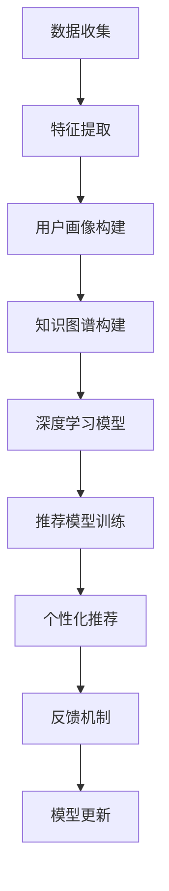

                 

# 知识发现引擎的用户兴趣推荐算法

> 关键词：知识发现，用户兴趣，推荐算法，协同过滤，深度学习，个性化推荐系统

## 1. 背景介绍

在信息爆炸的互联网时代，如何从海量数据中发现有用的知识，并将其高效地推荐给用户，是一个亟待解决的难题。传统的推荐系统主要基于协同过滤、内容推荐等方法，这些方法在提升用户满意度、增加用户留存等方面取得了显著效果。然而，随着数据量指数级增长和用户需求日趋复杂，传统推荐系统面临着冷启动问题、数据稀疏性、动态需求变化等挑战。

近年来，知识图谱、深度学习等新兴技术在推荐系统中的应用，开辟了推荐算法的新篇章。知识图谱将数据结构化，通过图结构的推理路径，挖掘出更深层次的知识关联。深度学习赋予推荐系统更强的学习能力和泛化能力，能够从用户行为中学习到更复杂的特征和规律。基于这些技术的推荐系统，通过探索用户兴趣的底层关联和演化路径，极大地提升了推荐的准确性和个性化水平。

## 2. 核心概念与联系

### 2.1 核心概念概述

为更好地理解基于深度学习的推荐算法，本节将介绍几个关键概念：

- 知识发现（Knowledge Discovery）：从海量数据中挖掘出有价值的知识和规律的过程，广泛应用于商业智能、信息检索、社交网络等领域。

- 用户兴趣（User Interest）：用户在一定时间内的行为偏好和需求倾向，是推荐算法的重要输入。

- 推荐算法（Recommendation Algorithm）：通过分析用户行为、物品属性、上下文信息等数据，预测用户可能感兴趣的物品或内容，为用户提供个性化的推荐服务。

- 协同过滤（Collaborative Filtering）：一种基于用户行为相似性的推荐方法，通过寻找相似用户或相似物品来推荐新的物品。

- 深度学习（Deep Learning）：一种强大的机器学习方法，通过多层神经网络模拟人脑的特征提取和模式识别能力，在推荐系统中的应用主要有CBF、NeuMF等。

- 知识图谱（Knowledge Graph）：一种以图结构表示实体和关系的数据模型，通过图推理的方式，挖掘实体之间的深层关联。

- 个性化推荐系统（Personalized Recommendation System）：利用用户的历史行为、兴趣和偏好，为其推荐个性化的物品或内容，满足用户个性化需求，提升用户体验。

这些核心概念之间具有紧密的逻辑联系，共同构成了推荐算法的理论基础和应用框架。通过对这些概念的深入理解，我们可以更好地把握推荐算法的关键技术细节和优化方向。

### 2.2 核心概念原理和架构的 Mermaid 流程图



这个流程图展示了推荐算法的核心过程：

1. 从不同数据源收集数据。
2. 对数据进行特征提取，构建用户画像。
3. 构建知识图谱，发现实体之间的深层关联。
4. 应用深度学习模型，学习用户行为和物品属性。
5. 训练推荐模型，生成推荐结果。
6. 根据用户反馈，更新推荐模型。

## 3. 核心算法原理 & 具体操作步骤

### 3.1 算法原理概述

基于深度学习的推荐算法，主要通过多层神经网络从用户行为数据中学习到个性化的兴趣特征，并将这些特征用于预测用户对新物品的评分或点击概率。深度学习模型具有较强的泛化能力和特征提取能力，能够从高维稀疏数据中挖掘出更有意义的特征，提升推荐的准确性。

具体而言，推荐算法通常分为训练和推理两个阶段：

- 训练阶段：通过用户行为数据、物品属性、用户画像等输入，训练推荐模型，学习用户兴趣和物品属性的映射关系。
- 推理阶段：将用户画像作为输入，通过训练好的推荐模型预测用户对新物品的评分或点击概率，并根据排序结果推荐给用户。

### 3.2 算法步骤详解

以下是一般基于深度学习的推荐算法的详细步骤：

**Step 1: 数据预处理**

- 从不同数据源（如电商平台、社交网络、新闻平台等）收集用户行为数据，如浏览记录、购买记录、评价记录等。
- 对数据进行清洗、去重、补全等预处理操作，去除噪音数据。
- 将数据划分训练集、验证集和测试集，供模型训练和评估。

**Step 2: 特征提取**

- 对用户行为数据进行特征工程，提取用户兴趣、物品属性等特征。
- 使用NLP技术对文本数据进行分词、词向量化等操作，将用户行为转换为数值型特征。
- 应用PCA、LDA等降维技术，减少高维数据的维度，提升特征的表达能力。

**Step 3: 构建用户画像**

- 通过聚类、协同过滤等方法，发现用户行为中的共同特征，构建用户画像。
- 将用户画像表示为低维向量，方便模型进行预测。

**Step 4: 构建知识图谱**

- 收集领域相关的实体和关系数据，构建知识图谱。
- 使用关系抽取、实体识别等技术，从非结构化数据中提取实体和关系信息。
- 应用图神经网络（GNN）等模型，在知识图谱上学习实体和关系之间的深层关联。

**Step 5: 训练深度学习模型**

- 选择适合的深度学习模型（如CBF、NeuMF、KG-BASE等），对用户行为和物品属性进行学习。
- 应用交叉验证等技术，调整模型超参数，优化模型性能。
- 训练完成后，保存模型参数，供后续推理使用。

**Step 6: 推理与推荐**

- 根据用户画像，输入到训练好的深度学习模型中，预测用户对新物品的评分或点击概率。
- 根据预测结果，对物品进行排序，生成个性化推荐列表。
- 将推荐结果展示给用户，收集用户反馈，更新推荐模型。

### 3.3 算法优缺点

基于深度学习的推荐算法具有以下优点：

- 能够处理高维稀疏数据，提升推荐的准确性。
- 可以学习到更复杂的特征和规律，提高推荐的多样性和个性化水平。
- 能够适应用户行为的变化，具有较好的动态性。

然而，这类算法也存在一些局限性：

- 对标注数据的依赖较大，需要大量的用户行为数据进行训练。
- 模型复杂度高，训练和推理速度较慢。
- 需要较复杂的深度学习框架和硬件支持，对技术要求较高。

尽管存在这些局限性，但基于深度学习的推荐算法在实际应用中已经取得了显著的效果，为个性化推荐系统的发展提供了重要动力。

### 3.4 算法应用领域

基于深度学习的推荐算法，广泛应用于各类个性化推荐系统，包括但不限于：

- 电商平台：为用户推荐商品、促销信息等。
- 社交网络：为用户推荐朋友、内容、活动等。
- 视频平台：为用户推荐影片、电视剧、视频等。
- 新闻平台：为用户推荐新闻、文章、评论等。
- 音乐平台：为用户推荐歌曲、专辑、播放列表等。
- 移动应用：为用户推荐内容、服务、活动等。

这些推荐系统在提升用户体验、增加用户粘性、驱动业务增长等方面发挥了重要作用，是数字化转型时代的重要工具。

## 4. 数学模型和公式 & 详细讲解 & 举例说明

### 4.1 数学模型构建

本节将使用数学语言对基于深度学习的推荐算法进行更严格的刻画。

记用户画像为 $\mathbf{x} \in \mathbb{R}^n$，物品属性为 $\mathbf{y} \in \mathbb{R}^m$，其中 $n$ 和 $m$ 分别为用户画像和物品属性的维度。设推荐模型的预测输出为 $\mathbf{z} \in \mathbb{R}^1$，表示用户对物品的评分或点击概率。

定义损失函数为交叉熵损失，即：

$$
\mathcal{L}(\theta) = -\frac{1}{N}\sum_{i=1}^N \sum_{j=1}^M y_{ij} \log (M_{\theta}(\mathbf{x}_i, \mathbf{y}_j))
$$

其中 $y_{ij}$ 表示用户 $i$ 对物品 $j$ 的真实评分，$M_{\theta}(\mathbf{x}_i, \mathbf{y}_j)$ 表示模型预测用户 $i$ 对物品 $j$ 的评分或点击概率。

目标是最小化损失函数，得到模型参数 $\theta$：

$$
\theta^* = \mathop{\arg\min}_{\theta} \mathcal{L}(\theta)
$$

### 4.2 公式推导过程

以下我们以CBF算法为例，推导其具体公式和参数更新方法。

CBF算法是一种基于协同过滤的推荐方法，通过计算用户与物品的相似度，预测用户对新物品的评分。具体而言，CBF算法通过用户-物品评分矩阵 $\mathbf{R} \in \mathbb{R}^{N \times M}$，计算用户与物品之间的余弦相似度，并根据相似度对物品进行排序推荐。

余弦相似度的计算公式为：

$$
\text{similarity}(\mathbf{x}, \mathbf{y}) = \cos \langle \mathbf{x}, \mathbf{y} \rangle = \frac{\mathbf{x} \cdot \mathbf{y}}{\|\mathbf{x}\|\|\mathbf{y}\|}
$$

其中 $\mathbf{x} \cdot \mathbf{y}$ 表示向量点积，$\|\mathbf{x}\|$ 和 $\|\mathbf{y}\|$ 分别表示向量 $\mathbf{x}$ 和 $\mathbf{y}$ 的模长。

CBF算法的预测公式为：

$$
\hat{r}_{ij} = \mathbf{x}_i \cdot \mathbf{y}_j / (\|\mathbf{x}_i\|\|\mathbf{y}_j\|)
$$

其中 $\hat{r}_{ij}$ 表示用户 $i$ 对物品 $j$ 的预测评分。

在训练过程中，损失函数为均方误差损失：

$$
\mathcal{L}(\theta) = \frac{1}{N}\sum_{i=1}^N \sum_{j=1}^M (\hat{r}_{ij} - r_{ij})^2
$$

目标是最小化损失函数，得到模型参数 $\theta$：

$$
\theta^* = \mathop{\arg\min}_{\theta} \mathcal{L}(\theta)
$$

### 4.3 案例分析与讲解

考虑一个在线音乐平台的用户推荐系统，用户画像为 $x = [1, 0, 1, 0, 1]$，物品属性为 $y = [1, 0, 1]$，其中 $1$ 表示喜欢，$0$ 表示不喜欢。假设模型预测用户对新歌曲的评分 $z = 0.9$，则推荐系统将歌曲按照评分排序推荐给用户。

通过余弦相似度计算，用户与物品之间的相似度为：

$$
\text{similarity}(x, y) = \frac{x \cdot y}{\|x\|\|y\|} = \frac{1 \times 1 + 0 \times 0 + 1 \times 1}{\sqrt{1^2+0^2+1^2} \times \sqrt{1^2+0^2+1^2}} = \frac{2}{\sqrt{3} \times \sqrt{3}} = 1
$$

因此，推荐系统将物品按照相似度排序，依次推荐给用户。

## 5. 项目实践：代码实例和详细解释说明

### 5.1 开发环境搭建

在进行推荐算法开发前，我们需要准备好开发环境。以下是使用Python进行PyTorch开发的环境配置流程：

1. 安装Anaconda：从官网下载并安装Anaconda，用于创建独立的Python环境。

2. 创建并激活虚拟环境：
```bash
conda create -n recommendation-env python=3.8 
conda activate recommendation-env
```

3. 安装PyTorch：根据CUDA版本，从官网获取对应的安装命令。例如：
```bash
conda install pytorch torchvision torchaudio cudatoolkit=11.1 -c pytorch -c conda-forge
```

4. 安装各类工具包：
```bash
pip install numpy pandas scikit-learn matplotlib tqdm jupyter notebook ipython
```

完成上述步骤后，即可在`recommendation-env`环境中开始推荐算法开发。

### 5.2 源代码详细实现

下面我们以CBF算法为例，给出使用PyTorch实现的代码。

```python
import torch
import torch.nn as nn
import torch.nn.functional as F

class CBF(nn.Module):
    def __init__(self, n_users, n_items):
        super(CBF, self).__init__()
        self.user_embedding = nn.Embedding(n_users, 10)
        self.item_embedding = nn.Embedding(n_items, 10)
        self.cosine_similarity = nn.CosineSimilarity(dim=1, eps=1e-6)
        
    def forward(self, user_idx, item_idx):
        user_embedding = self.user_embedding(user_idx)
        item_embedding = self.item_embedding(item_idx)
        similarity = self.cosine_similarity(user_embedding, item_embedding)
        rating_pred = similarity
        return rating_pred

# 数据集准备
N = 1000  # 用户数量
M = 10000  # 物品数量
user_idx = torch.randint(0, N, (N, ), dtype=torch.long)
item_idx = torch.randint(0, M, (N, ), dtype=torch.long)
rating = torch.randn(N, M)
rating = (rating - rating.mean()) / rating.std()

# 训练
model = CBF(N, M)
optimizer = torch.optim.Adam(model.parameters(), lr=0.001)
criterion = nn.MSELoss()
epochs = 100
for epoch in range(epochs):
    rating_pred = model(user_idx, item_idx)
    loss = criterion(rating_pred, rating)
    optimizer.zero_grad()
    loss.backward()
    optimizer.step()

# 测试
user_idx_test = torch.randint(0, N, (50, ), dtype=torch.long)
item_idx_test = torch.randint(0, M, (50, ), dtype=torch.long)
rating_pred_test = model(user_idx_test, item_idx_test)
print(rating_pred_test)
```

在这个例子中，我们使用PyTorch实现了CBF算法，通过用户-物品评分矩阵进行相似度计算，预测用户对新物品的评分。代码实现了模型的前向传播、损失计算、梯度更新等核心过程。

### 5.3 代码解读与分析

让我们再详细解读一下关键代码的实现细节：

**CBF类**：
- `__init__`方法：初始化用户和物品的嵌入向量，以及余弦相似度计算模块。
- `forward`方法：计算余弦相似度，并输出预测评分。

**数据集准备**：
- 定义用户和物品的数量，生成随机评分矩阵。
- 计算评分矩阵的均值和标准差，对评分进行标准化处理。

**训练过程**：
- 创建CBF模型和Adam优化器，并定义均方误差损失函数。
- 循环迭代训练，在每个epoch中计算损失、更新模型参数。

**测试过程**：
- 使用测试集样本进行模型预测，并输出预测评分。

可以看到，使用PyTorch进行深度学习模型的开发，可以大大简化模型的定义和训练过程，使开发者能够更加专注于算法的创新和优化。

## 6. 实际应用场景

### 6.1 电商平台

电商平台中的推荐系统，需要根据用户浏览、购买、评价等行为，为用户推荐商品、促销信息等。通过深度学习模型，电商平台可以从海量的用户行为数据中学习到用户的兴趣和需求，生成个性化的推荐列表，提升用户体验和转化率。

### 6.2 社交网络

社交网络中的推荐系统，需要根据用户的兴趣、关系、互动行为等数据，为用户推荐朋友、内容、活动等。通过深度学习模型，社交网络可以发现用户之间的兴趣共性，生成多样化的推荐内容，增加用户粘性和互动。

### 6.3 视频平台

视频平台中的推荐系统，需要根据用户观看历史、评分、评论等数据，为用户推荐影片、电视剧、视频等。通过深度学习模型，视频平台可以从用户的观看行为中学习到兴趣偏好，生成个性化的推荐视频，提升用户的观看体验和满意度。

### 6.4 新闻平台

新闻平台中的推荐系统，需要根据用户的阅读行为、评分、评论等数据，为用户推荐新闻、文章、评论等。通过深度学习模型，新闻平台可以发现用户的新闻兴趣，生成个性化的推荐内容，提升用户阅读量和平台活跃度。

## 7. 工具和资源推荐

### 7.1 学习资源推荐

为了帮助开发者系统掌握深度学习推荐算法，这里推荐一些优质的学习资源：

1. 《深度学习推荐系统》书籍：详细介绍了推荐系统的理论基础和实现方法，涵盖协同过滤、深度学习、知识图谱等核心技术。
2. CS294M《机器学习课程》讲义：斯坦福大学开设的机器学习课程，包含推荐系统的经典算法和最新研究，适合深入学习。
3. 《推荐系统实战》课程：通过动手实践，从零到一构建推荐系统，涵盖推荐算法、特征工程、模型调优等重要内容。
4. HuggingFace官方文档：提供了丰富的深度学习框架和推荐模型样例代码，方便学习实践。
5. Kaggle竞赛：参加Kaggle推荐系统竞赛，实战锻炼算法优化和模型调参能力。

通过对这些资源的学习实践，相信你一定能够快速掌握深度学习推荐算法的精髓，并用于解决实际的推荐问题。

### 7.2 开发工具推荐

高效的开发离不开优秀的工具支持。以下是几款用于推荐系统开发的常用工具：

1. PyTorch：基于Python的开源深度学习框架，灵活动态的计算图，适合快速迭代研究。大部分的深度学习推荐模型都有PyTorch版本的实现。
2. TensorFlow：由Google主导开发的开源深度学习框架，生产部署方便，适合大规模工程应用。同样有丰富的深度学习推荐模型资源。
3. LightFM：由Facebook开发的深度学习推荐系统，支持协同过滤和深度学习两种推荐方式，适用于电商、社交等场景。
4. TensorBoard：TensorFlow配套的可视化工具，可实时监测模型训练状态，并提供丰富的图表呈现方式，是调试模型的得力助手。
5. Weights & Biases：模型训练的实验跟踪工具，可以记录和可视化模型训练过程中的各项指标，方便对比和调优。

合理利用这些工具，可以显著提升推荐系统的开发效率，加快创新迭代的步伐。

### 7.3 相关论文推荐

深度学习推荐系统的发展源于学界的持续研究。以下是几篇奠基性的相关论文，推荐阅读：

1. Factorization Machines for Learning Nonlinear Feature Interactions：提出FM模型，从矩阵分解的角度学习特征之间的非线性交互，在推荐系统中的应用取得了显著效果。
2. Deep Matrix Factorization for Recommendations：提出DNN模型，通过多层神经网络学习用户行为和物品属性，提升了推荐的准确性和多样性。
3. Knowledge-Graph-Based Recommender Systems：提出KG-BASE模型，通过知识图谱融合实体和关系信息，提升了推荐系统的效果。
4. Neural Collaborative Filtering：提出NeuMF模型，通过神经网络结构化协同过滤，提升了推荐系统的泛化能力和实时性。
5. Attention-Based Recommender Systems：提出Attention模型，通过注意力机制学习用户和物品之间的关注度，提升了推荐的个性化水平。

这些论文代表了大深度学习推荐系统的发展脉络。通过学习这些前沿成果，可以帮助研究者把握学科前进方向，激发更多的创新灵感。

## 8. 总结：未来发展趋势与挑战

### 8.1 总结

本文对基于深度学习的推荐算法进行了全面系统的介绍。首先阐述了推荐算法的背景和意义，明确了深度学习推荐算法在提升个性化推荐系统性能方面的独特价值。其次，从原理到实践，详细讲解了推荐算法的数学模型和操作步骤，给出了推荐系统开发的完整代码实例。同时，本文还广泛探讨了推荐算法在电商、社交、视频等不同领域的应用前景，展示了推荐算法在不同场景下的强大应用能力。

通过本文的系统梳理，可以看到，基于深度学习的推荐算法在实际应用中已经取得了显著的效果，为个性化推荐系统的发展提供了重要动力。未来，伴随深度学习模型的不断演进和推荐算法技术的持续进步，相信推荐系统将在更多领域得到应用，为数字化转型时代注入新的活力。

### 8.2 未来发展趋势

展望未来，深度学习推荐系统将呈现以下几个发展趋势：

1. 深度学习模型的复杂度将持续增大。随着预训练大模型的应用，深度学习推荐系统将从浅层结构向深层结构发展，学习更加复杂的特征和规律，提升推荐的效果。

2. 推荐算法的融合将更加多样化。深度学习推荐系统将与知识图谱、社交网络、时间序列等技术结合，形成多模态、多域、动态的推荐模型。

3. 推荐系统的实时性将进一步提高。随着硬件设备的升级和计算能力的增强，深度学习推荐系统将更加注重实时性，提升推荐系统的响应速度和用户体验。

4. 推荐系统将更加注重用户隐私和安全性。随着数据隐私和信息安全的日益重视，推荐系统将加强用户数据保护，提升系统的透明性和可解释性。

5. 推荐系统的跨领域应用将更加广泛。深度学习推荐系统将从单一领域走向跨领域，应用到更多实际场景，如金融、医疗、教育等。

这些趋势凸显了深度学习推荐系统的广阔前景。这些方向的探索发展，必将进一步提升推荐系统的性能和应用范围，为数字化转型时代注入新的活力。

### 8.3 面临的挑战

尽管深度学习推荐系统已经取得了显著的进展，但在迈向更加智能化、普适化应用的过程中，它仍面临着诸多挑战：

1. 数据稀疏性问题。由于用户行为数据通常稀疏，难以构建完整的用户画像，导致推荐系统难以覆盖所有用户需求。

2. 模型复杂度较高。深度学习推荐模型通常参数量巨大，训练和推理速度较慢，难以适应实时化要求。

3. 推荐冷启动问题。新用户的推荐往往需要较长的历史行为数据积累，难以进行个性化推荐。

4. 模型泛化能力不足。深度学习模型容易过拟合，泛化能力有限，难以适应数据分布的变化。

5. 推荐系统的安全性问题。推荐系统可能引入有害信息，甚至存在偏见，对用户的决策产生误导。

6. 推荐系统的可解释性不足。深度学习模型通常是"黑盒"系统，难以解释其内部工作机制和决策逻辑，对用户不透明。

正视推荐系统面临的这些挑战，积极应对并寻求突破，将是为深度学习推荐系统走向成熟的必由之路。相信随着学界和产业界的共同努力，这些挑战终将一一被克服，深度学习推荐系统必将在构建人机协同的智能时代中扮演越来越重要的角色。

### 8.4 研究展望

面对深度学习推荐系统所面临的挑战，未来的研究需要在以下几个方面寻求新的突破：

1. 探索多模态推荐方法。通过融合文本、图像、视频等多模态数据，提升推荐系统的泛化能力和准确性。

2. 研究用户兴趣的演化路径。通过时间序列模型、因果推理等方法，刻画用户兴趣的动态变化，提升推荐系统的适应性和个性化水平。

3. 引入先验知识图谱。将领域知识、规则等引入推荐系统，提升推荐模型的普适性和解释性。

4. 优化推荐系统的实时性。通过模型压缩、分布式训练等技术，提升推荐系统的实时性和可扩展性。

5. 加强数据隐私保护。通过差分隐私、联邦学习等技术，保护用户数据隐私，增强系统的透明度和可信度。

6. 优化推荐系统的安全性。通过异常检测、用户画像管理等技术，提升推荐系统的安全性和鲁棒性。

这些研究方向的探索，必将引领深度学习推荐系统技术迈向更高的台阶，为构建安全、可靠、可解释、可控的智能推荐系统铺平道路。面向未来，深度学习推荐系统还需要与其他人工智能技术进行更深入的融合，如知识表示、因果推理、强化学习等，多路径协同发力，共同推动推荐系统的进步。

## 9. 附录：常见问题与解答

**Q1：如何处理数据稀疏性问题？**

A: 数据稀疏性是推荐系统中的常见问题，可以通过以下方法进行处理：

1. 填补缺失值：通过均值、中位数、众数等方法填补缺失值，减少稀疏性。

2. 基于协同过滤的推荐方法：利用用户的相似性进行推荐，减少对物品属性的依赖。

3. 基于深度学习的推荐方法：使用神经网络学习用户行为，提升推荐系统的泛化能力。

4. 引入先验知识图谱：通过知识图谱学习实体之间的关联，提升推荐系统的覆盖范围。

**Q2：如何选择推荐模型的超参数？**

A: 推荐模型的超参数选择，通常需要结合实际数据和业务需求进行优化。常用的超参数包括：

1. 学习率：选择较小的学习率，避免模型过拟合。

2. 批大小：根据数据量和计算能力，选择合适的批大小。

3. 嵌入向量维度：选择合适的嵌入向量维度，平衡模型复杂度和推荐效果。

4. 模型结构：选择适合任务需求的模型结构，如浅层、深层、多模态等。

5. 训练轮数：根据模型收敛情况，选择合适的训练轮数。

这些超参数的选择需要通过交叉验证等方法进行验证和优化。

**Q3：如何评估推荐系统的性能？**

A: 推荐系统的性能评估通常采用以下几个指标：

1. 准确率（Accuracy）：评估预测结果与真实结果的一致性，用于静态数据集的评估。

2. 召回率（Recall）：评估预测结果中包含真实结果的比例，用于覆盖度较低的场景。

3. F1分数（F1 Score）：综合考虑准确率和召回率，是常用的综合评价指标。

4. NDCG（Normalized Discounted Cumulative Gain）：衡量模型对排序结果的评估，适用于动态数据集的评估。

5. HR（Hit Rate）：衡量模型对真实结果的命中率，适用于长尾场景。

评估推荐系统的性能，通常需要在测试集上进行准确率、召回率、F1分数等指标的计算，综合考虑不同指标的平衡关系。

**Q4：如何在推荐系统中引入先验知识？**

A: 在推荐系统中引入先验知识，通常有以下几种方法：

1. 知识图谱：构建知识图谱，将领域知识结构化，提升推荐系统的覆盖范围和准确性。

2. 规则引擎：引入规则引擎，定义推荐系统的规则和逻辑，提升推荐系统的透明性和可解释性。

3. 特征工程：通过特征工程，将领域知识融入推荐模型的特征中，提升推荐系统的泛化能力。

4. 专家知识：引入领域专家的知识和经验，提升推荐系统的普适性和可靠性。

通过以上方法，可以在推荐系统中引入先验知识，提升系统的性能和可解释性。

**Q5：如何在推荐系统中保护用户隐私？**

A: 在推荐系统中保护用户隐私，通常有以下几种方法：

1. 差分隐私：通过添加噪声等方法，保护用户数据的隐私，防止数据泄露。

2. 联邦学习：将数据分布在不同的设备上，通过分布式训练保护用户隐私。

3. 匿名化处理：对用户数据进行匿名化处理，防止个人信息泄露。

4. 用户画像管理：限制用户画像的存储和访问，防止数据滥用。

通过以上方法，可以在推荐系统中保护用户隐私，提升系统的透明性和可信度。

---

作者：禅与计算机程序设计艺术 / Zen and the Art of Computer Programming

